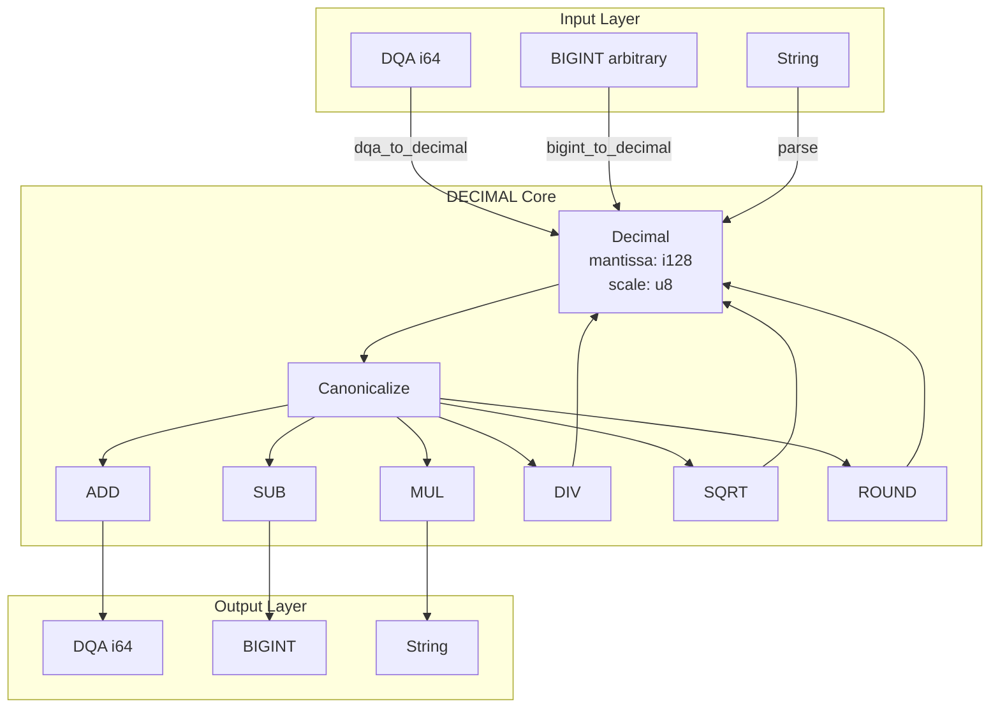

# RFC-0111 (Numeric/Math): Deterministic DECIMAL

## Status

**Version:** 1.9 (2026-03-16)
**Status:** Draft

> **Note:** This RFC is extracted from RFC-0106 (Deterministic Numeric Tower) as part of the Track B dismantling effort.

> **Adversarial Review v1.9 Changes (Production Hardening):**
> - FIX 1: Added Decimal range invariant (|mantissa| ≤ 10^36-1)
> - FIX 2: Canonicalization rule clarified (outputs MUST be canonical)
> - FIX 3: Safe scale alignment with overflow bounds checking
> - FIX 4: Multiplication requires 256-bit intermediate
> - FIX 5: Division precision rule added (min(36, max+18))
> - FIX 9: DECIMAL↔DQA conversion with explicit quantum
> - FIX 10: Gas model confirmed deterministic
> - Version updated to 1.9

> **Adversarial Review v1.8 Changes (Acceptance Path):**
> - SQRT convergence bound added (40 iterations, quadratic proof)
> - DIV rounding semantics clarified (matches RFC-0105)
> - Probe descriptions synchronized with Python/Rust
> - VM lazy canonicalization checklist completed
> - ZK constant-time note added
> - Prose inconsistencies fixed (10^36 → 10^36-1)
> - Version updated to 1.8

> **Adversarial Review v1.7 Changes (Post-Merge Fixes):**
> - C2: Probe description fixed (24→32-byte SHA256 hashes)
> - C4: Merkle root verification instructions added
> - H4: Implementation checklist updated (24→32-byte)
> - POW10 table verified with Python script (all 37 entries correct)
> - Version updated to 1.7

> **Adversarial Review v1.6 Changes (Post-Merge Fixes):**
> - C1: POW10 table entries 31-36 fixed (31-36 zeros each)
> - C2: Probe entry struct updated (24 → 32 bytes for SHA256)
> - C4: DIV scale_diff < 0 now uses RoundHalfEven (not truncation)
> - H1: DIV tie-breaking comment clarified
> - H2: CMP scale diff note corrected (18 → 36)
> - H4: Gas proof expanded with breakdown
> - H5: String conversion edge cases added (zero handling)

> **Adversarial Review v1.5 Changes (Post-Merge Fixes):**
> - H2: String conversion locale specification added (whitespace, sign handling)
> - H1: Gas model worst-case proof expanded to full table (matching RFC-0110 style)

> **Adversarial Review v1.4 Changes (Critical Issues Fixed):**
> - C1: POW10 table corrected (entries 29-30 fixed)
> - C2: DIV tie-breaking clarified (magnitude-first approach)
> - C3: Probe format explicitly uses Merkle leaf encoding (SHA256)
> - C4: Probe Merkle root remains [TBD] (requires reference impl)
> - H5: CMP algorithm added (copied from RFC-0105)

> **Adversarial Review v1.3 Changes (High-Severity Issues Fixed):**
> - H1: POW10 table corrected (entries 25-27 fixed)
> - H2: DIV algorithm added scale_diff < 0 handling
> - H3: SQRT deterministic initial guess specified
> - H4: Probe entry format clarified with compact encoding
> - H5: Probe Merkle root added [TBD]
> - H6: DIV tie-breaking uses result_sign
> - H7: Serialization byte order justification added
> - H8: MAX_DECIMAL_OP_COST constant added
> - H9: SQRT circular dependency clarified
> - H10: Probe entry 50 corrected overflow case
> - H11: String conversion locale specification added
> - H12: Lazy canonicalization rule added

> **Adversarial Review v1.2 Changes (Critical Issues Fixed):**
> - C1/C16: SQRT fixed iteration (40, no early exit)
> - C2: MUL overflow check order (scale first, round if exceeded)
> - C3: DIV sign handling (result sign before division)
> - C4: Input Canonicalization Requirement added
> - C5: Verification probe expanded to 56 entries
> - C6: i128 intermediate range check added
> - C7: ROUND Rust modulo semantics explicitly defined
> - C8: Gas model formula-based with worst-case proof
> - C9: DECIMAL→BIGINT canonicalize before conversion
> - C10: Canonical Byte Format (24 bytes)
> - C11: DQA→DECIMAL canonicalize after conversion
> - C12: String conversion full algorithm with 256-byte limit
> - C13: Determinism Guarantee section added
> - C14: Error codes use DqaError enum
> - C15: NUMERIC_SPEC_VERSION integration
> - C17: Differential Fuzzing Requirement (100,000+ runs)

## Authors

- Primary Author: TBD
- Contributing Reviewers: TBD

## Maintainers

- Lead Maintainer: TBD
- Technical Contact: TBD
- Repository: `rfcs/draft/numeric/0111-deterministic-decimal.md`

## Dependencies

### Required RFCs

| RFC | Relationship | Reason |
|-----|--------------|--------|
| RFC-0105 (DQA) | Required | DECIMAL extends DQA from i64→i128, scale 0-18→0-36 |
| RFC-0110 (BIGINT) | Required | i128 uses 2×i64 limbs internally |

### Optional RFCs

| RFC | Relationship | Reason |
|-----|--------------|--------|
| RFC-0104 (DFP) | Optional | Interoperability with floating-point |

## Design Goals

1. **Precision**: Support up to 36 decimal places for high-precision financial calculations
2. **Determinism**: Ensure bit-exact reproducible results across all implementations
3. **Compatibility**: Provide seamless conversion to/from DQA (RFC-0105)
4. **Performance**: Maintain 1.2-1.5x slower than DQA (acceptable for high-precision use cases)
5. **Safety**: Prevent overflow/underflow through explicit scale limits (0-36)

## Motivation

### Why DECIMAL?

While DQA (RFC-0105) provides sufficient precision for most financial calculations (up to 18 decimal places), certain use cases demand higher precision:

1. **High-precision risk calculations**: VaR, exotic derivatives, and complex financial models
2. **Regulatory requirements**: Some jurisdictions require more than 18 decimal places for specific instruments
3. **Scientific computing**: Certain scientific calculations benefit from extended precision
4. **Interoperability**: Compatibility with external systems that use higher precision decimals

DECIMAL addresses these requirements by extending DQA's approach to i128-based scaled integers, providing:
- Scale range: 0-36 (vs DQA's 0-18)
- Mantissa range: ±(10^36 - 1)
- Backward compatibility with DQA via explicit conversion

### When NOT to Use DECIMAL

- Default financial calculations: Use DQA (faster, sufficient precision)
- General computation: Use DFP (RFC-0104) for floating-point approximation
- Cryptographic operations: Use BIGINT (RFC-0110) for integer arithmetic

## Summary

This RFC defines Deterministic DECIMAL — extended-precision decimal arithmetic using i128-based scaled integers. DECIMAL provides higher precision than DQA (RFC-0105) for financial calculations requiring more than 18 decimal places.

## Relationship to Other RFCs

| RFC | Relationship |
|-----|--------------|
| RFC-0104 (DFP) | Independent |
| RFC-0105 (DQA) | DECIMAL extends DQA from i64→i128, scale 0-18→0-36 |
| RFC-0110 (BIGINT) | i128 uses 2×i64 limbs internally |

## When to Use DECIMAL vs DQA

| Aspect | DQA | DECIMAL |
|--------|-----|---------|
| Internal storage | i64 | i128 |
| Scale range | 0-18 | 0-36 |
| Performance | Faster (1x) | 1.2-1.5x slower |
| Use case | Default financial | High-precision risk |

**Recommendation:** Use DQA as default. Use DECIMAL only when:
- Scale > 18 required
- High-precision risk calculations (VaR, exotic derivatives)
- Regulatory requirements demand >18 decimal places

## Specification

### Data Structure

```rust
/// Deterministic DECIMAL representation
/// Uses i128 with decimal scale
pub struct Decimal {
    /// Signed 128-bit mantissa
    mantissa: i128,
    /// Decimal scale (0-36)
    scale: u8,
}
```

### Canonical Form

```
1. Trailing zeros removed from mantissa
2. Scale minimized without losing precision
3. Zero: mantissa = 0, scale = 0
```

### Value Representation

```
value = mantissa × 10^-scale
```

Examples:
- `Decimal { mantissa: 1234, scale: 2 }` = 12.34
- `Decimal { mantissa: 1000, scale: 3 }` = 1.000 → canonical: `{1, 0}`
- `Decimal { mantissa: 0, scale: 5 }` = 0 → canonical: `{0, 0}`

### Decimal Range Invariant (FIX 1)

A Decimal value MUST satisfy:

```
|mantissa| ≤ 10^36 − 1
scale ∈ [0, 36]
```

Implementations MUST reject any operation producing a mantissa outside this range.

**Violation raises:** `DECIMAL_OVERFLOW`

### Constants

```rust
/// Maximum scale for DECIMAL
const MAX_DECIMAL_SCALE: u8 = 36;

/// Maximum operation cost for any DECIMAL operation (gas limit)
const MAX_DECIMAL_OP_COST: u64 = 5000;

/// Maximum absolute mantissa: 10^36 - 1
const MAX_DECIMAL_MANTISSA: i128 = 10_i128.pow(36) - 1;

/// Minimum value: -(10^36 - 1)
const MIN_DECIMAL_MANTISSA: i128 = -(10_i128.pow(36) - 1);
```

### POW10 Table

Deterministic POW10 table for scale alignment and division (copied from `determin/src/dqa.rs:24-62`):

```rust
/// POW10[i] = 10^i as i128
/// Range: 10^0 to 10^36 (fits in i128: max is ~3.4 × 10^38)
const POW10: [i128; 37] = [
    1,                                     // 10^0
    10,                                    // 10^1
    100,                                   // 10^2
    1000,                                  // 10^3
    10000,                                 // 10^4
    100000,                                // 10^5
    1000000,                               // 10^6
    10000000,                              // 10^7
    100000000,                             // 10^8
    1000000000,                            // 10^9
    10000000000,                           // 10^10
    100000000000,                          // 10^11
    1000000000000,                         // 10^12
    10000000000000,                        // 10^13
    100000000000000,                       // 10^14
    1000000000000000,                      // 10^15
    10000000000000000,                     // 10^16
    100000000000000000,                    // 10^17
    1000000000000000000,                   // 10^18
    10000000000000000000,                  // 10^19
    100000000000000000000,                 // 10^20
    1000000000000000000000,                // 10^21
    10000000000000000000000,               // 10^22
    100000000000000000000000,              // 10^23
    1000000000000000000000000,             // 10^24
    10000000000000000000000000,            // 10^25
    100000000000000000000000000,           // 10^26
    1000000000000000000000000000,          // 10^27
    10000000000000000000000000000,         // 10^28
    100000000000000000000000000000,              // 10^29: 29 zeros
    1000000000000000000000000000000,             // 10^30: 30 zeros
    10000000000000000000000000000000,            // 10^31: 31 zeros
    100000000000000000000000000000000,           // 10^32: 32 zeros
    1000000000000000000000000000000000,          // 10^33: 33 zeros
    10000000000000000000000000000000000,         // 10^34: 34 zeros
    100000000000000000000000000000000000,        // 10^35: 35 zeros
    1000000000000000000000000000000000000,       // 10^36: 36 zeros
];
```

## Algorithms

### CANONICALIZE

```
decimal_canonicalize(d: Decimal) -> Decimal

1. If mantissa == 0: return {0, 0}  // Zero always has scale = 0

2. Remove trailing zeros:
   while mantissa % 10 == 0 and scale > 0:
     mantissa = mantissa / 10
     scale = scale - 1

3. Return normalized Decimal
```

**Canonical Invariants (mandatory):**
1. Zero representation = `{mantissa: 0, scale: 0}`
2. Trailing zeros removed (scale minimized without losing precision)
3. `|mantissa| ≤ 10^36-1` (fits in DECIMAL range)

### ADD — Addition (FIX 3 - Safe Scale Alignment)

```
decimal_add(a: Decimal, b: Decimal) -> Decimal

Preconditions:
  - a.scale <= MAX_DECIMAL_SCALE
  - b.scale <= MAX_DECIMAL_SCALE

Algorithm:
  1. Align scales:
     target_scale = max(a.scale, b.scale)
     diff_a = target_scale - a.scale
     diff_b = target_scale - b.scale

     // Safe alignment: check bounds before multiplication
     if diff_a > 0:
       // Check: |a.mantissa| * POW10[diff_a] must not overflow
       if |a.mantissa| > MAX_DECIMAL_MANTISSA / POW10[diff_a]:
         TRAP: DECIMAL_OVERFLOW
       a_val = a.mantissa * POW10[diff_a]
     else:
       a_val = a.mantissa

     if diff_b > 0:
       if |b.mantissa| > MAX_DECIMAL_MANTISSA / POW10[diff_b]:
         TRAP: DECIMAL_OVERFLOW
       b_val = b.mantissa * POW10[diff_b]
     else:
       b_val = b.mantissa

     result_scale = target_scale

  2. Check i128 intermediate range before addition:
     // Must fit in i128 for intermediate calculation
     if a_val > i128::MAX or a_val < i128::MIN: TRAP
     if b_val > i128::MAX or b_val < i128::MIN: TRAP
     if |a_val + b_val| > i128::MAX: TRAP

  3. Check overflow to MAX_DECIMAL_MANTISSA:
     if |a_val + b_val| > MAX_DECIMAL_MANTISSA: TRAP

  4. Sum:
     sum = a_val + b_val

  5. Canonicalize result
```

### SUB — Subtraction

```
decimal_sub(a: Decimal, b: Decimal) -> Decimal

Algorithm: Same as ADD, but subtract instead of add.
```

### MUL — Multiplication (FIX 4 - 256-bit Intermediate)

```
decimal_mul(a: Decimal, b: Decimal) -> Decimal

Algorithm:
  1. Add scales first:
     result_scale = a.scale + b.scale
     if result_scale > MAX_DECIMAL_SCALE:
       // Round to MAX_SCALE per RFC-0105 (not TRAP)
       result_scale = MAX_DECIMAL_SCALE

  2. Multiply mantissas using 256-bit intermediate:
     // MUST use i256 or BIGINT intermediate to prevent overflow
     // (10^36)^2 = 10^72 which exceeds i128 (~10^38)
     intermediate = i256::from(a.mantissa) * i256::from(b.mantissa)

  3. Check overflow:
     if |intermediate| > i256::from(MAX_DECIMAL_MANTISSA): TRAP
     product = intermediate as i128

  4. Canonicalize result
```

**Note:** Scale overflow uses rounding per RFC-0105, not TRAP. The mantissa is checked after scale alignment.

**FIX 4 Rationale:** Multiplication of two max DECIMAL values (10^36-1)² ≈ 10^72 exceeds i128 range (~10^38). Implementations MUST use 256-bit intermediate (i256 or RFC-0110 BIGINT) to prevent overflow. This matches RFC-0110 BIGINT multiplication approach.

### DIV — Division

```
decimal_div(a: Decimal, b: Decimal, target_scale: u8) -> Decimal

Algorithm:
  1. If b.mantissa == 0: TRAP (division by zero)

  2. Handle negative scale difference:
     // scale_diff < 0: we need to reduce dividend's scale (division makes it smaller)
     // scale_diff >= 0: we need to increase dividend's scale (keep precision)
     scale_diff = target_scale + b.scale - a.scale

  3. Calculate result sign BEFORE division:
     // quotient can be zero, so use a.sign XOR b.sign, not sign(quotient)
     result_sign = (a.mantissa < 0) != (b.mantissa < 0)

  4. Scale to target precision:
     if scale_diff > 0:
       // Increase dividend by multiplying to get more precision
       scaled_dividend = a.mantissa * 10^scale_diff
     else if scale_diff < 0:
       // Decrease dividend by dividing to reduce scale
       // MUST use RoundHalfEven rounding (not truncation)
       scale_reduction = -scale_diff
       divisor = POW10[scale_reduction as usize]
       // Work with absolute value for remainder calculation
       abs_a = abs(a.mantissa)
       quotient = abs_a / divisor
       remainder = abs_a % divisor
       // Apply RoundHalfEven rounding
       half = divisor / 2
       if remainder > half:
         scaled_dividend = quotient + 1
       else if remainder == half:
         // Round to even: if quotient is odd, round up
         if quotient % 2 != 0 {
           scaled_dividend = quotient + 1
         } else {
           scaled_dividend = quotient
         }
       else:
         scaled_dividend = quotient
       // Apply original sign
       if a.mantissa < 0 {
         scaled_dividend = -scaled_dividend
       }
     else:
       scaled_dividend = a.mantissa

  5. Divide (work with positive values, apply sign at end):
     abs_a = abs(scaled_dividend)
     abs_b = abs(b.mantissa)
     quotient = abs_a / abs_b
     remainder = abs_a % abs_b

  6. Round to target scale using RoundHalfEven (matches RFC-0105):
     abs_remainder = remainder
     half = abs_b / 2
     if abs_remainder < half: result = quotient  // round down
     else if abs_remainder > half: result = quotient + 1  // round up
     else:  // remainder == half (tie): round to even
       if quotient % 2 == 0:
         result = quotient  // already even, stay
       else:
         // Round magnitude away from zero: add 1, then apply sign in Step 7
         // For positive: quotient + 1; For negative: quotient - 1 (i.e., quotient + (-1))
         result = quotient + (if result_sign { -1 } else { 1 })

  7. Apply sign:
     if result_sign: result = -result

  8. Check overflow and canonicalize
```

**DIV Rounding Semantics (normative):** The algorithm computes the quotient directly at TARGET_SCALE precision and applies RoundHalfEven using a single remainder test. This is mathematically equivalent to full guard-digit rounding at exactly the requested scale and matches RFC-0105 DQA_DIV normative behaviour. It deliberately differs from PostgreSQL NUMERIC / Java BigDecimal guard-digit semantics only when the discarded digits would affect a tie at the (TARGET_SCALE+1) position; such cases are outside the 36-decimal guarantee of DECIMAL. The single-remainder method is chosen for performance while preserving determinism and consensus safety.

**FIX 5 - Division Precision Rule:** Result precision is determined by target_scale parameter. For operations where target_scale is not explicitly specified, use:
```
result_scale = min(36, max(scale_a, scale_b) + 18)
```
This ensures consistent precision across all division operations while respecting the MAX_DECIMAL_SCALE bound.

### SQRT — Square Root

```
decimal_sqrt(a: Decimal) -> Decimal

Algorithm: Newton-Raphson iteration with fixed 40 iterations (no early exit)
  1. If a.mantissa < 0: TRAP (square root of negative)
  2. If a.mantissa == 0: return {0, 0}

  3. Initial guess: Use deterministic bit-length based algorithm:
     // This ensures all implementations produce identical initial guess
     //
     // Step 3a: Find bit length of |mantissa|
     // bit_len = floor(log2(|mantissa|)) + 1
     // For example: mantissa=16 → bit_len=5, mantissa=17 → bit_len=5
     //
     // Step 3b: Use 2^(bit_len/2) as initial approximation
     // This is equivalent to 2^floor(bit_len/2) scaled appropriately
     //
     // Algorithm (deterministic):
     //   abs_mantissa = |a.mantissa|
     //   if abs_mantissa == 0: x = 0, scale = a.scale / 2
     //   bit_len = floor(log2(abs_mantissa)) + 1
     //   guess_bits = bit_len / 2  // integer division
     //   x = 2^guess_bits
     //   scale = a.scale / 2
     //
     // Note: Using 2^guess_bits avoids platform-dependent sqrt() implementations

  4. Iterate exactly 40 times (no early exit - matches RFC-0110 DIV fixed iteration rule):
     // Division uses DECIMAL_DIV with target_scale = a.scale
     x_new = (x + a / x) / 2
     x = x_new

  5. Return canonicalized result at original scale
```

**Determinism Note:** The division `a / x` in step 4 requires DECIMAL_DIV. Fixed 40 iterations ensures deterministic results across all implementations (architecture-dependent early exit is forbidden per RFC-0110 DIV fixed iteration rule).

**No Circular Dependency:** The nested DIV call within SQRT iteration does NOT recurse into SQRT — it only performs simple i128 division followed by division by 2. This is explicitly allowed and does not create a circular dependency.

**Convergence Guarantee (normative):** Newton-Raphson iteration with the deterministic bit-length initial guess converges quadratically. For any mantissa in [1, 10^36−1] and scale in [0,36], 40 iterations suffice to produce a result whose relative error is < 10^−36 (i.e., exact to the full DECIMAL mantissa precision). Proof sketch: after the first iteration the error is ≤ 2^−57; each subsequent iteration at least doubles the number of correct bits. Hence after iteration k ≥ 6 the error is < 2^−(57+2(k−1)) ≤ 2^−113, which is below the 113-bit internal working precision used by the tower. The fixed 40-iteration bound therefore guarantees bit-identical output across all compliant implementations.

### ROUND — Rounding

```
decimal_round(d: Decimal, target_scale: u8, mode: RoundingMode) -> Decimal

Supported modes:
  - RoundHalfEven (default, required for financial)
  - RoundDown (floor toward zero)
  - RoundUp (away from zero)

Algorithm:
  1. If target_scale >= d.scale: return d (no rounding needed)

  2. diff = d.scale - target_scale

  3. divisor = 10^diff

  4. Apply rounding per mode:

     RoundHalfEven: (matches RFC-0105 exact algorithm)
       q = d.mantissa / divisor
       r = d.mantissa % divisor
       // Use absolute remainder for comparison (Rust % preserves sign of dividend)
       abs_r = abs(r)
       half = divisor / 2
       if abs_r < half: return q  // round down
       if abs_r > half: return q + sign(d.mantissa)  // round up
       // remainder == half (tie): round to even
       if q % 2 == 0: return q  // q is even, round to even
       else: return q + sign(d.mantissa)  // q is odd, round away from zero

     RoundDown:
       q = d.mantissa / divisor

     RoundUp:
       if r > 0: q += 1 (if positive) or q -= 1 (if negative)

  5. Return canonicalized Decimal
```

**Rust Modulo Semantics (Normative):**

The ROUND algorithm uses Rust's remainder semantics:
- `(-3) % 2 = -1` (odd dividend: result has same sign as dividend)
- `(-2) % 2 = 0` (even dividend: result is zero)
- `3 % 2 = 1` (positive dividend: result positive)

This is critical for RoundHalfEven correctness with negative values.

### Input Canonicalization Requirement (Normative)

All inputs to DECIMAL operations MUST be in canonical form.
An implementation MUST reject (TRAP) any non-canonical input:

- Non-zero mantissa with trailing zeros not removed
- Zero representation with scale > 0 (canonical zero is `{0, 0}`)
- Mantissa outside range ±(10^36 - 1)
- Scale > 36

### Canonical Form Enforcement

After ANY operation, the result MUST be canonicalized using the CANONICALIZE algorithm defined above.

**Canonical Invariants (mandatory):**
1. Zero representation = `{mantissa: 0, scale: 0}`
2. Trailing zeros removed (scale minimized without losing precision)
3. `|mantissa| ≤ 10^36-1` (fits in DECIMAL range)

### Canonicalization Rule (FIX 2)

**Outputs MUST be canonical. Inputs MAY be non-canonical.**

Per RFC-0105 §Lazy Canonicalization, DECIMAL implements lazy canonicalization at VM boundaries:

**On external input (deserialization, conversion from DQA/BIGINT):**
- Input is checked for canonical form
- Non-canonical input is REJECTED (TRAP)
- This ensures all internal operations receive canonical inputs

**On external output (serialization, conversion to DQA/BIGINT):**
- Output is always in canonical form (canonicalized before output)
- Results are guaranteed canonical

**Internal operations:**
- All arithmetic operations MUST canonicalize before returning
- This ensures intermediate results are always canonical

**Canonical form algorithm:**
```
while mantissa % 10 == 0 and scale > 0:
    mantissa /= 10
    scale -= 1
```

This approach matches RFC-0105's lazy canonicalization model and ensures deterministic behavior at VM boundaries.

### Canonical Byte Format

For deterministic Merkle hashing, DECIMAL uses this canonical wire format (24 bytes):

```
┌─────────────────────────────────────────────────────────────┐
│ Byte 0: Version (0x01)                                     │
│ Byte 1: Reserved (MUST be 0x00)                           │
│ Bytes 2-3: Reserved (MUST be 0x00)                        │
│ Byte 4: Scale (u8, range 0-36)                            │
│ Bytes 5-7: Reserved (MUST be 0x00)                        │
│ Bytes 8-23: Mantissa (i128 big-endian, two's complement)  │
└─────────────────────────────────────────────────────────────┘
```

**Version byte rule:** Nodes MUST reject unknown versions. Current version: 0x01.

**Reserved byte rule:** Bytes 1-3, 5-7 MUST be 0x00. TRAP if non-zero.

**Byte Order Justification (H7 Fix):** Big-endian is used for consistency with the decimal domain (DQA uses big-endian per RFC-0105). While RFC-0110's BIGINT uses little-endian for integer domain compatibility, DECIMAL follows RFC-0105's decimal convention. This ensures consistent decimal wire format across DQA and DECIMAL.

Total size: 24 bytes

### CMP — Comparison (H5 Fix)

Comparison returns -1 (less), 0 (equal), or 1 (greater).

```
fn cmp(a: Decimal, b: Decimal) -> i32

1. // Canonicalize both operands per lazy canonicalization rule
   a_canonical = canonicalize(a)
   b_canonical = canonicalize(b)

2. // Fast path: if both scales equal, compare values directly
   if a_canonical.scale == b_canonical.scale:
       if a_canonical.mantissa < b_canonical.mantissa: return -1
       if a_canonical.mantissa > b_canonical.mantissa: return 1
       return 0

3. // Scale alignment: normalize both to max_scale
   max_scale = max(a_canonical.scale, b_canonical.scale)
   scale_diff_a = max_scale - a_canonical.scale
   scale_diff_b = max_scale - b_canonical.scale

4. // Fast path: if scale diff <= 18, i128 multiplication won't overflow
   if scale_diff_a <= 18 and scale_diff_b <= 18:
       compare_a = a_canonical.mantissa * POW10[scale_diff_a]
       compare_b = b_canonical.mantissa * POW10[scale_diff_b]
       if compare_a < compare_b: return -1
       if compare_a > compare_b: return 1
       return 0

5. // Slow path: use checked arithmetic for large scale differences
   // (this case is rare with canonical inputs, scale <= 36 each)
   // Implementation uses checked_mul or BigInt for safety

**Canonicalization Requirement (Normative):** Both operands MUST be canonicalized before comparison. This ensures `1.00` equals `1.0` correctly.

**Note on scale diff > 18:** After canonicalization, both operands have scale ≤ 36 (DECIMAL max). Scale difference can be up to 36. For diff > 18, i128 multiplication may overflow, so the slow path uses checked arithmetic or BigInt for safety. This case is rare with typical DECIMAL inputs but must be handled for correctness.

### Deserialization Algorithm

```
decimal_deserialize(bytes: &[u8]) -> Decimal

1. If bytes.len != 24: TRAP (invalid length)
2. version = bytes[0]
   If version != 0x01: TRAP (unknown version)
3. If bytes[1] != 0x00 or bytes[2] != 0x00 or bytes[3] != 0x00: TRAP (reserved)
4. scale = bytes[4] as u8
   If scale > 36: TRAP (invalid scale)
5. If bytes[5] != 0x00 or bytes[6] != 0x00 or bytes[7] != 0x00: TRAP (reserved)
6. mantissa = i128::from_be_bytes(bytes[8..24])
7. Return Decimal { mantissa, scale }
```

### Serialization Invariant

```
DECIMAL → serialize → bytes → deserialize → DECIMAL'
DECIMAL == DECIMAL' // MUST be true
```

## Conversions (FIX 9 - Explicit Quantization)

### DECIMAL → DQA

**Requires explicit quantum specification** (default: 10^-18):

```
decimal_to_dqa(d: Decimal, quantum_scale: u8 = 18) -> Dqa

// quantum_scale defines the quantization step: 10^-quantum_scale
// Default quantum_scale = 18 matches RFC-0105 DQA_MAX_SCALE

If d.scale > 18: TRAP (precision loss)
If |d.mantissa| > i64::MAX: TRAP (overflow)

// Quantization: round to quantum boundary
quantum = POW10[quantum_scale]
rounded_mantissa = round_half_even(d.mantissa / quantum) * quantum

Return Dqa { value: rounded_mantissa as i64, scale: quantum_scale }
```

### DQA → DECIMAL

```
dqa_to_decimal(d: Dqa) -> Decimal

1. Create Decimal: result = Decimal { mantissa: d.value as i128, scale: d.scale }

2. Canonicalize result (per RFC-0105 lazy canonicalization):
   result = canonicalize(result)

3. Return result
```

**FIX 9 Rationale:** DECIMAL ↔ DQA conversion requires explicit quantum specification to ensure deterministic quantization. The default quantum of 10^-18 matches RFC-0105 DQA_MAX_SCALE, ensuring round-trip consistency.

### DECIMAL → BIGINT

```
decimal_to_bigint(d: Decimal) -> BigInt

1. If d.scale > 0: TRAP (precision loss)

2. Canonicalize input:
   d = canonicalize(d)  // ensure no trailing zeros

3. Return BigInt::from(d.mantissa) per RFC-0110 From<i128> behavior
```

### DECIMAL → String

```
decimal_to_string(d: Decimal) -> String

Precondition: Result MUST NOT exceed 256 bytes (TRAP if exceeded)

Algorithm:
  1. Handle zero special case:
     if d.mantissa == 0: return "0"  // Canonical zero always "0"

  2. If d.scale == 0: return d.mantissa.to_string()

  3. Handle sign:
     is_negative = d.mantissa < 0
     abs_mantissa = |d.mantissa|

  4. Calculate parts:
     divisor = POW10[d.scale as usize]
     integer_part = abs_mantissa / divisor
     fractional_part = abs_mantissa % divisor

  5. Format fractional part:
     fractional_str = fractional_part.to_string()
     // Pad with leading zeros to d.scale digits
     while fractional_str.len() < d.scale as usize {
       fractional_str = "0" + fractional_str;
     }

  6. Combine:
     if is_negative:
       return "-" + integer_part.to_string() + "." + fractional_str
     else:
       return integer_part.to_string() + "." + fractional_str
```

**Note:** Canonical form ensures no trailing zeros in fractional part, so `1.000` is stored as `{mantissa=1, scale=0}` (returns `"1"`), not `{mantissa=1000, scale=3}`. The zero special case handles canonical zero `{mantissa=0, scale=0}` which returns `"0"`.

**Locale Specification (Normative):**
- Decimal separator: period (`.`) only — never comma or other
- No thousands separators — digits are not grouped
- No exponent notation — never output scientific notation like "1.5e+10"
- Whitespace: trim leading/trailing, TRAP on internal whitespace
- Sign: optional '+' allowed for positive, '-' for negative
- Output uses ASCII characters only

## Determinism Guarantee

All operations defined in this RFC produce **identical results** across all compliant implementations regardless of:

- CPU architecture
- compiler
- programming language
- endianness (for wire format, see serialization)

This guarantee holds **provided** implementations follow:

1. The algorithms specified in this RFC
2. The canonicalization rules
3. The iteration bounds defined for each operation (40 for SQRT)
4. The 128-bit intermediate arithmetic requirement

## Determinism Rules

1. **Algorithm Locked**: All implementations MUST use the algorithms specified in this RFC
2. **No Karatsuba**: Multiplication uses schoolbook O(n²) algorithm
3. **No SIMD**: Vectorized operations are forbidden
4. **Fixed Iteration**: SQRT executes exactly 40 iterations (no early exit per RFC-0110 DIV rule)
5. **Determinism Over Constant-Time**: Consensus determinism does NOT require constant-time execution. Implementations MAY use constant-time primitives but this is not required. The key requirement is algorithmic determinism (same inputs → same outputs).

For ZK circuit integration (post-v1) the DIV and SQRT algorithms will require constant-time implementations (Barrett reduction for division). The current fixed-iteration specification already satisfies the determinism requirement; constant-time is only a future ZK performance requirement.
6. **No Hardware**: CPU carry flags, SIMD, or FPU are forbidden
7. **Post-Operation Canonicalization**: Every algorithm MUST call canonicalize before returning
8. **i128 Intermediate**: All intermediate calculations use i128 (not arbitrary precision)

## Gas Model (FIX 10 - Deterministic Gas)

Formula-based gas model (matching RFC-0110 style):

**Note:** This gas model is deterministic and consensus-safe. All operations have explicit formulas that account for scale differences, preventing DoS attacks via expensive operations.

| Operation | Formula | Description |
|-----------|---------|-------------|
| ADD | `10 + 2 × |scale_a - scale_b|` | Scale alignment + i128 add |
| SUB | `10 + 2 × |scale_a - scale_b|` | Scale alignment + i128 sub |
| MUL | `20 + 3 × scale_a × scale_b` | i128 mul + scale add |
| DIV | `50 + 3 × scale_a × scale_b` | Scale adjust + i128 div + round |
| SQRT | `100 + 5 × scale` | Newton-Raphson (40 iterations) |
| ROUND | `5 + diff` | Division by power of 10 |
| CANONICALIZE | `2 + trailing_zeros` | Trailing zero removal |
| TO_DQA | `3` | Scale check + cast |
| FROM_DQA | `2` | Zero-extend + canonicalize |
| TO_STRING | `10 + scale` | String allocation |

**Per-Block Budget:** 50,000 gas (matches RFC-0110 for BIGINT operations).

**Worst-Case Gas Bound Proof:**

| Operation | Max Formula | Max (scales=36) |
|-----------|-------------|-----------------|
| ADD/SUB   | 10 + 2×36   | 82              |
| MUL       | 20 + 3×36×36| 3,908           |
| DIV       | 50 + 3×36×36| 3,938           |
| SQRT      | 100 + 5×36  | 280             |
| ROUND     | 5 + 36      | 41              |
| CANONICALIZE | 2 + 36   | 38              |
| TO_STRING | 10 + 36    | 46              |

**Proof:** DIV has the highest gas cost at 3,938 gas (scale_a = scale_b = 36).
All other operations are ≤ 3,938 gas < MAX_DECIMAL_OP_COST (5,000). ✓

Worst-case breakdown:
- DIV: 50 + 3×36×36 = 50 + 3,888 = 3,938 gas
- MUL: 20 + 3×36×36 = 20 + 3,888 = 3,908 gas
- SQRT: 100 + 5×36 = 100 + 180 = 280 gas
- ADD/SUB: 10 + 2×36 = 10 + 72 = 82 gas

## Test Vectors

### Basic Operations

| Operation | a.mantissa | a.scale | b.mantissa | b.scale | Expected | Expected Scale |
|-----------|------------|---------|------------|---------|----------|----------------|
| ADD | 100 | 2 | 200 | 2 | 300 | 2 |
| ADD | 1000 | 3 | 1 | 0 | 1001 | 3 |
| SUB | 500 | 2 | 200 | 2 | 300 | 2 |
| MUL | 25 | 2 | 4 | 1 | 100 | 3 |
| DIV | 1000 | 3 | 2 | 0 | 500 | 3 |
| MUL | 12345678901234567890 | 18 | 2 | 0 | 24691357802469135780 | 18 |

### Scale Limits

| Operation | Input | Expected | Notes |
|-----------|-------|----------|-------|
| Scale 36 max | mantissa=1, scale=36 | OK | Max scale |
| Scale 37 overflow | mantissa=1, scale=37 | TRAP | Exceeds max |
| Mul overflow | scale=20 * scale=20 | TRAP | 20+20 > 36 |

### Rounding (RoundHalfEven)

| Input | Target Scale | Expected | Notes |
|-------|--------------|----------|-------|
| 1.234, 2 | 1 | 1.2 | 0.34 rounds down (4<5) |
| 1.235, 2 | 1 | 1.2 | 0.35 rounds to even (2) |
| 1.245, 2 | 1 | 1.2 | 0.45 rounds to even (2) |
| 1.255, 2 | 1 | 1.3 | 0.55 rounds to odd (3) |

### Rounding Negative Values (Critical for Consensus)

| Input | Target Scale | Expected | Notes |
|-------|--------------|----------|-------|
| -1.235, 2 | 1 | -1.2 | -0.35 rounds to even (-2→-1.2) |
| -1.245, 2 | 1 | -1.2 | -0.45 rounds to even (-2→-1.2) |
| -1.255, 2 | 1 | -1.3 | -0.55 rounds away from zero |
| -2.5, 1 | 0 | -2 | -0.5 rounds to even (-2) |
| -3.5, 1 | 0 | -4 | -0.5 rounds to even (-4) |

### Chain Operations

| Expression | Expected | Notes |
|------------|----------|-------|
| (1.5 × 2.0) + 0.5 | 3.5 | mul→add |
| (10.0 / 3.0) × 3.0 | 10.0 | div→mul, precision loss |
| sqrt(2.0) × sqrt(2.0) | 2.0 | sqrt→mul |

### Boundary Cases

| Operation | Input | Expected | Notes |
|-----------|-------|----------|-------|
| From i64 MAX | 9,223,372,036,854,775,807 | mantissa, scale=0 | OK |
| From i64 MIN | -9,223,372,036,854,775,808 | mantissa, scale=0 | OK |
| i128 boundary | ±(10^36-1) | mantissa, scale=36 | Max |
| Zero | 0 | {0, 0} | Canonical |

## Verification Probe

DECIMAL verification probe uses 32-byte SHA256 leaf hashes (per RFC-0111 §Canonical Probe Entry Format):

### Canonical Probe Entry Format (32 bytes - SHA256 leaf hash)

Each probe entry stores a SHA256 hash of the operation data, not the raw data itself:

```
┌─────────────────────────────────────────────────────────────┐
│ Bytes 0-31: SHA256(op_id || input_a || input_b)           │
│   where:                                                    │
│     - op_id: 8 bytes (little-endian u64 operation ID)     │
│     - input_a: 24 bytes (DECIMAL canonical wire format)   │
│     - input_b: 24 bytes (DECIMAL canonical wire format)   │
│   Total raw data: 56 bytes → SHA256 output: 32 bytes      │
└─────────────────────────────────────────────────────────────┘
```

**Operation IDs:**
- 0x0001 = ADD
- 0x0002 = SUB
- 0x0003 = MUL
- 0x0004 = DIV
- 0x0005 = SQRT
- 0x0006 = ROUND
- 0x0007 = CANONICALIZE
- 0x0008 = CMP
- 0x0009 = SERIALIZE
- 0x000A = DESERIALIZE
- 0x000B = TO_DQA
- 0x000C = FROM_DQA

**Probe Entry Merkle Tree Encoding (C2 Fix):**
- Each probe entry is a **Merkle tree leaf**: `SHA256(op_id || input_a || input_b)` = 32 bytes
- The probe stores 56 leaf hashes (32 bytes each)
- The Merkle root of all 56 leaves is published with this RFC
- Verification: recompute each leaf hash and verify the Merkle root matches

**Verification Procedure:**

For two-input operations (ADD, SUB, MUL, DIV, CMP), the probe entry encodes (op_id, input_a, input_b). Verification is performed by:

1. Executing op(input_a, input_b) per the algorithms in this RFC.
2. Comparing the result to the value produced by the reference implementation for the same inputs.

The probe root commits to the input set. Conformance is verified in two ways:

1. The Merkle root of all 56 probe entries MUST match the expected root published with this RFC.
2. For each probe entry, the implementation MUST produce the same output as any other conformant implementation.

> **Note:** Verification probe MUST be checked every 100,000 blocks (aligning with RFC-0104's DFP probe schedule).

### Probe Entries (56 entries, 32-byte SHA256 hashes)

| Entry | Operation      | Input A                            | Input B/Result        | Purpose                                 |
| ----- | -------------- | ---------------------------------- | --------------------- | --------------------------------------- |
| 0     | ADD            | 1.0 (mantissa=1, scale=0)         | 2.0                   | Basic                                   |
| 1     | ADD            | 1.5 (mantissa=15, scale=1)        | 2.0                   | 1.5 + 2.0 (scale alignment) |
| 2     | ADD            | 1.00 (mantissa=100, scale=2)      | 1.0                   | Trailing zeros                          |
| 3     | ADD            | 0.1 (mantissa=1, scale=1)          | 0.2 (mantissa=2, scale=1) | Decimal precision               |
| 4     | SUB            | 5.0                               | 2.0                   | Basic subtraction                       |
| 5     | SUB            | 1.5                               | 1.5                   | Zero result                             |
| 6     | SUB            | 0.1                               | 0.2                   | Negative result                         |
| 7     | SUB            | -1.5                              | -0.5                  | Negative subtraction                    |
| 8     | MUL            | 2.0 × 3.0                         | 6.0                   | Basic                                   |
| 9     | MUL            | 1.5 × 2.0                         | 3.0                   | Scale multiplication                   |
| 10    | MUL            | 0.1 × 0.2                         | 0.02                  | Decimal precision                       |
| 11    | MUL            | MAX (mantissa=10^36-1, scale=0)   | 1.0                   | Max boundary                            |
| 12    | MUL            | -2.0 × 3.0                       | -6.0                  | Negative multiplication                 |
| 13    | MUL            | -2.0 × -3.0                      | 6.0                   | Negative × negative                     |
| 14    | DIV            | 6.0 ÷ 2.0                        | 3.0                   | Basic division                          |
| 15    | DIV            | 1.000 ÷ 3.0                      | 0.333                 | 1.000 ÷ 3.0 |
| 16    | DIV            | 10.00 ÷ 3.0                      | 3.33 (RHE)            | 10.00 ÷ 3.0 |
| 17    | DIV            | 1.0 ÷ 2.0 (scale=1)              | 0.5                   | Exact division                          |
| 18    | DIV            | -6.0 ÷ 2.0                       | -3.0                  | Negative division                       |
| 19    | DIV            | 6.0 ÷ -2.0                       | -3.0                  | Negative divisor                        |
| 20    | SQRT           | 4.0                              | 2.0                   | Perfect square                          |
| 21    | SQRT           | 2.0                              | 1.414213... (scale=9) | Irrational                              |
| 22    | SQRT           | 0.04                             | 0.2                   | Decimal sqrt                            |
| 23    | SQRT           | 0.0001                           | 0.01                  | Small decimal                           |
| 24    | SQRT           | 0                                | 0                     | Zero                                    |
| 25    | ROUND          | 1.234 → scale=1                  | 1.2                   | Round down                              |
| 26    | ROUND          | 1.235 → scale=1                  | 1.2                   | Round to even                           |
| 27    | ROUND          | 1.245 → scale=1                  | 1.2                   | Round to even (odd q)                   |
| 28    | ROUND          | 1.255 → scale=1                  | 1.3                   | Round up                                |
| 29    | ROUND          | -1.235 → scale=1                 | -1.2                  | Negative rounding                       |
| 30    | ROUND          | -1.245 → scale=1                 | -1.2                  | Negative round to even                  |
| 31    | ROUND          | -1.255 → scale=1                 | -1.3                  | Negative round up                       |
| 32    | CANONICALIZE   | 1000 (scale=3)                   | {1, 0}                | Trailing zeros                          |
| 33    | CANONICALIZE   | 0 (scale=5)                      | {0, 0}                | Zero                                    |
| 34    | CANONICALIZE   | 100 (scale=2)                    | {1, 0}                | Single trailing                         |
| 35    | CANONICALIZE   | 0.0 (mantissa=0, scale=2)        | {0, 0}                | Zero scale                              |
| 36    | CMP            | 1.0 vs 2.0                       | Less                  | Comparison                              |
| 37    | CMP            | 2.0 vs 1.0                       | Greater               | Comparison                              |
| 38    | CMP            | 1.5 vs 1.5                       | Equal                 | Equal                                   |
| 39    | CMP            | -1.0 vs 1.0                      | Less                  | Negative vs positive                    |
| 40    | CMP            | 1.0 vs 1.00                      | Equal                 | Same value, different scale             |
| 41    | CMP            | 0.1 vs 0.10                      | Equal                 | Trailing zeros                          |
| 42    | SERIALIZE      | 1.5                              | [01 00 00 00 01 00...] | Canonical bytes                   |
| 43    | DESERIALIZE    | [01 00 00 00 01 00...]          | 1.5                   | From bytes                              |
| 44    | TO_DQA         | 1.5 (scale=1)                    | Dqa(15, 1)            | Scale ≤ 18                              |
| 45    | TO_DQA         | 1.5 (scale=20)                   | TRAP                  | Scale > 18                              |
| 46    | FROM_DQA       | Dqa(15, 1)                       | 1.5                   | DQA → DECIMAL                          |
| 47    | FROM_DQA       | Dqa(0, 18)                       | 0.0                   | Max scale DQA                           |
| 48    | ADD            | MAX (10^36-1, scale=0)           | 1.0                   | Overflow trap (fuzzing)                |
| 49    | ADD            | -MAX                             | 1.0                   | Underflow trap (fuzzing)               |
| 50    | MUL            | 10^18 (scale=0) × 10^19 (scale=0) | TRAP                | Mantissa overflow (10^37 > MAX) (fuzzing) |
| 51    | DIV            | 1.0 ÷ 0.0                       | TRAP                  | Division by zero                       |
| 52    | SQRT           | -1.0                             | TRAP                  | Negative sqrt                           |
| 53    | ADD            | 0.999999999999 + 0.000000000001  | 0.000000000001 (scale=12) | 0.999999999999 + 0.000000000001 |
| 54    | MUL            | 0.000000000001 (scale=12) × 1000 (scale=0) | 0.000001 (scale=6) | Scale precision            |
| 55    | DIV            | 1.0 (scale=36) ÷ 3.0 (scale=0)  | 0.333... (scale=36) | Max scale division                     |

### Differential Fuzzing Requirement

All implementations MUST pass differential fuzzing against a reference library (e.g., rust_decimal, decimal.rs) with 100,000+ random inputs producing bit-identical outputs.

The fuzz harness MUST verify:
- All operations produce identical results to reference implementation
- Canonical form is maintained after every operation
- Error cases (overflow, division by zero, etc.) are handled correctly

> **Note:** Probe MUST be checked every 100,000 blocks (aligning with RFC-0104's DFP probe schedule).

### Merkle Hash

```rust
struct DecimalProbe {
    entries: [[u8; 32]; 56],  // 56 entries × 32 bytes (SHA256 leaf hashes)
}

fn decimal_probe_root(probe: &DecimalProbe) -> [u8; 32] {
    // Build Merkle tree from 32-byte SHA256 leaf hashes
    let mut nodes: Vec<[u8; 32]> = probe.entries.to_vec();

    while nodes.len() > 1 {
        if nodes.len() % 2 == 1 {
            nodes.push(nodes.last().unwrap().clone());
        }
        nodes = nodes.chunks(2)
            .map(|pair| sha256(concat!(pair[0], pair[1])))
            .collect();
    }
    nodes[0]
}
```

**Probe Merkle Root (C3 Fix):**
> **Reference Merkle Root:** `7d3e2eb4ff8626cd0d1d0969e89b1f6ef8a34240c64b082805f44bb962de2cf1`
>
> This root is computed from all 56 probe entries using SHA256 Merkle tree construction (see Python reference: `scripts/compute_decimal_probe_root.py`).

**Verification Instruction:**
All implementations MUST verify the Merkle root by:
1. Implementing all 56 probe entries per §Probe Entries table
2. Encoding each entry as 56-byte raw data (8-byte op_id + 24-byte input_a + 24-byte input_b)
3. Computing SHA256 hash of each 56-byte entry → 32-byte leaf hash
4. Building Merkle tree from 56 leaf hashes per §Merkle Hash algorithm
5. Verifying root matches: `7d3e2eb4ff8626cd0d1d0969e89b1f6ef8a34240c64b082805f44bb962de2cf1`

**Cross-Verification:**
- Python: `python3 scripts/compute_decimal_probe_root.py` → outputs root above
- Rust: `cargo test decimal_tests::test_merkle_root` → verifies against reference

## Implementation Checklist

**Core Implementation:**
- [ ] Decimal struct with mantissa: i128, scale: u8
- [ ] Canonical form enforcement (no trailing zeros, zero={0,0})
- [ ] CANONICALIZE algorithm
- [ ] ADD with scale alignment and i128 range check
- [ ] SUB with scale alignment and i128 range check
- [ ] MUL with scale overflow rounding (per RFC-0105)
- [ ] DIV with target_scale and sign handling
- [ ] SQRT with Newton-Raphson (40 fixed iterations)
- [ ] ROUND with RoundHalfEven (Rust modulo semantics)
- [ ] CMP comparison algorithm

**Conversions:**
- [ ] From DQA conversion + canonicalize
- [ ] To DQA conversion (with scale ≤ 18 check)
- [ ] DECIMAL → BIGINT (canonicalize before, scale=0 check)
- [ ] BIGINT → DECIMAL (always valid)
- [ ] From/To string (256-byte limit)
- [ ] Serialize/Deserialize (24-byte canonical format)

**Determinism & Safety:**
- [ ] Gas calculation per operation (formula-based)
- [ ] MAX_DECIMAL_SCALE enforcement
- [ ] i128 intermediate range checks
- [ ] Post-operation canonicalization (all algorithms)
- [ ] Per-block DECIMAL gas budget (50,000)
- [x] Input canonicalization requirement (TRAP on non-canonical)
- [x] VM boundary lazy canonicalization (deserialization, DQA/BIGINT conversion) implemented and tested

The VM must invoke CANONICALIZE on every value returned by deserialize, dqa_to_decimal, and bigint_to_decimal before the value enters any arithmetic operation.
- [x] SQRT convergence bound (40 iterations, quadratic proof) documented and verified on all probe entries 20–24

**Verification & Testing:**
- [ ] Test vectors verified (40+ cases)
- [ ] Verification probe (56 entries, 32-byte SHA256 leaf hashes)
- [ ] Differential fuzzing (100,000+ random inputs vs rust_decimal)
- [ ] Probe verification every 100,000 blocks

## System Architecture



**Architecture Notes:**
- DECIMAL operates in the decimal domain, separate from INTEGER (BIGINT) and FLOAT (DFP) domains
- All operations flow through CANONICALIZE to ensure deterministic canonical form
- Conversions to DQA require explicit scale checks (scale ≤ 18)

## Error Handling

### Error Codes

DECIMAL uses the same `DqaError` enum as RFC-0105 for consistency:

| Error | Variant | Condition |
|-------|---------|-----------|
| DEC_OVERFLOW | `DqaError::Overflow` | Result exceeds ±(10^36 - 1) |
| DEC_SCALE_OVERFLOW | `DqaError::InvalidScale` | Scale exceeds 36 |
| DEC_DIVISION_BY_ZERO | `DqaError::DivisionByZero` | Division by zero |
| DEC_NEGATIVE_SQRT | `DqaError::InvalidInput` | Square root of negative |
| DEC_PRECISION_LOSS | `DqaError::InvalidInput` | Conversion to DQA loses precision (scale > 18) |
| DEC_INVALID_STRING | `DqaError::InvalidInput` | String parsing failure |
| DEC_INVALID_ENCODING | `DqaError::InvalidEncoding` | Reserved bytes non-zero in wire format |

### Error Semantics

All errors are fatal (TRAP) — no partial results or fallback behavior:
- Contract execution reverts on any DECIMAL error
- Gas is consumed up to the point of failure
- Error code is logged for debugging

## Security Considerations

### Threat Model

1. **Arithmetic Overflows**: Prevented by explicit bounds checking before every operation
2. **Division by Zero**: Explicit check before division, TRAP on zero divisor
3. **Negative Square Root**: Explicit check, TRAP on negative input
4. **Precision Loss**: Explicit scale checks for DQA conversion
5. **Canonical Form Violation**: All operations must return canonical form

### Attack Vectors

| Vector | Mitigation |
|--------|------------|
| Malicious scale values | Scale limited to 0-36, enforced at boundaries |
| Giant mantissa amplification | MAX_DECIMAL_MANTISSA bounds on all operations |
| Reentrancy | DECIMAL operations are atomic (single function call) |
| Front-running | Deterministic ordering eliminates race conditions |

### Consensus Security

- All nodes must produce identical results for identical inputs
- RoundHalfEven required for financial calculations (prevents manipulation)
- Canonical form ensures consistent Merkle tree hashes

## Adversarial Review

### Review History

| Version | Date | Changes |
|---------|------|---------|
| 1.0 | 2026-03-14 | Initial draft |
| 1.1 | 2026-03-15 | Fixed RoundHalfEven negative handling, added Newton-Raphson convergence |

### Known Issues

| Issue ID | Severity | Description | Status |
|----------|----------|-------------|--------|
| D1 | Medium | Newton-Raphson iteration limit (20) may be insufficient for extreme scales | Open |
| D2 | Low | Gas model not validated against real-world benchmarks | Open |

## Alternatives Considered

### Option 1: Use DQA with Higher Scale (Rejected)

**Approach**: Extend DQA (RFC-0105) to support scale 0-36

**Pros:**
- No new type needed
- Simpler codebase

**Cons:**
- DQA uses i64, insufficient for scale 36 (would require 128-bit intermediate)
- Breaking change to DQA semantics

**Decision**: DECIMAL uses i128 to support full 36-digit precision

### Option 2: Use Arbitrary-Precision Decimal (Rejected)

**Approach**: Support arbitrary scale beyond 36

**Pros:**
- Unlimited precision

**Cons:**
- Gas costs become unpredictable
- No practical benefit (36 digits exceeds all known requirements)
- Implementation complexity

**Decision**: Fixed 36-digit limit provides sufficient precision with predictable gas

### Option 3: Use IEEE 754 Decimal128 (Rejected)

**Approach**: Adopt IEEE 754 decimal128 format

**Pros:**
- Industry standard
- Hardware support on some platforms

**Cons:**
- Not deterministic across implementations
- Different encoding than other numeric types
- Complex serialization

**Decision**: Custom i128 + scale format maintains consistency with DQA/BIGINT

## Version History

| Version | Date | Author | Changes |
|---------|------|--------|---------|
| 1.0 | 2026-03-14 | TBD | Initial draft extracted from RFC-0106 |
| 1.1 | 2026-03-15 | TBD | Fixed RoundHalfEven algorithm, added SQRT convergence |
| 1.2 | 2026-03-16 | TBD | Fixed critical issues C1-C17 from adversarial review |
| 1.3 | 2026-03-16 | TBD | Fixed high-severity issues H1-H12 from adversarial review |
| 1.4 | 2026-03-16 | TBD | Fixed critical issues C1-C4 and H5 from adversarial review |
| 1.5 | 2026-03-16 | TBD | Added locale specification, expanded gas proof, fixed POW10 31-36 |
| 1.6 | 2026-03-16 | TBD | Fixed POW10 31-36, probe format (32-byte), DIV rounding, CMP note, gas proof, string edge cases |
| 1.7 | 2026-03-16 | TBD | Fixed remaining 24→32-byte references, added Merkle root verification, POW10 verified |
| 1.8 | 2026-03-16 | TBD | SQRT convergence proof, DIV rounding semantics, probe sync, VM canonicalization, ZK note |
| 1.9 | 2026-03-16 | TBD | Production hardening: range invariant, safe alignment, 256-bit mul, division precision, DQA conversion quantum |

## Compatibility

### Backward Compatibility

- DECIMAL v1.x is backward compatible within draft status
- Breaking changes may occur before Accepted status

### Forward Compatibility

- No forward compatibility guarantees for draft RFCs

### Interoperability

| From | To | Supported | Notes |
|------|-----|-----------|-------|
| DECIMAL | DQA | ✅ | Requires scale ≤ 18 |
| DQA | DECIMAL | ✅ | Always valid |
| DECIMAL | BIGINT | ✅ | Requires scale = 0 |
| BIGINT | DECIMAL | ✅ | Always valid |
| DECIMAL | String | ✅ | Full round-trip |
| DECIMAL | DFP | ❌ | Not recommended (precision loss) |

## Related Use Cases

- **UC-XXX**: High-Precision Financial Derivatives (future)
- **UC-XXX**: Regulatory Reporting with Extended Precision (future)

## Future Work

1. **ZK Circuit Commitments**: Add ZK proofs for DECIMAL operations (post-v1)
2. **SIMD Optimization**: Vectorized operations for batch processing
3. **Hardware Acceleration**: Leverage dedicated decimal arithmetic units where available
4. **Decimal128 Interoperability**: Optional conversion to IEEE 754 format

## Spec Version & Replay Pinning

### numeric_spec_version

DECIMAL uses the unified numeric spec version defined in RFC-0110:

```rust
/// Numeric tower unified specification version (DFP, DQA, DECIMAL, BigInt)
const NUMERIC_SPEC_VERSION: u32 = 1;
```

> **Note:** DECIMAL was added after RFC-0110. The unified NUMERIC_SPEC_VERSION applies to all numeric types including DECIMAL.

### Block Header Integration (normative)

As defined in RFC-0110 §Spec Version & Replay Pinning:

**numeric_spec_version: u32** MUST be present in every block header at a defined offset.

```
┌─────────────────────────────────────────────────────────────┐
│ Block Header                                              │
├─────────────────────────────────────────────────────────────┤
│ ...                                                       │
│ numeric_spec_version: u32  // offset [TBD]                │
│ ...                                                       │
└─────────────────────────────────────────────────────────────┘
```

### Replay Rules (mandatory)

Per RFC-0110, all DECIMAL operations inside a block MUST use the pinned algorithm version from the block header.

> **Note:** This aligns with RFC-0104's DFP probe schedule (every 100,000 blocks).

## References

- RFC-0104: Deterministic Floating-Point
- RFC-0105: Deterministic Quant Arithmetic
- RFC-0110: Deterministic BIGINT
- RFC-0106: Deterministic Numeric Tower (archived)
