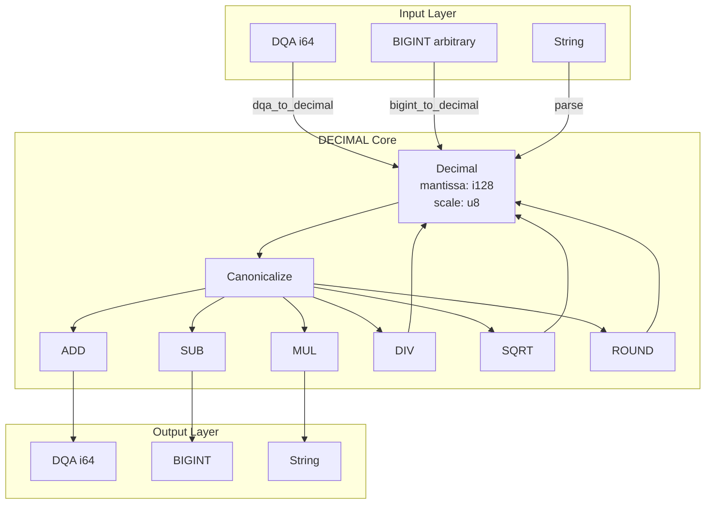

# RFC-0111 (Numeric/Math): Deterministic DECIMAL

## Status

**Version:** 1.1 (2026-03-15)
**Status:** Draft

> **Note:** This RFC is extracted from RFC-0106 (Deterministic Numeric Tower) as part of the Track B dismantling effort.

> **Adversarial Review v1.1 Changes:**
> - Fixed RoundHalfEven to match RFC-0105 exact algorithm (handles negative values correctly)
> - Fixed Newton-Raphson SQRT with explicit iteration limit and convergence check
> - Added decimal_spec_version for replay pinning

## Authors

- Primary Author: TBD
- Contributing Reviewers: TBD

## Maintainers

- Lead Maintainer: TBD
- Technical Contact: TBD
- Repository: `rfcs/draft/numeric/0111-deterministic-decimal.md`

## Dependencies

### Required RFCs

| RFC | Relationship | Reason |
|-----|--------------|--------|
| RFC-0105 (DQA) | Required | DECIMAL extends DQA from i64→i128, scale 0-18→0-36 |
| RFC-0110 (BIGINT) | Required | i128 uses 2×i64 limbs internally |

### Optional RFCs

| RFC | Relationship | Reason |
|-----|--------------|--------|
| RFC-0104 (DFP) | Optional | Interoperability with floating-point |

## Design Goals

1. **Precision**: Support up to 36 decimal places for high-precision financial calculations
2. **Determinism**: Ensure bit-exact reproducible results across all implementations
3. **Compatibility**: Provide seamless conversion to/from DQA (RFC-0105)
4. **Performance**: Maintain 1.2-1.5x slower than DQA (acceptable for high-precision use cases)
5. **Safety**: Prevent overflow/underflow through explicit scale limits (0-36)

## Motivation

### Why DECIMAL?

While DQA (RFC-0105) provides sufficient precision for most financial calculations (up to 18 decimal places), certain use cases demand higher precision:

1. **High-precision risk calculations**: VaR, exotic derivatives, and complex financial models
2. **Regulatory requirements**: Some jurisdictions require more than 18 decimal places for specific instruments
3. **Scientific computing**: Certain scientific calculations benefit from extended precision
4. **Interoperability**: Compatibility with external systems that use higher precision decimals

DECIMAL addresses these requirements by extending DQA's approach to i128-based scaled integers, providing:
- Scale range: 0-36 (vs DQA's 0-18)
- Mantissa range: ±(10^36 - 1)
- Backward compatibility with DQA via explicit conversion

### When NOT to Use DECIMAL

- Default financial calculations: Use DQA (faster, sufficient precision)
- General computation: Use DFP (RFC-0104) for floating-point approximation
- Cryptographic operations: Use BIGINT (RFC-0110) for integer arithmetic

## Summary

This RFC defines Deterministic DECIMAL — extended-precision decimal arithmetic using i128-based scaled integers. DECIMAL provides higher precision than DQA (RFC-0105) for financial calculations requiring more than 18 decimal places.

## Relationship to Other RFCs

| RFC | Relationship |
|-----|--------------|
| RFC-0104 (DFP) | Independent |
| RFC-0105 (DQA) | DECIMAL extends DQA from i64→i128, scale 0-18→0-36 |
| RFC-0110 (BIGINT) | i128 uses 2×i64 limbs internally |

## When to Use DECIMAL vs DQA

| Aspect | DQA | DECIMAL |
|--------|-----|---------|
| Internal storage | i64 | i128 |
| Scale range | 0-18 | 0-36 |
| Performance | Faster (1x) | 1.2-1.5x slower |
| Use case | Default financial | High-precision risk |

**Recommendation:** Use DQA as default. Use DECIMAL only when:
- Scale > 18 required
- High-precision risk calculations (VaR, exotic derivatives)
- Regulatory requirements demand >18 decimal places

## Specification

### Data Structure

```rust
/// Deterministic DECIMAL representation
/// Uses i128 with decimal scale
pub struct Decimal {
    /// Signed 128-bit mantissa
    mantissa: i128,
    /// Decimal scale (0-36)
    scale: u8,
}
```

### Canonical Form

```
1. Trailing zeros removed from mantissa
2. Scale minimized without losing precision
3. Zero: mantissa = 0, scale = 0
```

### Value Representation

```
value = mantissa × 10^-scale
```

Examples:
- `Decimal { mantissa: 1234, scale: 2 }` = 12.34
- `Decimal { mantissa: 1000, scale: 3 }` = 1.000 → canonical: `{1, 0}`
- `Decimal { mantissa: 0, scale: 5 }` = 0 → canonical: `{0, 0}`

### Constants

```rust
/// Maximum scale for DECIMAL
const MAX_DECIMAL_SCALE: u8 = 36;

/// Maximum absolute mantissa: 10^36 - 1
const MAX_DECIMAL_MANTISSA: i128 = 10_i128.pow(36) - 1;

/// Minimum value: -(10^36 - 1)
const MIN_DECIMAL_MANTISSA: i128 = -(10_i128.pow(36) - 1);
```

## Algorithms

### CANONICALIZE

```
decimal_canonicalize(d: Decimal) -> Decimal

1. If mantissa == 0: return {0, 0}

2. Remove trailing zeros:
   while mantissa % 10 == 0 and scale > 0:
     mantissa = mantissa / 10
     scale = scale - 1

3. Return normalized Decimal
```

### ADD — Addition

```
decimal_add(a: Decimal, b: Decimal) -> Decimal

Preconditions:
  - a.scale <= MAX_DECIMAL_SCALE
  - b.scale <= MAX_DECIMAL_SCALE

Algorithm:
  1. Align scales:
     if a.scale == b.scale:
       a_val = a.mantissa
       b_val = b.mantissa
       result_scale = a.scale
     else:
       // Scale to max, multiply smaller by 10^diff
       diff = |a.scale - b.scale|
       if a.scale > b.scale:
         b_val = b.mantissa * 10^diff
         a_val = a.mantissa
         result_scale = a.scale
       else:
         a_val = a.mantissa * 10^diff
         b_val = b.mantissa
         result_scale = b.scale

  2. Check overflow before addition:
     if |a_val + b_val| > MAX_DECIMAL_MANTISSA: TRAP

  3. Sum:
     sum = a_val + b_val

  4. Canonicalize result
```

### SUB — Subtraction

```
decimal_sub(a: Decimal, b: Decimal) -> Decimal

Algorithm: Same as ADD, but subtract instead of add.
```

### MUL — Multiplication

```
decimal_mul(a: Decimal, b: Decimal) -> Decimal

Algorithm:
  1. Multiply mantissas:
     product = a.mantissa * b.mantissa

  2. Check overflow:
     if |product| > MAX_DECIMAL_MANTISSA: TRAP

  3. Add scales:
     result_scale = a.scale + b.scale
     if result_scale > MAX_DECIMAL_SCALE: TRAP

  4. Canonicalize result
```

### DIV — Division

```
decimal_div(a: Decimal, b: Decimal, target_scale: u8) -> Decimal

Algorithm:
  1. If b.mantissa == 0: TRAP (division by zero)

  2. Scale to target precision:
     // Scale up dividend to maintain precision
     scale_diff = target_scale + b.scale - a.scale
     if scale_diff > 0:
       scaled_dividend = a.mantissa * 10^scale_diff
     else:
       scaled_dividend = a.mantissa

  3. Divide:
     quotient = scaled_dividend / b.mantissa
     remainder = scaled_dividend % b.mantissa

  4. Round to target scale using RoundHalfEven (matches RFC-0105):
     abs_remainder = abs(remainder)
     abs_b = abs(b.mantissa)
     half = abs_b / 2
     if abs_remainder < half: result = quotient  // round down
     else if abs_remainder > half: result = quotient + sign(quotient)  // round up
     else:  // remainder == half (tie): round to even
       if quotient % 2 == 0: result = quotient
       else: result = quotient + sign(quotient)

  5. Check overflow and canonicalize
```

### SQRT — Square Root

```
decimal_sqrt(a: Decimal) -> Decimal

Algorithm: Newton-Raphson iteration with explicit convergence
  1. If a.mantissa < 0: TRAP (square root of negative)
  2. If a.mantissa == 0: return {0, 0}

  3. Initial guess: x = sqrt(mantissa) as i128, scale = a.scale / 2

  4. Iterate max 20 times:
     // Division uses DECIMAL_DIV with target_scale = a.scale
     x_new = (x + a / x) / 2
     // Convergence: stop when |x_new - x| < 2 (i128 precision)
     if abs(x_new - x) < 2: break
     x = x_new

  5. Return canonicalized result at original scale
```

**Note:** The division `a / x` in step 4 requires DECIMAL_DIV, which uses i128 internally. Convergence check at step 4 uses i128 precision (not DECIMAL scale) to ensure deterministic iteration count.

### ROUND — Rounding

```
decimal_round(d: Decimal, target_scale: u8, mode: RoundingMode) -> Decimal

Supported modes:
  - RoundHalfEven (default, required for financial)
  - RoundDown (floor toward zero)
  - RoundUp (away from zero)

Algorithm:
  1. If target_scale >= d.scale: return d (no rounding needed)

  2. diff = d.scale - target_scale

  3. divisor = 10^diff

  4. Apply rounding per mode:

     RoundHalfEven: (matches RFC-0105 exact algorithm)
       q = d.mantissa / divisor
       r = d.mantissa % divisor
       // Use absolute remainder for comparison (Rust % preserves sign of dividend)
       abs_r = abs(r)
       half = divisor / 2
       if abs_r < half: return q  // round down
       if abs_r > half: return q + sign(d.mantissa)  // round up
       // remainder == half (tie): round to even
       if q % 2 == 0: return q  // q is even, round to even
       else: return q + sign(d.mantissa)  // q is odd, round away from zero

     RoundDown:
       q = d.mantissa / divisor

     RoundUp:
       if r > 0: q += 1 (if positive) or q -= 1 (if negative)

  5. Return canonicalized Decimal
```

## Conversions

### DECIMAL → DQA

```
decimal_to_dqa(d: Decimal) -> Dqa

If d.scale > 18: TRAP (precision loss)
If |d.mantissa| > i64::MAX: TRAP (overflow)

Return Dqa { value: d.mantissa as i64, scale: d.scale }
```

### DQA → DECIMAL

```
dqa_to_decimal(d: Dqa) -> Decimal

Return Decimal { mantissa: d.value as i128, scale: d.scale }
```

### DECIMAL → BIGINT

```
decimal_to_bigint(d: Decimal) -> BigInt

If d.scale > 0: TRAP (precision loss)
Return BigInt::from(d.mantissa)
```

### DECIMAL → String

```
decimal_to_string(d: Decimal) -> String

If d.scale == 0: return d.mantissa.to_string()

integer_part = d.mantissa / 10^d.scale
fractional_part = |d.mantissa| % 10^d.scale

Pad fractional_part with leading zeros to d.scale digits
Return "integer_part.fractional_part"
```

## Gas Model

| Operation | Gas | Notes |
|-----------|-----|-------|
| ADD | 6 | Scale alignment + i128 add |
| SUB | 6 | Scale alignment + i128 sub |
| MUL | 12 | i128 mul + scale add |
| DIV | 25 | Scale adjust + i128 div + round |
| SQRT | 50 | Newton-Raphson |
| ROUND | 5 | Division by power of 10 |
| CANONICALIZE | 2 | Trailing zero removal |
| TO_DQA | 3 | Scale check + cast |
| FROM_DQA | 2 | Zero-extend |
| TO_STRING | 10 | String allocation |

## Test Vectors

### Basic Operations

| Operation | a.mantissa | a.scale | b.mantissa | b.scale | Expected | Expected Scale |
|-----------|------------|---------|------------|---------|----------|----------------|
| ADD | 100 | 2 | 200 | 2 | 300 | 2 |
| ADD | 1000 | 3 | 1 | 0 | 1001 | 3 |
| SUB | 500 | 2 | 200 | 2 | 300 | 2 |
| MUL | 25 | 2 | 4 | 1 | 100 | 3 |
| DIV | 1000 | 3 | 2 | 0 | 500 | 3 |
| MUL | 12345678901234567890 | 18 | 2 | 0 | 24691357802469135780 | 18 |

### Scale Limits

| Operation | Input | Expected | Notes |
|-----------|-------|----------|-------|
| Scale 36 max | mantissa=1, scale=36 | OK | Max scale |
| Scale 37 overflow | mantissa=1, scale=37 | TRAP | Exceeds max |
| Mul overflow | scale=20 * scale=20 | TRAP | 20+20 > 36 |

### Rounding (RoundHalfEven)

| Input | Target Scale | Expected | Notes |
|-------|--------------|----------|-------|
| 1.234, 2 | 1 | 1.2 | 0.34 rounds down (4<5) |
| 1.235, 2 | 1 | 1.2 | 0.35 rounds to even (2) |
| 1.245, 2 | 1 | 1.2 | 0.45 rounds to even (2) |
| 1.255, 2 | 1 | 1.3 | 0.55 rounds to odd (3) |

### Rounding Negative Values (Critical for Consensus)

| Input | Target Scale | Expected | Notes |
|-------|--------------|----------|-------|
| -1.235, 2 | 1 | -1.2 | -0.35 rounds to even (-2→-1.2) |
| -1.245, 2 | 1 | -1.2 | -0.45 rounds to even (-2→-1.2) |
| -1.255, 2 | 1 | -1.3 | -0.55 rounds away from zero |
| -2.5, 1 | 0 | -2 | -0.5 rounds to even (-2) |
| -3.5, 1 | 0 | -4 | -0.5 rounds to even (-4) |

### Chain Operations

| Expression | Expected | Notes |
|------------|----------|-------|
| (1.5 × 2.0) + 0.5 | 3.5 | mul→add |
| (10.0 / 3.0) × 3.0 | 10.0 | div→mul, precision loss |
| sqrt(2.0) × sqrt(2.0) | 2.0 | sqrt→mul |

### Boundary Cases

| Operation | Input | Expected | Notes |
|-----------|-------|----------|-------|
| From i64 MAX | 9,223,372,036,854,775,807 | mantissa, scale=0 | OK |
| From i64 MIN | -9,223,372,036,854,775,808 | mantissa, scale=0 | OK |
| i128 boundary | ±(10^36-1) | mantissa, scale=36 | Max |
| Zero | 0 | {0, 0} | Canonical |

## Verification Probe

```rust
/// Spec version for replay pinning (matches RFC-0104/0110 pattern)
const DECIMAL_SPEC_VERSION: u32 = 1;

struct DecimalProbe {
    /// Entry 0: 1.0 + 2.0 = 3.0
    entry_0: [u8; 32],
    /// Entry 1: 1.5 × 2.0 = 3.0
    entry_1: [u8; 32],
    /// Entry 2: 10 / 3 = 3.333... (scale=3)
    entry_2: [u8; 32],
    /// Entry 3: 1.23 round to 1.2 (RHE)
    entry_3: [u8; 32],
    /// Entry 4: sqrt(2.0) × sqrt(2.0) = 2.0
    entry_4: [u8; 32],
    /// Entry 5: MAX_DECIMAL boundary
    entry_5: [u8; 32],
    /// Entry 6: Negative value handling
    entry_6: [u8; 32],
}

/// SHA-256 of all entries concatenated
fn decimal_probe_root(probe: &DecimalProbe) -> [u8; 32] {
    sha256(concat!(
        probe.entry_0,
        probe.entry_1,
        probe.entry_2,
        probe.entry_3,
        probe.entry_4,
        probe.entry_5,
        probe.entry_6
    ))
}
```

## Determinism Rules

1. **Rounding Mode**: RoundHalfEven is REQUIRED for financial calculations
2. **Scale Limits**: Scale 0-36 enforced (TRAP on overflow)
3. **No Hardware FPU**: All operations use integer arithmetic
4. **Canonical Form**: Required for state storage and hashing

## Implementation Checklist

- [ ] Decimal struct with mantissa: i128, scale: u8
- [ ] CANONICALIZE algorithm
- [ ] ADD with scale alignment
- [ ] SUB with scale alignment
- [ ] MUL with scale add
- [ ] DIV with target_scale and rounding
- [ ] SQRT with Newton-Raphson
- [ ] ROUND with RoundHalfEven
- [ ] From DQA conversion
- [ ] To DQA conversion (with scale check)
- [ ] From/To string
- [ ] Gas calculation
- [ ] MAX_DECIMAL_SCALE enforcement
- [ ] Test vectors verified
- [ ] Verification probe

## System Architecture



**Architecture Notes:**
- DECIMAL operates in the decimal domain, separate from INTEGER (BIGINT) and FLOAT (DFP) domains
- All operations flow through CANONICALIZE to ensure deterministic canonical form
- Conversions to DQA require explicit scale checks (scale ≤ 18)

## Error Handling

### Error Codes

| Error | Code | Condition |
|-------|------|-----------|
| DEC_OVERFLOW | 0xD001 | Result exceeds ±(10^36 - 1) |
| DEC_SCALE_OVERFLOW | 0xD002 | Scale exceeds 36 |
| DEC_DIVISION_BY_ZERO | 0xD003 | Division by zero |
| DEC_NEGATIVE_SQRT | 0xD004 | Square root of negative |
| DEC_PRECISION_LOSS | 0xD005 | Conversion to DQA loses precision (scale > 18) |
| DEC_INVALID_STRING | 0xD006 | String parsing failure |

### Error Semantics

All errors are fatal (TRAP) — no partial results or fallback behavior:
- Contract execution reverts on any DECIMAL error
- Gas is consumed up to the point of failure
- Error code is logged for debugging

## Security Considerations

### Threat Model

1. **Arithmetic Overflows**: Prevented by explicit bounds checking before every operation
2. **Division by Zero**: Explicit check before division, TRAP on zero divisor
3. **Negative Square Root**: Explicit check, TRAP on negative input
4. **Precision Loss**: Explicit scale checks for DQA conversion
5. **Canonical Form Violation**: All operations must return canonical form

### Attack Vectors

| Vector | Mitigation |
|--------|------------|
| Malicious scale values | Scale limited to 0-36, enforced at boundaries |
| Giant mantissa amplification | MAX_DECIMAL_MANTISSA bounds on all operations |
| Reentrancy | DECIMAL operations are atomic (single function call) |
| Front-running | Deterministic ordering eliminates race conditions |

### Consensus Security

- All nodes must produce identical results for identical inputs
- RoundHalfEven required for financial calculations (prevents manipulation)
- Canonical form ensures consistent Merkle tree hashes

## Adversarial Review

### Review History

| Version | Date | Changes |
|---------|------|---------|
| 1.0 | 2026-03-14 | Initial draft |
| 1.1 | 2026-03-15 | Fixed RoundHalfEven negative handling, added Newton-Raphson convergence |

### Known Issues

| Issue ID | Severity | Description | Status |
|----------|----------|-------------|--------|
| D1 | Medium | Newton-Raphson iteration limit (20) may be insufficient for extreme scales | Open |
| D2 | Low | Gas model not validated against real-world benchmarks | Open |

## Alternatives Considered

### Option 1: Use DQA with Higher Scale (Rejected)

**Approach**: Extend DQA (RFC-0105) to support scale 0-36

**Pros:**
- No new type needed
- Simpler codebase

**Cons:**
- DQA uses i64, insufficient for scale 36 (would require 128-bit intermediate)
- Breaking change to DQA semantics

**Decision**: DECIMAL uses i128 to support full 36-digit precision

### Option 2: Use Arbitrary-Precision Decimal (Rejected)

**Approach**: Support arbitrary scale beyond 36

**Pros:**
- Unlimited precision

**Cons:**
- Gas costs become unpredictable
- No practical benefit (36 digits exceeds all known requirements)
- Implementation complexity

**Decision**: Fixed 36-digit limit provides sufficient precision with predictable gas

### Option 3: Use IEEE 754 Decimal128 (Rejected)

**Approach**: Adopt IEEE 754 decimal128 format

**Pros:**
- Industry standard
- Hardware support on some platforms

**Cons:**
- Not deterministic across implementations
- Different encoding than other numeric types
- Complex serialization

**Decision**: Custom i128 + scale format maintains consistency with DQA/BIGINT

## Version History

| Version | Date | Author | Changes |
|---------|------|--------|---------|
| 1.0 | 2026-03-14 | TBD | Initial draft extracted from RFC-0106 |
| 1.1 | 2026-03-15 | TBD | Fixed RoundHalfEven algorithm, added SQRT convergence |

## Compatibility

### Backward Compatibility

- DECIMAL v1.x is backward compatible within draft status
- Breaking changes may occur before Accepted status

### Forward Compatibility

- No forward compatibility guarantees for draft RFCs

### Interoperability

| From | To | Supported | Notes |
|------|-----|-----------|-------|
| DECIMAL | DQA | ✅ | Requires scale ≤ 18 |
| DQA | DECIMAL | ✅ | Always valid |
| DECIMAL | BIGINT | ✅ | Requires scale = 0 |
| BIGINT | DECIMAL | ✅ | Always valid |
| DECIMAL | String | ✅ | Full round-trip |
| DECIMAL | DFP | ❌ | Not recommended (precision loss) |

## Related Use Cases

- **UC-XXX**: High-Precision Financial Derivatives (future)
- **UC-XXX**: Regulatory Reporting with Extended Precision (future)

## Future Work

1. **ZK Circuit Commitments**: Add ZK proofs for DECIMAL operations (post-v1)
2. **SIMD Optimization**: Vectorized operations for batch processing
3. **Hardware Acceleration**: Leverage dedicated decimal arithmetic units where available
4. **Decimal128 Interoperability**: Optional conversion to IEEE 754 format

## References

- RFC-0104: Deterministic Floating-Point
- RFC-0105: Deterministic Quant Arithmetic
- RFC-0110: Deterministic BIGINT
- RFC-0106: Deterministic Numeric Tower (archived)
