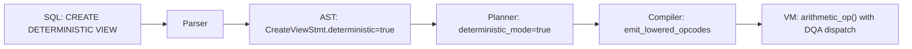

# RFC-0117 (Numeric/Math): Deterministic Execution Context (DETERMINISTIC VIEW)

## Status

**Version:** 1.1 (Draft)
**Status:** Draft
**Depends On:** RFC-0104 (DFP), RFC-0105 (DQA), RFC-0124 (Numeric Lowering)
**Category:** Numeric/Math

> **Adversarial Review v1.1 Changes (23 Findings):**
>
> - FIXED: C1 — literal rationale contradicted literal parsing table
> - FIXED: H1 — added subquery specification
> - FIXED: H2 — added CTE (WITH clause) specification
> - FIXED: H3 — added UNION/UNION ALL specification
> - FIXED: H4 — added aggregate function specification
> - FIXED: H5 — added CASE/WHEN specification
> - FIXED: H6 — added ORDER BY + LIMIT determinism rules
> - FIXED: H7 — added non-deterministic function classification
> - FIXED: H8 — added ALTER TABLE schema versioning rules
> - FIXED: H9 — added BIGINT entries to implicit promotion table
> - FIXED: H10 — added OR REPLACE deterministic status change rules
> - FIXED: M1 — added DESCRIBE/SHOW grammar productions
> - FIXED: M2 — documented bare SELECT without FROM
> - FIXED: M3-M7 — added 6 new test vectors (T21-T26)
> - FIXED: M8 — added NULL handling note
> - FIXED: L1-L4 — diagram caption, compilation bound, catalog timestamp note

> **Note:** This RFC is extracted from RFC-0104 Amendment A6. The VM infrastructure (`deterministic` flag, `arithmetic_op_deterministic()`) already exists as reserved infrastructure. This RFC specifies the SQL surface, parser grammar, planner integration, compiler flag propagation, and type enforcement rules.

## Summary

This RFC defines `CREATE DETERMINISTIC VIEW` — a SQL-level execution context that enforces deterministic-only arithmetic (DFP/DQA), prohibits non-deterministic types (FLOAT/DOUBLE), and propagates the deterministic flag from SQL through the parser, planner, compiler, and into the expression VM.

A Deterministic View guarantees that the same query executed on any node produces bit-identical results, making it suitable for:

- Blockchain state transitions
- Consensus-critical query execution
- Merkle tree inclusion proofs
- Cross-node verification and replay

## Motivation

### Problem Statement

RFC-0104 (DFP) and RFC-0105 (DQA) provide deterministic numeric types, but there is no SQL mechanism to enforce their use. Without `DETERMINISTIC VIEW`:

- Queries can silently mix FLOAT and DFP columns, producing non-deterministic results
- There is no compile-time enforcement that consensus-critical queries use only deterministic types
- The VM has a `deterministic` flag and `arithmetic_op_deterministic()` method, but nothing sets them from SQL
- Two nodes executing the same query with FLOAT columns could produce different results, breaking consensus

### Why a View and Not a Table

Tables already declare column types explicitly — a `CREATE TABLE t (price DFP NOT NULL)` enforces DFP at the storage layer. Views, however, can compute derived expressions that mix types:

```sql
-- Without DETERMINISTIC VIEW, this silently uses FLOAT arithmetic:
CREATE VIEW v_risky AS
SELECT float_col * 0.1 AS approx_total FROM trades;

-- With DETERMINISTIC VIEW, the planner rejects FLOAT columns:
CREATE DETERMINISTIC VIEW v_safe AS
SELECT dfp_col * 0.1 AS exact_total FROM trades;  -- 0.1 parsed as DFP
```

### Current State

| Component               | Status                                 |
| ----------------------- | -------------------------------------- |
| DFP type                | RFC-0104, Accepted                     |
| DQA type                | RFC-0105, Accepted                     |
| DFP→DQA lowering        | RFC-0124, Draft                        |
| VM `deterministic` flag | Reserved in RFC-0104 A6, not activated |
| SQL syntax              | **This RFC**                           |
| Parser grammar          | **This RFC**                           |
| Planner integration     | **This RFC**                           |

## Specification

### SQL Grammar

The following production is added to the Stoolap SQL grammar:

```
create_view_stmt ::= CREATE [ OR REPLACE ] view_modifier VIEW view_name AS select_stmt

view_modifier ::= DETERMINISTIC | ε

view_name     ::= identifier

describe_view_stmt ::= DESCRIBE VIEW view_name

show_views_stmt    ::= SHOW VIEWS
```

**BNF notes:**

- `DETERMINISTIC` is a new reserved keyword in the `CREATE VIEW` context only
- `ε` represents the empty alternative (standard `CREATE VIEW` without modifier)
- `OR REPLACE` follows existing Stoolap view semantics
- The `select_stmt` must comply with deterministic type rules (§Type Enforcement)

#### Examples

```sql
-- Valid: all columns and literals are deterministic-compatible
CREATE DETERMINISTIC VIEW v_portfolio AS
SELECT
    price * quantity AS total,
    total / 2.0 AS half_position
FROM trades
WHERE price > 0;

-- Valid: explicit CAST from INT to DFP
CREATE DETERMINISTIC VIEW v_converted AS
SELECT CAST(int_col AS DFP) * 0.1 AS result FROM data;

-- Error: FLOAT column in deterministic context
CREATE DETERMINISTIC VIEW v_invalid AS
SELECT float_col * 2 FROM trades;
-- ERROR 41001: FLOAT column 'float_col' is not allowed in DETERMINISTIC VIEW

-- Error: CAST to non-deterministic type
CREATE DETERMINISTIC VIEW v_bad_cast AS
SELECT CAST(price AS FLOAT) FROM trades;
-- ERROR 41002: CAST to FLOAT is forbidden in DETERMINISTIC VIEW

-- Valid: reference another deterministic view
CREATE DETERMINISTIC VIEW v_enriched AS
SELECT total * 1.05 AS with_tax FROM v_portfolio;
```

### Type Enforcement Rules

#### Allowed Types in Deterministic Context

| Type            | Allowed | Notes                                             |
| --------------- | ------- | ------------------------------------------------- |
| DFP column      | Yes     | Deterministic by design                           |
| DQA column      | Yes     | Deterministic by design                           |
| BIGINT column   | Yes     | Exact integer, promoted to DFP/DQA per type rules |
| INTEGER column  | Yes     | Exact integer, promoted to DFP                    |
| Decimal literal | Yes     | Parsed as DFP in deterministic context            |
| Integer literal | Yes     | Parsed as DFP integer                             |
| FLOAT column    | **No**  | Compile error                                     |
| DOUBLE column   | **No**  | Compile error                                     |
| BOOLEAN         | Yes     | Non-numeric, no determinism concern               |
| VARCHAR/TEXT    | Yes     | Non-numeric, no determinism concern               |
| TIMESTAMP       | Yes     | Non-numeric, no determinism concern               |
| NULL            | Yes     | Propagates through deterministic ops              |

#### CAST Rules in Deterministic Context

| CAST Expression          | Allowed | Notes                                 |
| ------------------------ | ------- | ------------------------------------- |
| `CAST(x AS DFP)`         | Yes     | Only from INT/BIGINT/DQA              |
| `CAST(x AS DQA)`         | Yes     | Only from INT/BIGINT/DFP              |
| `CAST(x AS BIGINT)`      | Yes     | Only from INT/DFP/DQA                 |
| `CAST(x AS INTEGER)`     | Yes     | Only from DFP/DQA/BIGINT              |
| `CAST(x AS FLOAT)`       | **No**  | Compile error: loses determinism      |
| `CAST(x AS DOUBLE)`      | **No**  | Compile error: loses determinism      |
| `CAST(float_col AS DFP)` | **No**  | Compile error: FLOAT source forbidden |

#### Implicit Promotion in Deterministic Context

| Left Type | Right Type | Result Type | Behavior                                                      |
| --------- | ---------- | ----------- | ------------------------------------------------------------- |
| DFP       | DFP        | DFP         | Direct DFP operation                                          |
| DFP       | INT        | DFP         | INT promoted via `Dfp::from_i64()`                            |
| INT       | DFP        | DFP         | INT promoted via `Dfp::from_i64()`                            |
| DQA       | DQA        | DQA         | Direct DQA operation                                          |
| DQA       | INT        | DQA         | INT promoted via `dqa(i64, 0)`                                |
| INT       | DQA        | DQA         | INT promoted via `dqa(i64, 0)`                                |
| DFP       | DQA        | **Error**   | Requires explicit CAST (cross-precision)                      |
| DFP       | FLOAT      | **Error**   | FLOAT forbidden in deterministic context                      |
| FLOAT     | DFP        | **Error**   | FLOAT forbidden in deterministic context                      |
| DQA       | FLOAT      | **Error**   | FLOAT forbidden in deterministic context                      |
| BIGINT    | DFP        | DFP         | BIGINT promoted via RFC-0136 BigInt→DFP                       |
| DFP       | BIGINT     | DFP         | BIGINT promoted via RFC-0136 BigInt→DFP                       |
| BIGINT    | DQA        | DQA         | BIGINT promoted via RFC-0131 bigint_to_dqa — TRAP if overflow |
| DQA       | BIGINT     | DQA         | BIGINT promoted via RFC-0131 bigint_to_dqa — TRAP if overflow |
| BIGINT    | BIGINT     | BIGINT      | Direct BIGINT operation (RFC-0110)                            |
| BIGINT    | INT        | BIGINT      | INT promoted to BIGINT                                        |
| INT       | BIGINT     | BIGINT      | INT promoted to BIGINT                                        |

**Rationale for INT→DFP implicit promotion:** Integer values have exact representations in DFP (any integer up to 2^113 can be represented exactly). This is safe and convenient. Both `dfp_col * 2` and `dfp_col * 1.5` are allowed without explicit CAST — integer literals are promoted to DFP, and decimal literals are parsed as DFP in deterministic context (see §Literal Parsing).

**Rationale for DFP↔DQA error:** DFP and DQA have different precision characteristics. Mixed operations require explicit CAST to make the precision choice visible.

### Literal Parsing in Deterministic Context

In deterministic execution mode, numeric literals are typed as follows:

| Literal Form         | Standard Context | Deterministic Context |
| -------------------- | ---------------- | --------------------- |
| `42`                 | INTEGER          | DFP (exponent=0)      |
| `3.14`               | FLOAT            | DFP                   |
| `0.1`                | FLOAT            | DFP                   |
| `1.0e10`             | FLOAT            | DFP                   |
| `'1.5'`              | VARCHAR          | VARCHAR               |
| `CAST('1.5' AS DFP)` | Error            | DFP                   |

**This is the key difference:** In deterministic context, `0.1` is parsed as DFP, ensuring bit-identical representation across all nodes. In standard context, `0.1` is IEEE-754 FLOAT and may differ across platforms.

### Parser Integration

#### AST Node

```rust
/// AST node for CREATE VIEW with optional deterministic modifier
pub struct CreateViewStmt {
    /// View name
    pub name: String,
    /// Whether to replace existing view (OR REPLACE)
    pub or_replace: bool,
    /// Whether this is a DETERMINISTIC VIEW
    pub deterministic: bool,
    /// The SELECT statement defining the view
    pub query: Box<SelectStmt>,
}
```

#### Parser Modification

The parser detects the `DETERMINISTIC` keyword after `CREATE [OR REPLACE]` and before `VIEW`. The keyword is context-sensitive — it is only a reserved keyword in this position, avoiding conflicts with column/table names.

```
Parser flow:
1. Consume CREATE
2. Optionally consume OR REPLACE
3. Check next TWO tokens (look-ahead):
   a. If DETERMINISTIC followed by VIEW → consume both, set deterministic=true
   b. Otherwise → deterministic=false, consume VIEW as next token
4. Parse view_name
5. Consume AS
7. Parse select_stmt
8. Return CreateViewStmt { deterministic, ... }
```

### Planner Integration

#### View Metadata

```rust
/// View metadata stored in the catalog
pub struct ViewInfo {
    /// View name
    pub name: String,
    /// The SQL definition
    pub definition: String,
    /// Whether this is a deterministic view
    pub deterministic: bool,
    /// Column types (resolved at CREATE time)
    pub columns: Vec<ColumnInfo>,
}
```

#### Planner Flow

```
PLANNER_FLOW(view: CreateViewStmt) -> LogicalPlan

INPUT:  CreateViewStmt { deterministic, query, ... }
OUTPUT: LogicalPlan with deterministic flag propagated

STEPS:

1. If view.deterministic:
   Set planner.deterministic_mode = true

2. Resolve column references in query
   For each column reference:
     If column type is FLOAT or DOUBLE:
       If planner.deterministic_mode:
         Emit ERROR 41001: column type not allowed

3. Resolve expressions
   For each expression node:
     If expression involves FLOAT/DOUBLE literal:
       If planner.deterministic_mode:
         Emit ERROR 41001: literal type not allowed
     If expression involves CAST(... AS FLOAT/DOUBLE):
       If planner.deterministic_mode:
         Emit ERROR 41002: CAST target not allowed

4. Type-check all expressions with deterministic promotion rules
   Apply promotion table (§Implicit Promotion)

5. Generate LogicalPlan with deterministic flag attached

6. Store ViewInfo { deterministic: true, ... } in catalog
```

#### View Composition Rules

A DETERMINISTIC VIEW may reference:

1. **Base tables** — columns must be DFP, DQA, INT, BIGINT, or non-numeric types
2. **Regular views** — columns must comply with deterministic type rules
3. **Other DETERMINISTIC VIEWs** — always allowed (already enforced)

A regular (non-deterministic) view MUST NOT reference a DETERMINISTIC VIEW in a way that violates its type guarantees. Specifically, a regular view can SELECT from a deterministic view — the deterministic view's type enforcement is preserved through composition.

```sql
-- Valid: deterministic view references another deterministic view
CREATE DETERMINISTIC VIEW v_taxed AS
SELECT total * 1.05 AS with_tax FROM v_portfolio;

-- Valid: regular view references deterministic view
-- (deterministic guarantees are maintained at the source)
CREATE VIEW v_report AS
SELECT with_tax FROM v_taxed;
```

#### JOIN Scope

A DETERMINISTIC VIEW may JOIN with:

1. Other DETERMINISTIC VIEWs — fully allowed
2. Regular tables — allowed, but only deterministic-type columns may be referenced in expressions
3. Regular views — allowed, subject to the same type rules as regular tables

FLOAT/DOUBLE columns from joined tables/views are invisible in the deterministic context — any reference to them is a compile error.

#### Subqueries

Subqueries within DETERMINISTIC VIEWs are supported. The `deterministic_mode` flag propagates recursively into all subquery definitions. All columns referenced in subqueries must comply with deterministic type rules. Correlated subqueries that reference both DETERMINISTIC VIEWs and regular views, and and base tables.

```sql
-- Valid: scalar subquery referencing DFP config
CREATE DETERMINISTIC VIEW v_sub AS
SELECT price * (SELECT rate FROM config WHERE id = 1) AS adjusted
FROM trades;
-- Expected: Success. config.dfp_price is is DFP; subquery rate is `DFP`.

-- Error: subquery referencing FLOAT column
CREATE DETERMINISTIC VIEW v_bad_sub AS
SELECT price * (SELECT float_rate FROM rates WHERE id = 1) AS adjusted
FROM trades;
-- Expected: ERROR 41001
-- "FLOAT column 'float_rate' is not allowed in DETERMINISTIC VIEW 'v_bad_sub'"
```

#### CTEs (Common Table Expressions)

CTEs (WITH clauses) within DETERMINISTIC VIEWs are supported:

```sql
-- Valid: CTE with deterministic types
CREATE DETERMINISTIC VIEW v_cte AS
WITH base AS (SELECT price, qty FROM trades WHERE price > 0)
SELECT price * qty AS total FROM base;
-- Expected: Success. CTE columns are deterministic-type checked.

-- Error: CTE referencing FLOAT column
CREATE DETERMINISTIC VIEW v_bad_cte AS
WITH base AS (SELECT price, rate FROM trades WHERE price > 0)
SELECT price * rate FROM base;
-- Expected: ERROR 41001
-- "FLOAT column 'rate' in not allowed in DETERMINISTIC VIEW 'v_bad_cte'"
```

#### UNION / UNION ALL

UNION and UNION ALL are permitted in DETERMINISTIC VIEWs. Each arm of the UNION is independently subject to deterministic type enforcement. All columns in each arm must comply with deterministic type rules. Result column types across all arms must be deterministic-compatible (no FLOAT/DOUBLE in any arm).

```sql
-- Valid: UNION of two deterministic-compatible queries
CREATE DETERMINISTIC VIEW v_union AS
SELECT dfp_price FROM trades_a
UNION ALL
SELECT dfp_price FROM trades_b;
-- Expected: Success. Both arms produce DFP columns.

-- Error: one arm has FLOAT column
CREATE DETERMINISTIC VIEW v_bad_union AS
SELECT dfp_price FROM trades_a
UNION ALL
SELECT float_price FROM trades_b;
-- Expected: ERROR 41001
-- "FLOAT column 'float_price' not allowed in DETERMINISTIC VIEW 'v_bad_union'"
```

#### Aggregate Functions

Aggregate functions (SUM, AVG, MIN, MAX, COUNT) are permitted on deterministic types, provided their argument types are deterministic-compatible:

| Function     | DETERMINISTIC    | Notes                                                       |
| ------------ | ---------------- | ----------------------------------------------------------- |
| SUM          | Yes              | DQA arithmetic on numeric inputs, result type matches input |
| AVG          | No               | DQA `dqa_div` with RoundHalfEven — result type DQA          |
| MIN          | No               | Direct comparison, result type matches input                |
| MAX          | No               | Direct comparison, result type matches input                |
| COUNT        | No               | Integer result, always INT                                  |
| COUNT(\*)    | No               | Integer result, counts all rows including NULLs             |
| GROUP_CONCAT | No (if typesafe) | Result type VARCHAR; arguments must be deterministic types  |

- Aggregates on DQA columns use DQA arithmetic (RFC-0105).
- Aggregates on DFP columns are lowered to DQA via RFC-0124 before aggregation.
- Non-deterministic aggregates (APPROX_COUNT_DISTINCT, etc.) are forbidden — error 41004.

```sql
-- Valid: aggregate on DFP column
CREATE TABLE t_agg (category VARCHAR, price DFP NOT NULL);
CREATE DETERMINISTIC VIEW v_agg AS
SELECT category, SUM(price) AS total, AVG(price) AS avg_price
FROM t_agg
GROUP BY category;
-- Expected: Success. SUM and AVG use DQA arithmetic.
```

#### CASE/WHEN Expressions

CASE/WHEN expressions are permitted in DETERMINISTIC VIEWs. All WHEN branches and the ELSE branch must produce deterministic-compatible types.

```sql
-- Valid: all branches produce DFP
CREATE DETERMINISTIC VIEW v_case AS
SELECT CASE
    WHEN price > 100 THEN price * 1.1
    ELSE price
END AS adjusted
FROM trades;
-- Expected: Success. Both branches produce DFP.

-- Error: ELSE branch has FLOAT column
CREATE DETERMINISTIC VIEW v_bad_case AS
SELECT CASE
    WHEN type = 'A' THEN dfp_col
    ELSE float_col
END AS result
FROM trades;
-- Expected: ERROR 41001
-- "FLOAT column 'float_col' in ELSE branch not allowed in DETERMINISTIC VIEW 'v_bad_case'"
```

#### Window Functions

Window functions (SUM() OVER, RANK() OVER, etc.) are permitted when deterministic types. provided:

- Window function arguments must comply with deterministic type rules.
- ORDER BY and PARTITION BY expressions follow the same type enforcement as WHERE clause.

#### ORDER BY + LIMIT Determinism

ORDER BY in DETERMINISTIC VIEWs with LIMIT/OFFSET requires care:

ORDER BY with ties could produce non-deterministic row ordering across nodes.

```sql
-- Valid: ORDER BY with unique tiebreaker
CREATE DETERMINISTIC VIEW v_sorted AS
SELECT price * quantity AS total
FROM trades
ORDER BY total DESC, id ASC;  -- id is unique tiebreaker
LIMIT 10;

-- Expected: Success. Unique key 'id' guarantees deterministic row ordering.

-- Error: ORDER BY with LIMIT but no unique tiebreaker
CREATE DETERMINISTIC VIEW v_nondet_sort AS
SELECT price * quantity AS total
FROM trades
ORDER BY total DESC
LIMIT 10;
-- Expected: ERROR 41006
-- "Non-deterministic ordering: ORDER BY column 'total' may have ties; add a unique column or the ORDER BY clause or or use FETCH FIRST to guarantee determinism."
```

#### SELECT \* (Star Expression)

`SELECT *` in a DETERMINISTIC VIEW is rejected if ANY column in the referenced table(s) is FLOAT orDOUBLE.

```sql
-- Error: table has FLOAT column
CREATE DETERMINISTIC VIEW v_star AS SELECT * FROM trades;
-- trades has columns: id INTEGER, price DFP, rate FLOAT
-- Expected: ERROR 41001
-- "Table 'trades' contains FLOAT column 'rate'; SELECT * is not allowed in DETERMINISTIC VIEW 'v_star'"
```

#### Non-Deterministic Function Classification

Functions whose output depends on time, session, randomness, or execution order are forbidden in DETERMINISTIC VIEWs.

**Forbidden functions (ERROR 41004):**

| Function            | Reason                          |
| ------------------- | ------------------------------- |
| `RANDOM()`          | Non-deterministic random output |
| `NOW()`             | Time-dependent                  |
| `CURRENT_TIMESTAMP` | Time-dependent                  |
| `CURRENT_DATE`      | Time-dependent                  |
| `UUID()`            | Random                          |
| `USER()`            | Session-dependent               |
| `SESSION_USER()`    | Session-dependent               |
| `CURRENT_SCHEMA`    | Session-dependent               |

**Allowed deterministic functions:**

| Function     | Notes                                   |
| ------------ | --------------------------------------- |
| `ABS()`      | Absolute value — deterministic          |
| `CEIL()`     | Ceiling — deterministic                 |
| `FLOOR()`    | Floor — deterministic                   |
| `ROUND()`    | Rounding — deterministic (uses DQA RNE) |
| `COALESCE()` | First non-NULL — deterministic          |

**Conditionally allowed (require unique tiebreaker in ORDER BY):**

| Function       | Condition                            |
| -------------- | ------------------------------------ |
| `ROW_NUMBER()` | Requires ORDER BY with unique column |
| `RANK()`       | Requires ORDER BY with unique column |
| `DENSE_RANK()` | Requires ORDER BY with unique column |

User-defined functions (UDFs) are forbidden in deterministic context unless explicitly annotated with `DETERMINISTIC SAFE` attribute in their definition.

**OR REPLACE status change rules (H10):**

When `OR REPLACE` changes the deterministic status of a view:

- If upgrading from regular → DETERMINISTIC: the new definition is validated as a fresh DETERMINISTIC VIEW.
- If downgrading from DETERMINISTIC → regular: any DETERMINISTIC VIEWs that reference this view become invalid and must be re-created or re-validated.
- Non-deterministic views referencing a downgraded view: ERROR 41001 at reference time (the column types no longer satisfy deterministic rules).

```sql
-- Valid: JOIN with regular table, only DFP/INT columns used
CREATE DETERMINISTIC VIEW v_combined AS
SELECT t.dfp_price * s.dfp_quantity AS total
FROM trades t JOIN stats s ON t.id = s.trade_id;

-- Error: FLOAT column referenced from joined table
CREATE DETERMINISTIC VIEW v_bad_join AS
SELECT t.float_price * 2 AS total
FROM trades t JOIN stats s ON t.id = s.trade_id;
-- ERROR 41001: FLOAT column 'float_price' not allowed in DETERMINISTIC VIEW
```

### Compiler Integration

#### Flag Propagation

_Figure 1: Deterministic flag propagation from SQL to VM._



#### Compiler Behavior

When `deterministic_mode = true`, the expression compiler:

1. **Literal lowering:** Decimal literals are parsed as DFP and lowered to DQA via RFC-0124
2. **Type enforcement:** FLOAT/DOUBLE types in expressions cause compile errors
3. **Opcode emission:** Only DQA opcodes are emitted (DFP is source/IR only per RFC-0124)
4. **CAST validation:** CAST targets must be deterministic types (DFP, DQA, INT, BIGINT)

The compiler does NOT emit DFP opcodes. DFP values are lowered to DQA at compile time via the Deterministic Lowering Pass (RFC-0124). The runtime only sees DQA values.

### VM Integration

The VM already has the reserved infrastructure from RFC-0104 Amendment A6:

```rust
/// VM execution context
pub struct ExecutionContext {
    /// Whether this execution is in deterministic mode
    pub deterministic: bool,
}

impl ExecutionContext {
    /// Arithmetic dispatch — routes to DQA for deterministic, native for non-deterministic
    pub fn arithmetic_op(&self, op: Op, left: Value, right: Value) -> Value {
        if self.deterministic {
            self.arithmetic_op_deterministic(op, left, right)
        } else {
            self.arithmetic_op_standard(op, left, right)
        }
    }
}
```

**Activation:** When executing a query from a DETERMINISTIC VIEW, the planner sets `ExecutionContext::deterministic = true`. The VM dispatches through `arithmetic_op_deterministic()`, which:

1. Routes all arithmetic through DQA operations (RFC-0105)
2. Rejects FLOAT/DOUBLE values at runtime (defense-in-depth)
3. Uses saturating arithmetic per RFC-0104 rules

**Defense-in-depth:** Even though the planner/compiler enforce type rules, the VM also checks at runtime. This catches cases where:

- A view's underlying table was altered after view creation
- A function returns an unexpected type
- A bug in the planner allows a non-deterministic type to slip through

### Error Taxonomy

| Error Code | Condition                                                       | Message Template                                                                                            |
| ---------- | --------------------------------------------------------------- | ----------------------------------------------------------------------------------------------------------- |
| 41001      | FLOAT/DOUBLE column referenced in deterministic context         | `FLOAT column '{col}' is not allowed in DETERMINISTIC VIEW '{view}'`                                        |
| 41001      | FLOAT/DOUBLE literal in deterministic context                   | `FLOAT literal is not allowed in DETERMINISTIC VIEW '{view}'`                                               |
| 41001      | FLOAT/DOUBLE column in SELECT \* scope                          | `Table '{table}' contains FLOAT column '{col}'; SELECT * not allowed`                                       |
| 41001      | FLOAT/DOUBLE column in subquery/CTE/UNION arm                   | `FLOAT column '{col}' in {context} not allowed in DETERMINISTIC VIEW '{view}'`                              |
| 41001      | FLOAT/DOUBLE column in CASE/WHEN branch                         | `FLOAT column '{col}' in {branch} branch not allowed in DETERMINISTIC VIEW '{view}'`                        |
| 41002      | CAST to FLOAT/DOUBLE in deterministic context                   | `CAST to {target_type} is forbidden in DETERMINISTIC VIEW '{view}'`                                         |
| 41003      | Mixed DFP/DQA without explicit CAST                             | `Mixed DFP/DQA types require explicit CAST in DETERMINISTIC VIEW '{view}'`                                  |
| 41004      | Non-deterministic function in deterministic context             | `Function '{func}' is not allowed in DETERMINISTIC VIEW '{view}'`                                           |
| 41005      | View references non-existent table                              | (Standard view error, not deterministic-specific)                                                           |
| 41006      | Non-deterministic ordering (ORDER BY with LIMIT, no tiebreaker) | `Non-deterministic ordering: ORDER BY column '{col}' may have ties; add a unique column or use FETCH FIRST` |
| 41007      | Cyclic view reference detected                                  | `Cyclic view reference: '{view}' → '{dep}' → '{view}'`                                                      |

**Error timing:** Errors 41001-41007 are compile-time (detected during view creation). Runtime defense-in-depth uses assertion failure (not a user SQL error) — if triggered, it indicates a planner bug.

### Catalog Storage

Deterministic view metadata is stored in the Stoolap catalog:

```sql
-- System catalog table for views (extends existing)
-- The 'deterministic' column is added by this RFC
-- The 'schema_versions' column tracks referenced table schemas for invalidation detection
CREATE TABLE stl_views (
    name VARCHAR PRIMARY KEY,
    definition VARCHAR NOT NULL,
    deterministic BOOLEAN NOT NULL DEFAULT FALSE,
    schema_versions VARCHAR,  -- JSON: {"table_name": schema_hash, ...}
    created_at TIMESTAMP NOT NULL  -- System catalog metadata, not subject to deterministic rules
);
```

#### Catalog Migration

For existing Stoolap deployments that already have `stl_views` without the `deterministic` and `schema_versions` columns:

```sql
-- Migration: Add deterministic column to existing stl_views
ALTER TABLE stl_views ADD COLUMN deterministic BOOLEAN NOT NULL DEFAULT FALSE;
-- All existing views default to deterministic=false

-- Migration: Add schema versioning for invalidation detection
ALTER TABLE stl_views ADD COLUMN schema_versions VARCHAR;
-- Existing views get NULL schema_versions (no invalidation tracking)
```

> **Note:** `created_at` uses TIMESTAMP for metadata recording only. System catalog operations are not subject to DETERMINISTIC VIEW rules — the timestamp records when the DDL was received by the catalog node, not when the data was created.

#### Schema Versioning and Invalidation

When a DETERMINISTIC VIEW is created, the planner records:

```json
{
  "tables": {
    "trades": "a1b2c3d...", // SHA-256 of column names + types
    "stats": "e4f5a6a..."
  }
}
```

If any referenced table's schema changes (ALTER TABLE ADD/DROP/MODIFY COLUMN), the view is marked invalid:

- `SHOW VIEWS` displays invalid deterministic views with `[D!]` marker
- Querying an invalid deterministic view raises a standard error (view is invalid, needs re-creation)
- `CREATE OR REPLACE DETERMINISTIC VIEW` on the same definition re-validates against the current schema

### DDL Statements

#### CREATE

```sql
CREATE DETERMINISTIC VIEW view_name AS select_stmt;
CREATE OR REPLACE DETERMINISTIC VIEW view_name AS select_stmt;
```

#### DROP

```sql
DROP VIEW view_name;  -- Works for both deterministic and regular views
```

No special `DROP DETERMINISTIC VIEW` syntax needed — `DROP VIEW` works for all views.

#### SHOW / DESRIBE

```sql
-- Show all views (deterministic views marked with [D])
SHOW VIEWS;
-- Output:
--   v_portfolio   [D]
--   v_report
--   v_taxed       [D]

-- Describe view shows deterministic flag
DESCRIBE VIEW v_portfolio;
-- Output:
--   View: v_portfolio
--   Type: DETERMINISTIC
--   Definition: SELECT price * quantity AS total ...
```

## Test Vectors

### T1: Valid Deterministic View — Basic Arithmetic

```sql
CREATE TABLE t1 (price DFP NOT NULL, quantity INTEGER NOT NULL);

CREATE DETERMINISTIC VIEW v1 AS
SELECT price * quantity AS total FROM t1;

-- Expected: Success. 'quantity' promoted to DFP via implicit INT→DFP.
-- At runtime: DQA arithmetic (DFP lowered via RFC-0124).
```

### T2: Reject FLOAT Column

```sql
CREATE TABLE t2 (price FLOAT NOT NULL);

CREATE DETERMINISTIC VIEW v2 AS
SELECT price * 2 FROM t2;

-- Expected: ERROR 41001
-- "FLOAT column 'price' is not allowed in DETERMINISTIC VIEW 'v2'"
```

### T3: Reject DOUBLE Column

```sql
CREATE TABLE t3 (amount DOUBLE NOT NULL);

CREATE DETERMINISTIC VIEW v3 AS
SELECT amount FROM t3;

-- Expected: ERROR 41001
-- "DOUBLE column 'amount' is not allowed in DETERMINISTIC VIEW 'v3'"
```

### T4: Reject CAST to FLOAT

```sql
CREATE TABLE t4 (val DFP NOT NULL);

CREATE DETERMINISTIC VIEW v4 AS
SELECT CAST(val AS FLOAT) FROM t4;

-- Expected: ERROR 41002
-- "CAST to FLOAT is forbidden in DETERMINISTIC VIEW 'v4'"
```

### T5: Allow Non-Numeric Columns

```sql
CREATE TABLE t5 (name VARCHAR, price DFP NOT NULL);

CREATE DETERMINISTIC VIEW v5 AS
SELECT name, price * 2 AS doubled FROM t5;

-- Expected: Success. VARCHAR is non-numeric, allowed in deterministic context.
```

### T6: Deterministic View Composition

```sql
CREATE DETERMINISTIC VIEW v6 AS
SELECT total * 1.05 AS with_tax FROM v1;

-- Expected: Success. v1 is DETERMINISTIC, 'total' is DFP.
-- Literal 1.05 parsed as DFP.
```

### T7: DQA Column in Deterministic View

```sql
CREATE TABLE t7 (amount DQA NOT NULL);

CREATE DETERMINISTIC VIEW v7 AS
SELECT amount * 2 AS doubled FROM t7;

-- Expected: Success. DQA is deterministic. Literal 2 promoted to DQA.
```

### T8: Mixed DFP/DQA Without CAST

```sql
CREATE TABLE t8 (a DFP NOT NULL, b DQA NOT NULL);

CREATE DETERMINISTIC VIEW v8 AS
SELECT a + b FROM t8;

-- Expected: ERROR 41003
-- "Mixed DFP/DQA types require explicit CAST in DETERMINISTIC VIEW 'v8'"
```

### T9: Mixed DFP/DQA With Explicit CAST

```sql
CREATE TABLE t9 (a DFP NOT NULL, b DQA NOT NULL);

CREATE DETERMINISTIC VIEW v9 AS
SELECT a + CAST(b AS DFP) AS result FROM t9;

-- Expected: Success. Explicit CAST makes precision choice visible.
```

### T10: Literal Parsing — Decimal as DFP

```sql
CREATE TABLE t10 (val DFP NOT NULL);

CREATE DETERMINISTIC VIEW v10 AS
SELECT val * 0.1 FROM t10;

-- Expected: Success. Literal 0.1 parsed as DFP (not FLOAT).
-- Compare: non-deterministic context would parse 0.1 as FLOAT.
```

### T11: JOIN with Regular Table — Valid

```sql
CREATE TABLE t11a (id INTEGER, price DFP NOT NULL);
CREATE TABLE t11b (id INTEGER, qty INTEGER);

CREATE DETERMINISTIC VIEW v11 AS
SELECT a.price * b.qty AS total
FROM t11a a JOIN t11b b ON a.id = b.id;

-- Expected: Success. Only DFP/INT columns used.
```

### T12: JOIN with Regular Table — FLOAT Column

```sql
CREATE TABLE t12a (id INTEGER, price DFP NOT NULL);
CREATE TABLE t12b (id INTEGER, rate FLOAT NOT NULL);

CREATE DETERMINISTIC VIEW v12 AS
SELECT a.price * b.rate AS total
FROM t12a a JOIN t12b b ON a.id = b.id;

-- Expected: ERROR 41001
-- "FLOAT column 'rate' is not allowed in DETERMINISTIC VIEW 'v12'"
```

### T13: BIGINT Column in Deterministic View

```sql
CREATE TABLE t13 (big_val BIGINT NOT NULL);

CREATE DETERMINISTIC VIEW v13 AS
SELECT big_val * 2 AS doubled FROM t13;

-- Expected: Success. BIGINT is deterministic. Literal 2 promoted.
```

### T14: OR REPLACE Deterministic View

```sql
CREATE DETERMINISTIC VIEW v14 AS SELECT 1;
CREATE OR REPLACE DETERMINISTIC VIEW v14 AS SELECT 2;

-- Expected: Success. View replaced.
```

### T15: Regular View Cannot Become Deterministic Via OR REPLACE

```sql
CREATE VIEW v15 AS SELECT float_col FROM some_table;
CREATE OR REPLACE DETERMINISTIC VIEW v15 AS SELECT int_col FROM some_table;

-- Expected: Success. OR REPLACE with DETERMINISTIC replaces the view entirely.
-- The new definition is checked as a fresh DETERMINISTIC VIEW.
```

### T16: DROP VIEW

```sql
CREATE DETERMINISTIC VIEW v16 AS SELECT 1;
DROP VIEW v16;

-- Expected: Success. DROP VIEW works for all views.
```

### T17: SHOW VIEWS Marker

```sql
CREATE VIEW v17a AS SELECT 1;
CREATE DETERMINISTIC VIEW v17b AS SELECT 1;
SHOW VIEWS;

-- Expected: v17a without marker, v17b with [D] marker.
```

### T18: CAST from FLOAT Source Rejected

```sql
CREATE TABLE t18 (f FLOAT NOT NULL);

CREATE DETERMINISTIC VIEW v18 AS
SELECT CAST(f AS DFP) FROM t18;

-- Expected: ERROR 41001
-- "FLOAT column 'f' is not allowed in DETERMINISTIC VIEW 'v18'"
-- Even though CAST target is DFP, the FLOAT source violates deterministic context.
```

### T19: WHERE Clause Type Enforcement

```sql
CREATE TABLE t19 (price DFP NOT NULL, discount FLOAT);

CREATE DETERMINISTIC VIEW v19 AS
SELECT price FROM t19 WHERE discount > 0;

-- Expected: ERROR 41001
-- "FLOAT column 'discount' is not allowed in DETERMINISTIC VIEW 'v19'"
-- Type enforcement applies to ALL clauses (SELECT, WHERE, HAVING, ORDER BY).
```

### T20: Non-Deterministic Function Rejected

```sql
CREATE TABLE t20 (val DFP NOT NULL);

CREATE DETERMINISTIC VIEW v20 AS
SELECT RANDOM() * val FROM t20;

-- Expected: ERROR 41004
-- "Function 'RANDOM' is not allowed in DETERMINISTIC VIEW 'v20'"
```

### T21: FLOAT Column Exists But Not Referenced (Success)

```sql
CREATE TABLE t21 (price DFP NOT NULL, rate FLOAT);

CREATE DETERMINISTIC VIEW v21 AS SELECT price FROM t21;

-- Expected: Success. FLOAT column 'rate' exists but is not referenced.
```

### T22: GROUP BY with Deterministic Aggregates

```sql
CREATE TABLE t22 (category VARCHAR, price DFP NOT NULL);

CREATE DETERMINISTIC VIEW v22 AS
SELECT category, SUM(price) AS total, AVG(price) AS avg_price
FROM t22
GROUP BY category;

-- Expected: Success. SUM and AVG use DQA arithmetic.
```

### T23: CTE in Deterministic View

```sql
CREATE TABLE t23 (price DFP NOT NULL, qty INTEGER NOT NULL);

CREATE DETERMINISTIC VIEW v23 AS
WITH base AS (SELECT price, qty FROM t23 WHERE price > 0)
SELECT price * qty AS total FROM base;

-- Expected: Success. CTE columns are deterministic-type checked.
```

### T24: UNION ALL with Deterministic Types

```sql
CREATE TABLE t24a (price DFP NOT NULL);
CREATE TABLE t24b (price DFP NOT NULL);

CREATE DETERMINISTIC VIEW v24 AS
SELECT price FROM t24a
UNION ALL
SELECT price FROM t24b;

-- Expected: Success. Both arms produce DFP columns.
```

### T25: Subquery with FLOAT Source Rejected

```sql
CREATE TABLE t25 (price DFP NOT NULL);
CREATE TABLE config (rate FLOAT NOT NULL, id INTEGER);

CREATE DETERMINISTIC VIEW v25 AS
SELECT price * (SELECT rate FROM config WHERE id = 1) AS adjusted
FROM t25;

-- Expected: ERROR 41001
-- "FLOAT column 'rate' not allowed in subquery within DETERMINISTIC VIEW 'v25'"
```

### T26: SELECT \* Rejected Due to FLOAT Column

```sql
CREATE TABLE t26 (id INTEGER, price DFP NOT NULL, rate FLOAT);

CREATE DETERMINISTIC VIEW v26 AS SELECT * FROM t26;

-- Expected: ERROR 41001
-- "Table 't26' contains FLOAT column 'rate'; SELECT * not allowed in DETERMINISTIC VIEW 'v26'"
```

## Gas Model

Deterministic view execution uses the same gas model as standard queries, with the following adjustments:

| Operation                   | Standard Gas | Deterministic Gas | Notes                           |
| --------------------------- | ------------ | ----------------- | ------------------------------- |
| DFP literal parsing         | N/A          | 1                 | Parse as DFP                    |
| DFP→DQA lowering            | N/A          | Per RFC-0124      | Compile-time, not runtime       |
| DQA arithmetic              | Per RFC-0105 | Per RFC-0105      | Same at runtime                 |
| Type check (per expression) | 0            | 0                 | Compile-time, zero runtime cost |
| VM deterministic dispatch   | N/A          | +1 per op         | Flag check overhead             |

**Net overhead:** Compile-time only. Runtime cost is identical to standard DQA execution plus a single boolean check per arithmetic operation.

## Determinism Rules

1. **Type enforcement is compile-time:** All FLOAT/DOUBLE rejection happens during view creation, not at query execution time.
2. **Literal parsing is context-dependent:** The same SQL text `SELECT 0.1` produces DFP in deterministic context and FLOAT in standard context.
3. **Defense-in-depth at VM level:** The VM checks `deterministic` flag at runtime and rejects non-deterministic values even if the planner missed them. If the VM detects a FLOAT/DOUBLE value at deterministic context, it halts execution with internal assertion failure (not a user-facing SQL error) — this indicates a planner bug.
4. **View composition preserves determinism:** A DETERMINISTIC VIEW referencing another DETERMINISTIC VIEW maintains the guarantee.
5. **No runtime type coercion:** Deterministic context never implicitly coerces between DFP and DQA — explicit CAST is required.
6. **NULL propagation is deterministic:** NULL values follow standard SQL three-valued logic. NULL propagation is deterministic and does not affect the bit-identical guarantee. `CAST(NULL AS FLOAT)` is forbidden (target type check), even though the value is NULL.
7. **Recursive/cyclic views:** Recursive views (WITH RECURSIVE) are NOT supported. Cyclic references between views are detected at CREATE time — error 41007.
8. **Schema versioning:** DETERMINISTIC VIEWs record the schema version of referenced tables at creation time. ALTER TABLE on a referenced table marks the view invalid. Invalid views are shown with `[D!]` in SHOW VIEWS and produce error at query time.
9. **Subqueries/CTEs/UNION:** The deterministic flag propagates recursively into all subqueries, CTE definitions, and each arm of UNION. All are independently subject to type enforcement.
10. **Aggregates:** Aggregate functions on deterministic types produce deterministic results using DQA arithmetic. Non-deterministic aggregates (APPROX_COUNT_DISTINCT, etc.) are forbidden.

## Cross-RFC Conformance

| RFC  | Relationship                                                                  |
| ---- | ----------------------------------------------------------------------------- |
| 0104 | Defines DFP type, VM `deterministic` flag, CAST rules, type promotion rules   |
| 0105 | Defines DQA type, runtime arithmetic, CANONICALIZE                            |
| 0124 | DFP→DQA lowering pass applied at compile time                                 |
| 0110 | Defines BIGINT type (inherently deterministic, allowed in DETERMINISTIC VIEW) |
| 0131 | BIGINT→DQA conversion (bigint_to_dqa) for BIGINT promotion                    |
| 0136 | DFP↔BigInt conversion for cross-type operations                               |

### RFC-0104 Compliance

This RFC activates the reserved infrastructure from RFC-0104 Amendment A6:

- `ExecutionContext::deterministic` flag is set to `true`
- `arithmetic_op_deterministic()` dispatch path is used
- Type enforcement matches RFC-0104 §Deterministic Context Rules

### RFC-0105 Compliance

The unified runtime dispatch (Amendment B1) is the execution path:

- All arithmetic routes through `arithmetic_op()`
- `is_quant_value()` / `is_dfp()` dispatch is used
- DQA-specific opcodes are available but not emitted by the compiler

## Implementation Checklist

- [ ] Parser: `DETERMINISTIC` keyword with 2-token lookahead in `CREATE VIEW` context
- [ ] AST: `CreateViewStmt.deterministic` field
- [ ] Planner: `deterministic_mode` flag propagation
- [ ] Planner: Column type validation against FLOAT/DOUBLE
- [ ] Planner: Expression type validation (recursive into subqueries, CTEs, CASE branches, UNION arms)
- [ ] Planner: SELECT \* validation (reject if any table has FLOAT/DOUBLE column)
- [ ] Planner: ORDER BY + LIMIT tiebreaker enforcement (error 41006)
- [ ] Planner: Cyclic view reference detection (error 41007)
- [ ] Compiler: Literal parsing as DFP in deterministic context
- [ ] Compiler: CAST target validation
- [ ] Compiler: DFP→DQA lowering activation
- [ ] Compiler: Non-deterministic function classification (forbidden/allowed/conditional)
- [ ] VM: `deterministic` flag activation on view execution
- [ ] VM: Runtime type rejection (defense-in-depth, assertion failure on planner bug)
- [ ] Catalog: `stl_views.deterministic` column
- [ ] Catalog: `stl_views.schema_versions` column
- [ ] Catalog: Migration for existing view catalog (ALTER TABLE ADD COLUMN)
- [ ] Catalog: Schema versioning and invalidation on ALTER TABLE
- [ ] SHOW VIEWS: `[D]` marker for deterministic views, `[D!]` for invalid
- [ ] DESCRIBE VIEW: Type indicator + schema versions
- [ ] Error messages: 41001-41007 with template substitution
- [ ] All 26 test vectors passing (T1-T26)

## Version History

| Version | Date       | Changes                                                                                                                                                                                                            |
| ------- | ---------- | ------------------------------------------------------------------------------------------------------------------------------------------------------------------------------------------------------------------ |
| 1.1     | 2026-04-02 | Adversarial review: fix C1 literal rationale, add H1-H10 (subquery/CTE/UNION/aggregate/CASE/ORDER BY/function blacklist/ALTER TABLE/BIGINT/OR REPLACE), add M1-M8 (grammar/tests/NULL/schema migration), add L1-L4 |
| 1.0     | 2026-04-02 | Initial draft                                                                                                                                                                                                      |
