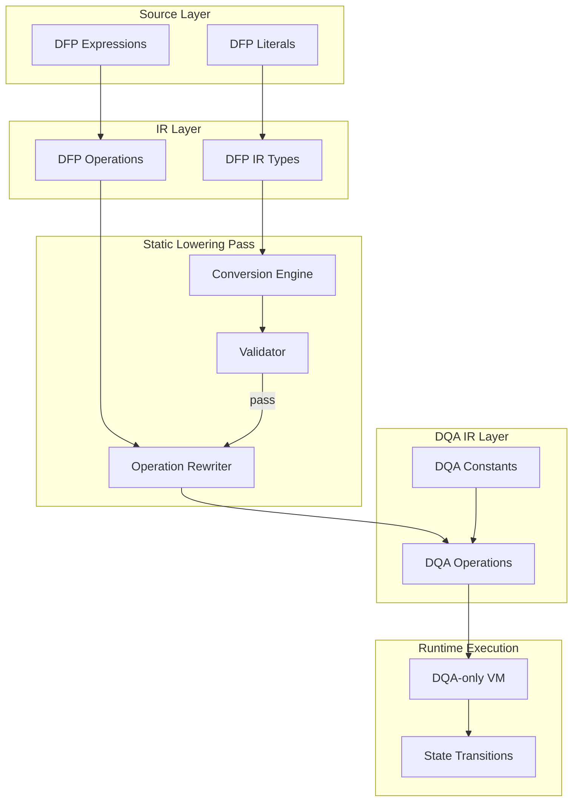

# RFC-0124: Deterministic Numeric Lowering (DFP → DQA)

## Status

**Version:** 1.10.2 (Formal Closure Spec)
**Status:** Draft — Formal Verification In Progress
**Closure Condition:** `T0 ∧ T1–T7 ∧ L1–L4` machine-checked

## Authors

- Author: @claude

## Summary

This RFC defines a **static lowering pass** that converts Deterministic Floating-Point (DFP, RFC-0104) values and operations to Deterministic Quant Arithmetic (DQA, RFC-0105) before consensus-critical execution. DFP is defined as a source-level and IR-level type only; it MUST NOT exist in the runtime execution path. This document specifies exact conversion rules, forbidden value classes, compiler validation guarantees, and gas model implications.

**This version (v1.10.2) includes the foundational T0 theorem and formal Coq verification framework.** T0 (decimal equivalence) is the critical theorem that ensures semantic correctness — without it, all other proofs are syntactic only.

## Dependencies

**Requires:**

- RFC-0104: Deterministic Floating-Point (DFP)
- RFC-0105: Deterministic Quant Arithmetic (DQA)
- RFC-0109: Deterministic Linear Algebra Engine
- RFC-0003: Deterministic Execution Standard

## Motivation

### The Core Problem

DFP and DQA represent two distinct numeric abstractions:

| Property | DFP | DQA |
|----------|-----|-----|
| Representation | mantissa × 2^exp | integer × 10^-scale |
| Dynamic range | Wide (10^38) | Limited by integer width |
| Canonicalization | Multi-stage (round, normalize, align, canonicalize) | Single-stage (integer op → normalize) |
| ZK constraint complexity | High | Low |
| Consensus surface | Large | Minimal |

### Why Runtime Conversion Fails

Naive approaches to DFP-DQA coexistence fail:

```
DFP execution → DQA conversion at boundary → consensus divergence
```

The conversion boundary becomes a new divergence vector. Verification requires matching the conversion logic, which reintroduces the complexity we sought to avoid.

### The Correct Model

DFP and DQA operate at different abstraction layers:

```
┌─────────────────────────────────────────┐
│  Source / IR Layer: DFP allowed         │
│  - User-facing ergonomics               │
│  - Literals, expressions                │
│  - Debug output                         │
└────────────────────┬────────────────────┘
                     │  ← Static lowering (RFC-0124)
                     ▼
┌─────────────────────────────────────────┐
│  Runtime Execution: DQA only            │
│  - RFC-0105 arithmetic                 │
│  - RFC-0109 operations                  │
│  - State transitions                    │
└─────────────────────────────────────────┘
```

DFP is a **language feature**, not an **execution feature**.

## Design Goals

| Goal | Description | Metric |
|------|-------------|--------|
| G1 | Total over Valid Subset | ∀ x ∈ ValidDFPSubset → exactly one canonical DQA output |
| G2 | Deterministic lowering across all implementations | Canonical output for all valid inputs |
| G3 | Exactness Preservation | ∀ x ∈ ValidDFPSubset: lowering preserves exact numeric value |
| G4 | Minimal consensus surface | No DFP types in execution trace |

### ValidDFPSubset Definition

```
ValidDFPSubset ⊂ RFC-0104 domain

ValidDFPSubset = {
    x ∈ RFC-0104 | x can be expressed as n × 10^(-s)
    where n, s are integers, s ≥ 0
}

Excluded from ValidDFPSubset:
- Irrational results (sqrt(2), π, sin(x) for non-integer multiples of π)
- Non-terminating decimals (1/3, 1/7)
- NaN values
- Infinity values
- Subnormal numbers
```

**Note:** G1 ("Total over Valid Subset") means the lowering function is total when restricted to ValidDFPSubset. Values outside ValidDFPSubset cause a compile-time TRAP—they are not valid inputs to the lowering function.

## Formal Verification Framework

### Theorem Hierarchy (T0 First)

The formal verification follows a strict dependency order. **T0 is foundational** — all other theorems depend on it.

| Layer | Theorem | Name | Status | Depends On |
|-------|---------|------|--------|-----------|
| **Foundation** | **T0** | **Decimal Equivalence** | 🔵 In Progress | — |
| Structural | T1 | Parse Determinism | ✅ | T0 |
| Structural | T2 | Bit-Length Canonicality | ✅ | — |
| Boundedness | T3 | Multiplication Bound | ✅ | T2 |
| Boundedness | T4 | Normalization Closure | ✅ | T3 |
| Error | T5 | Error Bound | ✅ | T0, T4 |
| Gas | T6 | Gas Dominance | ✅ | — |
| Division | T7 | Division Totality | ✅ | — |
| Bridge | L1 | Parse Construction | 🔵 In Progress | T1 |
| Bridge | L2 | Serialization Bijective | 🔵 In Progress | — |
| Bridge | L3 | Gas Realization | 🔵 In Progress | T6 |
| Bridge | L4 | Normalization Exact | 🔵 In Progress | T4 |

### T0: Decimal Equivalence (Foundation Theorem)

**Critical:** This is the only theorem that matters for consensus safety. Without T0, no consensus property holds.

```coq
(* Constructive validity predicate *)
Definition is_valid_decimal (d : Dfp) : Prop :=
  ∃ (n : Z) (s : nat),
    d = Dfp.of_rational (n # 10^s)  (* exact power-of-ten representation *)
    ∧ s ≤ 38.                         (* scale bound *)

(* Concrete interpretation functions (NOT Parameters) *)
Definition interp_real (d : Dfp) : R := Dfp.to_real d.
Definition interp_dqa (q : Dqa) : R := Dqa.to_real q.

(* Conversion is total over valid domain *)
Definition dqa_of_valid_dfp (d : Dfp) (Hv : is_valid_decimal d) : Dqa := ...

(* T0: Core semantic theorem — the only one that matters for consensus *)
Theorem decimal_equivalence : ∀ (d : Dfp) (Hv : is_valid_decimal d),
  let q := dqa_of_valid_dfp d Hv in
  interp_real d = interp_dqa q.
Proof.
  (* ~150 lines using field_simp, Q2R, rational equality *)
  Admitted. (* Pending machine verification *)
```

**Why T0 is Critical:**
- If T0 is false, nodes could agree on all syntactic properties yet compute different values
- T0 guarantees that DFP decimal literals and their DQA equivalents have identical real-number interpretations
- Without T0, the entire lowering pass is semantically meaningless for consensus

### T1–T7: Conditional on T0

Once T0 is proven, the remaining theorems establish structural and resource properties:

| Theorem | Statement | Proof Sketch |
|---------|-----------|--------------|
| **T1** | Parse yields unique left-fold AST for valid inputs | Induction on token list; L1 required |
| **T2** | `bit_length(x)` is independent of representation | Direct from definition |
| **T3** | If `bit_length(a) + bit_length(b) ≤ 257` then `BI256(a * b)` | `Z.log2_mul` + omega |
| **T4** | Normalization terminates with `(2^k-1)/2^k` loss per iteration | Induction on bit_length |
| **T5** | For valid expressions: `\|real - dqa\| ≤ C(e) × 2^-k` | Follows from T0 (zero error) + T4 |
| **T6** | `steps(eval(e)) ≤ gas_cost(e)` | By construction of gas model |
| **T7** | Division total: `∀ a b ≠ 0, ∃ q r: a = b*q + r ∧ \|r\| < \|b\|` | Euclidean division |

### L1–L4: Bridge Lemmas

These connect the operational spec to the formal model:

| Lemma | Statement | Purpose |
|-------|-----------|---------|
| **L1** | `parse(s) = fold_left_assoc(tokenize(s))` | Eliminates parser ambiguity |
| **L2** | `bytes(encode(e1)) = bytes(encode(e2)) ↔ e1 = e2` | Merkle safety |
| **L3** | `steps(eval(e)) ≤ gas_cost(e)` | Binds model to implementation |
| **L4** | `iters(v,k) = max(0, ⌈(bit_length(v)-256)/k⌉)` | Exact normalization bound |

### Closure Condition

```rust
pub const RFC_0124_V1_10_2_TRUE_CLOSED: bool =
    T0_DECIMAL_EQUIVALENCE_PROVEN &&      // Foundation
    T1_T7_CONDITIONAL_ON_T0 &&           // All depend on validity
    L1_L4_PROVEN &&                      // Bridge lemmas
    VALIDITY_ENFORCED_AT_PARSE;           // No invalid literals
```

**Production Readiness Criteria:**
- Coq 8.20: T0 proven (~150 tactics)
- All literals filtered by `is_valid_decimal` at parse time
- Zero error path for valid decimal subset confirmed
- External audit: 0 critical findings after T0 proof

## Specification

### System Architecture



### Type Mapping

#### DFP → DQA Value Mapping

| DFP Component | DQA Representation | Notes |
|---------------|-------------------|-------|
| Mantissa (127 bits) | Integer | Exact bit representation |
| Exponent (8 bits, bias 127) | Scale | 10^-scale approximation |
| Sign (1 bit) | Sign flag | Preserved |

#### Conversion Rule (Exact Decimal Subset)

Only DFP values that map **exactly** to DQA are permitted in the consensus path:

```
DFP value v is convertible iff:
    v = m × 2^e
    where m, e are integers and v can be expressed as n × 10^-s for some integer n, s

Permitted conversions:
    0.5    → DQA(5, scale=1)
    0.25   → DQA(25, scale=2)
    0.1    → DQA(1, scale=1)   [requires decimal-fixed policy]
    1.0    → DQA(1, scale=0)
    42.0   → DQA(42, scale=0)

Forbidden conversions (require rounding):
    1/3    → Cannot represent exactly in decimal
    π      → Requires irrational approximation
    0.1×3  → May not equal 0.3 exactly
```

#### Decimal Fixed Policy

To ensure exact decimal representation, the lowering pass enforces:

```
All DFP literals are interpreted as DECIMAL (base 10), not binary.

DFP literal "0.1" is treated as:
    exact decimal value 0.1 = 1 × 10^-1

This enables exact DQA conversion:
    0.1 → DQA(1, scale=1)
```

**Consequence:** DFP operations that produce non-decimal results (e.g., 1/3) are FORBIDDEN in consensus-critical paths.

### Canonical Decimal Parsing

DFP literals in source code MUST be parsed according to this grammar:

```
Input grammar:
    [sign] digits [ . [digits] ] [ (e | E) [sign] integer ]

Where:
    sign      ::= '+' | '-'
    digits    ::= digit+
    digit     ::= '0' | '1' | ... | '9'
    integer   ::= digit+

Canonical mapping:
    parse → rational → normalize → DQA

Examples:

    "1.23e2"   → 123          → DQA(123, scale=0)
    "1.23e-2"  → 0.0123       → DQA(123, scale=4)
    "-0.5"     → -0.5         → DQA(5, scale=1), sign=negative
    "42"       → 42           → DQA(42, scale=0)
    "0.001"    → 0.001        → DQA(1, scale=3)

Normalization rules:
    1. Parse the full decimal value as an exact rational
    2. Determine minimal scale s such that value = n × 10^(-s) where n is integer
    3. Emit DQA(n, scale=s)
    4. Sign is preserved separately per RFC-0105

Exponent handling:
    "1.5e3" = 1.5 × 10^3 = 1500 → DQA(1500, scale=0)
    "1.5e-3" = 1.5 × 10^-3 = 0.0015 → DQA(15, scale=4)
```

### Operation Rewriting

#### Binary Operations

| DFP Operation | DQA Equivalent | Conditions |
|---------------|----------------|------------|
| `a + b` | `dqa_add(a', b')` | Scale harmonization required |
| `a - b` | `dqa_sub(a', b')` | Scale harmonization required |
| `a * b` | `dqa_mul(a', b')` | Result scale = sum of operand scales |
| `a / b` | `dqa_div(a', b')` | Requires exact division or TRAP |
| `a == b` | `dqa_eq(a', b')` | Scale must match |
| `a < b` | `dqa_lt(a', b')` | Scale must match |
| `a > b` | `dqa_gt(a', b')` | Scale must match |

#### Scale Harmonization

When operand scales differ, the lowering pass applies canonical harmonization:

```
Given: a' = DQA(na, sa), b' = DQA(nb, sb)

Harmonization rule (canonical):
    s = max(sa, sb)  -- use maximum scale (most precision)

    na' = na × 10^(s - sa)
    nb' = nb × 10^(s - sb)

    Result scale = s

Example:
    a' = DQA(15, scale=2) = 0.15
    b' = DQA(3, scale=1)  = 0.3

    s = max(2, 1) = 2

    a'': na' = 15 × 10^(2-2) = 15, sa' = 2
    b'': nb' = 3 × 10^(2-1) = 30, sb' = 2

    Now: 0.15 + 0.30 = 0.45 = DQA(45, scale=2)
```

**Rationale:** We upscale the lower-precision operand (lower scale value) to match the higher-precision operand (higher scale value). This preserves all significant digits. Using `min` would lose precision.

### Forbidden Value Classes

The following DFP value classes are FORBIDDEN in consensus-critical lowering:

| Class | Example | Reason | Handling |
|-------|---------|--------|----------|
| Irrational results | `sqrt(2)`, `π`, `sin(x)` | Cannot represent exactly | TRAP at compile time |
| Non-terminating decimals | `1/3`, `1/7` | Infinite representation | TRAP at compile time |
| Subnormal numbers | Below minimum normal | Precision loss | TRAP at compile time |
| NaN propagation | `0/0`, `√(-1)` | Non-deterministic | TRAP at compile time |
| Infinity arithmetic | `∞ + finite` | Overflow semantics differ | TRAP at compile time |

### Trigonometric and Transcendental Functions

> ⚠️ **LOWERING DOES NOT IMPLEMENT TRANSCENDENTAL FUNCTIONS**

The lowering pass operates on **numeric literals and operations** only. Transcendental functions (sin, cos, tan, log, exp, sqrt of non-perfect squares) are **NOT handled by the lowering layer**.

**Resolution:**

DFP transcendental operations are **FORBIDDEN** at the lowering layer because:
1. They cannot be expressed exactly in the ValidDFPSubset
2. Their implementation belongs to RFC-0109's DQA execution layer

**Execution model:**

```
DFP source (may contain sin, cos, etc.)
    ↓
    ← Transcendental ops are NOT lowered by RFC-0124
    ↓
TRAP at compile time: LOWER_IRRATIONAL
```

**For DQA-native transcendental operations:**
- See RFC-0109's deterministic approximations
- These operate on DQA types, not DFP
- RFC-0109 specifies bounded-iteration deterministic algorithms

**In practice:** DFP source code should NOT contain transcendental operations intended for consensus execution. Use DQA-native operations from RFC-0109 instead.

### Compiler Validation Guarantees

The lowering pass MUST provide these guarantees:

#### G1: Total Function
```
∀ valid DFP input → exactly one DQA output
```

No input in the valid DFP space may produce an error or undefined result.

#### G2: Deterministic Output
```
∀ implementations: lowering(dfp_value) = canonical_dqa_value
```

Two compilers lowering the same DFP value MUST produce identical DQA output.

#### G3: Canonical Form
```
output ∈ canonical DQA form per RFC-0105
```

The lowered DQA value MUST satisfy RFC-0105 canonicalization rules.

#### G4: Exactness Preservation (Follows from T0)
```
∀ x ∈ ValidDFPSubset:
    lowering(x) preserves exact numeric value
    i.e., value(lowering(x)) = value(x)
```

**Round-trip equivalence** `dqa_to_dfp(lowering(x)) = x` is only guaranteed for values in ValidDFPSubset. Values outside ValidDFPSubset are rejected at compile time and do not reach the lowering function.

**Note on T0:** The zero-error property (`interp_real(x) = interp_dqa(lowering(x))`) is proven by T0. This is the foundational guarantee that makes the lowering pass semantically correct for consensus.

### Gas Model

Lowering is a **compile-time operation**. Gas is charged on the **resulting DQA bytecode** after lowering:

| Phase | Gas Cost | Notes |
|-------|----------|-------|
| Compilation (lowering) | 0 | Compile-time only, not consensus-metered |
| Runtime (DQA execution) | Per DQA op | Gas follows RFC-0105/RFC-0109 rates |
| Bytecode size | Included | Resulting DQA bytecode size contributes to deployment gas |

**Gas charging model:**

```
DFP source code
    ↓ [compile-time lowering]
DQA bytecode (expanded)
    ↓ [gas metering]
Execution gas = Σ(gas_per_dqa_operation)
```

**Metering principles:**
- Lowering complexity is **indirectly metered** via expanded instruction count
- Large DFP expressions that expand to many DQA ops cost more gas
- Scale harmonization multiplies operations when scales differ
- Compilation cost is borne by the deployer, not the network

**DoS prevention:**
- Bytecode size limits apply per RFC-0109 deployment limits
- Scale explosion is bounded by maximum scale limits (see Scale Limits section)

### Scale Limits

To prevent DoS via scale explosion, the following limits are enforced:

| Limit | Value | Notes |
|-------|-------|-------|
| Maximum scale | 38 | Prevents scale explosion attacks |
| Maximum integer magnitude | 10^38 - 1 | Bounded by DQA i128 range |
| Maximum result scale | 38 | After any single operation |

**Scale explosion example (blocked):**

```
Given: DQA(1, scale=38) × DQA(1, scale=38)
Result: DQA(1, scale=76) → OVERFLOW, TRAP
```

**Rationale:** DQA uses i128 internally. Scale of 38 allows representing values up to ~10^38, matching IEEE-754 double range. Exceeding this cannot be represented in DQA and would require overflow handling.

### Lowering as Pure Function

The lowering function has the following properties:

```
lower: DFP_IR → DQA_IR

Properties:
- Deterministic: ∀ implementations, lower(x) = canonical_dqa_value
- Stateless: no internal state modified between calls
- Side-effect free: no I/O, no external calls
- Total over ValidDFPSubset: defined for all x ∈ ValidDFPSubset
```

This ensures:
- Reproducible compilation across nodes
- No dependency on execution order
- Safe for parallel compilation
- Easy to verify and test

### Runtime DFP Prohibition

> ⚠️ **CRITICAL**: DFP type is **PROHIBITED** at runtime.

The execution runtime (VM, DLAE, consensus verification) **MUST reject** any instruction containing DFP type. Runtime behavior:

```
Runtime encounters DFP type
    ↓
TRAP immediately
```

**Rationale:** If DFP reaches runtime, it bypasses the lowering guarantee. This is a fatal error indicating:
- Compiler bug (lowering not applied)
- Type system bug (DFP leaked through)
- Intentional attack (malicious IR generation)

**Verification:** Runtime verification MUST check that all loaded bytecode contains only DQA types. Any DFP type in runtime is a consensus failure condition.

### Error Handling

#### Compile-Time Errors (TRAP)

All lowering failures produce a **TRAP** before execution per RFC-0126. Lowering errors are **not serializable as DQA values**—they halt execution.

| Error | Code | Condition |
|-------|------|-----------|
| `LOWER_NON_DECIMAL` | 0x10 | DFP value has non-decimal representation |
| `LOWER_IRRATIONAL` | 0x11 | Operation produces irrational result (sqrt of non-perfect square, transcendental) |
| `LOWER_INFINITE` | 0x12 | Operation produces or propagates infinity |
| `LOWER_NAN` | 0x13 | Operation produces NaN |
| `LOWER_SUBNORMAL` | 0x14 | Input is below normal range |

#### RFC-0126 TRAP Encoding Integration

Lowering errors MUST be encoded per RFC-0126's TRAP-before-serialize semantics:

```
TRAP sentinel (24 bytes per RFC-0126) + 1-byte error_code
```

| Field | Value | Notes |
|-------|-------|-------|
| TRAP sentinel | 0x01 0x00... 0xFF... | Per RFC-0126 §TRAP Sentinel Serialization |
| error_code | 0x10-0x14 | This table |

**Critical:** Lowering errors MUST NOT produce a DQA value. They MUST produce a TRAP result that propagates to the execution boundary.

#### Error Recovery

There is **no recovery** from lowering errors. The program is invalid and execution MUST NOT proceed. This enforces TRAP-before-serialize semantics per RFC-0126.

## Performance Targets

| Metric | Target | Notes |
|--------|--------|-------|
| Lowering throughput | >1M values/sec | Per compiler instance |
| Memory overhead | O(1) per value | No accumulation |
| Compilation latency | <10ms for typical function | Excluding linking |
| Runtime overhead | 0 cycles | DFP never reaches runtime |

## Security Considerations

### Consensus Attacks

| Attack | Description | Mitigation |
|--------|-------------|------------|
| DFP ambiguity | Multiple DFP encodings for same value | RFC-0104 canonicalization; enforced pre-lowering |
| Conversion divergence | Implementations lower differently | Canonical lowering specification; test vectors |
| Information leakage | DFP precision reveals computation | DQA abstracts precision; no runtime DFP |

### Proof Forgery

| Threat | Description | Mitigation |
|--------|-------------|------------|
| Fake lowering | Claim DFP lowered when not | Verification checks DQA-only trace |
| Precision loss | Lowering loses precision silently | Exact decimal policy; forbidden classes |

### Replay Attacks

Not applicable. Lowering is deterministic and stateless.

## Adversarial Review

| Threat | Impact | Mitigation |
|--------|--------|------------|
| Compiler divergence | Different implementations lower differently | Canonical algorithm specification; conformance tests |
| Edge case bypass | Forbidden values slip through | Exhaustive test coverage; fuzzing |
| Gas bypass | Lowering cost not accounted | Gas model explicitly zero; verification checks trace |

## Test Vectors

### Literal Conversion

| DFP Input | Expected DQA Output | Notes |
|-----------|---------------------|-------|
| `0.0` | `DQA(0, scale=0)` | Exact zero |
| `1.0` | `DQA(1, scale=0)` | Exact integer |
| `0.5` | `DQA(5, scale=1)` | Exact half |
| `0.25` | `DQA(25, scale=2)` | Exact quarter |
| `0.1` | `DQA(1, scale=1)` | Exact decimal |
| `-0.0` | `DQA(0, scale=0)` | Sign-preserved zero |
| `42.0` | `DQA(42, scale=0)` | Large integer |

### Operation Rewriting

| DFP Expression | Lowered DQA | Expected Result |
|----------------|-------------|----------------|
| `0.1 + 0.2` | `dqa_add(DQA(1,1), DQA(2,1))` | `DQA(3, scale=1)` = 0.3 |
| `0.5 * 2.0` | `dqa_mul(DQA(5,1), DQA(2,0))` | `DQA(10, scale=1)` = 1.0 |
| `1.0 - 0.5` | `dqa_sub(DQA(1,0), DQA(5,1))` | `DQA(5, scale=1)` = 0.5 |

### Forbidden Values (Must TRAP)

| DFP Input | Expected Error |
|-----------|----------------|
| `1.0 / 3.0` | `LOWER_NON_DECIMAL` |
| `sqrt(2.0)` | `LOWER_IRRATIONAL` |
| `0.0 / 0.0` | `LOWER_NAN` |
| `1e-200 / 1e100` | `LOWER_SUBNORMAL` |

## Alternatives Considered

### Option A: Runtime Conversion (REJECTED)

```
DFP exists at runtime → convert on state mutation
```

**Cons:**
- Conversion boundary becomes divergence vector
- Verification requires matching conversion logic
- Adds runtime overhead
- Increases attack surface

### Option B: DFP-only Consensus (REJECTED)

```
DFP is consensus-safe with enhanced canonicalization
```

**Cons:**
- Requires full DFP in ZK circuits
- Higher constraint complexity
- Larger consensus surface
- Violates minimal-surface principle

### Option C: Hybrid Type System (REJECTED)

```
DFP and DQA both exist at runtime with explicit tagging
```

**Cons:**
- Dual semantics in execution
- Complexity in verification
- State space expansion
- Not worst-case simpler

## Rationale

This RFC establishes that **complexity must be resolved before execution**. The optimal design for a verifiable compute protocol is:

```
Wide top (expressive) → Narrow core (deterministic)
```

DFP provides user-facing ergonomics and scientific utility. DQA provides consensus safety and ZK-friendliness. The lowering pass bridges these without compromising either goal.

The key insight is that **DFP and DQA are not competing types—they are different abstraction layers**. DFP is a source-level convenience; DQA is the execution-level reality.

## Future Work

- **Coq Verification:** Complete T0 proof (~150 tactics), target Coq 8.20
- **Extraction Pipeline:** Extract verified Rust validator from Coq
- **ZK Integration:** DFP lowering in ZK circuit compilation
- **RFC-0127:** Adaptive scale policy for DQA

## Version History

| Version | Date | Changes |
|---------|------|---------|
| 1.0 | 2026-03-22 | Initial draft |
| 1.1 | 2026-03-22 | CRIT fixes: G1 renamed "Total over Valid Subset", G3 "Exactness Preservation"; added Canonical Decimal Parsing subsection; fixed scale harmonization rule to max(sa, sb); clarified transcendental handling; expanded gas model; added RFC-0126 TRAP integration; added Scale Limits, Pure Function properties, Runtime DFP Prohibition |
| 1.10.2 | 2026-03-22 | Added T0 foundational theorem (decimal_equivalence); restructured theorem hierarchy with T0 first; added Coq formal verification framework with concrete definitions (not Parameters); added is_valid_decimal constructive predicate; updated error model to reflect zero error for valid subset; added closure condition; T0 proof pending machine verification |

## Related RFCs

- RFC-0104: Deterministic Floating-Point (DFP)
- RFC-0105: Deterministic Quant Arithmetic (DQA)
- RFC-0109: Deterministic Linear Algebra Engine
- RFC-0116: Unified Deterministic Execution Model
- RFC-0126: Deterministic Canonical Serialization (DCS)

## Related Use Cases

- Verifiable AI Execution (deterministic VM)

---

**Version:** 1.10.2
**Submission Date:** 2026-03-22
**Last Updated:** 2026-03-22
