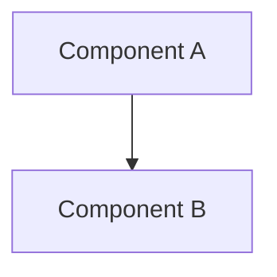

# RFC-XXXX (Category): [Title]

## Status

Draft | Review | Accepted | Final | Rejected | Superseded | Deprecated

> **Note:** This RFC was originally numbered RFC-XXXX under the legacy numbering system. It remains at XXXX as it belongs to the [Category] category.

## Authors

- Author: @username

## Maintainers

- Maintainer: @username

## Summary

One-paragraph overview of what this RFC defines.

## Dependencies

**Requires:**

- RFC-XXXX (Category): [Title]

**Optional:**

- RFC-XXXX (Category): [Title]

> **Dependency Validation Rules:**
> 1. Dependencies MUST form a DAG (no cycles)
> 2. All "Requires" RFCs MUST be listed as mission prerequisites
> 3. Optional dependencies MUST be documented separately from required
> 4. Dependencies on "Planned" RFCs MUST note the assumption they will be Accepted

## Design Goals

Specific measurable objectives (G1, G2, G3...).

| Goal | Target | Metric        |
| ---- | ------ | ------------- |
| G1   | <50ms  | Query latency |
| G2   | >95%   | Recall@10     |

## Motivation

Why this RFC? What problem does it solve?

## Roles and Authorities

> **The "Nothing should be implied" rule (specification layer):** Every actor that affects correctness, security, accountability, or consensus MUST be named with a stable identifier, a defined authority scope, and a typed lifecycle. Inference is a defect. Cross-reference: BLUEPRINT.md "Human vs Agent Roles" table.

MUST enumerate:

1. **Roles** — every distinct class of actor (human, automated, on-chain, off-chain). For each: stable identifier, base capabilities, who can assume it, who can revoke it.
2. **Authorities** — every action that requires authorization. For each: granting role, scope (read/write/admin/none), expiry (term-limited / permanent / epoch-bounded), audit trail.
3. **Role transitions** — every state change a role can undergo. For each: trigger, deterministic?, side effects, signing requirement.
4. **Out-of-scope roles** — actors the design explicitly does NOT address (e.g., "the platform operator manages physical group membership, which is out of scope for this RFC"). The *out-of-scope* statement itself is a named responsibility transfer; if unstated, it is an implicit assumption and MUST appear in the Implicit Assumptions Audit.

### Role/Authority Coverage Table

| Role | Identifier | Authority Scope | Lifecycle | Source/Ref |
|------|------------|-----------------|-----------|------------|
| [Role] | [enum/struct/string] | [read/write/admin/none] | [state machine, or "stateless" with justification] | [RFC §X / external] |

If a role has no lifecycle, mark "stateless" with a one-line justification (e.g., "validation function with no persistent state").

If the design intentionally has implicit roles, list them under "ACCEPTED IMPLICIT ROLES" with rationale and a deadline for explicit naming. Implicit roles are not allowed to flow past Accept status without an audit entry.

## Specification

Technical details, constraints, interfaces, data types, algorithms.

### System Architecture



### Data Structures

Formal interface definitions.

### Algorithms

Canonical algorithms with deterministic behavior.

### Lifecycle Requirements

> **Required for any RFC that defines an actor with more than one state** (e.g., coordinator, operator, validator, archivist, election, rotation, handover, demotion). If the RFC has no stateful actors, state "No stateful actors in this RFC" with a one-line justification.

For each stateful actor:

1. **State machine** — diagram (Mermaid `stateDiagram-v2`) listing every state.
2. **Transition table** — columns: `From`, `To`, `Trigger`, `Deterministic?`, `Side Effects`, `Signing Requirement`.
3. **Liveness check** — heartbeat / probe / epoch-bound / no-check, with interval.
4. **Recovery semantics** — what happens on missed heartbeat, slash, demotion, network partition.
5. **Time bounds** — minimum/maximum term, cool-down, grace period.

#### Example: Coordinator Lifecycle (RFC-0855 §16.3 reference, future `CoordinatorRecord` RFC)

```rust
#[repr(u8)]
enum CoordinatorLifecycle {
    Designated = 0x00,  // named at genesis, not yet active
    Elected = 0x01,     // election tally met quorum
    Active = 0x02,      // heartbeat running, signing envelopes
    Suspect = 0x03,     // missed heartbeat threshold
    Handover = 0x04,    // standing down for successor
    Demoting = 0x05,    // slashed; OCTO-O stake released
    Resigned = 0x06,    // voluntary exit; cool-down applies
    Inactive = 0x07,    // role ended
}
```

| From | To | Trigger | Deterministic? | Side Effects | Signing |
|------|----|---------|----------------|--------------|---------|
| Designated | Elected | Election tally meets quorum | Yes | Record `coordinator_term_id` | Election envelope |
| Active | Suspect | `current_epoch - last_heartbeat > 2 × heartbeat_interval` | Yes | Emit liveness alert | n/a |
| Suspect | Handover | Grace period exceeded | Yes | Trigger successor election | n/a |
| Active | Demoting | Slash proof + governance vote | Yes | Slash OCTO-O stake | Slash proof |

### Determinism Requirements

MUST specify deterministic behavior if affecting consensus, proofs, or verification.

### RFC-0008 Execution Class Mapping

Every RFC MUST include a table mapping its operations to execution classes:

| Operation | Class | Rationale |
|-----------|-------|-----------|
| [operation] | A/B/C | [why] |

This is required for all RFCs, not just those touching consensus. If an RFC has no consensus-critical operations, state "All operations are Class C" explicitly.

### Error Handling

Error codes and recovery strategies.

## Performance Targets

| Metric     | Target | Notes       |
| ---------- | ------ | ----------- |
| Latency    | <50ms  | @ 1K QPS    |
| Throughput | >10k/s | Single node |

## Implicit Assumptions Audit

> **The "Nothing should be implied" rule (validation layer):** Every assumption the design relies on that is not enforced by types, runtime validation, or test coverage MUST be listed here. Each assumption MUST have its blast radius and its mitigation. ACCEPTED RISK entries are permitted but require rationale and a deadline for closure.

| Assumption | Where Relied Upon | Blast Radius if False | Mitigation / Status |
|------------|-------------------|----------------------|---------------------|
| [single-sentence statement] | [§X.Y / file:line] | [what breaks, who is affected, recoverable or not] | [test / runtime check / ACCEPTED RISK: rationale + deadline] |

An empty audit is acceptable ONLY for trivial RFCs (state "No implicit assumptions"). Most RFCs will have 3+ entries.

### Categories to Audit (MUST be considered for every RFC)

- **Operator trust** — does the design assume a trusted human? If yes, what happens if the operator is compromised, impersonated, or coerced?
- **Platform trust** — does the design assume a trusted external platform (e.g., WhatsApp, Telegram, IPFS)? If yes, what happens if the platform revokes access, modifies behavior, spies on traffic, or is compromised?
- **Time source** — does the design assume wall-clock time, monotonic time, or NTP? If yes, what happens with clock skew, NTP failure, leap seconds, or a malicious time source?
- **Network partition** — does the design assume connectivity between roles? If yes, what happens during partitions, including Byzantine partition?
- **Upgrade safety** — does the design assume all nodes are on the same version? If yes, what happens during rollout, rollback, fork, or mixed-version operation?
- **Configuration** — does the design assume config is correct, signed, or audited? If yes, what happens with misconfiguration, malicious config, or stale config?
- **Identity stability** — does the design assume an identity is stable (key, peer ID, phone number, account)? If yes, what happens with key rotation, re-pairing, account loss, or SIM swap?
- **Resource availability** — does the design assume disk, memory, bandwidth, or stake availability? If yes, what happens with resource exhaustion?

## Security Considerations

MUST document:

- Consensus attacks
- Economic exploits
- Proof forgery
- Replay attacks
- Determinism violations

## Adversary Analysis

> **The 5-Question Adversary Test:** For every design decision with security implications, enumerate: (1) who benefits from breaking it, (2) what it costs them, (3) what they gain if successful, (4) what's our defense and its cost to legitimate operation, (5) what's the residual risk and is it acceptable. A design decision that cannot answer all 5 questions is incomplete.

### Decision Table

| Decision | Q1 Beneficiary | Q2 Cost to Attacker | Q3 Gain if Successful | Q4 Defense (cost to legit op) | Q5 Residual Risk |
|----------|----------------|---------------------|------------------------|------------------------------|------------------|
| [decision, e.g. "accept any DOT/1/... text from any sender in any configured group"] | [named by capability, e.g. "ejected group member", "compromised phone", "Sybil cluster"] | [time, money, stake, identity burn — quantify] | [funds, message injection, suppression, governance capture, identity theft] | [defense type + cost to legitimate operation + false-positive rate] | [acceptable? why? what monitoring detects it?] |

### Severity Classification (aligns with BLUEPRINT.md Adversarial Review Process)

| Severity | Definition | Action |
|----------|-----------|--------|
| **CRITICAL** | Total compromise, consensus split, unbounded fund loss, identity theft at scale | MUST mitigate before Accept; if not mitigated, RFC is Rejected |
| **HIGH** | Bounded fund loss, single-domain compromise, denial of service, governance capture with quorum | SHOULD mitigate before Accept; if not, ACCEPTED RISK with deadline |
| **MEDIUM** | Reputation loss, false positives, performance degradation, single-user compromise | SHOULD mitigate; document residual and monitoring |
| **LOW** | Theoretical attack, requires unrealistic capabilities, defense cost > loss magnitude | MAY accept; document residual |

### Multi-Round Review

This section integrates with the [Adversarial Review Process](../../docs/BLUEPRINT.md#adversarial-review-process). Multi-round review with severity classification is REQUIRED for any RFC touching:

- Token economics or dual-stake model
- Consensus, state machines, or state transitions
- Cryptographic primitives, key derivation, or signature schemes
- Coordinator, operator, or any authority-granting role
- Permissioned access to physical resources (network adapters, file system, hardware, RPC endpoints)
- Admission, expulsion, or slashing policies

Review process artifacts: ephemeral review files go in `docs/reviews/` (gitignored). The final summary goes in the Version History section. See [Adversarial Audit skill](../../.jcode/skills/adversarial-audit/SKILL.md) for the worked-example methodology.

## Economic Analysis

(Optional) Market dynamics and economic attack surfaces.

### Token Economics Reference

For any RFC touching participation, staking, governance, or economic incentives, include a reference to the dual-stake model:

> Participants MUST satisfy dual-stake requirements: 1,000 OCTO global stake + role-specific stake per `docs/04-tokenomics/token-design.md`.

Omit this section only if the RFC has no economic implications.

## Compatibility

Backward/forward compatibility guarantees.

## Test Vectors

Canonical test cases for verification.

## Alternatives Considered

| Approach | Pros | Cons |
| -------- | ---- | ---- |
| Option A | X    | Y    |

## Implementation Phases

### Phase 1: Core

- [ ] Task 1
- [ ] Task 2

### Phase 2: Enhanced

- [ ] Task 3

## Key Files to Modify

| File     | Change           |
| -------- | ---------------- |
| src/a.rs | Add feature X    |
| src/b.rs | Update interface |

## Future Work

- F1: [Description]
- F2: [Description]

## Rationale

Why this approach over alternatives?

## Version History

| Version | Date       | Changes |
| ------- | ---------- | ------- |
| 1.3     | YYYY-MM-DD | Added Roles and Authorities, Implicit Assumptions Audit, Adversary Analysis (5-Question Test), Lifecycle Requirements. Synced Execution Class Mapping, Token Economics Reference, Dependency Validation Rules from BLUEPRINT.md v1.2. |
| 1.0     | YYYY-MM-DD | Initial |

## Related RFCs

- RFC-XXXX (Category): [Title]
- RFC-XXXX (Category): [Title]

## Related Use Cases

- [Use Case Name](../../docs/use-cases/filename.md)

## Appendices

### A. [Topic]

Additional implementation details.

### B. [Topic]

Reference material.

---

**Version:** 1.3
**Submission Date:** YYYY-MM-DD
**Last Updated:** YYYY-MM-DD
