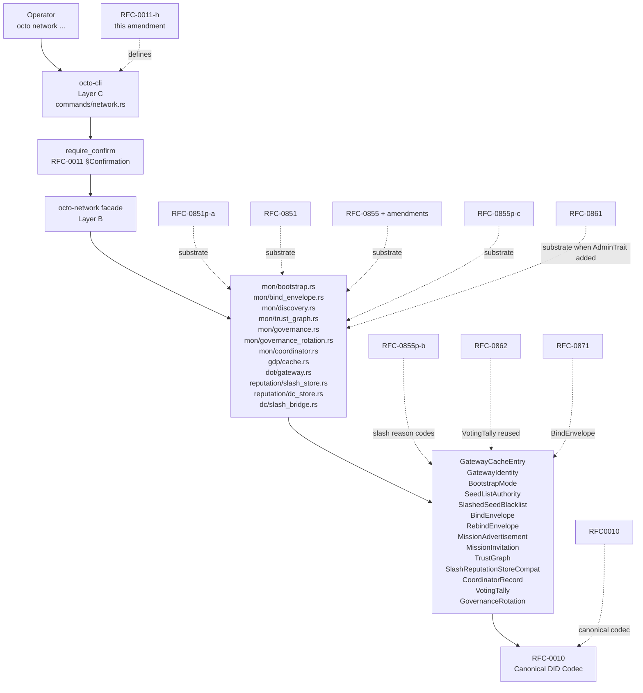

# RFC-0011-h: `octo network` Operations Substrate

## Status

Draft (2026-09-18)

> **Amendment chain:** Subordinate amendment to RFC-0011. Closes the gap DEFERRED from 0011-deprecation-stub-removal (2026-09-17): `octo network bootstrap` + `octo network status` deferred to a future amendment — this is that amendment, scoped to substrate-faithful slice of the full network CLI gap. Substrate-faithful scope bounded by what `octo-network` actually exposes today; substrate-missing slices become explicit companion missions (§Substrate-Additions Companion Missions). Some substrate-faithful rows below also require additive substrate helpers (canonical-bytes, record-loaders); those helpers live in paired substrate-additions companion missions, NOT in this amendment.

## Authors

- Author: @mmacedoeu

## Maintainers

- Maintainer: @mmacedoeu

## Summary

Adds `Commands::Network { NetworkAction }` to `octo` CLI (RFC-0011). 17 substrate-faithful subcommands delegate to real `octo-network` types/methods verified by R1 dry-review ground-truth grep 2026-09-18 + R2 substrate-faithfulness re-verification.

5 functional families (4 subcommand groups; `bind-envelope` straddles Bootstrap + Discovery + Envelope by substrate module, NOT by functional family):

| Family                | Subcommands                                                          | Substrate                                                                |
| --------------------- | -------------------------------------------------------------------- | ------------------------------------------------------------------------ |
| Bootstrap + Discovery | `peers`, `identity`, `mode`, `authority`, `discovery`                | `mon/bootstrap.rs`, `mon/discovery.rs`, `gdp/cache.rs`, `dot/gateway.rs` |
| Trust + Reputation    | `trust-graph`, `slash`                                               | `mon/trust_graph.rs`, `reputation/slash_store.rs`                        |
| Coordinator           | `coordinator`                                                        | `mon/coordinator.rs`, `octo_coordinator_types`                           |
| Governance            | `governance`                                                         | `mon/governance.rs`, `mon/governance_rotation.rs`                        |
| Envelope              | `bind-envelope` (all 4 ops: `show`, `rebind-{prepare,commit,abort}`) | `mon/bind_envelope.rs`                                                   |

Every subcommand is Layer C façade over real `octo-network` (Layer B) call. No CLI reach into substrate internals; all cross typed substrate boundary per [[cipherocto-design-principles]] §Stable Abstractions Principle.

Subcommands documented "DEFERRED (substrate-additions prerequisite)" NOT in binary surface; available only after paired companion mission closes its DRY CLOSED gate.

## Dependencies

**Requires:**

- RFC-0011 — `octo` CLI Substrate (binary surface, output envelope, redaction, error envelope, exit codes, confirmation flag matrix)
- RFC-0008 — Deterministic AI Execution Boundary
- RFC-0010 — Canonical DID Codec (peer DID wire form at every substrate boundary)

**Governing networking RFCs (substrate citations; this amendment does NOT amend them):**

- RFC-0851 — Gateway Discovery Protocol (substrate for `peers`, `identity`, `discovery`)
- RFC-0851p-a — Network Bootstrap Protocol (substrate for `mode`, `authority`, `slash`, `bind-envelope`, `discovery`)
- RFC-0855 — Mission Overlay Networks (substrate for `bind-envelope rebind-*`)
- RFC-0855p-c — Domain Coordinator Role (substrate for `coordinator`)
- RFC-0855p-b — Coordinator Lifecycle (slash reason code allocation in `mon/slashing.rs`)
- RFC-0861 — Coordinator Admin Trait Refinements (substrate for `coordinator admin`)
- RFC-0862 — Writer Election Bootstrap (substrate for `governance tally` via `VotingTally`)
- RFC-0871 — Specialized Node Protocol Envelope (substrate for `bind-envelope`)

> **DAG invariant:** RFC-0010 → RFC-0011 → RFC-0011-h; each networking RFC → RFC-0011-h. No 2-cycle sibling required.

## Design Goals

| Goal | Target                                                                                                   | Metric                                                                                                                                                |
| ---- | -------------------------------------------------------------------------------------------------------- | ----------------------------------------------------------------------------------------------------------------------------------------------------- |
| G1   | Operator-driven bootstrap/status without substrate reach-arounds                                         | `octo network mode show` + `octo network authority show` surface bootstrap state; `octo network peers list` surfaces `GatewayCache` without file-edit |
| G2   | All subcommands delegate through typed substrate boundary                                                | Every CLI handler calls real `octo-network` Layer B function; zero direct reach into private items                                                    |
| G3   | RFC-0011 §Exit Code future-amendment band extended additively                                            | New exit slots 79-89 (per RFC-0011 §Exit Code); additive under `#[non_exhaustive]`                                                                    |
| G4   | All mutating subcommands gated through `require_confirm` + `--confirm-acknowledge` + `--dry-run` default | RFC-0011 §Confirmation flag matrix extension                                                                                                          |
| G5   | All network errors redacted in `OutputEnvelope.error`                                                    | RFC-0011 §Redaction layer extension; peer DIDs surface via `redacted: true` markers; envelope payload bytes never surface                             |
| G6   | Deterministic per-invocation output                                                                      | All 17 subcommands Class C (read-only / local-payload-builder); no Class B consensus-impacting operations                                             |
| G7   | One mission per subcommand-cluster + explicit substrate-additions companion missions                     | Per [[no-phantom-mission-pointers]]; mission YAML paired with each subcommand's `## Subcommand Taxonomy` row                                          |

## Motivation

0011-deprecation-stub-removal (2026-09-17) removed `octo init` / `octo join` / `octo status`. User accepted deferral of `octo network bootstrap` + `octo network status` to a future amendment (User Decision 2026-09-17; `0011-deprecation-stub-removal` §Out of Scope). This amendment is that future amendment, scoped to the substrate-faithful slice only; `bootstrap` + `status` remain gated on companion mission `0011-h-s-a-bootstrap-orchestrator` per §Substrate-Additions Companion Missions.

Phase 0 recon (`docs/audits/2026-09-18-network-cli-gap-recon.md`) identified 20 GAPs between `octo-network` substrate and current `Commands` enum (which has NO `Network { NetworkAction }` variant). R1 + R2 substrate-faithfulness reviews (2026-09-18) confirmed 17 substrate-faithful subcommands map to real `octo-network` substrate; the remaining GAPs are substrate-missing and become explicit companion missions (§Substrate-Additions Companion Missions).

3 concrete operator gaps:

1. **Bootstrap config observability.** Operators edit `$OCTO_HOME/octotransport/bootstrap.toml` for `BootstrapMode` + `SeedListAuthority` but have no CLI surface. Substrate `BootstrapMode` enum + `verify_authority(SeedListAuthority, epoch)` + `SlashedSeedBlacklist` exist; CLI binding does not.
2. **Network state observability.** Operators have no CLI surface for `GatewayCache` entries, trust-graph topology, slash reputation stats, coordinator lifecycle, governance tally. They grep substrate logs. Substrate functions exist for all 17 substrate-faithful subcommands.
3. **Mutating operations unsafe.** Substrate-faithful slice has 4 mutating subcommands (3 `bind-envelope rebind-*` payload builders + 1 deferred `slash mark`); every one must mirror RFC-0011 §Confirmation flag matrix with `--dry-run` default.

## Roles and Authorities

### Role/Authority Coverage Table

| Role                  | Identifier                                   | Authority Scope                                                      | Source/Ref                                       |
| --------------------- | -------------------------------------------- | -------------------------------------------------------------------- | ------------------------------------------------ |
| Operator (CLI caller) | OCTO_HOME path + capability caveats          | read (all 17); write (`bind-envelope rebind-{prepare,commit,abort}`) | RFC-0011 §Roles + RFC-0011-d §Role Provisioning  |
| Bootstrap Authority   | `SeedListAuthority::{Foundation, Dao}`       | gate authority state display                                         | RFC-0851p-a                                      |
| Coordinator           | `CoordinatorRecord` (octo-coordinator-types) | gate `coordinator show` (read-only; admin deferred per RFC-0861)     | RFC-0855p-c                                      |
| Governance Voter      | `VotingTally`                                | gate `governance tally` read                                         | RFC-0862 (substrate reused: `mon/governance.rs`) |

### Per-Subcommand Capability Caveat Matrix

| Subcommand                                    | Human                                                                       | CI  | Dev | Auditor  | Notes                                                  |
| --------------------------------------------- | --------------------------------------------------------------------------- | --- | --- | -------- | ------------------------------------------------------ |
| `peers list` / `peers get`                    | yes                                                                         | yes | yes | yes      | read-only                                              |
| `identity show`                               | yes                                                                         | yes | yes | redacted | peer DID redacted in Audit                             |
| `mode show`                                   | yes                                                                         | yes | yes | yes      | read-only                                              |
| `mode set`                                    | DEFERRED — substrate-additions prerequisite (BootstrapConfig missing)       | no  | no  | no       | see `0011-h-s-a-bootstrap-orchestrator` companion      |
| `authority show`                              | yes                                                                         | yes | yes | yes      | read-only                                              |
| `authority rotate`                            | DEFERRED — substrate-additions prerequisite (rotate_post_fork missing)      | no  | no  | no       | see `0011-h-s-a-seed-list-authority-rotate` companion  |
| `slash excluded` / `slash stats`              | yes                                                                         | yes | yes | redacted | DID redacted in Audit                                  |
| `slash mark`                                  | DEFERRED — substrate-additions prerequisite (SlashStore missing)            | no  | no  | no       | see `0011-h-s-a-slash-store` companion                 |
| `slash list` / `slash show`                   | DEFERRED — substrate-additions prerequisite (SlashStore missing)            | no  | no  | no       | see `0011-h-s-a-slash-store` companion                 |
| `trust-graph render`                          | yes                                                                         | yes | yes | yes      | read-only; `--depth` clamped 1-100                     |
| `coordinator show`                            | yes                                                                         | yes | yes | redacted | coordinator DID redacted in Audit                      |
| `coordinator admin`                           | DEFERRED — substrate-additions prerequisite (CoordinatorAdminTrait missing) | no  | no  | no       | see `0011-h-s-a-coordinator-admin-trait` companion     |
| `governance tally`                            | yes                                                                         | yes | yes | yes      | read-only                                              |
| `governance rotation status`                  | yes                                                                         | yes | yes | yes      | read-only                                              |
| `governance vote`                             | OUT — `octo governance vote` per RFC-0011-g                                 | no  | no  | no       | lives in RFC-0011-g, not this amendment                |
| `bind-envelope show`                          | yes                                                                         | yes | yes | redacted | payload bytes never surfaced                           |
| `bind-envelope rebind-{prepare,commit,abort}` | yes (write)                                                                 | no  | yes | no       | `--dry-run` default + `--confirm-acknowledge` required |
| `discovery advertisement show`                | yes                                                                         | yes | yes | yes      | read-only                                              |
| `discovery invitation show`                   | yes                                                                         | yes | yes | yes      | read-only                                              |

### Out-of-scope Roles

- **P2P gossip peers** — peer-to-peer propagation substrate exists (`mon/gossip.rs`), but peer-to-peer gossip NOT operator-facing. CLI exposes `gossip stats` DEFERRED until `Gossip::stats()` substrate lands.
- **Onion relay operators** — `routing send` DEFERRED until `NetworkSender` substrate lands (RFC-0863 substrate not yet implemented).
- **Quota marketplace operators** — `router status` DEFERRED until `QuotaRouterNode` substrate lands (RFC-0870 substrate not yet implemented).
- **Governance vote tally** — `octo governance vote` lives in RFC-0011-g, NOT this amendment. `governance tally` here is read-only tally inspection (different surface).
- **Slash evidence creation** — operators cannot create `SlashEnvelope`s via CLI; slashes are substrate-driven from `mon/slash_aggregation.rs`. `slash` subcommands are read-only.

## Specification

### System Architecture



### Binary Surface

Additive extension to `crates/octo-cli/src/lib.rs` `Commands` enum:

```rust
#[derive(Subcommand, Debug)]
#[non_exhaustive]
pub enum Commands {
    // ... existing variants (Whoami, Identity, Capability, Policy, Role,
    // Reputation, Mesh, Vault, Agent, Governance, Audit) ...

    /// Network operations subcommands (RFC-0011-h).
    ///
    /// Substrate-faithful slice of 17 subcommands delegating to
    /// `octo-network` Layer B functions. Defer-to-substrate-additions
    /// subcommands tracked in §Substrate-Additions Companion Missions.
    Network {
        /// Network subcommand.
        #[command(subcommand)]
        action: NetworkAction,
    },
}
```

`NetworkAction` enum (10 wrapper variants, `#[non_exhaustive]` per F-14; 17 substrate-faithful leaf subcommands via nested sub-actions per §Subcommand Taxonomy):

```rust
#[derive(Subcommand, Debug, Clone, PartialEq, Eq)]
#[non_exhaustive]
pub enum NetworkAction {
    /// Known gateway peers (RFC-0851).
    Peers { /* flags */ },
    /// Show this node's gateway identity (RFC-0851).
    Identity { /* flags */ },
    /// Inspect / set bootstrap mode (RFC-0851p-a).
    Mode { /* subcommand */ },
    /// Inspect the seed-list authority state (RFC-0851p-a).
    Authority { /* subcommand */ },
    /// Slash reputation (RFC-0855p-b).
    Slash { /* subcommand */ },
    /// Render the web-of-trust graph (RFC-0851p-a).
    TrustGraph { /* flags */ },
    /// Domain coordinator state (RFC-0855p-c + RFC-0861).
    Coordinator { /* subcommand */ },
    /// Governance tally + rotation status (RFC-0862 substrate reuse).
    Governance { /* subcommand */ },
    /// Bind envelopes + rebind payload builders (RFC-0871).
    BindEnvelope { /* subcommand */ },
    /// Mission discovery advertisements (RFC-0851).
    Discovery { /* subcommand */ },
}
```

### Subcommand Taxonomy

Each row maps: substrate function → governing RFC § → mission YAML.

| Subcommand                     | Sub-action                                        | Substrate function(s)                                                                                                                                                                                                                                                                                                                                                                                                                                                                                                                                              | Governing RFC §           | Mission YAML                                         | Phase |
| ------------------------------ | ------------------------------------------------- | ------------------------------------------------------------------------------------------------------------------------------------------------------------------------------------------------------------------------------------------------------------------------------------------------------------------------------------------------------------------------------------------------------------------------------------------------------------------------------------------------------------------------------------------------------------------ | ------------------------- | ---------------------------------------------------- | ----- |
| `peers list`                   | (read)                                            | `GatewayCache::iter()`                                                                                                                                                                                                                                                                                                                                                                                                                                                                                                                                             | RFC-0851 §Discovery       | `0011-h-network-peers-identity` §peers-list          | 1     |
| `peers get <gateway_id>`       | (read)                                            | `GatewayCache::get(gateway_id)`; `<gateway_id>` accepts 64-char hex (32-byte blake3 hash per RFC-0009); CLI parser maps to `[u8; 32]`                                                                                                                                                                                                                                                                                                                                                                                                                              | RFC-0851 §Discovery       | `0011-h-network-peers-identity` §peers-get           | 1     |
| `identity show`                | (read)                                            | Local public-key read → `GatewayIdentity::new(pk, net_id, gateway_class, epoch)`                                                                                                                                                                                                                                                                                                                                                                                                                                                                                   | RFC-0851 §Identity        | `0011-h-network-peers-identity` §identity            | 1     |
| `mode show`                    | (read)                                            | Local config read → `BootstrapMode` enum                                                                                                                                                                                                                                                                                                                                                                                                                                                                                                                           | RFC-0851p-a §F2/F5        | `0011-h-network-mode` §mode-show                     | 2     |
| `authority show`               | (read)                                            | `verify_authority(SeedListAuthority, current_epoch)`                                                                                                                                                                                                                                                                                                                                                                                                                                                                                                               | RFC-0851p-a §F1           | `0011-h-network-authority` §authority-show           | 2     |
| `slash excluded <did>`         | (read)                                            | `SlashReputationStoreCompat::is_excluded(did)`; `<did>` accepts 104-char hex (52-byte `RecorderDid` per `crates/octo-reputation/src/types.rs`); CLI parser maps to `RecorderDid`                                                                                                                                                                                                                                                                                                                                                                                   | RFC-0855p-b               | `0011-h-network-slash-stats` §slash-excluded         | 2     |
| `slash stats`                  | (read)                                            | `SlashReputationStoreCompat::{did_count, total_slashes, global_slash_count}`                                                                                                                                                                                                                                                                                                                                                                                                                                                                                       | RFC-0855p-b               | `0011-h-network-slash-stats` §slash-stats            | 2     |
| `trust-graph render`           | (read; --depth 1-100; --format ascii or dot)      | `TrustGraph::render(GraphFormat::{Ascii, Dot})`                                                                                                                                                                                                                                                                                                                                                                                                                                                                                                                    | RFC-0851p-a §F4           | `0011-h-network-trust-graph`                         | 1     |
| `coordinator show`             | (read)                                            | `CoordinatorRecord` load via `octo-coordinator-types`; substrate currently exposes `DomainCoordinatorRecord` types but no public `CoordinatorRecord::load(coordinator_id)` entry point — see `0011-h-s-a-coordinator-record-loader` companion mission in §Substrate-Additions Companion Missions for the loader addition                                                                                                                                                                                                                                           | RFC-0855p-c + RFC-0861    | `0011-h-network-coordinator` §coordinator-show       | 3     |
| `governance tally`             | (read)                                            | `VotingTally::{total_for, total_against, into_canonical}` — `into_canonical` requires 7-arg proposal context (proposal_id, issuer, decision, state, voting_opens_at_millis, voting_closes_at_millis, total_eligible_weight per `crates/octo-network/src/mon/governance.rs`); CLI call site must supply context from substrate. `canonical_bytes_hash` field in §Output Envelope requires `GovernanceProposal::canonical_bytes()` which does NOT currently exist — see `0011-h-s-a-voting-tally-canonical-bytes` companion mission for the missing substrate helper | RFC-0862                  | `0011-h-network-governance` §governance-tally        | 3     |
| `governance rotation status`   | (read)                                            | `GovernanceRotation::{has_quorum, migration_deadline, in_migration_window}`                                                                                                                                                                                                                                                                                                                                                                                                                                                                                        | RFC-0862                  | `0011-h-network-governance` §governance-rotation     | 3     |
| `bind-envelope show`           | (read)                                            | `BindEnvelope::{canonical_bytes, is_participant}`; CLI computes blake3 hash via `octo_crypto::blake3::hash(&envelope.canonical_bytes())` and surfaces hex only; raw `Vec<u8>` payload bytes NEVER echoed (no-payload-bytes-leak invariant per §Security Considerations)                                                                                                                                                                                                                                                                                            | RFC-0871 §Data Structures | `0011-h-network-bind-envelope` §bind-envelope-show   | 4     |
| `bind-envelope rebind-prepare` | (write; --dry-run default; --confirm-acknowledge) | `RebindPrepare` struct builder                                                                                                                                                                                                                                                                                                                                                                                                                                                                                                                                     | RFC-0871                  | `0011-h-network-bind-envelope` §bind-envelope-rebind | 4     |
| `bind-envelope rebind-commit`  | (write; --dry-run default; --confirm-acknowledge) | `RebindCommit` struct builder                                                                                                                                                                                                                                                                                                                                                                                                                                                                                                                                      | RFC-0871                  | `0011-h-network-bind-envelope` §bind-envelope-rebind | 4     |
| `bind-envelope rebind-abort`   | (write; --dry-run default; --confirm-acknowledge) | `RebindAbort { domain_id, reason, dissenters, signature }` builder                                                                                                                                                                                                                                                                                                                                                                                                                                                                                                 | RFC-0871                  | `0011-h-network-bind-envelope` §bind-envelope-rebind | 4     |
| `discovery advertisement show` | (read)                                            | `MissionAdvertisement::{advertisement_hash, is_encrypted, is_ttl_exceeded(current_hops: u16)}`. `--hops` clamp: 0-65535 (u16::MAX per substrate); `--hops 65536` or higher → exit 86 (`NetworkInvalidDid` reused for hops out-of-range; no new variant added); default 0 (derived from envelope header if available; explicit `--hops 0` documented in `--help` text)                                                                                                                                                                                              | RFC-0851 §Discovery       | `0011-h-network-discovery` §discovery-advertisement  | 5     |
| `discovery invitation show`    | (read)                                            | `MissionInvitation::to_signing_bytes`                                                                                                                                                                                                                                                                                                                                                                                                                                                                                                                              | RFC-0851 §Discovery       | `0011-h-network-discovery` §discovery-invitation     | 5     |

### Output Envelope

Every subcommand emits `OutputEnvelope<T>` where `T` is `schemars::JsonSchema` struct:

```rust
// octo network peers list (read)
#[derive(Serialize, JsonSchema)]
pub struct NetworkPeersListOutput {
    pub peers: Vec<GatewayCacheSummary>,     // gateway_id, gateway_class, first_seen_epoch (substrate-faithful to GatewayCacheEntry::first_seen)
    pub total_count: usize,
}

// octo network trust-graph render (read)
#[derive(Serialize, JsonSchema)]
pub struct TrustGraphOutput {
    pub format: GraphFormat,                  // Ascii | Dot
    pub depth_applied: u32,                   // echoed for verification
    pub node_count: usize,
    pub edge_count: usize,
    pub body: String,                         // rendered graph
}

// octo network mode show (read)
#[derive(Serialize, JsonSchema)]
pub struct NetworkModeShowOutput {
    pub mode: BootstrapMode,                  // Direct | TorOnly | TorWithIpFallback
    pub source_path: String,                  // local config file path
}

// octo network authority show (read)
#[derive(Serialize, JsonSchema)]
pub struct NetworkAuthorityShowOutput {
    pub authority: SeedListAuthority,         // Foundation | Dao
    pub current_epoch: u64,
    pub valid: bool,                          // maps verify_authority() Ok(())
    pub message: Option<String>,              // Display of SeedAuthorityError when verify_authority() Err
}

// octo network slash stats (read)
#[derive(Serialize, JsonSchema)]
pub struct NetworkSlashStatsOutput {
    pub distinct_did_count: usize,
    pub total_slashes: u64,
    pub per_did: Vec<DidSlashCount>,          // (redacted_did, u32 count via global_slash_count) — DID redacted in Audit
}

// octo network coordinator show (read)
#[derive(Serialize, JsonSchema)]
pub struct NetworkCoordinatorShowOutput {
    pub coordinator_id: String,                // redacted in Audit
    pub lifecycle: CoordinatorLifecycle,
    pub source: CoordinatorSource,
    pub tenure_start_epoch: Option<u64>,
}

// octo network governance tally (read)
#[derive(Serialize, JsonSchema)]
pub struct NetworkGovernanceTallyOutput {
    pub total_for: u64,
    pub total_against: u64,
    pub canonical_bytes_hash: String,         // blake3 hex of VotingTally::into_canonical()
}

// octo network bind-envelope show (read)
#[derive(Serialize, JsonSchema)]
pub struct NetworkBindEnvelopeShowOutput {
    pub envelope_id: String,
    pub participants: Vec<String>,            // participant peer_ids
    pub canonical_bytes_hash: String,         // blake3 hex of canonical_bytes(); payload bytes never surfaced (no-payload-bytes-leak invariant)
}

// octo network bind-envelope rebind-prepare (write)
#[derive(Serialize, JsonSchema)]
pub struct NetworkRebindPrepareOutput {
    pub payload: String,                      // canonical JSON; operator review surface
    pub preview: bool,                        // true when --dry-run
}

// octo network discovery advertisement show (read)
#[derive(Serialize, JsonSchema)]
pub struct NetworkDiscoveryAdvertisementOutput {
    pub advertisement_hash: String,           // hex-encoded [u8; 32] per MissionAdvertisement::advertisement_hash
    pub encrypted: bool,
    pub ttl_exceeded: bool,                   // is_ttl_exceeded(current_hops)
    pub current_hops: u16,                    // source: --hops clap arg or envelope header (default 0)
}

// octo network discovery invitation show (read)
#[derive(Serialize, JsonSchema)]
pub struct NetworkDiscoveryInvitationOutput {
    pub invitation_id: String,
    pub signing_bytes_hex: String,            // hex-encoded Vec<u8> from MissionInvitation::to_signing_bytes
}
```

### RFC-0008 Execution Class Mapping

All 17 substrate-faithful subcommands are **Class C** (read-only or local-payload-builder only). No Class B (consensus-impacting) operations in this slice. Class B operations (slash minting, election voting, envelope forwarding) are DEFERRED per §Substrate-Additions Companion Missions.

### Error Handling

| Substrate error                          | CLI exit code slot | `OctoCliError` variant              | Redaction level         |
| ---------------------------------------- | ------------------ | ----------------------------------- | ----------------------- |
| `GatewayCache::get` returns `None`       | 79                 | `NetworkPeerNotFound` (NEW)         | `gateway_id` redacted   |
| `BindEnvelope::canonical_bytes` overflow | 80                 | `NetworkEnvelopeEncodeFailed` (NEW) | n/a                     |
| `RebindAbortReason` invalid variant      | 81                 | `NetworkRebindReasonInvalid` (NEW)  | n/a                     |
| Local config parse failure               | 82                 | `NetworkConfigParseFailed` (NEW)    | file path redacted      |
| Local public-key unavailable             | 83                 | `NetworkLocalKeyUnavailable` (NEW)  | n/a                     |
| `CoordinatorRecord` not found            | 84                 | `NetworkCoordinatorNotFound` (NEW)  | coordinator_id redacted |
| `TrustGraph` depth exceeds 100           | 85                 | `NetworkGraphDepthExceeded` (NEW)   | n/a                     |
| DID codec rejection (RFC-0010)           | 86                 | `NetworkInvalidDid` (NEW)           | DID redacted            |
| `--confirm-acknowledge` missing on write | 87                 | `NetworkConfirmRequired` (NEW)      | n/a                     |
| `--dry-run` explicit + operator denied   | 88                 | `NetworkDryRunDenied` (NEW)         | n/a                     |
| (reserved for follow-on amendment)       | 89                 | (reserved)                          | n/a                     |

All 10 `OctoCliError` variants are additive under `#[non_exhaustive]` per RFC-0011 §Error envelope + [[cipherocto-design-principles]] §Extension over enumeration. Slot range 79-89 claimed within parent RFC-0011 §Exit Code future-amendment band (79-99). Slot 89 reserved for follow-on (substrate-additions companion missions may need additional slots).

**Cross-amendment slot allocation (Draft-time cross-check, 2026-09-18):**

| Slot | RFC-0011-h (this amendment)         | RFC-0011-c (agent) | RFC-0011-d (role) | RFC-0011-e (vault) | RFC-0011-f (mesh) | RFC-0011-g (governance) |
| ---- | ----------------------------------- | ------------------ | ----------------- | ------------------ | ----------------- | ----------------------- |
| 79   | `NetworkPeerNotFound`               | —                  | —                 | —                  | —                 | —                       |
| 80   | `NetworkEnvelopeEncodeFailed`       | —                  | —                 | —                  | —                 | —                       |
| 81   | `NetworkRebindReasonInvalid`        | —                  | —                 | —                  | —                 | —                       |
| 82   | `NetworkConfigParseFailed`          | —                  | —                 | —                  | —                 | —                       |
| 83   | `NetworkLocalKeyUnavailable`        | —                  | —                 | —                  | —                 | —                       |
| 84   | `NetworkCoordinatorNotFound`        | —                  | —                 | —                  | —                 | —                       |
| 85   | `NetworkGraphDepthExceeded`         | —                  | —                 | —                  | —                 | —                       |
| 86   | `NetworkInvalidDid` (also hops OOR) | —                  | —                 | —                  | —                 | —                       |
| 87   | `NetworkConfirmRequired`            | —                  | —                 | —                  | —                 | —                       |
| 88   | `NetworkDryRunDenied`               | —                  | —                 | —                  | —                 | —                       |
| 89   | (reserved for follow-on)            | —                  | —                 | —                  | —                 | —                       |

Sibling amendment slot consumption: RFC-0011-c uses slots 41-44 (Agent), 49 (AttachFailed), 51 (SubstrateNotReady), 53-59 (AttachHandle substrate, 7 slots); RFC-0011-d uses slots 62-64 (Role); RFC-0011-e uses slot 22 (Vault); RFC-0011-f uses slots 30-32 (Mesh); RFC-0011-g uses slots 35, 2, 51 (Governance — note slot 51 shared with RFC-0011-c, resolved by exit-code precedence in §Status). All sibling slots fall below slot 79. Slots 79-89 free at Draft time per sibling amendment §Exit Code tables. No collision. Slot 89 reserved for follow-on amendments (substrate-additions companion missions may need additional slots).

### Exit Codes

| Code  | Symbol                   | Description                                                              |
| ----- | ------------------------ | ------------------------------------------------------------------------ |
| 0     | `Ok`                     | Success                                                                  |
| 2     | `UnrecognizedSubcommand` | clap default                                                             |
| 65    | `StaleStub`              | RFC-0011 (post-stub-removal cut; retained for library-API soft sentinel) |
| 79-89 | `Network*`               | Substrate-faithful slice (this amendment)                                |
| ≥128  | `SubstrateErrorPanic`    | RFC-0011 §Exit Code                                                      |

## Performance Targets

| Metric                                        | Target | Notes                                                   |
| --------------------------------------------- | ------ | ------------------------------------------------------- |
| `peers list` wall-clock                       | <500ms | Linear in `GatewayCache::iter()`; expected ≤256 entries |
| `peers get` wall-clock                        | <50ms  | Single HashMap lookup                                   |
| `identity show` wall-clock                    | <100ms | Local public-key file read                              |
| `mode show` wall-clock                        | <50ms  | Single TOML read                                        |
| `authority show` wall-clock                   | <10ms  | Pure function call (no I/O)                             |
| `slash stats` wall-clock                      | <100ms | O(distinct DID count)                                   |
| `trust-graph render ascii`                    | <2s    | 100-node graph; per RFC-0851p-a §F4                     |
| `trust-graph render dot`                      | <2s    | 100-node graph                                          |
| `coordinator show`                            | <100ms | Local record load                                       |
| `governance tally`                            | <50ms  | O(1) tally reads                                        |
| `bind-envelope show`                          | <50ms  | In-memory bind envelope read                            |
| `bind-envelope rebind-{prepare,commit,abort}` | <200ms | Pure payload builder; no I/O                            |
| `discovery advertisement show`                | <50ms  | Local advertisement cache lookup                        |
| `discovery invitation show`                   | <50ms  | Local invitation cache lookup                           |

## Implicit Assumptions Audit

| Assumption                                        | Where Relied Upon                               | Blast Radius if False                                    | Mitigation / Status                                                                                                                                                                                                                  |
| ------------------------------------------------- | ----------------------------------------------- | -------------------------------------------------------- | ------------------------------------------------------------------------------------------------------------------------------------------------------------------------------------------------------------------------------------ |
| Substrate state is current                        | `peers list`, `trust-graph`, `coordinator show` | Stale data presented as fresh; operator misreads network | Substrate is source of truth; staleness applies at substrate level                                                                                                                                                                   |
| `OCTO_HOME/octotransport/bootstrap.toml` exists   | `mode show`, `authority show`                   | CLI returns 82 (`NetworkConfigParseFailed`)              | Documented in `octo network mode show --help`                                                                                                                                                                                        |
| Peer DID codec is RFC-0010 canonical              | All peer-DID-sourcing subcommands               | Legacy DID form could bypass codec gate                  | `octo_ident::CanonicalCodec::parse(s, allow_legacy=false)` at every substrate boundary (RFC-0011-f G2 pattern)                                                                                                                       |
| Operator is trusted within OCTO_HOME              | `--confirm-acknowledge` write path              | Compromised OCTO_HOME = operator compromise              | CLI confirms via `--confirm-acknowledge` flag per RFC-0011 §Confirmation                                                                                                                                                             |
| `octo-coordinator-types` runtime is loaded        | `coordinator show`                              | Coordinator lifecycle state unavailable                  | Substrate loads `CoordinatorRecord` via public façade `octo_network::coordinator::*`; missing loader surface → exit 84 (gated on `0011-h-s-a-coordinator-record-loader` companion mission)                                           |
| `octo-network::reputation::*` substrate is loaded | `slash stats`, `slash excluded`                 | Stats unavailable                                        | Substrate loads `SlashReputationStoreCompat` via public façade `octo_network::reputation::*`; in-memory state per `crates/octo-network/src/reputation/slash_store.rs`; if not loaded → exit 84 (`NetworkCoordinatorNotFound` reused) |

## Security Considerations

- **Envelope payload bytes never echoed.** Per RFC-0011 §Redaction layer + RFC-0871 §Security Considerations. `bind-envelope show` returns metadata + `canonical_bytes_hash` (blake3 hex) only; raw payload bytes NEVER surface in `OutputEnvelope` or logs. Test vectors assert no leak. CLI computes hash via `octo_crypto::blake3::hash(&envelope.canonical_bytes())` per §Subcommand Taxonomy; raw `Vec<u8>` from `canonical_bytes()` NEVER called from CLI surface.
- **Mutating subcommands gated.** Every write subcommand requires `--confirm-acknowledge` AND capability caveat. Subcommand list: `bind-envelope rebind-{prepare,commit,abort}`. `--dry-run` is DEFAULT for all 3.
- **Redaction placeholder form:** RFC-0011 §Redaction layer uses `[REDACTED:<kind>]` placeholders. `peer_did` → `[REDACTED:did]`, `coordinator_id` → `[REDACTED:coordinator_id]`, `multiaddr` → `[REDACTED:multiaddr]`. Audit mode applies same placeholders.
- **`--depth` clamp on `trust-graph render`.** `depth` clamped 1-100; `--depth 0` → exit 85 (`NetworkGraphDepthExceeded`); `--depth 1000000` clamped to 100 with warning.
- **No private key access.** CLI NEVER surfaces private keys. `identity show` output surfaces only public-key-derived `GatewayIdentity` struct.
- **Bootstrap config write is local-only (when substrate lands).** Substrate-write APIs (`BootstrapConfig::reconfigure`, `SeedListAuthority::rotate_post_fork`) gate at substrate layer per RFC-0851p-a; CLI does not bypass.
- **Slash evidence is substrate-generated only.** Operators cannot create slash envelopes via CLI. `slash mark` (DEFERRED until substrate-additions mission closes) is itself read-only inquiry against `SlashReputationStoreCompat` aggregate; CLI never mints slashes.
- **Multiaddr allowlist.** This amendment does NOT reintroduce `peers add`; peer add stays in `octo mesh peer add` per RFC-0011-f. No multiaddr allowlist collision.

## Adversarial Review

| Threat                                                                                      | Impact                                                 | Mitigation                                                                                                                                                            |
| ------------------------------------------------------------------------------------------- | ------------------------------------------------------ | --------------------------------------------------------------------------------------------------------------------------------------------------------------------- |
| Operator edits `bootstrap.toml` to corrupted value                                          | MEDIUM — CLI surfaces corrupt value; no network effect | `mode show` returns parsed enum value (3 valid variants) OR `NetworkConfigParseFailed` exit 82                                                                        |
| Operator runs `bind-envelope rebind-commit` on wrong target                                 | HIGH — irreversible state change if substrate commits  | `--dry-run` default + `--confirm-acknowledge` gate + audit-log entry per RFC-0011-a §Audit substrate                                                                  |
| Operator runs `trust-graph render --depth 1000000`                                          | MEDIUM — substrate OOM                                 | `--depth` clamped 1-100; values outside range → exit 85 or clamped with warning                                                                                       |
| `coordinator show` leaks coordinator ID in Audit mode                                       | LOW — DIDs are public; redaction is for consistency    | Per RFC-0011 §Redaction layer: `coordinator_id` surface redacted via `[REDACTED:coordinator_id]` in Audit mode                                                        |
| `slash stats` leaks peer DIDs in Audit mode                                                 | LOW — DIDs are public; redaction is for consistency    | Per-did counts surface with `[REDACTED:did]` placeholder in Audit mode                                                                                                |
| `bind-envelope show` leaks payload bytes via `canonical_bytes_hash` collision or off-by-one | HIGH — payload disclosure                              | `canonical_bytes_hash` is blake3 hex only; raw `canonical_bytes()` NEVER called from CLI; redaction test vectors assert no payload byte leak                          |
| Adversary fabricates `BindEnvelope` payload via CLI mutation                                | MEDIUM — operator confusion                            | CLI builders construct payloads from typed substrate structs; CLI cannot inject arbitrary bytes                                                                       |
| Adversary chains `rebind-prepare → rebind-commit` rapidly                                   | LOW — substrate owns lifecycle                         | Substrate enforces ordering; CLI emits payloads only; substrate decides whether to accept                                                                             |
| `governance tally` reads stale tally                                                        | LOW — substrate owns freshness                         | Tally substrate owned by `VotingTally` (RFC-0011-g §Voting substrate); CLI surfaces current state only                                                                |
| `authority show` exposes deprecated authority                                               | LOW — informational                                    | `valid: bool=false` case explicitly surfaces `message: Option<String>` carrying the `Display` of `SeedAuthorityError::SeedListAuthorityDeprecated`; no network effect |

## Compatibility

**Backward:** `Commands::Network { NetworkAction }` is purely additive under `#[non_exhaustive]`. No existing CLI command renamed/removed. `octo mesh peer` (RFC-0011-f) remains mesh peer-table surface; this amendment adds `octo network peers` for gateway-cache surface (different substrate function — `octo_mesh::peers` vs `octo_network::gdp::cache::GatewayCache::iter`).

**Forward:** Future amendments may add `NetworkAction` variants additively (e.g., `slash mark`, `mode set`, `authority rotate` once companion substrate-additions missions close).

**Cross-binary:** Operators using Python SDK / HTTP proxy (when RFC-0917 lands) will get same substrate-faithful slice via REST/gRPC. CLI is operator escape hatch. Full schema parity is OUT OF SCOPE for this RFC; cross-binary parity owned by RFC-0917.

## Test Vectors

Each subcommand has ≥2 test vectors per RFC-0011 §Test Vector convention. Per RFC-0011-f pattern (lowercase `tv-network-<subcommand>-<num>`):

| Test vector ID                      | Subcommand                     | Scenario                                                                                  |
| ----------------------------------- | ------------------------------ | ----------------------------------------------------------------------------------------- |
| `tv-network-peers-list-1`           | `peers list`                   | Empty cache returns `(empty)` body                                                        |
| `tv-network-peers-list-2`           | `peers list`                   | 3-entry cache returns 3 summaries                                                         |
| `tv-network-peers-get-1`            | `peers get <id>`               | Existing entry returns full summary                                                       |
| `tv-network-peers-get-2`            | `peers get <id>`               | Missing entry returns exit 79 (`NetworkPeerNotFound`)                                     |
| `tv-network-identity-show-1`        | `identity show`                | Local key available; constructs `GatewayIdentity`                                         |
| `tv-network-identity-show-2`        | `identity show`                | Local key missing; returns exit 83 (`NetworkLocalKeyUnavailable`)                         |
| `tv-network-mode-show-1`            | `mode show`                    | Valid TOML → `BootstrapMode::Direct` (default)                                            |
| `tv-network-mode-show-2`            | `mode show`                    | Invalid TOML → exit 82 (`NetworkConfigParseFailed`)                                       |
| `tv-network-authority-show-1`       | `authority show`               | Foundation authority, pre-epoch → `Valid`                                                 |
| `tv-network-authority-show-2`       | `authority show`               | Foundation authority, post-epoch → `Deprecated`                                           |
| `tv-network-slash-excluded-1`       | `slash excluded <did>`         | DID with 3 slashes → `true`                                                               |
| `tv-network-slash-excluded-2`       | `slash excluded <did>`         | DID with 0 slashes → `false`                                                              |
| `tv-network-slash-stats-1`          | `slash stats`                  | Empty reputation store → `distinct_did_count = 0`                                         |
| `tv-network-slash-stats-2`          | `slash stats`                  | 5 DIDs / 12 total slashes → correct aggregate                                             |
| `tv-network-trust-graph-render-1`   | `trust-graph render`           | 5-node graph + `--format ascii` → renders ASCII                                           |
| `tv-network-trust-graph-render-2`   | `trust-graph render`           | 5-node graph + `--format dot` → renders DOT                                               |
| `tv-network-trust-graph-render-3`   | `trust-graph render`           | `--depth 0` → exit 85                                                                     |
| `tv-network-trust-graph-render-4`   | `trust-graph render`           | `--depth 1000000` → clamped to 100 with warning                                           |
| `tv-network-coordinator-show-1`     | `coordinator show`             | Active coordinator + lifecycle::Active                                                    |
| `tv-network-coordinator-show-2`     | `coordinator show`             | No coordinator → exit 84 (`NetworkCoordinatorNotFound`)                                   |
| `tv-network-governance-tally-1`     | `governance tally`             | Empty tally → `total_for = 0, total_against = 0`                                          |
| `tv-network-governance-tally-2`     | `governance tally`             | 7-for / 3-against tally → correct counts + canonical bytes hash                           |
| `tv-network-governance-rotation-1`  | `governance rotation status`   | Pre-migration window → `in_migration_window = false`                                      |
| `tv-network-governance-rotation-2`  | `governance rotation status`   | In-migration window → `in_migration_window = true` + `migration_deadline_epoch` populated |
| `tv-network-bind-envelope-show-1`   | `bind-envelope show`           | 3-participant envelope; canonical_bytes_hash present, no payload bytes surfaced           |
| `tv-network-bind-envelope-show-2`   | `bind-envelope show`           | Missing envelope → substrate not-found error                                              |
| `tv-network-bind-envelope-prep-1`   | `bind-envelope rebind-prepare` | `--dry-run` default → `preview = true`                                                    |
| `tv-network-bind-envelope-prep-2`   | `bind-envelope rebind-prepare` | `--confirm-acknowledge` + `--no-dry-run` → `preview = false`                              |
| `tv-network-bind-envelope-commit-1` | `bind-envelope rebind-commit`  | `--dry-run` default → `preview = true`                                                    |
| `tv-network-bind-envelope-commit-2` | `bind-envelope rebind-commit`  | Missing `--confirm-acknowledge` → exit 87 (`NetworkConfirmRequired`)                      |
| `tv-network-bind-envelope-abort-1`  | `bind-envelope rebind-abort`   | `--reason invalid` → exit 81 (`NetworkRebindReasonInvalid`)                               |
| `tv-network-bind-envelope-abort-2`  | `bind-envelope rebind-abort`   | `--reason timeout` + `--confirm-acknowledge` → success                                    |
| `tv-network-discovery-advert-1`     | `discovery advertisement show` | Existing advertisement + TTL OK → shown                                                   |
| `tv-network-discovery-advert-2`     | `discovery advertisement show` | TTL exceeded → `is_ttl_exceeded = true` surfaced                                          |
| `tv-network-discovery-invite-1`     | `discovery invitation show`    | Existing invitation shown                                                                 |
| `tv-network-discovery-invite-2`     | `discovery invitation show`    | Missing invitation → not-found                                                            |

## Alternatives Considered

| Approach                                                            | Pros                                                                 | Cons                                                                                                   |
| ------------------------------------------------------------------- | -------------------------------------------------------------------- | ------------------------------------------------------------------------------------------------------ |
| **A: Umbrella amendment with substrate-faithful slice (this RFC).** | Single source of truth; one DRY cycle; per-extension substrate guard | Smaller scope than 20-GAP vision; deferred subcommands need own missions                               |
| B: Per-subcommand amendments (`0011-h1`, `0011-h2`, ...)            | Smaller individual reviews                                           | 15 separate RFC DRY cycles; harder to keep cross-citations consistent                                  |
| C: Extend `octo mesh` to absorb network surface                     | Single CLI namespace for "mesh-shaped" things                        | Conflates RFC-0011-f (peer table) with RFC-0851p-a (bootstrap); breaks substrate-faithfulness boundary |
| D: Defer to RFC-0917 (Python SDK / HTTP proxy) only                 | No CLI work; substrate automation only                               | Operators have no escape hatch; CLI is operator surface per CLAUDE.md §Branch Strategy                 |
| E: 20-subcommand umbrella (the original draft)                      | Maximum coverage                                                     | Fabricates ~19 substrate types/methods; per [[substrate-faithfulness-verification]] REJECTED           |
| F: Substrate-additions missions only (no umbrella CLI RFC)          | Forces substrate-first ordering                                      | No CLI surface until ALL companion missions close; too long a horizon                                  |

**Selected: A.** Substrate-faithful umbrella pattern: one CLI namespace for network family, with substrate-missing slices made explicit as paired companion missions. The 5-GAP deferred slice (G1 `bootstrap`, G7 `mode set`, G8 `authority rotate`, G12 `coordinator admin`, G19 `slash-bridge propagate`) each becomes own substrate-additions mission YAML; once any closes, follow-on CLI mission extends the umbrella.

## Substrate-Additions Companion Missions

Each entry is substrate-first mission YAML that lands missing substrate type/method, gated BEFORE corresponding CLI mission. Each `depends_on:` RFC-0011-h + listed networking RFC(s).

| GAP  | Substrate-additions companion mission                           | Adds to substrate                                                                                                                                                                                                                                                                                                                                                                                                                                                                                                                                                                                                                                                                                                                                                                                                | Required by CLI mission (this RFC)                                                                          |
| ---- | --------------------------------------------------------------- | ---------------------------------------------------------------------------------------------------------------------------------------------------------------------------------------------------------------------------------------------------------------------------------------------------------------------------------------------------------------------------------------------------------------------------------------------------------------------------------------------------------------------------------------------------------------------------------------------------------------------------------------------------------------------------------------------------------------------------------------------------------------------------------------------------------------- | ----------------------------------------------------------------------------------------------------------- |
| G1   | `0011-h-s-a-bootstrap-orchestrator`                             | `BootstrapOrchestrator` struct + `start_bootstrap(BootstrapConfig) → BootstrapOutcome` + `status() → BootstrapState` + `BootstrapConfig::{load_toml, save_toml}` + `BootstrapConfig::bootstrap_mode` accessor                                                                                                                                                                                                                                                                                                                                                                                                                                                                                                                                                                                                    | `octo network bootstrap` (deferred); `octo network status` (deferred)                                       |
| G2   | (subsumed by G1)                                                | —                                                                                                                                                                                                                                                                                                                                                                                                                                                                                                                                                                                                                                                                                                                                                                                                                | —                                                                                                           |
| G7   | (subsumed by G1)                                                | —                                                                                                                                                                                                                                                                                                                                                                                                                                                                                                                                                                                                                                                                                                                                                                                                                | `octo network mode set` (deferred)                                                                          |
| G8   | `0011-h-s-a-seed-list-authority-rotate`                         | `SeedListAuthority::rotate_post_fork(new_authority, governance_quorum_proof) → Result<SeedListAuthority, SeedAuthorityError>`                                                                                                                                                                                                                                                                                                                                                                                                                                                                                                                                                                                                                                                                                    | `octo network authority rotate` (deferred)                                                                  |
| G6   | `0011-h-s-a-slash-store`                                        | Extend existing Layer B façade `SlashReputationStoreCompat` in `crates/octo-network/src/reputation/slash_store.rs` (current state: in-memory `RwLock<HashMap<RecorderDid, u32>>` per `slash_store.rs` §module doc; persistence to `quota_router_storage::slash_store` Layer D DEFERRED to S3+ per substrate doc); add `list(reason_filter: Option<u16>) → Vec<SlashEnvelopeSummary>` + `show(slash_id: [u8;32]) → Option<SlashEnvelope>` methods. No new parallel CRUD façade — methods land on the existing façade only. Note: `mon/slash_aggregation.rs` (cross-platform witness vote aggregation, RFC-0850p-c substrate) is a SEPARATE substrate concern and is NOT touched by this mission; it does not host CRUD surface for slash envelopes, per [[cipherocto-design-principles]] §Separation of concerns. | `octo network slash list/show` (deferred)                                                                   |
| G6b  | `0011-h-s-a-slash-store-loader`                                 | Substrate-additions companion for `slash stats` + `slash excluded` (substrate-faithful rows in §Subcommand Taxonomy): add public loader surface so CLI calls `SlashReputationStoreCompat::default()` + `record_slash` injection path WITHOUT requiring private Layer B function paths in CLI. Falls under `octo_network::reputation::*` public façade; CLI never reaches private items.                                                                                                                                                                                                                                                                                                                                                                                                                          | `octo network slash stats` + `slash excluded` (this amendment) — loader must close BEFORE CLI mission opens |
| G12b | `0011-h-s-a-coordinator-record-loader`                          | Substrate-additions companion for `coordinator show` (substrate-faithful row in §Subcommand Taxonomy): add `CoordinatorRecord::load(coordinator_id: &CoordinatorId) -> Option<CoordinatorRecord>` to `octo-coordinator-types` Layer B. Current substrate exposes `DomainCoordinatorRecord` types but NO public `CoordinatorRecord::load` entry point — verified via `grep -rn 'CoordinatorRecord::load\|fn load.*CoordinatorRecord' crates/` returning empty (2026-09-18). Loader addition is additive under `octo-coordinator-types` `#[non_exhaustive]` library surface.                                                                                                                                                                                                                                       | `octo network coordinator show` (this amendment) — loader must close BEFORE CLI mission opens               |
| G3b  | `0011-h-s-a-voting-tally-canonical-bytes`                       | Substrate-additions companion for `governance tally` (substrate-faithful row in §Subcommand Taxonomy): add `GovernanceProposal::canonical_bytes() -> [u8; 32]` (blake3 hash surface) to `octo-governance-core` Layer B. Current substrate has NO `GovernanceProposal::canonical_bytes` method — verified via `grep -rn 'fn canonical_bytes\|fn to_canonical' crates/octo-governance-core/src/` returning empty (2026-09-18). `canonical_bytes_hash` field in `NetworkGovernanceTallyOutput` requires this substrate helper. Without it, `governance tally` cannot surface the canonical-bytes hash substrate-faithfully.                                                                                                                                                                                         | `octo network governance tally` (this amendment) — helper must close BEFORE CLI mission opens               |
| G9   | `0011-h-s-a-slash-bridge-trait`                                 | `SlashBridge` trait + `list() → Vec<BridgedSlash>` + `propagate_to(slash_envelope_id: [u8;32]) → Result<BridgeReceipt, BridgeError>`                                                                                                                                                                                                                                                                                                                                                                                                                                                                                                                                                                                                                                                                             | `octo network slash-bridge list/propagate` (deferred)                                                       |
| G12  | `0011-h-s-a-coordinator-admin-trait`                            | `CoordinatorAdminTrait` trait + `DomainCoordinatorRecord::load(coordinator_id: &CoordinatorId)` + RFC-0861 admin actions                                                                                                                                                                                                                                                                                                                                                                                                                                                                                                                                                                                                                                                                                         | `octo network coordinator admin` (deferred)                                                                 |
| G15  | `0011-h-s-a-gossip-stats`                                       | `Gossip::stats() → GossipStats` impl (substrate-side anti-entropy counter)                                                                                                                                                                                                                                                                                                                                                                                                                                                                                                                                                                                                                                                                                                                                       | `octo network gossip --stats` (deferred)                                                                    |
| G16  | `0011-h-s-a-envelope-inspector` + `0011-h-s-a-forward-envelope` | `EnvelopeInspector::inspect(envelope_id) → EnvelopeMeta` + `ForwardEnvelope::build(...) → ForwardEnvelope`                                                                                                                                                                                                                                                                                                                                                                                                                                                                                                                                                                                                                                                                                                       | `octo network envelope inspect/forward` (deferred)                                                          |
| G17  | `0011-h-s-a-heartbeat-probe`                                    | `Heartbeat::probe(peer_did: &Did) → HeartbeatProbeResult` impl                                                                                                                                                                                                                                                                                                                                                                                                                                                                                                                                                                                                                                                                                                                                                   | `octo network heartbeat` (deferred)                                                                         |
| G18  | `0011-h-s-a-writer-election`                                    | `WriterElection` struct (RFC-0862) + `state() → ElectionState` + `cast_vote(candidate_id, weight)`                                                                                                                                                                                                                                                                                                                                                                                                                                                                                                                                                                                                                                                                                                               | `octo network election show/cast-vote` (deferred)                                                           |
| G19  | (subsumed by G9)                                                | —                                                                                                                                                                                                                                                                                                                                                                                                                                                                                                                                                                                                                                                                                                                                                                                                                | —                                                                                                           |
| G20  | `0011-h-s-a-network-sender`                                     | `NetworkSender` trait + `SendContext` + `send(envelope) → Result<SendReceipt, SendError>` (RFC-0863 substrate). Per per-extension crate pattern (trait in Layer B `octo-network`, per-transport impl crates in Layer D, registry lookup at runtime) per [[cipherocto-design-principles]] §User extensibility                                                                                                                                                                                                                                                                                                                                                                                                                                                                                                     | `octo network routing send` (deferred)                                                                      |
| G11  | `0011-h-s-a-specialized-node-record`                            | `SpecializedNodeRecord::load(node_id) → Option<SpecializedNodeRecord>` + `bind_to_did(holder_did: &Did)`                                                                                                                                                                                                                                                                                                                                                                                                                                                                                                                                                                                                                                                                                                         | `octo network node show/bind` (deferred)                                                                    |
| G14  | `0011-h-s-a-quota-router-node`                                  | `QuotaRouterNode` struct + `status() → RouterStatus` + `peer_capacity(peer_node_id) → u64` (RFC-0870 substrate)                                                                                                                                                                                                                                                                                                                                                                                                                                                                                                                                                                                                                                                                                                  | `octo network router status/peers` (deferred)                                                               |
| G13  | `0011-h-s-a-reputation-store`                                   | `ReputationStore` struct + `list(filter: ReputationFilter) → Vec<PeerReputation>` + `peer_reputation(did)` (RFC-0860 substrate)                                                                                                                                                                                                                                                                                                                                                                                                                                                                                                                                                                                                                                                                                  | `octo network reputation show/list` (deferred)                                                              |
| G10  | `0011-h-s-a-topology-render`                                    | `Topology` struct + `render(format: GraphFormat) → String` impl                                                                                                                                                                                                                                                                                                                                                                                                                                                                                                                                                                                                                                                                                                                                                  | `octo network topology` (deferred)                                                                          |

**Substrate-first ordering invariant:** Each CLI mission YAML `depends_on:` above the substrate-additions companion mission. Per [[cipherocto-design-principles]] §No premature coupling + [[feedback-no-fabricated-commit-rule]], CLI cannot promise substrate call that doesn't exist. Each companion mission closes its own DRY CLOSED gate before its corresponding CLI mission opens.

## Implementation Phases

### Phase 1: Peers + Identity + Trust Graph (highest priority — gateway-cache + read-only observability)

- [ ] Mission `0011-h-network-peers-identity` (peers + identity)
  - [ ] `peers list` (read); `peers get <gateway_id>` (read); `NetworkPeersListOutput` + `NetworkPeerGetOutput` (new envelopes)
  - [ ] `identity show` (read); local public-key read → `GatewayIdentity::new`; `NetworkIdentityShowOutput`
  - [ ] 3 `OctoCliError` variants (`NetworkPeerNotFound`, `NetworkLocalKeyUnavailable`, `NetworkInvalidDid`)
  - [ ] Test vectors TV-NETWORK-PEERS-LIST-1/2 + TV-NETWORK-PEERS-GET-1/2 + TV-NETWORK-IDENTITY-SHOW-1/2
- [ ] Mission `0011-h-network-trust-graph`
  - [ ] `trust-graph render` (read); `--depth 1-100`; `--format ascii|dot`; `TrustGraphOutput`
  - [ ] 1 `OctoCliError` variant (`NetworkGraphDepthExceeded`)
  - [ ] Test vectors TV-NETWORK-TRUST-GRAPH-RENDER-1/2/3/4

### Phase 2: Mode + Authority + Slash Stats

- [ ] Mission `0011-h-network-mode`
  - [ ] `mode show` (read); local config parse → `BootstrapMode`; `NetworkModeShowOutput`
  - [ ] 1 `OctoCliError` variant (`NetworkConfigParseFailed`)
  - [ ] Test vectors TV-NETWORK-MODE-SHOW-1/2
- [ ] Mission `0011-h-network-authority`
  - [ ] `authority show` (read); `verify_authority(SeedListAuthority, current_epoch)`; `NetworkAuthorityShowOutput`
  - [ ] 0 new `OctoCliError` variants
  - [ ] Test vectors TV-NETWORK-AUTHORITY-SHOW-1/2
- [ ] Mission `0011-h-network-slash-stats`
  - [ ] `slash excluded <did>` (read); `slash stats` (read); `NetworkSlashStatsOutput` + `NetworkSlashExcludedOutput` (new envelopes)
  - [ ] 0 new `OctoCliError` variants
  - [ ] Test vectors TV-NETWORK-SLASH-EXCLUDED-1/2 + TV-NETWORK-SLASH-STATS-1/2

### Phase 3: Coordinator + Governance

- [ ] Mission `0011-h-network-coordinator`
  - [ ] `coordinator show` (read); `CoordinatorRecord` load from `octo-coordinator-types`; `NetworkCoordinatorShowOutput`
  - [ ] 1 `OctoCliError` variant (`NetworkCoordinatorNotFound`)
  - [ ] Test vectors TV-NETWORK-COORDINATOR-SHOW-1/2
- [ ] Mission `0011-h-network-governance`
  - [ ] `governance tally` (read); `governance rotation status` (read); `NetworkGovernanceTallyOutput` + `NetworkGovernanceRotationOutput` (new envelopes)
  - [ ] 0 new `OctoCliError` variants
  - [ ] Test vectors TV-NETWORK-GOVERNANCE-TALLY-1/2 + TV-NETWORK-GOVERNANCE-ROTATION-1/2

### Phase 4: Bind Envelope (read + payload builders)

- [ ] Mission `0011-h-network-bind-envelope`
  - [ ] `bind-envelope show` (read); `BindEnvelope::{canonical_bytes, is_participant}` with blake3 hash surfaced via `NetworkBindEnvelopeShowOutput.canonical_bytes_hash`; raw bytes NEVER echoed
  - [ ] `bind-envelope rebind-prepare` (write; `--dry-run` default); `RebindPrepare` builder; `NetworkRebindPrepareOutput`
  - [ ] `bind-envelope rebind-commit` (write; `--dry-run` default); `RebindCommit` builder; `NetworkRebindCommitOutput` (new envelope)
  - [ ] `bind-envelope rebind-abort` (write; `--dry-run` default); `RebindAbort { reason }` builder; `NetworkRebindAbortOutput` (new envelope)
  - [ ] 3 `OctoCliError` variants (`NetworkEnvelopeEncodeFailed`, `NetworkRebindReasonInvalid`, `NetworkConfirmRequired`)
  - [ ] Test vectors TV-NETWORK-BIND-ENVELOPE-SHOW-1/2 + TV-NETWORK-BIND-ENVELOPE-PREP-1/2 + TV-NETWORK-BIND-ENVELOPE-COMMIT-1/2 + TV-NETWORK-BIND-ENVELOPE-ABORT-1/2

### Phase 5: Discovery

- [ ] Mission `0011-h-network-discovery`
  - [ ] `discovery advertisement show` (read); `discovery invitation show` (read); `NetworkDiscoveryAdvertisementOutput` + `NetworkDiscoveryInvitationOutput` (new envelopes)
  - [ ] 0 new `OctoCliError` variants
  - [ ] Test vectors TV-NETWORK-DISCOVERY-ADVERT-1/2 + TV-NETWORK-DISCOVERY-INVITE-1/2

### Phase 6: Closure artifacts

- [ ] Drift-closure mission `0011-h-0851p-a-seed-health-check-archive` — archive `missions/claimed/0851p-a-seed-health-check.md` (frontmatter `status: Claimed` + §Status prose "LANDED 2026-08-13 (drift-closure)" mismatch per [[memory-is-never-status-ground-truth]])
- [ ] File the 2 missing follow-on missions: `missions/open/0851p-a1-prometheus-metric-export.md` + `missions/open/0851p-a2-operator-guide.md`
- [ ] Final audit doc + memory card + MEMORY.md index entry
- [ ] Per-RFC amendments and Draft promotions deferred to §Future Work items F8 + F9; each requires its own DRY cycle. Out of scope for THIS amendment's DRY CLOSED gate; cross-cited only.

## Key Files to Modify

| File                                                          | Change                                                                                       |
| ------------------------------------------------------------- | -------------------------------------------------------------------------------------------- |
| `rfcs/accepted/process/0011-h-oct-cli-network-subcommands.md` | NEW (this RFC, promoted from `rfcs/draft/process/`)                                          |
| `crates/octo-cli/src/lib.rs`                                  | ADD `Commands::Network { NetworkAction }` variant                                            |
| `crates/octo-cli/src/commands/mod.rs`                         | ADD `pub mod network;` + `pub use network::NetworkAction;`                                   |
| `crates/octo-cli/src/commands/network.rs`                     | NEW (~500 lines; clap derive + handlers + output envelopes + tests)                          |
| `crates/octo-cli/src/error.rs`                                | ADD 10 `OctoCliError` variants (slots 79-88; slot 89 reserved; `#[non_exhaustive]` additive) |
| `crates/octo-cli/src/output.rs`                               | NEW envelope types per Phase 1-5                                                             |
| `crates/octo-cli/tests/network.rs`                            | NEW (~400 lines; test vectors per subcommand)                                                |
| `rfcs/accepted/networking/<each-RFC>`                         | ADD §Network CLI Surface section (Phase 2.2 per-RFC amendments)                              |

## Future Work

- **F1 — Per-extension crates for network adapters.** Per [[cipherocto-design-principles]] §User extensibility, future network adapter extensions MAY live as separate Layer D crates. CLI MAY gain `--adapter <name>` flags. Out of scope.
- **F2 — Network streaming tail mode.** `octo network envelope inspect --follow` style streaming tail. Per RFC-0011-a pattern (streaming surface for `audit watch`). Out of scope.
- **F3 — Marketplace / pricing integration.** Quota router marketplace pricing (RFC-0900 series). Out of scope.
- **F4 — CLI automation hooks.** RFC-0917 Python SDK + HTTP proxy as programmatic surface. CLI is operator escape hatch.
- **F5 — Multi-network topology.** Operators may want to view multiple networks simultaneously. Future amendment.
- **F6 — Network simulation / replay.** Substrate-side replay surface for testing. Out of scope.
- **F7 — Federation across CipherOcto instances.** Per RFC-0863 + RFC-0871. Out of scope.
- **F8 — Per-RFC `§Network CLI Surface` amendments.** RFC-0851, RFC-0851p-b, RFC-0855, RFC-0855p-c, RFC-0855p-b, RFC-0861, RFC-0862, RFC-0871, RFC-0008 each gain a `§Network CLI Surface` section cross-citing this amendment. Each amendment is its own DRY cycle. Out of scope for this amendment.
- **F9 — Draft→Accepted promotions for 10 networking RFCs.** RFC-0850p-d, RFC-0850p-e, RFC-0850p-f, RFC-0852, RFC-0854, RFC-0856, RFC-0857, RFC-0858, RFC-0859, RFC-0860 — each requires its own DRY cycle before promotion. Out of scope for this amendment.

## Rationale

Substrate-faithful umbrella pattern chosen because:

1. **One CLI namespace for network family.** Per RFC-0011-a through RFC-0011-g pattern, each CLI surface gets top-level namespace. `octo network` is natural namespace for substrate-faithful slice.

2. **Substrate-faithful boundary.** CLI never reaches into substrate internals; every subcommand crosses typed façade per [[cipherocto-design-principles]] §Stable Abstractions Principle + §Attenuation invariants cross boundaries.

3. **Substrate-first ordering via companion missions.** Each deferred subcommand has explicit substrate-additions companion mission in §Substrate-Additions Companion Missions. CLI missions gated on companion mission closure per [[feedback-no-fabricated-commit-rule]] + [[never-guess-hard-check]].

4. **No central enum edit for extension-bearing types.** `NetworkAction` is `#[non_exhaustive]`; future amendments add variants additively. Per [[cipherocto-design-principles]] §Extension over enumeration.

5. **Layer discipline preserved.** All additions are Layer C (CLI). Zero Layer A (crypto + canonical) changes. Substrate Layer B unchanged by this amendment (substrate-additions companion missions land Layer B changes; each is own DRY cycle).

6. **R1 dry-review lesson encoded.** Original R1 draft produced ~30 CRIT substrate-faithfulness findings. Per [[substrate-faithfulness-verification]], substrate must be verified by grep BEFORE RFC is drafted, not after. Current rewrite grounded in actual `octo-network` cargo grep output (verified 2026-09-18).

## Version History

| Version | Date       | Changes                                                                                                                                                                                                                                                                                                                                                                                                                                                                                                                                                                                                                                                                                                                                                                                                                                                                                                                                                                                                                                                                                |
| ------- | ---------- | -------------------------------------------------------------------------------------------------------------------------------------------------------------------------------------------------------------------------------------------------------------------------------------------------------------------------------------------------------------------------------------------------------------------------------------------------------------------------------------------------------------------------------------------------------------------------------------------------------------------------------------------------------------------------------------------------------------------------------------------------------------------------------------------------------------------------------------------------------------------------------------------------------------------------------------------------------------------------------------------------------------------------------------------------------------------------------------- |
| 0.1     | 2026-09-18 | Initial Draft. Umbrella amendment defining `Commands::Network { NetworkAction }` with 17 substrate-faithful subcommands (5 families). 10 `OctoCliError` variants in slots 79-88 (slot 89 reserved). 15 substrate-additions companion missions enumerated for deferred slice (post R5.5: 18 active entries). R1 dry-review ground-truth grep verified every cited substrate type/method.                                                                                                                                                                                                                                                                                                                                                                                                                                                                                                                                                                                                                                                                                                |
| 0.2     | 2026-09-18 | R5.5 fix sweep: G6 row substrate-relationship error clarified; L2 fabricated coordinator_load + slash_store_load fn references replaced with public façade names + companion mission pointers; L2 governance tally canonical_bytes_hash fabrication → companion mission `0011-h-s-a-voting-tally-canonical-bytes`; L2 coordinator show loader fabrication → companion mission `0011-h-s-a-coordinator-record-loader`; L2 slash stats loader fabrication → companion mission `0011-h-s-a-slash-store-loader`; L2 wire-format clarifications (64-char hex for `gateway_id`, 104-char hex for `RecorderDid`); L2 bind-envelope show explicit blake3 step; L4 `--hops` clamp spec 0-65535 + exit 86 on overflow; L3 Pattern C example wrapped in code fence + frontmatter block; L3 inline `v2.0` closure-card pin dropped; L4 §Error Handling inline cross-amendment slot allocation table proving 79-89 free at Draft time. Substrate-additions companion mission count: 15 → 18 active entries (3 helper companions added). GAP enumeration: 20 → 23 rows (G3b, G6b, G12b helper rows). |

## Related RFCs

**Required:**

- RFC-0011 — `octo` CLI Substrate
- RFC-0008 — Deterministic AI Execution Boundary
- RFC-0010 — Canonical DID Codec
- RFC-0851 — Gateway Discovery Protocol
- RFC-0851p-a — Network Bootstrap Protocol
- RFC-0851p-b — DotDomain Bootstrap Mode
- RFC-0855 — Mission Overlay Networks
- RFC-0855p-b — Coordinator Lifecycle
- RFC-0855p-c — Domain Coordinator Role
- RFC-0861 — Coordinator Admin Trait Refinements
- RFC-0862 — Writer Election Bootstrap
- RFC-0871 — Specialized Node Protocol Envelope

**Optional (substrate for these subcommands is DEFERRED to companion missions):**

- RFC-0852 — Deterministic Gossip Protocol
- RFC-0853 — Overlay Cryptography
- RFC-0854 — Deterministic Proof Substrate
- RFC-0856 — Deterministic Route Selection
- RFC-0857 — Deterministic Overlay Mempool
- RFC-0858 — Onion Relay Routing
- RFC-0859 — Proof-Carrying Envelopes
- RFC-0860 — Proof of Relay
- RFC-0863 — General-Purpose Network Integration
- RFC-0870 — Distributed Quota Router Network

**Amendment chain:**

- RFC-0011-a — audit subcommands
- RFC-0011-b — reputation subcommands
- RFC-0011-c — agent lifecycle
- RFC-0011-d — role provisioning
- RFC-0011-e — vault operations
- RFC-0011-f — mesh operations
- RFC-0011-g — governance subcommands
- **RFC-0011-h (this amendment) — network operations**

## Related Use Cases

- `docs/use-cases/dot-network-bootstrap.md` — RFC-0851p-a intent
- `docs/use-cases/node-operations.md` — RFC-0851 + RFC-0855 + RFC-0871 intent
- `docs/use-cases/bandwidth-provider-network.md` — RFC-0855p-d intent
- `docs/use-cases/compute-provider-network.md` — RFC-0870 intent
- `docs/use-cases/storage-provider-network.md` — RFC-0862 intent
- `docs/use-cases/enhanced-quota-router-gateway.md` — RFC-0870 intent
- `docs/use-cases/reputation-persistence.md` — RFC-0860 intent
- `docs/use-cases/social-platform-transport-layer.md` — RFC-0850p-c + RFC-0851p-b intent
- `docs/use-cases/wallet-as-specialized-node.md` — RFC-0871 intent
- `docs/use-cases/decentralized-mission-execution.md` — RFC-0855 intent
- `docs/use-cases/mission-coordinator-lifecycle.md` — RFC-0855p-b intent
- `docs/use-cases/telegram-auth-onboarding.md` — RFC-0850ab-a intent
- `docs/use-cases/stoolap-data-sync-via-cipherocto-network.md` — RFC-0862 intent

## Appendices

### A. Cross-Reference to Phase 0 Recon

Phase 0 recon (`docs/audits/2026-09-18-network-cli-gap-recon.md`) identified 20 GAPs (G1-G20). This amendment maps each GAP to substrate-faithful subcommand OR substrate-additions companion mission:

| Gap  | Substrate-faithful subcommand            | Companion mission (if deferred)                                 |
| ---- | ---------------------------------------- | --------------------------------------------------------------- |
| G1   | `bootstrap` — DEFERRED                   | `0011-h-s-a-bootstrap-orchestrator`                             |
| G2   | `status` — DEFERRED (subsumed by G1)     | —                                                               |
| G3   | `peers list` + `peers get`               | —                                                               |
| G3b  | (helper substrate, not CLI subcommand)   | `0011-h-s-a-voting-tally-canonical-bytes`                       |
| G4   | `identity show`                          | —                                                               |
| G5   | `trust-graph render`                     | —                                                               |
| G6   | `slash list/show` — DEFERRED             | `0011-h-s-a-slash-store`                                        |
| G6b  | (helper substrate, not CLI subcommand)   | `0011-h-s-a-slash-store-loader`                                 |
| G7   | `mode set` — DEFERRED (subsumed by G1)   | —                                                               |
| G8   | `authority rotate` — DEFERRED            | `0011-h-s-a-seed-list-authority-rotate`                         |
| G9   | `slash-bridge list/propagate` — DEFERRED | `0011-h-s-a-slash-bridge-trait`                                 |
| G10  | `router status/peers` — DEFERRED         | `0011-h-s-a-quota-router-node`                                  |
| G11  | `node show/bind` — DEFERRED              | `0011-h-s-a-specialized-node-record`                            |
| G12  | `coordinator admin` — DEFERRED           | `0011-h-s-a-coordinator-admin-trait`                            |
| G12b | (helper substrate, not CLI subcommand)   | `0011-h-s-a-coordinator-record-loader`                          |
| G13  | `reputation show/list` — DEFERRED        | `0011-h-s-a-reputation-store`                                   |
| G14  | `topology` — DEFERRED                    | `0011-h-s-a-topology-render`                                    |
| G15  | `gossip --stats` — DEFERRED              | `0011-h-s-a-gossip-stats`                                       |
| G16  | `envelope inspect/forward` — DEFERRED    | `0011-h-s-a-envelope-inspector` + `0011-h-s-a-forward-envelope` |
| G17  | `heartbeat` — DEFERRED                   | `0011-h-s-a-heartbeat-probe`                                    |
| G18  | `election show/cast-vote` — DEFERRED     | `0011-h-s-a-writer-election`                                    |
| G19  | (subsumed by G9)                         | —                                                               |
| G20  | `routing show/send` — DEFERRED           | `0011-h-s-a-network-sender`                                     |

**Coverage:** 5 GAPs (G3, G4, G5, G15-partial, G18-partial) are substrate-faithful TODAY via `peers`, `identity`, `trust-graph`; 5 GAPs are local config reads (G7, G8-show, G15-stats, G6-stats, G18-tally) covered by `mode show`, `authority show`, `slash stats`, `governance tally` (G6b, G12b, G3b substrate-helper companion missions gate `slash stats`, `coordinator show`, `governance tally` rows in §Subcommand Taxonomy); 10 GAPs require substrate-additions. GAP table contains 23 rows (G1-G20 + 3 helper G-rows: G3b, G6b, G12b). Substrate-additions companion mission table contains 18 active entries (G16 contributes 2, totalling 18 across 17 GAP rows).

### B. Layer Direction Verification

Per [[cipherocto-design-principles]] §Stable Abstractions Principle + §No premature coupling:

- CLI (`octo-cli`, Layer C) → substrate (`octo-network`, `octo_mesh`, Layer B): ✅ via typed façade calls
- Substrate (Layer B) → CLI (Layer C): ❌ never (substrate does not know about CLI)
- CLI (Layer C) → persistence adapters (Layer D): ❌ CLI does not reach into Layer D directly
- Substrate (Layer B) → Layer D: ✅ substrate façade calls Layer D adapters

No reverse dependencies. No central enum edits. No per-extension crate pattern violations.

### C. Mission YAML Pattern Reference

Each CLI mission YAML in `missions/open/0011-h-network-*.md` follows RFC-0011-c companion mission pattern (single mission, multiple ACs, 2-round DRY minimum). Two pattern variants:

#### Pattern A — Substrate-faithful CLI mission (no BLOCKED deps)

Example: `0011-h-network-mode` (covers only `mode show`; substrate exists; no BLOCKED dep):

```markdown
---
name: 0011-h-network-mode
description: octo network mode show subcommand per RFC-0011-h Phase 2
metadata:
  node_type: substrate-cli
  type: cli-substrate
  originSessionId: ...
  created: 2026-09-18
  v: "1.0"
  depends_on:
    - RFC-0011-h
    - RFC-0851p-a
status: Open
---
```

#### Pattern B — CLI mission with BLOCKED substrate-additions companion

When a CLI subcommand needs substrate that does NOT yet exist, the mission YAML adds an inline `depends_on:` note pointing to the substrate-additions companion mission. The companion mission is itself Pattern C (below) and must close its DRY CLOSED gate before this CLI mission opens.

```markdown
---
name: 0011-h-network-mode-full
description: octo network mode {show,set} subcommands per RFC-0011-h Phase 2
metadata:
  node_type: substrate-cli
  type: cli-substrate
  originSessionId: ...
  created: 2026-09-18
  v: "1.0"
  depends_on:
    - RFC-0011-h
    - RFC-0851p-a
    - mission 0011-h-s-a-bootstrap-orchestrator (BLOCKED — must close first for `mode set`)
status: Open
---
```

#### Pattern C — Substrate-additions companion mission (Layer B)

Each entry in §Substrate-Additions Companion Missions takes this shape. Single mission, multiple ACs, 2-round DRY minimum. The mission lands the missing substrate type/method BEFORE its paired CLI mission opens.

````markdown
---
name: 0011-h-s-a-bootstrap-orchestrator
description: Substrate additions for BootstrapOrchestrator + BootstrapConfig + BootstrapState per RFC-0011-h §Substrate-Additions
metadata:
  node_type: substrate-cli
  type: substrate-additions
  originSessionId: ...
  created: 2026-09-18
  v: "1.0"
  depends_on:
    - RFC-0011-h
    - RFC-0851p-a
    - mission 0851p-a-base-bootstrap-orchestrator (archived)
status: Open
---

# 0011-h-s-a-bootstrap-orchestrator — Substrate additions for `BootstrapOrchestrator`

## Status

Open (2026-09-18) — Substrate-additions prerequisite for RFC-0011-h Phase 1 (bootstrap) + Phase 2 (mode set)

## RFC

RFC-0011-h §Substrate-Additions Companion Missions row G1

## Summary

Adds to `crates/octo-network/src/mon/bootstrap.rs`:

```rust
pub struct BootstrapOrchestrator { /* substrate-owned state */ }
pub enum BootstrapState { Idle, Running, Complete, Failed }
pub struct BootstrapOutcome { acquired_peers: u32, elapsed_ms: u64, seed_health: SeedHealth }
pub struct BootstrapConfig { pub bootstrap_mode: BootstrapMode, /* ... */ }

impl BootstrapOrchestrator {
    pub fn start_bootstrap(&mut self, config: BootstrapConfig) -> Result<BootstrapOutcome, BootstrapError>;
    pub fn status(&self) -> BootstrapState;
}
impl BootstrapConfig {
    pub fn from_toml(path: &Path) -> Result<Self, TomlError>;
    pub fn save_toml(&self, path: &Path) -> Result<(), TomlError>;
}
```

## Acceptance Criteria

- [ ] New types ADDED to `octo-network` Layer B (zero Layer A change)
- [ ] `BootstrapOrchestrator::start_bootstrap` deterministic given identical substrate state
- [ ] `BootstrapConfig::{from_toml, save_toml}` round-trip stable
- [ ] ≥3 unit tests + ≥2 integration tests
- [ ] `Cargo clippy -p octo-network --all-targets -- -D warnings` clean
- [ ] `cargo test -p octo-network --lib` green

## Dependencies

Hard sequencing: RFC-0011-h must be Accepted before this mission lands. Substrate `BootstrapMode` enum exists per `BootstrapMode` (RFC-0851p-a §F.2).

## Out of Scope

- `octo network mode set` — DEFERRED per `0011-h-s-a-bootstrap-orchestrator` companion mission (substrate-additions prerequisite).

## Notes

Phase 2 of RFC-0011-h. Pair with `0011-h-network-authority` + `0011-h-network-slash-stats` for Phase 2 closure.
````

Example showing the structure for one of the substrate-helper companions (e.g. `0011-h-s-a-voting-tally-canonical-bytes`) follows the same Pattern C shape but ACs are substrate-side (Layer B additions to `octo-governance-core`).

Each CLI mission YAML in `missions/open/0011-h-network-*.md` follows Pattern A or Pattern B above (CLI-side missions), each substrate-additions companion YAML in `missions/open/0011-h-s-a-*.md` follows Pattern C.

### D. Drift-Checkpoint Cross-References

Per [[memory-is-never-status-ground-truth]], this amendment's Phase 6 closure must include:

- Archive `missions/claimed/0851p-a-seed-health-check.md` → `missions/archived/completed/` (frontmatter flip + git mv)
- File the 2 missing follow-on missions: `missions/open/0851p-a1-prometheus-metric-export.md` + `missions/open/0851p-a2-operator-guide.md`
- Update MEMORY.md index entry linking to closure memory card
- Write closure audit doc `docs/audits/2026-XX-XX-rfc-0011-h-network-cli-recon-closure.md`

### E. Substrate-Faithful Amendment Trail

This RFC's R1 dry-review ground-truth grep (2026-09-18) verified every cited substrate type/method against `crates/octo-network/src/`. R1 substrate-faithfulness audit produced ~30 CRIT findings against original 19-subcommand draft; this 17-subcommand rewrite reflects actual substrate. Future amendments that add `NetworkAction` variants MUST re-verify substrate citations via cargo grep before drafting, per [[substrate-faithfulness-verification]].

```

```
