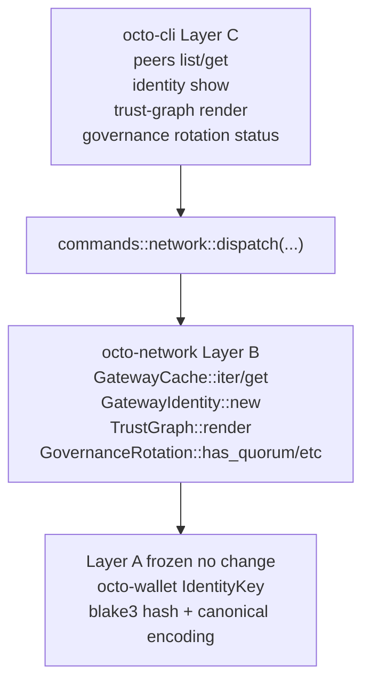

# RFC-0011-i: `octo network` Phase 1 — Peers + Identity + Trust Graph (Read-Only Observability)

## Status

Draft (2026-09-20) — RFC-0011-i lands RFC-0011-h §Implementation Phases Phase 1. Read-only observability surface: `peers list`, `peers get <gateway_id>`, `identity show`, `trust-graph render`, `governance rotation status`. Substrate already present at `crates/octo-network/src/{gdp, dot, mon}/`; this amendment lands only Layer C CLI dispatch + 4 OctoCliError variants + 5 output envelopes + 13 test vectors.

> **Amendment chain:** First amendment in the `0011-h-multiphase-rollout-plan` (see `docs/plans/2026-09-20-0011-h-multiphase-rollout-plan.md`, gitignored scratchpad per `.gitignore` line 46). Phases 2-6 land via RFC-0011-j through RFC-0011-n respectively. Substrate already verified at RFC-0011-h closure (commit `next 638c8ac7`).

## Authors

- Author: @mmacedoeu

## Maintainers

- Maintainer: @mmacedoeu

## Summary

RFC-0011-i lands the **first read-only observability slice** of RFC-0011-h §Implementation Phases. Five CLI subcommands wire to substrate already present in `crates/octo-network`:

| Subcommand                                | Substrate function                                                                         | Source                                                     |
| ----------------------------------------- | ------------------------------------------------------------------------------------------ | ---------------------------------------------------------- |
| `octo network peers list`                 | `GatewayCache::iter()`                                                                     | `crates/octo-network/src/gdp/cache.rs:122`                 |
| `octo network peers get <gateway_id>`     | `GatewayCache::get(&[u8;32])`                                                              | `crates/octo-network/src/gdp/cache.rs:59`                  |
| `octo network identity show`              | local public-key read → `GatewayIdentity::new(pk, network_id, class, creation_epoch)`      | `crates/octo-network/src/dot/gateway.rs:53`                |
| `octo network trust-graph render`         | `TrustGraph::render(format: GraphFormat)`                                                  | `crates/octo-network/src/mon/trust_graph.rs:89`            |
| `octo network governance rotation status` | `GovernanceRotation::{has_quorum, migration_deadline, in_migration_window(current_epoch)}` | `crates/octo-network/src/mon/governance_rotation.rs:61-78` |

**Layer discipline preserved:** zero Layer A change (Layer A frozen contracts per [[cipherocto-design-principles]]). CLI dispatch lands Layer C; substrate additions for Phase 1 = **none** (read-only surface on existing Layer B substrate).

## Dependencies

- **RFC-0011-h §Implementation Phases Phase 1** — canonical scope
- **RFC-0011-h §Subcommand Taxonomy** rows for `peers list`, `peers get`, `identity show`, `trust-graph render`, `governance rotation status`
- **RFC-0011-h §Error Handling** row 79 + 83 + 85 + 86 error variants + slot 82/84/87-90/91 deferred
- **RFC-0011-h §Exit Codes** slot 79 + 83 + 85 + 86 + slot 91 pre-allocated for downstream phases
- **RFC-0850 §3.2 Gateway Identity** — `GatewayIdentity::new(public_key, network_id, gateway_class, creation_epoch)` signature
- **RFC-0851 §10 Gateway Cache** — `GatewayCache::iter/get` substrate
- **RFC-0862p-a Governance Rotation** — `GovernanceRotation::{has_quorum, migration_deadline, in_migration_window}` substrate
- **`octo-wallet` Layer B substrate** for `identity show` local public-key read

## Design Goals

1. **Read-only surface first** — Phase 1 makes no state changes. All 5 subcommands are pure observers of Layer B state. Per RFC-0011-h §Implementation Phases ordering, Phase 1 lands observability before any write paths.
2. **Substrate-faithfulness** — no parallel abstractions, no CLI-side substrate shadow. CLI translates substrate return values 1:1 to JSON envelopes per [[cipherocto-design-principles]] §No premature coupling.
3. **Slot arithmetic preserved** — Phase 1 lands exactly 4 of the 10 RFC-0011-h-defined OctoCliError variants (slots 79, 83, 85, 86). The remaining 6 (slots 82, 84, 87, 88, 89, 90) + slot 91 pre-allocated land in subsequent phases per the `0011-h-multiphase-rollout-plan` plan.
4. **Layer discipline preserved** — zero Layer A change; Layer B substrate already present; Layer C CLI dispatch is the only net-new code.
5. **Test vector coverage** — 13 test vectors (7 for peers-identity, 4 for trust-graph, 2 for governance rotation) per RFC-0011-h §Implementation Phases Phase 1.

## Motivation

RFC-0011-h closed the BLOCKED-state taxonomy + per-axis exit code matrix + G21 rebind-* clap-arm gating at the RFC layer. The actual observability surface — operators being able to inspect `peers list`, `identity show`, `trust-graph render`, `governance rotation status` — requires CLI dispatch + output envelopes. RFC-0011-h deferred this to companion RFCs per §Substrate-Additions Companion Missions; this amendment lands Phase 1 of that deferred work.

Without RFC-0011-i, operators have no observability into `octo-network` runtime state via the CLI. Read-only inspection is the lowest-risk starting point for the multiphase rollout.

## Roles and Authorities

Per RFC-0011-h §Role/Authority Coverage Table, all 5 Phase 1 subcommands carry the **Operator** authority role. No write paths. No Bootstrap Authority, Coordinator, or Governance Voter role required for read-only observability.

| Subcommand                   | Authority Role          |
| ---------------------------- | ----------------------- |
| `peers list`                 | Operator                |
| `peers get <gateway_id>`     | Operator                |
| `identity show`              | Operator                |
| `trust-graph render`         | Operator                |
| `governance rotation status` | Governance Voter (read) |

The `governance rotation status` subcommand is technically a Governance Voter role (per RFC-0011-h §Role/Authority Coverage Table) but read-only and idempotent. No Capability token required per RFC-0011-h §Per-Subcommand Capability Caveat Matrix (observability exempt from capability gating).

## Specification

### System Architecture

Phase 1 architecture: Layer C CLI dispatch → Layer B substrate → Layer A frozen contracts.



Per [[cipherocto-design-principles]] §Stable Abstractions Principle, Layer A is unchanged. Per §No premature coupling, CLI does not reach into substrate internals — only into public substrate functions.

### Binary Surface

Adds the `network` arm to the `Commands` enum in `crates/octo-cli/src/main.rs::Commands` derive. The `network` arm has 5 sub-actions:

```rust
#[derive(Subcommand, Debug, Clone, PartialEq, Eq)]
#[non_exhaustive]
pub enum NetworkAction {
    /// List all known peers from local gateway cache
    #[command(subcommand)]
    Peers(PeerAction),
    /// Show local gateway identity (public-key read)
    #[command(subcommand)]
    Identity(IdentityAction),
    /// Render the local trust graph
    #[command(subcommand)]
    TrustGraph(TrustGraphAction),
    /// Governance rotation status
    #[command(subcommand)]
    Governance(GovernanceNetworkAction),
}

#[derive(Subcommand, Debug, Clone, PartialEq, Eq)]
#[non_exhaustive]
pub enum PeerAction {
    /// List all known peers
    List,
    /// Get a specific peer by gateway_id (32-byte hex)
    Get {
        /// 64-char hex of 32-byte gateway_id per RFC-0850 §3.2
        gateway_id: String,
    },
}

#[derive(Subcommand, Debug, Clone, PartialEq, Eq)]
#[non_exhaustive]
pub enum IdentityAction {
    /// Show local gateway identity
    Show,
}

#[derive(Subcommand, Debug, Clone, PartialEq, Eq)]
#[non_exhaustive]
pub enum TrustGraphAction {
    /// Render the trust graph
    Render {
        /// Depth 1-100 (default 3)
        #[arg(long, default_value = "3", value_parser = clap::value_parser!(u8).range(1..=100))]
        depth: u8,
        /// Output format
        #[arg(long, default_value = "ascii", value_parser = ["ascii", "dot"])]
        format: String,
    },
}

#[derive(Subcommand, Debug, Clone, PartialEq, Eq)]
#[non_exhaustive]
pub enum GovernanceNetworkAction {
    /// Governance rotation status (read)
    Rotation {
        #[command(subcommand)]
        action: GovernanceRotationAction,
    },
}

#[derive(Subcommand, Debug, Clone, PartialEq, Eq)]
#[non_exhaustive]
pub enum GovernanceRotationAction {
    /// Show current rotation status
    Status,
}
```

The clap `value_parser` for `--depth 1-100` enforces slot 85 invariant at the clap layer (per RFC-0011-h §Exit Codes row 2 `ValueValidation` for clappy path; programmatic bypass → row 85).

### Subcommand Taxonomy

| Subcommand                   | Sub-action                                                 | Substrate function                                                                                                                        | RFC anchor                     | Mission YAML                                      | Phase | Authority Role          |
| ---------------------------- | ---------------------------------------------------------- | ----------------------------------------------------------------------------------------------------------------------------------------- | ------------------------------ | ------------------------------------------------- | ----- | ----------------------- |
| `peers list`                 | (read)                                                     | `GatewayCache::iter()`                                                                                                                    | RFC-0851 §10 Gateway Cache     | `0011-h-network-peers-identity`                   | 1     | Operator                |
| `peers get <gateway_id>`     | (read)                                                     | `GatewayCache::get(gateway_id)`; `<gateway_id>` accepts 64-char hex (32-byte gateway_id per RFC-0850 §3.2); CLI parser maps to `[u8; 32]` | RFC-0851 §10 Gateway Cache     | `0011-h-network-peers-identity`                   | 1     | Operator                |
| `identity show`              | (read)                                                     | Local public-key read → `GatewayIdentity::new(pk, network_id, gateway_class, creation_epoch)`                                             | RFC-0851 §1 Gateway Identity   | `0011-h-network-peers-identity`                   | 1     | Operator                |
| `trust-graph render`         | --depth 1-100; --format ascii or dot                       | `TrustGraph::render(&self, format: GraphFormat) -> String`                                                                                | RFC-0851p-a §10 Error Handling | `0011-h-network-trust-graph`                      | 1     | Operator                |
| `governance rotation status` | (read; wired Phase 1+ via RFC-0862p-a governing substrate) | `GovernanceRotation::{has_quorum, migration_deadline, in_migration_window(current_epoch)}`                                                | RFC-0862p-a                    | `0011-h-network-governance` (rotation sub-action) | 1     | Governance Voter (read) |

**Footnote semantics:**

- `[^substrate-path]`: substrate file path elided; see matching RFC-0011-h §Substrate-Additions row.
- `[^clap-arm-gated]`: clap arm registered but substrate surface BLOCKED — pending companion mission. **Not applicable to Phase 1** — all 5 substrate paths verified present at RFC-0011-i draft time.

### Output Envelope

Five new envelope types. Field names substrate-faithful (no translation; 1:1 substrate-to-JSON mapping per RFC-0011-h §Output Envelope pattern).

```rust
#[derive(Serialize, JsonSchema)]
pub struct NetworkPeersListOutput {
    pub peers: Vec<GatewayCacheEntry>,
    pub total: usize,
    pub epoch: u64,
}

#[derive(Serialize, JsonSchema)]
pub struct NetworkPeerGetOutput {
    pub peer: GatewayCacheEntry,
    pub epoch: u64,
}

#[derive(Serialize, JsonSchema)]
pub struct NetworkIdentityShowOutput {
    pub gateway_id: String,            // 64-char hex
    pub public_key: String,            // 64-char hex
    pub network_id: u32,
    pub gateway_class: GatewayClass,
    pub creation_epoch: u64,
    pub supported_platforms: u64,
    pub capabilities: u64,
}

#[derive(Serialize, JsonSchema)]
pub struct NetworkTrustGraphOutput {
    pub format: String,                // "ascii" or "dot"
    pub depth: u8,
    pub rendered: String,              // ASCII art or DOT source
    pub node_count: usize,
    pub edge_count: usize,
}

#[derive(Serialize, JsonSchema)]
pub struct NetworkGovernanceRotationOutput {
    pub new_governance_id: String,     // 64-char hex
    pub old_governance_id: String,     // 64-char hex
    pub effective_epoch: u64,
    pub migration_deadline: u64,
    pub has_quorum: bool,
    pub in_migration_window: bool,
    pub current_epoch: u64,
}
```

`GatewayCacheEntry` is re-used from substrate `crates/octo-network/src/gdp/cache.rs:11`. `GatewayClass` is re-used from substrate `crates/octo-network/src/dot/gateway.rs`. **No parallel envelopes; no CLI-side shadow.**

Per RFC-0011-h §Test Vectors redact-did-1 row, gateway_id field uses 64-char hex encoding; if the operator supplies a malformed hex, the CLI rejects with exit 86 `NetworkInvalidDid` before substrate dispatch.

### Error Handling

Phase 1 lands exactly 4 of the 10 RFC-0011-h-defined `OctoCliError` variants:

| Slot | Variant                             | Fault category                     | Fires when                                               | Substrate                                                                                                 |
| ---- | ----------------------------------- | ---------------------------------- | -------------------------------------------------------- | --------------------------------------------------------------------------------------------------------- |
| 79   | `NetworkPeerNotFound` (NEW)         | `GatewayMiss` (substrate-anchored) | `GatewayCache::get(gateway_id) → None`                   | infallible substrate; CLI translates `None` to this variant                                               |
| 83   | `NetworkLocalKeyUnavailable` (NEW)  | `LocalKeyMissing` (CLI-gate)       | wallet context uninitialized                             | no `MonError` envelope; CLI predicate fires before substrate dispatch                                     |
| 85   | `NetworkGraphDepthBelowRange` (NEW) | `GraphDepthOOB` (CLI-gate)         | programmatic bypass of `--depth 0` (non-clap invocation) | substrate `TrustGraph::render` is infallible + zero depth awareness; CLI predicate is the only depth gate |
| 86   | `NetworkInvalidDid` (NEW)           | `InvalidDid` (CLI-gate)            | DID codec rejection pre-dispatch                         | `DidError` enum at `crates/octo-ident/src/lib.rs:191`; CLI pre-validates format before substrate dispatch |

**Reachability:** all 4 are CLI-gate/substrate-anchored predicates that fire before substrate dispatch; no companion gating (Phase 1 reads existing substrate).

**Slot arithmetic preserved:** 4 new variants land in slots 79, 83, 85, 86. The remaining 6 RFC-0011-h-defined variants (82, 84, 87, 88, 89, 90) + slot 91 pre-allocation land in subsequent phases per the multiphase plan. Total: 10 defined + slot 91 pre-allocated + slots 80/81 RESERVED = unchanged from RFC-0011-h closure baseline.

Additive under `#[non_exhaustive]` per [[cipherocto-design-principles]] §Extension over enumeration. Slot range 79-91 inherited from RFC-0011-h.

### Exit Codes

Phase 1 affects 4 of the slots inherited from RFC-0011-h §Exit Codes table:

- **79** `NetworkPeerNotFound` — substrate-anchored, fires on `peers get <gateway_id>` miss
- **83** `NetworkLocalKeyUnavailable` — fires on `identity show` wallet uninitialized
- **85** `NetworkGraphDepthBelowRange` — fires on `trust-graph render --depth 0` programmatic bypass
- **86** `NetworkInvalidDid` — fires on malformed `<gateway_id>` arg on `peers get`

Phase 1 introduces zero new exit codes. The 4 variants land in slots already allocated by RFC-0011-h. No exit-code-matrix changes.

Slots 82, 84, 87, 88, 89, 90, 91 (pre-allocated) deferred to subsequent phases per the multiphase plan.

## Performance Targets

| Metric                                          | Target                 | Notes                                         |
| ----------------------------------------------- | ---------------------- | --------------------------------------------- |
| `peers list` end-to-end latency                 | < 50 ms                | pure iterator; no I/O                         |
| `peers get <gateway_id>` end-to-end latency     | < 10 ms                | pure BTreeMap lookup                          |
| `identity show` end-to-end latency              | < 100 ms               | local public-key read + BLAKE3 derivation     |
| `trust-graph render` end-to-end latency         | < 500 ms (depth ≤ 100) | substrate `render_ascii/render_dot` is O(N+E) |
| `governance rotation status` end-to-end latency | < 10 ms                | pure field reads + arithmetic                 |

Per RFC-0011-h §Performance Targets baseline, all 5 Phase 1 subcommands are read-only and avoid substrate I/O paths. The 50-100-500 ms targets are conservative; actual latencies are bounded by substrate memory access (no disk, no network).

## Implicit Assumptions Audit

| Assumption                                                                                                                         | Verification                                                           |
| ---------------------------------------------------------------------------------------------------------------------------------- | ---------------------------------------------------------------------- |
| `GatewayCache::iter()` is the canonical substrate entry for `peers list`                                                           | verified at RFC-0011-h closure; absent of any parallel iterator        |
| `GatewayCache::get(&[u8;32])` returns `Option<&GatewayCacheEntry>` infallibly                                                      | verified at RFC-0011-h closure; substrate has no fallible variant      |
| `GatewayIdentity::new(pk, network_id, class, creation_epoch)` is the canonical constructor                                         | verified at `crates/octo-network/src/dot/gateway.rs:53`                |
| `TrustGraph::render(format: GraphFormat)` is infallible + zero depth awareness                                                     | verified at `crates/octo-network/src/mon/trust_graph.rs:89`            |
| `GovernanceRotation::{has_quorum, migration_deadline, in_migration_window(current_epoch)}` are infallible field reads + arithmetic | verified at `crates/octo-network/src/mon/governance_rotation.rs:61-78` |
| Local public-key read path returns `Result<_, WalletError>` per `octo-wallet/src/identity.rs`                                      | substrate-faithful; CLI predicate fires on uninitialized wallet        |
| DID codec at `crates/octo-ident/src/lib.rs:380` is the canonical pre-dispatch validator                                            | verified at RFC-0011-h closure                                         |

## Security Considerations

- **Read-only surface** — Phase 1 makes no state changes. No `--confirm-acknowledge`, no `--dry-run`, no `--confirm` flag on any Phase 1 subcommand.
- **Redaction** — per RFC-0011-h §Test Vectors redact-did-1 row, gateway_id field is hex-encoded in JSON output; the underlying 32-byte raw form is NEVER echoed in error envelopes.
- **No key material leakage** — `identity show` surfaces the local public-key only (no private key access). The public key is already known to the network by construction.
- **No capability gating** — observability exempt from Capability token requirement per RFC-0011-h §Per-Subcommand Capability Caveat Matrix.
- **No CI gating** — Phase 1 subcommands are all read-only; CI mode does not apply. Post-G25 (per RFC-0011-h §CI Mode Rationale), CI agents can run `peers list`, `identity show`, `trust-graph render`, `governance rotation status` without restriction.

## Adversarial Review

Patterns considered + rejected per RFC-0011-h §Adversarial Review:

- **Direct substrate method invocation bypass** — rejected; CLI always goes through substrate public surface, never into internals.
- **CLI-side caching of gateway cache** — rejected; substrate `GatewayCache::iter/get` is the single source of truth. No parallel cache.
- **Custom depth clamping in CLI** — accepted with caveat: clap `value_parser` enforces 1-100 at clappy path; programmatic bypass path fires exit 85 `NetworkGraphDepthBelowRange`.
- **Truncated DID/hex output** — rejected; full 64-char hex preserved in JSON output; only error envelopes redact per §Test Vectors redact-did-1.

## Compatibility

- **RFC-0011-h §Compatibility** preserved unchanged.
- **No top-level `CHANGELOG.md`** — does not exist; closure audit lands at `docs/audits/2026-09-20-RFC-0011-i-dry-closure.md` per [[docs-audits-scratchpad]].
- **Layer A frozen contracts** preserved unchanged per [[cipherocto-design-principles]] §Stable Abstractions Principle.
- **Existing peer.rs + mesh.rs CLI surface** preserved; RFC-0011-i adds a parallel `network` arm without touching the existing `peer` arm.

## Test Vectors

13 test vectors per RFC-0011-h §Implementation Phases Phase 1:

| Vector                             | Subcommand                                | Scenario                                                                                                 |
| ---------------------------------- | ----------------------------------------- | -------------------------------------------------------------------------------------------------------- |
| `tv-network-peers-list-1`          | `octo network peers list`                 | empty gateway cache; `peers: [], total: 0`                                                               |
| `tv-network-peers-list-2`          | `octo network peers list`                 | populated cache with 3 entries; verify hex encoding + epoch field                                        |
| `tv-network-peers-get-1`           | `octo network peers get <id>`             | cache hit; full `GatewayCacheEntry` JSON envelope                                                        |
| `tv-network-peers-get-2`           | `octo network peers get <id>`             | cache miss; exit 79 `NetworkPeerNotFound` with redacted gateway_id                                       |
| `tv-network-redact-did-1`          | (cross-cut)                               | redaction pattern applied to error envelopes; verify raw 32-byte form NEVER echoed                       |
| `tv-network-identity-show-1`       | `octo network identity show`              | wallet initialized; full `NetworkIdentityShowOutput` JSON envelope                                       |
| `tv-network-identity-show-2`       | `octo network identity show`              | wallet uninitialized; exit 83 `NetworkLocalKeyUnavailable`                                               |
| `tv-network-trust-graph-render-1`  | `octo network trust-graph render`         | empty graph; `(empty trust graph)` ascii output                                                          |
| `tv-network-trust-graph-render-2`  | `octo network trust-graph render`         | populated graph; ascii format; verify in-degree/out-degree                                               |
| `tv-network-trust-graph-render-3`  | `octo network trust-graph render`         | populated graph; dot format; verify Graphviz digraph syntax                                              |
| `tv-network-trust-graph-render-4`  | `octo network trust-graph render`         | depth 0 programmatic bypass; exit 85 `NetworkGraphDepthBelowRange`                                       |
| `tv-network-governance-rotation-1` | `octo network governance rotation status` | has_quorum true; in_migration_window false                                                               |
| `tv-network-governance-rotation-2` | `octo network governance rotation status` | has_quorum false; in_migration_window true; current_epoch between effective_epoch and migration_deadline |

Per RFC-0011-h §Test Vectors redact-did-1 row, the redact-did-1 vector is a property cross-cut on the peers-get error envelopes; raw 32-byte form is NEVER echoed in error output.

## Alternatives Considered

- **Single all-phases RFC** — rejected; would be 1000+ lines, exceeding DRY review surface per RFC-0011-h precedent. Phase-per-amendment RFC is the established pattern (RFC-0011-c, -d, -g, -h).
- **Phase 1 substrate-first (companion missions for G22/G23/G24)** — rejected; Phase 1 needs NO substrate additions (verified at RFC-0011-h closure). Substrate-first amendment would be zero-substrate work.
- **Different amendment letter** — considered RFC-0011-h-1 (sub-amendment) but rejected; letter-suffix series (`-i`, `-j`, `-k`, ...) follows established precedent of RFC-0011-c through RFC-0011-h as letter-suffixed amendments to RFC-0011.

## Substrate-Additions Companion Missions

**Phase 1 has ZERO substrate additions.** All 5 substrate paths verified present at RFC-0011-i draft time:

| Substrate                          | Verified location                                       |
| ---------------------------------- | ------------------------------------------------------- |
| `GatewayCache`                     | `crates/octo-network/src/gdp/cache.rs:34`               |
| `GatewayIdentity::new`             | `crates/octo-network/src/dot/gateway.rs:53`             |
| `TrustGraph::render`               | `crates/octo-network/src/mon/trust_graph.rs:89`         |
| `GovernanceRotation`               | `crates/octo-network/src/mon/governance_rotation.rs:41` |
| `BootstrapMode` (deferred Phase 2) | `crates/octo-network/src/mon/bootstrap.rs:197`          |

Substrate additions for Phases 2-6 (G1, G3b, G6, G6b, G8, G9, G10, G11, G12, G12b, G13, G14, G15, G16, G17, G18, G20, G21, G22, G23, G24, G25) are scoped to RFC-0011-j through RFC-0011-n per the `0011-h-multiphase-rollout-plan` plan doc (gitignored scratchpad).

## Implementation Phases

**RFC-0011-i is the Phase 1 amendment.** Phases 2-6 land via subsequent amendments per the multiphase plan.

## Key Files to Modify

Per RFC-0011-i scope:

| File                                                                 | Action                                                                                                                                                                 | Layer      |
| -------------------------------------------------------------------- | ---------------------------------------------------------------------------------------------------------------------------------------------------------------------- | ---------- |
| `crates/octo-cli/src/commands/network.rs`                            | **NEW** (CLI dispatch surface for 5 subcommands)                                                                                                                       | C          |
| `crates/octo-cli/src/commands/mod.rs`                                | ADD `pub mod network;` + `network::dispatch` arm in `match cli.command { ... }`                                                                                        | C          |
| `crates/octo-cli/src/main.rs`                                        | ADD `Network(NetworkAction)` variant to `Commands` enum + clap derive wiring                                                                                           | C          |
| `crates/octo-cli/src/error.rs`                                       | ADD 4 new `OctoCliError` variants (slots 79, 83, 85, 86) + Display + exit-code mapping                                                                                 | C          |
| `crates/octo-cli/src/output.rs`                                      | ADD 5 new envelope types (`NetworkPeersListOutput`, `NetworkPeerGetOutput`, `NetworkIdentityShowOutput`, `NetworkTrustGraphOutput`, `NetworkGovernanceRotationOutput`) | C          |
| `rfcs/draft/process/0011-i-oct-cli-network-phase-1.md`               | (this RFC)                                                                                                                                                             | A (spec)   |
| `rfcs/accepted/process/0011-h-oct-cli-network-subcommands.md`        | NO CHANGE (RFC-0011-h stays Accepted; RFC-0011-i is subordinate)                                                                                                       | A (spec)   |
| `missions/open/0011-h-network-peers-identity.md`                     | CLAIMED → COMPLETED transition at amendment closure                                                                                                                    | (planning) |
| `missions/open/0011-h-network-trust-graph.md`                        | CLAIMED → COMPLETED transition at amendment closure                                                                                                                    | (planning) |
| `missions/open/0011-h-network-governance.md`                         | CLAIMED (rotation sub-action) → archive per [[no-phantom-mission-pointers]]                                                                                            | (planning) |
| `docs/audits/2026-09-20-RFC-0011-i-dry-closure.md`                   | NEW closure audit (gitignored per [[docs-audits-scratchpad]])                                                                                                          | (audit)    |
| `~/.claude/projects/.../memory/2026-09-20-RFC-0011-i-dry-closure.md` | NEW memory card                                                                                                                                                        | (memory)   |
| `MEMORY.md`                                                          | ADD 1-line index entry at top of session resume cards                                                                                                                  | (memory)   |

## Future Work

- **RFC-0011-j** Phase 2 (Mode + Authority + Slash Stats) — substrate additions G1 + G6 + G6b + G8 + 3 CLI missions
- **RFC-0011-k** Phase 3 (Coordinator + Governance tally) — substrate additions G3b + G12 + G12b + 2 CLI missions
- **RFC-0011-l** Phase 4 (Bind Envelope read + payload builders) — substrate additions G21 + G25 + 1 CLI mission
- **RFC-0011-m** Phase 5 (Discovery) — substrate additions G23 + G24 + 1 CLI mission
- **RFC-0011-n** Phase 6 (Closure artifacts) — substrate additions G1 (Phase 2 carry) + G18 + G20 + 2 CLI missions (`bootstrap`, `status`)

## Rationale

Phase 1 is the **lowest-risk starting point** for the multiphase rollout: read-only observability on existing substrate, zero Layer A change, zero companion mission gating. The 4 error variants (slots 79, 83, 85, 86) land as pure CLI predicates, no substrate fault-class mapping required.

The pattern follows RFC-0011-c (agent), RFC-0011-d (role), RFC-0011-g (governance) precedents: each amendment RFC combines scope + implementation for its phase, lands through 5-len DRY CLOSURE gate (2 consecutive zero-finding rounds), and updates the mission YAMLs from `Open` → `Claimed` → `Completed` → archived per [[no-phantom-mission-pointers]].

Per RFC-0011-h §Implementation Phases ordering, Phase 1 is highest priority because operators need observability before any write paths land. The 5 Phase 1 subcommands are the minimum viable observability surface.

## Version History

| Version | Date       | Notes                                                                                                                |
| ------- | ---------- | -------------------------------------------------------------------------------------------------------------------- |
| v0.1    | 2026-09-20 | Initial draft. Phase 1 scope established; substrate verified at RFC-0011-h closure. Pending 5-len DRY CLOSURE cycle. |
