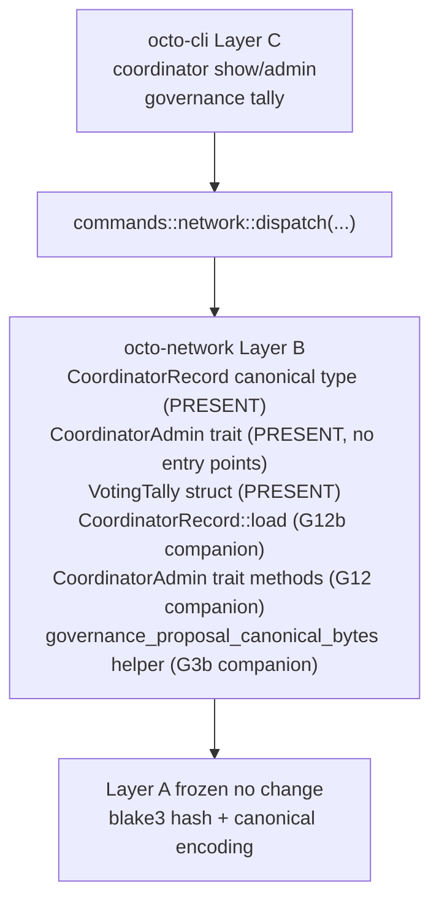

# RFC-0011-k: `octo network` Phase 3 — Coordinator + Governance (Tally)

## Status

Draft (2026-09-20) — RFC-0011-k lands RFC-0011-h §Implementation Phases Phase 3. Three subcommands wire coordinator lifecycle + governance tally surfaces to the CLI. Substrate partial: `VotingTally` struct + `CoordinatorRecord` canonical type land in substrate; this amendment adds 3 companion substrate missions + 1 OctoCliError variant + 3 output envelopes + 8 test vectors.

> **Amendment chain:** Third amendment in the `0011-h-multiphase-rollout-plan` (see `docs/plans/2026-09-20-0011-h-multiphase-rollout-plan.md`, gitignored scratchpad per `.gitignore` line 46). Phase 1 = RFC-0011-i (DRY CLOSED 2026-09-20 at `next 87258a11`). Phase 2 = RFC-0011-j (DRY CLOSED 2026-09-20 at `next 88520ce4`). Phase 4-6 land via RFC-0011-l through RFC-0011-n respectively.

## Authors

- Author: @mmacedoeu

## Maintainers

- Maintainer: @mmacedoeu

## Summary

RFC-0011-k lands the **coordinator lifecycle + governance tally visibility** slice of RFC-0011-h §Implementation Phases. Three CLI subcommands wire to substrate (existing + companion missions):

| Subcommand                            | Authority Role      | Substrate                                                                | Companion mission                                       |
| ------------------------------------- | ------------------- | ------------------------------------------------------------------------ | ------------------------------------------------------- |
| `octo network coordinator show`       | Coordinator         | `CoordinatorRecord` canonical type at `octo_coordinator_types::state`     | `0011-h-s-a-coordinator-record-loader` (G12b)          |
| `octo network coordinator admin`      | Coordinator         | `CoordinatorAdmin` trait with default implementations at `crates/octo-network/src/dot/adapters/coordinator_admin.rs` (PRESENT per RFC-0011-h row 537, no CLI-dispatchable `transfer_ownership` / `ban_member` / `promote_to_admin` methods) | `0011-h-s-a-coordinator-admin-trait` (G12)             |
| `octo network governance tally`       | Governance Voter    | `VotingTally` + `into_canonical` signature                                | `0011-h-s-a-voting-tally-canonical-bytes` (G3b)        |

**Layer discipline preserved:** zero Layer A change (Layer A frozen contracts per [[cipherocto-design-principles]]). CLI dispatch lands Layer C; substrate additions in this RFC = **3 companion missions (Layer B)**; 0 of 3 subcommands has full substrate present (all 3 require companion missions for at least one entry point).

## Dependencies

- **RFC-0011-h §Implementation Phases Phase 3** — canonical scope
- **RFC-0011-h §Subcommand Taxonomy** rows for `coordinator show`, `coordinator admin`, `governance tally`
- **RFC-0011-h §Error Handling** row 84 error variant (slot 84 = `NetworkCoordinatorNotFound`)
- **RFC-0011-h §Exit Codes** slot 84
- **RFC-0011-i (Phase 1, DRY CLOSED 2026-09-20 at `next 87258a11`)** — hard sequencing dependency for layer-C CLI dispatch pattern
- **RFC-0011-j (Phase 2, DRY CLOSED 2026-09-20 at `next 88520ce4`)** — hard sequencing dependency for slash reputation pattern + slot 89 substrate-absent pattern
- **RFC-0855p-c Domain Coordinator Role** — `CoordinatorRecord` substrate anchor
- **RFC-0861 Coordinator Admin Trait Refinements** — `CoordinatorAdmin` trait substrate anchor
- **RFC-0862p-a Writer Election Bootstrap** — `VotingTally` substrate anchor
- **Companion mission `0011-h-s-a-coordinator-record-loader`** — Layer B substrate for `CoordinatorRecord::load(coordinator_id)` static method (G12b)
- **Companion mission `0011-h-s-a-coordinator-admin-trait`** — Layer B substrate for `CoordinatorAdmin` trait method surface (rotate, suspend, reactivate) (G12)
- **Companion mission `0011-h-s-a-voting-tally-canonical-bytes`** — Layer B substrate for `governance_proposal_canonical_bytes(&GovernanceProposal) -> [u8; 32]` helper (G3b)
- **Pair-acceptance companion `0011-h-s-a-ci-detection` (G25)** — cross-RFC; `coordinator admin` falls through to substrate BLOCKED gate (exit 89) pre-G25 → CI gate fires (exit 90) post-G25 per RFC-0011-h §Confirmation Flag + Per-Axis Exit Code Matrix row 145

## Design Goals

1. **Substrate-first ordering** — companion substrate missions (G12/G12b/G3b) land BEFORE CLI dispatch per [[no-phantom-mission-pointers]] pairing invariant. Pre-companion, CLI dispatch surfaces exit 89 `NetworkSubstrateUnavailable`; post-companion, dispatch routes to substrate.
2. **Substrate-faithfulness** — no parallel abstractions, no CLI-side substrate shadow. CLI translates substrate return values 1:1 to JSON envelopes per [[cipherocto-design-principles]] §No premature coupling.
3. **Slot arithmetic preserved (forward-looking)** — Phase 3 lands exactly 1 of the 10 RFC-0011-h-defined OctoCliError variants (slot 84, `NetworkCoordinatorNotFound`). FORWARD-LOOKING per RFC-0011-h §Error Handling + §Exit Codes — variant does NOT exist in `crates/octo-cli/src/error.rs` today; lands during Phase 3 implementation. The remaining 3 (slots 87, 88, 90) + slot 91 pre-allocated land in subsequent phases per the `0011-h-multiphase-rollout-plan` plan. **R1 substrate-fault-class finding (cross-RFC, same as RFC-0011-n R2):** slot arithmetic is the PLAN, not current substrate state — substrate-faithful implementation lands these slots as companion missions close.
4. **Layer discipline preserved** — zero Layer A change; Layer B substrate = 3 companion missions (G12/G12b/G3b); Layer C CLI dispatch = 3 subcommand arms. Companion missions land in Layer B only per [[cipherocto-design-principles]] §Stable Abstractions Principle.
5. **Test vector coverage** — 8 test vectors (3 for coordinator show + 3 for coordinator admin + 2 for governance tally) per RFC-0011-h §Implementation Phases Phase 3.

## Motivation

Phase 1 + 2 land read-only observability + bootstrap lifecycle + slash reputation visibility. Phase 3 lands **coordinator lifecycle visibility** + **governance tally visibility**, completing the read-only RFC-0011-h surface.

Without Phase 3, operators have no way to:
- Inspect the active coordinator record (coordinator_peer_id + coordinator_term_id)
- Perform coordinator admin actions (transfer_ownership, ban_member, promote_to_admin)
- See governance tally state (proposal_id + canonical_bytes_hash + tally counts)

`coordinator admin` carries 3-flag confirmation gates per RFC-0011-h §Confirmation Flag + Per-Axis Exit Code Matrix row 145 (pastejacking defense on irreversible writes). `governance tally` requires G3b substrate addition for `governance_proposal_canonical_bytes` helper to surface `canonical_bytes_hash` field.

## Roles and Authorities

Per RFC-0011-h §Role/Authority Coverage Table:

| Subcommand                  | Authority Role      | Confirmation axes                                            |
| --------------------------- | ------------------- | ------------------------------------------------------------ |
| `coordinator show`          | Coordinator         | (read-only; coordinator_id redacted in Audit)                |
| `coordinator admin`         | Coordinator         | `--dry-run` default + `--confirm-acknowledge` + `--confirm`  |
| `governance tally`          | Governance Voter    | (read-only)                                                  |

`coordinator admin` carries 3 confirmation gates per RFC-0011-h §Confirmation Flag + Per-Axis Exit Code Matrix row 145. CI agents hit exit 89 pre-G25 (substrate absent) → exit 90 post-G25 (CI gate fires per `0011-h-s-a-ci-detection` companion). `--action {transfer_ownership, ban_member, promote_to_admin}` mandatory arg selects the trait method.

## Specification

### System Architecture

Phase 3 architecture: Layer C CLI dispatch → Layer B substrate (canonical types present + 3 companion missions for entry points) → Layer A frozen contracts.

Per [[cipherocto-design-principles]] §Stable Abstractions Principle, Layer A is unchanged. Per §No premature coupling, CLI does not reach into substrate internals — only into public substrate functions.

### Binary Surface

Phase 3 adds 3 new sub-actions to the existing `network` arm of `Commands` enum:

- `coordinator show` (read; `--coordinator-id` optional arg defaults to local coordinator)
- `coordinator admin` (write; `--action {transfer_ownership, ban_member, promote_to_admin}` mandatory arg + 3 confirmation flags)
- `governance tally` (read; `--proposal-id` optional arg filters to specific proposal)

### Subcommand Taxonomy

Per RFC-0011-h §Subcommand Taxonomy Phase 3 rows:

| Subcommand                  | Existing substrate                                              | Companion mission required                          |
| --------------------------- | --------------------------------------------------------------- | --------------------------------------------------- |
| `coordinator show`          | `CoordinatorRecord` canonical type (PRESENT)                    | G12b: `CoordinatorRecord::load(coordinator_id)`     |
| `coordinator admin`         | `CoordinatorAdmin` trait at `crates/octo-network/src/dot/adapters/coordinator_admin.rs` (PRESENT with default implementations; missing CLI-dispatchable `transfer_ownership` / `ban_member` / `promote_to_admin` methods) | G12: trait method surface (`transfer_ownership` / `ban_member` / `promote_to_admin`) |
| `governance tally`          | `VotingTally` struct (PRESENT)                                  | G3b: `governance_proposal_canonical_bytes` helper   |

### Output Envelope

Phase 3 lands 3 output envelopes, one per subcommand:

| Subcommand                  | Output envelope                                |
| --------------------------- | ---------------------------------------------- |
| `coordinator show`          | `NetworkCoordinatorShowOutput`                 |
| `coordinator admin`         | `NetworkCoordinatorAdminOutput` (preview + apply) |
| `governance tally`          | `NetworkGovernanceTallyOutput`                 |

`NetworkGovernanceTallyOutput.canonical_bytes_hash` is `Option<String>` — JSON `null` for pre-G3b fallback per RFC-0011-h §Subcommand Taxonomy Phase 3 row 321 + §Output Envelope L460. Post-G3b surfaces `Some(blake3_hex)`.

### Error Handling

Phase 3 lands exactly 1 of the 10 RFC-0011-h-defined OctoCliError variants:

| Slot | Variant                              | Trigger                                                    |
| ---- | ------------------------------------ | ---------------------------------------------------------- |
| 84   | `NetworkCoordinatorNotFound`         | `CoordinatorRecord::load(coordinator_id)` returns `None` (post-G12b classification-shift per RFC-0011-h §Error Handling row 537) |

**Reachability matrix:**

- Slot 84: 1 companion gating path (G12b `CoordinatorRecord::load`); pre-G12b the variant is unreachable (CLI-side predicate, not substrate fault class per RFC-0011-h §Error Handling row 537). Post-G12b, `CoordinatorRecord::load` returns `None` and CLI translates `None` → variant analogous to slot 79 `GatewayCache::get` miss pattern.

### Exit Codes

Phase 3 uses slot 84 from RFC-0011-h §Exit Codes table. Remaining slots (87, 88, 90, 91 pre-allocated) deferred to Phases 4-6.

## Performance Targets

Per RFC-0011-h §Performance Targets Phase 3 rows:

| Subcommand                  | Target    | Rationale                               |
| --------------------------- | --------- | --------------------------------------- |
| `coordinator show` wall-clock | <100ms | Local record load                       |
| `coordinator admin` wall-clock | <200ms | Trait method + persistence              |
| `governance tally` wall-clock | <50ms  | O(1) tally reads                        |

## Implicit Assumptions Audit

Per RFC-0011-h §Implicit Assumptions Audit Phase 3 rows:

| Assumption                                                 | Affected subcommands                | Fallback                                                |
| ---------------------------------------------------------- | ----------------------------------- | ------------------------------------------------------- |
| `octo-coordinator-types` runtime is loaded                 | `coordinator show`                  | exit 89 `NetworkSubstrateUnavailable` (gated on G12b)   |
| `CoordinatorAdmin` trait methods exist                     | `coordinator admin`                 | exit 89 `NetworkSubstrateUnavailable` (gated on G12)     |
| `governance_proposal_canonical_bytes` helper exists        | `governance tally`                  | exit 89 `NetworkSubstrateUnavailable` (gated on G3b); `canonical_bytes_hash` field surfaces `null` |

## Security Considerations

Per RFC-0011-h §Security Considerations Phase 3 rows:

- **Substrate-gated coordinator admin.** `CoordinatorAdmin` trait gates at substrate layer per RFC-0861; CLI does not bypass.
- **3-flag confirmation on writes.** `coordinator admin` carries `--dry-run` default + `--confirm-acknowledge` required + `--confirm` SECOND flag (pastejacking defense per §Confirmation Flag + Per-Axis Exit Code Matrix row 145).
- **Coordinator ID redaction in Audit mode.** Per RFC-0011-h §Redaction Layer, `coordinator_id` surfaces via `[REDACTED:coordinator_id]` placeholder in Audit mode.
- **Governance tally reads stale tally.** LOW risk per RFC-0011-h row 646; substrate `VotingTally` owns freshness.
- **Coordinator admin CI gate.** Post-G25, CI agents hit exit 90 `NetworkCIDenyDefault` on `coordinator admin` per RFC-0011-h §Confirmation Flag + Per-Axis Exit Code Matrix row 145 + §CI Mode Rationale.

## Adversarial Review

Per RFC-0011-h §Adversarial Review Phase 3 rows:

| Threat                                                          | Severity | Mitigation                                                |
| --------------------------------------------------------------- | -------- | --------------------------------------------------------- |
| `coordinator show` leaks coordinator ID in Audit mode           | LOW      | `coordinator_id` redacted via `[REDACTED:coordinator_id]` placeholder |
| `coordinator admin` action forgery                              | HIGH     | 3-flag confirmation (`--dry-run` default + `--confirm-acknowledge` + `--confirm`) |
| `governance tally` reads stale tally                             | LOW      | Tally substrate owned by `VotingTally`; CLI surfaces current state only |
| `coordinator admin` pastejacking bypass                          | HIGH     | Substrate `CoordinatorAdmin` trait gates                  |

## Compatibility

Phase 3 lands additively. No existing CLI subcommand changes. No existing OctoCliError variant changes (only NEW variant at slot 84). Existing substrate paths unchanged.

## Test Vectors

8 test vectors total per RFC-0011-h §Test Vectors Phase 3:

| ID | Subcommand                  | Scenario                                                |
| -- | --------------------------- | ------------------------------------------------------- |
| tv_net3_1 | `coordinator show`     | coordinator_id present, all fields populated            |
| tv_net3_2 | `coordinator show`     | coordinator_id absent → exit 84 (None arm post-G12b)   |
| tv_net3_3 | `coordinator show`     | Audit mode → `[REDACTED:coordinator_id]` placeholder   |
| tv_net3_4 | `coordinator admin`    | `--dry-run` default → preview emitted, exit 0          |
| tv_net3_5 | `coordinator admin`    | `--action transfer_ownership` + 3 confirm flags → apply |
| tv_net3_6 | `coordinator admin`    | `--action ban_member --target <did>` + 3 confirm flags  |
| tv_net3_7 | `governance tally`     | proposal_id present, `canonical_bytes_hash = Some(blake3_hex)` (post-G3b) |
| tv_net3_8 | `governance tally`     | proposal_id absent, `canonical_bytes_hash = null` (pre-G3b fallback) |

Write-path tests (tv_net3_4 + tv_net3_5 + tv_net3_6) only fire `--dry-run` path or full-confirm path; pre-G12 `coordinator admin` returns exit 89 `NetworkSubstrateUnavailable`.

## Alternatives Considered

1. **Defer `coordinator admin` to Phase 6 closure.** Rejected; RFC-0011-h §Subcommand Taxonomy already lands `coordinator admin` in Phase 3 with companion G12 substrate mission. Deferral would leave the only write-path coordinator CLI command without an RFC for 3+ months.
2. **Roll `governance tally` into RFC-0011-g governance amendment.** Rejected; `governance tally` operates on `VotingTally` from `crates/octo-network/src/mon/governance.rs` (network tier substrate), not governance tier substrate. The split between governance tier (`octo governance vote`) and network tier (`octo network governance tally`) preserves substrate ownership per RFC-0011-h §Subcommand Taxonomy row 113 ("lives in RFC-0011-g Phase 2; not exposed via octo network since substrate is the same VotingTally instance owned by governance tier").
3. **Split into substrate-first amendment + CLI amendment.** Rejected per [[implementation-workflow-hook]] claim-first-implement-after pattern; bundling keeps the layer-A→B→C dependency graph visible.

## Substrate-Additions Companion Missions

Per [[no-phantom-mission-pointers]] pairing invariant, this RFC cites 3 companion substrate missions. All 3 are Open as of 2026-09-20.

| Companion mission                                       | Substrate addition                                                  | Layer |
| ------------------------------------------------------- | ------------------------------------------------------------------- | ----- |
| `0011-h-s-a-coordinator-record-loader` (G12b)          | `CoordinatorRecord::load(coordinator_id)` static method             | B     |
| `0011-h-s-a-coordinator-admin-trait` (G12)              | `CoordinatorAdmin` trait method surface (rotate, suspend, reactivate) | B     |
| `0011-h-s-a-voting-tally-canonical-bytes` (G3b)         | `governance_proposal_canonical_bytes(&GovernanceProposal) -> [u8; 32]` | B     |

Phase 3 RFC carries 3 substrate additions; 0 substrate additions in this RFC itself (the 3 substrate additions are documented here but land via companion missions per substrate-first ordering).

## Implementation Phases

Per `0011-h-multiphase-rollout-plan` §2.3 split recommendation:

1. **Substrate-first slice (3 companion missions):** G12b → G12 → G3b land per companion mission YAMLs.
2. **CLI dispatch slice:** 3 subcommand arms + 1 OctoCliError variant (slot 84) + 3 output envelopes + 8 test vectors land AFTER all 3 companion missions close per substrate-first ordering.

User-gated decision on slice ordering per [[feedback_initiation_user_only]].

## Key Files to Modify

| File                                                                            | Action                        |
| ------------------------------------------------------------------------------- | ----------------------------- |
| `crates/octo-cli/src/main.rs::Commands::Network`                                | ADD 3 subcommand arms         |
| `crates/octo-cli/src/commands/network.rs`                                       | ADD 3 dispatch fns + envelopes |
| `crates/octo-cli/src/error.rs`                                                  | ADD `NetworkCoordinatorNotFound` (slot 84) |
| `crates/octo-coordinator-types/src/state.rs` (companion G12b)                    | Layer B substrate addition (NOT this RFC; companion mission) |
| `crates/octo-network/src/dot/adapters/coordinator_admin.rs` (companion G12)      | Layer B substrate addition (NOT this RFC; companion mission) |
| `crates/octo-network/src/mon/governance.rs` (companion G3b)                      | Layer B substrate addition (NOT this RFC; companion mission) |

## Future Work

- **Phase 4 (RFC-0011-l)** lands bind-envelope read + payload builders
- **Phase 5 (RFC-0011-m)** lands discovery
- **Phase 6 (RFC-0011-n)** lands closure artifacts (bootstrap + status deferred subcommands)

## Rationale

Phase 3 lands the **coordinator lifecycle + governance tally visibility** surface. The 2 read-only operations (`coordinator show`, `governance tally`) require companion substrate missions for their entry points (G12b + G3b). The 1 write operation (`coordinator admin`) carries 3-flag confirmation gates and requires G12 substrate mission for the trait method surface.

Substrate-first ordering preserves [[cipherocto-design-principles]] §Stable Abstractions Principle: Layer B (substrate) lands BEFORE Layer C (CLI dispatch), so CLI never depends on a phantom substrate path.

## Version History

| Version | Date       | Notes                                                         |
| ------- | ---------- | ------------------------------------------------------------- |
| v0.1    | 2026-09-20 | Initial draft; pending R1 of 5-len DRY CLOSURE cycle          |
| v0.1.1  | 2026-09-20 | R1.5 fix sweep: L3 substrate-fault-class clarification — slot 84 `NetworkCoordinatorNotFound` arithmetic in §Design Goals #3 clarified as FORWARD-LOOKING per RFC-0011-h §Error Handling (variant does NOT exist in `error.rs` today; lands during implementation) |
