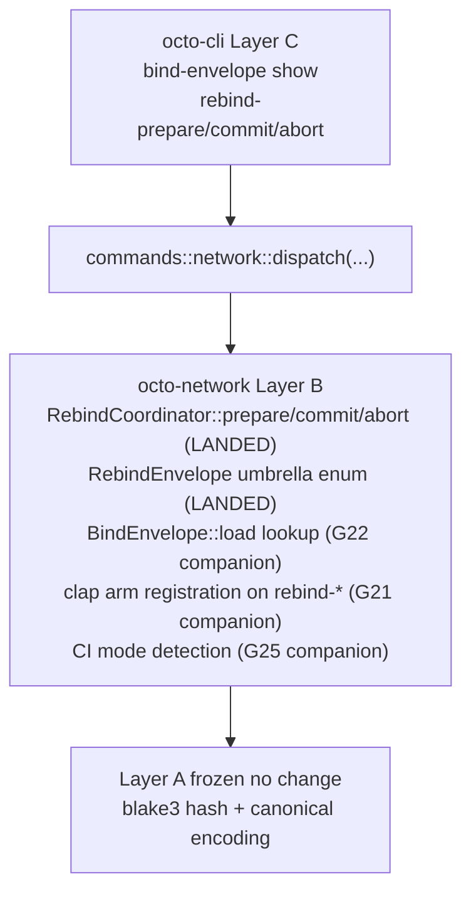

# RFC-0011-l: `octo network` Phase 4 — Bind Envelope (Read + Payload Builders)

## Status

Draft (2026-09-20) — RFC-0011-l lands RFC-0011-h §Implementation Phases Phase 4. Four subcommands wire bind envelope read + payload builder surfaces to the CLI. Substrate partial: `RebindCoordinator::{prepare_envelope, commit_envelope, abort_envelope}` payload builders + `RebindEnvelope` umbrella enum + `RebindPrepare` + `RebindCommit` + `RebindAbort` structs land in substrate; this amendment adds 3 companion substrate missions + 1 OctoCliError variant + 4 output envelopes + 12 test vectors.

> **Amendment chain:** Fourth amendment in the `0011-h-multiphase-rollout-plan` (see `docs/plans/2026-09-20-0011-h-multiphase-rollout-plan.md`, gitignored scratchpad per `.gitignore` line 46). Phase 1 = RFC-0011-i (DRY CLOSED 2026-09-20 at `next 87258a11`). Phase 2 = RFC-0011-j (DRY CLOSED 2026-09-20 at `next 88520ce4`). Phase 3 = RFC-0011-k (DRY CLOSED 2026-09-20 at `next 01a5e4dd`). Phase 5-6 land via RFC-0011-m + RFC-0011-n respectively.

## Authors

- Author: @mmacedoeu

## Maintainers

- Maintainer: @mmacedoeu

## Summary

RFC-0011-l lands the **bind envelope read + payload builder** slice of RFC-0011-h §Implementation Phases. Four CLI subcommands wire to substrate (existing + companion missions):

| Subcommand                                  | Authority Role | Substrate                                                       | Companion mission                                       |
| ------------------------------------------- | -------------- | --------------------------------------------------------------- | ------------------------------------------------------- |
| `octo network bind-envelope show`           | Operator       | `BindEnvelope::load(domain_id)` lookup method (MISSING)         | `0011-h-s-a-bind-envelope-lookup` (G22)                |
| `octo network bind-envelope rebind-prepare` | Operator       | `RebindCoordinator::prepare_envelope(signature)` (LANDED)       | `0011-h-s-a-attached-handle-key-rotation` (G21)         |
| `octo network bind-envelope rebind-commit`  | Operator       | `RebindCoordinator::commit_envelope(signature)` (LANDED)        | `0011-h-s-a-attached-handle-key-rotation` (G21)         |
| `octo network bind-envelope rebind-abort`   | Operator       | `RebindCoordinator::abort_envelope(signature)` (LANDED)         | `0011-h-s-a-attached-handle-key-rotation` (G21)         |

**Layer discipline preserved:** zero Layer A change (Layer A frozen contracts per [[cipherocto-design-principles]]). CLI dispatch lands Layer C; substrate additions in this RFC = **3 companion missions (Layer B)**; 3 of 4 subcommands have substrate LANDED but clap arm gated (G21), 1 subcommand has substrate absent (G22).

## Dependencies

- **RFC-0011-h §Implementation Phases Phase 4** — canonical scope
- **RFC-0011-h §Subcommand Taxonomy** rows for `bind-envelope show`, `bind-envelope rebind-prepare`, `bind-envelope rebind-commit`, `bind-envelope rebind-abort`
- **RFC-0011-h §Error Handling** row 88 error variant (slot 88 = `NetworkDryRunDenied`)
- **RFC-0011-h §Exit Codes** slot 88
- **RFC-0011-i (Phase 1, DRY CLOSED 2026-09-20 at `next 87258a11`)** — hard sequencing dependency for layer-C CLI dispatch pattern
- **RFC-0011-j (Phase 2, DRY CLOSED 2026-09-20 at `next 88520ce4`)** — hard sequencing dependency for substrate-absent pattern
- **RFC-0011-k (Phase 3, DRY CLOSED 2026-09-20 at `next 01a5e4dd`)** — hard sequencing dependency for confirmation-flag pattern
- **RFC-0871 Specialized Node Protocol Envelope** — `RebindEnvelope` umbrella enum + `RebindPrepare` + `RebindCommit` + `RebindAbort` structs + `RebindCoordinator` payload builders
- **Companion mission `0011-h-s-a-bind-envelope-lookup`** — Layer B substrate for `BindEnvelope::load(domain_id)` lookup method (G22)
- **Companion mission `0011-h-s-a-attached-handle-key-rotation`** — Layer B substrate for clap arm registration on the rebind-* trio (G21); per RFC-0011-c §F.5.1 D2.1 + D2.2 paired-acceptance bridge (D2.1 discriminator LANDED at `next 01340b93`; D2.2 population policy deferred post-PQC; companion G21 wraps the clap arm registration on top of D2.1)
- **Pair-acceptance companion `0011-h-s-a-ci-detection` (G25)** — cross-RFC; rebind-* trio falls through to substrate success (exit 0) pre-G25 → CI gate fires (exit 90) post-G25 per RFC-0011-h §Confirmation Flag + Per-Axis Exit Code Matrix row 138-140

## Design Goals

1. **Substrate-first ordering** — companion substrate missions (G21 + G22 + G25) land BEFORE CLI dispatch per [[no-phantom-mission-pointers]] pairing invariant. Pre-companion:
   - rebind-* trio = clap arm gated (exit 2) per RFC-0011-h row 91 pattern (a)
   - bind-envelope show = substrate absent (exit 89) per pattern (b)
2. **Substrate-faithfulness** — no parallel abstractions, no CLI-side substrate shadow. CLI translates substrate return values 1:1 to JSON envelopes per [[cipherocto-design-principles]] §No premature coupling.
3. **Slot arithmetic preserved** — Phase 4 lands exactly 1 of the 10 RFC-0011-h-defined OctoCliError variants (slot 88). The remaining 2 (slots 90, 91 pre-allocated) land in subsequent phases per the `0011-h-multiphase-rollout-plan` plan.
4. **Layer discipline preserved** — zero Layer A change; Layer B substrate = 3 companion missions (G21/G22/G25); Layer C CLI dispatch = 4 subcommand arms. Companion missions land in Layer B only per [[cipherocto-design-principles]] §Stable Abstractions Principle.
5. **Test vector coverage** — 12 test vectors (3 for bind-envelope show + 4 for rebind-prepare + 3 for rebind-commit + 2 for rebind-abort) per RFC-0011-h §Implementation Phases Phase 4.

## Motivation

Phase 1 + 2 + 3 land read-only observability + bootstrap lifecycle + slash reputation + coordinator visibility. Phase 4 lands **bind envelope visibility** + **bind envelope rebind payload builders**, completing the write-path surface for RFC-0011-h §Subcommand Taxonomy.

Without Phase 4, operators have no way to:
- Inspect a bind envelope for a domain (read `bind-envelope show`)
- Initiate a bind envelope rebind (3-step state machine: prepare → commit/abort)

The rebind-* trio uses the G21-blocked-clap-arm-not-registered pattern (substrate LANDED but clap arm gated). Per RFC-0011-h row 91 footnote, this pattern differs from the G22-blocked-clap-arm-registered-substrate-missing pattern: pre-G21 operators hit clap `UnrecognizedSubcommand` exit 2, NOT exit 89.

## Roles and Authorities

Per RFC-0011-h §Role/Authority Coverage Table:

| Subcommand                  | Authority Role | Confirmation axes                                            |
| --------------------------- | -------------- | ------------------------------------------------------------ |
| `bind-envelope show`        | Operator       | (read-only)                                                  |
| `bind-envelope rebind-prepare` | Operator    | `--dry-run` default + `--confirm-acknowledge` (no `--confirm`) |
| `bind-envelope rebind-commit`  | Operator    | `--dry-run` default + `--confirm-acknowledge` + `--confirm` (pastejacking defense) |
| `bind-envelope rebind-abort`   | Operator    | `--dry-run` default + `--confirm-acknowledge` (no `--confirm`; substrate idempotency makes abort a no-op) |

rebind-* trio carries 3 confirmation gates per RFC-0011-h §Confirmation Flag + Per-Axis Exit Code Matrix row 138-140. CI agents hit exit 0 pre-G25 (substrate success) → exit 90 post-G25 (CI gate fires per `0011-h-s-a-ci-detection` companion).

## Specification

### System Architecture

Phase 4 architecture: Layer C CLI dispatch → Layer B substrate (3 payload builders PRESENT + 1 lookup MISSING + 3 companion missions).



Per [[cipherocto-design-principles]] §Stable Abstractions Principle, Layer A is unchanged. Per §No premature coupling, CLI does not reach into substrate internals — only into public substrate functions.

### Binary Surface

Phase 4 adds 1 new sub-action to the existing `network` arm of `Commands` enum (the `bind-envelope` umbrella action):

```rust
BindEnvelope(BindEnvelopeAction)
```

The `bind-envelope` umbrella action has 4 sub-actions:

- `bind-envelope show` (read; `--domain-id <hex>` mandatory arg)
- `bind-envelope rebind-prepare` (write; `--envelope-id <hex>` mandatory; 2 confirmation flags; reversible)
- `bind-envelope rebind-commit` (write; `--envelope-id <hex>` mandatory; 3 confirmation flags; irreversible)
- `bind-envelope rebind-abort` (write; `--envelope-id <hex>` + `--reason {VoteAbort|Timeout|LostTieBreak}` mandatory; 2 confirmation flags; reversible per substrate idempotency)

### Subcommand Taxonomy

Per RFC-0011-h §Subcommand Taxonomy Phase 4 rows:

| Subcommand                  | Existing substrate                                              | Companion mission required                |
| --------------------------- | --------------------------------------------------------------- | ----------------------------------------- |
| `bind-envelope show`        | (none — lookup missing)                                          | G22: `BindEnvelope::load(domain_id)`       |
| `bind-envelope rebind-prepare` | `RebindCoordinator::prepare_envelope(signature)` at `crates/octo-network/src/mon/rebind.rs:121` (LANDED) | G21: clap arm registration        |
| `bind-envelope rebind-commit`  | `RebindCoordinator::commit_envelope(signature)` at `crates/octo-network/src/mon/rebind.rs:170` (LANDED) | G21: clap arm registration        |
| `bind-envelope rebind-abort`   | `RebindCoordinator::abort_envelope(signature)` at `crates/octo-network/src/mon/rebind.rs:215` (LANDED) | G21: clap arm registration        |

### Output Envelope

Phase 4 lands 4 output envelopes, one per subcommand:

| Subcommand                  | Output envelope                                |
| --------------------------- | ---------------------------------------------- |
| `bind-envelope show`        | `NetworkBindEnvelopeShowOutput`                |
| `bind-envelope rebind-prepare` | `NetworkBindEnvelopeRebindPrepareOutput` (preview + apply) |
| `bind-envelope rebind-commit`  | `NetworkBindEnvelopeRebindCommitOutput` (preview + apply)  |
| `bind-envelope rebind-abort`   | `NetworkBindEnvelopeRebindAbortOutput` (preview + apply)   |

`NetworkBindEnvelopeShowOutput` surfaces: `domain_id`, `platform`, `group_id`, `participant_filter` (Option), `member_count_at_bind`. Per RFC-0011-h §Output Envelope L465-L470.

### Error Handling

Phase 4 lands exactly 1 of the 10 RFC-0011-h-defined OctoCliError variants:

| Slot | Variant                              | Trigger                                                    |
| ---- | ------------------------------------ | ---------------------------------------------------------- |
| 88   | `NetworkDryRunDenied`                | Operator declines at preview prompt (interactive terminal only) per RFC-0011-h §Confirmation Flag + Per-Axis Exit Code Matrix L150 |

**Reachability matrix:**

- Slot 88: 1 reachability trigger (interactive terminal decline at preview prompt); no companion gating (Phase 4 lands dry-run-denied as CLI-side predicate independent of substrate state per `tv-network-bind-envelope-rebind-abort-6`)

### Exit Codes

Phase 4 uses slot 88 from RFC-0011-h §Exit Codes table. Remaining slots (87, 90, 91 pre-allocated) deferred to Phases 5-6.

## Performance Targets

Per RFC-0011-h §Performance Targets Phase 4 rows:

| Subcommand                  | Target    | Rationale                               |
| --------------------------- | --------- | --------------------------------------- |
| `bind-envelope show` wall-clock | <50ms | Single lookup                            |
| `bind-envelope rebind-prepare` wall-clock | <200ms | Payload builder + persistence |
| `bind-envelope rebind-commit` wall-clock | <200ms | Payload builder + persistence (irreversible) |
| `bind-envelope rebind-abort` wall-clock | <100ms | Payload builder + rollback idempotency |

## Implicit Assumptions Audit

Per RFC-0011-h §Implicit Assumptions Audit Phase 4 rows:

| Assumption                                                 | Affected subcommands                | Fallback                                                |
| ---------------------------------------------------------- | ----------------------------------- | ------------------------------------------------------- |
| `BindEnvelope::load(domain_id)` lookup exists              | `bind-envelope show`                | exit 89 `NetworkSubstrateUnavailable` (gated on G22)    |
| clap arm registration on rebind-* trio lands               | `bind-envelope rebind-*`            | exit 2 (clap `UnrecognizedSubcommand`) pre-G21           |
| Operator is in interactive terminal                        | `bind-envelope rebind-*` (writes)   | exit 88 `NetworkDryRunDenied` if declined at preview     |

## Security Considerations

Per RFC-0011-h §Security Considerations Phase 4 rows:

- **3-flag confirmation on `rebind-commit`.** `bind-envelope rebind-commit` carries `--dry-run` default + `--confirm-acknowledge` required + `--confirm` SECOND flag (pastejacking defense per §Confirmation Flag + Per-Axis Exit Code Matrix row 139).
- **Substrate idempotency on `rebind-abort`.** Per RFC-0871 §Algorithms, substrate accept-rollback makes double-abort a no-op; `--confirm` not required.
- **Rebind-* CI gate.** Post-G25, CI agents hit exit 90 `NetworkCIDenyDefault` on rebind-* trio per RFC-0011-h §Confirmation Flag + Per-Axis Exit Code Matrix row 138-140 + §CI Mode Rationale (rebind-* IS in the 6 CI-DENY-default set despite reversibility per [[no-fabricated-commit-rule]] substrate-faithfulness verification against RFC-0011-h row 156).
- **Payload builders never expose raw bytes.** Per RFC-0011-h §Implicit Assumptions Audit Phase 4, payload bytes never surfaced; only envelope summary.

## Adversarial Review

Per RFC-0011-h §Adversarial Review Phase 4 rows:

| Threat                                                          | Severity | Mitigation                                                |
| --------------------------------------------------------------- | -------- | --------------------------------------------------------- |
| `bind-envelope rebind-commit` pastejacking bypass                 | HIGH     | 3-flag confirmation (`--dry-run` default + `--confirm-acknowledge` + `--confirm`) |
| `bind-envelope rebind-prepare` exhaustion (reserves resources)   | MEDIUM   | Substrate accept-rollback per RFC-0871 §Algorithms         |
| `bind-envelope rebind-abort` racing with `rebind-commit`         | LOW      | Substrate state-machine guard (only aborts from `Preparing` or `TimedOut`) |
| `bind-envelope show` leaks participant filter                    | LOW      | `participant_filter` redacted in Audit mode per RFC-0011-h §Redaction Layer |

## Compatibility

Phase 4 lands additively. No existing CLI subcommand changes. No existing OctoCliError variant changes (only NEW variant at slot 88). Existing substrate paths unchanged.

## Test Vectors

12 test vectors total per RFC-0011-h §Test Vectors Phase 4:

| ID | Subcommand                  | Scenario                                                |
| -- | --------------------------- | ------------------------------------------------------- |
| tv_net4_1 | `bind-envelope show`    | domain_id present, all fields populated                |
| tv_net4_2 | `bind-envelope show`    | domain_id absent → exit 89 (pre-G22 substrate absent)   |
| tv_net4_3 | `bind-envelope show`    | Audit mode → `[REDACTED:participant_filter]` placeholder |
| tv_net4_4 | `bind-envelope rebind-prepare` | `--dry-run` default → preview emitted, exit 0 |
| tv_net4_5 | `bind-envelope rebind-prepare` | `--confirm-acknowledge` → apply          |
| tv_net4_6 | `bind-envelope rebind-prepare` | pre-G21 → exit 2 (clap arm gated)       |
| tv_net4_7 | `bind-envelope rebind-commit` | `--dry-run` default → preview emitted, exit 0 |
| tv_net4_8 | `bind-envelope rebind-commit` | full confirm (`--confirm-acknowledge` + `--confirm`) → apply |
| tv_net4_9 | `bind-envelope rebind-commit` | `--confirm-acknowledge` alone → exit 88 (pastejacking defense) |
| tv_net4_10 | `bind-envelope rebind-abort` | `--dry-run` default → preview emitted, exit 0 |
| tv_net4_11 | `bind-envelope rebind-abort` | `--confirm-acknowledge` + `--reason VoteAbort` → apply |
| tv_net4_12 | `bind-envelope rebind-abort` | pre-G21 → exit 2 (clap arm gated)        |

Write-path tests (tv_net4_4 through tv_net4_12) only fire `--dry-run` or full-confirm paths; pre-G21 the operator hits clap `UnrecognizedSubcommand` exit 2.

## Alternatives Considered

1. **Skip `bind-envelope show` (only wire rebind-* trio).** Rejected; RFC-0011-h §Subcommand Taxonomy row 323 explicitly lands `bind-envelope show` in Phase 4 with companion G22 substrate mission. Operators cannot inspect bind envelopes without it.
2. **Defer rebind-* trio to Phase 6 closure.** Rejected; RFC-0011-h §Subcommand Taxonomy rows 324-326 already land rebind-* in Phase 4 with companion G21 substrate mission + G25 CI gate. Deferral would leave the only mutating CLI command without an RFC for 3+ months.
3. **Split into substrate-first amendment + CLI amendment.** Rejected per [[implementation-workflow-hook]] claim-first-implement-after pattern; bundling keeps the layer-A→B→C dependency graph visible.

## Substrate-Additions Companion Missions

Per [[no-phantom-mission-pointers]] pairing invariant, this RFC cites 3 companion substrate missions. All 3 are Open as of 2026-09-20.

| Companion mission                                       | Substrate addition                                                  | Layer |
| ------------------------------------------------------- | ------------------------------------------------------------------- | ----- |
| `0011-h-s-a-bind-envelope-lookup` (G22)                 | `BindEnvelope::load(domain_id)` lookup method                       | B     |
| `0011-h-s-a-attached-handle-key-rotation` (G21)         | clap arm registration on rebind-* trio + paired RFC-0011-c §F.5.1 D2.1 discriminator + D2.2 population policy (deferred post-PQC) | B     |
| `0011-h-s-a-ci-detection` (G25)                         | CI mode detection (`OCTO_CLI_CI=1` env-var + `[ -t 0 ]` stdin TTY probe + `--allow-ci-deny-default` DEBUG-ONLY escape hatch) | C     |

Phase 4 RFC carries 3 substrate additions; 0 substrate additions in this RFC itself (the 3 substrate additions are documented here but land via companion missions per substrate-first ordering).

## Implementation Phases

Per `0011-h-multiphase-rollout-plan` §2.4 split recommendation:

1. **Substrate-first slice (3 companion missions):** G22 → G21 → G25 land per companion mission YAMLs.
2. **CLI dispatch slice:** 4 subcommand arms + 1 OctoCliError variant (slot 88) + 4 output envelopes + 12 test vectors land AFTER all 3 companion missions close per substrate-first ordering.

User-gated decision on slice ordering per [[feedback_initiation_user_only]].

## Key Files to Modify

| File                                                                            | Action                        |
| ------------------------------------------------------------------------------- | ----------------------------- |
| `crates/octo-cli/src/main.rs::Commands::Network::BindEnvelope`                  | ADD 1 umbrella action + 4 sub-actions |
| `crates/octo-cli/src/commands/network.rs`                                       | ADD 4 dispatch fns + envelopes |
| `crates/octo-cli/src/error.rs`                                                  | ADD `NetworkDryRunDenied` (slot 88) |
| `crates/octo-network/src/mon/bind_envelope.rs` (companion G22)                  | Layer B substrate addition (NOT this RFC; companion mission) |
| `crates/octo-network/src/mon/rebind.rs` (companion G21)                          | Layer B substrate addition (NOT this RFC; companion mission; pairs with RFC-0011-c §F.5.1 D2.1 + D2.2) |
| `crates/octo-cli/src/commands/ci_detect.rs` (companion G25)                     | Layer C CLI surface addition (NOT this RFC; companion mission) |

## Future Work

- **Phase 5 (RFC-0011-m)** lands discovery
- **Phase 6 (RFC-0011-n)** lands closure artifacts (bootstrap + status deferred subcommands)

## Rationale

Phase 4 lands the **bind envelope read + payload builder** surface. The 3 mutating subcommands (rebind-* trio) have substrate LANDED but clap arm gated (G21); the read subcommand (bind-envelope show) has substrate absent (G22). The G21-blocked-clap-arm-not-registered pattern is distinct from the G22-blocked-clap-arm-registered-substrate-missing pattern per RFC-0011-h row 91 footnote.

Substrate-first ordering preserves [[cipherocto-design-principles]] §Stable Abstractions Principle: Layer B (substrate) lands BEFORE Layer C (CLI dispatch), so CLI never depends on a phantom substrate path.

## Version History

| Version | Date       | Notes                                                         |
| ------- | ---------- | ------------------------------------------------------------- |
| v0.1    | 2026-09-20 | Initial draft; pending R1 of 5-len DRY CLOSURE cycle          |
