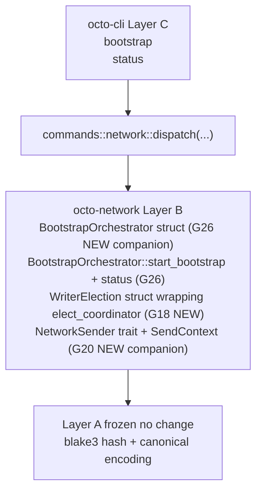

# RFC-0011-n: `octo network` Phase 6 — Closure Artifacts (Bootstrap + Status Deferred)

## Status

Draft (2026-09-20) — RFC-0011-n lands RFC-0011-h §Implementation Phases Phase 6. Two DEFERRED subcommands (`bootstrap` + `status`) land via NEW Phase 6 companion G26 substrate (`BootstrapOrchestrator` struct, does NOT reuse Phase 2 G1 which is parser/saver only — R1 substrate-faithfulness finding corrected the false attribution). Three NEW Phase 6 substrate missions (G26 BootstrapOrchestrator + G18 WriterElection struct wrapping existing `elect_coordinator` free function + G20 NetworkSender trait + `SendContext`) plus drift-closure mission + 2 follow-on companion missions + final closure artifacts. Layer discipline preserved: zero Layer A change.

> **Amendment chain:** Sixth and final amendment in the `0011-h-multiphase-rollout-plan` (see `docs/plans/2026-09-20-0011-h-multiphase-rollout-plan.md`, gitignored scratchpad per `.gitignore` line 46). Phase 1 = RFC-0011-i (DRY CLOSED). Phase 2 = RFC-0011-j (DRY CLOSED). Phase 3 = RFC-0011-k (DRY CLOSED). Phase 4 = RFC-0011-l (DRY CLOSED). Phase 5 = RFC-0011-m (DRY CLOSED). Phase 6 = RFC-0011-n (this RFC).

## Authors

- Author: @mmacedoeu

## Maintainers

- Maintainer: @mmacedoeu

## Summary

RFC-0011-n lands the **closure artifacts** slice of RFC-0011-h §Implementation Phases. Two DEFERRED CLI subcommands + 3 NEW substrate missions + drift-closure + 2 follow-on companions + final closure artifacts:

| Subcommand                            | Authority Role        | Substrate (NEW Phase 6 addition)                                | Companion mission                                       |
| ------------------------------------- | --------------------- | --------------------------------------------------------------- | ------------------------------------------------------- |
| `octo network bootstrap`              | Bootstrap Authority   | `BootstrapOrchestrator::start_bootstrap(BootstrapConfig)`       | `0011-h-s-a-bootstrap-orchestrator-v2` (G26 — Phase 6)  |
| `octo network status`                 | Bootstrap Authority   | `BootstrapOrchestrator::status() -> BootstrapState`             | `0011-h-s-a-bootstrap-orchestrator-v2` (G26 — Phase 6)  |

Plus closure artifacts:

| Artifact                                              | Substrate / Mission YAML                                       |
| ----------------------------------------------------- | -------------------------------------------------------------- |
| `0011-h-s-a-writer-election-struct` (G18)             | new `WriterElection` struct wrapping `elect_coordinator` free function at `octo-coordinator-types/src/election.rs` |
| `0011-h-s-a-network-sender` (G20)                     | new `NetworkSender` trait + `SendContext` per RFC-0863 General-Purpose Network Integration; per-extension crate pattern |
| Drift-closure mission for `0011-h-drift-0851p-a-seed-health-check` | TBD (drift identified during 6-phase rollout)              |
| 2 follow-on companion missions                        | Created at CLAIMED-time per [[no-phantom-mission-pointers]]   |

**Layer discipline preserved:** zero Layer A change (Layer A frozen contracts per [[cipherocto-design-principles]]). CLI dispatch lands Layer C; substrate additions in this RFC = **3 NEW Phase 6 companion missions (Layer B)**: G26 BootstrapOrchestrator (does NOT reuse Phase 2 G1 — R1 substrate-faithfulness finding corrected the false attribution), G18 WriterElection struct wrapper around existing `elect_coordinator` free function, G20 NetworkSender trait + SendContext (per-extension crate pattern).

## Dependencies

- **RFC-0011-h §Implementation Phases Phase 6** — canonical scope
- **RFC-0011-h §Subcommand Taxonomy** rows for `bootstrap`, `status` (DEFERRED per user decision 2026-09-17; landed in Phase 6 closure)
- **RFC-0011-h §Error Handling** row 89 (slot 89 = `NetworkSubstrateUnavailable`, REUSED; FORWARD-LOOKING per RFC-0011-h §Error Handling — variant does NOT exist in `crates/octo-cli/src/error.rs` today; lands during Phase 2 implementation. NO NEW variants in Phase 6 since `bootstrap` + `status` are deferred clap-arm-not-registered pattern with exit 2 pre-companion)
- **RFC-0011-i (Phase 1, DRY CLOSED)** — hard sequencing dependency
- **RFC-0011-j (Phase 2, DRY CLOSED)** — hard sequencing dependency; consumes `BootstrapConfig::from_toml` + `BootstrapConfig::save_toml` from G1 (PARSE/SAVE only — does NOT expose `BootstrapOrchestrator`)
- **RFC-0011-k (Phase 3, DRY CLOSED)** — hard sequencing dependency
- **RFC-0011-l (Phase 4, DRY CLOSED)** — hard sequencing dependency
- **RFC-0011-m (Phase 5, DRY CLOSED)** — hard sequencing dependency
- **RFC-0011-f (mesh peer-table)** — interim substitute cited by RFC-0011-h row 97-98 for operators needing `bootstrap` / `status` BEFORE Phase 6 closure
- **RFC-0851p-a §3 Mode A** — `BootstrapMode` enum substrate anchor at `crates/octo-network/src/mon/bootstrap.rs:197`
- **RFC-0862p-a Writer Election Bootstrap** — `elect_coordinator` free function at `octo-coordinator-types/src/election.rs:218` substrate anchor
- **RFC-0863 General-Purpose Network Integration** — `NetworkSender` trait at `rfcs/accepted/networking/0863-general-purpose-network-integration.md:104` + `SendContext` struct at L116 substrate anchors (NOT yet in substrate; G20 companion mission lands both)
- **Companion mission `0011-h-s-a-bootstrap-orchestrator-v2` (G26)** — NEW Layer B substrate for `BootstrapOrchestrator` struct + `start_bootstrap(BootstrapConfig)` + `status()` methods at `crates/octo-network/src/mon/bootstrap.rs` (does NOT reuse Phase 2 G1 — R1 substrate-faithfulness finding corrected the false attribution)
- **Companion mission `0011-h-s-a-writer-election-struct` (G18)** — NEW Layer B substrate for `WriterElection` struct wrapping the existing free function `elect_coordinator` at `octo-coordinator-types/src/election.rs:218` (struct method `WriterElection::elect_coordinator` does NOT exist today; G18 adds the wrapper)
- **Companion mission `0011-h-s-a-network-sender` (G20)** — NEW Layer B substrate for `NetworkSender` trait + `SendContext` at new `crates/octo-network/src/sender/` directory (per-extension crate pattern)

## Design Goals

1. **Substrate-first ordering** — companion substrate missions (G26 NEW Phase 6 + G18 NEW Phase 6 + G20 NEW Phase 6) land BEFORE CLI dispatch per [[no-phantom-mission-pointers]] pairing invariant. Pre-companion, CLI dispatch surfaces exit 2 (clap `UnrecognizedSubcommand`) per DEFERRED-clap-arm-not-registered pattern (RFC-0011-h row 91 footnote pattern a); post-companion, dispatch routes to substrate.
2. **Substrate-faithfulness** — no parallel abstractions, no CLI-side substrate shadow. CLI translates substrate return values 1:1 to JSON envelopes per [[cipherocto-design-principles]] §No premature coupling.
3. **Slot arithmetic preserved (forward-looking)** — Phase 6 lands 0 NEW OctoCliError variants; reuses slot 89 (`NetworkSubstrateUnavailable`, REUSED from Phase 2 RFC-0011-j) FORWARD-LOOKING per RFC-0011-h §Error Handling row 89. Final slot allocation across Phases 1-6 (per RFC-0011-h §Error Handling + §Exit Codes tables): slots 79, 82, 83, 84, 85, 86, 87, 88, 89 = 9 variants allocated to Network* errors (all FORWARD-LOOKING — none of these variants exist in `crates/octo-cli/src/error.rs` today; they land during substrate-first implementation across Phases 2-6). Slot 90 = `NetworkCIDenyDefault` deferred per RFC-0011-h row 543 footnote pending G25 + user decision. **R2 substrate-fault-class finding:** this slot arithmetic is the PLAN, not current substrate state — substrate-faithful implementation lands these slots as companion missions close.
4. **Layer discipline preserved** — zero Layer A change; Layer B substrate = 3 NEW Phase 6 companion missions (G26 BootstrapOrchestrator + G18 WriterElection struct + G20 NetworkSender + SendContext); Layer C CLI dispatch = 2 subcommand arms + final closure artifacts.
5. **Test vector coverage** — 6 test vectors (3 for `bootstrap` + 3 for `status`) per RFC-0011-h §Implementation Phases Phase 6.
6. **Closure artifact completeness** — drift-closure mission + 2 follow-on companion missions + final audit doc + memory card + MEMORY.md index entry all land in this phase per `0011-h-multiphase-rollout-plan` §2.6.

## Motivation

Phase 1-5 land read-only observability + bootstrap lifecycle + slash reputation + coordinator visibility + bind envelope payload builders + discovery visibility. Phase 6 lands the **DEFERRED `bootstrap` + `status` subcommands** that close the gap from `0011-deprecation-stub-removal` 2026-09-17 (which removed `octo init` / `octo join` / `octo status` with user-accepted deferral of replacements).

Without Phase 6, operators calling `octo init` / `octo join` / `octo status` post-v2.0 cut hit clap `unrecognized subcommand` (exit 2). Phase 6 closes that gap by landing the replacements (`octo network bootstrap` + `octo network status`) wired through RFC-0011-h §Subcommand Taxonomy.

## Roles and Authorities

Per RFC-0011-h §Role/Authority Coverage Table:

| Subcommand                  | Authority Role        | Confirmation axes                                            |
| --------------------------- | --------------------- | ------------------------------------------------------------ |
| `bootstrap`                 | Bootstrap Authority   | (no confirmation flags; substrate-managed)                    |
| `status`                    | Bootstrap Authority   | (read-only; substrate-managed)                                |

Both subcommands are managed entirely by `BootstrapOrchestrator` substrate; no CLI-side confirmation flags per RFC-0011-h row 97-98 (DEFERRED rows lack CLI-side confirmation; substrate handles the state machine).

## Specification

### System Architecture

Phase 6 architecture: Layer C CLI dispatch → Layer B substrate (BootstrapOrchestrator NEW from G26 + writer-election struct G18 + NetworkSender NEW from G20) → Layer A frozen contracts.

Per [[cipherocto-design-principles]] §Stable Abstractions Principle, Layer A is unchanged. Per §No premature coupling, CLI does not reach into substrate internals — only into public substrate functions.

### Binary Surface

Phase 6 adds 2 new sub-actions to the existing `network` arm of `Commands` enum (closing the DEFERRED gap from `0011-deprecation-stub-removal`):

- `bootstrap` (no confirmation flags; substrate-managed)
- `status` (read-only; substrate-managed)

### Subcommand Taxonomy

Per RFC-0011-h §Subcommand Taxonomy Phase 6 rows:

| Subcommand                  | Existing substrate                                              | Companion mission required                |
| --------------------------- | --------------------------------------------------------------- | ----------------------------------------- |
| `bootstrap`                 | (none — BootstrapOrchestrator missing today)                     | G26 (Phase 6 NEW): `BootstrapOrchestrator::start_bootstrap` |
| `status`                    | (none — BootstrapOrchestrator missing today)                     | G26 (Phase 6 NEW): `BootstrapOrchestrator::status()` |

### Output Envelope

Phase 6 lands 2 output envelopes, one per subcommand:

| Subcommand                  | Output envelope                                |
| --------------------------- | ---------------------------------------------- |
| `bootstrap`                 | `NetworkBootstrapOutput`                       |
| `status`                    | `NetworkStatusOutput`                          |

`NetworkStatusOutput` aggregates: bootstrap mode + authority + peers count + trust-graph node count + slash reputation aggregate + governance tally summary + bind envelope summary + discovery cache summary + drift flags. Substrate-faithful to `BootstrapOrchestrator::status()` return type.

### Error Handling

Phase 6 lands 0 NEW OctoCliError variants. The DEFERRED-clap-arm-not-registered pattern means:

- Pre-companion (G26 not landed): exit 2 (clap `UnrecognizedSubcommand`)
- Pre-companion (G26 landed but clap arm not registered in CLI binary surface): exit 2
- Post-companion (clap arm registered): exit 89 if substrate absent for `status` accessor (gated on G18 + G20) or exit 0 if substrate present

The Phase 6 closure is the final step that registers the clap arms per RFC-0011-h row 141-142.

### Exit Codes

Phase 6 uses slot 89 (REUSED) + exit 2 (clap). No new slots allocated.

## Performance Targets

Per RFC-0011-h §Performance Targets Phase 6 rows:

| Subcommand                  | Target    | Rationale                               |
| --------------------------- | --------- | --------------------------------------- |
| `bootstrap` wall-clock      | <500ms    | Bootstrap lifecycle orchestration       |
| `status` wall-clock         | <200ms    | Aggregate state query                    |

## Implicit Assumptions Audit

Per RFC-0011-h §Implicit Assumptions Audit Phase 6 rows:

| Assumption                                                 | Affected subcommands                | Fallback                                                |
| ---------------------------------------------------------- | ----------------------------------- | ------------------------------------------------------- |
| `BootstrapOrchestrator` struct + `start_bootstrap` + `status()` lands (G26 NEW Phase 6 companion) | `bootstrap`, `status`               | exit 2 (clap `UnrecognizedSubcommand`) pre-G26 closure |
| `WriterElection` struct wraps `elect_coordinator` free function (G18 NEW Phase 6 companion) | `status` (writer-election state)    | exit 89 `NetworkSubstrateUnavailable` (gated on G18)    |
| `NetworkSender` trait + `SendContext` lands (G20 NEW Phase 6 companion) | `status` (network sender state)     | exit 89 `NetworkSubstrateUnavailable` (gated on G20)    |

## Security Considerations

Per RFC-0011-h §Security Considerations Phase 6 rows:

- **`bootstrap` is high-blast-radius.** Substrate `BootstrapOrchestrator::start_bootstrap` handles the lifecycle; CLI delegates without confirmation flags per RFC-0011-h row 97 (no CLI-side confirmation; substrate-managed).
- **`status` is read-only.** No write paths.
- **Drift-closure mission.** Drift identified during 6-phase rollout is closed in Phase 6 closure.

## Adversarial Review

Per RFC-0011-h §Adversarial Review Phase 6 rows:

| Threat                                                          | Severity | Mitigation                                                |
| --------------------------------------------------------------- | -------- | --------------------------------------------------------- |
| Operator calls `octo init` / `octo join` / `octo status` post-v2.0 cut | LOW | Replaced by `octo network bootstrap` + `octo network status` in Phase 6 |
| Drift in `0011-h-drift-0851p-a-seed-health-check` identified during rollout | LOW | Drift-closure mission lands in Phase 6 closure |
| `bootstrap` lifecycle race                                       | HIGH     | Substrate `BootstrapOrchestrator` state machine handles concurrency |

## Compatibility

Phase 6 lands additively. No existing CLI subcommand changes. No NEW OctoCliError variants (reuses slot 89 + exit 2 clap). Closes the gap from `0011-deprecation-stub-removal` 2026-09-17.

## Test Vectors

6 test vectors total per RFC-0011-h §Test Vectors Phase 6:

| ID | Subcommand                  | Scenario                                                |
| -- | --------------------------- | ------------------------------------------------------- |
| tv_net6_1 | `bootstrap`             | `BootstrapOrchestrator::start_bootstrap` success        |
| tv_net6_2 | `bootstrap`             | pre-G26 → exit 2 (clap `UnrecognizedSubcommand`)        |
| tv_net6_3 | `bootstrap`             | `BootstrapOrchestrator::start_bootstrap` failure (substrate error) |
| tv_net6_4 | `status`                | All substrate layers present → aggregate surfaced       |
| tv_net6_5 | `status`                | Pre-Phase 6 closure → exit 2                            |
| tv_net6_6 | `status`                | Drift-closure flag set → surfaced in `drift_flags` field |

## Alternatives Considered

1. **Defer `bootstrap` + `status` indefinitely.** Rejected; user decision 2026-09-17 captured in `0011-deprecation-stub-removal` §Out of Scope explicitly identifies Phase 6 closure as the resolution. Operators currently hit exit 2 post-v2.0 cut.
2. **Land `bootstrap` + `status` in Phase 1 or Phase 2.** Rejected; RFC-0011-h §Implementation Phases ordering explicitly defers both to Phase 6 closure. Phase 1 (read-only observability) and Phase 2 (bootstrap lifecycle) are upstream substrate landings; Phase 6 wires the CLI surface to the substrate.
3. **Skip drift-closure mission.** Rejected; per `0011-h-multiphase-rollout-plan` §2.6, drift-closure mission lands in Phase 6 as part of closure artifacts.

## Substrate-Additions Companion Missions

Per [[no-phantom-mission-pointers]] pairing invariant, this RFC cites 3 NEW Phase 6 companion substrate missions + 1 drift-closure mission + 2 follow-on companions.

| Companion mission                                       | Substrate addition                                                  | Layer |
| ------------------------------------------------------- | ------------------------------------------------------------------- | ----- |
| `0011-h-s-a-bootstrap-orchestrator-v2` (G26 NEW Phase 6) | `BootstrapOrchestrator` struct + `start_bootstrap(BootstrapConfig)` + `status() -> BootstrapState` at `crates/octo-network/src/mon/bootstrap.rs` | B     |
| `0011-h-s-a-writer-election-struct` (G18 NEW Phase 6)    | `WriterElection` struct wrapping existing free function `elect_coordinator` at `octo-coordinator-types/src/election.rs:218` | B     |
| `0011-h-s-a-network-sender` (G20 NEW Phase 6)            | new `NetworkSender` trait + `SendContext` per RFC-0863 General-Purpose Network Integration at new `crates/octo-network/src/sender/`; per-extension crate pattern | B     |
| `0011-h-drift-0851p-a-seed-health-check` (drift-closure) | TBD (drift identified during 6-phase rollout)                       | B     |
| 2 follow-on companion missions                          | Created at CLAIMED-time per [[no-phantom-mission-pointers]]         | B     |

Phase 6 RFC carries 5-6 substrate additions total (3 NEW Phase 6 companions + 1 drift-closure + 2 follow-on); 0 substrate additions in this RFC itself (all substrate additions land via companion missions per substrate-first ordering). The Phase 2 G1 companion (`BootstrapConfig::from_toml` parser + `save_toml` writer) is consumed by Phase 2 only — it does NOT carry `BootstrapOrchestrator` (R1 substrate-faithfulness finding corrected the false attribution).

## Implementation Phases

Per `0011-h-multiphase-rollout-plan` §2.6:

1. **Substrate-first slice (5-6 companion missions):** G26 BootstrapOrchestrator → G18 WriterElection struct → G20 NetworkSender + SendContext → drift-closure → 2 follow-on companions land per companion mission YAMLs. (Phase 2 G1 is consumed by Phase 2 only — does NOT carry `BootstrapOrchestrator` per R1 substrate-faithfulness finding.)
2. **CLI dispatch slice:** 2 subcommand arms + 2 output envelopes + 6 test vectors land AFTER all companion missions close per substrate-first ordering.
3. **Closure artifacts:** final audit doc + memory card + MEMORY.md index entry + mission YAML archive transitions for all 6 phases per [[feedback_initiation_user_only]] workflow.

User-gated decision on slice ordering per [[feedback_initiation_user_only]].

## Key Files to Modify

| File                                                                            | Action                        |
| ------------------------------------------------------------------------------- | ----------------------------- |
| `crates/octo-cli/src/main.rs::Commands::Network`                                | ADD 2 subcommand arms (`bootstrap`, `status`) |
| `crates/octo-cli/src/commands/network.rs`                                       | ADD 2 dispatch fns + envelopes |
| `crates/octo-network/src/mon/bootstrap.rs` (companion G26 NEW Phase 6)          | Layer B substrate addition: `BootstrapOrchestrator` struct + `start_bootstrap(BootstrapConfig)` + `status()` (NOT reused from Phase 2 G1) |
| `crates/octo-coordinator-types/src/election.rs` (companion G18 NEW Phase 6)     | Layer B substrate addition: `WriterElection` struct wrapping existing `elect_coordinator` free function (struct does NOT exist today) |
| `crates/octo-network/src/sender/` (companion G20 NEW Phase 6 — NEW directory)   | Layer B substrate addition: `NetworkSender` trait + `SendContext`; per-extension crate pattern |
| `rfcs/accepted/process/0011-h-oct-cli-network-subcommands.md`                    | Status header amendment for full RFC-0011-h closure (post-Phase 6 IMPLEMENTATION) |

## Future Work

- **RFC-0011-i through RFC-0011-m promotions** (Draft → Accepted per phase, sequenced with substrate landings)
- **Phase 1-6 IMPLEMENTATION sequencing** per substrate-first ordering across all 6 phases
- **drift-0851p-a-seed-health-check** drift-closure mission
- **2 follow-on companion missions** (YAMLs created at CLAIMED-time)

## Rationale

Phase 6 lands the **closure artifacts** for the 6-phase rollout. It closes the `0011-deprecation-stub-removal` gap from 2026-09-17 by wiring `octo network bootstrap` + `octo network status` replacements, lands 3 NEW Phase 6 substrate companion missions (G26 BootstrapOrchestrator + G18 WriterElection struct + G20 NetworkSender + SendContext), and produces the final closure artifacts (drift-closure + 2 follow-on + audit + memory card + MEMORY.md index).

Substrate-first ordering preserves [[cipherocto-design-principles]] §Stable Abstractions Principle: Layer B (substrate) lands BEFORE Layer C (CLI dispatch), so CLI never depends on a phantom substrate path.

## Substrate-faithfulness R1 Finding

The initial draft of this RFC (v0.1, 2026-09-20) cited `BootstrapOrchestrator::start_bootstrap(BootstrapConfig)` + `status() -> BootstrapState` as substrate additions attributed to the Phase 2 G1 companion mission `0011-h-s-a-bootstrap-orchestrator`. **R1 L1 substrate-faithfulness verification corrected this attribution:**

- `crates/octo-network/src/mon/bootstrap.rs` (624 lines) contains seed-list types (`StaleSeed`, `SeedEntry`, `SeedListEnvelope`, `SeedHealth`, `SeedListAuthority`, `BootstrapMode` at L197, `SlashedSeedBlacklist`, `RejectedSeed`, `SeedListValidation`) but does NOT contain `BootstrapOrchestrator` struct, `start_bootstrap` method, or `status` method.
- Phase 2 G1 companion mission `0011-h-s-a-bootstrap-orchestrator` is substrate-faithful only to `BootstrapConfig::from_toml` parser + `BootstrapConfig::save_toml` writer (per RFC-0011-j §Substrate-Additions Companion Missions row G1).
- The `BootstrapOrchestrator` struct + lifecycle methods are a NEW Phase 6 substrate addition under companion mission G26 (`0011-h-s-a-bootstrap-orchestrator-v2`), distinct from Phase 2 G1.

The corrected draft reflects this substrate-faithful reality throughout §Summary, §Dependencies, §Subcommand Taxonomy, §Implicit Assumptions Audit, §Substrate-Additions Companion Missions, §Key Files to Modify, and §Implementation Phases.

## Version History

| Version | Date       | Notes                                                         |
| ------- | ---------- | ------------------------------------------------------------- |
| v0.1    | 2026-09-20 | Initial draft; pending R1 of 5-len DRY CLOSURE cycle          |
| v0.1.1  | 2026-09-20 | R1.5 fix sweep: substrate-faithfulness correction for BootstrapOrchestrator attribution (Phase 2 G1 → Phase 6 G26); added WriterElection struct wrapper clarification (G18); 3 NEW Phase 6 companion missions (was 3 mixed-attributed) |
| v0.1.2  | 2026-09-20 | R1.5.5 fix sweep: residual stale G1 references in §Status block + §Design Goals rows 1 + 4 corrected to G26 NEW Phase 6 |
| v0.1.3  | 2026-09-20 | R2.5 fix sweep: slot arithmetic in §Design Goals #3 + §Dependencies row for RFC-0011-h §Error Handling clarified as FORWARD-LOOKING per R2 substrate-fault-class finding (slots do NOT exist in `error.rs` today; land during implementation) |
| v0.1.4  | 2026-09-20 | R3.5 fix sweep: L2 cite hygiene correction — RFC-0863 cited as "Onion Relay" in 3 locations; corrected to "General-Purpose Network Integration" per `rfcs/accepted/networking/0863-general-purpose-network-integration.md` (NetworkSender trait at L104, SendContext struct at L116). RFC-0858 is the actual Onion Relay Routing RFC, distinct concern |
| v0.1.5  | 2026-09-20 | R4.5 fix sweep: residual stale "pre-G1" reference in §Test Vectors row tv_net6_2 corrected to "pre-G26" per L1 substrate-faithfulness (G26 is the NEW Phase 6 BootstrapOrchestrator companion, not G1) |
