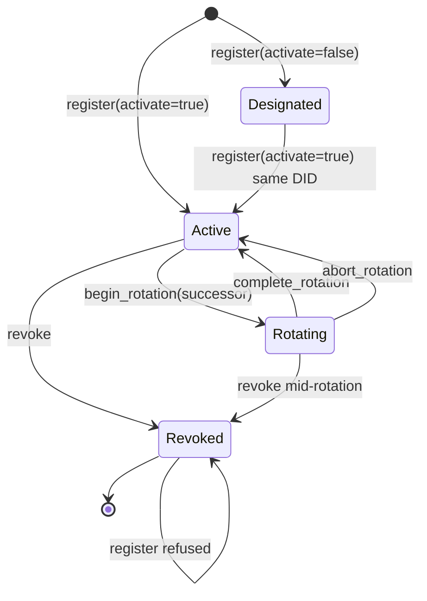

# RFC-0011-x: `WalletStore` — Identity Store Substrate, Registration Write-Path, and the Unlock Split

## Status

Draft (2026-09-30) — RFC-0011-x closes the last genuine open substrate gap in the `octo` identity surface. The parent RFC's `WalletStore` contract is implemented as a zero-sized struct that returns an empty store and an unconditional `NotActive`, so `octo whoami` exits 2 on every host regardless of operator state, and 13 CLI call sites consume that result. This amendment specifies the store's on-disk layout, the registration write-path, lifecycle persistence, and an **unlock split** that separates metadata reads (passphrase-free) from key access (passphrase-gated).

Amends RFC-0011 §Subcommand Taxonomy item 1 and supersedes its `active_identity` placement clause at **both** sites that state it — §Subcommand Taxonomy item 1 itself and the §`octo whoami` Substrate row. Additive at every other site. THREE new `WalletError` variants (`Locked`, `IdentityNotFound`, `WeakPassphrase`) + THREE new `OctoCliError` variants (slot 92 `WalletLocked` at exit 92, slot 93 `IdentityTransitionRefused` at exit 43, slot 94 `WeakPassphrase` at exit 2). Three new `octo identity` subcommands (`register`, `select`, `list`) and two new `octo identity rotate` subcommands (`complete`, `abort`). Cross-RFC reference updates in RFC-0011, RFC-0011-f, RFC-0102, and RFC-0009. Paired with two new companion mission YAMLs per §Companion mission YAML pairing.

> **Not a layer change.** `octo-wallet` is Layer B (identity substrate, RFC-driven, additive-only). `octo-cli` is Layer C (per-RFC). Layer A is untouched — see §Appendices B.

## Authors

- Author: @mmacedoeu

## Maintainers

- Maintainer: @mmacedoeu

## Summary

RFC-0011 specifies a `WalletStore` in `octo-wallet` (Layer B) that opens an on-disk store, returns the active `IdentityKey`, resolves a record by DID, and enforces 0700 on creation. The shipped struct is `pub struct WalletStore;` — zero-sized — with `open()` returning an empty store and `try_active_identity()` returning `NotActive { current_state: Designated }` unconditionally. The `[ADD]` contract in the parent RFC is therefore satisfied in signature and violated in behaviour, and the guide documents the consequence at **eleven claims across seven locations**, enumerated by anchor sentence in the companion CLI mission's AC-26.

This amendment is deliberately narrow about what it does **not** build. The encrypted on-disk primitives already exist and are already tested:

| Existing primitive                                                                                                           | Status                                | What this RFC does with it                                  |
| ---------------------------------------------------------------------------------------------------------------------------- | ------------------------------------- | ----------------------------------------------------------- |
| `Vault` — Argon2id + AES-256-GCM, 0700 slots dir, `put` / `get` / `list`                                                     | LANDED, tested                        | Reused unchanged. The identity seed becomes one vault slot. |
| `StarkliCompat` — Argon2id + chacha20-poly1305, `import` / `export`                                                          | LANDED, tested                        | Untouched. Interop format, not the native store.            |
| `IdentityKey` — `generate` / `from_seed` / `activate` / `begin_rotation` / `complete_rotation` / `abort_rotation` / `revoke` | LANDED, tested                        | Reused unchanged.                                           |
| `IdentityRecord`, `IdentityRotationEvent`                                                                                    | LANDED, serde-complete, **no writer** | Become the store's index payload.                           |
| `Did`, `LifecycleState`                                                                                                      | LANDED                                | Reused unchanged.                                           |

What does not exist is a **native identity store**: a DID-indexed record set plus an active-DID pointer, and any code path that writes either. Nothing in the workspace can put an identity into a store, so a read-only store would still resolve nothing and `octo whoami` would still exit 2. The registration write-path is therefore in scope, and it is the part that makes the rest observable.

### The unlock split

The parent RFC's `WalletStore::open()` takes no passphrase parameter, while `active_identity` must return a usable `IdentityKey`. It is tempting to read that pair as forcing a plaintext seed on disk with `0700` as the sole defence. **That reading is wrong, and the parent RFC refutes it in its own text**: §Subcommand Taxonomy item 10 specifies `WalletStore::active_signer() -> Result<Arc<dyn CapabilitySigner>, WalletError>` as the helper the CLI obtains a signer through, describing it as one that "wraps the HSM-backed signer". The substrate agrees — `IdentityKey` holds an `Arc<dyn HsmAdapter>`, `IdentityKey::signer()` hands it out, and an `IdentityKey` whose key never touches disk is already expressible today.

The parent contract therefore does not force a plaintext seed, and this amendment does not claim that it does. The unlock split is a **choice with a cost in both directions**, and the cost belongs in the RFC rather than in a rationale paragraph:

- Keeping the seed on disk means choosing a passphrase, which means every signing command prompts. That is a real availability cost paid on every invocation, and §CLI dispatch carries the whole of it.
- The passphrase buys confidentiality that survives offline disk access and backup leakage — the threat the parent could not address without an HSM.

On a platform whose thesis is private, sovereign intelligence, that trade is the right one. It is a trade and not a forced consequence, and Alt 2 records the alternative this amendment steps back from.

- `WalletStore::open()` keeps its signature and its metadata-only meaning. It reads the record index and the active-DID pointer. Both are public metadata — DIDs, public keys, lifecycle states, timestamps — and neither is secret, so neither needs a passphrase.
- `WalletStore::unlock(passphrase)` is new. It derives the Argon2id key from the passphrase, decrypts the seed slot, constructs an `IdentityKey`, zeroizes the plaintext buffer, and returns an `UnlockedWallet` handle that carries the key.

This means `octo identity show` and `octo identity list` need no passphrase at all, which is the property that keeps the migration tractable: of the 13 existing call sites, only the ones that actually sign must thread an unlock.

## Dependencies

**Requires:**

- RFC-0011 (parent RFC; the `WalletStore` `[ADD]` contract this amendment supersedes in part)
- RFC-0102 (wallet cryptography; supplies the Argon2id + AES-256-GCM storage primitive the seed slot reuses, and the passphrase-handling prohibition)
- RFC-0009 (identity evolution; supplies `LifecycleState` and the rotation state machine the store persists)

**Optional:**

- RFC-0011-f (a mirror row in its §Implicit Assumptions references `octo-wallet::WalletStore`; the cross-reference is updated but no normative text depends on it)
- RFC-0010 (canonical DID form; `Did` is already implemented against it and is unchanged here)

> **Dependency Validation Rules:**
>
> 1. Dependencies MUST form a DAG (no cycles)
> 2. All "Requires" RFCs MUST be listed as mission prerequisites
> 3. Optional dependencies MUST be documented separately from required
> 4. Dependencies on "Planned" RFCs MUST note the assumption they will be Accepted
> 5. A two-cycle MUST be promoted atomically — neither half lands before the other

Verified against this set:

1. **DAG.** No cycle. RFC-0011-x depends on RFC-0011, RFC-0102, and RFC-0009; none of those names RFC-0011-x, and RFC-0011-x amends RFC-0011 without RFC-0011 depending on the amendment. The two missions are ordered substrate-then-CLI, which is a DAG edge in the same direction.
2. **Requires listed as mission prerequisites.** All three — RFC-0011, RFC-0102, RFC-0009 — appear in both missions' §Dependencies, each with the reason it is required and a note that no amendment to it is needed. An earlier revision of this section claimed that compliance while neither mission listed a single one of them, so the claim was true of nothing; the missions now carry the entries, which is the only version of this rule that can be checked by reading a mission. RFC-0011-x's own acceptance is a prerequisite of both.
3. **Optional separated.** RFC-0011-f and RFC-0010 are listed under Optional, and nothing normative depends on either. RFC-0010 in particular is listed because `Did` is already implemented against it, not because this amendment needs a change to it.
4. **No Planned-RFC dependencies.** All five are Accepted, so rule 4 has nothing to apply to. Stating that is the check.
5. **No two-cycle.** There is no amendment here and a counter-amendment waiting on it.

All three required RFCs are Accepted.

## Design Goals

1. **Make the parent contract true.** `open()` reads a real store; `identity_record` resolves a real record; 0700 is enforced on creation rather than documented.
2. **Never write plaintext key material.** The seed is a `Vault` slot, encrypted with the crate's existing Argon2id + AES-256-GCM path. No new cryptography is introduced.
3. **Keep metadata reads passphrase-free.** Only key access is gated. A read-only inspection command must not prompt.
4. **Fail closed on an un-migrated call site.** A call site that still reaches for a key through a locked handle must produce a hard, attributable error — not a silently empty result.
5. **One store, one resolver.** The store resolves its own home rather than reading an ambient value, following the mesh substrate's documented order. The workspace's other resolvers disagree with it and with each other; that disagreement is tabulated in §Home resolution and consolidating them is deferred per §Future Work.

## Motivation

1. **The wall is a stub, not a boundary.** The guide states the wall in **eleven claims across seven locations**, enumerated by anchor sentence in the companion CLI mission's AC-26. The eleven sit in seven locations, and the two units a reader is most likely to reach for disagree, so both are given: counting comment _blocks_ gives **six**, and counting _locations_ gives **seven**. The six blocks are §4 step 2a, §18 step 5, and §18 step 8, each carrying two claims, plus §22 step 3, §22 step 14, and §31 step 1, each carrying one. The seventh location is the §17 exit-2 troubleshooting entry, whose two claims are guide prose rather than shell comments — which is why a count of comment blocks returns six and not seven. An earlier revision of this sentence enumerated only the three two-claim blocks, reported five blocks and seven locations, and gave a derivation producing neither: three collapses turn eleven claims into eight locations, not seven, because the derivation never accounts for the §17 pair. The block it missed is §22 step 3, which is a comment run of its own and not a continuation of the §22 step 14 run — the two sit in the same section and about a hundred and forty lines apart, with shell between them, and §18 step 8 is the other pair that reads as one block and is not: its two claims straddle the run. The figure is the CLI mission's to correct, because AC-26 is the census both numbers are measured against, and that mission's own copy of the block count was wrong in the same way for the same reason. The other number is the one that is easy to land on by searching, and the search has to name both forms: a case-insensitive sweep for `wallet store` or `WalletStore` returns exactly seven lines, which is 7 lines, **5** locations, and **7** claims at once — and it misses the **four** claims that describe the wall from its symptom rather than naming the store. An earlier revision of this sentence gave the other two figures, 7 locations and 6 claims, in one copy here and one in the companion CLI mission, so the sweep was reported as three views of one set when it is three views of three. The seven lines fall in five locations because two of them are the two claims of a single §4 step 2a block, and they touch seven claims because one of them — the §17 line — is the only line in the guide carrying two claims at once. The census's other two locations, the §18 step 5 pair and the §31 step 1 claim, produce no line for this sweep at all, which is why four claims are missed and not five. Both forms are named because three of the seven lines write the store as `WalletStore::open()` and only the other four as `wallet store`: a sweep for the spaced phrase alone returns four. Every one of the eleven describes a deliberate design decision. None of them is true: the store is zero-sized and the crypto it would need is already shipped and tested. The honest description is that a wiring layer was never written.

   **The count in this item was wrong in four places while the sentence beside it was right.** An earlier revision opened with eleven and then said ten three times in the same paragraph, and said four where the symptom-phrased claims are five, because the three two-claim blocks were enumerated (two in §4 step 2a, two in §18 step 5, two in §18 step 8) and the symptom group was then inferred rather than counted — the inference took the symptom group as four and the enumeration beside it had already produced the sixth. The error is the mission's own recorded mistake, in a new place: a correct enumerated number in one sentence of a paragraph and a reasoned number in the next. The eleven is the enumerated figure and every number in this item now carries it.

2. **A read-only store fixes nothing an operator can see.** `WalletStore` has no writer anywhere in the workspace. Adding a reader without a writer produces a store that is always empty, so `octo whoami` keeps exiting 2 and all eleven guide statements stay true. The write-path is the minimum slice that changes observable behaviour.
3. **The current shape invites a plaintext seed.** An `open()` that takes no passphrase but must return a key has a plaintext seed as its most obvious answer, and shipping it would put the only unencrypted key material in a crate that Argon2ids everything else. The parent RFC did not mandate that answer — its item 10 routes through an HSM-backed signer — but the HSM path has no implementation, so the obvious answer is the one that would get built. This amendment takes the third option instead.
4. **Identity state is lost on every invocation.** `IdentityKey` is constructed per process and discarded. Rotation history exists as a type with no writer, so `IdentityRecord::rotation_history` is permanently empty and `octo identity show` cannot report a rotation chain it can see in memory but not on disk.

## Roles and Authorities

| Role                      | Authority                                                                                                                                                                                                      |
| ------------------------- | -------------------------------------------------------------------------------------------------------------------------------------------------------------------------------------------------------------- |
| RFC-0011 authors          | May amend the `[ADD]` contract in §Subcommand Taxonomy item 1. RFC-0011-x exercises that authority for the `active_identity` placement clause only, at both sites that state it.                               |
| RFC-0102 authors          | Own the storage cryptography. RFC-0011-x selects no new primitive and changes no parameter, so no RFC-0102 amendment is required; the cross-reference update in §Cross-RFC reference updates is informational. |
| RFC-0009 authors          | Own the lifecycle state machine. RFC-0011-x persists transitions the state machine already defines and invents none.                                                                                           |
| Mission `0102-a` claimant | Retains authority over the wallet foundation mission. RFC-0011-x narrows that mission's scope; see §Companion mission YAML pairing.                                                                            |

### Out-of-scope roles

| Not addressed here                                    | Transferred to                                                                      |
| ----------------------------------------------------- | ----------------------------------------------------------------------------------- |
| Custody of the passphrase itself                      | The operator. Nothing in this store generates, stores, or recovers it.              |
| HSM provisioning and key ceremony                     | A follow-on mission per §Future Work; the branch point is named in §Detailed Design |
| Physical custody of the seed file before registration | The operator, per the guide's existing `--seed-out` onboarding step                 |
| Node membership, reputation, and governance           | Unchanged. The store holds an identity record, nothing about admission              |

The passphrase role is the one that matters, and stating it is what makes the design auditable. A store that implied key custody would be a different design with a different threat model; this one explicitly does not, and the operator holding the passphrase is a precondition rather than a bug.

### Role/Authority Coverage Table

| Role                    | Identifier                    | Authority Scope | Lifecycle                                                               | Source/Ref                               |
| ----------------------- | ----------------------------- | --------------- | ----------------------------------------------------------------------- | ---------------------------------------- |
| Operator (human)        | OS uid owning `$OCTO_HOME`    | admin           | Stateless — grants no in-store state; the passphrase is the credential  | §Security Considerations 1-4             |
| Store                   | `WalletStore`                 | read / write    | `Locked` → `Unlocked` per call, never persisted as a store state        | §`WalletStore` — locked handle           |
| Unlocked handle         | `UnlockedWallet<'a>`          | write           | Borrow-scoped over `&'a mut WalletStore`; exclusive while alive         | §`unlock` — the key path                 |
| Registered identity     | `Did` + `IdentityKey`         | write (own key) | `Designated` → `Active` → `Rotating` → `Active` → `Revoked`, terminal   | §Lifecycle Requirements                  |
| Active identity pointer | `WalletIndex::active_did`     | read / write    | `None` → `Some(did)`; mutable without a key, since it is an index field | §Detailed Design — `WalletStore::select` |
| CLI caller              | `octo` dispatcher             | none            | Stateless — one-shot process, no daemon, no listening socket            | §CLI dispatch                            |
| Same-user process       | Any uid equal to the operator | write           | Out of scope by threat model, not by omission — see §A1 and §A2         | §Adversary Analysis A1, A2               |

Two rows deserve a note rather than a checkbox. The **operator** is stateless in the store's own state machine because the store never persists who unlocked it — that is deliberate, and it is why `store.json` needs authentication against a _writer_ but not against a reader. The **same-user process** is listed as a role precisely because it is the adversary this design does not defend against, and naming it is what stops that from being an implicit assumption.

## Detailed Design

### Store layout

Root resolves per §Home resolution and is created with mode 0700 on first write.

```text
$OCTO_HOME/wallet/            0700  dir
  store.json                  0600  public metadata: version, active_did, records[]
  seed/                       0700  dir  (Vault slots_dir)
    <did-slug>.vault          0600  Argon2id + AES-256-GCM, holds the 32-byte seed
```

`store.json` holds `WalletIndex`:

```rust
// crates/octo-wallet/src/identity_store.rs (NEW module)
//
// NO `PartialEq`. `IdentityRecord` derives only `Debug, Clone, Serialize, Deserialize`,
// and `Vec<IdentityRecord>: PartialEq` therefore does not hold, so a derived
// `PartialEq` here is E0369 — a hard compile error, reproduced with `rustc` rather
// than reasoned about. An earlier revision of this block derived `PartialEq` and the
// substrate mission's §Out of Scope forbade adding it to `IdentityRecord`, so the
// spec as written could not build. The vectors that need index comparison compare
// **bytes**, which is what byte-stability actually means, and `serde_json::to_vec`
// needs no `PartialEq`. `Did` does derive `PartialEq`, so `active_did` would have
// been fine; the failure is the `records` vector alone.
#[derive(Clone, Debug, Serialize, Deserialize)]
pub struct WalletIndex {
    /// Schema version. Currently 1. A reader MUST reject an unknown version.
    pub version: u32,
    /// The active identity, or `None` when the store holds records but none is selected.
    pub active_did: Option<Did>,
    /// Records sorted ascending by `did` so `store.json` is byte-stable for a given store state.
    pub records: Vec<IdentityRecord>,
}
```

Records are sorted by DID on write. The alternative — insertion order — makes `store.json` a function of write history rather than of store state, which breaks byte-stability for a file the operator may version-control or diff.

`store.json` is deliberately **not** encrypted. It contains no secret: a DID is a public key, a public key is public by construction, and lifecycle state and timestamps are operator metadata. Encrypting it would buy nothing and would force a passphrase onto read-only inspection commands, defeating Design Goal 3.

### Home resolution

Resolution order, matching the CLI's own single-source-of-truth resolver in `octo-cli/src/home.rs`:

1. `$OCTO_HOME` if set **and non-empty**.
2. An **empty** `$OCTO_HOME` is a **hard error**, not a fall-through. `octo-cli/src/home.rs` fails closed here and returns `OctoCliError::NoOctoHome` (exit 27), deliberately: an earlier revision of that module fell back to `/tmp/.octo` when neither variable was set, which is a world-writable directory on a shared host. The store follows the fail-closed rule. An earlier revision of this paragraph also claimed `home.rs` rejects a **whitespace-only** value; it does not — its test is `p.is_empty()`. The store matches the named resolver rather than a stricter rule invented for it, because the point of citing a resolver is to match it. `octo-mesh` does fall through on empty, and that disagreement is recorded in §Future Work.
3. `$HOME/.octo` via the platform home directory, when `OCTO_HOME` is unset entirely. **The resolved `$HOME` is filtered with `!is_empty()` by this amendment, not delegated to a library**: neither `directories::BaseDirs` nor `dirs::home_dir` filters an empty value on Linux, and an unfiltered empty `HOME` yields the relative path `.octo`, which would put the store root in the current working directory. The named reference `home.rs` does filter it, which is why the store matches the resolver it cites.
4. Otherwise `WalletError::Config`. **This step is unreachable from the `octo` binary, and the sentence an earlier revision of this paragraph completed it with — "which the CLI maps to the existing `OctoCliError::NoOctoHome` at exit 27" — was wrong twice over.**

   First, it is unreachable. Steps 2 and 4 are exactly the two conditions `octo-cli/src/home.rs::resolve` already rejects, and every `octo` command calls that resolver **before** it opens the store. An operator with an empty `OCTO_HOME` meets exit 27 at `home::resolve()` — with its accurate message, naming the two variables — and never reaches the store at all. A `Config` → 27 arm would be an arm with no reachable case.

   Second, and worse, the arm would be harmful if it were reachable. `WalletError::Config` is a stringly-typed **catch-all** in the shipped substrate and it is not a home error. Enumerated across `crates/octo-wallet/src/vault.rs` there are **sixteen** construction sites, of which **one** is a directory problem — `"no default config directory"` — and the other **fifteen** are crypto or serialisation failures: `salt encode`, `argon2 params`, `argon2 hash`, `aes-gcm encrypt`, `vault serialize` on the write path; `salt decode`, `argon2 params`, `argon2 hash`, `nonce decode`, `nonce length mismatch` on the read path; and five base64-parse sites, one `"base64 length not multiple of 4"` and four `"base64 invalid"`, in the v0-format decoder. `crates/octo-wallet/src/agent.rs` adds four more, all `"agent registry mutex poisoned"`. Mapping that family to `NoOctoHome` tells an operator whose disk is full, or whose Argon2 parameters no longer hash, or whose AES-GCM call failed, to _"set $OCTO_HOME or $HOME before running this command"_ — advice that is false, and false in the specific way that sends them to change an environment variable that is already correct.

   **This paragraph's count was itself wrong when first written, and the way it was wrong is the reason the count is now enumerated by message rather than by file.** An earlier revision claimed **twelve** sites, split one directory and eleven crypto, and then named ten — the arithmetic did not close, and the five omitted sites were all in the base64 decoder the enumeration had not reached. A count that omits five sites it never looked at is not a rounded count, it is an unfinished one. The rule this section therefore states for itself is the one the rest of the amendment follows: **the number and the enumeration are the same claim, and a claim that is only one of them has not been made.**

   The enumerated set is the shipped substrate's, and this amendment adds a **seventeenth** construction site of its own: `unlock` step 4 returns `Config` when a slot's content contradicts the index's DID for the active record. That one is not a crypto or serialisation failure — it is a **tamper signal**, and it is the strongest argument in this paragraph rather than a counterexample to it, because it is the one `Config` an operator should be told about loudly and the one a home-directory sentence would bury under unrelated advice. The no-arm conclusion survives the seventeenth site, and it survives it for a better reason than the twelve: sixteen of the seventeen are a catch-all that no sentence can address, and the seventeenth is a case where the right fix is a specific error, not a shared exit code. `sanitize_substrate_error` redacts only three SQL markers and a `crates/octo-` path prefix, so whatever string the store supplies reaches the operator verbatim — which is exactly why a new variant is required there and why the store's own `Config` is not a sufficient signal.

   So the mapping is the reverse of what it was: **`Config` keeps its existing fall-through to the generic arm at exit 64**, and no `Config` arm is added. The five lifecycle refusals get named arms because they are typed and distinguishable and an operator can act on the distinction; `Config` is not, and a named arm is exactly what would launder fifteen unrelated failure classes into one wrong sentence. No new slot is spent either way.

The store root is `$OCTO_HOME/wallet`. The parent RFC's `WalletStore::open()` clause also names `~/.config/octo/wallet` as an alternative, and this amendment overrides it. The override is a real normative change to an Accepted RFC, so the reason is stated rather than implied.

The workspace does not have one settled answer. It has four, and they disagree:

| Resolver                                                             | Path                                                                  | On empty `OCTO_HOME` |
| -------------------------------------------------------------------- | --------------------------------------------------------------------- | -------------------- |
| `octo-cli` (`home.rs`) — the CLI's own single source of truth        | `$OCTO_HOME`, else `$HOME/.octo`                                      | **fails closed**     |
| `octo-mesh` (private `resolve_octo_home`)                            | `$OCTO_HOME`, else `$HOME/.octo`                                      | falls through        |
| `octo-audit` (receipt reader)                                        | `$OCTO_HOME/audit/receipts`, else `$HOME/.config/octo/audit/receipts` | **honours it first** |
| `octo-wallet` (`Vault::default_dir`, via `directories::ProjectDirs`) | `~/.config/cipherocto/vault`                                          | n/a — ignores it     |

`octo-audit` is the row that was wrong twice. It was listed as ignoring `OCTO_HOME` and giving `$HOME/.config/octo/audit/receipts` unconditionally; its receipt reader actually checks `OCTO_HOME` **first** and joins `audit/receipts` onto it, with the `.config` path as the fallback only. That makes it the one resolver in the workspace that already prefers `OCTO_HOME` over the XDG path — which is the same preference this amendment takes, and is worth recording as a point of agreement rather than leaving the row as a fourth disagreement.

The parent RFC's `~/.config/octo/wallet` matches the audit resolver and neither of the others. This amendment takes the **CLI's** order rather than the mesh's, because `home.rs` is the one the `octo` binary already routes every command through, and a store that resolved differently from the command invoking it would produce two roots inside a single process. That is a judgement, not a derivation, and the alternative was not left implicit.

`octo-wallet` is not starting from nothing: it already depends on `directories` and `Vault::default_dir()` uses `ProjectDirs` to find `~/.config/cipherocto/vault`. Two resolvers in one crate is a parallel-abstraction hazard, and this amendment does not pretend otherwise — the justification for adding a second is that `ProjectDirs` cannot express `$OCTO_HOME`, which is a CLI-level override with no XDG equivalent. Consolidation is deferred per §Future Work.

`dirs` is therefore the single new dependency, declared with a rationale comment per the repository convention. `zeroize` is **not** new — it is already declared and already used by `Vault` and `IdentityKey`.

**Correction (Round 3).** An earlier revision of this paragraph named `dirs` as the single new dependency. That was wrong twice. The workspace declares `directories = "6"` at the root and `octo-wallet` already depends on it — `Vault::default_dir()` calls `ProjectDirs::from(..)`. `dirs` appears only in `crates/octo-mesh/Cargo.toml` at version 5. Adding `dirs` to `octo-wallet` would put two home-directory crates in one crate for one job, which is the parallel-abstraction hazard this very section warns about two paragraphs above. **`directories` is used and `dirs` is not added; `octo-wallet/Cargo.toml` gains no new dependency for this.**

The correctness consequence is sharper than the dependency hygiene point, and it is the reason this is recorded rather than merely corrected. On Linux, `dirs::home_dir()` is `std::env::var_os("HOME")` with **no emptiness filter**, and `PathBuf::from("").join(".octo")` is the relative path `.octo`. So an implementer who followed the earlier paragraph's own words — "$HOME/.octo via the platform home directory" — would fail **open** on the sibling variable, in the one section whose item 2 is titled a fail-closed rule. `home.rs` supplies the guard by hand (`if !h.is_empty()`), and `directories::BaseDirs` supplies nothing of the kind. The emptiness check is therefore **this RFC's own obligation**, stated as AC-3 in the substrate mission, and it is a `!is_empty()` on the resolved value rather than a call into a library that does not filter.

### `WalletStore` — locked handle

```rust
pub struct WalletStore {
    root: PathBuf,
    index: WalletIndex,
    vault: Vault,
}

impl WalletStore {
    /// Parent-RFC signature, UNCHANGED. Metadata only; never decrypts.
    pub fn open() -> Result<Self, WalletError>;

    /// Test seam. `WalletStore::open()` reads the ambient home; this takes it explicitly.
    pub fn open_at(root: impl Into<PathBuf>) -> Result<Self, WalletError>;

    /// Metadata. No passphrase.
    pub fn active_did(&self) -> Option<&Did>;

    /// Metadata. No passphrase. Sorted ascending by DID.
    pub fn list_records(&self) -> &[IdentityRecord];

    /// Metadata. No passphrase. `WalletError::IdentityNotFound` on miss.
    pub fn identity_record(&self, did: &Did) -> Result<IdentityRecord, WalletError>;

    /// Whether the active identity has a seed slot on disk.
    pub fn active_seed_slot_present(&self) -> bool;

    /// Reload `store.json` from disk, discarding the cached index.
    pub fn reload(&mut self) -> Result<(), WalletError>;

    /// BOOTSTRAP WRITE PATH. Creates a record and seals its seed slot.
    ///
    /// Takes `&mut self` because it appends to the index and writes the slot.
    /// Does **not** require an existing active identity — this is the only
    /// way a store can ever acquire its first record, so requiring one here
    /// would make the store unpopulatable. See §The bootstrap path.
    ///
    /// Returns `WalletError::AlreadyRevoked` when `key.did()` names a record
    /// already in the `Revoked` terminal state. See A14.
    pub fn register(
        &mut self,
        key: IdentityKey,
        passphrase: &str,
        activate: bool,
        now_unix: i64,
    ) -> Result<Did, WalletError>;

    /// Move the active pointer. `&mut self`, **no passphrase** — it reads and
    /// writes one index field and no key material.
    ///
    /// Returns `WalletError::NotActive { current_state: Revoked }` when
    /// `did` names a revoked record. See A17.
    pub fn select(&mut self, did: &Did) -> Result<(), WalletError>;
}
```

`WalletStore` has **no** `active_identity` method. The migration sentinel is the
free function `octo_wallet::active_identity(&WalletStore)`, and the method-shaped
stub is `try_active_identity`. See §Migration sentinel — a later revision of this
block declared an `active_identity` method that the same section denies, which
made the symbol ambiguous at exactly the point the section exists to disambiguate.

`open()` on a root that does not exist yields an **empty index**, not an error. A store with no records is a valid state and maps to the no-active-identity case the guide already documents, so failing to open would be a second failure mode with the same operator meaning. The 0700 directory is created on first **write**, not on open, so a read-only command against a non-existent store does not leave a directory behind.

### `unlock` — the key path

```rust
pub struct UnlockedWallet<'a> {
    // `&'a mut`, not `&'a`. `register`, `begin_rotation`, `complete_rotation`,
    // `abort_rotation`, and `revoke` each append to or rewrite the index AND
    // mutate the key, so a shared reference cannot express any of them without
    // interior mutability. A type that carries a plain `&'a WalletStore` and
    // offers `revoke(&self)` describes a program that does not compile.
    store: &'a mut WalletStore,
    key: IdentityKey,
}

impl WalletStore {
    /// Decrypt the active identity's seed slot and return a key-bearing handle.
    pub fn unlock<'a>(
        &'a mut self,
        passphrase: &str,
        seed_out: &'a mut Vec<u8>,
    ) -> Result<UnlockedWallet<'a>, WalletError>;
}

impl<'a> UnlockedWallet<'a> {
    pub fn active_identity(&self) -> Result<IdentityKey, WalletError>;
    pub fn identity_record(&self, did: &Did) -> Result<IdentityRecord, WalletError>;

    pub fn begin_rotation(
        &mut self,
        successor: IdentityKey,
        passphrase: &str,
        now_unix: u64,
    ) -> Result<[u8; 64], WalletError>;

    pub fn complete_rotation(&mut self, now_unix: u64) -> Result<(), WalletError>;
    pub fn abort_rotation(&mut self) -> Result<(), WalletError>;
    pub fn revoke(&mut self, now_unix: u64) -> Result<(), WalletError>;
}
```

`begin_rotation` gains a `passphrase` parameter it does not have today, and the
substrate's signature has no such parameter. **This is the seal-versus-unlock split
applied a second time.** `begin_rotation` appends a successor record and that
successor's seed must reach disk encrypted, so it needs a passphrase for the same
reason `register` does — to **seal** material, not to unlock anything. An earlier
revision of this section specified the transition with no sealing step, on the
substrate's unchanged signature. Following it produced a store whose `active_did`
named an identity that could never be unlocked: the successor has a record and no
slot, `unlock` step 2 returns `VaultSlotNotFound`, the CLI maps that to exit 92 with
the message "wallet store is locked, unlock with a passphrase to continue", and A8
means there is no path that removes the record. The only remedy the RFC offered was
to re-enter the passphrase, which this document elsewhere calls a retry loop against
an unrecoverable store. `abort_rotation` seals nothing, which is what makes "no
successor record appended" observable rather than merely stated.

`select` and `register` sit on `WalletStore`, not on the unlocked handle, and for
different reasons that are worth keeping apart. `select` is a pure index write: it
moves a pointer in `store.json` and reads no key material, so putting it on the
handle would force a passphrase onto a command that signs nothing. `register` writes
a seed slot and so needs a passphrase — but it needs one to **seal** new material, not
to **unlock** an existing identity, and it has no identity to unlock. Both are index
writers, and neither reads the active key.

`unlock` follows the existing `Vault::get` shape, which takes an explicit output buffer
and returns a borrowing `DecryptedHandle` over it. The caller owns `seed_out`; that is
what makes the zeroization obligation enforceable at a single site rather than smeared
across callers.

The sequence inside `unlock`:

1. `active_did()` — `None` yields `WalletError::NotActive { current_state: Designated }`.
2. Slot slug derived from the DID. Slot not present on disk yields `WalletError::VaultSlotNotFound`; wrong passphrase yields `WalletError::VaultDecryptionFailed`. Both variants already exist.
3. `IdentityKey::from_seed` copies the 32 bytes into the key. **`from_seed` hard-codes `LifecycleState::Designated`** — verified in `crates/octo-wallet/src/identity.rs` — so step 3 alone produces a key that is `Designated` regardless of what the record says.
4. **Reconcile the derived DID against the index.** A slot whose content does not match the record's `pubkey_bytes` for the active DID yields `WalletError::Config`. This is the A3 check, and it is a numbered step rather than a note because §Adversary Analysis A3 and `tv_x_19` both depend on it having a position in the sequence.
5. **The lifecycle is rehydrated from the record, not inherited from step 3.** A new `pub(crate) IdentityKey::from_seed_with_lifecycle(seed, lifecycle, activated_at, revoked_at, rotation_started_at)` restores the recorded state, and it is `pub(crate)` because the only legitimate caller is this line. It is deliberately not a public setter: a public lifecycle setter would let any caller promote or demote an identity outside the state machine, and RFC-0009 owns those transitions.
   The fifth parameter exists because the fourth are not enough. `IdentityKey` carries `rotation_started_at_unix_secs: Option<u64>`, and `IdentityKey::complete_rotation` reads it through an `expect` whose message is "invariant: Rotating implies rotation_started_at_unix_secs is Some". `IdentityRecord` has no such field — its complete field set is `did`, `pubkey_bytes`, `lifecycle`, `hsm_slot`, `registered_at_unix`, `rotation_history` — and the string `rotation_started_at` appeared in no version of this document. So a store that persisted a `Rotating` record, dropped the process, reopened, and unlocked would produce a handle whose `rotation_started_at_unix_secs` is `None`, and the operator's next `rotate` call would **panic with a Rust backtrace** — exit 101, in a CLI whose entire design is a table of `WalletError` to exit-code arms. Step 6 does not save it: `can_sign()` admits `Rotating`, so the guard lets the handle through. This is the same family as A13, one transition over — a value recorded in memory that the store persists as _state_ but not as the _data the next transition reads_.
   The value is not invented. `IdentityRotationEvent` already carries `started_at_unix: i64` and `grace_expires_at_unix: i64`, the record already persists the event, and the store never reads either field. `unlock` reconstructs `rotation_started_at` from the newest event in `rotation_history` when the persisted lifecycle is `Rotating`, and passes `None` otherwise. **No new field is added to `IdentityRecord`.**
6. **A non-signing record is refused, not repaired.** If the rehydrated `lifecycle().can_sign()` is false, `unlock` returns `WalletError::NotActive { current_state: <recorded state> }`. It does not substitute `Active`, and it does not return a handle that cannot sign.
   6a. **`complete_rotation` must not `expect`.** The substrate's `expect` is sound for a live key and wrong for a rehydrated one, and the mission therefore requires replacing it with a `WalletError` return — `WalletError::NotRotating { current_state }` is the existing variant that fits. A `debug_assert` is not a substitute: it is compiled out of release builds, which is where a wallet runs.

7. `seed_out` is zeroized before `unlock` returns, on **every** path including the error paths. A plaintext seed must not outlive the call regardless of outcome.

Steps 5 and 6 are the whole reason they are written down. An earlier revision of this
section stopped at step 3, which meant that after `octo identity revoke` wrote a
terminal record, the next `unlock` read the seed slot, `from_seed` returned
`Designated`, and the terminal state was gone — **on the ordinary path, with no
adversary involved at all**. Because `can_sign()` admits only `Active` and `Rotating`,
the resurrected key could not sign either, so the visible symptom was every signing
command exiting 2 with `NotActive { current_state: Designated }`: the exact wall this
amendment exists to remove. A4 covers an attacker restoring an old index; this was
resurrection with the attacker set to nobody. See A13.

`seed_out` being a caller-owned buffer is the reason `unlock` cannot return the handle directly: an owned `Vec<u8>` behind a self-referential `DecryptedHandle<'a>` is not expressible without unsafe, and this crate has no business introducing that for a convenience.

### The bootstrap path

`register` is on `WalletStore` and takes `&mut self`, and that placement is load-bearing
rather than stylistic. An earlier revision put `register` on `UnlockedWallet`, which
made the store **unpopulatable**: `UnlockedWallet` is constructible only from `unlock`,
`unlock` requires an `active_did`, and an empty store has none — so there was no handle,
therefore no `register`, therefore no first identity, therefore no handle. The cycle
closes on itself. Eight `register` test vectors were specified against it and none of
them could have run.

The same defect quietly disarmed the adversary analysis. A2's threat is switching to a
_different, legitimately registered_ identity, and A4's is resurrecting a `Revoked`
record. Both presuppose a store holding more than zero records, so under the earlier
placement §Adversary Analysis A2 through A4 described a state the design could not
reach, and the 5-question table's residual-risk conclusion was measured against nothing.

The break is that `register` needs a passphrase to **seal** a slot and never needs to
**unlock** one. Those are different operations that happen to share a parameter, and
conflating them is what produced the deadlock. The same argument puts `select` on
`WalletStore`: both are index writers, neither reads the active key.

`register` seals the slot from `IdentityKey::seed_bytes_for_hkdf()`, which is the
crate's existing accessor for the raw seed and is available on `InMemorySigner`-backed
keys. A hardware-backed key has no raw seed to seal, so `register` returns
`WalletError::Hsm` for one — stated rather than left to be discovered, because
"register your hardware key" is a request this store cannot satisfy.

### Re-registration and revocation

`register` refuses a DID whose record is already in the `Revoked` terminal state,
returning `WalletError::AlreadyRevoked` — an existing variant the state machine already
returns. Without this, revocation is advisory rather than terminal: the seed slot is
retained per A11, so an operator holding the passphrase could call `register` on a
fresh store with a revoked seed, receive a `Designated` record, activate it, and sign
as a key the identity system believes it burned. The refusal costs nothing — the record
is retained and `octo identity show` still explains it — and it is what makes
"Revocation is terminal" (§Lifecycle Requirements) true rather than aspirational. See
A14.

`tv_x_9` already requires re-registration of a non-revoked DID to be idempotent. The
revoked case is the exception to idempotence, not a contradiction of it: one record, one
slot slug, and the record keeps its terminal state.

Every one of those outcomes is a named `WalletError` variant, and every one of them needs a **named** translation arm in the CLI. A `unlock` call site that matches `Err(_) => OctoCliError::Internal(..)` is the failure mode this paragraph exists to prevent: a wrong passphrase would surface as a generic internal error, the operator would see a bug report rather than "try again", and the guide's exit-code table — which distinguishes 2 from 92 for exactly this reason — would be describing a code path the code does not have. The arms are `NotActive { current_state }` → exit 2, `NotActive { current_state: Revoked }` → exit 6, `VaultSlotNotFound` and `VaultDecryptionFailed` → exit 92, `WeakPassphrase` → exit 2, and the five lifecycle refusals tabulated in §Error variant (Layer C) → exit 43. A catch-all arm may follow them, but it may not replace them.

**`Config` is deliberately absent from that list**, and its absence is the one place in this section where a named arm would be worse than none. An earlier revision of this paragraph included it, mapping to exit 27; §Home resolution step 4 records the measurement and the reason the arm was removed. The short form: exit 27 is produced upstream by `octo-cli/src/home.rs::resolve` before the store is ever opened, and `Config` is a catch-all whose **fifteen** crypto and serialisation sites are not home errors. A catch-all may follow the named arms; `Config` is one of the things it is for.

Two of those arms are not interchangeable, and collapsing them is the mistake the list exists to prevent. `NotActive` means the store is fine and the _state_ forbids signing — a revoked identity, or a record that was registered without `--activate`. The operator's remedy is a different command, not a different passphrase, and the two states are not even reported the same way: a record registered without `--activate` is `Designated` and exits 2, while a revoked record is `Revoked` and exits 6, because the translation table reuses the revoked-refusal code for that arm and reuses the no-active-identity code for the bare one. An earlier revision of this paragraph said the whole family is exit 2, which is true of one arm and false of the other, and it is corrected here because it is the paragraph a reader is most likely to hold in mind when writing the match. `VaultDecryptionFailed` means the passphrase is wrong. `VaultSlotNotFound` means there is no slot at all: a truncated ciphertext, a flipped byte, a partially restored file, and a typo are one indistinguishable outcome, because AES-GCM authentication failure is authentication failure. That is a real usability gap rather than a defect — the store genuinely cannot tell them apart without an authenticity tag covering the whole slot — and it is recorded in §Future Work with the recovery guidance that belongs alongside it. A _deleted_ slot additionally reports "the wallet store is locked, unlock with a passphrase to continue", which invites a retry loop against a store that is unrecoverable. The honest fix is a distinct `WalletError` variant plus operator-facing guidance, not a message change, and it is not bundled into a wiring change.

`activate` is a parameter of `register` rather than a separate call so that a record can never be written in `Active` state without an explicit `IdentityKey::activate` transition having occurred. Registering without the flag stores `Designated` on a **new** record and clears the active pointer; registering with it stores `Active` and sets the active pointer. On an **existing** record the lifecycle is left alone either way — see §Lifecycle Requirements, "register never demotes", which is a Round 3 correction and the reason this sentence names "new".

### Write ordering and the two half-written states

`register` performs three actions and their order is normative, not incidental:

1. **Guards first, before any write.** The revocation guard and the passphrase floor both run before the first byte reaches disk. A refused `register` writes nothing at all — not a slot, not a re-encrypted slot, not the index. This matters because `Vault::put` regenerates the salt and nonce on every call, so a seal-then-refuse implementation would rewrite the revoked identity's ciphertext even while reporting "nothing written", and `tv_x_35`'s byte-identity check on `store.json` would still pass because the index is a different file. `tv_x_35` is extended to compare the slot file's bytes too.
2. **Then seal the slot.**
3. **Then write the index**, and the index write is **write-to-temp, `sync_all`, `rename`** — the same sequence `Vault::put` already uses, not a `File::create` truncate-and-write. This is not a new pattern; it is the one already in the file this store is borrowing its layout from, and A8's "truncated or empty `store.json`" is exactly the hole a truncate leaves.

Two states are reachable by a crash between steps 2 and 3, and both are named here rather than left for an operator to discover:

| State                                                                                     | How                                                                                                                          | How it surfaces                                                                   |
| ----------------------------------------------------------------------------------------- | ---------------------------------------------------------------------------------------------------------------------------- | --------------------------------------------------------------------------------- |
| **Orphan slot** — a slot file with no record                                              | Crash after seal, before index                                                                                               | Invisible. The slot is never named by any record, so nothing reports it           |
| **Index over a missing slot** — a record and an `active_did` pointing at it, no slot file | Crash after index, before the operator ever notices; or a rotated successor that was never sealed; or a slot deleted by hand | `unlock` step 2 returns `VaultSlotNotFound` → exit 92 with the retry-loop message |

`active_seed_slot_present()` is the detector for the second, and the orphan is detectable by comparing `Vault::list()` against the record set. Neither is a state the store should _create_; both are states it should _report_. An earlier revision of this section specified no order at all and named neither state, so "Nothing written" in the `Revoked` → `Revoked` row of §Lifecycle Requirements was an aspiration rather than a specification.

### Migration sentinel

Three distinct symbols are in play, and conflating them is what made the first draft of this section unsound. `WalletStore` has three methods: `open`, `try_active_identity`, and `lookup_identity_record`. It has **no** `active_identity` method. The free function `octo_wallet::active_identity(&WalletStore)`, implemented in `cli_fns`, is what all 15 CLI call sites invoke, so a deprecation on the method would produce zero build warnings and zero migration pressure.

An earlier revision of this paragraph went further and claimed that the parent RFC's §Subcommand Taxonomy item 1 specifies the **free function** form. It does not, and the citation has to be exact because the whole placement argument rests on it. RFC-0011 states `active_identity` in **two different forms at two sites**:

| RFC-0011 site                | Form as written                                                                                                               |
| ---------------------------- | ----------------------------------------------------------------------------------------------------------------------------- |
| §Subcommand Taxonomy item 1  | `active_identity(&self) -> Result<IdentityKey, WalletError>` — a **method**                                                   |
| §`octo whoami` Substrate row | `[ADD] octo_wallet::active_identity(&WalletStore) -> Result<IdentityKey, WalletError>` — a **free function** taking the store |

The parent is internally inconsistent about its own symbol, and this amendment supersedes both sites. The conclusion is unchanged and does not depend on which site is cited: the deprecation belongs on the free function because the **measured call sites** call the free function, and 15 is a count of what the code does rather than of what a clause says. The reason for stating the two forms separately is that an earlier revision attributed the free function to item 1, which would have left a reviewer checking item 1, finding a method, and concluding the argument was fabricated.

The sentinel is therefore two changes, and the deprecation belongs on the free function:

- `cli_fns::active_identity` is **retained with its parent-RFC signature and always returns `Err(WalletError::Locked)`**, marked `#[deprecated(note = "...")]`. This is the symbol every call site uses, so `#[deprecated]` is what actually reaches the 15 sites.
- `WalletStore::try_active_identity` is changed from returning an unconditional `NotActive` to returning `Err(WalletError::Locked)`. No deprecation attribute: it is not what callers use, and marking it would be theatre.

Why keep a failing function at all. Deleting it outright is the cleaner end state, but it converts a silent stub into 15 independent compile errors across five CLI modules, and a partial migration would leave the store half-wired in a way no test enumerates. Retaining it as a deprecated always-failing function turns each un-migrated site into a **warning at build time** — a real, attributable signal, because the deprecation is on the symbol the sites actually call — and a hard, attributable error at run time.

The 15 is the count of _direct_ call sites and it is not the count of sites that need migrating. Eleven further sites reach the key through helper functions in `octo-cli/src/commands/agent.rs`, `octo-cli/src/commands/governance.rs`, and `octo-cli/src/commands/vault.rs`. Two of the eleven are CLI handler sites in `agent.rs` that call `common::resolve_active_identity_key()` directly — the third "caller" of that helper is `resolve_active_did` itself, which contains a function-internal call rather than a CLI handler site, and the warning fires once inside `resolve_active_identity_key` rather than at its callers. Five are CLI handler sites in `agent.rs` that call `common::resolve_active_did()`, which is a thin projection over `resolve_active_identity_key()` — five handlers reach for the active DID by name, and the DID projection lives in `resolve_active_did` so the warning fires once inside `resolve_active_identity_key` rather than at its callers. One is the `governance` module's own `resolve_active_did()` at `governance.rs:96`, a local mirror of `common::resolve_active_did` that does not depend on the agent module's private `mod common` — the agent-module refactor is deferred per the doc comment at `governance.rs:89-95`, and the helper's sole caller is `governance.rs:358`. Three are the `vault` module's own `active_owner_did()` at `vault.rs:871`, a local helper that opens the store itself rather than routing through any other module's helper, with callers at `vault.rs:1064`, `vault.rs:1125`, and `vault.rs:1315`. **26 sites reach the key; 15 warnings fire.** One of the 15 is a `#[cfg(test)]` site, which still compiles under `cargo test` and still emits its warning, so it belongs in the work list — the 26 is a migration count, not a production-code census, and 14 of the 15 direct sites are production, which the acceptance criteria reconcile. A migration that treats the warning count as the work list leaves eleven sites on the old path with every warning accounted for, which is why the companion CLI mission specifies its sweep against the 26 and not the 15. An earlier revision of this paragraph and of the companion CLI mission's table counted the indirect route as 3 (callers of `resolve_active_identity_key`, including the function-internal call inside `resolve_active_did`) and reported the migration count as 18. The 18 missed the 5 callers of `resolve_active_did`: those sites reach the key without ever calling `resolve_active_identity_key` themselves, so the warning count is unchanged but the migration count is wrong.

`WalletStore::lookup_identity_record` is the substrate's third method and the parent RFC does not mention it. It is a metadata reader, needs no unlock, and is **not** part of the sentinel; it is **retained unchanged** and its call site is swept separately. That call site is exactly one — `cli_fns::identity_record` in `crates/octo-wallet/src/cli_fns.rs`, a **Layer B** file — and the sweep belongs to the substrate mission, not the CLI one, because zero `octo-cli` call sites name it and the CLI reaches it only transitively. An earlier revision of the companion CLI mission's AC-2 required the sweep and simultaneously required the method's deletion, which contradicted this section and left the single real call site unassigned. Corrected in both places.

Note that the RFC's own `WalletIndex` API block below renames the concept to `identity_record`. The rename is of the **CLI-facing** reader, not of `WalletStore::lookup_identity_record`, which stays. Two similarly named methods on two different types is a naming collision rather than a rename, and conflating them is what produced the contradiction.

The end state still deletes `cli_fns::active_identity` and `try_active_identity`. They exist only for the migration window, and the companion mission carries a removal acceptance criterion so they cannot survive it.

### Error variants (Layer B)

Three new `WalletError` variants in `crates/octo-wallet/src/error.rs` — `Locked` and
`IdentityNotFound` first, `WeakPassphrase` third:

```rust
/// The store is locked. `WalletStore::open` is metadata-only; the identity
/// seed requires `WalletStore::unlock(passphrase)`.
#[error("wallet store is locked; unlock with a passphrase to access the identity key")]
Locked,

/// No record for this DID in the store index.
#[error("no identity record for {0}")]
IdentityNotFound(Did),
```

`IdentityNotFound` carries a `Did`, which is the first `Did`-typed payload in `WalletError`. The enum has thirty-three variants today, and none of them carries a `Did` — the identifier type does not appear in the file at all. The payload types they do carry are `String` at fifteen sites, `Uuid` at three, `LifecycleState` at two, `usize` at two, `HsmError` once, and `std::io::Error` once, with the remaining nine unit-like. Two further types appear only as struct fields rather than as a variant's payload: `AgentState` in the transition variant and `u64` in the grace-period variant. An earlier revision of this sentence named a five-type list — `String`, `LifecycleState`, `AgentState`, `std::io::Error`, and `u64` — as though exhaustive. It was not: it omitted `Uuid`, `usize`, and `HsmError`, and it mixed field types in with payload types, which is the unit ambiguity the companion mission records. The conclusion is unchanged and was verified against the file; only the enumeration under it was wrong. `crates/octo-wallet/src/error.rs` therefore gains one import alongside the three variants:

```rust
use crate::identity_record::Did;
```

The type is **local to this crate**, not imported from the identity crate: `octo-wallet` defines `Did` itself in `crates/octo-wallet/src/identity_record.rs`, and `role_nonce.rs` and `agent.rs` already import it by that path. Naming the external crate here would be wrong twice over — it would name a different `Did` from `octo-ident`, and it would add a dependency edge the crate does not need for this variant, against the Stable Abstractions Principle that Layer B depends on the primitives it already owns. An earlier revision cited that principle as "§Stable Abstractions direction", which names neither a section nor the principle: CLAUDE.md has no such heading, the word "direction" appears nowhere in it, and the principle is carried as the second numbered item under §Core engineering principles.

The typed payload is the point and it is not free: `IdentityNotFound(String)` would format the same way, and the RFC specifies `Did` so that the DID is rendered through its canonical form rather than through whatever a caller happened to pass, and so that a future canonical-form change is a change in one place instead of at every construction site.

`Locked` is not reachable from `WalletStore::unlock`, which is the operation that produces an unlocked handle. It is reachable from the sentinel free function `cli_fns::active_identity(&WalletStore)` and from any `cli_fns` wrapper still forwarding a locked handle. Two sites, both free functions, neither a method on the store — which is the whole reason the migration has to be argued rather than assumed: a reader auditing reachability by method name would conclude `Locked` is unreachable from every path, because the two places it _is_ reachable carry no method name at all.

This sentence previously named `WalletStore::active_identity` as the first of the two sites. That symbol does not exist, and this RFC says so in three places besides this one — in §`WalletStore` — locked handle, in §Migration sentinel, and in §Compatibility, which records the correction against its own earlier draft. An earlier revision of this sentence said twice and named two of them, and the two it named were both correct, so the error was not a wrong section reference but an incomplete count: the third copy is §Migration sentinel, whose own subject is the method-name inventory of `WalletStore`, and it opens by listing the three methods the store has so that the fourth name has nowhere to go. The correction had reached the two named copies and not that one. It is recorded here rather than left to the next reader because the sentence it sits in is the enumeration of every site `Locked` is reachable from: a wrong name in the enumeration is not a wrong name, it is a missing site, and the enumeration's value is that it is complete.

Reused rather than added: `VaultDecryptionFailed` for a bad passphrase, `VaultSlotNotFound` for a missing slot, `NotActive { current_state }` for a store with no active identity, `AlreadyRevoked`, `RotationInProgress`, `NotRotating`, `SelfRotation`, `GracePeriodNotElapsed`, and `InvalidSuccessorProof` — all of which the existing `IdentityKey` state machine already returns and all of which now propagate to disk instead of dying with the process. The set is **nine**, and it was written as eight in three places at once. The omitted one is `InvalidSuccessorProof`, which is returned by `verify_successor_proof` and is therefore one of the five lifecycle refusals that spend slot 93: it appears in the translation table, in the mission criterion that gives all five a named arm, and in the vector that asserts all five map to 43, while being absent from the list whose entire purpose is to declare that these already exist. A reader who trusted the list would conclude the ninth variant had to be minted, which is the one outcome the list exists to prevent.

A **third** new variant is required, and an earlier revision of this section specified two. The passphrase floor needs a named error because a generic `Config` string is a poor answer to "your passphrase is too short" — the operator sees a configuration bug rather than a policy decision, and the CLI's translation table has no arm for a policy refusal:

```rust
/// A supplied passphrase is below the enforced floor. Carries no detail of
/// the passphrase itself, and none of the store's contents.
#[error("passphrase is below the {MIN_PASSPHRASE_CHARS}-character floor")]
WeakPassphrase,
```

`MIN_PASSPHRASE_CHARS` is **declared by this amendment**, in `crates/octo-wallet/src/identity_store.rs`, and it is `pub` because the `#[error]` attribute above interpolates it:

```rust
/// The enforced passphrase length floor. The value is `12`, per the wallet
/// foundation mission's acceptance criterion, which was written in 2026-07
/// and never implemented. It is interpolated into `WeakPassphrase`'s `Display`
/// rather than repeated as a literal, so the message cannot drift from the
/// check that raises it.
pub const MIN_PASSPHRASE_CHARS: usize = 12;
```

Three details of that placement are load-bearing, and each was a hole in an earlier revision of this section, which named the constant in the `#[error]` string and never said where it lived or what it held. **`thiserror` expands the attribute into a `write!` against the error's scope**, so an undeclared or unimported identifier is a compile error rather than a wrong message, and the failure surfaces at the definition of `WalletError` — a file that has nothing to do with passphrase policy — which is a poor place to discover a missing policy constant. Declaring it in `identity_store.rs` puts it beside the check that reads it, and making it `pub` is what lets `error.rs` interpolate it without the two modules depending on each other in the other direction.

It is a hard error at **both** `register` and `unlock`. See §Future Work item 7 and AC-28 in the substrate mission for why the earlier warning-at-`register` split was withdrawn.

It maps to **exit 2**, alongside `ConfirmationRequired`, `AuditorDenied`, and
`InvalidRoleSlug`. That is deliberate and it is worth being honest about the
imprecision: exit 2 is where the CLI already puts "the request was refused and the
remedy is a different command", and a passphrase below the floor is exactly that. What
changed is the **message**, not the code, and the reason is worth stating because an
earlier revision of this section got it the other way round.

That revision proposed spending no slot at all and reusing an existing exit-2 variant.
Every one of the **seven** variants already at exit 2 names the wrong thing: `NoActiveIdentity`
says there is no active identity when the identity is selected and present,
`ConfirmationRequired` asks for a flag, `AuditorDenied` names an auditor, `ClapParse`
names a syntax error, `InvalidRoleSlug` names a role, and `NoAnchorVerifyInMode` and
`InvalidProposalState` name states that
have nothing to do with a passphrase. Reusing any of them would produce a **false
message on every occurrence** — the same laundering that removed the `Config` → 27 arm in
§Home resolution step 4, and the principle is the same in both places: **a named arm is
required wherever the message would otherwise be wrong, and only the exit code is
shareable.** The floor is a public constant in the binary and stating it leaks nothing,
so `WalletError::WeakPassphrase` already names it in its own `Display`; what the CLI needs
is a variant that does not overwrite that with a sentence about roles or agents.

So the code is shared and the variant is not. **Slot 94** carries the message; exit stays
2, because the codes are a surface for scripts and scripts that branch on 2 branch on
"refused", not on "which refusal". What the code must not do is exit 92: 92 says the store
is locked and to try again, and an operator who retries a twelve-character passphrase
forever will never succeed.

### Error variants (Layer C)

The first of **three** new `OctoCliError` variants, **slot 92**, the first slot above the
91 high-water mark. The second is specified immediately below at slot 93 and the third
immediately below that at slot 94, and the count is reconciled once:

```rust
/// The wallet store is locked and the operation needs the identity key.
#[error("wallet store is locked: unlock with a passphrase to continue")]
WalletLocked,
```

`WalletError::Locked` maps to it (exit 92). `WalletError::IdentityNotFound` maps to the **existing** `OctoCliError::IdentityNotFound(String)` at exit 4, which the parent RFC's `octo identity show` exit table already specifies — no new slot is spent on it. The two names collide by coincidence, not by design: the substrate and CLI variants are unrelated types, and this is the one place the amendment maps one to the other.

Slot 92 is not free by accident. RFC-0011-h §Substrate-Additions G3 reserves slots 92 through 99 for amendments beyond `-h`, and RFC-0011-w's §Future Work and appendix restate the reservation as 8 reserved slot positions — an earlier revision cited an RFC-0011-w `## Exit Codes` section, which does not exist; that RFC's `##` set runs Status through Appendices. Slot 91 is the high-water mark, occupied by `NetworkKeyRotationUnknownId`. This is the first amendment past `-h` to spend one, and it takes the lowest of the reserved band.

A **second** variant, **slot 93**, spends one more of the same band. It exists because
making the store reachable makes five `WalletError` refusals reachable for the first
time, and every one of them currently lands in the generic arm:

| `WalletError` variant   | What the operator did                                         | Today           |
| ----------------------- | ------------------------------------------------------------- | --------------- |
| `RotationInProgress`    | called `rotate` on a key already rotating                     | `Internal` → 64 |
| `SelfRotation`          | rotated an identity to itself                                 | `Internal` → 64 |
| `GracePeriodNotElapsed` | completed a rotation inside the grace window                  | `Internal` → 64 |
| `NotRotating`           | completed or aborted a rotation on a key that is not rotating | `Internal` → 64 |
| `InvalidSuccessorProof` | presented a successor key whose proof does not verify         | `Internal` → 64 |

`OctoCliError::Internal` exits 64 and renders "re-run with `RUST_LOG=debug` and report
the diagnostic". That sentence tells the operator to file a bug report for what is a
normal, expected refusal — a rotation attempted too early is the one operation the
lifecycle exists to prevent, and answering it with "report the diagnostic" is the same
`Err(_) => OctoCliError::Internal(..)` defect §Re-registration and revocation forbids
for the unlock arms, in a second place.

```rust
/// The identity lifecycle refused the requested transition. Carries the
/// substrate's own reason, sanitized, and no key material.
#[error("identity lifecycle refused this transition: {reason}")]
IdentityTransitionRefused { reason: String },
```

It maps to **exit 43**, which the existing `OctoCliError::InvalidStateTransition`
already occupies — the code is right, and the variant is not reused. That variant's
`Display` text is hard-wired to agents: it names `AgentState`, and it tells the
operator the valid edges are `registered -> running` and `running -> terminated` per
RFC-0015-a. Pointing a wallet rotation refusal at it would print an agent state machine
at an operator who is holding a wallet. A shared exit code is reusable; a shared
message is not.

A **third** variant, **slot 94**, carries the passphrase floor's message and shares
**exit 2** with the existing exit-2 family:

```rust
/// A supplied passphrase is below the enforced floor. The reason is a fixed
/// string naming the floor, never a fragment of the supplied passphrase.
#[error("passphrase rejected: {reason}")]
WeakPassphrase { reason: String },
```

The reasoning, and the reason it is not simply "reuse an exit-2 variant", is in
§Error variants (Layer B). In one line: all **seven** existing exit-2 variants render a
sentence about roles, agents, anchors, proposals, confirmation, or a parse error, so
reusing one would
print a false message on every occurrence. The code is shareable; the message is not.

#### A note on "three variants", because the count has been wrong three times

An earlier revision of this section declared one new variant. A second declared two and
then wrote "Two new" over a block that had grown a third. A third reached two, found the
same message-versus-code split a second time at the passphrase floor, and had to become
three. The honest count is stated once, here, and both companion missions are bound to
it: **three new `OctoCliError` variants, slots 92, 93, and 94**, and **three new
`WalletError` variants** (`Locked`, `IdentityNotFound`, `WeakPassphrase`). Five of the
eight slots in the 92–99 band are untouched.

The count moved three times for one reason, and it is the same reason each time: **the
first pass spent a slot per distinct failure class, and a later pass kept finding classes
that shared a code but not a sentence.** The rule that follows from it is the one this
amendment now states — a shared exit code is free, a shared message is not — and it is
the check to run _before_ declaring a count rather than after. A count declared and
enumerated once, in one place, with every other artifact bound to it, is the whole
defence; three revisions is the cost of not having one.

### CLI dispatch

**This table is the single source of truth for exit codes.** The companion CLI mission
restates it for the reader who opens only that file, and a divergence between the two is
itself a defect. Two rows disagreed in an earlier revision — `select` and `register`
each carried codes here that the mission omitted — and the failure mode is specific: a
mission that is silent about a code is read as a mission that says the code cannot
occur.

Two more cells in this table were checked against the rules stated below it rather than against each other, and each was wrong in the direction its own rule forbids. `select` omitted **27** although 27 is universal for every row, because every `octo` command resolves home before it opens anything and `select` opens the store. `whoami` carried **43** although 43 belongs to every row that touches a lifecycle transition, and `active_identity` reads a key rather than moving one: the five refusals behind 43 are returned by `register` and the three rotation methods, none of which is on the whoami path. Both cells are corrected here and in the companion mission, and the exit-code columns remain byte-identical across the two copies.

`IdentityAction` gains three variants plus two subcommands. The existing `Show`,
`Rotate`, and `Revoke` keep their shapes and gain an unlock.

| Subcommand                                                                    | Substrate                           | Passphrase                     | Exit codes                        |
| ----------------------------------------------------------------------------- | ----------------------------------- | ------------------------------ | --------------------------------- |
| `octo identity register --seed-file <path> [--activate] [--passphrase-stdin]` | `WalletStore::register`             | **seal** — encrypts a new slot | 0, 2, 6, 27, 43, 92, 64           |
| `octo identity select <did>`                                                  | `WalletStore::select`               | none                           | 0, 2, 4, 6, 27, 64                |
| `octo identity list [--json]`                                                 | `WalletStore::list_records`         | none                           | 0, 27, 64                         |
| `octo whoami` (existing)                                                      | `UnlockedWallet::active_identity`   | **unlock**                     | 0, 2, 27, 64, 92                  |
| `octo identity show [<did>]` (existing)                                       | `WalletStore::identity_record`      | none                           | 0, 2, 4, 27, 64                   |
| `octo identity rotate` (existing)                                             | `UnlockedWallet::begin_rotation`    | **unlock** + **seal**          | 0, 2, 3, 4, 5, 11, 27, 43, 92, 64 |
| `octo identity rotate complete` (new)                                         | `UnlockedWallet::complete_rotation` | **unlock**                     | 0, 2, 4, 27, 43, 92, 64           |
| `octo identity rotate abort` (new)                                            | `UnlockedWallet::abort_rotation`    | **unlock**                     | 0, 2, 4, 27, 43, 92, 64           |
| `octo identity revoke --reason <text>` (existing)                             | `UnlockedWallet::revoke`            | **unlock**                     | 0, 2, 4, 27, 43, 92, 64           |

The 6 on `select` is the one cell in this table that its own surrounding prose contradicted, and it is recorded here so the next reader does not remove it again. `select` on a revoked record returns `NotActive { current_state: Revoked }`, which the translation table reuses as `OctoCliError::AlreadyRevoked` at exit 6, the same exit `register` reaches through a different substrate variant. The row previously read `0, 2, 4, 64`, omitting the 6, and the prose was split rather than uniformly wrong: one site said 6 occurs on `select` and four said 2, because the arms list and the not-interchangeable paragraph both taught that the whole `NotActive` family is exit 2, which is true of the bare arm and false of the revoked one. The substrate mission's AC-26 asserted the `NotActive` return and its vector asserted the `select` reachability, so the path was specified and the table was the only artifact that did not carry it. An implementer building from the table would have shipped `select` with no `AlreadyRevoked` arm, and the missing arm is on the guard that keeps a terminal record unselectable — the A17 adversary this amendment exists to answer. The 6 was added to `select` in both copies of this table, the four prose sites were corrected to discriminate, and the two copies of the table remain byte-identical.

Every row carries **27** (`NoOctoHome`) because every `octo` command routes through
`octo-cli/src/home.rs::resolve` before it opens anything, and that resolver fails
closed on an empty `OCTO_HOME` and on a missing `HOME`. The 27 is produced **upstream
of the store**, not by it; §Home resolution step 4 records why the store's own
`Config` is not mapped to 27. Every row carries **64** because every row has a generic
arm. Every row that touches a lifecycle transition carries **43**. Every row that needs
the identity key carries **92**, and `register` carries it because a seal can fail on
an unwritable or corrupt vault, which is a locked store from the operator's side.

`revoke` does **not** carry 6, and an earlier revision of this table said it did. The
claim was that `WalletError::AlreadyRevoked` is what the state machine returns on a
second revocation. It is not: `IdentityKey::revoke` opens with
`if self.lifecycle == LifecycleState::Revoked { return Ok(()); }`, annotated
`// idempotent`. A second revoke succeeds and exits **0**. This is worth stating
plainly because it is the better behaviour — revoking an already-revoked identity is
what an idempotent operator script needs, and a non-zero exit would make every
retried revoke look like a failure. Exit 6 survives on the _adjacent_ case, which is
`register` refusing a revoked seed (§Re-registration and revocation) and `select`
refusing a revoked record via the `NotActive { current_state: Revoked }` arm at exit 6. The three commands share an error and none of them share its trigger.

Two rows are new in this revision, and they exist because of the C1 defect: with
`begin_rotation` sealing the successor's slot and no way to finish or undo a rotation,
an operator who ran `rotate` was left with an identity stuck in `Rotating` and no
command to leave it. `can_sign` admits `Rotating`, so the key still signs — the
identity is half-alive rather than locked, which is the harder state to notice and the
worse one to hand an operator. `rotate complete` and `rotate abort` are the two ways
out, and `abort` is not a convenience: it is the only way to return the successor's
slot to the store unsealed, and §Lifecycle Requirements names the orphaned slot it
leaves behind.

`rotate` carries **both** words in its `Passphrase` cell — unlock **and** seal. It
unlocks the active key to read the current lifecycle, and it seals the successor's slot.
The seal is why `begin_rotation` takes a passphrase, and dropping it is what made the
successor's slot unreachable. The two words in one cell are the honest description; a
cell that said only "unlock" would be a cell describing an implementation that drops the
successor on the floor.

Three rows changed shape against an earlier revision of this table, each because the
table and the substrate disagreed and the substrate wins. `octo identity show` takes
an **optional** `<did>` — the substrate field is `Show { did: Option<String> }` and
clap renders `[DID]` — and a table showing it as required would ship an invocation that
cannot parse. `octo identity revoke` takes a **required** `--reason <text>`, so a row
showing it with no argument at all would ship an invocation that cannot parse. And
`select` carries exit 6 because it rejects a `Revoked` record (A17) through the
`NotActive` arm rather than through `IdentityNotFound`: the record is present and
readable, it is the state that forbids it, and conflating the two would send the
operator looking for a DID that is sitting in their own index.

The `NotActive` family does not share an exit code, and this row is where that
matters most. The arm is discriminated on the recorded state, so
`NotActive { current_state: Revoked }` routes to the revoked-refusal code at exit
6 while `NotActive { current_state }` on its own routes to the no-active-identity
code at exit 2. An implementation that matched on the variant and picked one
target would send a revoked-record refusal out at 2, which is the code that
already means "nothing is selected here".

`register` takes a seed **file** rather than generating in-process. The guide's existing onboarding step already writes a 0600 seed file via `octo-wallet init --seed-out`, and composing with that step means the guide gains one command rather than a rewritten section. Generating in-process is available by passing the freshly generated seed through the same path.

`--passphrase-stdin` reads the passphrase from standard input for non-interactive contexts. When neither the flag nor an interactive terminal is available, the unlock fails with `WalletLocked` (exit 92) rather than hanging. A CLI that blocks forever on a hidden prompt in a cron job is a denial of service against the operator's own automation.

Passphrase acquisition follows the existing `octo-wallet` binary pattern: `rpassword` for the prompt, and never a command-line flag. A passphrase on `argv` is visible in the process table to every local user.

Two properties of the acquisition path that the flag's existence does not by itself guarantee:

- **The prompt is gated on a real terminal, not on "stdin is not a flag".** `rpassword` requires a tty to disable echo. On a pipe it either errors or reads with echo left on. The gate is therefore an explicit `isatty` check, and its absence is the difference between a prompt that hides the passphrase and one that prints it into a CI log. `octo-wallet`'s existing `init` path is the precedent.
- **`--passphrase-stdin` is warned about when it looks misused.** Piping a passphrase is the correct use; a passphrase supplied some _other_ way — an environment variable, a file argument — is a habit worth breaking while the operator is still learning the command. A one-line stderr warning costs nothing and never blocks. It is not an error, and it must not be: a CI system that legitimately uses the flag should not be made to fail by a warning about itself.

### Cross-RFC reference updates

| RFC                                    | Location                                                                                                                                                  | Change                                                                                                                                                                                                                                                                                                                                                                                                                                                                                                                                                                                                                                                                                                                                                                                                                |
| -------------------------------------- | --------------------------------------------------------------------------------------------------------------------------------------------------------- | --------------------------------------------------------------------------------------------------------------------------------------------------------------------------------------------------------------------------------------------------------------------------------------------------------------------------------------------------------------------------------------------------------------------------------------------------------------------------------------------------------------------------------------------------------------------------------------------------------------------------------------------------------------------------------------------------------------------------------------------------------------------------------------------------------------------- |
| RFC-0011                               | §Subcommand Taxonomy item 1                                                                                                                               | `active_identity` moves from `WalletStore` to `UnlockedWallet`; add `unlock`, `UnlockedWallet`, `WalletIndex`, `open_at`, `active_did`, `list_records`, `reload`. Record the supersession.                                                                                                                                                                                                                                                                                                                                                                                                                                                                                                                                                                                                                            |
| RFC-0011                               | §Subcommand Taxonomy item 10                                                                                                                              | **No change, and the omission is the point.** Item 10 already specifies `WalletStore::active_signer() -> Result<Arc<dyn CapabilitySigner>, WalletError>` as the helper the CLI obtains a signer through, describing it as one that "wraps the HSM-backed signer". That is a real API and it is not superseded. Listing it in the amendment's `[ADD]` enumeration would claim a change to a clause this amendment does not touch — and the temptation to re-list it is exactly what produced the false claim in §The unlock split, which held that the parent's contract admitted only a plaintext-seed reading.                                                                                                                                                                                                       |
| RFC-0011                               | §Subcommand Taxonomy item 1, 0700 clause                                                                                                                  | Mark satisfied — enforcement moves from documented to actual.                                                                                                                                                                                                                                                                                                                                                                                                                                                                                                                                                                                                                                                                                                                                                         |
| RFC-0011                               | §`octo whoami` Substrate row                                                                                                                              | Substrate cell rewritten to `[ADD] octo_wallet::UnlockedWallet::active_identity`. The exit table gains 27, which this amendment makes universal, and the new 92 — 0, 2, 27, 64, 92. It does not gain 43: `active_identity` performs no lifecycle transition, and the five refusals that carry 43 are all returned by `register` and the rotation methods.                                                                                                                                                                                                                                                                                                                                                                                                                                                             |
| RFC-0011                               | §Subcommand Taxonomy item 1, `WalletStore::open()` location clause                                                                                        | **Normative override.** The clause names `$OCTO_HOME/wallet` **or `~/.config/octo/wallet`**. This amendment resolves the alternative to `$HOME/.octo` per §Home resolution, and records that the parent named a path no substrate resolver uses.                                                                                                                                                                                                                                                                                                                                                                                                                                                                                                                                                                      |
| RFC-0011                               | §Error Handling, §Exit Codes                                                                                                                              | Slot 92 `WalletLocked`, exit 92.                                                                                                                                                                                                                                                                                                                                                                                                                                                                                                                                                                                                                                                                                                                                                                                      |
| RFC-0011                               | §Implicit Assumptions Audit, "Local file permissions on config dir are 0700"                                                                              | Row closes.                                                                                                                                                                                                                                                                                                                                                                                                                                                                                                                                                                                                                                                                                                                                                                                                           |
| RFC-0011-f                             | §Implicit Assumptions Audit mirror row                                                                                                                    | **No change to the type name.** The row reads "Substrate `octo-mesh` enforces 0700 on creation (mirror of `octo-wallet::WalletStore` per RFC-0011 §Implicit Assumptions row)" — a 0700-permissions mirror, and 0700 enforcement stays on `WalletStore` (§Security Considerations 3), not on `UnlockedWallet`. An earlier revision of this table prescribed renaming the reference to `UnlockedWallet`, which would have pointed an Accepted RFC at the wrong type for a property the wrong type does not have.                                                                                                                                                                                                                                                                                                        |
| RFC-0102                               | §Key Storage                                                                                                                                              | Informational cross-reference: the identity seed is a `Vault` slot under the primitive this section already specifies. No normative change.                                                                                                                                                                                                                                                                                                                                                                                                                                                                                                                                                                                                                                                                           |
| RFC-0009                               | §Lifecycle Requirements and §Identity Lifecycle State Machine                                                                                             | Informational cross-reference: transitions are persisted by this store. No normative change. An earlier revision cited "§Specification lifecycle subsections", a heading that does not exist in RFC-0009. The headings this row's Location column resolves to are `## Proposed Specification` and `## Lifecycle Requirements`, with `### Identity Lifecycle State Machine` nested under the second. RFC-0009 carries thirty top-level headings, so naming this pair names where the row points rather than enumerating the file, and an earlier revision of this cell did enumerate it as though the pair were the whole set.                                                                                                                                                                                         |
| `docs/06-operations/operator-guide.md` | The eleven wall claims in §4 step 2a (two), the §17 exit-2 troubleshooting entry (two), §18 steps 5 (two) and 8 (two), §22 steps 3 and 14, and §31 step 1 | **Seven locations, eleven claims** — §4 step 2a, §17, §18 step 5, and §18 step 8 each carry a second wall sentence beside the first. The enumeration lives in the companion CLI mission's AC-26 and is keyed on anchor sentences, not line numbers: an earlier revision carried its own copy of the line numbers, four of which had already drifted, and a keyword sweep of its own found only six of the eleven because five never name the store — a fourth copy of a superseded figure, since that sweep, run against the guide as it stands, touches seven of the eleven and misses four. The claim also never stated its patterns, which is what let the figure drift: naming them settles it, because the spaced phrase alone returns four of the seven lines and the camel-case form supplies the other three. |

RFC-0102 and RFC-0009 receive cross-references only. The store introduces no new cryptographic primitive, no new parameter, and no new lifecycle transition, so neither RFC's normative text needs to move.

## Lifecycle Requirements

| Transition              | Trigger                                         | Persisted effect                                                                                | On-disk state after                                                                     |
| ----------------------- | ----------------------------------------------- | ----------------------------------------------------------------------------------------------- | --------------------------------------------------------------------------------------- |
| none → `Designated`     | `register(activate = false)`                    | Record appended; `active_did` untouched                                                         | Record present, no active                                                               |
| none → `Active`         | `register(activate = true)`                     | Record appended; `active_did` set                                                               | Record present and active                                                               |
| `Designated` → `Active` | `register(activate = true)` on the same DID     | Existing record's lifecycle updated in place; slot slug unchanged                               | One record, now active                                                                  |
| `Active` → `Active`     | `register(activate = false)` on an `Active` DID | **No lifecycle change.** `active_did` untouched                                                 | Unchanged. Never demoted — see below                                                    |
| `Rotating` → `Rotating` | `register` on a `Rotating` DID                  | **No lifecycle change**, no event appended                                                      | Unchanged                                                                               |
| `Active` → `Rotating`   | `begin_rotation`                                | Record gains an `IdentityRotationEvent`; successor record appended **and its seed slot sealed** | Both records present; old is `Rotating`; successor has a slot                           |
| `Rotating` → `Active`   | `complete_rotation`                             | Successor activated and pointed at; old record marked deprecated                                | Successor active; old restored to `Active`, deprecated                                  |
| `Rotating` → `Active`   | `abort_rotation`                                | Pending event dropped from the old record                                                       | Old restored to `Active`; **no successor record appended**, successor slot never sealed |
| `Active` → `Revoked`    | `revoke`                                        | Record lifecycle set terminal                                                                   | Record present, `Revoked`                                                               |
| `Rotating` → `Revoked`  | `revoke` mid-rotation                           | Record lifecycle set terminal; pending event retained                                           | Record present, `Revoked`; successor record orphaned                                    |
| `Revoked` → `Revoked`   | `register` on a revoked DID                     | **Nothing written**                                                                             | Unchanged; `AlreadyRevoked`                                                             |

**`register` never demotes.** A re-registered `Active` record keeps `Active`. The table's only edge out of `Active` that `register` can cause is none. An earlier revision of this section left `Active` → `Designated` unspecified: the normative table had no row for it, the diagram's only edge out of `Designated` pointed at `Active`, and two acceptance criteria in the substrate mission required the demotion — AC-11's "the lifecycle is updated in place" and AC-12's "`Designated` and leaves any existing `active_did` untouched when `activate` is false". The result was a live signing identity killed by an ordinary command: `register --activate` once, then re-run the same command later to add a second identity without `--activate`, and `register` wrote `Designated` over a working `Active` record while leaving `active_did` pointing at it. The next `unlock` then refused it with `NotActive { current_state: Designated }` at exit 2 — a dead signing identity, with no error at the moment of the demotion, no diagnostic, and no rollback. The rule is now explicit and single-sourced: **`register` writes `Designated` only for a DID with no record. On an existing record it changes nothing except, when `activate` is true, the `Designated` → `Active` edge and the active pointer.** `tv_x_6` and `tv_x_9` both assert the record's lifecycle, not only the pointer, because the pointer was never the thing at risk.

**`Rotating` → `Revoked` is a real edge, not an omission.** `LifecycleState::can_transition_to` admits it — one of that function's match arms is `(Active | Rotating, Revoked)` — and `IdentityKey::revoke` refuses only `Designated`, carrying a `debug_assert` that names `Active → Revoked` **or** `Rotating → Revoked`. An identity revoked mid-rotation is therefore a reachable substrate state, and an earlier revision of this table gave the implementer no row and no cell to put a policy in, which is the exact drift the paragraph below this table describes. The store records what the machine reports. The successor record is **orphaned** — present in the index, never sealed, and no longer reachable through any transition, because its predecessor is terminal. `active_seed_slot_present()` is the detector for the general form of this state, and the orphan is named here rather than left for an implementer to discover.

**The table renders five of the six pairs that function admits, and the sixth is
worth naming.** `can_transition_to` has three match arms, not one: besides the
pair this section quotes it also admits `Designated` → `Active` and `Rotating` →
`Active`, both of which have rows here, and in the same second arm it admits
`Designated` → `Rotating`, which does not. That pair is unreachable today —
`IdentityKey::begin_rotation` refuses any state other than `Active`, and a test
pins the refusal — so the table is right to omit it. It is named here because this
section holds the transition function up as its own authority, and an authority
that grants a pair the normative table declines to render is a disagreement
between the two, whatever the current caller-side guard happens to be. If a future
substrate method routes through `can_transition_to` without the `!= Active` check,
the table and the machine diverge for real. An earlier revision of this paragraph
quoted a single arm as though it were the whole of the function, which is why the
omission was invisible: the quotation and the gap were the same sentence.

**The successor's slot is sealed by `begin_rotation`, not left to a later step.** `begin_rotation` in the substrate takes no passphrase and `IdentityKey::complete_rotation` discards the successor key in memory (`successor_key = None`). An earlier revision of this section specified the transition with no sealing step and no completion surface, and following it produced a store whose `active_did` named an identity that could never be unlocked: `unlock` step 2 returns `VaultSlotNotFound` for a record with no slot, the CLI maps that to exit 92 with the message "wallet store is locked, unlock with a passphrase to continue", and per A8 there is no delete path, so the successor record is permanent. The RFC's own words call that a retry loop against an unrecoverable store. `begin_rotation` therefore takes the passphrase that seals the successor — the same seal-versus-unlock split as `register`, expressed as a signature rather than as prose — and `abort_rotation` seals nothing at all, which is what makes "no successor record appended" observable rather than merely intended.

**Rotation needs a way out.** `IdentityAction` in the CLI has exactly three variants today: `Show`, `Rotate`, `Revoke`. Nothing invokes `complete_rotation` or `abort_rotation` from a command, so `begin_rotation` was a one-way door into `Rotating` with the grace window unreachable by any operator. The CLI mission adds `RotateComplete` and `RotateAbort` variants. The substrate functions are reused unchanged apart from the sealing parameter.

A `Rotating` identity is persisted as `Rotating`, not as `Active` with a pending event. The state machine is already in the `IdentityKey`; the store's obligation is to record the state it reports rather than to re-derive it.

Two cells in an earlier revision of this table contradicted the section's own rule and its own signing-requirement column, and the table is the normative artifact the substrate mission implements against, so the contradiction would have been implemented. The `abort_rotation` cell read "**Successor active**, old restored" — which makes the one transition whose entire purpose is that nothing was committed promote an unverified successor. The `complete_rotation` cell read "Successor active, old **still `Rotating`**", which contradicts the same section's statement that the store records the state the machine reports, and contradicts the state diagram, which returns the predecessor to `Active`. Both cells now say what the prose has always said. The generalisable lesson is recorded in §Version History: a normative table and the prose it summarises drift apart, and whichever one an implementer reads is the one that gets built.

`Designated` → `Active` is reached by re-registering the same DID with `activate = true`. It needs no new command: `tv_x_9` already requires a re-registered DID to reuse its slot slug and produce one record, so re-registering is an idempotent update rather than a second record. An earlier revision of this table attributed the transition to `select` and the diagram drew `Designated --> Active: select` — a claim that a pure pointer write also drives a lifecycle transition, which is the same over-classification the signing-requirement column below exists to prevent. A record left `Designated` is honestly `Designated`: `select`ing it succeeds, and `unlock` then refuses it with `NotActive { current_state: Designated }` at exit 2, because a key that cannot sign is not a useful thing to hand back.

Revocation is terminal per the `LifecycleState` definition. The record is retained, not deleted, so `octo identity show` can still explain why a DID stopped working. Deleting it would make revocation indistinguishable from never having existed. **Terminal means terminal on the write path too**: `register` refuses a revoked DID with `AlreadyRevoked` and writes nothing, so a retained seed slot cannot be laundered into a fresh `Designated` record and reactivated. See §Re-registration and revocation and A14.



**The diagram was missing the edge the paragraph above it is about.** The prose
insists at length that `Rotating` → `Revoked` is a real edge and not an
omission, and the diagram that follows drew `revoke` arriving only from `Active`.
The table had the row throughout; the diagram did not. A reader who takes the
diagram for the state machine — and §Version History records that lesson about
this exact section — would have implemented a machine in which an identity revoked
mid-rotation cannot be revoked. The edge is drawn now.

Every transition above, with the properties the role table requires:

| Transition              | Trigger             | Deterministic?                                               | Signing requirement                                                  |
| ----------------------- | ------------------- | ------------------------------------------------------------ | -------------------------------------------------------------------- |
| none → `Designated`     | `register`          | Yes — DID derives from the key, `now_unix` is a parameter    | **Seal** — a passphrase encrypts the slot; the new key signs nothing |
| none → `Active`         | `register`          | Yes, same basis                                              | **Seal**, same                                                       |
| `Designated` → `Active` | `register` re-run   | Yes — in-place record update, slot slug unchanged            | **Seal**, same                                                       |
| `Active` → `Rotating`   | `begin_rotation`    | Yes — successor proof is verified by the state machine       | Yes — the old key signs the challenge the successor answers          |
| `Rotating` → `Active`   | `complete_rotation` | Yes — verified against the stored event and the grace window | Yes — the successor key signs                                        |
| `Rotating` → `Active`   | `abort_rotation`    | Yes — no key operation, drops the pending event              | No — the point of an abort is that nothing was committed             |
| `Active` → `Revoked`    | `revoke`            | Yes — terminal state write                                   | Yes — operator authorization plus the key                            |
| `Revoked` → `Revoked`   | `register` refused  | Yes — refusal is the whole effect                            | No — nothing is written, so nothing needs authorizing                |

The `Signing requirement` column is not decoration. Two of the eight transitions require no signature, and one of the two is the one an implementer is most likely to route through `UnlockedWallet` by reflex — because "mutating the identity store" sounds like a key operation. `abort_rotation` discards a pending event. Routing it through an unlock would put a passphrase prompt on a command that touches no key, which is the over-classification the companion CLI mission names as its main failure mode.

`select` is not in this table, and that is the point worth making explicitly. It is not a lifecycle transition at all — it moves a pointer and leaves every record's lifecycle untouched. An earlier revision listed it as the trigger for `Designated` → `Active`, which is what a reviewer of that revision was right to reject: the table's own signing-requirement column said `select` signs nothing, and a transition that changes a key's signing authority cannot both be free of a signature and be the mechanism for granting it.

## RFC-0008 Execution Class Mapping

| Operation                                                                                                                                            | Class | Rationale                                                                                                                                                                                                                                                                                                                                                                                                                                                                                                                                                                                                                                                                                                                  |
| ---------------------------------------------------------------------------------------------------------------------------------------------------- | ----- | -------------------------------------------------------------------------------------------------------------------------------------------------------------------------------------------------------------------------------------------------------------------------------------------------------------------------------------------------------------------------------------------------------------------------------------------------------------------------------------------------------------------------------------------------------------------------------------------------------------------------------------------------------------------------------------------------------------------------- |
| `store.json` serialization                                                                                                                           | **A** | Byte-stable sorted canonical form; two stores with the same record set MUST serialize identically. Feeds no consensus today, but it is a canonical encoding and is classified A on that basis                                                                                                                                                                                                                                                                                                                                                                                                                                                                                                                              |
| Slot slug derivation from the public key                                                                                                             | **A** | A pure function of the key's 32 public bytes, hex-encoded lowercase behind a fixed `identity-` prefix. Two nodes MUST map the same key to the same filename or the store is not portable. The path-boundary requirement is stated in §Determinism Requirements rather than left to the implementer. This row previously read "derivation from DID" and justified itself with "a pure function of the DID", which is the input §Determinism Requirements rejects: a slug built from the DID string fails `tv_x_8`, which asserts the exact filename. The class was right and the reason given for it named the wrong input, so a reader auditing by the rationale would have licensed a derivation the vector suite rejects |
| Lifecycle transition persistence — `activate`, `revoke`, `begin_rotation`, `complete_rotation`, `abort_rotation`                                     | **A** | The outcome is the state machine's, already deterministic; the store's write is a deterministic function of a caller-supplied `now_unix`. The methods are named here rather than left under the word "lifecycle" so that the coverage check can find each one, which is the only reason the row is longer than it needs to be                                                                                                                                                                                                                                                                                                                                                                                              |
| Store write path — `register` and `select`                                                                                                           | **A** | Both rewrite the whole index from its prior bytes plus a caller-supplied key and `now_unix`. No clock, no randomness, no network on the write branch. `select` has no passphrase and reads no slot, which is why it can be a store method at all; `tv_x_36` pins its refusal of a revoked target                                                                                                                                                                                                                                                                                                                                                                                                                           |
| Store read path — `open`, `open_at`, `reload`, `active_did`, `lookup_identity_record`, `identity_record`, `list_records`, `active_seed_slot_present` | **A** | A read of bytes this RFC's own write path produced, returning a value derived from them. `list_records` is covered by the sorted-order requirement in §Determinism Requirements. `active_seed_slot_present` is the one read whose answer is a function of filesystem state rather than of file bytes, which is why §Concurrency's single-writer model is part of its determinism argument and not only of its data-loss argument. `active_identity` is the unlocked-handle reader and is A for the same reason. The 0700 _correction_ that `open` performs when it finds a permissive existing mode is a filesystem write and is classified C below, not here — the same split the table already draws for creation        |
| `unlock`                                                                                                                                             | **A** | The operation this RFC exists to specify, and the one where the Class C prompt input and a persisted value meet. Its result is a pure function of the index bytes, the seed slot's ciphertext, and the passphrase, in that order; the passphrase selects a key and is never written, so nothing the prompt does reaches `store.json`. The prompt and the stdin read stay C on the row below. The vectors that audit this are `tv_x_14` through `tv_x_19`                                                                                                                                                                                                                                                                   |
| The 0700 correction inside `open`                                                                                                                    | **C** | A filesystem write, the same reason the creation-ordering row is C: the result is A, the operation is not. Recorded separately so the read-path row above can be A without qualification                                                                                                                                                                                                                                                                                                                                                                                                                                                                                                                                   |
| Argon2id + AES-256-GCM slot encryption                                                                                                               | **A** | RFC-0102 primitive, unchanged cost parameters. Classification inherited, not re-decided here                                                                                                                                                                                                                                                                                                                                                                                                                                                                                                                                                                                                                               |
| `rpassword` prompt and `--passphrase-stdin` read                                                                                                     | **C** | Terminal and stdin are outside the protocol. Non-deterministic by nature, excluded from any consensus path, and never an input to a persisted value                                                                                                                                                                                                                                                                                                                                                                                                                                                                                                                                                                        |
| Filename and directory creation ordering                                                                                                             | **C** | Filesystem side effects; the _result_ is classified A, the operation is not                                                                                                                                                                                                                                                                                                                                                                                                                                                                                                                                                                                                                                                |

No Class B operation appears. The only place non-determinism could plausibly enter is the passphrase prompt, and it cannot: the passphrase derives a key, it is never written to `store.json`, so nothing a prompt does reaches a persisted value. That claim is worth more now that `unlock` is classified, because classifying it is what turns the argument from an assertion about the whole amendment into a statement about a named operation — before the row existed, the sentence was reasoning over a table that did not contain the operation the reasoning was about.

**This table was four rows short of its own governing rule.** RFC-0008 sets zero coverage gap as a goal across the RFC set and states in its role table that declaring a class on every new operation is an implicit duty of the authoring RFC. The table above originally carried six rows and named none of the five operations this amendment introduces — `unlock`, `register`, `select`, `list_records`, `reload` — of which `unlock` is the decision the whole document exists to specify. Neither companion mission classifies anything either, so the omission was total rather than relocated. The rows are additions, not re-classifications: nothing that was classified has changed class, and the one row that did change wording changed its stated reason, not its class.

## Performance Targets

| Metric         | Target                                                  | Notes                                                                                                                                                                                                                                                                                                                                                                 |
| -------------- | ------------------------------------------------------- | --------------------------------------------------------------------------------------------------------------------------------------------------------------------------------------------------------------------------------------------------------------------------------------------------------------------------------------------------------------------- |
| `open()`       | < 5 ms on a warm page cache                             | Reads one JSON file. No decryption, no network, **and no lock — see §Concurrency**. It also performs the 0700 correction when it finds a permissive existing mode, which is a filesystem write and the Class C row of §RFC-0008 Execution Class Mapping, so the target is the read path and the correction is a single mode change on a path that is otherwise silent |
| `unlock()`     | Dominated by Argon2id, not by this code                 | The store's own contribution is one `Vault::get` plus one `IdentityKey::from_seed`; see §Future Work for the Argon2id cost review                                                                                                                                                                                                                                     |
| Metadata reads | < 1 ms                                                  | `active_did`, `list_records`, `identity_record` are `store.json` reads with no key path                                                                                                                                                                                                                                                                               |
| Store size     | O(records) in `store.json`; 32 bytes per encrypted seed | Linear and small. A store with a thousand identities is a few hundred KB of JSON                                                                                                                                                                                                                                                                                      |

The Argon2id figure is deliberately not stated here. Naming a millisecond number for it would be inventing a target against parameters this RFC does not set — the cost review is deferred per §Future Work, and a target stated before the parameter is settled is a number nobody checked.

**The `open()` row described a read-only operation, and the class table says
otherwise.** It read "Reads one JSON file. No decryption, no network, and no
lock" — and `open` also performs the 0700 correction, which is a filesystem
write. §RFC-0008 Execution Class Mapping gives that write its own row precisely
because it is not the read, and the two rows had ended up describing different
operations under one name. The contradiction arrived with a fix rather than
before one: the class table did not separate the correction until round 26 of
this review added the row, and this row was not revisited when it did. Adding a
fact to one section makes the sections that summarise the same operation wrong,
which is the cost of a fix that does not sweep for its own consequences.

## Concurrency

**The store takes no lock, and this section exists because an earlier revision implied it did.** The `open()` row above used to read "no lock contention beyond the process", which asserts a lock. `Vault` takes none — there is no `flock`, no `fcntl`, and no `fs2`/`FileExt` anywhere in the crate, and the wallet foundation mission already records that its own `flock(LOCK_EX)` criterion was never built. `WalletStore` holds a `Vault` plus an in-memory index and rewrites `store.json` whole on every mutation. No earlier version of this document described a concurrency model, and the two words that name one — _concurrent_ and _two process_ — appeared in no version before this section, which a search of the document's own history settles rather than asserts.

An earlier revision made the stronger claim that the words _concurrent_, _two process_,
**and _lock_** all appeared in no version before now, and the third of those is
false by the evidence in the sentence above it: the `open()` row it quotes read
"no lock contention beyond the process", so the word was in the document, once,
in the performance section, in a revision that predates this one. The claim was
about the model rather than the vocabulary, and stating it as vocabulary made it
checkable — and wrong. A sentence that denies a word while quoting an earlier
sentence containing it is the cheapest kind of defect to find and the easiest to
write, which is the argument for checking prose claims about a document's own
history against that history rather than against the paragraph next to them.

**The model is single-writer, last-writer-wins, and the loss is named rather than discovered.** Two processes that both `open()` read the same index and both write their own version of the whole file. The second write wins and the first process's record is gone from the only place it existed:

1. P1 `open()` → P2 `open()`, both read `records = []`.
2. P1 `octo identity register --seed-file a.bin --activate` → `store.json = { active: D1, records: [D1] }`.
3. P2 `octo identity register --seed-file b.bin --activate` → `store.json = { active: D2, records: [D2] }`.
4. D1's record is absent. D1's slot survives as an orphan ciphertext no index references. `octo identity list` reports one identity.

A11 means there is no delete path, and A8 means there is no journal, so the loss is **permanent and silent**. The same race between `register` and `select` silently reverts the active pointer.

The threat model in the role table covers a _malicious_ same-uid process under A1 and A2 and excludes it. That exclusion does not cover the operator running two commands at once, and the deployment model makes it ordinary: `octo` is a one-shot dispatcher with no daemon and no listening socket, so the natural way to script a store is to run several invocations, and a shell can overlap them.

This is a stated limitation, not a design claim. `flock(LOCK_EX)` on the store root around the read-modify-write of `register`, `select`, and the lifecycle methods is the fix, and it is deferred to §Future Work item 16, which names the substrate mission as owner and requires it to land as a follow-on amendment rather than an edit to this document. It is not deferred because it is hard — it is deferred because a lock is a behaviour change that belongs in its own slice with its own failure modes, and shipping a store that silently loses an identity record while claiming a lock it does not hold is worse than shipping one that says so. `tv_x_39` pins the documented behaviour so that adding the lock later is a deliberate, visible change rather than an accident, and its negative control is the lock: an implementation that takes `flock(LOCK_EX)` fails that vector, which is the correct direction for a vector whose subject is "this store takes no lock".

## Determinism Requirements

1. `store.json` records are sorted ascending by DID. Two stores holding the same record set serialize byte-identically regardless of write order.
2. `list_records` returns records in that same order. The vault has a `list` too, and the two are not the same thing: `list_records` hands back a slice of the sorted index, while `Vault::list` sorts slot **ids** — filenames without the extension — and hands back owned strings, so it is ordered by the same key under the same comparison while returning something that is not a record. **This item named a method the store does not have.** `WalletStore`'s reader list is `active_did`, `list_records`, `identity_record`, `active_seed_slot_present`, and `reload`, and the only `list` anywhere in this document is the vault's, so a reader who took the requirement at its word was looking for a store method that no other section names.

   The index stays a `Vec<IdentityRecord>` sorted on write, as §`WalletIndex` specifies and as the byte-stability argument for `store.json` requires. **The item also advised a container this document specifies against**, and the two recommendations cannot both be followed. A `BTreeMap` keyed by DID iterates in the same order, and `Did` is a transparent string type so it would serialise without error — but as a JSON **object** where the specification says a **vector**, which is a different `store.json` document from the one every other section reasons about, and a different one from the layout the file-system guarantees are stated against. The sort is the requirement. The container is specified elsewhere and this item does not get to reopen it.

3. `version` is a plain integer with exactly one reader, so a version gate is a comparison and nothing more.
4. **The slot slug is `identity-` followed by the lowercase hex of `key.public_key_bytes()`** — nine characters of prefix plus sixty-four of hex, seventy-three in total. The same key always maps to the same filename, so `register` is idempotent for a re-registered DID; because `IdentityKey::did()` is itself `did:octo:` + hex(`public_key_bytes`), the slug remains a pure function of the DID, which is the property this requirement is actually about.

   **The derivation MUST route through `Vault`'s existing `validate_slot_id`**, and that carries two constraints this RFC would otherwise have left implicit. `validate_slot_id` rejects `/` but **permits `.`**, and it **rejects any id longer than 128 characters**. `Did` is `pub struct Did(pub String)` with `From<String>` and `From<&str>` and no validation of its own, so the input side is unconstrained by construction — which is the reason to derive from the public key rather than from the DID string. An earlier revision of this item specified a "fixed-prefix hex encoding of the DID bytes". `IdentityKey::did()` returns 73 characters, so hex-encoding those bytes yields 146, and **`validate_slot_id` would reject every one of them**: `register` would fail with `WalletError::InvalidSlotId` on every call, the store could never acquire a slot for any identity, and the bootstrap walk would die at its first step. The constraint that actually binds is the 128-character cap, and it was named nowhere in this document. Deriving from the 32-byte public key instead gives 73 characters, every one of them in the `[a-z0-9-]` class the validator accepts, and no path separator by construction.

   `validate_slot_id` is declared `fn validate_slot_id(slot_id: &str) -> Result<(), WalletError>` — **module-private to `vault.rs`**. A new `identity_store` module in the same crate cannot call it, so the MUST as previously written was unsatisfiable while §Out of Scope forbade the visibility change that would satisfy it. Two consequences, both now explicit: the function is promoted to `pub(crate)`, and `crates/octo-wallet/src/vault.rs` joins §Key Files to Modify with that one-token change as its entire scope. Reimplementing the character check inside `identity_store` instead is the alternative the MUST forbids, and it is the right thing to forbid: a second copy of a security-relevant validator is a second thing to audit. `tv_x_8` asserts the exact filename, so a derivation from the wrong key, the wrong encoding, or a raw DID string all fail it.

5. Lifecycle timestamps are supplied by the caller as `now_unix`. The store never reads a clock, which keeps tests deterministic and keeps a write-path that cannot silently record a different instant than the one the caller signed over.

## Security Considerations

1. **No plaintext seed reaches disk.** The seed is encrypted through the existing `Vault` slot path — Argon2id with the crate's existing cost parameters, then AES-256-GCM. A store directory left on a lost laptop yields ciphertext. **This is a claim about files, not about memory** — see item 2 and A16.
2. **Plaintext seed lifetime is bounded and explicit.** `seed_out` is caller-owned so the zeroization obligation has one enforcement site. Zeroize on every return path. Two things this does **not** cover, both stated because the original entry implied it did:
   - **Residency.** No `mlock`, `memsec`, or `VirtualLock` exists anywhere in the workspace. The seed, the derived key, and the passphrase occupy ordinary swappable heap; a hibernation file, swap file, or crash dump yields the plaintext key. A16.
   - **The passphrase itself.** The obligation is on the output buffer, and nothing anywhere zeroizes the `rpassword` `String` the caller necessarily holds — heap, long-lived, dropped unzeroized. The secret with the longest lifetime in the whole path is the one with no owner. Recorded in §Future Work; the caller-side fix is a scoped guard, and the substrate cannot own a heap allocation it does not make.
3. **The store directory is 0700 and each file is 0600**, created on first write. A permissive mode on an existing tree is corrected on open, matching what the parent RFC specifies and what the mesh peer table already does. The guarantee is per-directory and covers the leaf; `create_dir_all` intermediates take the process umask, and no symlink check is specified. See A9.
4. **Passphrase never appears in `argv`.** Acquisition is `rpassword` or `--passphrase-stdin`. A passphrase flag would be readable by every local user through the process table. The residual is not `argv` but the shell: `echo <pw> | octo … --passphrase-stdin` writes the passphrase into the operator's history, and that is the usage the RFC recommends. An earlier version of A7 attributed the capture to typing at an interactive `rpassword` prompt, which never enters history at all — the history-capturing path is the flag. The mitigations that would help are an explicit-file-source form with a checked mode, or a warning on the flag; neither is specified. See §Future Work.
5. **Metadata is public by design and contains no secret.** Encrypting `store.json` would create a false impression of confidentiality over a file whose entire content is derivable from the public key. **The reason is now stated correctly.** The last clause was the old justification and it is false: the per-record DID is public, but the roster — which DIDs one operator holds, which are `Revoked`, which were never activated, which `hsm_slot` each uses, and the registration and rotation timestamps — is not derivable from any public key. The position stands, because Design Goal 3 makes a passphrase on read-only inspection the worse trade, but it rests on proportionality rather than on derivability. A10.
6. **A locked store does not hand out key material; it does not make a key un-clonable.** No method on `WalletStore` returns key material **as a bare value** — the readers return metadata, and the deprecated sentinel returns an error. The one method that _hands out_ a key is `unlock`, and it is the point: it hands one out inside a borrow-scoped handle rather than as a bare `IdentityKey`, so the boundary is between `open` and `unlock`, not between the crate and everything else. **This sentence was a rule the next sentence refuted.** It granted the inventory exactly one exception, the sentinel, and then spent its own second sentence naming a different one. Read as a rule an implementer could write a check from, it says `unlock` does not return key material — the exact inverse of the design. The security conclusion is unchanged and was always right; the sentence stating it was not. `UnlockedWallet` is borrow-scoped, so **the handle** cannot outlive the call that produced it — which is why it holds `&'a mut WalletStore` and why a caller cannot hold two unlocked handles at once.

   The **key** is a different matter, and an earlier revision of this entry blurred the two into a claim the substrate contradicts. `UnlockedWallet::active_identity(&self) -> Result<IdentityKey, WalletError>` returns an **owned** value, and `IdentityKey` has a hand-written `Clone` whose own doc comment reads: _"the signer (`Arc<dyn HsmAdapter>`) is reference-counted — revoking one clone does NOT revoke the others. If you clone an identity with intent to revoke the original, the clone still holds a live signer + (for `InMemorySigner`) the raw seed bytes. Use `revoke()` on every clone you intend to retire."_ The signer is an `Arc`, and the zeroizing seed lives behind it, so the seed's lifetime is bounded by the **last** clone's drop, not by the handle's. The existing `revoke` handler in the CLI already has this shape **in its source** — it calls the sentinel twice, once for a stderr pastejacking echo and once for the mutable key, and revokes only one. Today it produces **no** signers rather than two, because the sentinel delegates to `WalletStore::try_active_identity`, which is an unconditional error: the first call takes the error arm, echoes a `did` of `<none>`, and returns, so the second call is unreachable and the mutable binding is never constructed. A migration that threads `unlock` through that shape produces the two the source implies. **The sentence claimed the runtime outcome in the present tense and the source shape in the same breath, and only the second is true today** — the hazard is real and it is the shape that carries it, but a reader who ran the handler today would see one signer, not two.

   The guarantee this store actually makes is the one worth keeping: **the store is the only thing that can turn a passphrase into a key, and it will not do so without an explicit `unlock` call.** Everything after that point is the caller's problem, and the CLI mission's obligation is to not clone. `tv_x_38` asserts that dropping the handle with no surviving clone zeroizes the seed.

7. **Rotation events are verified before persistence, and not re-verified on read.** `begin_rotation` and `complete_rotation` validate the successor proof and the grace window, and the store never writes a record whose `signature_proof` it has not obtained from the state machine. That much is true. The original entry stopped there and was presented as a defence, which it is not on the read side: the event is persisted to the **unauthenticated** index, and `complete_rotation` verifies against the stored event — a value read back from a file A2 and A4 establish is freely rewritable. A same-uid attacker who inserts a forged `signature_proof` into `records[].rotation_history` has the next `complete_rotation` verify against their own bytes. The adversary is the same-uid one from A1, so this is not a new attacker; it is a claim in this list that was doing no work. The read-side binding is the authenticated envelope in §Future Work.

## Adversarial Review

| Threat                                              | Impact                                                        | Mitigation                                                                                                                                 |
| --------------------------------------------------- | ------------------------------------------------------------- | ------------------------------------------------------------------------------------------------------------------------------------------ |
| Offline disk or backup theft                        | High — identity seed exposed                                  | Argon2id + AES-256-GCM slot under a 0700 root; the passphrase is never persisted and never enters `argv`. See §Security Considerations 1-4 |
| Local user outside the operator's account           | High — seed exposure                                          | 0700 root and 0600 files, created on first write and corrected on open if a permissive mode already exists                                 |
| Same-user process reads the seed                    | **Accepted** — equivalent to reading the process's own memory | Out of threat model by design, not by omission. See A1                                                                                     |
| Same-user process rewrites `store.json`             | **Accepted** — silent identity switch                         | Unauthenticated by design. See A2, which states the residual risk rather than claiming a defence that does not exist                       |
| Seed slot swapped for another identity's            | Detected                                                      | `unlock` step 4 derives the DID from the key and rejects a slot that contradicts the index. See A3 and `tv_x_19`                           |
| Revoked identity resurrects on an operator backup   | **Accepted** — but not the same case as a same-uid attacker   | Unauthenticated by design. The exclusion holds for a deliberate rewrite and does not hold for a routine restore. See A4                    |
| Passphrase brute force                              | Medium                                                        | Argon2id at the crate's existing cost parameters; inherits the vault's posture rather than weakening or strengthening it. See A5           |
| Non-interactive unlock hangs                        | Medium — automation stalls                                    | `--passphrase-stdin`, and exit 92 when neither prompt nor flag is available. Covered by `tv_x_c_13`. See A6                                |
| `--passphrase-stdin` read never returns             | Medium — automation stalls                                    | **Open.** No read timeout on the stdin branch. See A6                                                                                      |
| Weak or reused passphrase                           | High — defeats the only key defence                           | **Open, not mitigated.** See A7                                                                                                            |
| Partial write of `store.json`                       | Medium — index corruption                                     | **Open.** See A8                                                                                                                           |
| Store root not 0700, or redirected by symlink       | Medium — the 0700 guarantee is per-directory and racy         | **Open.** `create_dir_all` intermediates take the umask; no `symlink_metadata` check. See A9                                               |
| Store left readable after operator account deletion | Low                                                           | No at-rest encryption of the index; roster-level metadata by design. See A10                                                               |
| Lifecycle record deleted by an operator             | Low — self-inflicted                                          | Out of scope; no delete path ships. See A11                                                                                                |
| Denial of service via a corrupt index               | Low — fails closed                                            | Unknown `version` is rejected rather than parsed. See A12 and `tv_x_32`                                                                    |
| **Revocation silently undone by `unlock`**          | **High** — a burned key signs again, no adversary needed      | Rehydration from the record plus a refuse-on-non-signing gate. See A13, `tv_x_33`, `tv_x_34`                                               |
| **Revoked seed re-registered as a fresh identity**  | **High** — terminal state bypassed with one command           | `register` returns `AlreadyRevoked` and writes nothing. See A14 and `tv_x_35`                                                              |
| **Prompt not gated on a terminal**                  | **High** — the passphrase is echoed into a log                | Explicit `isatty` gate, now owned by an AC and a vector. See A15                                                                           |
| **Plaintext seed in swappable memory**              | Medium — hibernation, swap, and crash dumps yield the key     | **Open.** No `mlock` in the workspace. The disk-and-backup scope is stated explicitly. See A16                                             |
| **`select` re-points at a revoked record**          | Medium — non-prompting, no rollback needed                    | `select` refuses a `Revoked` target at exit 6. See A17 and `tv_x_36`                                                                       |

## Adversary Analysis

### The 5-question test, applied to the unlock split

The unlock split is the one decision here with security implications that a reasonable implementer could get wrong in either direction, so it answers all five questions explicitly. It answers them for named adversaries — A2, A3 and A4, which are the only ones the table below cites, and A3 in particular is not a decision but a check the substrate already performs. A1 describes the same attacker the first question describes and the table does not need to name it again.

Everything else is narrower and each has its own entry: A5 through A17. That is **thirteen** entries the five questions do not reach, and the count is stated rather than left to be inferred because the section runs to A17 and a reader needs to know where it stops. Three of the thirteen are the ones this RFC weights hardest — A13, A14 and A15 are the only threats the table above bolds in both the threat and the severity, and A13 is the single entry this document marks as needing no adversary at all. A reader who works the adversary review from that table rather than from the headings will still meet all three, because the table is complete; a reader who works it from this sentence, as a sentence about scope invites them to, would have finished five findings early.

The earlier wording here read "the remaining adversaries A3 through A12". It was wrong at both ends. It placed A1 inside the five-question table, which never names it, and it stopped at A12 while the section runs to A17 — so the range understated the set the table does not reach by five findings while also overstating the table's reach by one. Neither error was visible from the body: every entry from A1 to A17 has its own heading, every one of them is cited by the threat table, and every open one is tracked in §Future Work. The body was complete and only the sentence describing it was short, which is the fourth time in this review that a summary has been wrong while the thing it summarises is right.

| #   | Question                                                            | Answer                                                                                                                                                                                                                                                                                                                                                                         |
| --- | ------------------------------------------------------------------- | ------------------------------------------------------------------------------------------------------------------------------------------------------------------------------------------------------------------------------------------------------------------------------------------------------------------------------------------------------------------------------ |
| 1   | Who benefits from breaking it?                                      | An attacker holding the store directory but not the passphrase. They gain the ability to substitute the active identity or a seed slot.                                                                                                                                                                                                                                        |
| 2   | What does it cost them?                                             | For A2, A3, A4 the cost is **low and in several cases zero** — the files are 0600 under a 0700 root, so the attacker must already be the operator or already hold the directory. This is the uncomfortable part of the answer and it is stated rather than smoothed.                                                                                                           |
| 3   | What do they gain if successful?                                    | A2: a silent switch to a different, legitimately-registered identity — the CLI would then sign as the wrong identity with no error. A4: a revoked identity becomes usable again. A3 is caught, so it yields nothing.                                                                                                                                                           |
| 4   | What is our defence, and what does it cost to legitimate operation? | A3 and A4 partly: `unlock` reconciles the derived DID against the index, so a swapped slot is rejected with `Config`. A2 has **no** defence — the pointer is unauthenticated. The operational cost of what defence exists is one Argon2id per signing command, and that cost is the reason metadata reads stay prompt-free.                                                    |
| 5   | What is the residual risk, and is it acceptable?                    | Residual: a same-uid attacker can silently repoint `active_did` at any registered DID. **Accepted for this amendment**, because closing it requires a MAC binding the index to the seed ciphertext — a new store format, a key-derivation decision, and an RFC-0011-x successor, bundled into what is otherwise a wiring change. It is tracked in §Future Work, not forgotten. |

The honest summary of that table: this design defends well against everyone except the operator, and against the operator it defends partially. Saying so in the specification is the point. A design that claimed to defend against A2 would be claiming something the code does not do.

### A1 — Local user reads the seed from the store directory.

The seed is an AES-256-GCM slot under a 0700 directory. A local user outside the operator's account cannot traverse the directory. A process running **as** the operator can — but such a process can equally read the process's own memory, intercept the `rpassword` prompt, or read the operator's shell history. The passphrase defends against offline disk access and backup leakage, which is the realistic threat. It does not defend against a same-user attacker, and no filesystem design does.

### A2 — Attacker substitutes a `store.json`.

`store.json` is unencrypted and unauthenticated, and the consequence is more specific than "the file can be tampered with". An attacker who rewrites `active_did` to point at a _different, legitimately registered_ DID produces a store that is **internally consistent at every check this design performs**: the DID matches the record, the record matches its public key, and the corresponding seed slot decrypts cleanly. Nothing errors. The operator's next signing command simply signs as the other identity.

An earlier draft of this entry claimed the `register`-time DID/`IdentityKey::did()` reconciliation as the defence. That check is real but it does not apply here: it fires when a record is _created through `register`_, and it says nothing about a record edited in place afterwards. The claim overstated the defence, so it is withdrawn rather than restated.

The honest position is that A2 is **accepted**, not mitigated. It is the same-user adversary from A1, and §Future Work carries the authenticated envelope that closes both. The mitigating factor worth stating: any signature produced under the swapped pointer verifies against the _other_ identity's key, so a relying party that checks the DID against its expected counterparty still rejects it. That protects remote verifiers; it does not protect the operator.

### A3 — Attacker replaces the seed slot with another identity's.

Replacing the slot changes the key that `unlock` yields. The resulting `IdentityKey` has a different DID, and `unlock` step 4 reconciles the derived DID against the record's `pubkey_bytes`. A slot whose content does not match the index entry for the active DID is rejected with `WalletError::Config`. The full mitigation — binding the ciphertext to the record — is the authenticated envelope in §Future Work.

An earlier revision of this entry credited the check to "`register` and `select` reconcile the index against the derived DID". Neither can do it. `select` receives a DID and reads no key, so it has nothing to reconcile against; and `register` is where a record is _created_, so its DID is derived from the key by construction and a mismatch is unreachable through the API. The check lives in `unlock`, and it lives in `unlock` only. `tv_x_19` is its vector, and it is the sole vector for this adversary.

### A4 — Rollback to an older `store.json`.

Restoring a previous index resurrects a `Revoked` record as `Active`. The lifecycle state is not authenticated, so this is not detected. The same authenticated envelope closes it.

This was recorded as **Accepted** on the reasoning that "the attacker must already be the operator", which is true of the malicious path and irrelevant to the dominant one. Nobody has to be an attacker. An operator restores `$OCTO_HOME` from a backup, a VM snapshot, a synced folder, or a container image, and the revoked identity returns — no adversary, no privilege, byte-identical outcome. The threat model excludes a same-uid _attacker_; it does not exclude a same-uid _mistake_, and the mistake is the likelier path by a wide margin.

The exclusion is therefore genuine for A2 and not for A4, and the difference is worth naming: A2 requires an actor to deliberately rewrite a 0600 file under a 0700 directory, while A4 requires only a restore that every operator performs routinely. A9's writable-parent case and the backup-leakage case in §Security Considerations 1 are the same family.

### A5 — Passphrase brute force.

Argon2id cost parameters are the crate's existing ones, chosen for the vault's threat model. The identity seed inherits that posture rather than raising it, so the store is exactly as strong as the vault beside it.

### A6 — Unlock prompt hangs in automation.

`--passphrase-stdin` for non-interactive contexts, and `WalletLocked` (exit 92) when neither is available. The CLI never blocks indefinitely on a hidden prompt. Covered by `tv_x_c_13` — a vector that does not exist yet, and did not when this adversary was first written down.

The "never blocks indefinitely" claim was true only of the branch where the flag is **absent**, and it was written as though it covered the whole surface. `--passphrase-stdin` reading stdin has no timeout and no EOF guarantee: `producer | octo whoami` where the producer stalls, or any parent process that holds the write end open, blocks the one-shot dispatcher forever with no visible symptom. The motivation in §CLI dispatch — "a CLI that blocks forever on a hidden prompt in a cron job is a denial of service against the operator's own automation" — applies with equal force to an undrained pipe, and an adversary that applies the design's own stated reasoning to a case the design did not enumerate is not a stretch. See A15's sibling in §Future Work; the mitigation is a read timeout, which is a behaviour change to stdin handling rather than a wiring detail.

### A7 — Weak, reused, or shoulder-surfed passphrase.

**Open.** This store inherits the vault's threat model and nothing more. There is no passphrase strength check, no rotation policy, and no minimum length enforced anywhere in the path. An operator who registers with `hunter2` has a store whose only defence against offline brute force is the Argon2id cost parameter, and who then types that passphrase on every signing command where a shoulder-surfer or a shell history entry can capture it.

This is a genuine gap and it is the highest-value one in the list, because every other accepted risk here requires the attacker to already hold the operator's files while this one requires only guessing. A strength floor at `unlock`, a warning rather than a hard rejection at `register` (so a returning operator is never locked out by an upgrade), and a documented rotation story are the three pieces. None of them are in this amendment, and none should be bundled into a wiring change — but naming the gap is required, and §Future Work carries it.

The framing above describes a store that omits a policy. It is more precise to say the policy was written, misplaced, and never implemented: the wallet foundation mission's acceptance criteria called for a 12-character floor with dictionary rejection in 2026-07, and no such check exists anywhere in the tree. The criterion also named `init` as its enforcement point, which could never have enforced it, because `init` takes a node type and a seed path and never receives a passphrase — the passphrase is supplied at `vault put`, and after this amendment at `unlock` and `register`. Two months of an unchecked box in a mission that sits in `claimed/` is the mechanism, and it is worth naming because the fix is a criterion with a live owner rather than a new design problem.

### A8 — Partial or torn write of `store.json`.

**Open.** The index is rewritten whole on every mutating operation. A crash or a full disk between truncate and write leaves a truncated or empty `store.json`, and the store has no backup copy and no journal. Recovery is manual: the operator restores from a `store.json` backup or re-registers.

Write-to-temp-then-rename is the standard fix and is a small change, but it is a _new on-disk invariant_ rather than a wiring detail, and the companion substrate mission's AC currently does not cover it. It is tracked in §Future Work for the same reason as the authenticated envelope: both change what `store.json` is, and neither belongs in a change whose claim is "the store was a stub, here is a store".

### A9 — Store root not actually 0700, or redirected.

**Open, and the impact was understated.** The entry originally read "briefly world-readable, Low, narrow race" on the reasoning that the window is microseconds and the seed is not yet in it. Two gaps:

- `create_dir_all` creates **intermediate** directories at the process umask. If `$OCTO_HOME` does not exist, then `$OCTO_HOME` and `wallet/` are created 0755 and only the leaf is chmod'ed. The "0700 root" guarantee in §Security Considerations 3 was stated for one directory out of the three the layout requires.
- The threat model assumes `$OCTO_HOME` is not writable by another principal, and that is false for a container bind-mount, a CI workspace, an NFS or 9p home, or any `OCTO_HOME` under `/tmp` — all realistic for exactly the automation the unlock split exists to serve. In that case an attacker plants a symlink at `$OCTO_HOME/wallet` before first write, and the store is written to a location they choose, indefinitely, not for microseconds.

The second is the real one, and it is not a race at all — it is redirection that persists. The specification states no `symlink_metadata` check on the root or on `store.json`, so nothing detects it. Recorded as **Open** with the impact raised; the check is a `Future Work` item rather than part of a wiring change, and the honest note is that the 0700 guarantee is per-directory and only for the leaf until it is made structural.

### A10 — Store index readable after the operator's account is retired.

The index is unencrypted by design — §Security Considerations 5 states this as a considered position. The consequence is that a retired operator's _identities_ remain enumerable on a surviving disk. Revocation is the control, and it is a control the identity system already has. Recorded so the choice is visible rather than implied.

The stated **reason** was wrong even though the conclusion holds. §Security Considerations 5 said the index "contains no secret" because "a DID is a public key … encrypting it would buy nothing". Each DID is public; the following are not, and are not derivable from any public key:

- **which** DIDs belong to one operator — the set is a roster, and any one of them is public only to someone who already has it
- which of them are `Revoked`, and which were registered but never activated
- which `hsm_slot` each record uses
- the `registered_at_unix` and rotation-event timestamps

A10 previously covered only the retired-account case. The live case matters too: a backup, a synced folder, or any future third-party `octo-wallet` invocation enumerates one operator's full identity roster, revocation history, and activity timeline. The position stands — encrypting the index would put a passphrase on read-only inspection and defeat Design Goal 3 — but it now rests on the correct ground, which is that the disclosure is roster-level metadata rather than key material, and that is a judgement about proportionality rather than a derivation from public keys.

### A11 — Operator deletes a record to "clean up".

No delete path ships. `revoke` is the only lifecycle terminal, and it retains the record (§Lifecycle Requirements). An operator who wants the record gone is asking for something this store deliberately does not do, and the guide's teardown section should say so rather than leaving a reader to assume a `delete` exists.

### A12 — A corrupt or hostile index denies service.

A `store.json` whose `version` is unknown is **rejected rather than parsed** — the store refuses to guess at a layout it does not recognise, which is the fail-closed choice and the reason an attacker cannot exploit a future format by feeding this one a newer file. A file that is well-formed at the current version but internally inconsistent fails at the same checks A3 relies on. Availability loss for a single local store, and recovery is restore-from-backup. Covered by `tv_x_32`.

The second sentence was doing more work than it could. "The same checks A3 relies on" is true of `store.json` and false of the seed slot: the slot has exactly one check, and that check is the wrong-passphrase check. A truncated ciphertext, a flipped byte, and a typo are one indistinguishable `VaultDecryptionFailed`. See §`unlock` and §Future Work for the recovery-guidance gap this creates.

### A13 — Revocation does not survive `unlock`. **No adversary required.**

`IdentityKey::from_seed` hard-codes `lifecycle: LifecycleState::Designated` — verified in `crates/octo-wallet/src/identity.rs`. An earlier revision of §`unlock` rebuilt the key by calling `from_seed` and nothing else, so the on-disk lifecycle was read, written, persisted, tested by `tv_x_24` and `tv_x_25` — and then discarded on every subsequent `unlock`.

The failure sequence has no attacker in it. An operator runs `octo identity revoke`; the record is written as `Revoked` and, per A11, retained. The next `unlock` reads the seed slot, `from_seed` returns a `Designated` key, and the terminal state is gone. The seed slot is never deleted, so the key material outlives the revocation permanently.

The visible symptom is worse than a silent resurrection, and that is what made it findable. `LifecycleState::can_sign()` admits only `Active` and `Rotating`, so the resurrected `Designated` key **cannot sign at all** — every signing command exits 2 with `NotActive { current_state: Designated }`. The store would return the exact wall this amendment exists to remove, immediately after being told the key was revoked.

A4 is the adjacent case and is easy to conflate with it: A4 needs an attacker restoring an old index, this needs a well-behaved operator doing exactly what the tool told them to do. `tv_x_24` and `tv_x_25` assert that the record _survives reload_ — neither asserts the key is _refused_ after reload, which is the property that matters. Both now exist; see `tv_x_33` and `tv_x_34`.

Fixed by §`unlock` steps 5 and 6. Rehydration is a `pub(crate)` constructor rather than a public setter, so the state machine keeps owning every transition, and a non-signing record is refused rather than repaired.

### A14 — Re-registration launders a revoked seed.

A11 retains the seed slot on revocation, which is right for auditability and leaves the seed bytes on disk. Nothing stopped an operator with the passphrase from pointing a fresh or wiped store at that seed: `register` would create a new `Designated` record, `--activate` would make it `Active`, and the key the identity system believes it burned would sign again. Revocation would be advisory.

The reader may note that this needs the passphrase. That is the point — revocation is meant to be a property of the store, not a property of the operator's memory. A control that a determined operator can trivially bypass with one command and the credential they were never supposed to lose is not a terminal state.

`register` refuses a DID whose record is `Revoked`, returning the existing `WalletError::AlreadyRevoked` and writing nothing. Free, since the record is retained anyway, and it is what makes "Revocation is terminal" true on the write path rather than only in the state diagram. See §Re-registration and revocation and `tv_x_35`.

### A15 — The prompt is not gated on a terminal, and the passphrase is echoed.

`rpassword` requires a tty to disable echo. On a pipe it either errors or reads with echo left on. The defence is therefore an explicit `isatty` check, and §CLI dispatch states that plainly while **no mission acceptance criterion requires it and no test vector covers it**. The one control the RFC names as load-bearing for passphrase confidentiality had no owner.

It is also inherited by citation from the wrong crate. `rpassword` is declared in `crates/octo-wallet/Cargo.toml` and used in `crates/octo-wallet/src/bin/octo-wallet.rs`. `octo-cli` has **zero** `rpassword` usage and no such dependency — and `octo-cli` is the crate that will do the prompting, because `octo whoami` is an `octo` subcommand. Appendix A's LANDED claim for `rpassword prompting` is false for the layer that matters.

Fixed by giving the gate an owner: the CLI mission's AC-9 and a new vector. Recorded here because the gap was invisible, not because it is now closed.

### A16 — Plaintext seed in swappable memory.

§Security Considerations 1 says a store directory on a lost laptop yields ciphertext. That is true of the files. It is not true of the running process: `grep -rn "mlock\|memsec\|VirtualLock" crates/` returns **nothing**. There is no memory locking anywhere in the workspace.

`InMemorySigner` zeroizes `seed_bytes` on `Drop`, which bounds the seed's _lifetime_. It does not bound its _residency_. The 32-byte seed, the Argon2id-derived key, and the passphrase all sit in ordinary swappable heap, and a hibernation file, a swap file, or a crash dump on the very lost laptop in consideration yields the plaintext key rather than the ciphertext.

The argument for the unlock split is that it buys "confidentiality that survives offline disk access and backup leakage". That is true, and it is a **disk-and-backup** claim. The RFC never said it was not also a memory claim, and a reader would reasonably assume a store whose stated purpose is key custody covers the process holding the key. Naming the boundary is the fix; `mlock` is platform-specific, best-effort, and a dependency decision. See §Future Work.

### A17 — `select` re-points at a revoked record, with no passphrase.

`select` is a non-prompting command by design (§Lifecycle Requirements). Nothing in an earlier revision of the specification gave it a lifecycle precondition, so `octo identity select <revoked-did>` would move `active_did` onto a `Revoked` record whose seed slot is retained on disk. No substitution, no rollback, no passphrase, no tamper — it is not A2, not A4, and not A1, and no adversary entry covered it.

`select` now refuses a `Revoked` target with `WalletError::NotActive { current_state: Revoked }` at exit 6. It still permits `Designated`, because that is a legitimately registered record that simply has not been activated, and refusing it would be a worse lie than reporting it honestly at unlock time. Covered by `tv_x_36`.

## Companion mission YAML pairing

Two new mission YAMLs, per the substrate-first ordering invariant:

| Mission                            | Layer             | Scope                                                                                                                                                                                                                                  |
| ---------------------------------- | ----------------- | -------------------------------------------------------------------------------------------------------------------------------------------------------------------------------------------------------------------------------------- |
| `0011-x-s-a-wallet-store-identity` | B (`octo-wallet`) | Store module, `WalletIndex`, unlock, registration, lifecycle persistence, three `WalletError` variants, 0700 enforcement, write ordering, the documented no-lock behaviour                                                             |
| `0011-x-wallet-store-cli`          | C (`octo-cli`)    | Three new subcommands plus two new `rotate` subcommands, unlock threading through the 13 `WalletStore::open` sites and the 26 key-reaching sites, slots 92, 93, and 94 with their translation arms, the sentinel removal, guide update |

Mission `0102-a-wallet-foundation` has been `claimed/` since 2026-07-20 with every acceptance criterion unchecked, while the substrate several of its criteria describe — the `IdentityKey` lifecycle and the capability-key derivation — is landed and tested. That mission's status is a bookkeeping drift, and RFC-0011-x narrows it across **both** companion missions: the identity-store portion moves to `0011-x-s-a-wallet-store-identity`, and the CLI surface plus the guide update move to `0011-x-wallet-store-cli`; the remainder — the `octo-core` re-export, the vault command surface, **and the Starkli-compat keystore** — stays with `0102-a`. Two destinations, not one, and the split follows the same substrate-first line the missions themselves are ordered on. The three must not both claim the same substrate.

The Starkli-compat keystore is named here as **staying**, and that is a deliberate call rather than an omission. `StarkliCompat` is the one part of `0102-a` whose substrate is landed but whose _purpose_ is not discharged: an internal round-trip through a tempdir is not evidence of interop with the `starkli` CLI, the cross-impl criterion is unchecked, and the fixture it names does not exist. RFC-0011-x closes a wiring gap between a vault and an identity store; interop with an external key format is a different gap with a different evidence problem. The substrate mission's §Type Coverage therefore records `StarkliCompat` as reused unchanged, its §Out of Scope forbids touching it, and the seven unchecked keystore boxes keep `0102-a` as their owner. Naming a portion as transferred that no mission receives would leave those boxes with no owner at all.

**Decomposition (BLUEPRINT §Mission Lifecycle, Multi-Mission Decomposition rule).** The rule is a disjunction of three arms — "when an RFC has 10+ types, 4+ phases, or 1000+ lines of specification, decompose into multiple missions" — and this RFC crosses all three, not two: the type arm at a union of **31** specification types against a threshold of 10, the phase arm at **four**, and the lines arm at **over 1300**. An earlier revision of this sentence said "two of the three" and named only the lines and the phases, leaving the type arm uncounted; the type arm is the one both §Type Coverage tables were written to satisfy, so it is the arm that carries the split. The RFC is therefore split across two missions rather than one. The rule is a bold run-in label inside §Mission Lifecycle's `### Mission` rather than a heading of its own, which is why this citation names the section that contains it alongside the label. The split is not arbitrary: the phases do not divide evenly, they divide along the **layer** line, with all Layer B work in the substrate mission and all Layer C work in the CLI mission, and the substrate mission is the one the CLI mission's `depends_on` names. A reader who wants the threshold arithmetic should be able to derive it rather than take it, so the measurements are stated: **over 1300 lines**, **four phases**, and a type-coverage union of **31 rows** — **20** in the substrate mission and **15** in the CLI mission.

The union is complete by construction rather than by bookkeeping, and the two tables are related in a way worth stating because it is not obvious from either alone. The substrate mission's §Type Coverage carries **16** Layer B rows of its own plus **4** Layer C rows that name the CLI mission as the implementer; the CLI mission's carries **15** Layer C rows. The four delegated rows are the three `OctoCliError` variants (slots 92, 93, 94) and the five `IdentityAction` variants counted as one row, which is why the substrate table's Layer C count is 4 rather than 8. The two tables overlap by **three** rows, not four: the three error variants appear in both, while the substrate's single aggregated action row has no counterpart in the CLI table, which lists the five variants separately. So the counts are not 20 + 15 disjoint sets, and the union is not reached by subtracting an overlap of 4. It is reached by counting **types** rather than rows — 16 Layer B types, the 5 action variants, the 3 error variants, and 7 further Layer C rows, which is 31. A reader who adds the two row counts and subtracts the delegation gets 31 as well, and for the wrong reason: the 4 there is a difference in aggregation rather than a shared row, so the recipe and the arithmetic agree while the mechanism does not. An earlier revision of this sentence described the overlap as 4 rows, and the number survived because 20 + 15 - 4 happens to equal the type count. **The overlap is the point**: the substrate mission is the one that knows _why_ each Layer C type exists, since every one of them exists because of a substrate behaviour it specifies, and a type that appears in no table is a type no mission owns.

Each table also carries rows that are **explicitly not implemented by either mission** — the substrate table has two, the authenticated store envelope and the `flock(LOCK_EX)` lock, and the CLI table has one, the same envelope. They are §Future Work items 1 and 16, listed so the gap is visible in the one table a reader consults for coverage rather than only in a deferred list. **The counts above exclude them**, which is the reason an enumeration of the raw tables returns **22** and **16** rather than 20 and 15, and stating the exclusion is the point: a count that a reader cannot reproduce from the artifact it describes is a count the reader has to take on trust, and this paragraph exists so that they do not have to. An earlier revision of this paragraph stated 21, 14, and 35, which matched neither the raw row counts nor the implemented subset — three numbers, none of them derivable from either table.

## Compatibility

1. **`WalletStore::open()` keeps its signature.** No caller outside `octo-cli` needs to change. RFC-0011's `open()` clause is satisfied, not superseded.
2. **The migration sentinel is a free function, not a method.** `cli_fns::active_identity(&WalletStore)` keeps its parent-RFC signature and is deprecated rather than removed; it changes from "returns a stub error" to "returns a real error" — a behaviour change at a call site that must be migrated, which is the point. `WalletStore::active_identity` is not a symbol in this amendment or in the substrate; an earlier revision of this item named it, and a reader implementing from it would have looked for a method that does not exist. The method-shaped counterpart is `try_active_identity`, whose end state is deletion.
3. **No Layer A change.** Nothing in this amendment touches canonical encoding, capability derivation, or any frozen wire format.
4. **No `OctoCliError` variant is removed or renumbered.** Slot 92 is additive above the 91 high-water mark.
5. **Existing stores.** There are none — the store has never been written to. A store directory that exists but lacks `store.json` is treated as an empty index rather than an error, so a hand-made directory does not brick the CLI.
6. **The guide's eleven wall claims become false** once the store lands and are updated in the same change. A guide that keeps describing a wall the code no longer has is worse than no guide. The eleven claims sit in **seven** locations, enumerated by anchor sentence in the companion CLI mission's AC-26. Two of them are textually near-identical and sit in different sections, and in **nine of the eleven** the sentence wraps across two or more lines of the guide's own comment style — so a single-line find-and-replace reaches one and not the other, and a byte-exact single-line grep of the quoted sentence returns zero hits. That is why the criterion quotes the sentences rather than pointing at line numbers.

## Implicit Assumptions Audit

Every assumption the design relies on that is **not** enforced by a type, a runtime
check, or a vector. An `ACCEPTED RISK` entry carries a rationale and a deadline, and
the deadline is a date rather than a phase, because a phase is not something a reader
outside the project can check.

| #   | Assumption                                                               | Where relied upon                              | Blast radius if false                                                                                                                                                                                                                                                                   | Mitigation / status                                                                                                                                                                                                                                                                                                           |
| --- | ------------------------------------------------------------------------ | ---------------------------------------------- | --------------------------------------------------------------------------------------------------------------------------------------------------------------------------------------------------------------------------------------------------------------------------------------- | ----------------------------------------------------------------------------------------------------------------------------------------------------------------------------------------------------------------------------------------------------------------------------------------------------------------------------- |
| 1   | The store root is writable by the operator                               | §Store layout, `open`                          | `WalletError::Io` at write time. The CLI surfaces it as exit 64, so the operator sees a generic failure rather than a permission problem. Recoverable.                                                                                                                                  | Unverified. No vector distinguishes a read-only root from a full disk.                                                                                                                                                                                                                                                        |
| 2   | `$HOME` or `$OCTO_HOME` is set **and non-empty**                         | §Home resolution step 3                        | An unset or empty value yields a relative path. On Linux neither `directories::BaseDirs` nor `dirs::home_dir` filters an empty `HOME`, so an unfiltered resolver silently writes `.octo` into the working directory. Recoverable, and it puts key material somewhere nobody is looking. | **Closes.** The emptiness filter is this amendment's obligation, not a library's. `tv_x_27` and `tv_x_28`.                                                                                                                                                                                                                    |
| 3   | Local file permissions on the config dir are 0700                        | §Security Considerations 3, `open`             | The seed ciphertext and the index become readable by every local user. Not recoverable after the fact.                                                                                                                                                                                  | **Closes.** Enforced on create and corrected on open. `tv_x_3`, `tv_x_4`.                                                                                                                                                                                                                                                     |
| 4   | The vault's Argon2id cost parameters are adequate for the identity seed  | §Security Considerations 1                     | Offline brute force against a captured slot becomes cheaper than the parameter was chosen to make it. Not recoverable.                                                                                                                                                                  | **ACCEPTED RISK** — inherited from the vault, unchanged by this amendment. Rationale: the identity seed is 32 bytes of the same entropy as a vault slot, and re-tuning is a Layer B crypto parameter change. **Deadline: the follow-on Argon2id amendment named in §Future Work item 4, or 2027-03-31, whichever is sooner.** |
| 5   | `store.json` tampering by a same-user process is out of scope            | §Adversary Analysis A2, A3, A4                 | A same-uid attacker substitutes, replaces, or rolls back the index and the store does not detect it. Not recoverable without the authenticated envelope.                                                                                                                                | **ACCEPTED RISK** — the adversary is already same-uid and already holds the files under A1, so the amendment does not widen the population. Rationale: the MAC is a wire-format decision (§Future Work item 1). **Deadline: RFC-0011-y, or 2027-03-31, whichever is sooner.**                                                 |
| 6   | `IdentityKey::from_seed` does not retain a reference to the input buffer | §`unlock` step 7, `tv_x_38`                    | The zeroization writes into memory the key still reads, so the "zeroized" seed is a fiction. Not recoverable.                                                                                                                                                                           | **Verified required.** The store passes a buffer it owns and keeps no alias.                                                                                                                                                                                                                                                  |
| 7   | The caller-supplied `now_unix` is a sane wall clock                      | §Determinism Requirements 2, every write       | Timestamps in `store.json` are wrong; `registered_at_unix` and the rotation grace window become meaningless, and `GracePeriodNotElapsed` becomes a coin flip. Partially recoverable.                                                                                                    | **ACCEPTED RISK** — the substrate already takes time this way, and the RFC does not introduce a time source. Rationale: the store is the wrong layer to own a clock. **Deadline: the time-source amendment, or 2027-03-31, whichever is sooner.**                                                                             |
| 8   | Every `octo` invocation runs on one machine as one operator              | §Concurrency                                   | Two overlapping invocations lose a record silently. **Not** recoverable — there is no journal and no delete path, so the loss is invisible and permanent.                                                                                                                               | **ACCEPTED RISK** — single-writer last-writer-wins is stated, not assumed. `tv_x_39` pins it. Rationale: `octo` has no daemon, so the race is the operator's own shell. **Deadline: the `flock` amendment in §Future Work item 16, or 2027-03-31, whichever is sooner.**                                                      |
| 9   | No `octo` build is older than this amendment at the same store path      | §Store layout, `open`, `store.json` versioning | An older binary reads a `store.json` it does not understand, or writes one the newer binary cannot parse. Recoverable by restoring a backup, if there is one.                                                                                                                           | Partly mitigated. `tv_x_32` rejects an unknown `version` rather than parsing best-effort, so the failure is loud. The no-backup part is **ACCEPTED RISK**. **Deadline: the authenticated-envelope amendment (§Future Work item 1), which also gives the index a MAC to version. Otherwise 2027-03-31.**                       |

Five of the nine are **ACCEPTED RISK** — rows 4, 5, 7, 8 and 9 — and each of those
five carries a deadline. That is a high proportion and it is stated rather than
spread thin: an audit that lists nine assumptions and marks none of them as
accepted is not an audit, it is a list. The common shape is that four of the five
need a change that belongs in its own amendment — rows 5 and 9 are wire-format,
because both resolve to the authenticated envelope in §Future Work item 1, row 8
is a platform change because its fix is the file lock in item 16, and row 4 is a
crypto-parameter change because re-tuning Argon2id for the identity seed is not
this amendment's to do. The one that does not is row 7's clock, which is owned by
a layer that already took the decision and is not this document's to revisit.

**This paragraph was a count and a breakdown at once, and both were wrong.** The
count said six where the table carries five. The breakdown was worse, because it
could not be made to work at any total: it placed row 8 in the group of
assumptions that do _not_ need a platform change, in the same sentence that
identifies row 8's fix as a file lock. Two clauses of one sentence disagreed, and
no total would have reconciled them.

### Roles outside the coverage table

The design's actor set is spread across two sections, and the split matters because
they cover different things. §Roles and Authorities carries the operator, the
store-side handles, and the same-user process. The **local user outside the
operator's account** is not there — it is adversary A1 and it has its own row in
the threat table, because it is a different uid than the operator, which the
same-user process row explicitly is not. A **physical attacker** is in neither
section: no coverage-table row, no threat-table row, no adversary entry. That is
not a role the design already covers, so per BLUEPRINT §Role/Authority Coverage
Table it is recorded here rather than left implicit. Four actors the design does
not address are listed:

| Actor                                                            | Why out of scope                                                                                                                                                                                                                                                                                                                                       | Transfer                                                                                                                                                                                                                    |
| ---------------------------------------------------------------- | ------------------------------------------------------------------------------------------------------------------------------------------------------------------------------------------------------------------------------------------------------------------------------------------------------------------------------------------------------ | --------------------------------------------------------------------------------------------------------------------------------------------------------------------------------------------------------------------------- |
| A **remote** party                                               | Nothing in the store is network-reachable. `octo` has no daemon and no listening socket, and `WalletStore` opens a local path. There is no remote attacker to reason about.                                                                                                                                                                            | The network threat model belongs to whatever adapter exposes an identity, not to a local file store.                                                                                                                        |
| A **second operator** sharing the machine                        | The store is single-operator by construction: one root, one index, one active pointer, no per-operator scoping. Two human operators on one account are one operator.                                                                                                                                                                                   | Multi-user key custody is a different product decision. A vault with per-tenant directories is the shape it would take.                                                                                                     |
| A **forensic reader** of a retired machine image                 | After the operator's account is retired the index is readable — A10. The design accepts this rather than adding an at-rest envelope for a file that A2 already concedes a same-uid attacker.                                                                                                                                                           | Full-disk encryption is the control that closes it, and it is a platform concern rather than an application one.                                                                                                            |
| A **physical attacker** with the disk or the powered-off machine | No adversary entry covers seizure or offline attack on the hardware, and the threat table's offline-theft row is scoped to a copied disk under the 0700 and 0600 guarantees the design already sets. Seizure of the live machine also defeats the assumption table's row 8, because an operator who is not running the command is not a single writer. | The Argon2id cost parameters in row 4 and the at-rest work in item 1 both reduce the loss. Neither is a substitute for full-disk encryption and TPM-sealed storage, which are the platform controls that actually close it. |

**This table was one actor short of its own stated rule.** The sentence above it
listed a physical attacker among the roles the design _does_ cover, so the actor
had a claimed home and no row here. The phrase appears nowhere else in this
document: the only other line mentioning the physical is the out-of-scope
_custody_ of the seed file before registration, which is an operator obligation
and not an adversary. The offline-theft row in §Adversarial Review is a
mitigation, not a role, and it is scoped to a copied disk rather than to the
machine. An earlier revision cited "§Threat table's offline-theft row", which
names a table row rather than a section, so it resolves to nothing a reader can
follow; the row it meant is the one §Adversarial Review holds. An earlier
revision also folded the local user into §Roles and Authorities, which lists a
same-user process instead — a different uid, and the one the design defends
against.

## Test Vectors

Names follow the amendment-chain convention `tv_x_{N}`.

**Every vector carries a negative control, and the column is not optional.** A control is the mutation that should make the vector fail — a sibling case that returns the opposite answer, a call that must succeed where the vector asserts a failure, or a dropped call whose absence the vector then detects. Without one, a vector asserting a refusal is satisfied by a handler that refuses everything, and a vector asserting a success is satisfied by a handler that succeeds without doing the work. The column was blank for fifteen of these forty-eight rows in an earlier revision, and nothing in the file said whether a blank meant a control was impossible or a control was unwritten, so the blanks read as the second. That ambiguity is the defect, not the blanks: a reader cannot tell an argued exception from an omission, and the same silence elsewhere in these artifacts is called out as a defect in its own right — a criterion that is silent about a case is read as a criterion that says the case cannot occur. All fifteen are now written.

| Vector    | Asserts                                                                                                                                                                                                                                                                                                                                                                                                                                                                                                             | Negative control                                                                                                                                                                                                                                                 |
| --------- | ------------------------------------------------------------------------------------------------------------------------------------------------------------------------------------------------------------------------------------------------------------------------------------------------------------------------------------------------------------------------------------------------------------------------------------------------------------------------------------------------------------------- | ---------------------------------------------------------------------------------------------------------------------------------------------------------------------------------------------------------------------------------------------------------------- |
| `tv_x_1`  | `open()` on a non-existent root yields an empty index, not an error                                                                                                                                                                                                                                                                                                                                                                                                                                                 | populate a root, reopen it, and require the record to come back, so the empty result is attributable to the missing root and not to `open()` always returning empty                                                                                              |
| `tv_x_2`  | `open()` creates no directory; the 0700 directory appears only on first write                                                                                                                                                                                                                                                                                                                                                                                                                                       | call the read path on an absent root and require the directory to still be absent, so a read that happened to create it cannot pass                                                                                                                              |
| `tv_x_3`  | First write creates the root at 0700 and `store.json` at 0600                                                                                                                                                                                                                                                                                                                                                                                                                                                       | drop the `set_permissions` call                                                                                                                                                                                                                                  |
| `tv_x_4`  | A pre-existing permissive mode on the root is corrected to 0700 on open                                                                                                                                                                                                                                                                                                                                                                                                                                             | drop the correction                                                                                                                                                                                                                                              |
| `tv_x_5`  | `register` then `reload` round-trips the record, and the stored timestamp is the caller-supplied `now_unix` verbatim                                                                                                                                                                                                                                                                                                                                                                                                | register with `now_unix` of zero and again with a large sentinel, and require the stored value to equal the input rather than a clock reading                                                                                                                    |
| `tv_x_6`  | `register` with `activate = false` on a store that **already** has an active DID leaves `active_did` pointing at the original, and leaves the new record's lifecycle at `Designated`                                                                                                                                                                                                                                                                                                                                | a `register` that writes nothing at all                                                                                                                                                                                                                          |
| `tv_x_7`  | `register` with `activate = true` sets `active_did` **and** persists `Active` on the new record                                                                                                                                                                                                                                                                                                                                                                                                                     | set the pointer while persisting `Designated`                                                                                                                                                                                                                    |
| `tv_x_8`  | The seed slot's filename is `identity-` + lowercase hex of `key.public_key_bytes()` — 73 characters — and re-registering the same seed reuses that one slot file                                                                                                                                                                                                                                                                                                                                                    | slug the DID, which is 73 characters of `did:octo:` and text, or hex-encode the DID                                                                                                                                                                              |
| `tv_x_9`  | `register` is idempotent for a re-registered DID — same slot slug, one record, and the lifecycle updated in place rather than reset                                                                                                                                                                                                                                                                                                                                                                                 | reset the lifecycle to `Designated` on every re-registration                                                                                                                                                                                                     |
| `tv_x_10` | `store.json` is byte-identical for two stores holding the **same two records**, built in opposite write orders, and byte-identical again after `reload`                                                                                                                                                                                                                                                                                                                                                             | sort by insertion order, or by `registered_at_unix`                                                                                                                                                                                                              |
| `tv_x_11` | `list_records` returns ascending-DID order                                                                                                                                                                                                                                                                                                                                                                                                                                                                          | register three DIDs in non-sorted order and require the returned order to be sorted and to differ from insertion order                                                                                                                                           |
| `tv_x_12` | `identity_record` on a miss returns `IdentityNotFound`                                                                                                                                                                                                                                                                                                                                                                                                                                                              | return the first record instead of an error                                                                                                                                                                                                                      |
| `tv_x_13` | On a store that **holds a record and a sealed slot**, `active_did()` is `Some` and `list_records()` is non-empty, with no passphrase argument anywhere in the call                                                                                                                                                                                                                                                                                                                                                  | the current zero-sized `pub struct WalletStore;`, whose `open()` also takes no argument                                                                                                                                                                          |
| `tv_x_14` | `unlock` with a wrong passphrase returns `VaultDecryptionFailed`                                                                                                                                                                                                                                                                                                                                                                                                                                                    | unlock the same slot with the correct passphrase and require success, so the variant cannot be returned unconditionally                                                                                                                                          |
| `tv_x_15` | `unlock` with a missing slot returns `VaultSlotNotFound`                                                                                                                                                                                                                                                                                                                                                                                                                                                            | unlock a present slot with the correct passphrase and require success, so the miss is attributable to the absent slot                                                                                                                                            |
| `tv_x_16` | `unlock` with no active DID returns `NotActive { current_state: Designated }`, and it is the **guard** that returns it                                                                                                                                                                                                                                                                                                                                                                                              | rehydrate through `IdentityKey::from_seed`, which produces `Designated` and would sail through the guard                                                                                                                                                         |
| `tv_x_17` | `unlock` zeroizes `seed_out` on the success path                                                                                                                                                                                                                                                                                                                                                                                                                                                                    | drop the zeroize call and require the pre-poisoned sentinel to survive, so a buffer that was never written cannot read as cleared                                                                                                                                |
| `tv_x_18` | `unlock` zeroizes `seed_out` on the wrong-passphrase path, starting from a pre-poisoned buffer                                                                                                                                                                                                                                                                                                                                                                                                                      | a test that passes an empty buffer and checks it is still empty                                                                                                                                                                                                  |
| `tv_x_19` | `unlock` on a store whose slot content contradicts the index DID returns `Config`                                                                                                                                                                                                                                                                                                                                                                                                                                   | remove the step-4 reconciliation                                                                                                                                                                                                                                 |
| `tv_x_20` | `select` moves the active pointer; `select` on a miss returns `IdentityNotFound`                                                                                                                                                                                                                                                                                                                                                                                                                                    | select a DID that exists and require the pointer to move, and select a revoked DID and require the refusal, so the miss is discriminating                                                                                                                        |
| `tv_x_21` | `begin_rotation` persists a `Rotating` record and a successor record                                                                                                                                                                                                                                                                                                                                                                                                                                                | drop the store, reopen with `open_at`, and require the `Rotating` record and its successor to be read back, so an in-memory field cannot satisfy it                                                                                                              |
| `tv_x_22` | `complete_rotation` persists the successor as active and restores the predecessor to `Active` marked deprecated                                                                                                                                                                                                                                                                                                                                                                                                     | reopen and require both halves to come back, the successor active and the predecessor present and marked deprecated, so an absent predecessor cannot pass                                                                                                        |
| `tv_x_23` | `abort_rotation` drops the rotation event, restores the predecessor, and appends **no** successor record                                                                                                                                                                                                                                                                                                                                                                                                            | append the successor anyway                                                                                                                                                                                                                                      |
| `tv_x_24` | `revoke` persists a terminal record that survives reload                                                                                                                                                                                                                                                                                                                                                                                                                                                            | reopen and require the terminal record to be present, and require a second `revoke` on the same DID to be refused                                                                                                                                                |
| `tv_x_25` | A revoked record is retained, not deleted                                                                                                                                                                                                                                                                                                                                                                                                                                                                           | require `list_records` to still return the revoked DID and the successor slot to remain unadopted, so retention is not satisfied by simple absence elsewhere                                                                                                     |
| `tv_x_26` | `$OCTO_HOME` set and non-empty wins over `$HOME`                                                                                                                                                                                                                                                                                                                                                                                                                                                                    | unset `$OCTO_HOME` and require the resolver to fall back to `$HOME`, so precedence is falsifiable with only one variable set                                                                                                                                     |
| `tv_x_27` | `$OCTO_HOME` set but empty is a hard error, not a fall-through to `$HOME`                                                                                                                                                                                                                                                                                                                                                                                                                                           | fall through, as `octo-mesh` does                                                                                                                                                                                                                                |
| `tv_x_28` | Neither set yields `WalletError::Config` — asserted at the store, with the env scrubbed, because the CLI cannot reach this branch at all. The message names the two variables it looked for                                                                                                                                                                                                                                                                                                                         | fall back to `.octo` relative to the working directory, which is what an unfiltered `$HOME` produces; or return `Ok` on a path under the CWD                                                                                                                     |
| `tv_x_29` | `WalletError::Locked` maps to `OctoCliError::WalletLocked` and exit 92                                                                                                                                                                                                                                                                                                                                                                                                                                              | require a `WalletError` that is not `Locked` to map to something other than `WalletLocked`, so the arm is discriminating                                                                                                                                         |
| `tv_x_30` | `WalletError::IdentityNotFound` maps to exit 4, and the `OctoCliError` variant count is unchanged                                                                                                                                                                                                                                                                                                                                                                                                                   | mint a redundant exit-95 variant alongside it                                                                                                                                                                                                                    |
| `tv_x_31` | The deprecated `cli_fns::active_identity` free function always returns `Locked`                                                                                                                                                                                                                                                                                                                                                                                                                                     | require the equivalent call on a populated store to return the record, so `Locked` is attributable to the deprecated free function and not to an empty store                                                                                                     |
| `tv_x_32` | A `store.json` with an unknown `version` is rejected rather than parsed                                                                                                                                                                                                                                                                                                                                                                                                                                             | parse it best-effort                                                                                                                                                                                                                                             |
| `tv_x_33` | After `revoke`, dropping the handle, reopening, and calling `unlock` returns `NotActive { current_state: Revoked }`                                                                                                                                                                                                                                                                                                                                                                                                 | revert to `from_seed` alone, which yields `Designated` (A13)                                                                                                                                                                                                     |
| `tv_x_34` | The rehydrated key's `lifecycle()` equals the record's persisted lifecycle, for each of `Designated`, `Active`, and `Revoked`                                                                                                                                                                                                                                                                                                                                                                                       | `IdentityKey::from_seed`, which hard-codes `Designated`                                                                                                                                                                                                          |
| `tv_x_35` | `register` on a revoked DID returns `AlreadyRevoked`, and **both** `store.json` **and the slot file** are byte-identical afterwards                                                                                                                                                                                                                                                                                                                                                                                 | seal-then-refuse, which re-encrypts the slot with a fresh salt and nonce                                                                                                                                                                                         |
| `tv_x_36` | `select` on a `Revoked` DID returns `NotActive { current_state: Revoked }`                                                                                                                                                                                                                                                                                                                                                                                                                                          | accept the pointer move (A17)                                                                                                                                                                                                                                    |
| `tv_x_37` | A store written and dropped, then reopened with `open_at`, reports the same records and the same `active_did`; and editing the file behind the handle and calling `reload` changes what it reports                                                                                                                                                                                                                                                                                                                  | a store that writes `store.json` but never reads it, and whose `reload()` is `Ok(())`                                                                                                                                                                            |
| `tv_x_38` | An `UnlockedWallet` whose seed buffer is caller-owned and unique is dropped, and the buffer reads as all-zero afterwards. The store is still usable and `unlock` again succeeds                                                                                                                                                                                                                                                                                                                                     | a store that hands out a clone and calls it unique; or one that never zeroizes at all                                                                                                                                                                            |
| `tv_x_39` | Two handles opened on one store, each `register`ing a different identity, with a barrier forcing both to read the index before either writes: **exactly one record survives**, both calls return `Ok`, and neither takes a file lock                                                                                                                                                                                                                                                                                | take `flock(LOCK_EX)`, which serialises the two and leaves both records present                                                                                                                                                                                  |
| `tv_x_40` | `begin_rotation` then `unlock` on the reopened store, then `complete_rotation` — the successor becomes active, the predecessor returns to `Active` deprecated, and the process does not panic                                                                                                                                                                                                                                                                                                                       | rehydrate through `from_seed`, whose missing `rotation_started_at_unix_secs` makes `complete_rotation` `.expect(...)` and exit 101                                                                                                                               |
| `tv_x_41` | `begin_rotation` seals the successor's slot: `active_seed_slot_present()` is true for the successor slug before `complete_rotation`, and after `abort_rotation` the successor is not selectable and its slot is still present and orphaned                                                                                                                                                                                                                                                                          | a `begin_rotation` that appends a record and leaves the slot unsealed                                                                                                                                                                                            |
| `tv_x_42` | A passphrase below `MIN_PASSPHRASE_CHARS` is a hard `WalletError::WeakPassphrase` at **both** `register` and `unlock`, and the message carries no character of the supplied passphrase and no path                                                                                                                                                                                                                                                                                                                  | warn at `register` and error only at `unlock`, which is the split this amendment withdrew                                                                                                                                                                        |
| `tv_x_43` | Both directions of the 27 decision, because the arm was removed and the code did not. With `OCTO_HOME` set to the empty string, `octo identity list` exits 27 with a message naming the two variables, and the store is never opened. With `OCTO_HOME` set to a **writable but unencryptable** path — a vault whose Argon2 parameters no longer hash, forced by a stubbed KDF — the same `WalletError::Config` reaches the operator as exit 64, and the rendered text contains **neither** `$OCTO_HOME` nor `$HOME` | add the `Config` → 27 arm; the second half then fails, printing "set $OCTO_HOME or $HOME" for a failure that has nothing to do with either                                                                                                                       |
| `tv_x_44` | Each of `RotationInProgress`, `SelfRotation`, `GracePeriodNotElapsed`, `NotRotating`, and `InvalidSuccessorProof` maps to `IdentityTransitionRefused` and exit 43, with the substrate's own reason in the message and no key material                                                                                                                                                                                                                                                                               | route them to `OctoCliError::Internal`, which exits 64 and tells the operator to report a diagnostic                                                                                                                                                             |
| `tv_x_45` | `active_seed_slot_present()` returns `false` after the slot file is deleted behind the index, and `unlock` then returns `VaultSlotNotFound` rather than a decryption failure                                                                                                                                                                                                                                                                                                                                        | a store that checks only the index and reports the store as unlocked                                                                                                                                                                                             |
| `tv_x_46` | A slot file present in `Vault::list()` that no record names is **reported** by a store scan and is **not** adopted into the index; the scan is named, not silent                                                                                                                                                                                                                                                                                                                                                    | a store that reconciles the index forward and invents a record for the orphan                                                                                                                                                                                    |
| `tv_x_47` | The generated slug passes `validate_slot_id` — 73 characters, inside the 128 cap, and every character inside `[a-zA-Z0-9._-]` — and the validator is reachable as `pub(crate)` rather than module-private                                                                                                                                                                                                                                                                                                           | a slug derived from the DID, which is 146 characters hex-encoded and rejected                                                                                                                                                                                    |
| `tv_x_48` | `WalletError::WeakPassphrase` maps to slot 94 and exit 2, and the rendered message names the character floor. It does **not** exit 92, and the message contains **no** character of the supplied passphrase                                                                                                                                                                                                                                                                                                         | reuse any existing exit-2 variant — all six name roles, agents, anchors, proposals, confirmation, or a parse error, and each would print a false sentence; or map it to 92, which tells the operator to try again and retrying a short passphrase never succeeds |

**The set partitions into 42 and 6, and the partition is not a prefix.** The substrate set is `tv_x_1` through `tv_x_19`, `tv_x_21` through `tv_x_28`, `tv_x_31` through `tv_x_42`, and `tv_x_45` through `tv_x_47` — **42 of 48**. The CLI set is `tv_x_20`, `tv_x_29`, `tv_x_30`, `tv_x_43`, `tv_x_44`, and `tv_x_48`, each asserted through a command rather than through the store.

**This is the same partition as the phase partition below, and that is the check worth making rather than a coincidence worth remarking on.** A reader who finds 42 + 6 = 48 in two places has been handed the same fact twice, and can confirm it by comparing the two lists. An earlier revision of this section stated **44 of 48** against a substrate range of `tv_x_31` through `tv_x_47`, then listed six CLI vectors beside it — 44 and 6 named 50 vectors out of a 48-vector set, and the two that were counted on both sides were `tv_x_43` and `tv_x_44`. The figure was wrong, not the arithmetic: both vectors are numbered inside the substrate range and both are nonetheless **owned by the CLI mission**, which the companion YAML already said in a line 36 away from the figure that contradicted it. A bare count in prose is a claim; the lists are the fact.

Three membership calls in that partition are non-obvious, and each was originally wrong in a different direction. The five lifecycle-persistence vectors `tv_x_21` through `tv_x_25` sit in the middle of the numbering, so a prefix rule drops them; they are substrate-owned, because the persistence they assert happens entirely below the dispatch layer. `tv_x_31` sits at the end, where a suffix rule would hand it to the CLI; it is substrate-owned, because it asserts a property of a function the substrate mission creates. The CLI mission originally claimed it while also requiring the same mission to delete the sentinel, which made the two unsatisfiable at once. `tv_x_43` and `tv_x_44` are the inverse: both sit inside the numeric range the substrate set otherwise occupies, and both are CLI-owned, because what each asserts is a **translation decision** — whether `Config` reaches exit 27 or 64, and which variant the five lifecycle refusals become. A translation is made at the dispatch arm, so no vector asserting one can be discharged by the substrate mission even when the error it translates is defined two layers down.

**The negative-control column is new, and it exists because an audit of this table found that most of it could not fail.** Three entries were unfalsifiable rather than merely weak, and each names the wrong implementation that would pass:

- `tv_x_8` read "`register` rejects a record whose DID does not match `IdentityKey::did()`". `register` has **no DID parameter** — the DID is derived from the key, so no input violates the invariant through the specified API, and an implementation that compared nothing would pass. The DID-versus-index reconciliation it was reaching for is `tv_x_19`, and it lives in `unlock`. The vector now asserts the property that is real and reachable: the slot filename is the slug the key's own bytes produce. Which bytes, and why the DID's own bytes cannot be used, is §Determinism Requirements item 4; the answer is a 128-character cap and a 146-character hex encoding.
- `tv_x_13` read "`active_did` and `list_records` need no passphrase on a locked store". Both take `&self` and no passphrase, so it asserted a compile-time signature fact — and the **current** `pub struct WalletStore;` satisfies it, before any lock exists. It was the sole vector carrying Design Goal 3 and it passed against a no-op. It now asserts on a store that holds a record and a sealed slot, which fails today.
- `tv_x_6` read "`register` with `activate = false` leaves `active_did` as `None`". On a fresh store `active_did` is `None` because nothing was ever active, so a `register` that wrote nothing at all would pass. It now sets up a store that already has an active identity, which is the case that discriminates. It also grew a lifecycle assertion, because the pointer alone does not discriminate: an implementation that moves the pointer and writes `Active` anyway passes the original.

`tv_x_37` is the one Design Goal 1 lacked entirely. Every persistence vector in the set was written as "…then `reload`" or "survives reload" — that is, against a **live handle**. A store that writes `store.json` on mutation and whose `reload()` is `Ok(())` passes all of them while never reading a byte. The vector forces a read across a dropped handle, which is the only shape that distinguishes a store from a buffer.

`tv_x_38` through `tv_x_48` are the **eleven** vectors the Round 3 defects forced into existence, and each one exists because a specific stated property had no vector. Listing the property, not the defect, is what keeps the table honest about why each is there:

| Vector    | Property it is the only vector for                                                                    |
| --------- | ----------------------------------------------------------------------------------------------------- |
| `tv_x_38` | §Security Considerations 6 — the seed outlives the handle unless a clone exists                       |
| `tv_x_39` | §Concurrency — the store takes no lock, and that is pinned rather than left implied                   |
| `tv_x_40` | §`unlock` step 5 — the rotation timestamp round-trips, and `complete_rotation` does not `expect`      |
| `tv_x_41` | §Lifecycle Requirements — `begin_rotation` seals the successor's slot, and abort orphans it           |
| `tv_x_42` | §Error variants (Layer B) — the passphrase floor is a hard error at both sites                        |
| `tv_x_43` | §Home resolution step 4 — exit 27 comes from `home::resolve`, and `Config` does not map to it         |
| `tv_x_44` | §Error variant (Layer C) — the five lifecycle refusals → 43, and none of them says "report a bug"     |
| `tv_x_45` | §Write ordering — the index-over-a-missing-slot state is detected, not discovered by an operator      |
| `tv_x_46` | §Write ordering — the orphan slot is reported, and the store does not reconcile the index forward     |
| `tv_x_47` | §Determinism Requirements item 4 — the slug passes `validate_slot_id`, and the validator is reachable |
| `tv_x_48` | §Error variants (Layer C) — the passphrase floor shares exit 2 and does not share a sentence          |

`tv_x_23`, `tv_x_33`, `tv_x_34`, `tv_x_35`, and `tv_x_36` are the vectors for A13, A14, and A17, and each is written to fail against the specific defect it exists to catch rather than against a general mutation. Two vectors in the companion CLI mission — `tv_x_c_11` and `tv_x_c_13` — remain count-only or watchdog-free and are fixed there.

## Alternatives Considered

### Alt 1 — 0700-trust: no passphrase, plaintext seed

Keep the parent RFC's signature and read a 0600 seed file directly. Zero new error variants, zero call-site changes, fastest to land.

Rejected. It is the most obvious answer to the parent contract — not, as an earlier draft of this RFC claimed, the _only_ one, which §Summary now corrects — and it puts the only unencrypted key material in a crate that Argon2ids everything else. It also makes the guide's security posture untrue: a platform whose thesis is sovereign, private intelligence would document that any process running as the operator can read its identity key. The cost of the alternative is one deprecated function, six error variants across two layers, and an unlock at the sites that sign — an availability cost this RFC accepts rather than one the parent imposed. An earlier revision said five here while the summary above it said three and three. The passage is the cost side of the alternative, so it is the number a reader uses to decide whether the alternative is affordable, and it understated the change by one variant.

### Alt 2 — HSM-first, no software seed on disk

Route key access through the existing `HsmAdapter` trait that `IdentityKey::signer()` already returns, and never write a seed at all.

Deferred, not rejected — it is the correct long-term answer. It is blocked on a secure-element transport, which does not exist, and building one is larger than this amendment. The distinction is the one an earlier revision of this item lost: it said the `HsmAdapter` implementation "does not exist", and the trait carries **three** — `InMemorySigner`, `LedgerSigner`, and `NullSigner`, all of them production, since the file's only test-gated item comes after all three. None of them is a hardware boundary. `InMemorySigner` holds the seed in process memory and reconstructs the signing key from it on every signature, and it exposes the seed to crate-internal callers behind a `#[must_use]` accessor whose own documentation says production hardware wallets must not expose it. `LedgerSigner` is documented as a smoke-test stub that delegates to `InMemorySigner`, and `NullSigner` is the revoked-identity signer that refuses rather than signs. So the missing thing is not an implementation of the trait, it is the one implementation that keeps the seed inside the device — and the module that declares the trait names two of those by name, `YubiHsmSigner` and `TpmSigner`, in a doc comment, with neither type declared anywhere in the workspace. The unlock split is compatible with it: `unlock` is where the HSM handoff would branch, and a record carrying `hsm_slot: Some(n)` would route there instead of decrypting a slot. `IdentityRecord` already has the field.

### Alt 3 — Store only, no write-path

Land the reader and leave `WalletStore` a read-only view of a store nothing can write.

Rejected. The store has no writer anywhere in the workspace, so this lands a component that is always empty. `octo whoami` keeps exiting 2 and all eleven of the guide's wall claims stay true. It moves the wall rather than closing it.

### Alt 4 — Reuse `StarkliCompat` as the store format

The keystore already does Argon2id, chacha20-poly1305, `import`, and `export`, and it round-trips `IdentityKey`.

Rejected. It is an interop format for an external ecosystem, deliberately diverging from the native vault's AES-256-GCM. A record index, an active-DID pointer, and multi-identity rotation history are not that format's model. Using it would couple the native store to an external ecosystem's schema, which is the definition of a parallel abstraction.

## Implementation Phases

### Phase 1: Store module + unlock

`WalletIndex`, `WalletStore` state, home resolution, 0700 enforcement, `open` / `open_at` / `reload`, the metadata readers, `register` as the bootstrap write path, `unlock`, `UnlockedWallet`, `IdentityKey::from_seed_with_lifecycle`, `validate_slot_id` promoted to `pub(crate)`, the deprecated `cli_fns::active_identity` sentinel, the write-temp / `sync_all` / `rename` index sequence, `active_seed_slot_present`, the orphan-slot scan, and the three new `WalletError` variants.

`tv_x_1`, `tv_x_2`, `tv_x_3`, `tv_x_4`, `tv_x_13`, `tv_x_14`, `tv_x_15`, `tv_x_16`, `tv_x_17`, `tv_x_18`, `tv_x_19`, `tv_x_26`, `tv_x_27`, `tv_x_28`, `tv_x_31`, `tv_x_32`, `tv_x_33`, `tv_x_34`, `tv_x_37`, `tv_x_38`, `tv_x_42`, `tv_x_45`, `tv_x_46`, `tv_x_47`.

### Phase 2: Write-path

`select` as the second index writer, DID reconciliation on the register side, the `AlreadyRevoked` / `NotActive` guards that keep a terminal record terminal, and the documented no-lock behaviour.

`tv_x_5`, `tv_x_6`, `tv_x_7`, `tv_x_8`, `tv_x_9`, `tv_x_10`, `tv_x_11`, `tv_x_12`, `tv_x_35`, `tv_x_36`, `tv_x_39`.

### Phase 3: Lifecycle persistence

`begin_rotation` / `complete_rotation` / `abort_rotation` / `revoke` persisting through the state machine, so that the record on disk is the record the process holds. `begin_rotation` takes a passphrase because it seals the successor, and `complete_rotation` reads the persisted timestamp rather than `expect`ing one.

`tv_x_21`, `tv_x_22`, `tv_x_23`, `tv_x_24`, `tv_x_25`, `tv_x_40`, `tv_x_41`.

### Phase 4: CLI dispatch

The three new subcommands and the two new `rotate` subcommands, unlock threading through the 13 `WalletStore::open` sites and the 26 key-reaching sites, the slot 92, 93, and 94 variants with their translation arms, the sentinel removal, and the guide update.

Both counts are unions rather than single greps, and stating the parts is what makes them checkable — a reader who greps one form and gets a different number has found a real discrepancy, not a rounding difference. The **13** `WalletStore::open` sites are the 13 real call sites in `octo-cli`, which is 3 in `governance`, 1 in `agent`, 1 in `vault`, 4 in `capability`, and 4 in `identity`. The string appears 16 times, because three of those are doc comments and not calls. The **26** key-reaching sites are **15** direct `octo_wallet::active_identity(` calls — 3 in `governance`, 6 in `identity`, 1 in `vault`, 1 in `agent`, 4 in `capability` — plus **11** sites reaching the key through helper functions across `agent.rs`, `governance.rs`, and `vault.rs`: **2** CLI handler sites in `agent.rs` that call `common::resolve_active_identity_key()` directly (the third "caller" of that helper is `resolve_active_did` itself, which contains a function-internal call), **5** CLI handler sites in `agent.rs` that call `common::resolve_active_did()`, which is a thin projection over `resolve_active_identity_key()`, **1** CLI handler site in `governance.rs` that calls the local `resolve_active_did()` at `governance.rs:96` (the agent-module refactor that would let this helper be replaced by `common::resolve_active_did` is deferred per the doc comment at `governance.rs:89-95`), and **3** CLI handler sites in `vault.rs` that call the local `active_owner_did()` at `vault.rs:871` (a local helper that opens the store itself rather than routing through any other module's helper). All eleven helper-route sites are production code, none is inside `#[cfg(test)]`, which is the distinction that would otherwise make the number unverifiable.

**One of the 15 is not production code, and the criterion above does not distribute evenly.** The **second** `capability` call site — the one inside `mint`, the second of that module's four by line order — sits inside a `#[cfg(test)]` block whose `#[cfg(not(test))]` twin carries the real dev-mode path, so the production split is 3 + 6 + 1 + 1 + 3 = 14 direct, and 25 overall. An earlier revision named it the **fourth** `capability` call site, which is `attenuate`; the site inside the test block is the **second**, inside `mint`. The module's four sites by line order are `list`, `mint` (test), `mint`, `attenuate`, so the ordinal as written sent a reader doing the per-site inventory AC-1 mandates to the wrong handler — and because the split sums to 14 whichever `capability` site is the one removed, no count-based check could catch it. The ordinal is a positional claim about the code, and it is checked the only way positional claims can be: by reading the four sites in order. The **26** is still the correct work list — a `#[cfg(test)]` call site compiles under `cargo test`, emits the same deprecation warning, and has to be migrated with the rest — but a reader applying the production criterion to all 26 sites arrives at 25 with no explanation from the source, and the explanation belongs here. 14 plus 11 is 25, 15 plus 11 is 26, and a grep for either form alone returns 15 or 11, never 26.

`tv_x_20`, `tv_x_29`, `tv_x_30`, `tv_x_43`, `tv_x_44`, `tv_x_48`, plus the CLI mission's own per-call-site vectors.

Phases 1 through 3 are the substrate mission; phase 4 is the CLI mission. Substrate lands first per the substrate-first ordering invariant.

**Every vector is named in exactly one phase.** The four lists above partition the 48-vector set, and the partition is worth stating as a checkable identity rather than as prose: 24 + 11 + 7 + 6 = 48, and no vector appears twice. An earlier draft of this section assigned `tv_x_20` to both phase 2 and phase 4 and named no phase at all for `tv_x_31`, which is the kind of gap a reader cannot see and a checker can.

## Key Files to Modify

| File                                                                  | Layer | Change                                                                                                                                                                                                   |
| --------------------------------------------------------------------- | ----- | -------------------------------------------------------------------------------------------------------------------------------------------------------------------------------------------------------- |
| `crates/octo-wallet/src/identity_store.rs`                            | B     | NEW — the store, the index, the unlock, the write path, `active_seed_slot_present`, the orphan scan                                                                                                      |
| `crates/octo-wallet/src/identity_record.rs`                           | B     | `IdentityRecord` gains `deprecated`; `lookup_identity_record` and its single call site are swept                                                                                                         |
| `crates/octo-wallet/src/identity.rs`                                  | B     | `IdentityKey::from_seed_with_lifecycle`, `pub(crate)`; `complete_rotation` stops `expect`ing                                                                                                             |
| `crates/octo-wallet/src/vault.rs`                                     | B     | `validate_slot_id` promoted from module-private to `pub(crate)` — the store composes it                                                                                                                  |
| `crates/octo-wallet/src/error.rs`                                     | B     | `Locked`, `IdentityNotFound`, `WeakPassphrase`                                                                                                                                                           |
| `crates/octo-wallet/src/lib.rs`                                       | B     | Module declaration and re-exports                                                                                                                                                                        |
| `crates/octo-wallet/Cargo.toml`                                       | B     | **Unchanged.** `Vault::default_dir()` already uses `directories`; this store reuses it and adds no crate                                                                                                 |
| `crates/octo-wallet/src/cli_fns.rs`                                   | B     | Wrappers take the unlocked handle; the sentinel lives here                                                                                                                                               |
| `crates/octo-cli/src/error.rs`                                        | C     | Slots 92 `WalletLocked`, 93 `IdentityTransitionRefused`, and 94 `WeakPassphrase`, translation arms, exit arms                                                                                            |
| `crates/octo-cli/src/lib.rs`                                          | C     | **Unchanged.** The `Identity` arm of `Commands` embeds `IdentityAction` as a subcommand field, and that field's type is the whole of the coupling — adding variants to the enum does not touch the field |
| `crates/octo-cli/src/commands/identity.rs`                            | C     | The `IdentityAction` enum: three new variants plus the two `rotate` subcommands. Then handlers, output envelopes, unlock threading, and the `RotateComplete` and `RotateAbort` dispatch arms             |
| `crates/octo-cli/src/commands/{governance,vault,agent,capability}.rs` | C     | Unlock threading at the remaining call sites                                                                                                                                                             |
| `crates/octo-cli/Cargo.toml`                                          | C     | `rpassword` added, with a rationale comment — absent today                                                                                                                                               |
| `docs/06-operations/operator-guide.md`                                | docs  | Eleven wall claims across seven locations replaced                                                                                                                                                       |

Three rows in that table are corrections rather than additions, and all three were caught
by reading the file rather than the plan.

`Cargo.toml` for `octo-wallet` is **unchanged**. An earlier revision of this table listed
`dirs` as added, in the same section that warns about two home-directory crates in one
crate — the crate already calls `ProjectDirs::from(..)` through `Vault::default_dir()`,
so the row named a second crate for one job. §Home resolution carries the full argument.

`vault.rs` was **absent** from this table while three separate obligations in this
document depend on it: the slug derivation in §Determinism Requirements item 4 needs
`validate_slot_id`, which is module-private there; the `Vault::default_dir()` reuse
needs `ProjectDirs`; and the write-ordering sequence in §Write ordering is described as
"the same sequence `Vault::put` already uses", which is a claim about a file no row
named. A file that is read by every design decision in this RFC and appears in no table
is a hole a reader fills by guessing.

`octo-cli/src/lib.rs` is also **unchanged**, and its earlier row was not merely redundant
— it was work assigned to a file that cannot do it. The row read "three `IdentityAction`
variants plus two `rotate` subcommands", which is the `IdentityAction` enum, and the enum
is declared in `commands/identity.rs` along with the match that dispatches it. `lib.rs`
names the type exactly twice: once importing it, once using it as the field type of the
`Identity` arm. Neither occurrence changes when a variant is added, because the arm
embeds the whole subcommand rather than listing its members. So the table had split one
file's change across two rows and handed one of them work the file does not have. The
enum work has moved onto the `commands/identity.rs` row, which previously described only
the handler side. The general form of the error is the one the other two rows share: a
file got into this table because something in the design _mentions_ it, and the mention
was read as a change site. A table of files to modify is a list of files whose bytes
differ at the end, and a type named in a field position is not one of them.

## Future Work

1. **Authenticated store envelope.** A2, A3, and A4 are real and open. A MAC over the index binding it to the seed ciphertext closes all three. Deferred because it is a new format decision with its own review, and bundling it would make the wire-format change look incidental to a wiring change.
2. **HSM handoff.** Branch `unlock` on `IdentityRecord::hsm_slot`. The field already exists, and so does the trait: `HsmAdapter` has three implementations in `octo-wallet` — `InMemorySigner`, `LedgerSigner`, and `NullSigner`. What does not exist is a secure-element one. All three keep the seed in process memory, one of them exposes it to crate-internal callers, and one refuses to sign at all. An earlier revision of this item said flatly that the `HsmAdapter` implementation does not, which is the sentence an implementer would have taken as the scope of the work: it reads as though the work were writing a trait impl, when the work is a device transport. §Alternatives Considered records the same correction for the same reason.
3. **Home resolver consolidation.** The workspace has four disagreeing resolvers, tabulated in §Home resolution, and this amendment adds a fifth for the store while overriding the parent's `~/.config/octo/wallet` clause by fiat. The right end state is one shared primitive, which would make the override unnecessary instead of merely documented. That primitive should also own the empty-`OCTO_HOME` fail-closed rule, which `octo-mesh` does not currently honour.
4. **Argon2id cost review for identity seeds.** Inherited from the vault; may deserve its own parameters.
5. **Remove the sentinel.** Once no call site references it, the deprecated `cli_fns::active_identity` free function is deleted. Carried as an acceptance criterion in the CLI mission so it cannot outlive the migration.
6. **Guide executor.** A full guide-executor becomes buildable once a command can provision a node. Out of scope here; this amendment is a precondition, not the enabler.
7. **Passphrase policy — the floor is now enforced; the dictionary and the rotation procedure are not.** A7 is the highest-value open item in §Adversary Analysis, because it is the only one an attacker can exploit without first holding the operator's files. Three pieces, and the first has moved: a strength floor **enforced as a hard error at both `register` and `unlock`**, a dictionary check, and a documented rotation procedure.

   The warning-at-`register` half of an earlier revision of this item is **withdrawn**, and the reason is worth keeping because the reasoning looked sound and was not. The argument was that a hard floor at `register` would strand an operator whose existing passphrase is weak and who cannot change it without the store accepting the new one. But a floor at `unlock` is that same lockout, arriving at the same operator one command later with no escape hatch — and it is worse, because the operator is standing in front of a signing command when it happens rather than in front of a setup command. §Compatibility already establishes that there are no pre-existing identity stores to strand: the population the split was protecting provably does not exist. The floor is enforced, the refusal is `WalletError::WeakPassphrase` at both sites, and the exit code is 2.

   This is not a new requirement. The wallet foundation mission specified a 12-character floor with dictionary rejection in 2026-07 and it was never implemented; no length or dictionary check exists anywhere in the tree, and the box that asked for it named `init` as the enforcement point, which cannot enforce it because `init` never receives a passphrase — the passphrase enters at `vault put`. The requirement is two months old and dormant rather than absent, which is worth recording because the natural reading of A7 is "this design omits a passphrase policy" when the truth is "an existing mission wrote one, put it in the wrong place, and left it unchecked". The floor now lives where the passphrase is actually supplied. The dictionary check and the rotation procedure remain open, and an unchecked acceptance criterion in a mission that has sat in `claimed/` for two months is a live instance of the same failure this amendment exists to end, so the floor is carried in the substrate mission's AC-28 and its remaining half is carried here.

8. **`store.json` write atomicity — the sequence is now specified; the journal is not.** A8 named a whole-file rewrite with no temp-file-and-rename, so a crash or a full disk mid-write leaves a truncated index. The **sequence** half is closed by §Write ordering: the index write is write-to-temp, `sync_all`, `rename`, the same sequence `Vault::put` already uses, and `register`'s ordering is normative rather than incidental. What remains open is the **journal** — the two half-written states in §Write ordering are detected and reported, not repaired, and detection is not recovery. An operator whose index is truncated still has an orphan slot and no way to reconstruct the record that named it. The fix changes what `store.json` is, from a value to a value-plus-a-recovery-story, and that is a format decision of the same family as item 1.
9. **Root creation ordering.** A9: the 0700 root is created on first write and a permissive existing mode corrected on open, leaving a window between `create_dir_all` and the `set_permissions` call. The fix is to make the ordering structural — create, then immediately restrict, with nothing in between — so the invariant holds by construction rather than by discipline.

Items 1, 8, 9, and 16 share a shape: each is a change to how bytes reach the disk rather than to what they mean, and each is deferred for that reason. Item 7 is different in kind — it is a policy decision about a human, and half of it is now made rather than deferred.

Items 10 through 16 are the residue of the same review pass that produced A6, A9, A15, and A16. Each names a real gap that no artifact in this slice closes and that no artifact in this slice _should_ close, and they are listed so that the deferral is a decision on the record rather than an omission found later. Recording an unaddressed finding in §Future Work is the difference between a deferral and a hole, and the test is whether a reader can find the item by name. Every item names its owner: items 11, 13, and 15 to the CLI mission, item 14 upstream of this amendment in `octo-vault-core`, and item 16 to a follow-on substrate amendment.

10. **Stdin read timeout on the unlock prompt.** A6 covers the case. The prompt itself is a blocking read from a TTY with no timeout, so a signing command invoked from a script, a systemd unit without a TTY, or a container with no attached terminal hangs indefinitely rather than failing. `rpassword` has no timeout parameter, so the fix is a watchdog on the read or a pre-flight TTY check that refuses before prompting. The refusal is better than the timeout: failing before the prompt is honest, whereas timing out mid-prompt leaves a half-entered passphrase on the terminal.

11. **Corrupt-slot recovery guidance.** A corrupt slot is indistinguishable from a wrong passphrase at the `Vault::get` layer — both surface as `VaultDecryptionFailed`, and that is the correct security property. The cost is that an operator who has genuinely lost or corrupted one slot has no way to tell which of the two happened, and no documented procedure for the case where the index says a record exists and the slot cannot be opened. The fix is operator documentation plus possibly a distinct error, and a distinct error is a real oracle question, which is why it is not decided here.

12. **`mlock` the seed.** A16 covers the case: the seed exists in swappable memory. The `zeroize` declaration covers the on-heap lifetime, and `Drop` handles the normal path, but neither prevents the page from reaching swap. The workspace has no `mlock`, no `memsec`, and no `VirtualLock` anywhere — verified, not assumed. The blocker is platform: `mlock` needs either a raised `RLIMIT_MEMLOCK` or the `CAP_IPC_LOCK` capability, and a CLI binary cannot assume either. A pinned buffer with a documented, checked failure mode is the honest version of this.

13. **Zeroize the passphrase `String`.** The `seed` is zeroized; the passphrase that unlocked it is a `String` handed in by the prompt layer, and `String` has no `Drop` that scrubs. The gap is in the **CLI** layer, not the store: `rpassword::prompt_password` returns a `String`, and by the time it reaches `unlock(&str)` the ability to zeroize it is gone. Fixing it means owning the `String` all the way down or wrapping it in a type that scrubs on drop. It belongs to the CLI mission because that is the layer that prompts, and it is listed here because the RFC is where the reader looks.

14. **`symlink_metadata` on the store root and the slot files.** A9 covers the case. Both the root and `store.json` are created and mode-corrected, but nothing refuses a **symlink** at either path — the store follows it. A 0700 directory whose `store.json` is a symlink to somewhere else is a 0700 directory containing an attacker-chosen file. The `symlink_metadata` call is not in the substrate today; verified absent from `octo-wallet` and `octo-vault-core` alike, and the shipped `Vault` has the same gap, so the fix is arguably upstream of this amendment.

15. **Shell-history and argv mitigation for the passphrase flag.** The prompt path is a TTY read, which is the right default. A non-interactive caller needs a way in, and a `--passphrase` argument is the obvious one and the wrong one: an argument is visible in `ps` for the lifetime of the process and lands in shell history. The mitigation is a file-descriptor or environment route, both of which have their own leak surfaces, plus documenting the argv form as unsupported. Named here so the CLI mission's `--passphrase-stdin` is understood as the least-bad option rather than as the settled one.
16. **`flock(LOCK_EX)` on the index, and who owns it.** §Concurrency names the store as single-writer with last-writer-wins, and `tv_x_39` pins that behaviour so it is a decision rather than an accident. A same-uid process running two `octo identity register` commands at once loses a record silently and permanently, and the honest fix is an exclusive lock on the index held for the duration of a mutation. It is deferred because it changes the concurrency contract, and because `octo` has no daemon and no listening socket — there is no long-lived holder, so every lock is acquired and released inside a command, and a `flock` that is released before `rename` does not help. **Owner: the substrate mission, in a follow-on amendment, and it must be a separate RFC rather than an edit to this one** — the same reasoning as item 1, applied to a locking primitive instead of a MAC. It is listed here because §Concurrency defers to it by name, and a deferral that names no destination is a hole.

## Economic Analysis

This RFC has no token economics. It touches neither the dual-stake model nor `OCTO` settlement, and it mints no capability and burns no credit. The dual-stake reference in BLUEPRINT.md §Token Economics Reference does not apply.

The one cost this amendment does impose is operational, and it is worth stating because it is the thing an operator will actually notice: **a signing command now prompts.** The `octo` binary is a one-shot dispatcher with no daemon and no listening socket, so there is no session to keep an unlocked key in. Every governance vote, capability mint, and attestation costs one passphrase entry, where previously each cost nothing because each failed.

That cost is the direct price of the unlock split, and §Alternatives Considered names it as the cost this amendment accepts rather than one the parent imposed. It is mitigated structurally rather than ergonomically: metadata readers stay prompt-free, so listing identities, showing a record, and selecting the active identity cost nothing. The commands that prompt are the ones that sign, and for those the prompt is the security property rather than friction around it.

## Rationale

The store is a wiring layer over shipped primitives, and treating it as a cryptographic build is what kept it open. `Vault` already encrypts. `IdentityKey` already generates and rotates. `IdentityRecord` already serializes. The gap is a struct that holds a path, a Vault handle, and an index, plus the write-path that populates it.

The unlock split is the one genuinely new decision, and it is a security-posture choice rather than a mechanical one. Both the parent's no-passphrase signature and a 0700-trust store are internally consistent; which one is correct depends on whether the threat model includes offline disk access, and for a platform whose thesis is private, sovereign intelligence the answer is yes it does.

Phasing write-path into the same slice as the reader is deliberate. The alternative — a reader now, a writer later — produces a component that is always empty, which is the failure mode this amendment exists to end.

## Version History

| Version | Date       | Change                                                                                                                                                                                                                                                                                                                                                                  |
| ------- | ---------- | ----------------------------------------------------------------------------------------------------------------------------------------------------------------------------------------------------------------------------------------------------------------------------------------------------------------------------------------------------------------------- |
| v1.0    | 2026-09-30 | Initial draft. Store layout, home resolution, `WalletIndex`, the locked/unlocked split, registration write-path, lifecycle persistence, three `WalletError` variants, `OctoCliError` slots 92, 93, and 94, five new subcommands, 48 test vectors split 42 substrate to 6 CLI, cross-RFC reference updates in four RFCs plus the guide, and two companion mission YAMLs. |

## Related RFCs

- RFC-0011 — parent CLI substrate RFC; this amendment supersedes the `active_identity` placement clause stated in its §Subcommand Taxonomy item 1 and in its §`octo whoami` Substrate row
- RFC-0011-f — carries a mirror row in its §Implicit Assumptions referencing `octo-wallet::WalletStore`
- RFC-0102 — wallet cryptography; supplies the storage primitive the seed slot reuses
- RFC-0009 — identity evolution; supplies the lifecycle state machine the store persists

## Related Use Cases

- An operator registers an identity, selects it, and then runs identity-gated CLI commands without a prompt storm
- An operator rotates an identity, restarts the process, and reads the rotation chain from `octo identity show`
- An operator revokes an identity and later investigates why a DID stopped working
- A full operator-guide executor, which becomes buildable once a command can provision a node

## Appendices

### A. Substrate-faithfulness verification

Every API this amendment specifies against already exists in `octo-wallet`, verified against the substrate rather than the parent RFC's prose:

| Specified                                                                                      | Verified in substrate                                                            | Note                                                                                                                                                                                                                                                  |
| ---------------------------------------------------------------------------------------------- | -------------------------------------------------------------------------------- | ----------------------------------------------------------------------------------------------------------------------------------------------------------------------------------------------------------------------------------------------------- |
| `Vault::put` / `get` / `list`                                                                  | LANDED                                                                           | Argon2id + AES-256-GCM; 0700 on the slots dir; `get` takes an explicit `out: &mut Vec<u8>` and returns a borrowing `DecryptedHandle<'a>`                                                                                                              |
| `IdentityKey::from_seed`                                                                       | LANDED                                                                           | Takes `[u8; 32]` by value, so the seed is copied and the buffer is free to zeroize                                                                                                                                                                    |
| `IdentityKey::activate` / `begin_rotation` / `complete_rotation` / `abort_rotation` / `revoke` | LANDED                                                                           | The full state machine                                                                                                                                                                                                                                |
| `IdentityKey::did`                                                                             | LANDED                                                                           | Derived from the public key — the basis of the `tv_x_8` and `tv_x_19` reconciliation checks                                                                                                                                                           |
| `IdentityRecord` field set                                                                     | LANDED                                                                           | `{ did, pubkey_bytes, lifecycle, hsm_slot, registered_at_unix, rotation_history }`, serde-complete with `serde_bytes_32` and `serde_lifecycle_state` adapters                                                                                         |
| `IdentityRotationEvent` field set                                                              | LANDED                                                                           | Distinct from the `RotationEvent` in `vault_rotation`                                                                                                                                                                                                 |
| `Did`, `LifecycleState`                                                                        | LANDED                                                                           | `LifecycleState` is `Designated` / `Active` / `Rotating` / `Revoked` with `Revoked` terminal                                                                                                                                                          |
| `WalletError` reuse set                                                                        | LANDED                                                                           | `VaultDecryptionFailed`, `VaultSlotNotFound`, `NotActive`, `AlreadyRevoked`, `RotationInProgress`, `NotRotating`, `SelfRotation`, `GracePeriodNotElapsed`, `InvalidSuccessorProof` — all nine exist                                                   |
| `OctoCliError::IdentityNotFound(String)` at exit 4                                             | LANDED — verified in `octo-cli/src/error.rs`, not against the parent RFC's prose | No new slot spent                                                                                                                                                                                                                                     |
| `rpassword` prompting                                                                          | **PARTLY — and not for the layer that will prompt**                              | `rpassword` is declared in `crates/octo-wallet/Cargo.toml` and used **only** by the `octo-wallet` binary. `octo-cli` has **zero** `rpassword` usage and no such dependency. The CLI mission is the layer that will prompt, and it adds the dependency |

Three corrections to the framing this amendment was written against, all established by reading the substrate rather than the parent RFC's prose:

1. The store has **13** real call sites, not 18. `WalletStore::open` appears 16 times in `octo-cli`, of which 3 are doc comments — two in `identity` describing the `map_wallet_open_error` helper, one in `agent`. The 13 real calls are spread across `governance` (3), `identity` (4), `vault` (1), `agent` (1), and `capability` (4). All 13 sanitize the open error, so there is no path-leak gap.
2. `WalletStore` has a **third** method the parent RFC does not mention, `lookup_identity_record`. The sentinel migration must account for it. It has exactly one call site, in `octo-wallet`'s own `cli_fns`, which is below the dispatch layer this amendment migrates.
3. **`IdentityKey::from_seed` is not sufficient to rehydrate a key, and no amount of test-vector tuning makes it so.** It hard-codes `lifecycle: Designated` at construction. A store that decrypts a revoked seed and rebuilds the key through `from_seed` hands back a key whose `can_sign()` is true — revocation is not merely lost, it is inverted. This amendment was written against a substrate where that was invisible, because nothing read a key back. The fix is a new `pub(crate) IdentityKey::from_seed_with_lifecycle`, and the two vectors that catch it are `tv_x_33` and `tv_x_34`. This is the single most consequential correction in this table, and it is the reason the test-vector table grew a negative-control column: a positive assertion that "unlock returns a key" passes against the defective rehydration every time.

Two further framing corrections, each of which was wrong in this amendment before it was checked against the code:

4. The parent RFC is **internally inconsistent about its own symbol**. Its §Subcommand Taxonomy item 1 specifies `active_identity(&self) -> Result<IdentityKey, WalletError>` — a **method**. Its §`octo whoami` substrate row specifies `[ADD] octo_wallet::active_identity(&WalletStore)` — a **free function**. The substrate implements the free function in `cli_fns`, which is what the CLI's key-reaching call sites actually invoke, so a `#[deprecated]` attribute on the method this amendment originally named would have emitted zero warnings.
5. The envelope type is `OutputEnvelope<T>`, declared in `octo-cli`'s `output` module. **`CliOutput` is not a type anywhere in the workspace** and was named in an earlier draft of the companion mission.

### B. Layer A frozen check

Layer A is untouched. The store selects an existing Layer B primitive, adds no canonical encoding, derives no capability identity, and changes no wire format. The `dqa`-style amount types are unrelated. The only Layer C change is an additive error variant above the current high-water mark.

### C. Slot arithmetic summary

| Slot   | Variant                         | State                                             |
| ------ | ------------------------------- | ------------------------------------------------- |
| 2      | `NoActiveIdentity`              | LANDED, reused                                    |
| 4      | `IdentityNotFound`              | LANDED, reused by `WalletError::IdentityNotFound` |
| 91     | `NetworkKeyRotationUnknownId`   | LANDED (highest existing)                         |
| **92** | **`WalletLocked`**              | **NEW in this RFC**                               |
| **93** | **`IdentityTransitionRefused`** | **NEW in this RFC**                               |
| **94** | **`WeakPassphrase`**            | **NEW in this RFC**                               |
| 95–99  | —                               | Remain free                                       |

**This table mints three slots, not one.** An earlier revision listed 92 as the
only new variant and marked 93 through 99 free, which contradicted §Error
variants (Layer C) in four places — the opening paragraph that names all three,
the section that spends 93, the section that spends 94, and the closing
arithmetic — and contradicted the companion-mission pairing table below, which
correctly says "slots 92, 93, and 94 with their translation arms". The same
revision omitted 94 from the `octo-cli/src/error.rs` row in §Key Files to Modify
while naming all three Layer B variants on the `octo-wallet/src/error.rs` row
beside it. Both are corrected. Five of the eight slots in the reserved 92–99 band
remain free.

`WalletError::IdentityNotFound` deliberately spends **no** slot: the parent RFC's `octo identity show` exit table already reserves exit 4 for "no such identity", and minting a parallel slot for a case the parent already names would be a duplicate vocabulary.
