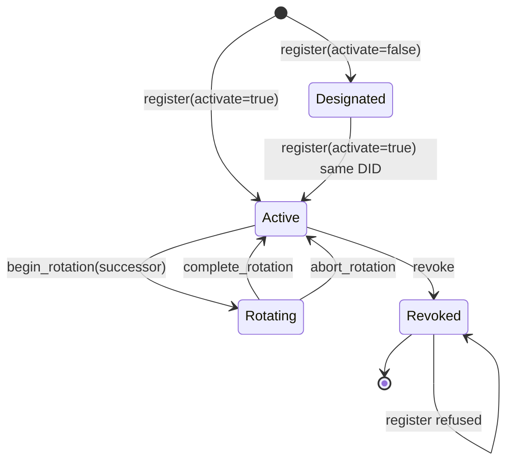

# RFC-0011-x: `WalletStore` — Identity Store Substrate, Registration Write-Path, and the Unlock Split

## Status

Draft (2026-09-30) — RFC-0011-x closes the last genuine open substrate gap in the `octo` identity surface. The parent RFC's `WalletStore` contract is implemented as a zero-sized struct that returns an empty store and an unconditional `NotActive`, so `octo whoami` exits 2 on every host regardless of operator state, and 13 CLI call sites consume that result. This amendment specifies the store's on-disk layout, the registration write-path, lifecycle persistence, and an **unlock split** that separates metadata reads (passphrase-free) from key access (passphrase-gated).

Amends RFC-0011 §Subcommand Taxonomy item 1 and supersedes its `active_identity` placement clause at **both** sites that state it — §Subcommand Taxonomy item 1 itself and the §`octo whoami` Substrate row. Additive at every other site. TWO new `WalletError` variants (`Locked`, `IdentityNotFound`) + ONE new `OctoCliError` variant (slot 92 `WalletLocked`, exit 92). Three new `octo identity` subcommands (`register`, `select`, `list`). Cross-RFC reference updates in RFC-0011, RFC-0011-f, RFC-0102, and RFC-0009. Paired with two new companion mission YAMLs per §Companion mission YAML pairing.

> **Not a layer change.** `octo-wallet` is Layer B (identity substrate, RFC-driven, additive-only). `octo-cli` is Layer C (per-RFC). Layer A is untouched — see §Appendices B.

## Authors

- Author: @mmacedoeu

## Maintainers

- Maintainer: @mmacedoeu

## Summary

RFC-0011 specifies a `WalletStore` in `octo-wallet` (Layer B) that opens an on-disk store, returns the active `IdentityKey`, resolves a record by DID, and enforces 0700 on creation. The shipped struct is `pub struct WalletStore;` — zero-sized — with `open()` returning an empty store and `try_active_identity()` returning `NotActive { current_state: Designated }` unconditionally. The `[ADD]` contract in the parent RFC is therefore satisfied in signature and violated in behaviour, and the guide documents the consequence at **nine places across seven locations**, enumerated by anchor sentence in the companion CLI mission's AC-19.

This amendment is deliberately narrow about what it does **not** build. The encrypted on-disk primitives already exist and are already tested:

| Existing primitive                                                                                                           | Status                                | What this RFC does with it                                  |
| ---------------------------------------------------------------------------------------------------------------------------- | ------------------------------------- | ----------------------------------------------------------- |
| `Vault` — Argon2id + AES-256-GCM, 0700 slots dir, `put` / `get` / `list`                                                     | LANDED, tested                        | Reused unchanged. The identity seed becomes one vault slot. |
| `StarkliCompat` — Argon2id + chacha20-poly1305, `import` / `export`                                                          | LANDED, tested                        | Untouched. Interop format, not the native store.            |
| `IdentityKey` — `generate` / `from_seed` / `activate` / `begin_rotation` / `complete_rotation` / `abort_rotation` / `revoke` | LANDED, tested                        | Reused unchanged.                                           |
| `IdentityRecord`, `IdentityRotationEvent`                                                                                    | LANDED, serde-complete, **no writer** | Become the store's index payload.                           |
| `Did`, `LifecycleState`                                                                                                      | LANDED                                | Reused unchanged.                                           |

What does not exist is a **native identity store**: a DID-indexed record set plus an active-DID pointer, and any code path that writes either. Nothing in the workspace can put an identity into a store, so a read-only store would still resolve nothing and `octo whoami` would still exit 2. The registration write-path is therefore in scope, and it is the part that makes the rest observable.

### The unlock split

The parent RFC's `WalletStore::open()` takes no passphrase parameter, while `active_identity` must return a usable `IdentityKey`. It is tempting to read that pair as forcing a plaintext seed on disk with `0700` as the sole defence. **That reading is wrong, and the parent RFC refutes it in its own text**: §Subcommand Taxonomy item 10 specifies `WalletStore::active_signer() -> Result<Arc<dyn CapabilitySigner>, WalletError>` as the helper the CLI obtains a signer through, describing it as one that "wraps the HSM-backed signer". The substrate agrees — `IdentityKey` holds an `Arc<dyn HsmAdapter>`, `IdentityKey::signer()` hands it out, and an `IdentityKey` whose key never touches disk is already expressible today.

The parent contract therefore does not force a plaintext seed, and this amendment does not claim that it does. The unlock split is a **choice with a cost in both directions**, and the cost belongs in the RFC rather than in a rationale paragraph:

- Keeping the seed on disk means choosing a passphrase, which means every signing command prompts. That is a real availability cost paid on every invocation, and §CLI dispatch carries the whole of it.
- The passphrase buys confidentiality that survives offline disk access and backup leakage — the threat the parent could not address without an HSM.

On a platform whose thesis is private, sovereign intelligence, that trade is the right one. It is a trade and not a forced consequence, and Alt 2 records the alternative this amendment steps back from.

- `WalletStore::open()` keeps its signature and its metadata-only meaning. It reads the record index and the active-DID pointer. Both are public metadata — DIDs, public keys, lifecycle states, timestamps — and neither is secret, so neither needs a passphrase.
- `WalletStore::unlock(passphrase)` is new. It derives the Argon2id key from the passphrase, decrypts the seed slot, constructs an `IdentityKey`, zeroizes the plaintext buffer, and returns an `UnlockedWallet` handle that carries the key.

This means `octo identity show` and `octo identity list` need no passphrase at all, which is the property that keeps the migration tractable: of the 13 existing call sites, only the ones that actually sign must thread an unlock.

## Dependencies

**Requires:**

- RFC-0011 (parent RFC; the `WalletStore` `[ADD]` contract this amendment supersedes in part)
- RFC-0102 (wallet cryptography; supplies the Argon2id + AES-256-GCM storage primitive the seed slot reuses, and the passphrase-handling prohibition)
- RFC-0009 (identity evolution; supplies `LifecycleState` and the rotation state machine the store persists)

**Optional:**

- RFC-0011-f (a mirror row in its §Implicit Assumptions references `octo-wallet::WalletStore`; the cross-reference is updated but no normative text depends on it)
- RFC-0010 (canonical DID form; `Did` is already implemented against it and is unchanged here)

> **Dependency Validation Rules:**
>
> 1. Dependencies MUST form a DAG (no cycles)
> 2. All "Requires" RFCs MUST be listed as mission prerequisites
> 3. Optional dependencies MUST be documented separately from required
> 4. Dependencies on "Planned" RFCs MUST note the assumption they will be Accepted
> 5. A two-cycle MUST be promoted atomically — neither half lands before the other

Verified against this set:

1. **DAG.** No cycle. RFC-0011-x depends on RFC-0011, RFC-0102, and RFC-0009; none of those names RFC-0011-x, and RFC-0011-x amends RFC-0011 without RFC-0011 depending on the amendment. The two missions are ordered substrate-then-CLI, which is a DAG edge in the same direction.
2. **Requires listed as mission prerequisites.** All three — RFC-0011, RFC-0102, RFC-0009 — appear in both missions' §Dependencies, each with the reason it is required and a note that no amendment to it is needed. An earlier revision of this section claimed that compliance while neither mission listed a single one of them, so the claim was true of nothing; the missions now carry the entries, which is the only version of this rule that can be checked by reading a mission. RFC-0011-x's own acceptance is a prerequisite of both.
3. **Optional separated.** RFC-0011-f and RFC-0010 are listed under Optional, and nothing normative depends on either. RFC-0010 in particular is listed because `Did` is already implemented against it, not because this amendment needs a change to it.
4. **No Planned-RFC dependencies.** All five are Accepted, so rule 4 has nothing to apply to. Stating that is the check.
5. **No two-cycle.** There is no amendment here and a counter-amendment waiting on it.

All three required RFCs are Accepted.

## Design Goals

1. **Make the parent contract true.** `open()` reads a real store; `identity_record` resolves a real record; 0700 is enforced on creation rather than documented.
2. **Never write plaintext key material.** The seed is a `Vault` slot, encrypted with the crate's existing Argon2id + AES-256-GCM path. No new cryptography is introduced.
3. **Keep metadata reads passphrase-free.** Only key access is gated. A read-only inspection command must not prompt.
4. **Fail closed on an un-migrated call site.** A call site that still reaches for a key through a locked handle must produce a hard, attributable error — not a silently empty result.
5. **One store, one resolver.** The store resolves its own home rather than reading an ambient value, following the mesh substrate's documented order. The workspace's other resolvers disagree with it and with each other; that disagreement is tabulated in §Home resolution and consolidating them is deferred per §Future Work.

## Motivation

1. **The wall is a stub, not a boundary.** The guide states the wall in **nine claims across seven locations**, enumerated by anchor sentence in the companion CLI mission's AC-19. Two of the nine sit as second sentences in the §4 step 2a caveat block and two more as consecutive sentences in the §18 step 5 block, so counting comment _blocks_ gives five and counting _locations_ gives seven. The other number is the one that is easy to land on by searching: a case-insensitive sweep for `wallet store` returns exactly seven lines, which is 7 lines, 7 locations, and 6 claims at once — and it misses the three claims that describe the wall in terms of `role select` having no identity. Every one of the nine describes a deliberate design decision. None of them is true: the store is zero-sized and the crypto it would need is already shipped and tested. The honest description is that a wiring layer was never written.
2. **A read-only store fixes nothing an operator can see.** `WalletStore` has no writer anywhere in the workspace. Adding a reader without a writer produces a store that is always empty, so `octo whoami` keeps exiting 2 and all nine guide statements stay true. The write-path is the minimum slice that changes observable behaviour.
3. **The current shape invites a plaintext seed.** An `open()` that takes no passphrase but must return a key has a plaintext seed as its most obvious answer, and shipping it would put the only unencrypted key material in a crate that Argon2ids everything else. The parent RFC did not mandate that answer — its item 10 routes through an HSM-backed signer — but the HSM path has no implementation, so the obvious answer is the one that would get built. This amendment takes the third option instead.
4. **Identity state is lost on every invocation.** `IdentityKey` is constructed per process and discarded. Rotation history exists as a type with no writer, so `IdentityRecord::rotation_history` is permanently empty and `octo identity show` cannot report a rotation chain it can see in memory but not on disk.

## Roles and Authorities

| Role                      | Authority                                                                                                                                                                                                      |
| ------------------------- | -------------------------------------------------------------------------------------------------------------------------------------------------------------------------------------------------------------- |
| RFC-0011 authors          | May amend the `[ADD]` contract in §Subcommand Taxonomy item 1. RFC-0011-x exercises that authority for the `active_identity` placement clause only, at both sites that state it.                               |
| RFC-0102 authors          | Own the storage cryptography. RFC-0011-x selects no new primitive and changes no parameter, so no RFC-0102 amendment is required; the cross-reference update in §Cross-RFC reference updates is informational. |
| RFC-0009 authors          | Own the lifecycle state machine. RFC-0011-x persists transitions the state machine already defines and invents none.                                                                                           |
| Mission `0102-a` claimant | Retains authority over the wallet foundation mission. RFC-0011-x narrows that mission's scope; see §Companion mission YAML pairing.                                                                            |

### Out-of-scope roles

| Not addressed here                                    | Transferred to                                                                      |
| ----------------------------------------------------- | ----------------------------------------------------------------------------------- |
| Custody of the passphrase itself                      | The operator. Nothing in this store generates, stores, or recovers it.              |
| HSM provisioning and key ceremony                     | A follow-on mission per §Future Work; the branch point is named in §Detailed Design |
| Physical custody of the seed file before registration | The operator, per the guide's existing `--seed-out` onboarding step                 |
| Node membership, reputation, and governance           | Unchanged. The store holds an identity record, nothing about admission              |

The passphrase role is the one that matters, and stating it is what makes the design auditable. A store that implied key custody would be a different design with a different threat model; this one explicitly does not, and the operator holding the passphrase is a precondition rather than a bug.

### Role/Authority Coverage Table

| Role                    | Identifier                    | Authority Scope | Lifecycle                                                               | Source/Ref                               |
| ----------------------- | ----------------------------- | --------------- | ----------------------------------------------------------------------- | ---------------------------------------- |
| Operator (human)        | OS uid owning `$OCTO_HOME`    | admin           | Stateless — grants no in-store state; the passphrase is the credential  | §Security Considerations 1-4             |
| Store                   | `WalletStore`                 | read / write    | `Locked` → `Unlocked` per call, never persisted as a store state        | §`WalletStore` — locked handle           |
| Unlocked handle         | `UnlockedWallet<'a>`          | write           | Borrow-scoped over `&'a mut WalletStore`; exclusive while alive         | §`unlock` — the key path                 |
| Registered identity     | `Did` + `IdentityKey`         | write (own key) | `Designated` → `Active` → `Rotating` → `Active` → `Revoked`, terminal   | §Lifecycle Requirements                  |
| Active identity pointer | `WalletIndex::active_did`     | read / write    | `None` → `Some(did)`; mutable without a key, since it is an index field | §Detailed Design — `WalletStore::select` |
| CLI caller              | `octo` dispatcher             | none            | Stateless — one-shot process, no daemon, no listening socket            | §CLI dispatch                            |
| Same-user process       | Any uid equal to the operator | write           | Out of scope by threat model, not by omission — see §A1 and §A2         | §Adversary Analysis A1, A2               |

Two rows deserve a note rather than a checkbox. The **operator** is stateless in the store's own state machine because the store never persists who unlocked it — that is deliberate, and it is why `store.json` needs authentication against a _writer_ but not against a reader. The **same-user process** is listed as a role precisely because it is the adversary this design does not defend against, and naming it is what stops that from being an implicit assumption.

## Detailed Design

### Store layout

Root resolves per §Home resolution and is created with mode 0700 on first write.

```text
$OCTO_HOME/wallet/            0700  dir
  store.json                  0600  public metadata: version, active_did, records[]
  seed/                       0700  dir  (Vault slots_dir)
    <did-slug>.vault          0600  Argon2id + AES-256-GCM, holds the 32-byte seed
```

`store.json` holds `WalletIndex`:

```rust
// crates/octo-wallet/src/identity_store.rs (NEW module)
#[derive(Clone, Debug, Serialize, Deserialize, PartialEq)]
pub struct WalletIndex {
    /// Schema version. Currently 1. A reader MUST reject an unknown version.
    pub version: u32,
    /// The active identity, or `None` when the store holds records but none is selected.
    pub active_did: Option<Did>,
    /// Records sorted ascending by `did` so `store.json` is byte-stable for a given store state.
    pub records: Vec<IdentityRecord>,
}
```

Records are sorted by DID on write. The alternative — insertion order — makes `store.json` a function of write history rather than of store state, which breaks byte-stability for a file the operator may version-control or diff.

`store.json` is deliberately **not** encrypted. It contains no secret: a DID is a public key, a public key is public by construction, and lifecycle state and timestamps are operator metadata. Encrypting it would buy nothing and would force a passphrase onto read-only inspection commands, defeating Design Goal 3.

### Home resolution

Resolution order, matching the CLI's own single-source-of-truth resolver in `octo-cli/src/home.rs`:

1. `$OCTO_HOME` if set **and non-empty**.
2. An **empty** `$OCTO_HOME` is a **hard error**, not a fall-through. `octo-cli/src/home.rs` fails closed here and returns `OctoCliError::NoOctoHome` (exit 27), deliberately: an earlier revision of that module fell back to `/tmp/.octo` when neither variable was set, which is a world-writable directory on a shared host. The store follows the fail-closed rule. An earlier revision of this paragraph also claimed `home.rs` rejects a **whitespace-only** value; it does not — its test is `p.is_empty()`. The store matches the named resolver rather than a stricter rule invented for it, because the point of citing a resolver is to match it. `octo-mesh` does fall through on empty, and that disagreement is recorded in §Future Work.
3. `$HOME/.octo` via the platform home directory, when `OCTO_HOME` is unset entirely.
4. Otherwise `WalletError::Config`, which the CLI maps to the **existing** `OctoCliError::NoOctoHome` at exit 27. No new slot is spent.

The store root is `$OCTO_HOME/wallet`. The parent RFC's `WalletStore::open()` clause also names `~/.config/octo/wallet` as an alternative, and this amendment overrides it. The override is a real normative change to an Accepted RFC, so the reason is stated rather than implied.

The workspace does not have one settled answer. It has four, and they disagree:

| Resolver                                                             | Path                                                                  | On empty `OCTO_HOME` |
| -------------------------------------------------------------------- | --------------------------------------------------------------------- | -------------------- |
| `octo-cli` (`home.rs`) — the CLI's own single source of truth        | `$OCTO_HOME`, else `$HOME/.octo`                                      | **fails closed**     |
| `octo-mesh` (private `resolve_octo_home`)                            | `$OCTO_HOME`, else `$HOME/.octo`                                      | falls through        |
| `octo-audit` (receipt reader)                                        | `$OCTO_HOME/audit/receipts`, else `$HOME/.config/octo/audit/receipts` | **honours it first** |
| `octo-wallet` (`Vault::default_dir`, via `directories::ProjectDirs`) | `~/.config/cipherocto/vault`                                          | n/a — ignores it     |

`octo-audit` is the row that was wrong twice. It was listed as ignoring `OCTO_HOME` and giving `$HOME/.config/octo/audit/receipts` unconditionally; its receipt reader actually checks `OCTO_HOME` **first** and joins `audit/receipts` onto it, with the `.config` path as the fallback only. That makes it the one resolver in the workspace that already prefers `OCTO_HOME` over the XDG path — which is the same preference this amendment takes, and is worth recording as a point of agreement rather than leaving the row as a fourth disagreement.

The parent RFC's `~/.config/octo/wallet` matches the audit resolver and neither of the others. This amendment takes the **CLI's** order rather than the mesh's, because `home.rs` is the one the `octo` binary already routes every command through, and a store that resolved differently from the command invoking it would produce two roots inside a single process. That is a judgement, not a derivation, and the alternative was not left implicit.

`octo-wallet` is not starting from nothing: it already depends on `directories` and `Vault::default_dir()` uses `ProjectDirs` to find `~/.config/cipherocto/vault`. Two resolvers in one crate is a parallel-abstraction hazard, and this amendment does not pretend otherwise — the justification for adding a second is that `ProjectDirs` cannot express `$OCTO_HOME`, which is a CLI-level override with no XDG equivalent. Consolidation is deferred per §Future Work.

`dirs` is therefore the single new dependency, declared with a rationale comment per the repository convention. `zeroize` is **not** new — it is already declared and already used by `Vault` and `IdentityKey`.

### `WalletStore` — locked handle

```rust
pub struct WalletStore {
    root: PathBuf,
    index: WalletIndex,
    vault: Vault,
}

impl WalletStore {
    /// Parent-RFC signature, UNCHANGED. Metadata only; never decrypts.
    pub fn open() -> Result<Self, WalletError>;

    /// Test seam. `WalletStore::open()` reads the ambient home; this takes it explicitly.
    pub fn open_at(root: impl Into<PathBuf>) -> Result<Self, WalletError>;

    /// Metadata. No passphrase.
    pub fn active_did(&self) -> Option<&Did>;

    /// Metadata. No passphrase. Sorted ascending by DID.
    pub fn list_records(&self) -> &[IdentityRecord];

    /// Metadata. No passphrase. `WalletError::IdentityNotFound` on miss.
    pub fn identity_record(&self, did: &Did) -> Result<IdentityRecord, WalletError>;

    /// Whether the active identity has a seed slot on disk.
    pub fn active_seed_slot_present(&self) -> bool;

    /// Reload `store.json` from disk, discarding the cached index.
    pub fn reload(&mut self) -> Result<(), WalletError>;

    /// BOOTSTRAP WRITE PATH. Creates a record and seals its seed slot.
    ///
    /// Takes `&mut self` because it appends to the index and writes the slot.
    /// Does **not** require an existing active identity — this is the only
    /// way a store can ever acquire its first record, so requiring one here
    /// would make the store unpopulatable. See §The bootstrap path.
    ///
    /// Returns `WalletError::AlreadyRevoked` when `key.did()` names a record
    /// already in the `Revoked` terminal state. See A14.
    pub fn register(
        &mut self,
        key: IdentityKey,
        passphrase: &str,
        activate: bool,
        now_unix: i64,
    ) -> Result<Did, WalletError>;

    /// Move the active pointer. `&mut self`, **no passphrase** — it reads and
    /// writes one index field and no key material.
    ///
    /// Returns `WalletError::NotActive { current_state: Revoked }` when
    /// `did` names a revoked record. See M7/A17.
    pub fn select(&mut self, did: &Did) -> Result<(), WalletError>;
}
```

`WalletStore` has **no** `active_identity` method. The migration sentinel is the
free function `octo_wallet::active_identity(&WalletStore)`, and the method-shaped
stub is `try_active_identity`. See §Migration sentinel — a later revision of this
block declared an `active_identity` method that the same section denies, which
made the symbol ambiguous at exactly the point the section exists to disambiguate.

`open()` on a root that does not exist yields an **empty index**, not an error. A store with no records is a valid state and maps to the no-active-identity case the guide already documents, so failing to open would be a second failure mode with the same operator meaning. The 0700 directory is created on first **write**, not on open, so a read-only command against a non-existent store does not leave a directory behind.

### `unlock` — the key path

```rust
pub struct UnlockedWallet<'a> {
    // `&'a mut`, not `&'a`. `register`, `begin_rotation`, `complete_rotation`,
    // `abort_rotation`, and `revoke` each append to or rewrite the index AND
    // mutate the key, so a shared reference cannot express any of them without
    // interior mutability. A type that carries a plain `&'a WalletStore` and
    // offers `revoke(&self)` describes a program that does not compile.
    store: &'a mut WalletStore,
    key: IdentityKey,
}

impl WalletStore {
    /// Decrypt the active identity's seed slot and return a key-bearing handle.
    pub fn unlock<'a>(
        &'a mut self,
        passphrase: &str,
        seed_out: &'a mut Vec<u8>,
    ) -> Result<UnlockedWallet<'a>, WalletError>;
}

impl<'a> UnlockedWallet<'a> {
    pub fn active_identity(&self) -> Result<IdentityKey, WalletError>;
    pub fn identity_record(&self, did: &Did) -> Result<IdentityRecord, WalletError>;

    pub fn begin_rotation(
        &mut self,
        successor: IdentityKey,
        now_unix: u64,
    ) -> Result<[u8; 64], WalletError>;

    pub fn complete_rotation(&mut self, now_unix: u64) -> Result<(), WalletError>;
    pub fn abort_rotation(&mut self) -> Result<(), WalletError>;
    pub fn revoke(&mut self, now_unix: u64) -> Result<(), WalletError>;
}
```

`select` and `register` sit on `WalletStore`, not on the unlocked handle, and for
different reasons that are worth keeping apart. `select` is a pure index write: it
moves a pointer in `store.json` and reads no key material, so putting it on the
handle would force a passphrase onto a command that signs nothing. `register` writes
a seed slot and so needs a passphrase — but it needs one to **seal** new material, not
to **unlock** an existing identity, and it has no identity to unlock. Both are index
writers, and neither reads the active key.

`unlock` follows the existing `Vault::get` shape, which takes an explicit output buffer
and returns a borrowing `DecryptedHandle` over it. The caller owns `seed_out`; that is
what makes the zeroization obligation enforceable at a single site rather than smeared
across callers.

The sequence inside `unlock`:

1. `active_did()` — `None` yields `WalletError::NotActive { current_state: Designated }`.
2. Slot slug derived from the DID. Slot not present on disk yields `WalletError::VaultSlotNotFound`; wrong passphrase yields `WalletError::VaultDecryptionFailed`. Both variants already exist.
3. `IdentityKey::from_seed` copies the 32 bytes into the key. **`from_seed` hard-codes `LifecycleState::Designated`** — verified in `crates/octo-wallet/src/identity.rs` — so step 3 alone produces a key that is `Designated` regardless of what the record says.
4. **Reconcile the derived DID against the index.** A slot whose content does not match the record's `pubkey_bytes` for the active DID yields `WalletError::Config`. This is the A3 check, and it is a numbered step rather than a note because §Adversary Analysis A3 and `tv_x_19` both depend on it having a position in the sequence.
5. **The lifecycle is rehydrated from the record, not inherited from step 3.** A new `pub(crate) IdentityKey::from_seed_with_lifecycle(seed, lifecycle, activated_at, revoked_at)` restores the recorded state, and it is `pub(crate)` because the only legitimate caller is this line. It is deliberately not a public setter: a public lifecycle setter would let any caller promote or demote an identity outside the state machine, and RFC-0009 owns those transitions.
6. **A non-signing record is refused, not repaired.** If the rehydrated `lifecycle().can_sign()` is false, `unlock` returns `WalletError::NotActive { current_state: <recorded state> }`. It does not substitute `Active`, and it does not return a handle that cannot sign.
7. `seed_out` is zeroized before `unlock` returns, on **every** path including the error paths. A plaintext seed must not outlive the call regardless of outcome.

Steps 5 and 6 are the whole reason they are written down. An earlier revision of this
section stopped at step 3, which meant that after `octo identity revoke` wrote a
terminal record, the next `unlock` read the seed slot, `from_seed` returned
`Designated`, and the terminal state was gone — **on the ordinary path, with no
adversary involved at all**. Because `can_sign()` admits only `Active` and `Rotating`,
the resurrected key could not sign either, so the visible symptom was every signing
command exiting 2 with `NotActive { current_state: Designated }`: the exact wall this
amendment exists to remove. A4 covers an attacker restoring an old index; this was
resurrection with the attacker set to nobody. See A13.

`seed_out` being a caller-owned buffer is the reason `unlock` cannot return the handle directly: an owned `Vec<u8>` behind a self-referential `DecryptedHandle<'a>` is not expressible without unsafe, and this crate has no business introducing that for a convenience.

### The bootstrap path

`register` is on `WalletStore` and takes `&mut self`, and that placement is load-bearing
rather than stylistic. An earlier revision put `register` on `UnlockedWallet`, which
made the store **unpopulatable**: `UnlockedWallet` is constructible only from `unlock`,
`unlock` requires an `active_did`, and an empty store has none — so there was no handle,
therefore no `register`, therefore no first identity, therefore no handle. The cycle
closes on itself. Eight `register` test vectors were specified against it and none of
them could have run.

The same defect quietly disarmed the adversary analysis. A2's threat is switching to a
_different, legitimately registered_ identity, and A4's is resurrecting a `Revoked`
record. Both presuppose a store holding more than zero records, so under the earlier
placement §Adversary Analysis A2 through A4 described a state the design could not
reach, and the 5-question table's residual-risk conclusion was measured against nothing.

The break is that `register` needs a passphrase to **seal** a slot and never needs to
**unlock** one. Those are different operations that happen to share a parameter, and
conflating them is what produced the deadlock. The same argument puts `select` on
`WalletStore`: both are index writers, neither reads the active key.

`register` seals the slot from `IdentityKey::seed_bytes_for_hkdf()`, which is the
crate's existing accessor for the raw seed and is available on `InMemorySigner`-backed
keys. A hardware-backed key has no raw seed to seal, so `register` returns
`WalletError::Hsm` for one — stated rather than left to be discovered, because
"register your hardware key" is a request this store cannot satisfy.

### Re-registration and revocation

`register` refuses a DID whose record is already in the `Revoked` terminal state,
returning `WalletError::AlreadyRevoked` — an existing variant the state machine already
returns. Without this, revocation is advisory rather than terminal: the seed slot is
retained per A11, so an operator holding the passphrase could call `register` on a
fresh store with a revoked seed, receive a `Designated` record, activate it, and sign
as a key the identity system believes it burned. The refusal costs nothing — the record
is retained and `octo identity show` still explains it — and it is what makes
"Revocation is terminal" (§Lifecycle Requirements) true rather than aspirational. See
A14.

`tv_x_9` already requires re-registration of a non-revoked DID to be idempotent. The
revoked case is the exception to idempotence, not a contradiction of it: one record, one
slot slug, and the record keeps its terminal state.

Every one of those outcomes is a named `WalletError` variant, and every one of them needs a **named** translation arm in the CLI. A `unlock` call site that matches `Err(_) => OctoCliError::Internal(..)` is the failure mode this paragraph exists to prevent: a wrong passphrase would surface as a generic internal error, the operator would see a bug report rather than "try again", and the guide's exit-code table — which distinguishes 2 from 92 for exactly this reason — would be describing a code path the code does not have. The arms are `NotActive` → exit 2, `VaultSlotNotFound` and `VaultDecryptionFailed` → exit 92, and `Config` → exit 27. A catch-all arm may follow them, but it may not replace them.

Two of those arms are not interchangeable, and collapsing them is the mistake the list exists to prevent. `NotActive` means the store is fine and the _state_ forbids signing — a revoked identity, or a record that was registered without `--activate`. It is exit 2, and the operator's remedy is a different command, not a different passphrase. `VaultDecryptionFailed` means the passphrase is wrong. `VaultSlotNotFound` means there is no slot at all: a truncated ciphertext, a flipped byte, a partially restored file, and a typo are one indistinguishable outcome, because AES-GCM authentication failure is authentication failure. That is a real usability gap rather than a defect — the store genuinely cannot tell them apart without an authenticity tag covering the whole slot — and it is recorded in §Future Work with the recovery guidance that belongs alongside it. A _deleted_ slot additionally reports "the wallet store is locked, unlock with a passphrase to continue", which invites a retry loop against a store that is unrecoverable. The honest fix is a distinct `WalletError` variant plus operator-facing guidance, not a message change, and it is not bundled into a wiring change.

`activate` is a parameter of `register` rather than a separate call so that a record can never be written in `Active` state without an explicit `IdentityKey::activate` transition having occurred. Registering without the flag stores `Designated` and clears the active pointer; registering with it stores `Active` and sets the active pointer.

### Migration sentinel

Three distinct symbols are in play, and conflating them is what made the first draft of this section unsound. `WalletStore` has three methods: `open`, `try_active_identity`, and `lookup_identity_record`. It has **no** `active_identity` method. The free function `octo_wallet::active_identity(&WalletStore)`, implemented in `cli_fns`, is what all 15 CLI call sites invoke, so a deprecation on the method would produce zero build warnings and zero migration pressure.

An earlier revision of this paragraph went further and claimed that the parent RFC's §Subcommand Taxonomy item 1 specifies the **free function** form. It does not, and the citation has to be exact because the whole placement argument rests on it. RFC-0011 states `active_identity` in **two different forms at two sites**:

| RFC-0011 site                | Form as written                                                                                                               |
| ---------------------------- | ----------------------------------------------------------------------------------------------------------------------------- |
| §Subcommand Taxonomy item 1  | `active_identity(&self) -> Result<IdentityKey, WalletError>` — a **method**                                                   |
| §`octo whoami` Substrate row | `[ADD] octo_wallet::active_identity(&WalletStore) -> Result<IdentityKey, WalletError>` — a **free function** taking the store |

The parent is internally inconsistent about its own symbol, and this amendment supersedes both sites. The conclusion is unchanged and does not depend on which site is cited: the deprecation belongs on the free function because the **measured call sites** call the free function, and 15 is a count of what the code does rather than of what a clause says. The reason for stating the two forms separately is that an earlier revision attributed the free function to item 1, which would have left a reviewer checking item 1, finding a method, and concluding the argument was fabricated.

The sentinel is therefore two changes, and the deprecation belongs on the free function:

- `cli_fns::active_identity` is **retained with its parent-RFC signature and always returns `Err(WalletError::Locked)`**, marked `#[deprecated(note = "...")]`. This is the symbol every call site uses, so `#[deprecated]` is what actually reaches the 15 sites.
- `WalletStore::try_active_identity` is changed from returning an unconditional `NotActive` to returning `Err(WalletError::Locked)`. No deprecation attribute: it is not what callers use, and marking it would be theatre.

Why keep a failing function at all. Deleting it outright is the cleaner end state, but it converts a silent stub into 15 independent compile errors across five CLI modules, and a partial migration would leave the store half-wired in a way no test enumerates. Retaining it as a deprecated always-failing function turns each un-migrated site into a **warning at build time** — a real, attributable signal, because the deprecation is on the symbol the sites actually call — and a hard, attributable error at run time.

The 15 is the count of _direct_ call sites and it is not the count of sites that need migrating. Three further sites reach the key through `common::resolve_active_identity_key()`, a helper that opens the store and then calls the sentinel itself, so the deprecation warning fires once inside that definition rather than three times at its callers. **18 sites reach the key; 15 warnings fire.** A migration that treats the warning count as the work list leaves three sites on the old path with every warning accounted for, which is why the companion CLI mission specifies its sweep against the 18 and not the 15.

`WalletStore::lookup_identity_record` is the substrate's third method and the parent RFC does not mention it. It is a metadata reader, needs no unlock, and is **not** part of the sentinel; it is **retained unchanged** and its call site is swept separately. That call site is exactly one — `cli_fns::identity_record` in `crates/octo-wallet/src/cli_fns.rs`, a **Layer B** file — and the sweep belongs to the substrate mission, not the CLI one, because zero `octo-cli` call sites name it and the CLI reaches it only transitively. An earlier revision of the companion CLI mission's AC-2 required the sweep and simultaneously required the method's deletion, which contradicted this section and left the single real call site unassigned. Corrected in both places.

Note that the RFC's own `WalletIndex` API block below renames the concept to `identity_record`. The rename is of the **CLI-facing** reader, not of `WalletStore::lookup_identity_record`, which stays. Two similarly named methods on two different types is a naming collision rather than a rename, and conflating them is what produced the contradiction.

The end state still deletes `cli_fns::active_identity` and `try_active_identity`. They exist only for the migration window, and the companion mission carries a removal acceptance criterion so they cannot survive it.

### Error variants (Layer B)

Two new `WalletError` variants in `crates/octo-wallet/src/error.rs`:

```rust
/// The store is locked. `WalletStore::open` is metadata-only; the identity
/// seed requires `WalletStore::unlock(passphrase)`.
#[error("wallet store is locked; unlock with a passphrase to access the identity key")]
Locked,

/// No record for this DID in the store index.
#[error("no identity record for {0}")]
IdentityNotFound(Did),
```

`Locked` is not reachable from `WalletStore::unlock`, which is the operation that produces an unlocked handle. It is reachable from `WalletStore::active_identity` (the sentinel) and from any `cli_fns` wrapper still forwarding a locked handle.

Reused rather than added: `VaultDecryptionFailed` for a bad passphrase, `VaultSlotNotFound` for a missing slot, `NotActive { current_state }` for a store with no active identity, `AlreadyRevoked`, `RotationInProgress`, `NotRotating`, `SelfRotation`, `GracePeriodNotElapsed` — all of which the existing `IdentityKey` state machine already returns and all of which now propagate to disk instead of dying with the process.

### Error variant (Layer C)

ONE new `OctoCliError` variant, **slot 92**, the first slot above the 91 high-water mark:

```rust
/// The wallet store is locked and the operation needs the identity key.
#[error("wallet store is locked: unlock with a passphrase to continue")]
WalletLocked,
```

`WalletError::Locked` maps to it (exit 92). `WalletError::IdentityNotFound` maps to the **existing** `OctoCliError::IdentityNotFound(String)` at exit 4, which the parent RFC's `octo identity show` exit table already specifies — no new slot is spent on it. The two names collide by coincidence, not by design: the substrate and CLI variants are unrelated types, and this is the one place the amendment maps one to the other.

Slot 92 is not free by accident. RFC-0011-h §Substrate-Additions G3 reserves slots 92 through 99 for amendments beyond `-h`, and RFC-0011-w's §Future Work and appendix restate the reservation as 8 reserved slot positions — an earlier revision cited an RFC-0011-w `## Exit Codes` section, which does not exist; that RFC's `##` set runs Status through Appendices. Slot 91 is the high-water mark, occupied by `NetworkKeyRotationUnknownId`. This is the first amendment past `-h` to spend one, and it takes the lowest of the reserved band.

### CLI dispatch

`IdentityAction` gains three variants. The existing `Show`, `Rotate`, and `Revoke` keep their shapes and gain an unlock.

| Subcommand                                                                    | Substrate                         | Passphrase                     | Exit codes                |
| ----------------------------------------------------------------------------- | --------------------------------- | ------------------------------ | ------------------------- |
| `octo identity register --seed-file <path> [--activate] [--passphrase-stdin]` | `WalletStore::register`           | **seal** — encrypts a new slot | 0, 2, 6, 92, 64           |
| `octo identity select <did>`                                                  | `WalletStore::select`             | none                           | 0, 2, 4, 64               |
| `octo identity list [--json]`                                                 | `WalletStore::list_records`       | none                           | 0, 64                     |
| `octo whoami` (existing)                                                      | `UnlockedWallet::active_identity` | **unlock**                     | 0, 2, 92, 64              |
| `octo identity show [<did>]` (existing)                                       | `WalletStore::identity_record`    | none                           | 0, 4, 64                  |
| `octo identity rotate` (existing)                                             | `UnlockedWallet::begin_rotation`  | **unlock**                     | 0, 2, 3, 4, 5, 11, 92, 64 |
| `octo identity revoke --reason <text>` (existing)                             | `UnlockedWallet::revoke`          | **unlock**                     | 0, 2, 4, 6, 92, 64        |

The `Passphrase` column distinguishes **unlock** — decrypt an existing slot to reach
the active key — from **seal** — encrypt a brand-new slot. `register` needs a
passphrase and does not unlock anything: it has no active identity to unlock, which is
precisely why it lives on `WalletStore` rather than on the handle (§The bootstrap
path). Collapsing the two words is what produced the bootstrap deadlock.

Three rows changed shape against an earlier revision of this table, each because the
table and the substrate disagreed and the substrate wins. `octo identity show` takes
an **optional** `<did>` — the substrate field is `Show { did: Option<String> }` and
clap renders `[DID]` — and a table showing it as required would ship an invocation that
cannot parse. `octo identity revoke` takes a **required** `--reason <text>`, so a row
showing it with no argument at all would ship an invocation that cannot parse. And
`register` carries exit 92 because every other passphrase-taking row does; a
passphrase-taking command that cannot report a locked store is an exit-code table with
a hole in it. `select` carries exit 2 because it rejects a `Revoked` record
(A17), and `revoke` carries 6 because `WalletError::AlreadyRevoked` is what the
existing `IdentityKey` state machine returns on a second revocation.

`register` takes a seed **file** rather than generating in-process. The guide's existing onboarding step already writes a 0600 seed file via `octo-wallet init --seed-out`, and composing with that step means the guide gains one command rather than a rewritten section. Generating in-process is available by passing the freshly generated seed through the same path.

`--passphrase-stdin` reads the passphrase from standard input for non-interactive contexts. When neither the flag nor an interactive terminal is available, the unlock fails with `WalletLocked` (exit 92) rather than hanging. A CLI that blocks forever on a hidden prompt in a cron job is a denial of service against the operator's own automation.

Passphrase acquisition follows the existing `octo-wallet` binary pattern: `rpassword` for the prompt, and never a command-line flag. A passphrase on `argv` is visible in the process table to every local user.

Two properties of the acquisition path that the flag's existence does not by itself guarantee:

- **The prompt is gated on a real terminal, not on "stdin is not a flag".** `rpassword` requires a tty to disable echo. On a pipe it either errors or reads with echo left on. The gate is therefore an explicit `isatty` check, and its absence is the difference between a prompt that hides the passphrase and one that prints it into a CI log. `octo-wallet`'s existing `init` path is the precedent.
- **`--passphrase-stdin` is warned about when it looks misused.** Piping a passphrase is the correct use; a passphrase supplied some _other_ way — an environment variable, a file argument — is a habit worth breaking while the operator is still learning the command. A one-line stderr warning costs nothing and never blocks. It is not an error, and it must not be: a CI system that legitimately uses the flag should not be made to fail by a warning about itself.

### Cross-RFC reference updates

| RFC                                    | Location                                                                                                                                    | Change                                                                                                                                                                                                                                                                                                                                                                                                                                                                                                                                                                                                          |
| -------------------------------------- | ------------------------------------------------------------------------------------------------------------------------------------------- | --------------------------------------------------------------------------------------------------------------------------------------------------------------------------------------------------------------------------------------------------------------------------------------------------------------------------------------------------------------------------------------------------------------------------------------------------------------------------------------------------------------------------------------------------------------------------------------------------------------- |
| RFC-0011                               | §Subcommand Taxonomy item 1                                                                                                                 | `active_identity` moves from `WalletStore` to `UnlockedWallet`; add `unlock`, `UnlockedWallet`, `WalletIndex`, `open_at`, `active_did`, `list_records`, `reload`. Record the supersession.                                                                                                                                                                                                                                                                                                                                                                                                                      |
| RFC-0011                               | §Subcommand Taxonomy item 10                                                                                                                | **No change, and the omission is the point.** Item 10 already specifies `WalletStore::active_signer() -> Result<Arc<dyn CapabilitySigner>, WalletError>` as the helper the CLI obtains a signer through, describing it as one that "wraps the HSM-backed signer". That is a real API and it is not superseded. Listing it in the amendment's `[ADD]` enumeration would claim a change to a clause this amendment does not touch — and the temptation to re-list it is exactly what produced the false claim in §The unlock split, which held that the parent's contract admitted only a plaintext-seed reading. |
| RFC-0011                               | §Subcommand Taxonomy item 1, 0700 clause                                                                                                    | Mark satisfied — enforcement moves from documented to actual.                                                                                                                                                                                                                                                                                                                                                                                                                                                                                                                                                   |
| RFC-0011                               | §`octo whoami` Substrate row                                                                                                                | Substrate cell rewritten to `[ADD] octo_wallet::UnlockedWallet::active_identity`. The exit table is unchanged — 0, 2, 64 plus the new 92.                                                                                                                                                                                                                                                                                                                                                                                                                                                                       |
| RFC-0011                               | §Subcommand Taxonomy item 1, `WalletStore::open()` location clause                                                                          | **Normative override.** The clause names `$OCTO_HOME/wallet` **or `~/.config/octo/wallet`**. This amendment resolves the alternative to `$HOME/.octo` per §Home resolution, and records that the parent named a path no substrate resolver uses.                                                                                                                                                                                                                                                                                                                                                                |
| RFC-0011                               | §Error Handling, §Exit Codes                                                                                                                | Slot 92 `WalletLocked`, exit 92.                                                                                                                                                                                                                                                                                                                                                                                                                                                                                                                                                                                |
| RFC-0011                               | §Implicit Assumptions Audit, "Local file permissions on config dir are 0700"                                                                | Row closes.                                                                                                                                                                                                                                                                                                                                                                                                                                                                                                                                                                                                     |
| RFC-0011-f                             | §Implicit Assumptions Audit mirror row                                                                                                      | **No change to the type name.** The row reads "Substrate `octo-mesh` enforces 0700 on creation (mirror of `octo-wallet::WalletStore` per RFC-0011 §Implicit Assumptions row)" — a 0700-permissions mirror, and 0700 enforcement stays on `WalletStore` (§Security Considerations 3), not on `UnlockedWallet`. An earlier revision of this table prescribed renaming the reference to `UnlockedWallet`, which would have pointed an Accepted RFC at the wrong type for a property the wrong type does not have.                                                                                                  |
| RFC-0102                               | §Key Storage                                                                                                                                | Informational cross-reference: the identity seed is a `Vault` slot under the primitive this section already specifies. No normative change.                                                                                                                                                                                                                                                                                                                                                                                                                                                                     |
| RFC-0009                               | §Lifecycle Requirements and §Identity Lifecycle State Machine                                                                               | Informational cross-reference: transitions are persisted by this store. No normative change. An earlier revision cited "§Specification lifecycle subsections", a heading that does not exist in RFC-0009; its `##` set is `## Proposed Specification`, `## Lifecycle Requirements`, and its appendices.                                                                                                                                                                                                                                                                                                         |
| `docs/06-operations/operator-guide.md` | The nine wall claims in §4 step 2a (two), the §17 exit-2 troubleshooting entry, §18 steps 5 (two) and 8, §22 steps 3 and 14, and §31 step 1 | **Seven locations, nine claims** — §4 step 2a and §18 step 5 each carry a second wall sentence inside the same caveat block. The enumeration lives in the companion CLI mission's AC-19 and is keyed on anchor sentences, not line numbers: an earlier revision carried its own copy of the line numbers, four of which had already drifted, and a keyword sweep of its own found only five of the nine because three never name the store.                                                                                                                                                                     |

RFC-0102 and RFC-0009 receive cross-references only. The store introduces no new cryptographic primitive, no new parameter, and no new lifecycle transition, so neither RFC's normative text needs to move.

## Lifecycle Requirements

| Transition              | Trigger                                     | Persisted effect                                                   | On-disk state after                                        |
| ----------------------- | ------------------------------------------- | ------------------------------------------------------------------ | ---------------------------------------------------------- |
| none → `Designated`     | `register(activate = false)`                | Record appended; `active_did` untouched                            | Record present, no active                                  |
| none → `Active`         | `register(activate = true)`                 | Record appended; `active_did` set                                  | Record present and active                                  |
| `Designated` → `Active` | `register(activate = true)` on the same DID | Existing record's lifecycle updated in place; slot slug unchanged  | One record, now active                                     |
| `Active` → `Rotating`   | `begin_rotation`                            | Record gains an `IdentityRotationEvent`; successor record appended | Both records present; old is `Rotating`                    |
| `Rotating` → `Active`   | `complete_rotation`                         | Successor activated and pointed at; old record marked deprecated   | Successor active; old restored to `Active`, deprecated     |
| `Rotating` → `Active`   | `abort_rotation`                            | Pending event dropped from the old record                          | Old restored to `Active`; **no successor record appended** |
| `Active` → `Revoked`    | `revoke`                                    | Record lifecycle set terminal                                      | Record present, `Revoked`                                  |
| `Revoked` → `Revoked`   | `register` on a revoked DID                 | **Nothing written**                                                | Unchanged; `AlreadyRevoked`                                |

A `Rotating` identity is persisted as `Rotating`, not as `Active` with a pending event. The state machine is already in the `IdentityKey`; the store's obligation is to record the state it reports rather than to re-derive it.

Two cells in an earlier revision of this table contradicted the section's own rule and its own signing-requirement column, and the table is the normative artifact the substrate mission implements against, so the contradiction would have been implemented. The `abort_rotation` cell read "**Successor active**, old restored" — which makes the one transition whose entire purpose is that nothing was committed promote an unverified successor. The `complete_rotation` cell read "Successor active, old **still `Rotating`**", which contradicts the same section's statement that the store records the state the machine reports, and contradicts the state diagram, which returns the predecessor to `Active`. Both cells now say what the prose has always said. The generalisable lesson is recorded in §Version History: a normative table and the prose it summarises drift apart, and whichever one an implementer reads is the one that gets built.

`Designated` → `Active` is reached by re-registering the same DID with `activate = true`. It needs no new command: `tv_x_9` already requires a re-registered DID to reuse its slot slug and produce one record, so re-registering is an idempotent update rather than a second record. An earlier revision of this table attributed the transition to `select` and the diagram drew `Designated --> Active: select` — a claim that a pure pointer write also drives a lifecycle transition, which is the same over-classification the signing-requirement column below exists to prevent. A record left `Designated` is honestly `Designated`: `select`ing it succeeds, and `unlock` then refuses it with `NotActive { current_state: Designated }` at exit 2, because a key that cannot sign is not a useful thing to hand back.

Revocation is terminal per the `LifecycleState` definition. The record is retained, not deleted, so `octo identity show` can still explain why a DID stopped working. Deleting it would make revocation indistinguishable from never having existed. **Terminal means terminal on the write path too**: `register` refuses a revoked DID with `AlreadyRevoked` and writes nothing, so a retained seed slot cannot be laundered into a fresh `Designated` record and reactivated. See §Re-registration and revocation and A14.



Every transition above, with the properties the role table requires:

| Transition              | Trigger             | Deterministic?                                               | Signing requirement                                                  |
| ----------------------- | ------------------- | ------------------------------------------------------------ | -------------------------------------------------------------------- |
| none → `Designated`     | `register`          | Yes — DID derives from the key, `now_unix` is a parameter    | **Seal** — a passphrase encrypts the slot; the new key signs nothing |
| none → `Active`         | `register`          | Yes, same basis                                              | **Seal**, same                                                       |
| `Designated` → `Active` | `register` re-run   | Yes — in-place record update, slot slug unchanged            | **Seal**, same                                                       |
| `Active` → `Rotating`   | `begin_rotation`    | Yes — successor proof is verified by the state machine       | Yes — the old key signs the challenge the successor answers          |
| `Rotating` → `Active`   | `complete_rotation` | Yes — verified against the stored event and the grace window | Yes — the successor key signs                                        |
| `Rotating` → `Active`   | `abort_rotation`    | Yes — no key operation, drops the pending event              | No — the point of an abort is that nothing was committed             |
| `Active` → `Revoked`    | `revoke`            | Yes — terminal state write                                   | Yes — operator authorization plus the key                            |
| `Revoked` → `Revoked`   | `register` refused  | Yes — refusal is the whole effect                            | No — nothing is written, so nothing needs authorizing                |

The `Signing requirement` column is not decoration. Two of the eight transitions require no signature, and one of the two is the one an implementer is most likely to route through `UnlockedWallet` by reflex — because "mutating the identity store" sounds like a key operation. `abort_rotation` discards a pending event. Routing it through an unlock would put a passphrase prompt on a command that touches no key, which is the over-classification the companion CLI mission names as its main failure mode.

`select` is not in this table, and that is the point worth making explicitly. It is not a lifecycle transition at all — it moves a pointer and leaves every record's lifecycle untouched. An earlier revision listed it as the trigger for `Designated` → `Active`, which is what a reviewer of that revision was right to reject: the table's own signing-requirement column said `select` signs nothing, and a transition that changes a key's signing authority cannot both be free of a signature and be the mechanism for granting it.

## RFC-0008 Execution Class Mapping

| Operation                                        | Class | Rationale                                                                                                                                                                                                               |
| ------------------------------------------------ | ----- | ----------------------------------------------------------------------------------------------------------------------------------------------------------------------------------------------------------------------- |
| `store.json` serialization                       | **A** | Byte-stable sorted canonical form; two stores with the same record set MUST serialize identically. Feeds no consensus today, but it is a canonical encoding and is classified A on that basis                           |
| Slot slug derivation from DID                    | **A** | A pure function of the DID. Two nodes MUST map the same DID to the same filename or the store is not portable. The path-boundary requirement is stated in §Determinism Requirements rather than left to the implementer |
| Lifecycle transition persistence                 | **A** | The outcome is the state machine's, already deterministic; the store's write is a deterministic function of a caller-supplied `now_unix`                                                                                |
| Argon2id + AES-256-GCM slot encryption           | **A** | RFC-0102 primitive, unchanged cost parameters. Classification inherited, not re-decided here                                                                                                                            |
| `rpassword` prompt and `--passphrase-stdin` read | **C** | Terminal and stdin are outside the protocol. Non-deterministic by nature, excluded from any consensus path, and never an input to a persisted value                                                                     |
| Filename and directory creation ordering         | **C** | Filesystem side effects; the _result_ is classified A, the operation is not                                                                                                                                             |

No Class B operation appears. The only place non-determinism could plausibly enter is the passphrase prompt, and it cannot: the passphrase derives a key, it is never written to `store.json`, so nothing a prompt does reaches a persisted value.

## Performance Targets

| Metric         | Target                                                  | Notes                                                                                                                             |
| -------------- | ------------------------------------------------------- | --------------------------------------------------------------------------------------------------------------------------------- |
| `open()`       | < 5 ms on a warm page cache                             | Reads one JSON file. No decryption, no network, no lock contention beyond the process                                             |
| `unlock()`     | Dominated by Argon2id, not by this code                 | The store's own contribution is one `Vault::get` plus one `IdentityKey::from_seed`; see §Future Work for the Argon2id cost review |
| Metadata reads | < 1 ms                                                  | `active_did`, `list_records`, `identity_record` are `store.json` reads with no key path                                           |
| Store size     | O(records) in `store.json`; 32 bytes per encrypted seed | Linear and small. A store with a thousand identities is a few hundred KB of JSON                                                  |

The Argon2id figure is deliberately not stated here. Naming a millisecond number for it would be inventing a target against parameters this RFC does not set — the cost review is deferred per §Future Work, and a target stated before the parameter is settled is a number nobody checked.

## Determinism Requirements

1. `store.json` records are sorted ascending by DID. Two stores holding the same record set serialize byte-identically regardless of write order.
2. `list_records` and `list` return records in that same order. A `BTreeMap` keyed by DID is the natural backing structure.
3. `version` is a plain integer with exactly one reader, so a version gate is a comparison and nothing more.
4. The slot slug is a pure function of the DID. The same DID always maps to the same filename, so `register` is idempotent for a re-registered DID. **The derivation MUST route through `Vault`'s existing `validate_slot_id`**, and that carries a real constraint this RFC would otherwise have left implicit: `validate_slot_id` rejects `/` but **permits `.`**. `Did` is `pub struct Did(pub String)` with `From<String>` and `From<&str>` and no validation of its own, so the input side of the derivation is unconstrained by construction. Classifying the derivation Class A is what made the sanitisation requirement easy to leave unwritten — a pure function over a public key looks like a value function, and a value function has no traversal surface. It does: the value happens to become a path component. The store's slug is a fixed-prefix hex encoding of the DID bytes, which is traversal-free by construction, and `tv_x_8` asserts the filename is the slug of the key's own DID rather than anything else.
5. Lifecycle timestamps are supplied by the caller as `now_unix`. The store never reads a clock, which keeps tests deterministic and keeps a write-path that cannot silently record a different instant than the one the caller signed over.

## Security Considerations

1. **No plaintext seed reaches disk.** The seed is encrypted through the existing `Vault` slot path — Argon2id with the crate's existing cost parameters, then AES-256-GCM. A store directory left on a lost laptop yields ciphertext. **This is a claim about files, not about memory** — see item 2 and A16.
2. **Plaintext seed lifetime is bounded and explicit.** `seed_out` is caller-owned so the zeroization obligation has one enforcement site. Zeroize on every return path. Two things this does **not** cover, both stated because the original entry implied it did:
   - **Residency.** No `mlock`, `memsec`, or `VirtualLock` exists anywhere in the workspace. The seed, the derived key, and the passphrase occupy ordinary swappable heap; a hibernation file, swap file, or crash dump yields the plaintext key. A16.
   - **The passphrase itself.** The obligation is on the output buffer, and nothing anywhere zeroizes the `rpassword` `String` the caller necessarily holds — heap, long-lived, dropped unzeroized. The secret with the longest lifetime in the whole path is the one with no owner. Recorded in §Future Work; the caller-side fix is a scoped guard, and the substrate cannot own a heap allocation it does not make.
3. **The store directory is 0700 and each file is 0600**, created on first write. A permissive mode on an existing tree is corrected on open, matching what the parent RFC specifies and what the mesh peer table already does. The guarantee is per-directory and covers the leaf; `create_dir_all` intermediates take the process umask, and no symlink check is specified. See A9.
4. **Passphrase never appears in `argv`.** Acquisition is `rpassword` or `--passphrase-stdin`. A passphrase flag would be readable by every local user through the process table. The residual is not `argv` but the shell: `echo <pw> | octo … --passphrase-stdin` writes the passphrase into the operator's history, and that is the usage the RFC recommends. An earlier version of A7 attributed the capture to typing at an interactive `rpassword` prompt, which never enters history at all — the history-capturing path is the flag. The mitigations that would help are an explicit-file-source form with a checked mode, or a warning on the flag; neither is specified. See §Future Work.
5. **Metadata is public by design and contains no secret.** Encrypting `store.json` would create a false impression of confidentiality over a file whose entire content is derivable from the public key. **The reason is now stated correctly.** The last clause was the old justification and it is false: the per-record DID is public, but the roster — which DIDs one operator holds, which are `Revoked`, which were never activated, which `hsm_slot` each uses, and the registration and rotation timestamps — is not derivable from any public key. The position stands, because Design Goal 3 makes a passphrase on read-only inspection the worse trade, but it rests on proportionality rather than on derivability. A10.
6. **A locked store is a type-level and runtime-level boundary.** No method on `WalletStore` returns key material except the deprecated sentinel, which returns an error. The one method that does is `unlock`, and it is the point: the boundary is between `open` and `unlock`, not between the crate and everything else. `UnlockedWallet` is borrow-scoped, so the capability cannot outlive the call that produced it — which is also why it holds `&'a mut WalletStore` and why a caller cannot hold two unlocked handles at once.
7. **Rotation events are verified before persistence, and not re-verified on read.** `begin_rotation` and `complete_rotation` validate the successor proof and the grace window, and the store never writes a record whose `signature_proof` it has not obtained from the state machine. That much is true. The original entry stopped there and was presented as a defence, which it is not on the read side: the event is persisted to the **unauthenticated** index, and `complete_rotation` verifies against the stored event — a value read back from a file A2 and A4 establish is freely rewritable. A same-uid attacker who inserts a forged `signature_proof` into `records[].rotation_history` has the next `complete_rotation` verify against their own bytes. The adversary is the same-uid one from A1, so this is not a new attacker; it is a claim in this list that was doing no work. The read-side binding is the authenticated envelope in §Future Work.

## Adversarial Review

| Threat                                              | Impact                                                        | Mitigation                                                                                                                                 |
| --------------------------------------------------- | ------------------------------------------------------------- | ------------------------------------------------------------------------------------------------------------------------------------------ |
| Offline disk or backup theft                        | High — identity seed exposed                                  | Argon2id + AES-256-GCM slot under a 0700 root; the passphrase is never persisted and never enters `argv`. See §Security Considerations 1-4 |
| Local user outside the operator's account           | High — seed exposure                                          | 0700 root and 0600 files, created on first write and corrected on open if a permissive mode already exists                                 |
| Same-user process reads the seed                    | **Accepted** — equivalent to reading the process's own memory | Out of threat model by design, not by omission. See A1                                                                                     |
| Same-user process rewrites `store.json`             | **Accepted** — silent identity switch                         | Unauthenticated by design. See A2, which states the residual risk rather than claiming a defence that does not exist                       |
| Seed slot swapped for another identity's            | Detected                                                      | `unlock` step 4 derives the DID from the key and rejects a slot that contradicts the index. See A3 and `tv_x_19`                           |
| Revoked identity resurrects on an operator backup   | **Accepted** — but not the same case as a same-uid attacker   | Unauthenticated by design. The exclusion holds for a deliberate rewrite and does not hold for a routine restore. See A4                    |
| Passphrase brute force                              | Medium                                                        | Argon2id at the crate's existing cost parameters; inherits the vault's posture rather than weakening or strengthening it. See A5           |
| Non-interactive unlock hangs                        | Medium — automation stalls                                    | `--passphrase-stdin`, and exit 92 when neither prompt nor flag is available. Covered by `tv_x_c_13`. See A6                                |
| `--passphrase-stdin` read never returns             | Medium — automation stalls                                    | **Open.** No read timeout on the stdin branch. See A6                                                                                      |
| Weak or reused passphrase                           | High — defeats the only key defence                           | **Open, not mitigated.** See A7                                                                                                            |
| Partial write of `store.json`                       | Medium — index corruption                                     | **Open.** See A8                                                                                                                           |
| Store root not 0700, or redirected by symlink       | Medium — the 0700 guarantee is per-directory and racy         | **Open.** `create_dir_all` intermediates take the umask; no `symlink_metadata` check. See A9                                               |
| Store left readable after operator account deletion | Low                                                           | No at-rest encryption of the index; roster-level metadata by design. See A10                                                               |
| Lifecycle record deleted by an operator             | Low — self-inflicted                                          | Out of scope; no delete path ships. See A11                                                                                                |
| Denial of service via a corrupt index               | Low — fails closed                                            | Unknown `version` is rejected rather than parsed. See A12 and `tv_x_32`                                                                    |
| **Revocation silently undone by `unlock`**          | **High** — a burned key signs again, no adversary needed      | Rehydration from the record plus a refuse-on-non-signing gate. See A13, `tv_x_33`, `tv_x_34`                                               |
| **Revoked seed re-registered as a fresh identity**  | **High** — terminal state bypassed with one command           | `register` returns `AlreadyRevoked` and writes nothing. See A14 and `tv_x_35`                                                              |
| **Prompt not gated on a terminal**                  | **High** — the passphrase is echoed into a log                | Explicit `isatty` gate, now owned by an AC and a vector. See A15                                                                           |
| **Plaintext seed in swappable memory**              | Medium — hibernation, swap, and crash dumps yield the key     | **Open.** No `mlock` in the workspace. The disk-and-backup scope is stated explicitly. See A16                                             |
| **`select` re-points at a revoked record**          | Medium — non-prompting, no rollback needed                    | `select` refuses a `Revoked` target at exit 2. See A17 and `tv_x_36`                                                                       |

## Adversary Analysis

### The 5-question test, applied to the unlock split

The unlock split is the one decision here with security implications that a reasonable implementer could get wrong in either direction, so it answers all five questions explicitly. The remaining adversaries A3 through A12 are narrower and are handled by their own entries; A3 in particular is not a decision, it is a check the substrate already performs.

| #   | Question                                                            | Answer                                                                                                                                                                                                                                                                                                                                                                         |
| --- | ------------------------------------------------------------------- | ------------------------------------------------------------------------------------------------------------------------------------------------------------------------------------------------------------------------------------------------------------------------------------------------------------------------------------------------------------------------------ |
| 1   | Who benefits from breaking it?                                      | An attacker holding the store directory but not the passphrase. They gain the ability to substitute the active identity or a seed slot.                                                                                                                                                                                                                                        |
| 2   | What does it cost them?                                             | For A2, A3, A4 the cost is **low and in several cases zero** — the files are 0600 under a 0700 root, so the attacker must already be the operator or already hold the directory. This is the uncomfortable part of the answer and it is stated rather than smoothed.                                                                                                           |
| 3   | What do they gain if successful?                                    | A2: a silent switch to a different, legitimately-registered identity — the CLI would then sign as the wrong identity with no error. A4: a revoked identity becomes usable again. A3 is caught, so it yields nothing.                                                                                                                                                           |
| 4   | What is our defence, and what does it cost to legitimate operation? | A3 and A4 partly: `unlock` reconciles the derived DID against the index, so a swapped slot is rejected with `Config`. A2 has **no** defence — the pointer is unauthenticated. The operational cost of what defence exists is one Argon2id per signing command, and that cost is the reason metadata reads stay prompt-free.                                                    |
| 5   | What is the residual risk, and is it acceptable?                    | Residual: a same-uid attacker can silently repoint `active_did` at any registered DID. **Accepted for this amendment**, because closing it requires a MAC binding the index to the seed ciphertext — a new store format, a key-derivation decision, and an RFC-0011-x successor, bundled into what is otherwise a wiring change. It is tracked in §Future Work, not forgotten. |

The honest summary of that table: this design defends well against everyone except the operator, and against the operator it defends partially. Saying so in the specification is the point. A design that claimed to defend against A2 would be claiming something the code does not do.

### A1 — Local user reads the seed from the store directory.

The seed is an AES-256-GCM slot under a 0700 directory. A local user outside the operator's account cannot traverse the directory. A process running **as** the operator can — but such a process can equally read the process's own memory, intercept the `rpassword` prompt, or read the operator's shell history. The passphrase defends against offline disk access and backup leakage, which is the realistic threat. It does not defend against a same-user attacker, and no filesystem design does.

### A2 — Attacker substitutes a `store.json`.

`store.json` is unencrypted and unauthenticated, and the consequence is more specific than "the file can be tampered with". An attacker who rewrites `active_did` to point at a _different, legitimately registered_ DID produces a store that is **internally consistent at every check this design performs**: the DID matches the record, the record matches its public key, and the corresponding seed slot decrypts cleanly. Nothing errors. The operator's next signing command simply signs as the other identity.

An earlier draft of this entry claimed the `register`-time DID/`IdentityKey::did()` reconciliation as the defence. That check is real but it does not apply here: it fires when a record is _created through `register`_, and it says nothing about a record edited in place afterwards. The claim overstated the defence, so it is withdrawn rather than restated.

The honest position is that A2 is **accepted**, not mitigated. It is the same-user adversary from A1, and §Future Work carries the authenticated envelope that closes both. The mitigating factor worth stating: any signature produced under the swapped pointer verifies against the _other_ identity's key, so a relying party that checks the DID against its expected counterparty still rejects it. That protects remote verifiers; it does not protect the operator.

### A3 — Attacker replaces the seed slot with another identity's.

Replacing the slot changes the key that `unlock` yields. The resulting `IdentityKey` has a different DID, and `unlock` step 4 reconciles the derived DID against the record's `pubkey_bytes`. A slot whose content does not match the index entry for the active DID is rejected with `WalletError::Config`. The full mitigation — binding the ciphertext to the record — is the authenticated envelope in §Future Work.

An earlier revision of this entry credited the check to "`register` and `select` reconcile the index against the derived DID". Neither can do it. `select` receives a DID and reads no key, so it has nothing to reconcile against; and `register` is where a record is _created_, so its DID is derived from the key by construction and a mismatch is unreachable through the API. The check lives in `unlock`, and it lives in `unlock` only. `tv_x_19` is its vector, and it is the sole vector for this adversary.

### A4 — Rollback to an older `store.json`.

Restoring a previous index resurrects a `Revoked` record as `Active`. The lifecycle state is not authenticated, so this is not detected. The same authenticated envelope closes it.

This was recorded as **Accepted** on the reasoning that "the attacker must already be the operator", which is true of the malicious path and irrelevant to the dominant one. Nobody has to be an attacker. An operator restores `$OCTO_HOME` from a backup, a VM snapshot, a synced folder, or a container image, and the revoked identity returns — no adversary, no privilege, byte-identical outcome. The threat model excludes a same-uid _attacker_; it does not exclude a same-uid _mistake_, and the mistake is the likelier path by a wide margin.

The exclusion is therefore genuine for A2 and not for A4, and the difference is worth naming: A2 requires an actor to deliberately rewrite a 0600 file under a 0700 directory, while A4 requires only a restore that every operator performs routinely. A9's writable-parent case and the backup-leakage case in §Security Considerations 1 are the same family.

### A5 — Passphrase brute force.

Argon2id cost parameters are the crate's existing ones, chosen for the vault's threat model. The identity seed inherits that posture rather than raising it, so the store is exactly as strong as the vault beside it.

### A6 — Unlock prompt hangs in automation.

`--passphrase-stdin` for non-interactive contexts, and `WalletLocked` (exit 92) when neither is available. The CLI never blocks indefinitely on a hidden prompt. Covered by `tv_x_c_13` — a vector that does not exist yet, and did not when this adversary was first written down.

The "never blocks indefinitely" claim was true only of the branch where the flag is **absent**, and it was written as though it covered the whole surface. `--passphrase-stdin` reading stdin has no timeout and no EOF guarantee: `producer | octo whoami` where the producer stalls, or any parent process that holds the write end open, blocks the one-shot dispatcher forever with no visible symptom. The motivation in §CLI dispatch — "a CLI that blocks forever on a hidden prompt in a cron job is a denial of service against the operator's own automation" — applies with equal force to an undrained pipe, and an adversary that applies the design's own stated reasoning to a case the design did not enumerate is not a stretch. See A15's sibling in §Future Work; the mitigation is a read timeout, which is a behaviour change to stdin handling rather than a wiring detail.

### A7 — Weak, reused, or shoulder-surfed passphrase.

**Open.** This store inherits the vault's threat model and nothing more. There is no passphrase strength check, no rotation policy, and no minimum length enforced anywhere in the path. An operator who registers with `hunter2` has a store whose only defence against offline brute force is the Argon2id cost parameter, and who then types that passphrase on every signing command where a shoulder-surfer or a shell history entry can capture it.

This is a genuine gap and it is the highest-value one in the list, because every other accepted risk here requires the attacker to already hold the operator's files while this one requires only guessing. A strength floor at `unlock`, a warning rather than a hard rejection at `register` (so a returning operator is never locked out by an upgrade), and a documented rotation story are the three pieces. None of them are in this amendment, and none should be bundled into a wiring change — but naming the gap is required, and §Future Work carries it.

The framing above describes a store that omits a policy. It is more precise to say the policy was written, misplaced, and never implemented: the wallet foundation mission's acceptance criteria called for a 12-character floor with dictionary rejection in 2026-07, and no such check exists anywhere in the tree. The criterion also named `init` as its enforcement point, which could never have enforced it, because `init` takes a node type and a seed path and never receives a passphrase — the passphrase is supplied at `vault put`, and after this amendment at `unlock` and `register`. Two months of an unchecked box in a mission that sits in `claimed/` is the mechanism, and it is worth naming because the fix is a criterion with a live owner rather than a new design problem.

### A8 — Partial or torn write of `store.json`.

**Open.** The index is rewritten whole on every mutating operation. A crash or a full disk between truncate and write leaves a truncated or empty `store.json`, and the store has no backup copy and no journal. Recovery is manual: the operator restores from a `store.json` backup or re-registers.

Write-to-temp-then-rename is the standard fix and is a small change, but it is a _new on-disk invariant_ rather than a wiring detail, and the companion substrate mission's AC currently does not cover it. It is tracked in §Future Work for the same reason as the authenticated envelope: both change what `store.json` is, and neither belongs in a change whose claim is "the store was a stub, here is a store".

### A9 — Store root not actually 0700, or redirected.

**Open, and the impact was understated.** The entry originally read "briefly world-readable, Low, narrow race" on the reasoning that the window is microseconds and the seed is not yet in it. Two gaps:

- `create_dir_all` creates **intermediate** directories at the process umask. If `$OCTO_HOME` does not exist, then `$OCTO_HOME` and `wallet/` are created 0755 and only the leaf is chmod'ed. The "0700 root" guarantee in §Security Considerations 3 was stated for one directory out of the three the layout requires.
- The threat model assumes `$OCTO_HOME` is not writable by another principal, and that is false for a container bind-mount, a CI workspace, an NFS or 9p home, or any `OCTO_HOME` under `/tmp` — all realistic for exactly the automation the unlock split exists to serve. In that case an attacker plants a symlink at `$OCTO_HOME/wallet` before first write, and the store is written to a location they choose, indefinitely, not for microseconds.

The second is the real one, and it is not a race at all — it is redirection that persists. The specification states no `symlink_metadata` check on the root or on `store.json`, so nothing detects it. Recorded as **Open** with the impact raised; the check is a `Future Work` item rather than part of a wiring change, and the honest note is that the 0700 guarantee is per-directory and only for the leaf until it is made structural.

### A10 — Store index readable after the operator's account is retired.

The index is unencrypted by design — §Security Considerations 5 states this as a considered position. The consequence is that a retired operator's _identities_ remain enumerable on a surviving disk. Revocation is the control, and it is a control the identity system already has. Recorded so the choice is visible rather than implied.

The stated **reason** was wrong even though the conclusion holds. §Security Considerations 5 said the index "contains no secret" because "a DID is a public key … encrypting it would buy nothing". Each DID is public; the following are not, and are not derivable from any public key:

- **which** DIDs belong to one operator — the set is a roster, and any one of them is public only to someone who already has it
- which of them are `Revoked`, and which were registered but never activated
- which `hsm_slot` each record uses
- the `registered_at_unix` and rotation-event timestamps

A10 previously covered only the retired-account case. The live case matters too: a backup, a synced folder, or any future third-party `octo-wallet` invocation enumerates one operator's full identity roster, revocation history, and activity timeline. The position stands — encrypting the index would put a passphrase on read-only inspection and defeat Design Goal 3 — but it now rests on the correct ground, which is that the disclosure is roster-level metadata rather than key material, and that is a judgement about proportionality rather than a derivation from public keys.

### A11 — Operator deletes a record to "clean up".

No delete path ships. `revoke` is the only lifecycle terminal, and it retains the record (§Lifecycle Requirements). An operator who wants the record gone is asking for something this store deliberately does not do, and the guide's teardown section should say so rather than leaving a reader to assume a `delete` exists.

### A12 — A corrupt or hostile index denies service.

A `store.json` whose `version` is unknown is **rejected rather than parsed** — the store refuses to guess at a layout it does not recognise, which is the fail-closed choice and the reason an attacker cannot exploit a future format by feeding this one a newer file. A file that is well-formed at the current version but internally inconsistent fails at the same checks A3 relies on. Availability loss for a single local store, and recovery is restore-from-backup. Covered by `tv_x_32`.

The second sentence was doing more work than it could. "The same checks A3 relies on" is true of `store.json` and false of the seed slot: the slot has exactly one check, and that check is the wrong-passphrase check. A truncated ciphertext, a flipped byte, and a typo are one indistinguishable `VaultDecryptionFailed`. See §`unlock` and §Future Work for the recovery-guidance gap this creates.

### A13 — Revocation does not survive `unlock`. **No adversary required.**

`IdentityKey::from_seed` hard-codes `lifecycle: LifecycleState::Designated` — verified in `crates/octo-wallet/src/identity.rs`. An earlier revision of §`unlock` rebuilt the key by calling `from_seed` and nothing else, so the on-disk lifecycle was read, written, persisted, tested by `tv_x_24` and `tv_x_25` — and then discarded on every subsequent `unlock`.

The failure sequence has no attacker in it. An operator runs `octo identity revoke`; the record is written as `Revoked` and, per A11, retained. The next `unlock` reads the seed slot, `from_seed` returns a `Designated` key, and the terminal state is gone. The seed slot is never deleted, so the key material outlives the revocation permanently.

The visible symptom is worse than a silent resurrection, and that is what made it findable. `LifecycleState::can_sign()` admits only `Active` and `Rotating`, so the resurrected `Designated` key **cannot sign at all** — every signing command exits 2 with `NotActive { current_state: Designated }`. The store would return the exact wall this amendment exists to remove, immediately after being told the key was revoked.

A4 is the adjacent case and is easy to conflate with it: A4 needs an attacker restoring an old index, this needs a well-behaved operator doing exactly what the tool told them to do. `tv_x_24` and `tv_x_25` assert that the record _survives reload_ — neither asserts the key is _refused_ after reload, which is the property that matters. Both now exist; see `tv_x_33` and `tv_x_34`.

Fixed by §`unlock` steps 5 and 6. Rehydration is a `pub(crate)` constructor rather than a public setter, so the state machine keeps owning every transition, and a non-signing record is refused rather than repaired.

### A14 — Re-registration launders a revoked seed.

A11 retains the seed slot on revocation, which is right for auditability and leaves the seed bytes on disk. Nothing stopped an operator with the passphrase from pointing a fresh or wiped store at that seed: `register` would create a new `Designated` record, `--activate` would make it `Active`, and the key the identity system believes it burned would sign again. Revocation would be advisory.

The reader may note that this needs the passphrase. That is the point — revocation is meant to be a property of the store, not a property of the operator's memory. A control that a determined operator can trivially bypass with one command and the credential they were never supposed to lose is not a terminal state.

`register` refuses a DID whose record is `Revoked`, returning the existing `WalletError::AlreadyRevoked` and writing nothing. Free, since the record is retained anyway, and it is what makes "Revocation is terminal" true on the write path rather than only in the state diagram. See §Re-registration and revocation and `tv_x_35`.

### A15 — The prompt is not gated on a terminal, and the passphrase is echoed.

`rpassword` requires a tty to disable echo. On a pipe it either errors or reads with echo left on. The defence is therefore an explicit `isatty` check, and §CLI dispatch states that plainly while **no mission acceptance criterion requires it and no test vector covers it**. The one control the RFC names as load-bearing for passphrase confidentiality had no owner.

It is also inherited by citation from the wrong crate. `rpassword` is declared in `crates/octo-wallet/Cargo.toml` and used in `crates/octo-wallet/src/bin/octo-wallet.rs`. `octo-cli` has **zero** `rpassword` usage and no such dependency — and `octo-cli` is the crate that will do the prompting, because `octo whoami` is an `octo` subcommand. Appendix A's LANDED claim for `rpassword prompting` is false for the layer that matters.

Fixed by giving the gate an owner: the CLI mission's AC-9 and a new vector. Recorded here because the gap was invisible, not because it is now closed.

### A16 — Plaintext seed in swappable memory.

§Security Considerations 1 says a store directory on a lost laptop yields ciphertext. That is true of the files. It is not true of the running process: `grep -rn "mlock\|memsec\|VirtualLock" crates/` returns **nothing**. There is no memory locking anywhere in the workspace.

`InMemorySigner` zeroizes `seed_bytes` on `Drop`, which bounds the seed's _lifetime_. It does not bound its _residency_. The 32-byte seed, the Argon2id-derived key, and the passphrase all sit in ordinary swappable heap, and a hibernation file, a swap file, or a crash dump on the very lost laptop in consideration yields the plaintext key rather than the ciphertext.

The argument for the unlock split is that it buys "confidentiality that survives offline disk access and backup leakage". That is true, and it is a **disk-and-backup** claim. The RFC never said it was not also a memory claim, and a reader would reasonably assume a store whose stated purpose is key custody covers the process holding the key. Naming the boundary is the fix; `mlock` is platform-specific, best-effort, and a dependency decision. See §Future Work.

### A17 — `select` re-points at a revoked record, with no passphrase.

`select` is a non-prompting command by design (§Lifecycle Requirements). Nothing in an earlier revision of the specification gave it a lifecycle precondition, so `octo identity select <revoked-did>` would move `active_did` onto a `Revoked` record whose seed slot is retained on disk. No substitution, no rollback, no passphrase, no tamper — it is not A2, not A4, and not A1, and no adversary entry covered it.

`select` now refuses a `Revoked` target with `WalletError::NotActive { current_state: Revoked }` at exit 2. It still permits `Designated`, because that is a legitimately registered record that simply has not been activated, and refusing it would be a worse lie than reporting it honestly at unlock time. Covered by `tv_x_36`.

## Companion mission YAML pairing

Two new mission YAMLs, per the substrate-first ordering invariant:

| Mission                            | Layer             | Scope                                                                                                      |
| ---------------------------------- | ----------------- | ---------------------------------------------------------------------------------------------------------- |
| `0011-x-s-a-wallet-store-identity` | B (`octo-wallet`) | Store module, `WalletIndex`, unlock, registration, lifecycle persistence, error variants, 0700 enforcement |
| `0011-x-wallet-store-cli`          | C (`octo-cli`)    | Three new subcommands, unlock threading through the 13 existing call sites, slot 92 variant, guide update  |

Mission `0102-a-wallet-foundation` has been `claimed/` since 2026-07-20 with every acceptance criterion unchecked, while the substrate several of its criteria describe — the `IdentityKey` lifecycle, the capability-key derivation, the Starkli-compat keystore — is landed and tested. That mission's status is a bookkeeping drift, and RFC-0011-x narrows it across **both** companion missions: the identity-store portion moves to `0011-x-s-a-wallet-store-identity`, and the CLI surface plus the guide update move to `0011-x-wallet-store-cli`; the remainder — the `octo-core` re-export and the vault command surface — stays with `0102-a`. Two destinations, not one, and the split follows the same substrate-first line the missions themselves are ordered on. The three must not both claim the same substrate.

## Compatibility

1. **`WalletStore::open()` keeps its signature.** No caller outside `octo-cli` needs to change. RFC-0011's `open()` clause is satisfied, not superseded.
2. **The migration sentinel is a free function, not a method.** `cli_fns::active_identity(&WalletStore)` keeps its parent-RFC signature and is deprecated rather than removed; it changes from "returns a stub error" to "returns a real error" — a behaviour change at a call site that must be migrated, which is the point. `WalletStore::active_identity` is not a symbol in this amendment or in the substrate; an earlier revision of this item named it, and a reader implementing from it would have looked for a method that does not exist. The method-shaped counterpart is `try_active_identity`, whose end state is deletion.
3. **No Layer A change.** Nothing in this amendment touches canonical encoding, capability derivation, or any frozen wire format.
4. **No `OctoCliError` variant is removed or renumbered.** Slot 92 is additive above the 91 high-water mark.
5. **Existing stores.** There are none — the store has never been written to. A store directory that exists but lacks `store.json` is treated as an empty index rather than an error, so a hand-made directory does not brick the CLI.
6. **The guide's nine wall claims become false** once the store lands and are updated in the same change. A guide that keeps describing a wall the code no longer has is worse than no guide. The nine claims sit in **seven** locations, enumerated by anchor sentence in the companion CLI mission's AC-19. Two of them are textually near-identical and sit in different sections, and in **seven of the nine** the sentence wraps across two or more lines of the guide's own comment style — so a single-line find-and-replace reaches one and not the other, and a byte-exact single-line grep of the quoted sentence returns zero hits. That is why the criterion quotes the sentences rather than pointing at line numbers.

## Implicit Assumptions Audit

| #   | Assumption                                                               | Status                                                            | If false                                                |
| --- | ------------------------------------------------------------------------ | ----------------------------------------------------------------- | ------------------------------------------------------- |
| 1   | The store root is writable by the operator                               | Unverified                                                        | `WalletError::Io`. The CLI surfaces it as exit 64.      |
| 2   | `$HOME` or `$OCTO_HOME` is set                                           | Verified — `octo-cli`'s own resolver fails closed on this         | `WalletError::Config`.                                  |
| 3   | Local file permissions on the config dir are 0700                        | **Closes** — this amendment makes it enforced rather than assumed | n/a                                                     |
| 4   | The vault's Argon2id cost parameters are adequate for the identity seed  | Unverified — inherited from the vault's threat model              | Slots for a separate RFC-0011-y; not bundled here       |
| 5   | `store.json` tampering by a same-user process is out of scope            | Accepted for this slice                                           | Adversaries A2 through A4 become live; see §Future Work |
| 6   | `IdentityKey::from_seed` does not retain a reference to the input buffer | **Verified required** — the zeroization in `unlock` depends on it | `unlock` cannot zeroize; the design changes             |

## Test Vectors

Names follow the amendment-chain convention `tv_x_{N}`.

| Vector    | Asserts                                                                                                                                                                                            | Negative control                                                                        |
| --------- | -------------------------------------------------------------------------------------------------------------------------------------------------------------------------------------------------- | --------------------------------------------------------------------------------------- |
| `tv_x_1`  | `open()` on a non-existent root yields an empty index, not an error                                                                                                                                | —                                                                                       |
| `tv_x_2`  | `open()` creates no directory; the 0700 directory appears only on first write                                                                                                                      | —                                                                                       |
| `tv_x_3`  | First write creates the root at 0700 and `store.json` at 0600                                                                                                                                      | drop the `set_permissions` call                                                         |
| `tv_x_4`  | A pre-existing permissive mode on the root is corrected to 0700 on open                                                                                                                            | drop the correction                                                                     |
| `tv_x_5`  | `register` then `reload` round-trips the record, and the stored timestamp is the caller-supplied `now_unix` verbatim                                                                               | —                                                                                       |
| `tv_x_6`  | `register` with `activate = false` on a store that **already** has an active DID leaves `active_did` pointing at the original                                                                      | a `register` that writes nothing at all                                                 |
| `tv_x_7`  | `register` with `activate = true` sets `active_did`                                                                                                                                                | —                                                                                       |
| `tv_x_8`  | The seed slot's filename is the slug of `key.did()`, and re-registering the same seed reuses that one slot file                                                                                    | derive the slug from anything but the key                                               |
| `tv_x_9`  | `register` is idempotent for a re-registered DID — same slot slug, one record, lifecycle updated in place                                                                                          | —                                                                                       |
| `tv_x_10` | `store.json` is byte-identical for two stores built by different write orders                                                                                                                      | —                                                                                       |
| `tv_x_11` | `list_records` returns ascending-DID order                                                                                                                                                         | —                                                                                       |
| `tv_x_12` | `identity_record` on a miss returns `IdentityNotFound`                                                                                                                                             | return the first record instead of an error                                             |
| `tv_x_13` | On a store that **holds a record and a sealed slot**, `active_did()` is `Some` and `list_records()` is non-empty, with no passphrase argument anywhere in the call                                 | the current zero-sized `pub struct WalletStore;`, whose `open()` also takes no argument |
| `tv_x_14` | `unlock` with a wrong passphrase returns `VaultDecryptionFailed`                                                                                                                                   | —                                                                                       |
| `tv_x_15` | `unlock` with a missing slot returns `VaultSlotNotFound`                                                                                                                                           | —                                                                                       |
| `tv_x_16` | `unlock` with no active DID returns `NotActive { current_state: Designated }`                                                                                                                      | —                                                                                       |
| `tv_x_17` | `unlock` zeroizes `seed_out` on the success path                                                                                                                                                   | —                                                                                       |
| `tv_x_18` | `unlock` zeroizes `seed_out` on the wrong-passphrase path, starting from a pre-poisoned buffer                                                                                                     | a test that passes an empty buffer and checks it is still empty                         |
| `tv_x_19` | `unlock` on a store whose slot content contradicts the index DID returns `Config`                                                                                                                  | remove the step-4 reconciliation                                                        |
| `tv_x_20` | `select` moves the active pointer; `select` on a miss returns `IdentityNotFound`                                                                                                                   | —                                                                                       |
| `tv_x_21` | `begin_rotation` persists a `Rotating` record and a successor record                                                                                                                               | —                                                                                       |
| `tv_x_22` | `complete_rotation` persists the successor as active and restores the predecessor to `Active` marked deprecated                                                                                    | —                                                                                       |
| `tv_x_23` | `abort_rotation` drops the rotation event, restores the predecessor, and appends **no** successor record                                                                                           | append the successor anyway                                                             |
| `tv_x_24` | `revoke` persists a terminal record that survives reload                                                                                                                                           | —                                                                                       |
| `tv_x_25` | A revoked record is retained, not deleted                                                                                                                                                          | —                                                                                       |
| `tv_x_26` | `$OCTO_HOME` set and non-empty wins over `$HOME`                                                                                                                                                   | —                                                                                       |
| `tv_x_27` | `$OCTO_HOME` set but empty is a hard error, not a fall-through to `$HOME`                                                                                                                          | fall through, as `octo-mesh` does                                                       |
| `tv_x_28` | Neither set yields `WalletError::Config`                                                                                                                                                           | —                                                                                       |
| `tv_x_29` | `WalletError::Locked` maps to `OctoCliError::WalletLocked` and exit 92                                                                                                                             | —                                                                                       |
| `tv_x_30` | `WalletError::IdentityNotFound` maps to exit 4, and the `OctoCliError` variant count is unchanged                                                                                                  | mint a redundant exit-95 variant alongside it                                           |
| `tv_x_31` | The deprecated `cli_fns::active_identity` free function always returns `Locked`                                                                                                                    | —                                                                                       |
| `tv_x_32` | A `store.json` with an unknown `version` is rejected rather than parsed                                                                                                                            | parse it best-effort                                                                    |
| `tv_x_33` | After `revoke`, dropping the handle, reopening, and calling `unlock` returns `NotActive { current_state: Revoked }`                                                                                | revert to `from_seed` alone, which yields `Designated` (A13)                            |
| `tv_x_34` | The rehydrated key's `lifecycle()` equals the record's persisted lifecycle, for each of `Designated`, `Active`, and `Revoked`                                                                      | `IdentityKey::from_seed`, which hard-codes `Designated`                                 |
| `tv_x_35` | `register` on a revoked DID returns `AlreadyRevoked` and `store.json` is byte-identical afterwards                                                                                                 | allow the re-registration (A14)                                                         |
| `tv_x_36` | `select` on a `Revoked` DID returns `NotActive { current_state: Revoked }`                                                                                                                         | accept the pointer move (A17)                                                           |
| `tv_x_37` | A store written and dropped, then reopened with `open_at`, reports the same records and the same `active_did`; and editing the file behind the handle and calling `reload` changes what it reports | a store that writes `store.json` but never reads it, and whose `reload()` is `Ok(())`   |

The set partitions, and the partition is not a prefix. `tv_x_1` through `tv_x_19`, `tv_x_21` through `tv_x_28`, and `tv_x_31` through `tv_x_37` are the substrate vector set — **34 of 37**. `tv_x_20`, `tv_x_29`, and `tv_x_30` are the three CLI-observable ones, asserted through a command rather than through the store.

Two membership calls in that partition are non-obvious and both were originally wrong in opposite directions. The five lifecycle-persistence vectors `tv_x_21` through `tv_x_25` sit in the middle of the numbering, so a prefix rule drops them; they are substrate-owned, because the persistence they assert happens entirely below the dispatch layer. `tv_x_31` sits at the end, where a suffix rule would hand it to the CLI; it is substrate-owned, because it asserts a property of a function the substrate mission creates. The CLI mission originally claimed it while also requiring the same mission to delete the sentinel, which made the two unsatisfiable at once.

**The negative-control column is new, and it exists because an audit of this table found that most of it could not fail.** Three entries were unfalsifiable rather than merely weak, and each names the wrong implementation that would pass:

- `tv_x_8` read "`register` rejects a record whose DID does not match `IdentityKey::did()`". `register` has **no DID parameter** — the DID is derived from the key, so no input violates the invariant through the specified API, and an implementation that compared nothing would pass. The DID-versus-index reconciliation it was reaching for is `tv_x_19`, and it lives in `unlock`. The vector now asserts the property that is real and reachable: the slot filename is the slug of the key's own DID.
- `tv_x_13` read "`active_did` and `list_records` need no passphrase on a locked store". Both take `&self` and no passphrase, so it asserted a compile-time signature fact — and the **current** `pub struct WalletStore;` satisfies it, before any lock exists. It was the sole vector carrying Design Goal 3 and it passed against a no-op. It now asserts on a store that holds a record and a sealed slot, which fails today.
- `tv_x_6` read "`register` with `activate = false` leaves `active_did` as `None`". On a fresh store `active_did` is `None` because nothing was ever active, so a `register` that wrote nothing at all would pass. It now sets up a store that already has an active identity, which is the case that discriminates.

`tv_x_37` is the one Design Goal 1 lacked entirely. Every persistence vector in the set was written as "…then `reload`" or "survives reload" — that is, against a **live handle**. A store that writes `store.json` on mutation and whose `reload()` is `Ok(())` passes all of them while never reading a byte. The vector forces a read across a dropped handle, which is the only shape that distinguishes a store from a buffer.

`tv_x_23`, `tv_x_33`, `tv_x_34`, `tv_x_35`, and `tv_x_36` are the vectors for A13, A14, and A17, and each is written to fail against the specific defect it exists to catch rather than against a general mutation. Two vectors in the companion CLI mission — `tv_x_c_11` and `tv_x_c_13` — remain count-only or watchdog-free and are fixed there.

## Alternatives Considered

### Alt 1 — 0700-trust: no passphrase, plaintext seed

Keep the parent RFC's signature and read a 0600 seed file directly. Zero new error variants, zero call-site changes, fastest to land.

Rejected. It is the most obvious answer to the parent contract — not, as an earlier draft of this RFC claimed, the _only_ one, which §Summary now corrects — and it puts the only unencrypted key material in a crate that Argon2ids everything else. It also makes the guide's security posture untrue: a platform whose thesis is sovereign, private intelligence would document that any process running as the operator can read its identity key. The cost of the alternative is one deprecated function, two error variants, and an unlock at the sites that sign — an availability cost this RFC accepts rather than one the parent imposed.

### Alt 2 — HSM-first, no software seed on disk

Route key access through the existing `HsmAdapter` trait that `IdentityKey::signer()` already returns, and never write a seed at all.

Deferred, not rejected — it is the correct long-term answer. It is blocked on a real local `HsmAdapter` implementation, which does not exist, and building one is larger than this amendment. The unlock split is compatible with it: `unlock` is where the HSM handoff would branch, and a record carrying `hsm_slot: Some(n)` would route there instead of decrypting a slot. `IdentityRecord` already has the field.

### Alt 3 — Store only, no write-path

Land the reader and leave `WalletStore` a read-only view of a store nothing can write.

Rejected. The store has no writer anywhere in the workspace, so this lands a component that is always empty. `octo whoami` keeps exiting 2 and all nine of the guide's wall claims stay true. It moves the wall rather than closing it.

### Alt 4 — Reuse `StarkliCompat` as the store format

The keystore already does Argon2id, chacha20-poly1305, `import`, and `export`, and it round-trips `IdentityKey`.

Rejected. It is an interop format for an external ecosystem, deliberately diverging from the native vault's AES-256-GCM. A record index, an active-DID pointer, and multi-identity rotation history are not that format's model. Using it would couple the native store to an external ecosystem's schema, which is the definition of a parallel abstraction.

## Implementation Phases

### Phase 1: Store module + unlock

`WalletIndex`, `WalletStore` state, home resolution, 0700 enforcement, `open` / `open_at` / `reload`, the metadata readers, `register` as the bootstrap write path, `unlock`, `UnlockedWallet`, `IdentityKey::from_seed_with_lifecycle`, the deprecated `cli_fns::active_identity` sentinel, and the two new `WalletError` variants.

`tv_x_1`, `tv_x_2`, `tv_x_3`, `tv_x_4`, `tv_x_13`, `tv_x_14`, `tv_x_15`, `tv_x_16`, `tv_x_17`, `tv_x_18`, `tv_x_19`, `tv_x_26`, `tv_x_27`, `tv_x_28`, `tv_x_31`, `tv_x_32`, `tv_x_33`, `tv_x_34`, `tv_x_37`.

### Phase 2: Write-path

`select` as the second index writer, DID reconciliation on the register side, and the `AlreadyRevoked` / `NotActive` guards that keep a terminal record terminal.

`tv_x_5`, `tv_x_6`, `tv_x_7`, `tv_x_8`, `tv_x_9`, `tv_x_10`, `tv_x_11`, `tv_x_12`, `tv_x_35`, `tv_x_36`.

### Phase 3: Lifecycle persistence

`begin_rotation` / `complete_rotation` / `abort_rotation` / `revoke` persisting through the state machine, so that the record on disk is the record the process holds.

`tv_x_21`, `tv_x_22`, `tv_x_23`, `tv_x_24`, `tv_x_25`.

### Phase 4: CLI dispatch

The three new subcommands, unlock threading through the 13 `WalletStore::open` sites and the 18 key-reaching sites, the slot 92 variant, the sentinel removal, and the guide update.

`tv_x_20`, `tv_x_29`, `tv_x_30`, plus the CLI mission's own per-call-site vectors.

Phases 1 through 3 are the substrate mission; phase 4 is the CLI mission. Substrate lands first per the substrate-first ordering invariant.

**Every vector is named in exactly one phase.** The four lists above partition the 37-vector set, and the partition is worth stating as a checkable identity rather than as prose: 19 + 10 + 5 + 3 = 37, and no vector appears twice. An earlier draft of this section assigned `tv_x_20` to both phase 2 and phase 4 and named no phase at all for `tv_x_31`, which is the kind of gap a reader cannot see and a checker can.

## Key Files to Modify

| File                                                                  | Layer | Change                                                        |
| --------------------------------------------------------------------- | ----- | ------------------------------------------------------------- |
| `crates/octo-wallet/src/identity_store.rs`                            | B     | NEW — the store, the index, the unlock, the write path        |
| `crates/octo-wallet/src/identity_record.rs`                           | B     | `WalletStore` gains state; the sentinel is added then removed |
| `crates/octo-wallet/src/identity.rs`                                  | B     | `IdentityKey::from_seed_with_lifecycle`, `pub(crate)`         |
| `crates/octo-wallet/src/error.rs`                                     | B     | `Locked`, `IdentityNotFound`                                  |
| `crates/octo-wallet/src/lib.rs`                                       | B     | Module declaration and re-exports                             |
| `crates/octo-wallet/Cargo.toml`                                       | B     | `dirs` added, with a rationale comment                        |
| `crates/octo-wallet/src/cli_fns.rs`                                   | B     | Wrappers take the unlocked handle; the sentinel lives here    |
| `crates/octo-cli/src/error.rs`                                        | C     | Slot 92 `WalletLocked`, translation arm, exit arm             |
| `crates/octo-cli/src/lib.rs`                                          | C     | Three `IdentityAction` variants                               |
| `crates/octo-cli/src/commands/identity.rs`                            | C     | Handlers, output envelopes, unlock threading                  |
| `crates/octo-cli/src/commands/{governance,vault,agent,capability}.rs` | C     | Unlock threading at the remaining call sites                  |
| `crates/octo-cli/Cargo.toml`                                          | C     | `rpassword` added, with a rationale comment — absent today    |
| `docs/06-operations/operator-guide.md`                                | docs  | Nine wall claims across seven locations replaced              |

## Future Work

1. **Authenticated store envelope.** A2, A3, and A4 are real and open. A MAC over the index binding it to the seed ciphertext closes all three. Deferred because it is a new format decision with its own review, and bundling it would make the wire-format change look incidental to a wiring change.
2. **HSM handoff.** Branch `unlock` on `IdentityRecord::hsm_slot`. The field already exists; the `HsmAdapter` implementation does not.
3. **Home resolver consolidation.** The workspace has four disagreeing resolvers, tabulated in §Home resolution, and this amendment adds a fifth for the store while overriding the parent's `~/.config/octo/wallet` clause by fiat. The right end state is one shared primitive, which would make the override unnecessary instead of merely documented. That primitive should also own the empty-`OCTO_HOME` fail-closed rule, which `octo-mesh` does not currently honour.
4. **Argon2id cost review for identity seeds.** Inherited from the vault; may deserve its own parameters.
5. **Remove the sentinel.** Once no call site references it, the deprecated `cli_fns::active_identity` free function is deleted. Carried as an acceptance criterion in the CLI mission so it cannot outlive the migration.
6. **Guide executor.** A full guide-executor becomes buildable once a command can provision a node. Out of scope here; this amendment is a precondition, not the enabler.
7. **Passphrase policy.** A7 is the highest-value open item in §Adversary Analysis, because it is the only one an attacker can exploit without first holding the operator's files. Three pieces: a strength floor enforced at `unlock`, a non-blocking warning at `register` so a returning operator is never locked out by an upgrade, and a documented rotation procedure. The warning-not-error split matters — a hard floor at `register` would strand an operator whose existing passphrase is weak and who cannot change it without the store accepting the new one.

   This is not a new requirement. The wallet foundation mission specified a 12-character floor with dictionary rejection in 2026-07 and it was never implemented; no length or dictionary check exists anywhere in the tree, and the box that asked for it named `init` as the enforcement point, which cannot enforce it because `init` never receives a passphrase — the passphrase enters at `vault put`. The requirement is two months old and dormant rather than absent, which is worth recording because the natural reading of A7 is "this design omits a passphrase policy" when the truth is "an existing mission wrote one, put it in the wrong place, and left it unchecked". Two consequences follow. The floor belongs wherever the passphrase is actually supplied, which after this amendment is `unlock` and `register`, not `init`. And an unchecked acceptance criterion in a mission that has sat in `claimed/` for two months is a live instance of the same failure this amendment exists to end, so the obligation is carried in the substrate mission's AC-28 and in that mission's own acceptance criteria rather than only here. AC-28 is the enforcement-point criterion; it also splits the rule, because a hard floor at `register` would strand an operator whose existing passphrase is weak and who cannot change it without the store accepting the new one.

8. **`store.json` write atomicity.** A8: the index is rewritten whole on every mutation, with no temp-file-and-rename and no journal, so a crash or a full disk mid-write leaves a truncated index. The fix is small and the reasoning is not — it changes what `store.json` is, from a value to a value-plus-a-recovery-story, and that is a format decision of the same family as item 1.
9. **Root creation ordering.** A9: the 0700 root is created on first write and a permissive existing mode corrected on open, leaving a window between `create_dir_all` and the `set_permissions` call. The fix is to make the ordering structural — create, then immediately restrict, with nothing in between — so the invariant holds by construction rather than by discipline.

Items 1, 8, and 9 share a shape: each is a change to how bytes reach the disk rather than to what they mean, and each is deferred for that reason. Item 7 is different in kind — it is a policy decision about a human, and it is deferred because a policy is easier to get right when it is not competing with a store rewrite for the same review.

Items 10 through 15 are the residue of the same review pass that produced A6, A9, A15, and A16. Each names a real gap that no artifact in this slice closes and that no artifact in this slice _should_ close, and they are listed so that the deferral is a decision on the record rather than an omission found later. Recording an unaddressed finding in §Future Work is the difference between a deferral and a hole, and the test is whether a reader can find the item by name.

10. **Stdin read timeout on the unlock prompt.** A6 covers the case. The prompt itself is a blocking read from a TTY with no timeout, so a signing command invoked from a script, a systemd unit without a TTY, or a container with no attached terminal hangs indefinitely rather than failing. `rpassword` has no timeout parameter, so the fix is a watchdog on the read or a pre-flight TTY check that refuses before prompting. The refusal is better than the timeout: failing before the prompt is honest, whereas timing out mid-prompt leaves a half-entered passphrase on the terminal.

11. **Corrupt-slot recovery guidance.** A corrupt slot is indistinguishable from a wrong passphrase at the `Vault::get` layer — both surface as `VaultDecryptionFailed`, and that is the correct security property. The cost is that an operator who has genuinely lost or corrupted one slot has no way to tell which of the two happened, and no documented procedure for the case where the index says a record exists and the slot cannot be opened. The fix is operator documentation plus possibly a distinct error, and a distinct error is a real oracle question, which is why it is not decided here.

12. **`mlock` the seed.** A16 covers the case: the seed exists in swappable memory. The `zeroize` declaration covers the on-heap lifetime, and `Drop` handles the normal path, but neither prevents the page from reaching swap. The workspace has no `mlock`, no `memsec`, and no `VirtualLock` anywhere — verified, not assumed. The blocker is platform: `mlock` needs either a raised `RLIMIT_MEMLOCK` or the `CAP_IPC_LOCK` capability, and a CLI binary cannot assume either. A pinned buffer with a documented, checked failure mode is the honest version of this.

13. **Zeroize the passphrase `String`.** The `seed` is zeroized; the passphrase that unlocked it is a `String` handed in by the prompt layer, and `String` has no `Drop` that scrubs. The gap is in the **CLI** layer, not the store: `rpassword::prompt_password` returns a `String`, and by the time it reaches `unlock(&str)` the ability to zeroize it is gone. Fixing it means owning the `String` all the way down or wrapping it in a type that scrubs on drop. It belongs to the CLI mission because that is the layer that prompts, and it is listed here because the RFC is where the reader looks.

14. **`symlink_metadata` on the store root and the slot files.** A9 covers the case. Both the root and `store.json` are created and mode-corrected, but nothing refuses a **symlink** at either path — the store follows it. A 0700 directory whose `store.json` is a symlink to somewhere else is a 0700 directory containing an attacker-chosen file. The `symlink_metadata` call is not in the substrate today; verified absent from `octo-wallet` and `octo-vault-core` alike, and the shipped `Vault` has the same gap, so the fix is arguably upstream of this amendment.

15. **Shell-history and argv mitigation for the passphrase flag.** The prompt path is a TTY read, which is the right default. A non-interactive caller needs a way in, and a `--passphrase` argument is the obvious one and the wrong one: an argument is visible in `ps` for the lifetime of the process and lands in shell history. The mitigation is a file-descriptor or environment route, both of which have their own leak surfaces, plus documenting the argv form as unsupported. Named here so the CLI mission's `--passphrase-stdin` is understood as the least-bad option rather than as the settled one.

## Economic Analysis

This RFC has no token economics. It touches neither the dual-stake model nor `OCTO` settlement, and it mints no capability and burns no credit. The dual-stake reference in BLUEPRINT.md §Token Economics Reference does not apply.

The one cost this amendment does impose is operational, and it is worth stating because it is the thing an operator will actually notice: **a signing command now prompts.** The `octo` binary is a one-shot dispatcher with no daemon and no listening socket, so there is no session to keep an unlocked key in. Every governance vote, capability mint, and attestation costs one passphrase entry, where previously each cost nothing because each failed.

That cost is the direct price of the unlock split, and §Alternatives Considered names it as the cost this amendment accepts rather than one the parent imposed. It is mitigated structurally rather than ergonomically: metadata readers stay prompt-free, so listing identities, showing a record, and selecting the active identity cost nothing. The commands that prompt are the ones that sign, and for those the prompt is the security property rather than friction around it.

## Rationale

The store is a wiring layer over shipped primitives, and treating it as a cryptographic build is what kept it open. `Vault` already encrypts. `IdentityKey` already generates and rotates. `IdentityRecord` already serializes. The gap is a struct that holds a path, a Vault handle, and an index, plus the write-path that populates it.

The unlock split is the one genuinely new decision, and it is a security-posture choice rather than a mechanical one. Both the parent's no-passphrase signature and a 0700-trust store are internally consistent; which one is correct depends on whether the threat model includes offline disk access, and for a platform whose thesis is private, sovereign intelligence the answer is yes it does.

Phasing write-path into the same slice as the reader is deliberate. The alternative — a reader now, a writer later — produces a component that is always empty, which is the failure mode this amendment exists to end.

## Version History

| Version | Date       | Change                                                                                                                                                                                                                                                                                                                                                        |
| ------- | ---------- | ------------------------------------------------------------------------------------------------------------------------------------------------------------------------------------------------------------------------------------------------------------------------------------------------------------------------------------------------------------- |
| v1.0    | 2026-09-30 | Initial draft. Store layout, home resolution, `WalletIndex`, the locked/unlocked split, registration write-path, lifecycle persistence, two `WalletError` variants, slot 92 `WalletLocked`, three new subcommands, 29 substrate test vectors plus 3 CLI-observable, cross-RFC reference updates in four RFCs plus the guide, and two companion mission YAMLs. |

## Related RFCs

- RFC-0011 — parent CLI substrate RFC; this amendment supersedes the `active_identity` placement clause stated in its §Subcommand Taxonomy item 1 and in its §`octo whoami` Substrate row
- RFC-0011-f — carries a mirror row in its §Implicit Assumptions referencing `octo-wallet::WalletStore`
- RFC-0102 — wallet cryptography; supplies the storage primitive the seed slot reuses
- RFC-0009 — identity evolution; supplies the lifecycle state machine the store persists

## Related Use Cases

- An operator registers an identity, selects it, and then runs identity-gated CLI commands without a prompt storm
- An operator rotates an identity, restarts the process, and reads the rotation chain from `octo identity show`
- An operator revokes an identity and later investigates why a DID stopped working
- A full operator-guide executor, which becomes buildable once a command can provision a node

## Appendices

### A. Substrate-faithfulness verification

Every API this amendment specifies against already exists in `octo-wallet`, verified against the substrate rather than the parent RFC's prose:

| Specified                                                                                      | Verified in substrate                                                            | Note                                                                                                                                                                                                                                                  |
| ---------------------------------------------------------------------------------------------- | -------------------------------------------------------------------------------- | ----------------------------------------------------------------------------------------------------------------------------------------------------------------------------------------------------------------------------------------------------- |
| `Vault::put` / `get` / `list`                                                                  | LANDED                                                                           | Argon2id + AES-256-GCM; 0700 on the slots dir; `get` takes an explicit `out: &mut Vec<u8>` and returns a borrowing `DecryptedHandle<'a>`                                                                                                              |
| `IdentityKey::from_seed`                                                                       | LANDED                                                                           | Takes `[u8; 32]` by value, so the seed is copied and the buffer is free to zeroize                                                                                                                                                                    |
| `IdentityKey::activate` / `begin_rotation` / `complete_rotation` / `abort_rotation` / `revoke` | LANDED                                                                           | The full state machine                                                                                                                                                                                                                                |
| `IdentityKey::did`                                                                             | LANDED                                                                           | Derived from the public key — the basis of the `tv_x_8` and `tv_x_19` reconciliation checks                                                                                                                                                           |
| `IdentityRecord` field set                                                                     | LANDED                                                                           | `{ did, pubkey_bytes, lifecycle, hsm_slot, registered_at_unix, rotation_history }`, serde-complete with `serde_bytes_32` and `serde_lifecycle_state` adapters                                                                                         |
| `IdentityRotationEvent` field set                                                              | LANDED                                                                           | Distinct from the `RotationEvent` in `vault_rotation`                                                                                                                                                                                                 |
| `Did`, `LifecycleState`                                                                        | LANDED                                                                           | `LifecycleState` is `Designated` / `Active` / `Rotating` / `Revoked` with `Revoked` terminal                                                                                                                                                          |
| `WalletError` reuse set                                                                        | LANDED                                                                           | `VaultDecryptionFailed`, `VaultSlotNotFound`, `NotActive`, `AlreadyRevoked`, `RotationInProgress`, `NotRotating`, `SelfRotation`, `GracePeriodNotElapsed` all exist                                                                                   |
| `OctoCliError::IdentityNotFound(String)` at exit 4                                             | LANDED — verified in `octo-cli/src/error.rs`, not against the parent RFC's prose | No new slot spent                                                                                                                                                                                                                                     |
| `rpassword` prompting                                                                          | **PARTLY — and not for the layer that will prompt**                              | `rpassword` is declared in `crates/octo-wallet/Cargo.toml` and used **only** by the `octo-wallet` binary. `octo-cli` has **zero** `rpassword` usage and no such dependency. The CLI mission is the layer that will prompt, and it adds the dependency |

Three corrections to the framing this amendment was written against, all established by reading the substrate rather than the parent RFC's prose:

1. The store has **13** real call sites, not 18. `WalletStore::open` appears 16 times in `octo-cli`, of which 3 are doc comments — two in `identity` describing the `map_wallet_open_error` helper, one in `agent`. The 13 real calls are spread across `governance` (3), `identity` (4), `vault` (1), `agent` (1), and `capability` (4). All 13 sanitize the open error, so there is no path-leak gap.
2. `WalletStore` has a **third** method the parent RFC does not mention, `lookup_identity_record`. The sentinel migration must account for it. It has exactly one call site, in `octo-wallet`'s own `cli_fns`, which is below the dispatch layer this amendment migrates.
3. **`IdentityKey::from_seed` is not sufficient to rehydrate a key, and no amount of test-vector tuning makes it so.** It hard-codes `lifecycle: Designated` at construction. A store that decrypts a revoked seed and rebuilds the key through `from_seed` hands back a key whose `can_sign()` is true — revocation is not merely lost, it is inverted. This amendment was written against a substrate where that was invisible, because nothing read a key back. The fix is a new `pub(crate) IdentityKey::from_seed_with_lifecycle`, and the two vectors that catch it are `tv_x_33` and `tv_x_34`. This is the single most consequential correction in this table, and it is the reason the test-vector table grew a negative-control column: a positive assertion that "unlock returns a key" passes against the defective rehydration every time.

Two further framing corrections, each of which was wrong in this amendment before it was checked against the code:

4. The parent RFC is **internally inconsistent about its own symbol**. Its §Subcommand Taxonomy item 1 specifies `active_identity(&self) -> Result<IdentityKey, WalletError>` — a **method**. Its §`octo whoami` substrate row specifies `[ADD] octo_wallet::active_identity(&WalletStore)` — a **free function**. The substrate implements the free function in `cli_fns`, which is what the CLI's key-reaching call sites actually invoke, so a `#[deprecated]` attribute on the method this amendment originally named would have emitted zero warnings.
5. The envelope type is `OutputEnvelope<T>`, declared in `octo-cli`'s `output` module. **`CliOutput` is not a type anywhere in the workspace** and was named in an earlier draft of the companion mission.

### B. Layer A frozen check

Layer A is untouched. The store selects an existing Layer B primitive, adds no canonical encoding, derives no capability identity, and changes no wire format. The `dqa`-style amount types are unrelated. The only Layer C change is an additive error variant above the current high-water mark.

### C. Slot arithmetic summary

| Slot   | Variant                       | State                                             |
| ------ | ----------------------------- | ------------------------------------------------- |
| 2      | `NoActiveIdentity`            | LANDED, reused                                    |
| 4      | `IdentityNotFound`            | LANDED, reused by `WalletError::IdentityNotFound` |
| 91     | `NetworkKeyRotationUnknownId` | LANDED (highest existing)                         |
| **92** | **`WalletLocked`**            | **NEW in this RFC**                               |
| 93–99  | —                             | Remain free                                       |

`WalletError::IdentityNotFound` deliberately spends **no** slot: the parent RFC's `octo identity show` exit table already reserves exit 4 for "no such identity", and minting a parallel slot for a case the parent already names would be a duplicate vocabulary.
