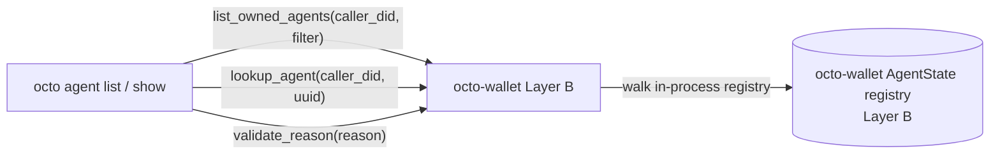
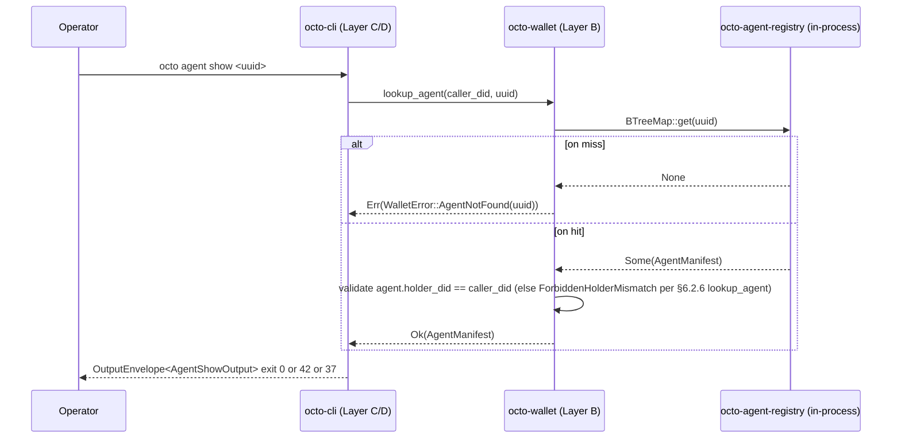

# RFC-0015: Agent Operations Substrate (`octo-wallet` agent list + lookup + reason filter)

## Status

Draft v3 (2026-09-13)

> **KEEP-only rewrite per RFC-0015 R40 restructure.** §6.2 splits into §Pre-existing Substrate (cite commits `533b07a4` + `4222fb41`) + §Amendment Surface (commit `e09f3e3a`; DEFERRED to RFC-0015-a per [[deferred-vs-unspecified]]). RFC-0015-a spec lives in `rfcs/draft/process/0015-a-wallet-agent-write-path.md`.

## Authors

- Authored by `@cipherocto` per RFC-0011-c agent lifecycle amendment + RFC-0002 §Agent State Machine substrate authority.

## Maintainers

- Maintainer: `@cipherocto` per RFC-0011-c amendment chain.

## Summary

This RFC documents the canonical agent operations substrate on `octo-wallet` (Layer B years-stable per CLAUDE.md §Rust crate-level stability). The KEEP surface splits into two sections per the substrate-faithful principle (CLAUDE.md §Architectural Principles; RFC-0012/0013/0014 acceptance pattern):

- **§6.2 §Pre-existing Substrate** (already shipped on `next` HEAD per commits `533b07a4` + `4222fb41`): `list_owned_agents` + `lookup_agent` + `validate_reason` + 4 `WalletError` variants + 2 `OctoCliError` variants per the table there.
- **§6.2 §Amendment Surface** (DEFERRED to RFC-0015-a per [[deferred-vs-unspecified]]): write-path substrate `transition_agent` + 3 write-path `WalletError` variants + 1 `OctoCliError::AuditSubstrateNotReady` variant. Substrate items shipped on `next` HEAD per commit `e09f3e3a`; RFC-0015-a acceptance is the formal authorization step.

The substrate is intentionally **read-only at RFC-0015 KEEP** — `register_agent` already exists at `cli_fns.rs`. No new persistence, no new envelopes. Domain consumers are CLI missions `0011-c-agent-{list,show,attach}-subcommand` (KEEP at acceptance) and `0011-c-agent-{run,destroy}-subcommand` (DEFERRED to RFC-0015-a acceptance). RFC-0002 §Agent State Machine is the canonical state authority.

**Substrate-faithful note (mandatory):** RFC-0002 §Agent State Machine spec diagram declares a five-state model (`REGISTERED → ACTIVE → BUSY → ACTIVE → TERMINATED`). The substrate enum (`AgentState` in `octo-wallet`) currently implements a **three-state model** (`Registered`, `Running`, `Terminated`). Per the substrate-faithful principle (per RFC-0012/0013/0014 acceptance pattern), this RFC treats the substrate as canonical — the `Running` variant collapses RFC-0002's `ACTIVE` and `BUSY` working state into a single observable runtime state. A future amendment (companion to RFC-0002) may split the substrate enum back to match the spec diagram; until then, CLI surfaces `Running` as both ACTIVE and BUSY (per RFC-0011-c `AgentState` rendering rule).

## Dependencies

- **RFC-0011-c** — `octo agent` Subcommands (consumers; defines read operator UX)
- **RFC-0002** — Agent Manifest Specification (canonical `AgentManifest` + `AgentState` authority per §Agent State Machine; substrate-faithful drift per §Summary note above)
- **RFC-0010** — Canonical DID Codec (DID parsing for `holder_did: Did` filter field)
- **RFC-0008** — Deterministic AI Execution Boundary (execution class mapping per §RFC-0008 Execution Class Mapping)
- **RFC-0009** — Identity Management (informational; lifecycle state-machine substrate precedent)
- **RFC-0011** — `octo` CLI Substrate (parent RFC; provides `OutputEnvelope<T>`, `OctoCliError`, `OctoCliRedactor`, clap root, exit code table)
- **RFC-0015-a** — `octo-wallet` Agent Write-Path Amendment (sibling; write-path surface per §6.7)
- **AuditEventKind `AgentTransition` extension** (future substrate amendment paired with RFC-0015-a acceptance per §6.7)
- **RFC-0002 companion amendment** — `AgentState` 5-state ACTIVE/BUSY split (out of RFC-0015 critical path; substrate-faithful 3-state form is canonical at RFC-0015 acceptance)

## Design Goals

1. **Additive only** — new functions + new error variants append to the existing `octo-wallet` (Layer B) public surface; no breaking changes to existing public API per RFC migration etiquette.
2. **Substrate-faithful** — function names, parameter shapes, return types match the canonical CLI consumer contracts in RFC-0011-c §9.3 (no parallel abstractions per [[cipherocto-design-principles]]).
3. **Layer B stability** — public functions are additive within the years-stable identity substrate; no PQC-migration impact per CLAUDE.md §Architectural Principles.
4. **No new persistence** — `list_owned_agents` + `lookup_agent` + `validate_reason` operate on the existing `AgentManifest` / `AgentSummary` registry stored in `octo-wallet`; no new IO surface, no new envelopes.
5. **Read returns ordered results** — `list_owned_agents` returns summaries sorted by `registered_at_unix DESC` for deterministic CLI + scripting output.
6. **Caller-attestation pattern** — read functions take `caller_did: &Did` parameter; substrate enforces `caller_did == filter.holder_did` to close the multi-DID enumeration attack surface (HIGH sec fix).
7. **Pairing discipline** — write-path surface lives in RFC-0015-a; KEEP-only RFC-0015 describes the read path; cross-RFC forward-pointers are bidirectional.

## Motivation

The 6 RFC-0011-c CLI missions (`0011-c-agent-create`, `...-run`, `...-list`, `...-destroy`, `...-attach`) reference substrate functions on `octo-wallet`. Per substrate-first ordering (RFC-0015 R40 restructure), the read-path substrate landed ahead of the RFC text on `next` HEAD per commit `533b07a4`. This RFC documents the canonical contract for the pre-existing read-path surface (§6.2 §Pre-existing Substrate).

The write-path substrate (`transition_agent` + paired `WalletError` variants) shipped per commit `e09f3e3a`; RFC-0015-a acceptance is the formal authorization step that authorizes the CLI write-path missions.

## Roles and Authorities

| Role                | Authority                                                                                      | Audit trail                |
| ------------------- | ---------------------------------------------------------------------------------------------- | -------------------------- |
| Operator (human/CI) | `list_owned_agents` + `lookup_agent` + `validate_reason` (read-only at KEEP)                   | CLI log per RFC-0011-c     |
| Wallet substrate    | Source of truth for `AgentManifest` + `AgentSummary`; rejects unauthorized callers             | Internal state machine log |
| CLI (octo-cli)      | Operator UX over substrate functions; never bypasses substrate caller-attestation (per §6.2.1) | Same as operator           |

## Specification

### §6.1 System architecture (mermaid)



**Scope note:** the KEEP flow is the three solid `CLI → Wallet → State` edges. The write path (`transition_agent` + state-machine write + audit append) is **DEFERRED** to RFC-0015-a. At acceptance, `Wallet` exposes the three read-side primitives only.

Layer direction: CLI (Layer C/D) → `octo-wallet` (Layer B). No direct B→A edges in KEEP.

### §6.2 Public surface — substrate split per substrate-faithful principle

Per the substrate-faithful principle (CLAUDE.md §Architectural Principles; RFC-0012/0013/0014 acceptance pattern), this RFC's public surface is split into two sections:

- **§6.2 §Pre-existing Substrate** — items already shipped at the substrate layer (HEAD of `next`). This RFC documents the canonical contract for these items; the substrate is the source of truth. Cite: commit `533b07a4` (read-path surface) + `4222fb41` (state filter refinement) on `crates/octo-wallet/src/agent.rs` + `crates/octo-wallet/src/error.rs` + `crates/octo-cli/src/error.rs` per [[memory-is-never-status-ground-truth]]. The write-path substrate (commit `e09f3e3a`) lives in §6.2 §Amendment Surface per §Pairing discipline.
- **§6.2 §Amendment Surface** — items DEFERRED to RFC-0015-a (write-path amendment). Fully spec-ed per [[deferred-vs-unspecified]] so the contract is locked even though acceptance is paused.

#### §Pre-existing Substrate (KEEP — already shipped)

Six substrate items shipped on `next` HEAD per the cited commits:

| #   | Item                                                                                     | Substrate anchor                               | Source commit |
| --- | ---------------------------------------------------------------------------------------- | ---------------------------------------------- | ------------- |
| 1   | `pub fn list_owned_agents(caller_did, filter) -> Result<Vec<AgentSummary>, WalletError>` | `crates/octo-wallet/src/agent.rs:434`          | `533b07a4`    |
| 2   | `pub fn lookup_agent(caller_did, uuid) -> Result<AgentManifest, WalletError>`            | `crates/octo-wallet/src/agent.rs:486`          | `533b07a4`    |
| 3   | `pub fn validate_reason(reason) -> Result<(), WalletError>`                              | `crates/octo-wallet/src/agent.rs:546`          | `533b07a4`    |
| 4   | `WalletError::AgentNotFound(Uuid)`                                                       | `crates/octo-wallet/src/error.rs:155`          | `533b07a4`    |
| 5   | `WalletError::ForbiddenHolderMismatch`                                                   | `crates/octo-wallet/src/error.rs:164`          | `533b07a4`    |
| 6   | `WalletError::ReasonContainsControlChars(String)` + `WalletError::ReasonTooLong(usize)`  | `crates/octo-wallet/src/error.rs:174` + `:180` | `533b07a4`    |

Plus two CLI-side substrate items shipped on the same path:

| #   | Item                                              | Substrate anchor                   | Source commit |
| --- | ------------------------------------------------- | ---------------------------------- | ------------- |
| 7   | `OctoCliError::AgentNotFound(Uuid)` → exit 42     | `crates/octo-cli/src/error.rs:367` | `533b07a4`    |
| 8   | `OctoCliError::ForbiddenHolderMismatch` → exit 17 | `crates/octo-cli/src/error.rs:375` | `533b07a4`    |

The `#[non_exhaustive]` attribute on `WalletError` was already shipped on `next` HEAD prior to this RFC cycle (per `crates/octo-wallet/src/error.rs:17`); it is NOT counted as a KEEP additive item. The substrate-faithful read: the attribute ships pre-marked, and the additive coupling via the 4 new KEEP variants is what triggers the consumer migration concern documented in §Compatibility #1.

#### §Amendment Surface (DEFERRED — RFC-0015-a)

Five write-path items DEFERRED to RFC-0015-a. Fully spec-ed per [[deferred-vs-unspecified]] so the contract is locked at RFC-0015 acceptance time even though acceptance is paused:

| #   | Item                                                                                                                            | Substrate anchor (post-RFC-0015-a acceptance)                                         | RFC-0015-a spec section |
| --- | ------------------------------------------------------------------------------------------------------------------------------- | ------------------------------------------------------------------------------------- | ----------------------- |
| 9   | `pub fn transition_agent(caller_did, uuid, target: AgentState, reason: Option<&str>) -> Result<TransitionReceipt, WalletError>` | `crates/octo-wallet/src/agent.rs:311` (already shipped on `next` HEAD per `e09f3e3a`) | RFC-0015-a §6.1         |
| 10  | `WalletError::AlreadyInTransition(Uuid)`                                                                                        | `crates/octo-wallet/src/error.rs:190`                                                 | RFC-0015-a §6.2         |
| 11  | `WalletError::InvalidStateTransition { from, to }`                                                                              | `crates/octo-wallet/src/error.rs:202`                                                 | RFC-0015-a §6.2         |
| 12  | `WalletError::AuditUnavailable(String)`                                                                                         | `crates/octo-wallet/src/error.rs:219`                                                 | RFC-0015-a §6.2         |
| 13  | `OctoCliError::AuditSubstrateNotReady` → exit 52                                                                                | `crates/octo-cli/src/error.rs` (already shipped on `next` HEAD per `e09f3e3a`)        | RFC-0015-a §6.3         |

Items 9 + 13 are already shipped on `next` HEAD per `e09f3e3a`; they are listed here for RFC-0015 documentation completeness but RFC-0015 KEEP does NOT authorize them — RFC-0015-a acceptance is required for the write-path contract to take effect (paired with a future Layer A substrate amendment adding `AuditEventKind::AgentTransition` extension per RFC-0012 (Extension-over-enumeration pattern)).

#### §6.2.1 `list_owned_agents` (KEEP)

```rust
/// List all agents owned by the caller-attested DID, filtered server-side.
///
/// SECURITY (HIGH — caller-attestation pattern per RFC-0011 §Lifecycle Requirements):
/// the caller MUST pass the active DID as `caller_did` (NOT derived from
/// process state). The substrate re-validates `caller_did` against the
/// `AgentFilter::holder_did` field and rejects any filter whose
/// `holder_did` differs from `caller_did` (multi-DID enumeration
/// prevention). The caller is the CLI mission or upstream façade; the
/// substrate is the source of truth for authorization.
///
/// Sorting: `registered_at_unix DESC` (deterministic across calls).
/// Limit: substrate applies a hard ceiling of 1024 (per `AgentFilter::limit`
/// docs); values exceeding 1024 clamp to 1024 with no error.
/// Read-only: no state mutation.
pub fn list_owned_agents(
    caller_did: &Did,
    filter: &AgentFilter,
) -> Result<Vec<AgentSummary>, WalletError>;

pub struct AgentFilter {
    pub holder_did: Option<String>, // canonical RFC-0010 wire form per `crates/octo-wallet/src/agent.rs` §`AgentFilter`
    pub state: Option<AgentState>,
    pub limit: Option<usize>,    // None = substrate default 1024; hard ceiling 1024; values > 1024 clamp with no error
}
```

- **Filter semantics** — server-side `holder_did == filter.holder_did.unwrap_or(caller_did.as_str().to_owned())`; substrate enforces `filter.holder_did.is_none() || filter.holder_did.as_deref() == Some(caller_did.as_str())` per RFC-0009 §Identity (mismatch → `WalletError::ForbiddenHolderMismatch`). `state == filter.state` (exact match, no wildcards); `limit` clamp. **Canonicalization note:** the substrate does NOT canonicalize per RFC-0010 — bytes-equality on canonical form is substrate-faithful. The CLI mission MUST pre-canonicalize via `Did::from_str` (RFC-0010 §Chain-id Derivation) before calling `list_owned_agents`.
- **Return semantics** — empty `Vec` when zero matches (NOT an error); summaries sorted by `registered_at_unix DESC`, with secondary sort by `agent_id` (canonical UUID v5; namespace+name based, deterministic per substrate implementation) ASC as deterministic tiebreaker for entries sharing the same `registered_at_unix`.
- **Error semantics** — `WalletError::Config` on registry corruption (unrecoverable); `WalletError::Io` on disk read failure; `WalletError::ForbiddenHolderMismatch` (NEW) on caller/filter DID mismatch.

#### §6.2.2 `transition_agent` (DEFERRED — RFC-0015-a)

The `transition_agent` write function is **DEFERRED** (see §6.7).

#### §6.2.3 `WalletError::AgentNotFound(Uuid)` (KEEP)

```rust
/// Agent UUID not found in the active DID's registry.
#[error("agent not found: {0}")]
AgentNotFound(Uuid),
```

- Mirrors the existing `WalletError::AgentAlreadyExists(Uuid)` shape for symmetry.
- CLI maps to `OctoCliError::AgentNotFound(Uuid)` (exit 42 per RFC-0011-c §9.8 slot allocation).
- **KEEP source:** raised by `lookup_agent(caller_did, uuid)` per §6.2.6 on miss.

#### §6.2.4 `WalletError::ForbiddenHolderMismatch` (KEEP)

```rust
/// Caller-attested DID does not match filter's `holder_did` field.
/// SECURITY (HIGH — multi-DID enumeration prevention per §6.2.1).
#[error("forbidden: holder DID mismatch")]
ForbiddenHolderMismatch,
```

- **Where raised:** `list_owned_agents(caller_did, filter)` when `filter.holder_did.is_some()` and `filter.holder_did != caller_did` (per §6.2.1 enforcement); also raised by `lookup_agent(caller_did, uuid)` per §6.2.6 (lookup_agent) on caller/holder mismatch.
- **CLI mapping:** Exit code 17 → `OctoCliError::ForbiddenHolderMismatch` per `crates/octo-cli/src/error.rs` §`ForbiddenHolderMismatch → 17` (substrate-canonical mapping). See Appendix B for the full envelope cross-reference.

#### §6.2.5 `validate_reason` (KEEP)

```rust
/// Substrate-faithful control-character filter primitive.
///
/// Returns:
/// - `Ok(())` if `reason` is empty OR contains only ASCII printable +
///   non-control Unicode (`U+0020+`).
/// - `Err(WalletError::ReasonContainsControlChars(String))` if `reason`
///   contains any control character in `U+0000`-`U+001F` or `U+007F`.
///   The variant carries the offending character as a `String` payload
///   in hex-escaped code-point notation (e.g., `<U+001B>` for ESC,
///   `<U+0000>` for NUL), NEVER the raw byte — `Display` impl MUST NOT
///   echo attacker bytes back to the terminal (pager-hijack mitigation).
/// - `Err(WalletError::ReasonTooLong(usize))` if `reason.len() > 256`.
///   The variant carries the offending byte length as a `usize` payload.
pub fn validate_reason(reason: &str) -> Result<(), WalletError>;
```

- **C1 range gap (canonical):** the primitive rejects only `U+0000`-`U+001F` and `U+007F`; the C1 range (`U+0080`-`U+009F`, including `U+0085` NEL, `U+009B` 8-bit CSI, `U+009D` 8-bit OSC) passes the filter. Modern UTF-8 terminals render the C1 range safely; some legacy / non-UTF-8 terminals may interpret them as control sequences. A future RFC-0015 amendment may widen the filter to include the C1 range.

#### §6.2.6 `lookup_agent` (KEEP)

```rust
/// Point lookup of an agent manifest by canonical UUID.
///
/// Substrate-faithful to `crates/octo-wallet/src/agent.rs` `AgentManifest`
/// struct. Returns the canonical `AgentManifest` on hit,
/// `WalletError::AgentNotFound(uuid)` on miss (per §6.2.3 NEW ADDITIVE variant).
///
/// SECURITY: caller-attestation pattern per §6.2.1 — caller MUST pass active DID as caller_did.
pub fn lookup_agent(
    caller_did: &Did,
    uuid: Uuid,
) -> Result<AgentManifest, WalletError>;
```

- **Where raised:** invoked by `0011-c-agent-show-subcommand` (CLI consumer; RFC-0011-c §9.3 `octo agent show` subcommand specification) for point-lookup.
- **Error semantics:** `WalletError::AgentNotFound(uuid)` on miss (KEEP per §6.2.3); `WalletError::ForbiddenHolderMismatch` on caller/holder mismatch per §6.2.4.

#### §6.2.7 Pre-existing CLI-error substrate (KEEP — already shipped)

Three CLI-side items shipped on `next` HEAD per commit `533b07a4`. Included for substrate-canonical reference; not counted as RFC-0015 additive items:

| #   | Item                                    | Substrate anchor                     | Exit | RFC-0011 slot   |
| --- | --------------------------------------- | ------------------------------------ | ---- | --------------- |
| 1   | `#[non_exhaustive]` on `WalletError`    | `crates/octo-wallet/src/error.rs:17` | n/a  | n/a             |
| 2   | `OctoCliError::ForbiddenHolderMismatch` | `crates/octo-cli/src/error.rs:375`   | 17   | parent reserved |
| 3   | `OctoCliError::AgentNotFound(Uuid)`     | `crates/octo-cli/src/error.rs:367`   | 42   | §9.8 slot 42    |

The `#[non_exhaustive]` attribute on `WalletError` (item 1) was already shipped prior to this RFC cycle; the additive coupling via the 4 new `WalletError` variants (§6.2.3-§6.2.5) is what triggers the consumer migration concern documented in §Compatibility #1.

### §6.3 Error envelope

Canonical substrate-variant → CLI-variant → exit-code cross-reference lives in §Appendix B. CLI mapping follows RFC-0011-a §7.4 Substrate `[ADD]` error-envelope pattern (substrate variant → CLI variant → exit code) byte-for-byte.

### §6.4 CLI integration contract

CLI missions consuming this substrate:

| Mission                             | Substrate call                                                     | Sub-step              |
| ----------------------------------- | ------------------------------------------------------------------ | --------------------- |
| `0011-c-agent-create-subcommand.md` | `octo_wallet::cli_fns::register_agent`                             | Sub-step 3 (existing) |
| `0011-c-agent-list-subcommand.md`   | `octo_wallet::list_owned_agents(caller_did, &filter)`              | Sub-step 3            |
| `0011-c-agent-show-subcommand.md`   | `octo_wallet::lookup_agent(caller_did, uuid)`                      | Sub-step 3            |
| `0011-c-agent-attach-subcommand.md` | read-only (`octo_runtime::attach`); substrate is read-only at KEEP | N/A                   |

Writes DEFERRED to RFC-0015-a per §6.7.

### §6.5 Determinism requirements

- **Read determinism** — `list_owned_agents` returns the same result for the same input across runs (substrate is single-writer; the registry is in-memory + persisted atomically per write); sorting is deterministic (`registered_at_unix DESC`, with secondary sort by `agent_id` canonical UUID v5 ASC as deterministic tiebreaker).
- **Primitive determinism** — `validate_reason` is deterministic per input (single-pass scan; FIRST control char wins for the `ReasonContainsControlChars` variant payload; LEN-driven cap for `ReasonTooLong`).

### §6.6 RFC-0008 Execution Class Mapping

All RFC-0015 KEEP items per §6.2 §Pre-existing Substrate are Class A (read) per RFC-0008 §Execution Class Mapping. No state mutation; observable in any environment.

CLI surfaces `Class A` operations unconditionally (no `--allow-write` gate per parent §Confirmation Flag Matrix).

### §6.7 Forward Pointer — write-path surface lives in RFC-0015-a

The write-path contract (`transition_agent` + paired `WalletError::{AlreadyInTransition(Uuid), InvalidStateTransition { from, to }, AuditUnavailable}` + audit append of `AuditEventKind::AgentTransition` rows + the `parking_lot` Cargo.toml entry for per-agent lock-mode) is DEFERRED to RFC-0015-a per [[deferred-vs-unspecified]] (fully spec-ed so the contract is locked at RFC-0015 acceptance time).

The write-path substrate items are already shipped on `next` HEAD per commit `e09f3e3a` (substrate-first ordering per RFC-0015 R40 restructure); RFC-0015-a acceptance is the formal acceptance step that authorizes them as the write-path contract. Until RFC-0015-a acceptance lands, RFC-0015 KEEP does NOT authorize CLI missions to invoke the write-path surface.

**`rfcs/draft/process/0015-a-wallet-agent-write-path.md`** carries the full write-path spec per §6.1 of that RFC.

## Performance Targets

- `list_owned_agents` with 1000-agent registry: p95 < 5ms (in-memory registry walk; substrate does not touch disk for the read).
- `lookup_agent` point lookup: p95 < 1ms (in-memory `BTreeMap::get` indexed by UUID).
- `validate_reason` primitive: p95 < 100µs (single-pass byte scan on UTF-8 input).

## Implicit Assumptions Audit

1. **Substrate is canonical for `AgentState`** — CLI never pattern-matches on `AgentState` string representation; serde-derived lowercase string is for display only per `#[serde(rename_all = "lowercase")]` on the enum.
2. **Reason string is UTF-8, ≤256 chars, no control chars** — substrate enforces length cap + control-char filter (`U+0000`-`U+001F`, `U+007F`) at the substrate boundary per §6.2.5 (validate_reason). CLI parser caps length at parse time (exit 16 per `OctoCliError::InvalidFilter`) as upstream defense-in-depth per RFC-0011-c §Security considerations.
3. **`register_agent` precedes any read** — substrate assumes the `agent_id` returned by `register_agent` exists in the in-memory registry before any `list_owned_agents` call returns a non-empty `Vec`; CLI precondition check. `register_agent` is the EXISTING `octo_wallet::cli_fns::register_agent(manifest: &AgentManifest, capability_root: &CapabilityId, active_did: &Did) -> Result<uuid::Uuid, WalletError>` per `crates/octo-wallet/src/cli_fns.rs` §`register_agent` — returns the assigned `agent_id` Uuid for subsequent list / destroy calls. RFC-0015 KEEP does NOT add a new `register_agent` function — the existing CLI FFI function is the canonical substrate contract.
4. **Operator config dir writable** — agent registry persists to `$OCTO_HOME/wallet/agents`; substrate raises `WalletError::Config(String)` on registry-corruption / unwritable paths (per §6.2.1 error semantics + `crates/octo-wallet/src/error.rs` §`WalletError::Config` variant). CLI surfaces `OctoCliError::NoOctoHome` upstream (exit 27 per `crates/octo-cli/src/error.rs` §`NoOctoHome`) when the substrate path is fully unreachable; the substrate-faithful principle: CLI maps substrate errors to CLI exit codes at the façade boundary per RFC-0011-a §7.4 Substrate `[ADD]` error-envelope pattern.
5. **`caller_did` provenance from active identity handle (HSM-bound)** — the substrate does NOT authenticate `caller_did`; it only enforces `caller_did == agent.holder_did` (per §6.2.1). A fabricated `caller_did` (compromised CLI passing an arbitrary DID string) would pass the substrate check trivially. The CLI / programmatic caller MUST source `caller_did` from the active identity handle (HSM-bound per `crates/octo-wallet/src/identity.rs` §`IdentityKey` + `crates/octo-wallet/src/identity_record.rs` §`IdentityRecord` + RFC-0009 §Identity Struct + §HsmAdapter Integration) at the Layer B façade boundary. The substrate-faithful pattern: `caller_did: &Did` is borrowed from an HSM-bound identity record retrieved from process session state. The substrate does not look up the HSM itself. Per-process trust boundary assumed at the façade boundary.

## Security Considerations

1. **Reason field is operator-controlled** — `validate_reason` enforces length cap (≤256 chars) + control-char filter (`U+0000`-`U+001F`, `U+007F`) at the substrate boundary per §6.2.5 (validate_reason) (MEDIUM sec fix). Defense-in-depth: CLI parses length/UTF-8 at parse time; substrate rejects control chars at the primitive boundary so any future caller inherits the same filter. Substrate does not interpret the string as code; no shell metachar escape surface. ASCII printable + non-control Unicode (`U+0020+`) is allowed; control chars `U+0000`-`U+001F` and `U+007F` are rejected. C1 gap per §6.2.5.
2. **`AgentNotFound` does not leak existence** — substrate returns the variant for unknown UUIDs; enumeration attacks via timing differences are mitigated by substrate-internal registry lookups (substrate-faithful `BTreeMap::get` indexed by UUID — substrate does NOT enforce constant-time; lookup time varies based on tree depth and distribution). Per-process trust boundary assumed at the façade boundary per §Implicit Assumptions Audit row 5.
3. **`list_owned_agents` enforcement** (HIGH sec fix per §6.2.1) — `caller_did` is a required parameter; substrate rejects any filter whose `holder_did` differs from `caller_did` (`WalletError::ForbiddenHolderMismatch`). Closes the multi-DID enumeration attack surface.
4. **`lookup_agent` enforcement** (HIGH sec fix per §6.2.1) — same `caller_did: &Did` parameter pattern; substrate rejects any lookup whose agent's `holder_did` differs from `caller_did` (`WalletError::ForbiddenHolderMismatch`).

## Adversarial Review

### Threat: reason-field XSS / control-char injection

**Adversary:** Compromised CLI / operator-supplied `--reason` payload containing ANSI escape sequences (`\x1b[...`), terminal control bytes (`\x07` bell, `\x08` backspace), or terminal emulator OSC sequences (`\x1b]...`) attempts to manipulate downstream tooling that renders the audit log (terminal pagers, log viewers, audit dashboards).

**Mitigation:** `validate_reason` rejects reason strings containing any control character (`U+0000`-`U+001F`, `U+007F`) BEFORE any state-machine work per §6.2.5 (validate_reason) (MEDIUM sec fix). The filter is applied at the substrate boundary, not at the CLI parser, so any future caller (CLI, wallet-on-host daemon, programmatic API) inherits the same defense. The reason string is stored verbatim as UTF-8 in downstream audit rows; downstream redaction (RFC-0011-a §Redaction) treats it as opaque text and never re-interprets bytes as escape sequences. ASCII printable + non-control Unicode (`U+0020+`) is allowed; control chars `U+0000`-`U+001F` and `U+007F` are rejected per §6.2.5 (validate_reason); the filter does not block legitimate Unicode (e.g., non-ASCII names, emoji in destroy reasons).

### Threat: multi-DID enumeration via `list_owned_agents` / `lookup_agent`

**Adversary:** Compromised CLI passes a `filter.holder_did` different from the active DID (or `caller_did` different from the agent's `holder_did`) to enumerate agents across DIDs.

**Mitigation:** substrate enforces `caller_did == filter.holder_did` (read list) and `caller_did == agent.holder_did` (point lookup) per §6.2.1; mismatch → `WalletError::ForbiddenHolderMismatch`. Caller-did provenance per §Implicit Assumptions Audit row 5.

## Adversary Analysis (5-Question Test)

| Threat                         | Q1: Who?        | Q2: What?                                 | Q3: Why?                                        | Q4: How mitigated?                                                                                                                                               | Q5: Residual risk?                                                                                                                                     |
| ------------------------------ | --------------- | ----------------------------------------- | ----------------------------------------------- | ---------------------------------------------------------------------------------------------------------------------------------------------------------------- | ------------------------------------------------------------------------------------------------------------------------------------------------------ |
| Reason-field XSS               | Compromised CLI | Inject ANSI/OSC escape                    | Manipulate downstream renderer                  | `validate_reason` control-char filter `U+0000`-`U+001F`, `U+007F` rejected (MEDIUM sec fix per §6.2.5 (validate_reason))                                         | LOW (C1 gap per §6.2.5).                                                                                                                               |
| Multi-DID enumeration (list)   | Compromised CLI | Cross-DID `filter.holder_did`             | Enumerate agents across DIDs                    | `caller_did` + `filter.holder_did` mismatch → `ForbiddenHolderMismatch` (HIGH sec fix per §6.2.1)                                                                | Caller-did provenance gap per §Implicit Assumptions Audit row 5                                                                                        |
| Multi-DID enumeration (lookup) | Compromised CLI | Cross-DID `caller_did`                    | Enumerate agents across DIDs                    | `caller_did` + `agent.holder_did` mismatch → `ForbiddenHolderMismatch` (Caller-attestation HIGH sec fix)                                                         | Caller-did provenance gap per §Implicit Assumptions Audit row 5                                                                                        |
| UUID echo in `AgentNotFound`   | Compromised CLI | Echo unknown UUID in error payload        | Confirm UUID existence in target DID's registry | NONE — substrate registry lookups use non-constant-time comparison; UUID-echo leakage is timing-side-channel tolerable at KEEP per RFC-0008 §Adversary Analysis. | Accepted low-severity leak (UUID is operator-supplied; echo confirms DID/UUID pairing exists, not existence; mitigation is per-process trust boundary) |
| Caller-DID provenance gap      | Compromised CLI | Fabricate `caller_did` from process state | Enumerate agents owned by other DIDs            | HIGH sec fix `caller_did` parameter per §6.2.1; substrate enforces `filter.holder_did == caller_did`                                                             | Trust placed in CLI session-state derivation (per-process trust boundary; see §Implicit Assumptions Audit row 5)                                       |

## Economic Analysis

DEFER — agent read operations have no direct token cost; cite RFC-0900+ (Role Economics) for any cost implications.

## Compatibility

1. **No breaking changes to function-level public API.** Per §6.2 §Pre-existing Substrate table, six substrate items + two CLI-side items landed on `octo-wallet` (Layer B years-stable); no existing public function modified. The `#[non_exhaustive]` attribute on `WalletError` (already shipped at substrate hard-check per `crates/octo-wallet/src/error.rs:17`) is the canonical Rust additive enum-extension mechanism per [[cipherocto-design-principles]] (Extension-over-enumeration pattern) — downstream exhaustive matches stop compiling after the additive variant additions, which is the intentional trade-off (substrate-faithful semver-major addition within an additive layer; document at the CLI substrate re-export boundary per RFC-0011-a §Migration Etiquette).
2. **No `schema_version` bump.** The `OutputEnvelope<T>` envelope carries no new fields; CLI mission output schemas unchanged.
3. **No new exit codes for the new errors.** `AgentNotFound` (42) per RFC-0011-c §9.8 slot allocation; `ForbiddenHolderMismatch` (17) per `crates/octo-cli/src/error.rs` §`ForbiddenHolderMismatch → 17` (substrate-canonical; see Appendix B). The slot-16 mappings (`ReasonContainsControlChars`, `ReasonTooLong`) reuse `InvalidFilter` (16). The slot-43 mappings (`AlreadyInTransition`, `InvalidStateTransition`) and slot-52 (`AuditUnavailable`) are formally consumed by RFC-0015-a per §6.7; the substrate items are pre-shipped on `next` HEAD per `e09f3e3a`.
4. **No new clap variants.** Existing `AgentAction` enum (RFC-0011-c §9.3 dispatch) absorbs the new substrate calls; the missions land their variant-per-subcommand as planned.

## Test Vectors

Substrate-level test vectors (`crates/octo-wallet/src/agent.rs` test module). Write-path vectors (TV-WLT-AGT-3 through TV-WLT-AGT-11c) are **DEFERRED — see §6.7**.

| #              | Substrate call                                                                                                                | Input                                                                    | Expected Output                                                                                                                                                                                                                             | Notes                                                                                                                                 |
| -------------- | ----------------------------------------------------------------------------------------------------------------------------- | ------------------------------------------------------------------------ | ------------------------------------------------------------------------------------------------------------------------------------------------------------------------------------------------------------------------------------------- | ------------------------------------------------------------------------------------------------------------------------------------- |
| TV-WLT-AGT-1   | `list_owned_agents(caller_did, &AgentFilter::default())`                                                                      | Empty registry                                                           | `Ok(vec![])`                                                                                                                                                                                                                                | TV-AGT6 substrate echo                                                                                                                |
| TV-WLT-AGT-2   | `list_owned_agents(caller_did, &filter { limit: Some(100) })`                                                                 | 1000-agent registry                                                      | `Ok(vec_of_100_summaries)` truncated                                                                                                                                                                                                        | Limit clamp                                                                                                                           |
| TV-WLT-AGT-12  | `list_owned_agents(caller_did, &filter { holder_did: Some("did:octo:other-...") })`                                           | Caller DID ≠ filter `holder_did` (RFC-0010 string form per §6.2.1)       | `Err(WalletError::ForbiddenHolderMismatch)`                                                                                                                                                                                                 | HIGH sec fix (per §6.2.1)                                                                                                             |
| TV-WLT-AGT-13  | `validate_reason("ok")` (unit test on control-char filter primitive)                                                          | ASCII printable reason                                                   | `Ok(())`                                                                                                                                                                                                                                    | Verifies filter accepts ASCII printable                                                                                               |
| TV-WLT-AGT-13b | `validate_reason("\x1b[31mred")` (unit test)                                                                                  | ANSI escape sequence reason                                              | `Err(WalletError::ReasonContainsControlChars("<U+001B>".to_string()))` (variant payload `String` carries hex-escaped code-point notation; `Display` impl MUST NOT echo raw byte)                                                            | Verifies filter rejects `U+001B` ESC (uses hex-escaped `<U+XXXX>` notation, NOT raw byte)                                             |
| TV-WLT-AGT-13d | `validate_reason("\x00null")` (unit test)                                                                                     | NUL byte reason                                                          | `Err(WalletError::ReasonContainsControlChars("<U+0000>".to_string()))` (variant payload `String` carries hex-escaped code-point notation for the offending `U+0000` NUL per §6.2.5 multi-char return semantics)                             | Verifies filter rejects `U+0000` NUL                                                                                                  |
| TV-WLT-AGT-13e | `validate_reason("\r\n[ADMIN] approved")` (unit test)                                                                         | CRLF-injection reason                                                    | `Err(WalletError::ReasonContainsControlChars("<U+000D>".to_string()))` (variant payload `String` carries hex-escaped code-point notation for the FIRST occurrence per §6.2.5 multi-char return semantics — `\r` is encountered before `\n`) | Verifies filter rejects `U+000A` LF / `U+000D` CR                                                                                     |
| TV-WLT-AGT-13h | `validate_reason("a".repeat(257))` (unit test)                                                                                | Reason > 256 chars (boundary exceedance per §6.2.5 length cap)           | `Err(WalletError::ReasonTooLong(257))` (payload `usize` is the offending byte length per §6.2.5 (validate_reason) + §6.3)                                                                                                                   | Verifies 256-char length cap enforcement                                                                                              |
| TV-WLT-AGT-14  | `list_owned_agents(caller_did, &AgentFilter { holder_did: None, limit: Some(0) })`                                            | Empty registry + limit=0                                                 | `Ok(Vec::new())` (limit=0 not rejected at list path; `AgentFilter.limit` is clamp-only per §6.2.1 limit semantics)                                                                                                                          | limit=0 edge case (substrate applies limit clamp; returns empty Vec)                                                                  |
| TV-WLT-AGT-16  | `register_agent(manifest, cap_root, active_did)` then `register_agent(same_manifest, same_cap_root, same_active_did)`         | Duplicate register call (idempotency check)                              | Second call: `Err(WalletError::AgentAlreadyExists(uuid_v5))` per `octo_wallet::cli_fns::register_agent` (substrate-faithful idempotency contract; UUIDv5 deterministic per substrate §6.2.1 ordering note)                                  | Idempotency check (existing `WalletError::AgentAlreadyExists(Uuid)` raises on duplicate)                                              |
| TV-WLT-AGT-17  | `AgentManifest::from_json(path, "{invalid_json}")` (parse-stage before `register_agent`; canonical substrate parse-fail path) | Manifest parse failure (RFC-0002 JSON wire form)                         | `Err(WalletError::ManifestParse { path: <path>.into(), reason: <serde_err>.into() })` per `crates/octo-wallet/src/agent.rs` §`AgentManifest::from_json` (substrate-faithful parse contract per RFC-0002 §Manifest Schema)                   | Manifest parse fail (existing `WalletError::ManifestParse { path, reason }` struct variant per substrate hard-check 2026-09-11)       |
| TV-WLT-AGT-18  | `sign()` invoked with identity in `Revoked` lifecycle state per RFC-0009 §Identity Struct                                     | Revoked identity `sign()` attempt                                        | `Err(WalletError::NotActive { current_state: LifecycleState::Revoked })` per `crates/octo-wallet/src/error.rs` §`NotActive` (substrate-faithful identity-lifecycle guard per RFC-0009)                                                      | Revoked identity cannot sign (existing `WalletError::NotActive { current_state }` struct variant per substrate hard-check 2026-09-11) |
| TV-WLT-AGT-19  | `list_owned_agents(caller_did, &AgentFilter { holder_did: Some("did:octo:nonexistent") })`                                    | Unknown holder DID (canonical RFC-0010 string form per §6.2.1)           | `Ok(Vec::new())` (unknown DID has zero registered agents in the in-process registry; substrate-faithful: empty Vec is NOT an error per §6.2.1 return semantics)                                                                             | Unknown DID → empty (no registered agents for unknown DID)                                                                            |
| TV-WLT-AGT-20  | `register_agent` deterministic UUIDv5 check: same `(manifest_digest, active_did)` inputs → same UUID across 100 calls         | Determinism across 100 register calls                                    | All 100 calls return the same `Uuid` (UUIDv5 derived from `(manifest_digest, active_did)` in the CipherOcto-agent namespace per §6.2.1 substrate-faithful ordering note; NOT UUIDv7)                                                        | Substrate-faithful UUIDv5 determinism (namespace+name based; substrate-faithful determinism per §6.6 determinism requirement)         |
| TV-WLT-AGT-21  | `validate_reason("a".repeat(256))` (unit test)                                                                                | Reason at 256-char boundary (per §6.2.5 length cap)                      | `Ok(())` (256 chars is the inclusive boundary; reason.len() == 256 is allowed per §6.2.5 length semantics; the primitive rejects `reason.len() > 256` only)                                                                                 | Verifies 256-char boundary OK (≤ 256 inclusive)                                                                                       |
| TV-WLT-AGT-22  | `lookup_agent(caller_did, registered_uuid)`                                                                                   | Existing agent registered via `register_agent` per §6.2.6 (lookup_agent) | `Ok(<AgentManifest with agent_id, holder_did, registered_at_unix, ...>)` (canonical substrate-faithful `AgentManifest` struct per `crates/octo-wallet/src/agent.rs` §`AgentManifest` hard-checked 2026-09-11)                               | KEEP source for `WalletError::AgentNotFound(Uuid)` variant per §6.2.3                                                                 |
| TV-WLT-AGT-23  | `lookup_agent(caller_did, unregistered_uuid)`                                                                                 | Unknown UUID (canonical RFC-0010 string form per §6.2.6 lookup_agent)    | `Err(WalletError::AgentNotFound(uuid))` (KEEP source per §6.2.3)                                                                                                                                                                            | Verifies `AgentNotFound` raised by `lookup_agent` on miss                                                                             |

CLI-level test vectors live in RFC-0011-c §Test Vectors TV-AGT1..AGT-12 (UNCHANGED — RFC-0015 substrate alignment does not modify CLI TV).

## Alternatives Considered

- **Pure-CLI state-machine** — substrate delegates transition validation to CLI; rejected: violates substrate-faithful principle; CLI bypass becomes possible. (Note: applies to RFC-0015-a write path; RFC-0015 has no state-machine surface.)
- **Composite state variants** — keep ACTIVE + BUSY in the substrate enum per RFC-0002 spec; rejected: substrate-faithful principle (the three-state form is canonical in the substrate); a companion amendment to RFC-0002 may restore the split later.

## Implementation Phases

- **Phase 1 (this RFC, KEEP)** — substrate surface split per §6.2: §Pre-existing Substrate documents items shipped on `next` HEAD per commits `533b07a4` + `4222fb41`; §Amendment Surface fully spec-ed per [[deferred-vs-unspecified]] for the write-path surface to RFC-0015-a.
- **Phase 2 (RFC-0011-c read-only missions)** — CLI missions `0011-c-agent-{create,list,show,attach}-subcommand` consume the read surface; mutation traces per RFC-0011-c §Test Vectors.
- **Phase 2.5 (RFC-0015-a acceptance, paired with a future Layer A substrate amendment)** — `transition_agent` + paired write-path `WalletError` variants formally authorized on `octo-wallet` Layer B (substrate items already shipped on `next` HEAD per `e09f3e3a`).
- **Phase 3 (RFC-0011-c write missions)** — CLI missions `0011-c-agent-{run,destroy}-subcommand` consume the write surface (post-RFC-0015-a acceptance); mutation traces per RFC-0011-c §Test Vectors.

## Key Files to Modify

- `crates/octo-wallet/Cargo.toml` — **NO new deps at KEEP.** No `parking_lot` entry; that dep is paired with the DEFERRED write-path Phase 2.5 lock-mode contract and lands with RFC-0015-a.
- `crates/octo-wallet/src/agent.rs` — append `list_owned_agents` + `lookup_agent` + `validate_reason` (existing types; ~80 LoC incl. tests). `transition_agent` is DEFERRED (see §6.7).
- `crates/octo-wallet/src/error.rs` — append 4 KEEP variants per §6.2.3-§6.2.6. The DEFERRED write-path variants `AlreadyInTransition(Uuid)` + `InvalidStateTransition { from, to }` + `AuditUnavailable` are NOT added at KEEP — they land with RFC-0015-a.
- `crates/octo-wallet/src/lib.rs` — re-export the new functions (no breaking change to existing public surface).

**Layer placement table (M-4 amendment — explicit layer discipline per CLAUDE.md §Rust crate-level stability):**

| Crate             | Layer                                            | Substrate anchor (§symbol ref)                                                                                            | Role at RFC-0015 KEEP                                                                                                                                                                                 |
| ----------------- | ------------------------------------------------ | ------------------------------------------------------------------------------------------------------------------------- | ----------------------------------------------------------------------------------------------------------------------------------------------------------------------------------------------------- |
| `octo-wallet`     | Layer B façade (RFC-0011-c)                      | `crates/octo-wallet/src/agent.rs` §`AgentManifest` + `crates/octo-wallet/src/error.rs` §`WalletError`                     | Façade; KEEP additive items (`list_owned_agents` + `lookup_agent` + `validate_reason` + 4 error variants) land here at KEEP                                                                           |
| `octo-ident`      | Layer B identity substrate (RFC-0010 + RFC-0009) | `crates/octo-ident/src/lib.rs` §`WireDid` + §`CanonicalCodec` (RFC-0010 wire form + BLAKE3-keyed codec)                   | Pre-existing B→B hop dep for `caller_did: &Did` parameters on §6.2.1/§6.2.6 substrate functions; no RFC-0015 addition (codec unchanged at KEEP)                                                       |
| `octo-audit-core` | Layer A frozen (RFC-0012)                        | `§`AuditEventKind`enum (3 variants:`Insert`, `Revoke`, `Sync`+`#[non_exhaustive]` per Extension-over-enumeration pattern) | Canonical substrate for paired-DEFER `transition_agent` audit append — DEFERRED to Phase 2.5 (lands with future substrate amendment + RFC-0015-a); `octo-wallet` has NO `octo-audit-core` dep at KEEP |

Layer direction (KEEP): `octo-wallet` (Layer B) → `octo-ident` (Layer B, identity substrate per RFC-0010 + RFC-0009) for DID codec + identity substrate hops; no direct B→A edges at KEEP. The `octo-wallet` → `octo-audit-core` B→A edge is DEFERRED to Phase 2.5, paired with RFC-0015-a acceptance + a future Layer A substrate amendment; at KEEP, `octo-wallet` (Layer B) has zero direct `octo-audit-core` dep (substrate hard-check 2026-09-13). Canonical façade-to-substrate hops per CLAUDE.md §Architectural Principles.

No changes to Layer A crates (`octo-audit-core`, etc.); no CLI binary changes; no envelope / redactor / exit-code table changes.

## Future Work

- `list_owned_agents` cursor support — opaque cursor token for >1024-agent registries (Phase 2; out of scope here).
- RFC-0015 amendment — widen `validate_reason` control-char filter to include the C1 range (`U+0080`-`U+009F`) for legacy-terminal support (out of scope here; C1 gap per §6.2.5).
- RFC-0002 companion amendment — restore the five-state ACTIVE/BUSY split if operator demand surfaces (out of scope here; substrate-faithful 3-state form is canonical at RFC-0015 acceptance).
- `transition_agent` batch API — multi-agent transition in one substrate call (paired with the RFC-0002 companion amendment).

## Rationale

- **Substrate-faithful** — substrate is canonical per RFC-0012/0013/0014 acceptance pattern; the three-state `AgentState` enum is canonical even when it differs from the RFC-0002 spec diagram.
- **Additive only** — CLAUDE.md §Rust crate-level stability: Layer B additive changes do not break consumers; the 8 items per §6.2 §Pre-existing Substrate are additive; the 5 write-path items per §6.2 §Amendment Surface are formally authorized via RFC-0015-a acceptance.
- **No parallel abstractions** — function names + parameter shapes mirror CLI mission call sites exactly (per [[cipherocto-design-principles]] §No parallel abstractions).
- **Pairing discipline** — RFC-0015 (read-path) + RFC-0015-a (write-path) follow the extension-over-enumeration pattern per [[cipherocto-design-principles]]; no central enum edit at Layer A.

## Version History

- v3 (2026-09-13) R2.5 fix per Option C split: §6.2 §Pre-existing Substrate (cite commits `533b07a4` + `4222fb41`) + §6.2 §Amendment Surface (DEFERRED to RFC-0015-a, fully spec-ed per [[deferred-vs-unspecified]]). Exit code 17 (substrate-canonical) for `ForbiddenHolderMismatch`. Drop redundant DEFERRED restatements. Drop `RFC-0002` version pin in prose.
- v2 (2026-09-11) KEEP-only substrate-faithful rewrite. Drop `transition_agent` write-path surface + paired DEFERRED `WalletError` variants + DEFERRED TVs to RFC-0015-a (write-path amendment). Phase 2.5 lock-mode contract + `parking_lot` dep paired-DEFER to RFC-0015-a acceptance.
- v1.0 (2026-09-11) Initial draft. Substrate-faithful `octo-wallet` read surface (RFC-0002 + RFC-0011-c).

## Related RFCs

- RFC-0011-c — `octo agent` Subcommands (CLI consumers; defines operator UX surface)
- RFC-0002 — Agent Manifest Specification (canonical `AgentState` + `AgentManifest` authority)
- RFC-0009 — Identity Management (lifecycle state-machine substrate precedent)
- RFC-0011 — `octo` CLI Substrate (parent RFC; provides envelope + error + exit-code substrate)
- RFC-0010 — Canonical DID Codec (DID parsing for `holder_did` filter field)
- RFC-0008 — Deterministic AI Execution Boundary (execution class mapping)
- RFC-0015-a — `octo-wallet` Agent Write-Path Amendment (sibling; write-path surface per §6.2 §Amendment Surface)
- RFC-0012 — Audit Substrate (Layer A frozen `AuditEventKind` extension mechanism per Extension-over-enumeration pattern)
- [[cipherocto-design-principles]] — Layer model + substrate-faithful principle

## Related Use Cases

- `docs/use-cases/agent-marketplace.md` — agent registration + verification flow context.
- `docs/use-cases/hybrid-ai-blockchain-runtime.md` — runtime attach / run context.

## Appendices

### Appendix A. Substrate function signatures (full Rust surface)

```rust
// crates/octo-wallet/src/agent.rs (append to existing module)

// KEEP at RFC-0015 acceptance:

pub fn list_owned_agents(
    caller_did: &Did,
    filter: &AgentFilter,
) -> Result<Vec<AgentSummary>, WalletError> {
    // 1. Validate caller/filter DID consistency: substrate enforces
    //    `filter.holder_did.is_none() || filter.holder_did.as_deref() == Some(caller_did.as_str())`;
    //    mismatch → ForbiddenHolderMismatch. Per R23 H-1 fix:
    //    `AgentFilter.holder_did` is `Option<String>` (canonical RFC-0010 wire form);
    //    comparison is `&str == &str` via `as_deref()`.
    // 2. Walk the in-process registry; apply `filter.holder_did` (default active),
    //    `filter.state` (exact match), `filter.limit` (clamp 1024).
    // 3. Sort `Vec<AgentSummary>` by `registered_at_unix DESC` (secondary sort:
    //    `agent_id` canonical UUID v5 ASC).
    // 4. Return.
}

pub fn lookup_agent(
    caller_did: &Did,
    uuid: Uuid,
) -> Result<AgentManifest, WalletError> {
    // 1. Walk the in-process registry; look up `uuid`.
    // 2. On miss → `WalletError::AgentNotFound(uuid)` (KEEP per §6.2.3).
    // 3. On hit, validate caller/holder DID consistency:
    //    `agent.holder_did == caller_did`; mismatch →
    //    `WalletError::ForbiddenHolderMismatch` (HIGH sec fix per §6.2.6 lookup_agent).
    // 4. Return canonical `AgentManifest`.
}

pub fn validate_reason(reason: &str) -> Result<(), WalletError> {
    // 1. Length check: `reason.len() > 256` → `Err(WalletError::ReasonTooLong(len))`.
    // 2. Single-pass byte scan from index 0 forward.
    // 3. On first control char in `U+0000`-`U+001F` or `U+007F` →
    //    `Err(WalletError::ReasonContainsControlChars(hex_escaped_codepoint))`
    //    where the payload is the FIRST occurrence rendered as `<U+XXXX>`
    //    (hex-escaped code-point notation; NEVER the raw byte).
    // 4. Empty input → `Ok(())`.
    // 5. Otherwise → `Ok(())`.
}
```

`transition_agent` is DEFERRED — see §6.7 (full signature + paired variants + lock-mode contract land with RFC-0015-a + a future Layer A substrate amendment adding the `AgentTransition` extension per RFC-0012 (Extension-over-enumeration pattern)).

### Appendix B. Error envelope cross-reference table

| Substrate variant                                  | CLI variant                                         | CLI exit | RFC-0011-c slot | Status                                                                                                                                                                                                                                                                                                                                                                                                                                                                                                                                                                  |
| -------------------------------------------------- | --------------------------------------------------- | -------- | --------------- | ----------------------------------------------------------------------------------------------------------------------------------------------------------------------------------------------------------------------------------------------------------------------------------------------------------------------------------------------------------------------------------------------------------------------------------------------------------------------------------------------------------------------------------------------------------------------- |
| `WalletError::AgentNotFound(uuid)`                 | `OctoCliError::AgentNotFound(uuid)`                 | 42       | §9.8 slot 42    | KEEP                                                                                                                                                                                                                                                                                                                                                                                                                                                                                                                                                                    |
| `WalletError::ForbiddenHolderMismatch`             | `OctoCliError::ForbiddenHolderMismatch`             | 17       | parent reserved | KEEP (substrate-canonical mapping per `crates/octo-cli/src/error.rs:479`)                                                                                                                                                                                                                                                                                                                                                                                                                                                                                               |
| `WalletError::ReasonContainsControlChars(String)`  | `OctoCliError::InvalidFilter(reason)`               | 16       | parent reserved | KEEP (payload `String` declared inline as `WalletError::ReasonContainsControlChars(String)` — thiserror tuple-payload enum-variant pattern, NOT a standalone newtype struct; payload carries hex-escaped code-point notation, NEVER raw byte, to prevent attacker-byte echo via `Display` impl). Both `ReasonContainsControlChars` and `ReasonTooLong` collapse to the same `InvalidFilter` (exit 16) CLI variant — acceptable loss of discrimination between ANSI injection and length-cap failures; a future RFC-0015-a amendment may add discriminable CLI variants. |
| `WalletError::ReasonTooLong(len)`                  | `OctoCliError::InvalidFilter(reason)`               | 16       | parent reserved | KEEP (payload `usize` declared inline as `WalletError::ReasonTooLong(usize)` — thiserror tuple-payload enum-variant pattern, NOT a standalone newtype struct; consumed by KEEP `validate_reason` primitive at acceptance AND DEFERRED `transition_agent` write path Phase 2.5; collapses to same `InvalidFilter` (exit 16) per collapse rationale above)                                                                                                                                                                                                                |
| `WalletError::AlreadyInTransition(uuid)`           | `OctoCliError::AlreadyInTransition(uuid)`           | 43       | §9.8 slot 43    | DEFERRED NEW ADDITIVE (landed with RFC-0015-a per RFC-0015-a §6.3 + §Appendix B)                                                                                                                                                                                                                                                                                                                                                                                                                                                                                        |
| `WalletError::InvalidStateTransition { from, to }` | `OctoCliError::InvalidStateTransition { from, to }` | 43       | §9.8 slot 43    | DEFERRED NEW ADDITIVE (landed with RFC-0015-a per RFC-0015-a §6.3 + §Appendix B; CLI variant payload-shape strings match substrate per `crates/octo-cli/src/error.rs` §`InvalidStateTransition`)                                                                                                                                                                                                                                                                                                                                                                        |
| `WalletError::AuditUnavailable`                    | `OctoCliError::AuditSubstrateNotReady`              | 52       | RFC-0011-c §9.8 | DEFERRED NEW ADDITIVE (landed with RFC-0015-a per RFC-0015-a §6.3 + §Appendix B)                                                                                                                                                                                                                                                                                                                                                                                                                                                                                        |

### Appendix C. Mermaid diagram — CLI → substrate → registry flow (KEEP read-only — see §6.7)


