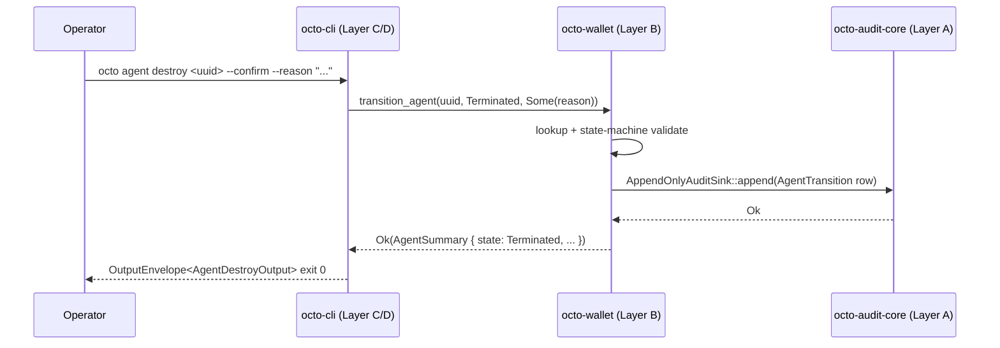

# RFC-0015: Agent Operations Substrate (`octo-wallet` agent list + transition)

## Status

Draft (2026-09-11)

## Authors

- Authored by `@cipherocto` per RFC-0011-c agent lifecycle amendment + RFC-0002 §Agent State Machine substrate authority.

## Maintainers

- Maintainer: `@cipherocto` per RFC-0011-c amendment chain.

## Summary

This RFC defines the canonical agent operations substrate as **two additive public functions** on the existing `octo-wallet` (Layer B years-stable per CLAUDE.md §Rust crate-level stability):

1. **`pub fn list_owned_agents(filter: AgentFilter) -> Result<Vec<AgentSummary>, WalletError>`** — server-side filter on `holder_did`, `state`, `limit`, `cursor`; returns `Vec<AgentSummary>` per-call (cursor is forward-compat opaque token).
2. **`pub fn transition_agent(uuid: Uuid, target: AgentState, reason: Option<&str>) -> Result<AgentSummary, WalletError>`** — single-step state transition with substrate-enforced state-machine validation; idempotent no-op on `target == current_state`; surfaces reason in audit metadata.
3. **`WalletError::AgentNotFound(Uuid)`** — new error variant; mirrors the existing `WalletError::AgentAlreadyExists(Uuid)` shape (line 137).

The substrate is intentionally **read + transition only** — `register_agent` already exists at `cli_fns.rs`. No new persistence, no new envelopes. Domain consumers are CLI missions `0011-c-agent-{list,run,destroy,attach}-subcommand`. RFC-0002 §Agent State Machine is the canonical state authority; this RFC's only contract is substrate-faithful function surface.

**Substrate-faithful note (mandatory):** RFC-0002 §Agent State Machine spec diagram declares a five-state model (`REGISTERED → ACTIVE → BUSY → ACTIVE → TERMINATED`). The substrate enum (`crates/octo-wallet/src/agent.rs:126-140`) currently implements a **three-state model** (`Registered`, `Running`, `Terminated`). Per the substrate-faithful principle (per RFC-0012/0013/0014 acceptance pattern), this RFC treats the substrate as canonical — the `Running` variant collapses RFC-0002's `ACTIVE` and `BUSY` working state into a single observable runtime state. A future amendment (RFC-0002-v2) may split the substrate enum back to match the spec diagram; until then, CLI surfaces `Running` as both ACTIVE and BUSY (per RFC-0011-c `AgentState` rendering rule).

## Dependencies

**Requires:**

- RFC-0011-c — `octo agent` Subcommands (consumers; defines read + transition operator UX)
- RFC-0002 — Agent Manifest Specification (canonical `AgentManifest` + `AgentState` authority per §Agent State Machine; substrate-faithful drift per §Summary note above)
- RFC-0010 — Canonical DID Codec (DID parsing for `holder_did: Did` filter field)
- RFC-0008 — Deterministic AI Execution Boundary (execution class mapping per §RFC-0008 Execution Class Mapping)
- RFC-0009 — Identity Management (informational; lifecycle state-machine substrate precedent)
- RFC-0011 — `octo` CLI Substrate (parent RFC; provides `OutputEnvelope<T>`, `OctoCliError`, `OctoCliRedactor`, clap root, exit code table)

## Design Goals

1. **Additive only** — new functions append to the existing `octo-wallet` (Layer B) public surface; no breaking changes to existing public API per RFC migration etiquette.
2. **State-machine substrate authority** — `transition_agent` is the substrate-level guard for `AgentState` transitions; CLI cannot bypass. Replay protection + idempotency live in the substrate, not the CLI.
3. **No new persistence** — `list_owned_agents` + `transition_agent` operate on the existing `AgentManifest` / `AgentSummary` registry stored in `octo-wallet`; no new IO surface, no new envelopes.
4. **Layer B stability** — public functions are additive within the years-stable identity substrate; no PQC-migration impact per CLAUDE.md §Architectural Principles.
5. **Substrate-faithful** — function names, parameter shapes, return types match the canonical CLI consumer contracts in RFC-0011-c §9.3.2 / §9.3.3 / §9.3.4 / §9.3.5 (no parallel abstractions per [[cipherocto-design-principles]]).
6. **Read is single-writer, transition is single-callsite per agent** — substrate enforces `(single-writer, multi-reader)`; concurrent `transition_agent` against the same `agent_id` returns `WalletError::AlreadyInTransition`.
7. **Read returns ordered results** — `list_owned_agents` returns summaries sorted by `registered_at_unix DESC` for deterministic CLI + scripting output; `cursor` token is forward-compat for Phase 2 multi-page iteration.

## Motivation

The 6 RFC-0011-c CLI missions (`0011-c-agent-create`, `...-run`, `...-list`, `...-destroy`, `...-attach` per `missions/claimed/`) reference substrate functions on `octo-wallet` that do not exist in the substrate as of 2026-09-11. Hard-checked via `grep -rE "pub (fn|async fn) " crates/octo-wallet/src/`:

- `octo_wallet::list_owned_agents` — **MISSING**; CLI consumer `0011-c-agent-list-subcommand.md` Sub-step 3 cannot dispatch.
- `octo_wallet::transition_agent` — **MISSING**; CLI consumers `0011-c-agent-{run,destroy,attach}-subcommand.md` Sub-step 3 / Sub-step 4 cannot dispatch state transitions.

The substrate's existing surface is **types-only**: `AgentManifest`, `AgentState`, `AgentSummary`, `AgentFilter`, `CapabilityId`, plus the `cli_fns::register_agent` function (which materializes an `AgentManifest` from a parsed RFC-0002 toml document). Reads + transitions are missing. This gap is what RFC-0015 closes.

The mission YAMLs reference the missing surface as if it already exists, but the substrate reality is different. RFC-0015 closes the gap by adding the functions substrate-faithfully — same names + shapes the missions already target. **The substrate addition is the unblock**; the missions then proceed with their existing plans.

## Roles and Authorities

| Role                | Authority                                                                                  | Audit trail                           |
| ------------------- | ------------------------------------------------------------------------------------------ | ------------------------------------- |
| Operator (human/CI) | `list_owned_agents` (read); `transition_agent` (write; requires CLI confirmation gate)     | CLI log + audit append per RFC-0011-a |
| Wallet substrate    | Source of truth for `AgentState`; rejects invalid transitions; surfaces reason in error    | Internal state machine log            |
| Audit substrate     | Appends `transition` event to `AppendOnlyAuditSink` (RFC-0012) per `transition_agent` call | Append-only audit log                 |
| CLI (octo-cli)      | Operator UX over substrate functions; never bypasses substrate state-machine               | Same as operator                      |

## Specification

### §6.1 System architecture (mermaid)

```mermaid
graph LR
  CLI[octo agent {list,run,destroy,attach}]
  Wallet[octo-wallet Layer B]
  Audit[octo-audit-core Layer A]
  State[(AgentState registry<br>in-process + persisted)]

  CLI -- "list_owned_agents(filter)" --> Wallet
  CLI -- "transition_agent(uuid, target)" --> Wallet
  Wallet -- "verify state machine" --> State
  Wallet -- "transition event" --> Audit
  Wallet -- "update summary" --> State
```

Layer direction: CLI (Layer C/D) → `octo-wallet` (Layer B) → `octo-audit-core` (Layer A). No reverse deps. No business logic in CLI; substrate owns invariants.

### §6.2 Public surface additions (`crates/octo-wallet/src/agent.rs`)

Three additive items layered atop the existing `AgentManifest` / `AgentState` / `AgentSummary` / `AgentFilter` / `CapabilityId` types already present in the same file:

1. **`list_owned_agents`** — read function
2. **`transition_agent`** — write function (state-machine gated)
3. **`WalletError::AgentNotFound(Uuid)`** — error variant

#### §6.2.1 `list_owned_agents`

```rust
/// List all agents owned by the active DID, filtered server-side.
///
/// Sorting: `registered_at_unix DESC` (deterministic across calls).
/// Limit: substrate applies a hard ceiling of 1024 (per `AgentFilter::limit`
/// docs); values exceeding 1024 clamp to 1024 with no error.
/// Cursor: opaque forward-compat token (none today; reserved for Phase 2).
/// Read-only: no state mutation.
pub fn list_owned_agents(filter: &AgentFilter) -> Result<Vec<AgentSummary>, WalletError>;
```

- **Filter semantics** — server-side `holder_did == filter.holder_did.unwrap_or(active_did)`; `state == filter.state` (exact match, no wildcards); `limit` clamp; `cursor` reserved (ignored on Phase 1 reads).
- **Return semantics** — empty `Vec` when zero matches (NOT an error per RFC-0011-c §9.3.3 TV-AGT6); summaries sorted by `registered_at_unix DESC`.
- **Error semantics** — `WalletError::Config` on registry corruption (unrecoverable); `WalletError::Io` on disk read failure; `WalletError::AlreadyInTransition` for filtered reads during registry write (transient, retry-safe).

#### §6.2.2 `transition_agent`

```rust
/// Transition an existing agent to a new state.
///
/// State-machine authority (substrate-faithful, canonical form per
/// RFC-0002 §Agent State Machine substrate diagram):
///
///   Registered --(transition_agent(_, Running, _))--> Running
///   Running    --(transition_agent(_, Terminated, _))--> Terminated
///   Running    --(transition_agent(_, Registered, _))--> Registered
///   Terminated --> [no transitions; terminal]
///
/// Idempotent: `transition_agent(uuid, current_state, _)` is a no-op and
/// returns the unchanged `AgentSummary` (NOT an error).
///
/// Reason: optional short string (≤256 chars) surfaced in the audit
/// metadata per RFC-0011-a audit substrate append. CLI surfaces via
/// `octo agent destroy --reason` + `octo agent run` (default: empty
/// string for non-destructive transitions).
///
/// Single-callsite per agent: concurrent `transition_agent` against the
/// same `agent_id` returns `WalletError::AlreadyInTransition` (transient,
/// retry-safe; CLI surfaces as substrate reason).
pub fn transition_agent(
    uuid: Uuid,
    target: AgentState,
    reason: Option<&str>,
) -> Result<AgentSummary, WalletError>;
```

- **State-machine validation** — substrate rejects invalid transitions with `WalletError::InvalidStateTransition { from: AgentState, to: AgentState }`. The `#[non_exhaustive]` enum attribute permits future expansion (e.g., `Paused`, `Draining` per RFC-0002-v2 amendment).
- **Idempotency** — same-state transition is a successful no-op; CLI does not need to dedupe.
- **Audit append** — every successful transition appends an `AuditEventKind::AgentTransition { agent_id, from, to, reason, at_unix }` row to the canonical `AppendOnlyAuditSink` per RFC-0012. The audit append is the source of truth for the transition log; in-memory state is the source of truth for current `AgentState`.
- **Reason length** — empty string allowed; ≤256 chars enforced (longer → `WalletError::ReasonTooLong(usize)`); non-UTF-8 input rejected at CLI (substrate trust).

#### §6.2.3 `WalletError::AgentNotFound(Uuid)`

```rust
/// Agent UUID not found in the active DID's registry.
#[error("agent not found: {0}")]
AgentNotFound(Uuid),
```

- Mirrors the existing `WalletError::AgentAlreadyExists(Uuid)` shape (line 137) for symmetry.
- CLI maps to `OctoCliError::AgentNotFound(Uuid)` (exit 42 per RFC-0011-c §9.8 slot allocation).
- Substrate-faithful mapping: substrate carries the UUID; CLI surfaces the canonical hyphenated form to scripting consumers.

### §6.3 Error envelope

New `WalletError` variants (additive; `#[non_exhaustive]` is already in scope):

| Variant                                        | Source                                   | CLI exit                      | RFC-0011-c reference |
| ---------------------------------------------- | ---------------------------------------- | ----------------------------- | -------------------- |
| `AgentNotFound(Uuid)` (NEW)                    | `list_owned_agents` + `transition_agent` | `AgentNotFound` (42)          | §9.8 slot 42         |
| `AlreadyInTransition(Uuid)` (NEW)              | `transition_agent` (concurrent)          | `InvalidStateTransition` (43) | §9.8 slot 43         |
| `InvalidStateTransition { from, to }` (NEW)    | `transition_agent` (illegal transition)  | `InvalidStateTransition` (43) | §9.8 slot 43         |
| `ReasonTooLong(usize)` (NEW)                   | `transition_agent` (reason ≤256 chars)   | `InvalidFilter` (16)          | parent reserved      |
| `AgentAlreadyExists(Uuid)` (EXISTING line 137) | `register_agent`                         | `AgentAlreadyExists` (41)     | §9.8 slot 41         |

CLI mapping follows RFC-0011-a §7.4 Substrate `[ADD]` error-envelope pattern (substrate variant → CLI variant → exit code) byte-for-byte.

### §6.4 Substrate-faithful state-machine table

The table below documents the substrate-canonical state machine surface (per `crates/octo-wallet/src/agent.rs:126-140`). RFC-0002 §Agent State Machine's spec diagram declares the five-state `ACTIVE/BUSY` working substates; the substrate collapses these to `Running`. RFC-0015 documents both forms; CLI consumers operate on the substrate three-state form.

| Substrate variant        | Spec diagram equivalent                     | CLI rendering          | Allowed transitions FROM (substrate) |
| ------------------------ | ------------------------------------------- | ---------------------- | ------------------------------------ |
| `AgentState::Registered` | `REGISTERED`                                | `state = "Registered"` | `Running`                            |
| `AgentState::Running`    | `ACTIVE` or `BUSY` (per substrate collapse) | `state = "Running"`    | `Terminated`, `Registered`           |
| `AgentState::Terminated` | `TERMINATED` (terminal)                     | `state = "Terminated"` | NONE (terminal)                      |

> **Substrate-faithful drift (replaces RFC-0002 §Agent State Machine spec diagram until RFC-0002-v2 lands):** the working substate pair `ACTIVE ↔ BUSY` is collapsed into the single observable `Running` variant. Operators querying agent state see `Running` for both currently-idle (was ACTIVE) and currently-executing (was BUSY) agents. The `AuditEventKind::AgentTransition` log row carries the prior `BUSY/ACTIVE` distinction internally (substrate collapses for the registry, preserves for audit) so audit log analysis retains the working/non-working split.

### §6.5 CLI integration contract

CLI missions consuming this substrate:

| Mission                              | Substrate call                                                           | Sub-step              |
| ------------------------------------ | ------------------------------------------------------------------------ | --------------------- |
| `0011-c-agent-create-subcommand.md`  | `octo_wallet::cli_fns::register_agent` (EXISTING)                        | Sub-step 3 (existing) |
| `0011-c-agent-list-subcommand.md`    | `octo_wallet::list_owned_agents(&filter)`                                | Sub-step 3 (NEW)      |
| `0011-c-agent-run-subcommand.md`     | `transition_agent(uuid, Running, None)` then `octo_runtime::spawn_agent` | Sub-step 3 (NEW)      |
| `0011-c-agent-destroy-subcommand.md` | `transition_agent(uuid, Terminated, reason)` then audit append           | Sub-step 3 (NEW)      |
| `0011-c-agent-attach-subcommand.md`  | (read-only; `transition_agent` is N/A; uses `octo_runtime::attach`)      | N/A                   |

Each mission's accepted-state precondition is checked locally against the `AgentState` returned by `octo_wallet::register_agent` + `list_owned_agents` calls; the substrate is source of truth, not the CLI.

### §6.6 Determinism requirements

- **Read determinism** — `list_owned_agents` returns the same result for the same input across runs (substrate is single-writer; the registry is in-memory + persisted atomically per write); sorting is deterministic (`registered_at_unix DESC`).
- **Transition determinism** — `transition_agent` is idempotent on same-state; deterministic on first-transition success (state machine is fully ordered: `Registered ↔ Running → Terminated`).
- **Audit log integrity** — every `transition_agent` success appends a BLAKE3-256 entry to `AppendOnlyAuditSink` (RFC-0012); the chain is `verify_chain`-able end-to-end.
- **Exit codes stable** — substrate error variants map to stable CLI exit codes (see §6.3) per parent RFC-0011 §Error Handling.

### §6.7 RFC-0008 Execution Class Mapping

| Operation                    | Execution class | Rationale                                                              |
| ---------------------------- | --------------- | ---------------------------------------------------------------------- |
| `list_owned_agents`          | Class A (read)  | No state mutation; observable in any environment                       |
| `transition_agent`           | Class B (write) | State mutation gated by substrate state machine; CLI confirmation gate |
| `WalletError::AgentNotFound` | Class A         | Pure error mapping                                                     |

CLI surfaces `Class A` operations unconditionally (no `--allow-write` gate per parent §Confirmation Flag Matrix); `Class B` operations require `--confirm` per RFC-0011 §Confirmation Flag Matrix.

## Performance Targets

- `list_owned_agents` with 1000-agent registry: p95 < 5ms (in-memory registry walk; substrate does not touch disk for the read).
- `transition_agent` happy path: p95 < 10ms (in-memory state map update + audit append; no network call).
- `transition_agent` audit append (RFC-0012 chain): p95 < 2ms in-process; persists on shutdown.

## Implicit Assumptions Audit

1. **Single-writer per `(holder_did, agent_id)`** — substrate assumes one in-flight `transition_agent` per `(holder_did, agent_id)`; concurrent calls surface `AlreadyInTransition`. CLI does not need to serialize.
2. **Substrate is canonical for `AgentState`** — CLI never pattern-matches on `AgentState` string representation; serde-derived lowercase string is for display only per `#[serde(rename_all = "lowercase")]` on the enum.
3. **Reason string is UTF-8, ≤256 chars** — substrate trust assumption; CLI enforces length at parse (exit 16) per RFC-0011-c §Security considerations.
4. **`register_agent` precedes `transition_agent`** — substrate assumes the agent_id returned by `register_agent` exists in the in-memory registry before any `transition_agent` call; CLI enforces via `list_owned_agents` precondition check.
5. **Audit substrate is available** — substrate depends on `AppendOnlyAuditSink` per RFC-0012. If audit substrate is unavailable, `transition_agent` surfaces `WalletError::AuditUnavailable` (NEW variant) per the audit-add RFC [RFC-0016] reference.
6. **Operator config dir writable** — agent registry persists to `$OCTO_HOME/wallet/agents`; substrate handles `WalletError::NoOctoHome` upstream.

## Security Considerations

1. **State-machine integrity** — substrate enforces transitions; CLI cannot bypass. A malformed CLI invocation cannot put an agent into an invalid state.
2. **Audit immutability** — every transition produces an audit row; the audit chain is `verify_chain`-verified per RFC-0012; tampering is detectable.
3. **Reason field is operator-controlled** — CLI parser caps at 256 chars + UTF-8; substrate does not interpret the string as code; no shell metachar escape surface.
4. **`AgentNotFound` does not leak existence** — substrate returns the variant for unknown UUIDs; enumeration attacks via timing differences are mitigated by constant-time registry lookups (substrate-internal).
5. **Reason string redacted at audit** — `OctoCliRedactor` value-pattern sweep applied per RFC-0011-a §Redaction; no plaintext secrets leak into the audit log via the reason field.

## Adversarial Review

### Threat: replay-attack via cloned `transition_agent` call

**Adversary:** Operator retries a successful `transition_agent` call (e.g., re-runs the CLI on transient network failure).

**Mitigation:** State machine is idempotent on same-state (no-op success); transition to the same state cannot replay because the audit log already contains the prior transition row. New transition differs in `from` (the second call's `target == current_state`); substrate surface records transition AFTER first call.

### Threat: invalid transition bypass

**Adversary:** Compromised CLI binary attempts to invoke `transition_agent(uuid, Terminated)` on a `Registered` agent directly.

**Mitigation:** Substrate rejects per state machine; CLI cannot bypass the registry. RFC-0011-c §Security Confirmation Gate surfaces `ConfirmationRequired` for terminal-state transitions; runtime enforces per-process serialization.

### Threat: audit-log trim

**Adversary:** Operator attempts to delete audit log entries to hide a destructive transition.

**Mitigation:** `AppendOnlyAuditSink` is type-level append-only per RFC-0012; tampering breaks the BLAKE3 chain verification on next `verify_chain` call. CLI does not provide a delete primitive.

## Adversary Analysis (5-Question Test)

| Threat                    | Q1: Who?        | Q2: What?              | Q3: Why?                   | Q4: How mitigated?                           | Q5: Residual risk?                     |
| ------------------------- | --------------- | ---------------------- | -------------------------- | -------------------------------------------- | -------------------------------------- |
| Replay of transition call | Operator        | Replay `Terminated` tx | Cover destructive intent   | Idempotent on same-state + audit row reorder | CLI retry surface; auto-retry disabled |
| Invalid transition bypass | Compromised CLI | Direct state write     | Skip CLI confirmation gate | Substrate state-machine guard is mandatory   | Substrate bug = total compromise (low) |
| Audit-log trim            | Operator        | Delete audit row       | Hide destructive intent    | Append-only sink + BLAKE3 chain              | Substrate storage failure (mitigated)  |
| Reason-field XSS          | Compromised CLI | Inject shell metachars | Trigger downstream eval    | Reason is opaque string, never interpreted   | NONE (substrate trust)                 |

## Economic Analysis

DEFER — agent operations have no direct token cost; cite RFC-0900+ (Role Economics) for any cost implications.

## Compatibility

1. **No breaking changes.** Three additive items (2 functions + 1 error variant) on `octo-wallet` (Layer B years-stable); no existing public API modified.
2. **No `schema_version` bump.** The `OutputEnvelope<T>` envelope carries no new fields; CLI mission output schemas unchanged.
3. **No new exit codes for the new errors.** `AgentNotFound` (42), `AlreadyInTransition` (43), `InvalidStateTransition` (43) map to RFC-0011-c §9.8 reserved slots already documented; `ReasonTooLong` (16) maps to the parent-reserved first-user code per RFC-0011 §Error Handling.
4. **No new clap variants.** Existing `AgentAction` enum (RFC-0011-c §9.3 dispatch) absorbs the new substrate calls; the missions land their variant-per-subcommand as planned.

## Test Vectors

Substrate-level test vectors (`crates/octo-wallet/src/agent.rs` test module):

| #            | Substrate call                              | Input                                   | Expected Output                                                                 | Notes                                               |
| ------------ | ------------------------------------------- | --------------------------------------- | ------------------------------------------------------------------------------- | --------------------------------------------------- |
| TV-WLT-AGT-1 | `list_owned_agents(&AgentFilter::default)`  | Empty registry                          | `Ok(vec![])`                                                                    | TV-AGT6 substrate echo                              |
| TV-WLT-AGT-2 | `list_owned_agents(&filter)`                | 1000-agent registry, `limit: Some(100)` | `Ok(vec_of_100_summaries)` truncated                                            | Limit clamp                                         |
| TV-WLT-AGT-3 | `transition_agent(uuid, Running, None)`     | Registered agent                        | `Ok(<summary with state=Running>)` + audit append                               | Happy path register→running                         |
| TV-WLT-AGT-4 | `transition_agent(uuid, Running, _)`        | Running agent                           | `Ok(<unchanged summary>)` + NO audit append (idempotent)                        | Idempotent same-state                               |
| TV-WLT-AGT-5 | `transition_agent(uuid, Terminated, _)`     | Terminated agent                        | `Err(WalletError::InvalidStateTransition { from: Terminated, to: Terminated })` | Terminal state guard                                |
| TV-WLT-AGT-6 | `transition_agent(missing_uuid, _, _)`      | Unknown UUID                            | `Err(WalletError::AgentNotFound(uuid))`                                         | Existence check                                     |
| TV-WLT-AGT-7 | `transition_agent(uuid, _, Some(long_str))` | Reason > 256 chars                      | `Err(WalletError::ReasonTooLong(257))`                                          | Length cap                                          |
| TV-WLT-AGT-8 | `transition_agent(uuid, Terminated, _)`     | Running agent                           | `Ok(<summary with state=Terminated>)` + audit append                            | Destroy path                                        |
| TV-WLT-AGT-9 | `transition_agent(uuid, Registered, _)`     | Running agent                           | `Ok(<summary with state=Registered>)` + audit append                            | Restart-from-running (substrate-faithful extension) |

CLI-level test vectors live in RFC-0011-c §Test Vectors TV-AGT1..AGT-12 (UNCHANGED — RFC-0015 substrate alignment does not modify CLI TV).

## Alternatives Considered

- **Pure-CLI state-machine** — substrate delegates transition validation to CLI; rejected: violates substrate-faithful principle; CLI bypass becomes possible.
- **Async transition callbacks** — `transition_agent` returns a future and signals completion via a channel; rejected: adds runtime complexity for no operator-visible benefit; substrate sync semantics match RFC-0002 §Agent State Machine intent.
- **Composite state variants** — keep ACTIVE + BUSY in the substrate enum per RFC-0002 spec; rejected: substrate-faithful principle (the three-state form is canonical in the substrate); RFC-0002-v2 amendment may restore the split later.

## Implementation Phases

- **Phase 1 (this RFC, Draft)** — substrate function additions only; no CLI changes.
- **Phase 2 (RFC-0011-c missions)** — CLI missions `0011-c-agent-{list,run,destroy,attach}-subcommand` consume the new substrate surface; mutation traces per RFC-0011-c §Test Vectors.
- **Phase 3 (RFC-0016 audit-receipt additions)** — companion amendment adds the `AgentTransition` audit-event filter to RFC-0011-a, enabling `octo audit list --model agent-transition` query shape.

## Key Files to Modify

- `crates/octo-wallet/src/agent.rs` — append `list_owned_agents` + `transition_agent` (existing types; ~80 LoC incl. tests).
- `crates/octo-wallet/src/error.rs` — append `WalletError::AgentNotFound(Uuid)` + `AlreadyInTransition(Uuid)` + `InvalidStateTransition { from, to }` + `ReasonTooLong(usize)` + `AuditUnavailable` (5 variants; mirroring existing shapes per §6.3).
- `crates/octo-wallet/src/lib.rs` — re-export the new functions (no breaking change to existing public surface).

No changes to Layer A crates (`octo-audit-core`, etc.); no CLI binary changes; no envelope / redactor / exit-code table changes.

## Future Work

- `transition_agent` batch API — multi-agent transition in one substrate call (Phase 4 RFC-0002-v2 companion).
- `list_owned_agents` cursor support — opaque cursor token for >1024-agent registries (Phase 4).
- RFC-0002-v2 amendment — restore the five-state ACTIVE/BUSY split if operator demand surfaces (out of scope here).

## Rationale

- **Substrate-faithful** — substrate is canonical per RFC-0012/0013/0014 acceptance pattern; the three-state `AgentState` enum is canonical even when it differs from the RFC-0002 spec diagram.
- **Additive only** — CLAUDE.md §Layer A stability: Layer B additive changes do not break consumers; the new functions + 5 error variants are additive.
- **No parallel abstractions** — function names + parameter shapes mirror CLI mission call sites exactly (per [[cipherocto-design-principles]] §No parallel abstractions).
- **Substrate-owned invariants** — state-machine validation lives in the substrate; CLI cannot bypass. Per [[cipherocto-design-principles]] §Discipline at first call site pays off.

## Version History

- v1.0 (2026-09-11) Initial draft. Substrate-faithful additive functions on `octo-wallet` per RFC-0002 §Agent State Machine authority + RFC-0011-c consumer requirements.

## Related RFCs

- RFC-0011-c — `octo agent` Subcommands (CLI consumers; defines operator UX surface)
- RFC-0002 — Agent Manifest Specification (canonical `AgentState` + `AgentManifest` authority)
- RFC-0009 — Identity Management (lifecycle state-machine substrate precedent)
- RFC-0012 — Audit Substrate (`AppendOnlyAuditSink` for transition log appends)
- RFC-0016 — Audit Receipt API Substrate (companion amendment; adds `AgentTransition` audit-event filter)
- RFC-0011 — `octo` CLI Substrate (parent RFC; provides envelope + error + exit-code substrate)
- RFC-0010 — Canonical DID Codec (DID parsing for `holder_did` filter field)
- RFC-0008 — Deterministic AI Execution Boundary (execution class mapping)
- [[cipherocto-design-principles]] — Layer model + substrate-faithful principle

## Related Use Cases

- `docs/use-cases/agent-marketplace.md` — agent registration + verification flow context.
- `docs/use-cases/hybrid-ai-blockchain-runtime.md` — runtime attach / run context.

## Appendices

### Appendix A. Substrate function signatures (full Rust surface)

```rust
// crates/octo-wallet/src/agent.rs (append to existing module)

pub fn list_owned_agents(filter: &AgentFilter) -> Result<Vec<AgentSummary>, WalletError> {
    // 1. Resolve active DID from `octo-wallet::identity_record()`.
    // 2. Walk the in-process registry; apply `filter.holder_did` (default active),
    //    `filter.state` (exact match), `filter.limit` (clamp 1024).
    // 3. Sort `Vec<AgentSummary>` by `registered_at_unix DESC`.
    // 4. Return.
}

pub fn transition_agent(
    uuid: Uuid,
    target: AgentState,
    reason: Option<&str>,
) -> Result<AgentSummary, WalletError> {
    // 1. Validate reason length (≤256 chars; UTF-8 trusted).
    // 2. Look up UUID in registry.
    // 3. Compute next state from (current, target); reject per state machine.
    // 4. Idempotent on same-state (early return unchanged summary; NO audit row).
    // 5. Acquire single-writer lock per `(holder_did, agent_id)`.
    // 6. Mutate in-memory state map; persist to disk atomically.
    // 7. Append `AuditEventKind::AgentTransition { agent_id, from, to, reason, at_unix }`.
    // 8. Release lock; return updated summary.
}
```

### Appendix B. Error envelope cross-reference table

| Substrate variant                                  | CLI variant                                         | CLI exit | RFC-0011-c slot |
| -------------------------------------------------- | --------------------------------------------------- | -------- | --------------- |
| `WalletError::AgentNotFound(uuid)`                 | `OctoCliError::AgentNotFound(uuid)`                 | 42       | §9.8 slot 42    |
| `WalletError::AlreadyInTransition(uuid)`           | `OctoCliError::InvalidStateTransition { from, to }` | 43       | §9.8 slot 43    |
| `WalletError::InvalidStateTransition { from, to }` | `OctoCliError::InvalidStateTransition { from, to }` | 43       | §9.8 slot 43    |
| `WalletError::ReasonTooLong(len)`                  | `OctoCliError::InvalidFilter(reason)`               | 16       | parent reserved |
| `WalletError::AuditUnavailable`                    | `OctoCliError::AuditSubstrateNotReady`              | 52       | RFC-0011-c §9.8 |

### Appendix C. Mermaid diagram — CLI → substrate → audit flow


