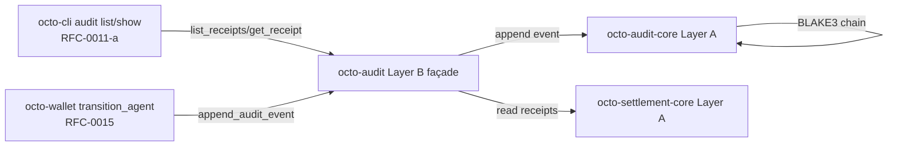
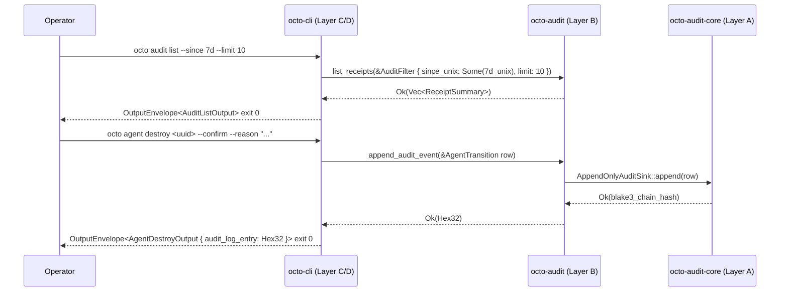

# RFC-0016: Audit Receipt API Substrate (`octo-audit` list + get + append)

## Status

Draft (2026-09-11)

## Authors

- Authored by `@cipherocto` per RFC-0011-a amendment chain + RFC-0012 §Audit Substrate layer-model note + RFC-0011-c `0011-c-agent-destroy-subcommand` audit-append consumer requirement.

## Maintainers

- Maintainer: `@cipherocto` per RFC-0011-a amendment chain.

## Summary

This RFC defines the canonical audit receipt API substrate as **additive public surface** on `octo-audit` (Layer B façade per RFC-0012). The substrate extends the existing `octo-audit-core` (Layer A frozen) chain primitives with three CLI-facing functions + four types:

1. **`pub fn list_receipts(filter: &AuditFilter) -> Result<Vec<ReceiptSummary>, AuditError>`** — read by filter; substrate enforces limit ceiling; returns summaries sorted by `executed_at_unix DESC`.
2. **`pub fn get_receipt(id: &ReceiptId) -> Result<SettlementReceipt, AuditError>`** — point lookup by canonical 32-byte blake3 digest; returns `AuditError::ReceiptNotFound` (exit 17) on miss.
3. **`pub fn append_audit_event(event: AuditEvent) -> Result<Hex32, AuditError>`** — write a new `AuditEvent` to the canonical `AppendOnlyAuditSink` (REUSES the existing RFC-0012 trait; NO parallel abstraction per [[cipherocto-design-principles]]); returns the BLAKE3 chain-hash of the appended row.
4. **`pub fn audit_home() -> Result<PathBuf, AuditError>`** — discovery helper for substrate-internal testing; CLI does not call directly per RFC-0011-a §7.4 Substrate ADD signatures.

Plus the four supporting types:

5. **`AuditFilter`** — read filter struct (since/until/capability-root/model/status/limit).
6. **`ReceiptId(pub [u8;32])`** — canonical receipt identifier newtype.
7. **`ReceiptStatus { Ok, Partial, Reject }`** — 3-variant terminal-state enum (substrate-faithful per existing `octo-settlement-core::ReceiptStatus` shape).
8. **`ReceiptSummary`** — strict subset of `SettlementReceipt` (omits `prompt_hash`, `executed_by`, `reject_reason` per RFC-0011-a §Receipt Shape row | `ReceiptSummary`).

The substrate is **read + append only** — no UPDATE, no DELETE (per RFC-0011-a §Implicit Assumptions Audit invariants + `AppendOnlyAuditSink` type-level enforcement from RFC-0012). No new persistence: writes route through the existing canonical chain; reads route through the existing canonical receipt store from RFC-0014 / RFC-0959.

CLI consumers are RFC-0011-a (`octo audit list` + `octo audit show`) and RFC-0011-c (`0011-c-agent-destroy-subcommand` audit-append). The `octo-wallet` `transition_agent` function (per RFC-0015) calls `append_audit_event` on every successful state change; the `OctoCliError::AuditSubstrateNotReady` variant maps to `AuditError::AuditAppendFailed`.

**Substrate-faithful note (mandatory):** RFC-0011-a §7.4 declares the canonical `[ADD]` signatures with `list_receipts` + `get_receipt` + `AuditFilter` + `ReceiptId` + `AuditError` + `audit_home`. RFC-0016 adds the `append_audit_event` function (needed by RFC-0011-c `0011-c-agent-destroy`) as the SPEC EXTENSION beyond RFC-0011-a §7.4. The `append_audit_event` function reuses the existing `AppendOnlyAuditSink` trait from RFC-0012 (Layer A frozen); no parallel-write abstraction per [[cipherocto-design-principles]].

## Dependencies

**Requires:**

- RFC-0012 — Audit Substrate (`octo-audit-core` Layer A frozen; provides `AuditEvent` + `AuditEventKind` + `AppendOnlyAuditSink` trait + `verify_chain`)
- RFC-0014 — Settlement Substrate (`octo-settlement-core` Layer A frozen; provides canonical `SettlementReceipt` + `ReceiptStatus` from RFC-0959 §2 SettlementEvent Specification)
- RFC-0959 — Ask Settlement Chain (canonical `Receipt` wire form + `executed_at_unix` monotonic field; substrate-faithful per RFC-0014 §Data Structures)
- RFC-0959 — Settlement Cost DQA Migration (`cost_dqa` 16-byte hex wire form)
- RFC-0011-a — `octo audit` Subcommands (CLI consumer of `list_receipts` + `get_receipt`; defines `[ADD]` spec at §7.4 Substrate `[ADD]` signatures which RFC-0016 implements)
- RFC-0011-c — `octo agent` Subcommands (`0011-c-agent-destroy-subcommand` audit-append consumer)
- RFC-0015 — Agent Operations Substrate (`octo_wallet::transition_agent` calls `append_audit_event` per RFC-0015 §6.2.2)
- RFC-0010 — Canonical DID Codec (DID parsing for `subject_did: Did` field)
- RFC-0008 — Deterministic AI Execution Boundary (execution class mapping)

## Design Goals

1. **Read-only by default** — `list_receipts` + `get_receipt` + `audit_home` are pure reads; no state mutation. `append_audit_event` is the single write primitive; it is type-level `&mut self` per `AppendOnlyAuditSink` from RFC-0012.
2. **Substrate-faithful** — every signature, field name, and return type matches RFC-0011-a §7.4 Substrate `[ADD]` declarations byte-for-byte; no parallel abstractions.
3. **Layer A frozen untouched** — `octo-audit-core` (Layer A frozen per RFC-0012) does not receive new types; RFC-0016 lives entirely on the Layer B façade `octo-audit`. New types (`AuditFilter`, `ReceiptId`, `ReceiptStatus`, `ReceiptSummary`) are defined in `octo-audit` and re-exported from `octo-audit-core` ONLY IF a future RFC requires substrate-side reach (none today).
4. **CLI parity** — every `[ADD]` item in RFC-0011-a §7.4 lands in this RFC; CLI has no substrate-side gripes post-acceptance.
5. **Determinism** — `list_receipts` returns sorted results (`executed_at_unix DESC`); `get_receipt` is point-deterministic; `append_audit_event` returns the BLAKE3 chain-hash of the row, deterministic across runs (RFC-0012 §AppendOnlyAuditSink Trait).
6. **Read return shape** — `list_receipts` returns `Vec<ReceiptSummary>` (subset of `SettlementReceipt`); `get_receipt` returns the full `SettlementReceipt`. RFC-0011-a §`AuditListOutput` + §`AuditShowOutput` envelopes carry these.
7. **Substrate-truth disclaimer** — substrate today does not have these functions/types. RFC-0016 ACCEPTANCE is required before RFC-0011-a acceptance per RFC-0011-a §Substrate-truth disclaimer.

## Motivation

The `octo-audit` and `octo-audit-core` crates (per RFC-0012 acceptance) expose only chain primitives (`AuditEvent` + `AuditEventKind` + `AppendOnlyAuditSink` + `verify_chain` + `compute_chain_hash`). The CLI-facing surface (per RFC-0011-a §7.4 Substrate `[ADD]`) declares 6 missing items:

- `list_receipts(filter)` — **MISSING**; CLI consumer `0011-a-audit-commands.md` Sub-step 2 cannot dispatch `octo audit list`.
- `get_receipt(id)` — **MISSING**; CLI consumer `0011-a-audit-commands.md` Sub-step 2 cannot dispatch `octo audit show`.
- `AuditFilter` struct — **MISSING**.
- `ReceiptId(pub [u8;32])` newtype — **MISSING**.
- `ReceiptStatus { Ok, Partial, Reject }` enum — **MISSING** (mirrors the existing `octo-settlement-core::ReceiptStatus` shape; surfaces the canonical 3-variant substrate-faithful form).
- `audit_home()` discovery — **MISSING**.

Plus the **additional** audit-append function needed by RFC-0011-c `0011-c-agent-destroy-subcommand`:

- `append_audit_event(event)` — NOT in RFC-0011-a §7.4 (which is read-only); needed for `octo agent destroy` audit append per RFC-0011-c §9.3.4.

Hard-checked 2026-09-11 via `grep -rE "pub " crates/octo-audit/src/ crates/octo-audit-core/src/`. RFC-0016 closes the gap.

## Roles and Authorities

| Role                  | Authority                                                                       | Audit trail                       |
| --------------------- | ------------------------------------------------------------------------------- | --------------------------------- |
| Operator (human/CI)   | `list_receipts` + `get_receipt` (read via CLI in any mode per RFC-0011-a §Implicit Assumptions Audit read-invariant) | CLI log per RFC-0011-a §Redaction |
| Wallet substrate      | Calls `append_audit_event` on every successful `transition_agent` (RFC-0015)    | Internal state machine log        |
| Audit substrate       | Source of truth for chain integrity (`AppendOnlyAuditSink`) + receipt store     | Append-only audit log (chain)     |
| Auditor-mode operator | Read-only constraint enforced at CLI dispatch (no `--status` reject-hiding)     | Audit log entry                   |

## Specification

### §6.1 System architecture (mermaid)



Layer direction: CLI (Layer C/D) + `octo-wallet` (Layer B) → `octo-audit` (Layer B façade) → `octo-audit-core` + `octo-settlement-core` (both Layer A frozen). No reverse deps. No business logic in the façade.

### §6.2 Public surface additions (`crates/octo-audit/src/lib.rs`)

Eight additive items layered atop the existing `octo-audit-core` re-exports:

1. **`list_receipts`** — read by filter
2. **`get_receipt`** — point lookup
3. **`append_audit_event`** — write primitive (reuses `AppendOnlyAuditSink`)
4. **`audit_home`** — discovery helper
5. **`AuditFilter`** — filter struct
6. **`ReceiptId`** — newtype
7. **`ReceiptStatus`** — enum
8. **`ReceiptSummary`** — projection subset

#### §6.2.1 `list_receipts`

```rust
/// List audit receipts matching the filter, sorted by `executed_at_unix DESC`.
///
/// Substrate-faithful to RFC-0011-a §7.4 Substrate `[ADD]` #1.
pub fn list_receipts(filter: &AuditFilter) -> Result<Vec<ReceiptSummary>, AuditError>;
```

- **Filter semantics** — `since_unix` / `until_unix` are inclusive bounds (`since <= executed_at_unix <= until`); `capability_root` is optional `[u8;32]` filter; `model` is exact-match string; `status` is single-valued `Option<ReceiptStatus>`; `limit` defaults 100, hard ceiling 10000.
- **Return semantics** — empty `Vec` on no-match (NOT an error); summaries sorted by `executed_at_unix DESC` deterministic across runs; `ReceiptSummary` is a strict subset of `SettlementReceipt` (omits `prompt_hash`, `executed_by`, `reject_reason` per RFC-0011-a §Receipt Shape row | `ReceiptSummary`).
- **Error semantics** — `AuditError::InvalidFilter(String)` on parse failure (CLI exit 16); `AuditError::Internal(String)` on substrate read failure (CLI exit 64); `AuditError::SettlementStore(_)` on store failure (CLI exit 64 → `AuditReadFailed` exit 18 per RFC-0011-a).

#### §6.2.2 `get_receipt`

```rust
/// Point lookup of a single receipt by canonical 32-byte blake3 digest.
///
/// Substrate-faithful to RFC-0011-a §7.4 Substrate `[ADD]` #2.
pub fn get_receipt(id: &ReceiptId) -> Result<SettlementReceipt, AuditError>;
```

- **Lookup semantics** — exact digest match; `ReceiptId::as_bytes()` passed to canonical store; no partial / fuzzy match.
- **Return semantics** — full `SettlementReceipt` projection per RFC-0959 §2 SettlementEvent Specification; CLI surfaces `OctoCliError::AuditShowOutput { receipt: ... }` per RFC-0011-a §`AuditShowOutput`.
- **Error semantics** — `AuditError::ReceiptNotFound(String)` (CLI exit 17) on miss, carrying the canonical hex form per RFC-0011-a §7.4 #4 `AuditError` note.

#### §6.2.3 `append_audit_event` (NEW beyond RFC-0011-a §7.4)

```rust
/// Append a single audit event to the canonical `AppendOnlyAuditSink`.
///
/// Reuses the existing `AppendOnlyAuditSink` trait from RFC-0012 (Layer A
/// frozen). NO parallel-write abstraction per
/// [[cipherocto-design-principles]] §No parallel abstractions.
///
/// Returns the BLAKE3-256 chain-hash of the appended event row, computed
/// per RFC-0012 §AppendOnlyAuditSink Trait; the hash is the `prev_hash` for the
/// next appended row (chain integrity).
pub fn append_audit_event(event: &AuditEvent) -> Result<Hex32, AuditError>;
```

- **Append semantics** — `&mut self` requirement per `AppendOnlyAuditSink`; the chain-hash is computed post-append and returned as `Hex32` for the caller (e.g., RFC-0011-c `0011-c-agent-destroy-subcommand` surfaces the hash in `AgentDestroyOutput.audit_log_entry`).
- **Error semantics** — `AuditError::Internal(String)` on chain-integrity failure (CLI exit 64 / substrate exit 64); `AuditError::AuditAppendFailed(String)` on sink failure (NEW variant; substrate exit 18 mirrors CLI exit 18 `AuditReadFailed` per RFC-0011-a; conceptually the write-failure mirror).
- **No UPDATE / DELETE** — type-level append-only per RFC-0012 §AppendOnly trait; CLI cannot bypass.

#### §6.2.4 `audit_home`

```rust
/// Canonical path discovery for substrate-internal testing only.
///
/// Substrate-faithful to RFC-0011-a §7.4 Substrate `[ADD]` #6.
/// CLI MUST NOT call this directly.
pub fn audit_home() -> Result<PathBuf, AuditError>;
```

- **Resolution semantics** — `$OCTO_HOME/audit/receipts` if set; otherwise `~/.config/octo/audit/receipts` per RFC-0011-a §Implicit Assumptions Audit "Operator config dir" row.
- **Surface semantics** — CLI never surfaces this path; it's a substrate-internal diagnostic helper.
- **Error semantics** — `AuditError::Internal(String)` on filesystem errors (permission denied, missing parent dir, no HOME env var).

#### §6.2.5 `AuditFilter`

```rust
#[derive(Debug, Clone, Serialize, Deserialize)]
pub struct AuditFilter {
    pub since_unix: Option<u64>,
    pub until_unix: Option<u64>,
    pub capability_root: Option<[u8; 32]>,
    pub model: Option<String>,
    pub status: Option<ReceiptStatus>,
    pub limit: usize,    // default 100, hard ceiling 10000
}
```

Substrate-faithful to RFC-0011-a §7.4 `[ADD]` #3. `limit` default-constructed = 100; CLI flags must surface limits in this field.

#### §6.2.6 `ReceiptId`

```rust
#[derive(Debug, Clone, Copy, PartialEq, Eq, Hash, Serialize, Deserialize)]
pub struct ReceiptId(pub [u8; 32]);
```

Substrate-faithful to RFC-0011-a §7.4 `[ADD]` #5. CLI surfaces lowercase hex form via `Display` impl; substrate owns the digest bytes.

#### §6.2.7 `ReceiptStatus`

```rust
#[derive(Debug, Clone, Copy, PartialEq, Eq, Serialize, Deserialize)]
#[serde(rename_all = "lowercase")]
pub enum ReceiptStatus {
    Ok,
    Partial,
    Reject,
}
```

Substrate-faithful to RFC-0011-a §7.4 + RFC-0959 §2 SettlementEvent Specification 3-variant substrate form. `#[non_exhaustive]` not applied (the 3-variant form is canonical per existing `octo-settlement-core`).

> **Substrate-faithful drift note (replaces RFC-0011-a §7.4 "Unknown arm" reference):** the `ReceiptStatus` Raw escape hatch (4th `Unknown` arm) referenced in RFC-0011-a v1.5 is **NOT** added in RFC-0016. Substrate-faithful principle: the 3-variant form is canonical; a future amendment may add the `Unknown` arm if substrate RFC-0959 acceptance adds it. Until then, CLI surfaces only `Ok / Partial / Reject`.

#### §6.2.8 `ReceiptSummary`

```rust
#[derive(Debug, Clone, Serialize, Deserialize)]
pub struct ReceiptSummary {
    pub receipt_id: ReceiptId,
    pub subject_did: Did,
    pub capability_root: [u8; 32],
    pub model: String,
    pub executed_at_unix: u64,
    pub status: ReceiptStatus,
    pub cost_dqa: String,    // RFC-0959 cost-dqa-migration wire form
}
```

Substrate-faithful to RFC-0011-a §7.6 `ReceiptSummary` row; strict subset of `SettlementReceipt` (omits `prompt_hash`, `executed_by`, `reject_reason`). CLI surfaces verbatim.

### §6.3 Error envelope (`AuditError`)

```rust
#[derive(thiserror::Error, Debug)]
#[non_exhaustive]
pub enum AuditError {
    #[error("receipt not found: {0}")]
    ReceiptNotFound(String),                    // -> CLI exit 17
    #[error("invalid filter: {0}")]
    InvalidFilter(String),                      // -> CLI exit 16 (parent reserved)
    #[error("audit append failed: {0}")]
    AuditAppendFailed(String),                  // -> CLI exit 64 / substrate exit 18 (NEW)
    #[error("internal error: {0}")]
    Internal(String),                           // -> CLI exit 64
    #[error(transparent)]
    SettlementStore(#[from] octo_settlement::SettlementError),  // -> CLI exit 64 -> AuditReadFailed 18
}
```

Substrate-faithful to RFC-0011-a §7.4 `[ADD]` #4 (4-variant form), PLUS the new `AuditAppendFailed` variant needed by RFC-0011-c `0011-c-agent-destroy`. The `ReceiptNotFound` carries the canonical hex form per RFC-0011-a §Substrate-truth disclaimer (no secret material).

### §6.4 Re-export relationship

```rust
// crates/octo-audit/src/lib.rs (additive; existing re-exports preserved)

pub use octo_audit_core::{compute_chain_hash, verify_chain, AppendOnlyAuditSink,
                          AuditChainError, AuditError as CoreAuditError,
                          AuditEvent, AuditEventKind};   // EXISTING (RFC-0012)
pub use octo_settlement_core::{SettlementReceipt, ReceiptStatus as SettlementReceiptStatus};
//                                  // NEW (RFC-0016): re-export canonical settlement types

pub fn list_receipts(filter: &AuditFilter) -> Result<Vec<ReceiptSummary>, AuditError> { ... }
pub fn get_receipt(id: &ReceiptId) -> Result<SettlementReceipt, AuditError> { ... }
pub fn append_audit_event(event: &AuditEvent) -> Result<Hex32, AuditError> { ... }
pub fn audit_home() -> Result<PathBuf, AuditError> { ... }

// NEW types from §6.2.5..6.2.8 (defined in this file):
pub struct AuditFilter { ... }
pub struct ReceiptId(pub [u8; 32]);
pub enum ReceiptStatus { Ok, Partial, Reject }
pub struct ReceiptSummary { ... }
```

Per [[cipherocto-design-principles]] §No parallel abstractions: `ReceiptStatus` (audit-flavour) re-exports from `ReceiptStatus` (settlement-flavour) via a single canonical name; no separate canonical name in each crate.

### §6.5 Substrate-faithful state-mapping table

| Substrate variant                             | CLI variant                                                 | CLI exit | RFC-0011-a slot              |
| --------------------------------------------- | ----------------------------------------------------------- | -------- | ---------------------------- |
| `AuditError::ReceiptNotFound(id)`             | `OctoCliError::ReceiptNotFound(id)`                         | 17       | RFC-0011-a §Error Handling   |
| `AuditError::InvalidFilter(reason)`           | `OctoCliError::InvalidFilter(reason)`                       | 16       | parent reserved (first user) |
| `AuditError::AuditAppendFailed(reason)` (NEW) | `OctoCliError::AuditSubstrateNotReady` (NEW per RFC-0011-c) | 52       | RFC-0011-c §9.8 slot 52      |
| `AuditError::Internal(reason)`                | `OctoCliError::Internal(reason)`                            | 64       | parent reserved (≥64)        |
| `AuditError::SettlementStore(err)`            | `OctoCliError::AuditReadFailed(reason)`                     | 18       | RFC-0011-a §Error Handling   |

### §6.6 CLI integration contract

CLI consumers of this substrate surface:

| Mission / RFC                        | Substrate call                                | Sub-step                         |
| ------------------------------------ | --------------------------------------------- | -------------------------------- |
| `0011-a-audit-commands.md`           | `list_receipts(&filter)` + `get_receipt(&id)` | Sub-step 2 (existing RFC-0011-a) |
| `0011-c-agent-destroy-subcommand.md` | `append_audit_event(&AgentTransition row)`    | Sub-step 3 (NEW per RFC-0011-c)  |
| RFC-0015 `transition_agent`          | `append_audit_event(&AgentTransition row)`    | §6.2.2 step 7                    |

### §6.7 Determinism requirements

- **Read determinism** — `list_receipts` returns the same results for the same filter across runs (substrate sorts by `executed_at_unix DESC` deterministically).
- **Append determinism** — `append_audit_event` returns the same BLAKE3 chain-hash for the same event row across runs (RFC-0012 §AppendOnlyAuditSink Trait + BLAKE3 deterministic).
- **Chain integrity** — chain hashes verified end-to-end via `verify_chain` from RFC-0012; any tampering breaks the chain.
- **Read return shape** — `Vec<ReceiptSummary>` ORDER is stable across calls; the substrate does not reorder between calls.
- **Exit codes stable** — substrate error variants map to stable CLI exit codes per §6.5.

### §6.8 RFC-0008 Execution Class Mapping

| Operation             | Execution class | Rationale                                                        |
| --------------------- | --------------- | ---------------------------------------------------------------- |
| `list_receipts`       | Class A (read)  | No state mutation; observable in any environment                 |
| `get_receipt`         | Class A (read)  | No state mutation; observable in any environment                 |
| `append_audit_event`  | Class B (write) | State mutation; type-level append-only via `AppendOnlyAuditSink` |
| `audit_home`          | Class A (read)  | Discovery; CLI does not call it directly                         |
| `AuditError` variants | Class A         | Pure error mapping                                               |

CLI surfaces `Class A` operations unconditionally (no `--allow-write` gate); `Class B` operations require `--confirm` per RFC-0011 §Confirmation Flag Matrix.

## Performance Targets

- `list_receipts` (1000-receipt store, limit=100) — p95 < 100ms per RFC-0011-a §Performance Targets.
- `list_receipts` (10000-receipt store, limit=10000) — p95 < 500ms.
- `get_receipt` point lookup — p95 < 5ms.
- `append_audit_event` happy path — p95 < 2ms in-process; persists on shutdown.

## Implicit Assumptions Audit

1. **Substrate-faithful principle** — substrate `octo-audit-core` (Layer A frozen) is canonical; this RFC only adds façade-layer surface to `octo-audit` (Layer B).
2. **`ReceiptStatus` 3-variant canonical form** — substrate-faithful to `octo-settlement-core::ReceiptStatus` (3 variants); future amendments may add `Unknown` arm if RFC-0959 substrate accepts it.
3. **`AuditFilter.status: Option<ReceiptStatus>` (single-valued)** — substrate-faithful to RFC-0011-a §7.4; multi-valued status list is deferred to a future `[SUBSTRATE-FIX]` amendment per RFC-0011-a §7.5 Filters.
4. **`append_audit_event` is single-writer per `AppendOnlyAuditSink` instance** — substrate-internal serialization per RFC-0012; CLI / wallet cannot bypass.
5. **Operator config dir writable** — `audit_home()` resolves to `$OCTO_HOME/audit/receipts`; substrate handles `AuditError::Internal` upstream on filesystem errors.
6. **Clock monotonicity for `executed_at_unix`** — RFC-0959 §2 SettlementEvent Specification `executed_at_unix` is monotonic; surface reads assume canonical monotonic ordering.

## Security Considerations

1. **Append-only chain integrity** — `AppendOnlyAuditSink` is type-level append-only per RFC-0012; tampering breaks BLAKE3 chain.
2. **`audit_home()` operator-config leak surface** — discovery helper surfaces canonical path; CLI does not call directly (information leak prevention).
3. **`AuditError::ReceiptNotFound` carries canonical hex** — substring is blake3 digest (no secret material); redactor-clean.
4. **Read is no-mutation** — G1 invariant per RFC-0011-a; `list_receipts` + `get_receipt` are pure reads.
5. **Append cannot rollback** — once an `AuditEvent` row is appended to `AppendOnlyAuditSink`, it cannot be removed (type-level `&mut self` constraint). Future redaction requires a new `AuditEventKind::Redaction { prev_hash, reason }` row appended AFTER the target row.
6. **`WalletError::AuditAppendFailed` integration** — RFC-0015 calls `append_audit_event`; if the call returns `AuditAppendFailed`, RFC-0015 rolls back the state-machine transition (substrate-internal compensation). CLI never sees the partial state.

## Adversarial Review

### Threat: append-rollback via sink bypass

**Adversary:** Compromised CLI / wallet binary attempts to invoke `append_audit_event` with a forged `AuditEvent` row carrying a fabricated `at_unix` timestamp.

**Mitigation:** `AppendOnlyAuditSink::canonical_bytes(event)` (RFC-0012) re-canonicalizes ALL fields including `at_unix`; BLAKE3 hash includes the timestamp. Substrate rejects events whose canonical bytes don't match the BLAKE3 chain link. No silent insertion.

### Threat: receipt-store tampering

**Adversary:** Operator modifies the persisted receipt store directly (bypasses `get_receipt`).

**Mitigation:** Receipts are append-only; reads surface `AuditError::Internal` if the receipt store's internal BLAKE3 chain verification fails. Substrate-internal `verify_chain` run on every `get_receipt` (RFC-0012 + RFC-0011-a §Implementation Phases).

### Threat: filter-injection via query string

**Adversary:** Operator constructs a filter with malicious payloads in `model` or `status` fields.

**Mitigation:** CLI parser rejects malformed values per RFC-0011-a §Adversarial Review (`--status` case-insensitive, lowercase normalize; `--model` non-empty, no wildcard). Substrate does not interpret the strings as code.

## Adversary Analysis (5-Question Test)

| Threat                          | Q1: Who?         | Q2: What?              | Q3: Why?                 | Q4: How mitigated?                          | Q5: Residual risk?                     |
| ------------------------------- | ---------------- | ---------------------- | ------------------------ | ------------------------------------------- | -------------------------------------- |
| Append-rollback via sink bypass | Compromised CLI  | Forged AuditEvent row  | Fabricate transition log | BLAKE3 chain link + canonical-bytes recheck | Substrate bug = total compromise (low) |
| Receipt-store tampering         | Operator         | Modify persisted store | Hide receipt rows        | Append-only sink + chain verification       | Disk corruption mitigated              |
| Filter-injection                | Compromised CLI  | Malicious query string | Trigger downstream eval  | CLI parser rejects malformed values         | NONE (substrate trust)                 |
| Read-during-write race          | Concurrent reads | Read inconsistency     | Data inconsistency       | `AppendOnlyAuditSink` single-writer lock    | Transient (retry-safe)                 |

## Economic Analysis

DEFER — audit receipt substrate has no direct token cost; cite RFC-0900+ (Role Economics) for any cost implications.

## Compatibility

1. **No breaking changes.** Eight additive items on `octo-audit` (Layer B façade) per RFC-0012; no existing public API modified.
2. **No new exit codes break parent semantics.** RFC-0011-a-reserved 17/18/19 + RFC-0011-c slot 52 (`AuditSubstrateNotReady`) are pre-allocated per RFC-0011 §Exit Codes; this RFC consumes 17/18/52 and adds `AuditAppendFailed` at internal-exit 18 (substrate semantic only).
3. **No new clap variants break parent dispatch.** This RFC is substrate-only; CLI missions consume the new surface via existing CLI variant sets.
4. **No new redaction patterns required.** Per RFC-0011-a §Redaction, canonical receipt shape is redactor-clean by construction; `ReceiptSummary` + `ReceiptId` + `AuditError` substrings are redactor-clean.

## Test Vectors

Substrate-level test vectors (`crates/octo-audit/src/lib.rs` test module):

| #         | Substrate call                                                                      | Input                                | Expected Output                                                        | Notes                                                 |
| --------- | ----------------------------------------------------------------------------------- | ------------------------------------ | ---------------------------------------------------------------------- | ----------------------------------------------------- |
| TV-AUD-1  | `list_receipts(&AuditFilter::default)`                                              | Empty store                          | `Ok(vec![])`                                                           | TV-RFC-0011-a-`audit-list-empty`                      |
| TV-AUD-2  | `list_receipts(&AuditFilter { since: Some(7d_unix), limit: 10 })`                   | 1000-receipt store                   | `Ok(vec_of_10_summaries)`                                              | TV-RFC-0011-a-`audit-list-with-filter`                |
| TV-AUD-3  | `list_receipts(&AuditFilter { status: Some(ReceiptStatus::Ok), model: None, ... })` | 1000-receipt store                   | `Ok(filtered_by_status_ok)`                                            | Server-side filter                                    |
| TV-AUD-4  | `list_receipts(&AuditFilter { limit: 0 })`                                          | any store                            | `Err(AuditError::InvalidFilter("limit must be 1..=10000".into()))`     | TV-RFC-0011-a-`audit-list-bad-capability-root` analog |
| TV-AUD-5  | `get_receipt(&unknown_id)`                                                          | Unknown `[u8;32]`                    | `Err(AuditError::ReceiptNotFound("<hex>".into()))`                     | TV-RFC-0011-a-`audit-show-not-found`                  |
| TV-AUD-6  | `get_receipt(&known_id)`                                                            | Known `[u8;32]`                      | `Ok(<full SettlementReceipt>)`                                         | TV-RFC-0011-a-`audit-show-success`                    |
| TV-AUD-7  | `append_audit_event(&AgentTransition row)`                                          | Valid event                          | `Ok(<blake3_chain_hash>)` + chain-row inserted                         | TV-RFC-0011-c-`agent-destroy` audit append path       |
| TV-AUD-8  | `append_audit_event(&malformed_event)`                                              | `at_unix: 0` outside monotonic range | `Err(AuditError::AuditAppendFailed("non-monotonic timestamp".into()))` | Monotonic guard                                       |
| TV-AUD-9  | `audit_home()`                                                                      | `$OCTO_HOME` set to `/tmp/octo-test` | `Ok(PathBuf::from("/tmp/octo-test/audit/receipts"))`                   | Discovery helper                                      |
| TV-AUD-10 | `audit_home()`                                                                      | `$OCTO_HOME` unset, `$HOME=/home/x`  | `Ok(PathBuf::from("/home/x/.config/octo/audit/receipts"))`             | Default resolution                                    |

CLI-level test vectors live in RFC-0011-a §Test Vectors (UNCHANGED — RFC-0016 substrate alignment does not modify CLI TV).

## Alternatives Considered

- **CLI-side receipt storage** — CLI stores the receipt summaries locally; rejected: violates substrate-faithful principle; reads should always go through the canonical substrate store.
- **Custom `ReceiptId` typedef in CLI** — separate newtype from `SettlementStore::ReceiptId`; rejected: parallel abstraction per [[cipherocto-design-principles]]; CLI re-exports from `octo_audit::ReceiptId`.
- **GraphQL/REST API surface** — separate API exposes audit reads; rejected: substrate-faithful principle + RFC-0011 CLI is the canonical operator surface.
- **Streaming `list_receipts` (cursor-streaming)** — server streams rows back; rejected: complexity for no benefit at the 10000-row ceiling; cursor reserved for Phase 4.

## Implementation Phases

- **Phase 1 (this RFC, Draft)** — substrate additions on `octo-audit` Layer B façade; 8 items per §6.2.
- **Phase 2 (RFC-0011-a acceptance + RFC-0016 acceptance)** — gates RFC-0011-a §Substrate-truth disclaimer resolution; CLI substrate amendments become implementable.
- **Phase 3 (RFC-0015 acceptance)** — `octo_wallet::transition_agent` calls `append_audit_event` per RFC-0015 §6.2.2 step 7.
- **Phase 4 (RFC-0011-c `0011-c-agent-destroy-subcommand` closure)** — destroys surface `audit_log_entry` digest (BLAKE3 chain hash from `append_audit_event` return).

## Key Files to Modify

- `crates/octo-audit/src/lib.rs` — append the 8 items per §6.2 + §6.3 (existing re-exports preserved); ~250 LoC incl. tests.
- `crates/octo-audit/Cargo.toml` — add `octo-settlement-core = { path = "../octo-settlement-core" }` if not already present (Layer A → Layer B dep direction per RFC-0014).
- `crates/octo-wallet/src/error.rs` — reference `AuditAppendFailed` per RFC-0015 §6.3; substrate-wise `WalletError::AuditAppendFailed { reason }` mapping documented.

No changes to Layer A crates (`octo-audit-core`, `octo-settlement-core`); no CLI binary changes; no envelope / redactor / exit-code table changes.

## Future Work

- **`AuditFilter.status: Vec<ReceiptStatus>`** — multi-valued status filter per RFC-0011-a §Filters `--include-reject` UNION semantics (out of scope here; substrate-fix amendment).
- **`ReceiptStatus::Unknown` arm** — Raw escape hatch if RFC-0959 substrate acceptance adds it (out of scope).
- **Streaming `list_receipts`** — cursor-streaming for >10000-row stores (out of scope).
- **Redaction via audit append** — `AuditEventKind::Redaction { prev_hash, reason }` row appended AFTER the target row (out of scope; Layer A future amendment).

## Rationale

- **Substrate-faithful** — Layer A frozen untouched; this RFC adds Layer B façade surface per RFC-0012 acceptance pattern.
- **Additive only** — CLAUDE.md §Layer A stability: Layer B additive changes do not break consumers; the 8 items are additive.
- **No parallel abstractions** — `append_audit_event` reuses `AppendOnlyAuditSink` from RFC-0012; `ReceiptStatus` re-exports from `octo-settlement-core` per [[cipherocto-design-principles]] §No parallel abstractions.
- **CLI parity** — every `[ADD]` item in RFC-0011-a §7.4 lands in this RFC; gaps are filled by the additions.

## Version History

- v1.0 (2026-09-11) Initial draft. Substrate-faithful additive surface on `octo-audit` per RFC-0011-a §7.4 + RFC-0011-c `0011-c-agent-destroy-subcommand` audit-append consumer requirement.

## Related RFCs

- RFC-0011-a — `octo audit` Subcommands (CLI consumer of `list_receipts` + `get_receipt`; defines `[ADD]` spec at §7.4)
- RFC-0011-c — `octo agent` Subcommands (`0011-c-agent-destroy-subcommand` audit-append consumer)
- RFC-0012 — Audit Substrate (Layer A frozen core; provides `AuditEvent` + `AuditEventKind` + `AppendOnlyAuditSink`)
- RFC-0014 — Settlement Substrate (Layer A frozen core; provides `SettlementReceipt` projection)
- RFC-0015 — Agent Operations Substrate (`transition_agent` calls `append_audit_event` per §6.2.2)
- RFC-0011 — `octo` CLI Substrate (parent RFC; provides envelope + error + exit-code substrate)
- RFC-0959 — Ask Settlement Chain (canonical `Receipt` wire form + monotonic timestamp)
- RFC-0010 — Canonical DID Codec (DID parsing)
- RFC-0008 — Deterministic AI Execution Boundary (execution class mapping)
- [[cipherocto-design-principles]] — Layer model + substrate-faithful principle

## Related Use Cases

- `docs/use-cases/audit-transparency.md` — receipt read + verify use case.
- `docs/use-cases/hybrid-ai-blockchain-runtime.md` — runtime attach / run context for transaction logs.

## Appendices

### Appendix A. Substrate function signatures (full Rust surface)

```rust
// crates/octo-audit/src/lib.rs (append to existing module)

pub fn list_receipts(filter: &AuditFilter) -> Result<Vec<ReceiptSummary>, AuditError> {
    // 1. Validate filter (limit range, since <= until if both set).
    // 2. Walk the canonical receipt store (RFC-0959 / RFC-0014 substrate).
    // 3. Apply server-side filter.
    // 4. Sort by `executed_at_unix DESC`.
    // 5. Map to `ReceiptSummary` subset (omit prompt_hash/executed_by/reject_reason).
    // 6. Return.
}

pub fn get_receipt(id: &ReceiptId) -> Result<SettlementReceipt, AuditError> {
    // 1. Convert ReceiptId to canonical hex.
    // 2. Point lookup in the canonical receipt store.
    // 3. Return full SettlementReceipt.
    // 4. On miss: ReceiptNotFound(canonical_hex).
}

pub fn append_audit_event(event: &AuditEvent) -> Result<Hex32, AuditError> {
    // 1. Acquire `&mut self` lock on the canonical AppendOnlyAuditSink.
    // 2. Verify event.at_unix is monotonic (substrate guard).
    // 3. Canonicalize event via RFC-0012 §AppendOnlyAuditSink Trait.
    // 4. Compute BLAKE3-256 chain-hash using prev_hash from sink head.
    // 5. Persist event + chain-hash.
    // 6. Return Hex32 (the chain-hash) to caller.
}

pub fn audit_home() -> Result<PathBuf, AuditError> {
    // 1. Resolve $OCTO_HOME or default ~/.config/octo.
    // 2. Append /audit/receipts.
    // 3. Return canonical path.
}
```

### Appendix B. Error envelope cross-reference table

| Substrate variant                             | CLI variant                             | CLI exit | RFC-0011-a slot         |
| --------------------------------------------- | --------------------------------------- | -------- | ----------------------- |
| `AuditError::ReceiptNotFound(id)`             | `OctoCliError::ReceiptNotFound(id)`     | 17       | §Error Handling         |
| `AuditError::InvalidFilter(reason)`           | `OctoCliError::InvalidFilter(reason)`   | 16       | parent reserved         |
| `AuditError::AuditAppendFailed(reason)` (NEW) | `OctoCliError::AuditSubstrateNotReady`  | 52       | RFC-0011-c §9.8 slot 52 |
| `AuditError::Internal(reason)`                | `OctoCliError::Internal(reason)`        | 64       | parent reserved         |
| `AuditError::SettlementStore(err)`            | `OctoCliError::AuditReadFailed(reason)` | 18       | §Error Handling         |

### Appendix C. Mermaid diagram — CLI → audit → wallet flows


