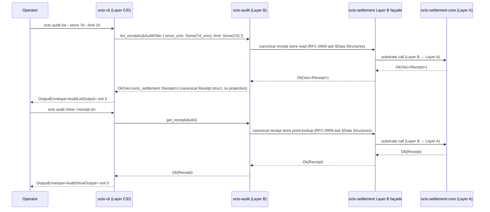

# RFC-0016: Audit Receipt API (KEEP substrate-faithful surface)

## Status

Draft v2 (2026-09-11)

> **KEEP-only rewrite per RFC-0016 R29 review plan.** This draft carries ONLY substrate-faithful additions on the `octo-audit` Layer B façade. Write-path surface (`append_audit_event` + `ReceiptId` + `ChainHash` + `ReceiptStatus` + `ReceiptSummary` + `AuditFilter.subject_did` ACL + CLI-shape error variants + `ScrubbedAuditError` / `ScrubbedString`) DEFERRED to RFC-0016-a. RFC-0016-a acceptance requires paired acceptance of RFC-0012-v3 (Layer A `AuditEventKind` extensions; Accepted 2026-09-12) + RFC-0014-v3 (Layer A `ReceiptStatus` enum + `Receipt` field extensions; Accepted 2026-09-12) + RFC-0011-a (CLI-shape error envelope).

## Authors

- `@cipherocto`
- `@mmacedoeu`

## Maintainers

- `@cipherocto`
- `@mmacedoeu`

## Summary

This RFC defines the `octo-audit` Layer B façade surface for the audit receipt API at R2 acceptance. The KEEP surface is read-only and substrate-faithful to RFC-0012 (Layer A `octo-audit-core`) and RFC-0014 (Layer A `octo-settlement-core`):

- `list_receipts(filter)` — substrate-faithful list of canonical `octo_settlement::Receipt` rows
- `get_receipt(id)` — bare `u64` primary-key lookup returning canonical `Receipt`
- `audit_home()` — `pub(crate)` + `#[cfg(feature = "octo-audit-internal")]` discovery helper
- `AuditFilter { since_unix, until_unix, capability_root, model, limit }` — UNCONDITIONAL filter struct
- Substrate-canonical 3-variant `AuditError` re-export at façade root

## Dependencies

- **RFC-0012** — Audit Substrate (Layer A frozen; provides canonical `AuditError` + `AppendOnlyAuditSink`)
- **RFC-0014** — Settlement Substrate (Layer A frozen; provides canonical `Receipt` struct)
- **RFC-0016-a** (sibling amendment) — Audit Receipt Write-Path: `append_audit_event` + `ReceiptId` + `ChainHash` + `ReceiptStatus` + `ReceiptSummary` + `AuditFilter.subject_did` ACL + CLI-shape error variants + `ScrubbedAuditError`. DEFERRED to paired acceptance with RFC-0012-v3 + RFC-0014-v3 + RFC-0011-a (RFC-0012-v3 + RFC-0014-v3 now Accepted 2026-09-12). See `rfcs/draft/process/0016-a-audit-receipt-write-path.md`.

## Design Goals

1. **Substrate-faithful** — every KEEP item matches an existing Layer A frozen type or a strict additive on Layer B façade
2. **Read-only at acceptance** — write surface deferred per [[cipherocto-design-principles]] §Stable Abstractions Principle
3. **Layer discipline** — `octo-audit` (Layer B) → `octo-settlement` (Layer B) → `octo-settlement-core` (Layer A frozen); no direct B→A edges
4. **Canonical projection** — `list_receipts` returns canonical `octo_settlement::Receipt` rows; no projection newtype at KEEP

## Motivation

Operators need to inspect the receipt store directly via CLI without trusting CLI-local state. The canonical substrate surface (RFC-0012 + RFC-0014) provides the row store; this RFC adds the read façade on `octo-audit` for substrate-faithful consumption.

The write surface (audit append) is DEFERRED to RFC-0016-a because it requires:

- `AuditEventKind::AgentTransition` extension on `octo-audit-core` (Layer A frozen) → RFC-0012-v3
- `Receipt` field extensions (`model`, `cost_dqa`, `capability_root`, `subject_did`) on `octo-settlement-core` (Layer A frozen) → RFC-0014-v3
- Canonical `ReceiptStatus { Ok, Partial, Reject }` enum on `octo-settlement-core` → RFC-0014-v3
- CLI-shape error envelope → RFC-0011-a

Acceptance of this RFC at R2 does not authorize those features; they require paired amendment acceptance.

## Roles and Authorities

- **Operator:** queries receipt store via `octo-audit list_receipts` / `get_receipt` through the `octo-audit` Layer B façade
- **Auditor:** verifies BLAKE3 chain integrity on read via canonical `verify_chain` (RFC-0012)

## Specification

### §6.1 Public surface (R2 KEEP)

| Item                          | Type                                                                                                                                       | Substrate anchor                                              |
| ----------------------------- | ------------------------------------------------------------------------------------------------------------------------------------------ | ------------------------------------------------------------- |
| `list_receipts`               | `fn(&AuditFilter) -> Result<Vec<octo_settlement::Receipt>, octo_audit_core::AuditError>`                                                   | RFC-0014 `Receipt` struct (Layer A frozen)                    |
| `get_receipt`                 | `fn(id: &u64) -> Result<octo_settlement::Receipt, octo_audit_core::AuditError>`                                                            | RFC-0014 `Receipt::receipt_id` (bare `u64` primary key)       |
| `audit_home`                  | `pub(crate) fn() -> Result<PathBuf, octo_audit_core::AuditError>` + `#[cfg(feature = "octo-audit-internal")]`                              | RFC-0012 `octo-audit-core` substrate path resolution          |
| `AuditFilter`                 | `struct { since_unix: Option<u64>, until_unix: Option<u64>, capability_root: Option<[u8;32]>, model: Option<String>, limit: Option<u32> }` | No substrate field extensions (NO `subject_did`, NO `status`) |
| `AuditError` (root re-export) | `pub use octo_audit_core::AuditError`                                                                                                      | RFC-0012 Layer A frozen 3-variant enum                        |

### §6.2 Function contracts

#### §6.2.1 `list_receipts`

```rust
pub fn list_receipts(filter: &AuditFilter) -> Result<Vec<octo_settlement::Receipt>, octo_audit_core::AuditError> {
    // 1. Validate filter: limit == 0 rejected (returns SinkSpecific("filter: limit out of range"))
    // 2. Walk canonical receipt store via octo-settlement Layer B façade
    // 3. Apply server-side filter
    // 4. Sort by canonical Receipt::timestamp_unix DESC (substrate-faithful per RFC-0959-ask §Data Structures)
    // 5. Secondary sort by Receipt::receipt_id ASC (deterministic tiebreaker)
    // 6. Return Vec<Receipt> directly (NO projection newtype at KEEP)
}
```

- Returns canonical `octo_settlement::Receipt` rows (Layer B façade re-export of `octo_settlement_core::Receipt`)
- Sort: `Receipt::timestamp_unix DESC`, then `Receipt::receipt_id ASC` as deterministic tiebreaker
- On miss/error: returns `AuditError::SinkSpecific(...)` per canonical 3-variant form (no `ReceiptNotFound` variant at KEEP)
- On filter violation: returns `AuditError::SinkSpecific("filter: limit out of range".into())` (substrate-side validation)
- Chain integrity: runs `verify_chain` (RFC-0012) on the canonical store before projection; on failure returns `AuditError::SinkSpecific("chain verification failed".into())` (NO row index per position-disclosure mitigation)

#### §6.2.2 `get_receipt`

```rust
pub fn get_receipt(id: &u64) -> Result<octo_settlement::Receipt, octo_audit_core::AuditError> {
    // 1. Point lookup in canonical receipt store via octo-settlement Layer B façade
    // 2. Run verify_chain (RFC-0012) for the queried row
    // 3. On chain integrity OK: return canonical Receipt
    // 4. On miss: SinkSpecific("receipt not found: <decimal-u64>".into())
    // 5. On chain integrity failure: SinkSpecific("chain verification failed".into())
}
```

- Bare `u64` primary-key lookup (NO `ReceiptId` newtype at KEEP)
- Returns canonical `octo_settlement::Receipt` struct
- Chain integrity check at read boundary per RFC-0012 `verify_chain`

#### §6.2.3 `audit_home`

```rust
#[cfg(feature = "octo-audit-internal")]
pub(crate) fn audit_home() -> Result<PathBuf, octo_audit_core::AuditError> {
    // 1. Resolve $OCTO_HOME or default ~/.config/octo
    // 2. Append /audit/receipts
    // 3. Return canonical path
}
```

- `pub(crate)` + `#[cfg(feature = "octo-audit-internal")]` — does NOT exist in non-internal builds
- CLI does not call directly per info-leak prevention (per §Adversary Analysis row "audit_home() canonical-path info leak")

#### §6.2.4 `AuditFilter`

```rust
pub struct AuditFilter {
    pub since_unix: Option<u64>,
    pub until_unix: Option<u64>,
    pub capability_root: Option<[u8; 32]>,
    pub model: Option<String>,
    pub limit: Option<u32>,
}
```

- UNCONDITIONAL — no `subject_did` field (DEFERRED to RFC-0016-a per RFC-0014-v3 substrate amendment)
- UNCONDITIONAL — no `status` field (DEFERRED to RFC-0016-a per RFC-0014-v3 substrate amendment)
- Validation: `limit == 0` rejected at substrate boundary → `SinkSpecific`
- Validation: `since_unix > until_unix` rejected at substrate boundary → `SinkSpecific`
- Validation: `limit > 10000` rejected at substrate boundary → `SinkSpecific`

#### §6.2.5 `AuditError` (root re-export)

```rust
// crates/octo-audit/src/lib.rs (root)
pub use octo_audit_core::AuditError;
```

- Substrate-canonical 3-variant form: `SequenceGap { event_id: u64, prev: u64 } / AlreadyExists(u64) / SinkSpecific(String)`
- NO façade shadow enum
- NO CLI-shape variants (`ReceiptNotFound` / `InvalidFilter` / `PermissionDenied` / `AuditAppendFailed` / `Internal`) — DEFERRED to RFC-0011-a per canonical `[ADD]` error envelope pattern
- `SinkSpecific(String)` payload is substrate-side scrubbed (defense-in-depth) before construction per substrate-side scrubber contract

### §6.3 Cargo.toml Layer discipline

```toml
[dependencies]
# Layer B settlement façade (Layer B → Layer B hop, no direct B→A edge)
octo-settlement = { path = "../octo-settlement" }

[features]
# Default OFF — audit_home() and other internal-only surfaces gated behind this
octo-audit-internal = []
```

### §6.4 Substrate-canonical error envelope

| Substrate variant (canonical, 3-variant)                      | CLI exit | Notes                                                                                                        |
| ------------------------------------------------------------- | -------- | ------------------------------------------------------------------------------------------------------------ |
| `octo_audit_core::AuditError::SequenceGap { event_id, prev }` | 64       | substrate-canonical; mapped via `#[error(transparent)] From<AuditError>` at `octo-cli/src/error.rs` boundary |
| `octo_audit_core::AuditError::AlreadyExists(u64)`             | 64       | substrate-canonical; same pattern                                                                            |
| `octo_audit_core::AuditError::SinkSpecific(String)`           | 64       | substrate-canonical; same pattern (substrate-side scrubbed before construction)                              |

CLI-shape variants DEFERRED to RFC-0011-a acceptance — they do NOT exist in the substrate today, and the façade does NOT define a shadow enum.

### §6.5 CLI integration contract

| Mission / RFC              | Substrate call                                | Sub-step                         | Status |
| -------------------------- | --------------------------------------------- | -------------------------------- | ------ |
| `0011-a-audit-commands.md` | `list_receipts(&filter)` + `get_receipt(&id)` | Sub-step 2 (existing RFC-0011-a) | KEEP   |

> **CLI does NOT call `append_audit_event` directly at R2.** The CLI surface is substrate-read-only at R2 acceptance. Writes route through `octo_wallet::transition_agent` (DEFERRED per RFC-0015 §6.8 forward pointer) → `octo_audit::append_audit_event` (DEFERRED per §Dependencies forward pointer).

### §6.6 Determinism requirements

- **Read determinism** — `list_receipts` returns the same results for the same filter across runs (sort key is canonical `Receipt::timestamp_unix` per RFC-0959-ask §Data Structures; secondary sort `Receipt::receipt_id` ASC as deterministic tiebreaker)
- **Chain integrity** — chain hashes verified end-to-end via `verify_chain` from RFC-0012; any tampering breaks the chain
- **Exit codes stable** — substrate error variants map to stable CLI exit codes per §6.4

### §6.7 RFC-0008 Execution Class Mapping

| Operation             | Execution class | Rationale                                        |
| --------------------- | --------------- | ------------------------------------------------ |
| `list_receipts`       | Class A (read)  | No state mutation; observable in any environment |
| `get_receipt`         | Class A (read)  | No state mutation; observable in any environment |
| `audit_home`          | Class A (read)  | Discovery; CLI does not call it directly         |
| `AuditError` variants | Class A         | Pure error mapping                               |

CLI surfaces `Class A` operations unconditionally (no `--allow-write` gate).

### §6.8 Forward Pointer to RFC-0016-a

The following DEFERRED surface ships with `0016-a-audit-receipt-write-path.md`:

| Deferred feature                                       | Substrate amendment required                                              | Unblock condition                                             |
| ------------------------------------------------------ | ------------------------------------------------------------------------- | ------------------------------------------------------------- |
| `append_audit_event`                                   | RFC-0012-v3 (Layer A `AuditEventKind` extensions; Accepted 2026-09-12)    | RFC-0016-v2 + RFC-0012-v3 accepted                            |
| `ReceiptId(pub u64)` newtype                           | RFC-0014-v3 (digest-to-id reverse-mapping; Accepted 2026-09-12)           | RFC-0014-v3 accepted + `receipt_id_for_digest` function added |
| `ChainHash(pub [u8; 32])` newtype                      | RFC-0012-v3 (`append_audit_event` return type; Accepted 2026-09-12)       | RFC-0012-v3 accepted + write path implemented                 |
| `ReceiptStatus { Ok, Partial, Reject }` enum           | RFC-0014-v3 (canonical substrate enum; Accepted 2026-09-12)               | RFC-0014-v3 accepted                                          |
| `ReceiptSummary` projection struct                     | RFC-0014-v3 (`Receipt` field extensions; Accepted 2026-09-12)             | RFC-0014-v3 accepted + projection defined                     |
| `AuditFilter.subject_did: Option<Did>` ACL             | RFC-0014-v3 (`Receipt.subject_did` field; Accepted 2026-09-12)            | RFC-0014-v3 accepted + RFC-0016-v2 ACL implementation         |
| `AuditFilter.status: Vec<StatusRef>` multi-valued      | RFC-0014-v3 (canonical substrate enum; Accepted 2026-09-12)               | RFC-0014-v3 accepted + RFC-0016-v2 façade field type change   |
| `AuditEventKind::Redaction` variant                    | RFC-0012-v3 (4th enum variant; Accepted 2026-09-12)                       | RFC-0012-v3 accepted + RFC-0016-v2 accepted                   |
| CLI-shape error variants                               | RFC-0011-a (canonical `[ADD]` error envelope)                             | RFC-0011-a accepted                                           |
| `ScrubbedAuditError` + `ScrubbedString` newtypes       | none (façade-only)                                                        | RFC-0016-v2 accepted                                          |
| Canonical-bytes-on-write invariant                     | RFC-0012-v3 (`AppendOnlyAuditSink::canonical_bytes`; Accepted 2026-09-12) | RFC-0012-v3 accepted + chain-link verification                |
| Single-writer lock + read-stalls-while-write invariant | RFC-0012-v3 (`AppendOnlyAuditSink::append` lock; Accepted 2026-09-12)     | RFC-0012-v3 accepted + concurrent reader stall                |

See `rfcs/draft/process/0016-a-audit-receipt-write-path.md` for full DEFERRED surface specification.

## Performance Targets

- `list_receipts` (1000-receipt store, limit=100) — p95 < 100ms per RFC-0011-a §Performance Targets
- `list_receipts` (10000-receipt store, limit=10000) — p95 < 500ms
- `get_receipt` point lookup — p95 < 5ms

## Implicit Assumptions Audit

1. **Substrate-faithful principle** — `octo-audit-core` (Layer A frozen) is canonical; this RFC adds façade-layer surface to `octo-audit` (Layer B). At R2 the surface is read-only.
2. **Operator config dir writable** — `audit_home()` resolves to `$OCTO_HOME/audit/receipts`; substrate handles `SinkSpecific` upstream on filesystem errors
3. **Clock monotonicity for `timestamp_unix`** — RFC-0014 `Receipt::timestamp_unix` is monotonic per RFC-0959-ask §Data Structures; surface reads assume canonical monotonic ordering
4. **Multi-tenant deployment restriction** — RFC-0016 reads MUST NOT be enabled in deployments sharing the receipt store across tenants until `AuditFilter.subject_did` ACL lands (per §6.8 forward pointer). Per-process trust boundary assumed at R2 KEEP; co-tenant on a multi-process host could read another tenant's receipts by omitting `subject_did`. Multi-tenant deployments MUST deploy per-tenant receipt stores OR wait for RFC-0016-a acceptance.

## Security Considerations

1. **Append-only chain integrity** — `AppendOnlyAuditSink` is type-level append-only per RFC-0012; tampering breaks BLAKE3 chain. R2 surface is read-only.
2. **`audit_home()` operator-config leak surface** — discovery helper surfaces canonical path; CLI does not call directly (information leak prevention)
3. **`SinkSpecific` carry at R2 KEEP** — on miss, the substrate returns `octo_audit_core::AuditError::SinkSpecific("receipt not found: <decimal-u64>".into())` carrying the canonical decimal `u64` form of the substrate `Receipt::receipt_id`; redactor-clean (no secret material)
4. **Read is no-mutation** — G1 invariant per RFC-0011-a; `list_receipts` + `get_receipt` are pure reads
5. **Read access control (DEFERRED `subject_did` ACL)** — Q1 (Who) = compromised CLI / co-tenant on multi-process host; Q2 (What) = read another tenant's receipts; Q3 (Why) = reconnaissance / receipt-store enumeration; Q4 (How mitigated) = per-process trust boundary via `mode 0700` parent-dir check; Q5 (Residual) = full ACL lands with RFC-0016-a acceptance

## Adversarial Review

### Threat: receipt-store tampering

**Adversary:** Operator modifies the persisted receipt store directly (bypasses `get_receipt`).

**Mitigation:** Receipts are append-only; reads surface `octo_audit_core::AuditError::SinkSpecific("chain verification failed".into())` if the receipt store's internal BLAKE3 chain verification fails. Substrate-internal `verify_chain` run on every `get_receipt` and on `list_receipts` walk.

### Threat: filter-injection via query string

**Adversary:** Operator constructs a filter with malicious payloads in `model` field.

**Mitigation:** CLI parser rejects malformed values per RFC-0011-a §Adversarial Review (`--model` non-empty, no wildcard). Substrate does not interpret the strings as code.

### Threat: `get_receipt` timing oracle on existence

**Adversary:** Compromised CLI measures point-lookup latency to infer whether a specific receipt ID exists.

**Mitigation:** NONE — constant-time lookup is NOT substrate-enforced; substrate-faithful lookup uses canonical store indexing (BTreeMap / HashMap); lookup time varies based on tree depth, hash bucket distribution, and store state. Documented as accepted residual risk.

## Adversary Analysis (5-Question Test)

| Threat                                           | Q1: Who?                                          | Q2: What?                                                       | Q3: Why?                                   | Q4: How mitigated?                                                                                                                                                                                              | Q5: Residual risk?                                                                                                                                                  |
| ------------------------------------------------ | ------------------------------------------------- | --------------------------------------------------------------- | ------------------------------------------ | --------------------------------------------------------------------------------------------------------------------------------------------------------------------------------------------------------------- | ------------------------------------------------------------------------------------------------------------------------------------------------------------------- |
| Receipt-store tampering                          | Operator                                          | Modify persisted store                                          | Hide receipt rows                          | Append-only sink + chain verification + read-time `verify_chain()` guard per §6.2.1 — list-time chain-integrity check rejects forged or tampered rows at the read boundary                                      | Disk corruption mitigated                                                                                                                                           |
| Filter-injection                                 | Compromised CLI                                   | Malicious query string                                          | Trigger downstream eval                    | CLI parser rejects malformed values per RFC-0011-a                                                                                                                                                              | NONE (substrate trust)                                                                                                                                              |
| Read-during-write race                           | Concurrent reads                                  | Read inconsistency                                              | Data inconsistency                         | No write path at R2 KEEP (DEFERRED to RFC-0016-a per §6.8); reads today operate against canonical store with no writer present                                                                                  | R2 surface is read-only; risk lands with RFC-0016-a acceptance                                                                                                      |
| Read access control (DEFERRED `subject_did` ACL) | Compromised CLI / co-tenant on multi-process host | Read another tenant's receipts by omitting `subject_did` filter | Reconnaissance / receipt-store enumeration | Per-process trust boundary via `mode 0700` parent-dir check; `AuditFilter.subject_did: Option<Did>` ACL DEFERRED per §6.8 (requires RFC-0014-v3 substrate field, Accepted 2026-09-12, + RFC-0016-v2 façade ACL) | Per-process trust boundary assumed at R2 KEEP; multi-tenant deployments sharing `$OCTO_HOME` across tenants MUST NOT enable RFC-0016 reads on shared receipt stores |
| `get_receipt` timing oracle on existence         | Compromised CLI                                   | Measure point-lookup latency                                    | Infer whether a specific receipt ID exists | NONE — constant-time lookup is NOT substrate-enforced                                                                                                                                                           | Substrate-internal trust; cross-process exploitation blocked by per-process trust boundary per §Implicit Assumptions Audit row 4                                    |
| `audit_home()` canonical-path info leak          | Compromised CLI                                   | Surface canonical receipt-store path                            | Leak `$OCTO_HOME` or filesystem layout     | CLI never calls `audit_home()` directly per §6.2.3; substrate-internal caller trust                                                                                                                             | Substrate-internal trust; CLI bypass would expose canonical path                                                                                                    |

## Economic Analysis

DEFER — audit receipt substrate has no direct token cost; cite RFC-0900+ (Role Economics) for any cost implications.

## Compatibility

1. **No breaking changes.** 5 KEEP items on `octo-audit` (Layer B façade) per RFC-0012; no existing public API modified.
2. **No new exit codes break parent semantics.** Substrate-canonical 3-variant `AuditError` maps to CLI exit 64 via `#[error(transparent)]` From conversions at the `octo-cli/src/error.rs` boundary. RFC-0011-a-reserved 17 (`ReceiptNotFound`) + 16 (`InvalidFilter`) + 64 (`Internal`) + 52 (`AuditSubstrateNotReady`) are DEFERRED to RFC-0011-a + RFC-0016-a acceptance.
3. **No new clap variants break parent dispatch.** This RFC is substrate-only; CLI missions consume the new surface via existing CLI variant sets.
4. **Substrate-side scrubber defense-in-depth** — at R2 KEEP, the substrate's only error variant carrying a string payload is `octo_audit_core::AuditError::SinkSpecific(String)`. The substrate-side scrubber applies canonical redaction patterns per RFC-0012-v3 §S5.1 canonical scrubber table (Accepted 2026-09-12; 10-pattern list) before constructing the variant. These patterns are defense-in-depth substrate-side scrubbers; the CLI `OctoCliRedactor` per RFC-0011-a §Redaction performs the canonical second-pass sweep at output time. The patterns do NOT add new `OctoCliRedactor` rules.

## Test Vectors

Substrate-level test vectors (`crates/octo-audit/src/lib.rs` test module). All write-path vectors are DEFERRED to RFC-0016-a per §6.8.

| #                          | Substrate call                                                                                                                         | Input                                                                                          | Expected Output                                                                                                           | Notes                                                                                                                                                                                                           |
| -------------------------- | -------------------------------------------------------------------------------------------------------------------------------------- | ---------------------------------------------------------------------------------------------- | ------------------------------------------------------------------------------------------------------------------------- | --------------------------------------------------------------------------------------------------------------------------------------------------------------------------------------------------------------- |
| TV-AUD-1                   | `list_receipts(&AuditFilter::default())`                                                                                               | Empty store                                                                                    | `Ok(vec![])`                                                                                                              | Empty store                                                                                                                                                                                                     |
| TV-AUD-2                   | `list_receipts(&AuditFilter { since_unix: Some(7d_unix), limit: Some(10) })`                                                           | 1000-receipt store                                                                             | `Ok(vec_of_10_canonical_Receipts)`                                                                                        | `since_unix` filter per §6.2.4                                                                                                                                                                                  |
| TV-AUD-3b                  | `list_receipts(&AuditFilter { model: Some("claude-3-7-sonnet"), ... })`                                                                | 1000-receipt store                                                                             | `Ok(filtered_by_model)`                                                                                                   | Server-side model exact-match filter per §6.2.4                                                                                                                                                                 |
| TV-AUD-3c                  | `list_receipts(&AuditFilter { capability_root: Some(<canonical-32-bytes>), ... })`                                                     | 1000-receipt store                                                                             | `Ok(filtered_by_capability_root)`                                                                                         | Server-side 32-byte exact-match filter per §6.2.4                                                                                                                                                               |
| TV-AUD-6                   | `get_receipt(&known_id)`                                                                                                               | Known `Receipt::receipt_id: u64`                                                               | `Ok(<full canonical Receipt>)`                                                                                            | Returns canonical `octo_settlement::Receipt` per §6.2.2 (Layer B façade re-export)                                                                                                                              |
| TV-AUD-9                   | `audit_home()`                                                                                                                         | `$OCTO_HOME` set to `/tmp/octo-test`                                                           | `Ok(PathBuf::from("/tmp/octo-test/audit/receipts"))`                                                                      | Discovery helper; requires `cargo test --features octo-audit-internal`                                                                                                                                          |
| TV-AUD-10                  | `audit_home()`                                                                                                                         | `$OCTO_HOME` unset, `$HOME=/home/x`                                                            | `Ok(PathBuf::from("/home/x/.config/octo/audit/receipts"))`                                                                | Default resolution                                                                                                                                                                                              |
| TV-AUD-11g                 | `audit_home()` against macOS-style `$OCTO_HOME=/Users/alice/Library/Application Support/octo`; resolved path on substrate error string | filesystem path containing macOS-specific layout                                               | `Err(octo_audit_core::AuditError::SinkSpecific("<OCTO_HOME>/audit/receipts".into()))` — canonical placeholder substituted | Path-string scrub coverage per §Compatibility #4 (filesystem absolute-path pattern per RFC-0012-v3 §S5.1 canonical scrubber table); verifies operator-specific filesystem layouts do NOT leak via error payload |
| TV-AUD-list-chain-2        | `list_receipts(&AuditFilter::default())` against a clean 5-row receipt store                                                           | 5-row store, all chain_hash fields match `compute_chain_hash(row)`                             | `Ok(vec_of_5_canonical_Receipts)` sorted by `Receipt::timestamp_unix DESC`                                                | Chain-integrity guard happy path                                                                                                                                                                                |
| TV-AUD-get-receipt-chain-2 | `get_receipt(&known_id)` against a clean 5-row receipt store                                                                           | 5-row store, all chain_hash fields match `compute_chain_hash(row)`; queried row IS a valid row | `Ok(<full canonical Receipt>)`                                                                                            | Chain-integrity guard happy path for `get_receipt`                                                                                                                                                              |
| TV-AUD-audit-home-leak-1   | `audit_home()` Ok path on a non-internal build (no `octo-audit-internal` feature flag)                                                 | non-internal build (default `cargo build` invocation)                                          | `compile error / function-not-callable` (function gated behind `#[cfg(feature = "octo-audit-internal")]`)                 | Path-leak vector; verifies the Ok path does NOT leak canonical paths in non-internal builds                                                                                                                     |

DEFERRED test vectors (moved to RFC-0016-a §Test Vectors): TV-AUD-3, TV-AUD-4, TV-AUD-4b, TV-AUD-4c, TV-AUD-4d, TV-AUD-4e, TV-AUD-5, TV-AUD-7, TV-AUD-8, TV-AUD-11, TV-AUD-11a-k, TV-AUD-list-chain-1, TV-AUD-get-receipt-chain-1, TV-AUD-redact-token-1, TV-AUD-redact-token-2, TV-AUD-permission-check-1, TV-AUD-permission-check-2.

CLI-level test vectors live in RFC-0011-a §Test Vectors (UNCHANGED).

## Alternatives Considered

- **CLI-side receipt storage** — CLI stores the receipt summaries locally; rejected: violates substrate-faithful principle; reads should always go through the canonical substrate store
- **Custom `ReceiptId` typedef in CLI** — separate newtype from `SettlementStore::ReceiptId`; rejected: parallel abstraction per [[cipherocto-design-principles]]; bare `u64` is canonical at R2 KEEP (per `Receipt::receipt_id` field)
- **GraphQL/REST API surface** — separate API exposes audit reads; rejected: substrate-faithful principle + RFC-0011 CLI is the canonical operator surface
- **Streaming `list_receipts` (cursor-streaming)** — server streams rows back; rejected: complexity for no benefit at the 10000-row ceiling; cursor reserved for RFC-0016-a future work

## Implementation Phases

- **Phase 1 (this RFC, R2 KEEP)** — substrate additions on `octo-audit` Layer B façade; 5 KEEP items per §6.1; 12+ DEFERRED items per §6.8 forward pointer
- **Phase 2 (RFC-0011-a acceptance + RFC-0016 acceptance)** — gates RFC-0011-a §Substrate-truth disclaimer resolution; CLI substrate amendments become implementable for the read surface
- **Phase 3 (RFC-0016-a acceptance — paired with RFC-0012-v3 + RFC-0014-v3 + RFC-0011-a)** — restores DEFERRED surface per §6.8 (RFC-0012-v3 + RFC-0014-v3 now Accepted 2026-09-12)
- **Phase 4 (RFC-0015 acceptance re-implementation)** — `octo_wallet::transition_agent` calls `append_audit_event` per RFC-0015 §6.8 forward pointer (paired with RFC-0016-a acceptance)

## Key Files to Modify

- `crates/octo-audit/src/lib.rs` — append the 5 KEEP items per §6.1; existing re-exports preserved; ~150 LoC incl. tests
- `crates/octo-audit/Cargo.toml` — add `octo-settlement = { path = "../octo-settlement" }` (Layer B settlement façade per RFC-0014; Layer B → Layer B hop, no direct B→A edge per CLAUDE.md §Architectural Principles)

**Layer placement table:**

| Crate                  | Layer                     | Substrate anchor                                                             | Role at RFC-0016 R2 KEEP                                          |
| ---------------------- | ------------------------- | ---------------------------------------------------------------------------- | ----------------------------------------------------------------- |
| `octo-audit-core`      | Layer A frozen (RFC-0012) | `AuditError` enum (`SequenceGap`/`AlreadyExists`/`SinkSpecific`)             | Canonical substrate error envelope; root re-export per §6.2.5     |
| `octo-audit`           | Layer B façade (RFC-0012) | `crates/octo-audit/src/lib.rs` §re-export block                              | Façade; re-exports `octo-audit-core::AuditError` per §6.2.5       |
| `octo-settlement-core` | Layer A frozen (RFC-0014) | `Receipt` struct per `crates/octo-settlement-core/src/receipt.rs` §`Receipt` | Canonical `Receipt` primary-key substrate for `get_receipt` reads |
| `octo-settlement`      | Layer B façade (RFC-0014) | `crates/octo-settlement/src/lib.rs` §re-export block                         | Re-exports `octo-settlement-core` Layer A frozen                  |

Layer direction: `octo-audit` (Layer B) → `octo-settlement` (Layer B) → `octo-settlement-core` (Layer A frozen). No direct B→A edges. No reverse deps.

No changes to Layer A crates (`octo-audit-core`, `octo-settlement-core`); no CLI binary changes; no envelope / redactor / exit-code table changes.

## Future Work

- **`AuditFilter.subject_did: Option<Did>` ACL** — RFC-0016-a per §6.8 (requires RFC-0014-v3 substrate field, Accepted 2026-09-12, + RFC-0016-v2 façade ACL)
- **`AuditFilter.status: Vec<ReceiptStatus>` multi-valued** — RFC-0016-a per §6.8 (requires RFC-0014-v3 substrate enum, Accepted 2026-09-12, + RFC-0016-v2 façade field type change)
- **`AppendOnlyAuditSink::append` write path** — RFC-0016-a per §6.8 (requires RFC-0012-v3 `AuditEventKind` extensions — Accepted 2026-09-12 — + canonical-bytes-on-write invariant)
- **`ReceiptStatus::Unknown` arm** — Raw escape hatch if RFC-0014-v3 substrate acceptance adds it (Accepted 2026-09-12 — RFC-0014-v3 substrate landed without `Unknown` arm; amendment DEFERRED to a future RFC-0014-v3.x)
- **Streaming `list_receipts`** — cursor-streaming for >10000-row stores
- **Redaction via audit append** — `AuditEventKind::Redaction { prev_hash, reason }` row appended AFTER the target row (Layer A future amendment)

## Rationale

- **Substrate-faithful** — Layer A frozen untouched; this RFC adds Layer B façade surface per RFC-0012 + RFC-0014 acceptance pattern
- **Additive only** — CLAUDE.md §Rust crate-level stability: Layer B additive changes do not break consumers; the 5 KEEP items per §6.1 are additive
- **No parallel abstractions** — `list_receipts` returns canonical `Receipt` directly (no projection newtype at KEEP); bare `u64` for `Receipt::receipt_id` lookup (no newtype)
- **CLI parity** — substrate-faithful read surface; CLI substrate amendments become implementable for the read surface at RFC-0011-a acceptance
- **Split strategy** — write surface paired-with-substrate-amendment moved to RFC-0016-a per R29 review plan; halves per-RFC complexity, breaks divergence loop

## Version History

- v1.0 (2026-09-11) Initial draft. Read substrate-faithful surface (RFC-0002 + RFC-0011-c).
- v2 (2026-09-11) KEEP-only rewrite. Dropped write-path surface (`append_audit_event` + `ReceiptId`/`ChainHash`/`ReceiptStatus`/`ReceiptSummary`/`subject_did` ACL + CLI-shape variants + `ScrubbedAuditError`/`ScrubbedString` + DEFERRED TVs) → forward pointer to RFC-0016-a. Slimmed to 5 KEEP items per §6.1 + substrate-canonical 3-variant `AuditError` re-export per §6.2.5.

## Related RFCs

- RFC-0011-a — `octo audit` Subcommands (CLI consumer of `list_receipts` + `get_receipt`; defines `[ADD]` spec at §7.4)
- RFC-0011-c — `octo agent` Subcommands (read-only CLI consumer at R2)
- RFC-0012 — Audit Substrate (Layer A frozen core; provides `AuditEvent` + `AuditEventKind` + `AppendOnlyAuditSink`); **RFC-0012-v3 required for §6.8 DEFERRED SURFACE** (`append_audit_event` write path; Accepted 2026-09-12)
- RFC-0014 — Settlement Substrate (Layer A frozen core; provides canonical `Receipt` struct per §Data Structures); **RFC-0014-v3 required for §6.8 DEFERRED SURFACE** (`ReceiptStatus` enum + `ReceiptSummary` projection + `AuditFilter.subject_did`; Accepted 2026-09-12)
- RFC-0016-a — Audit Receipt Write-Path Amendment (sibling; DEFERRED surface paired with RFC-0012-v3 + RFC-0014-v3 + RFC-0011-a)
- RFC-0015 — Agent Operations Substrate (read-only CLI consumer at RFC-0015 R2 acceptance; `transition_agent` write surface DEFERRED per RFC-0015 §6.8 forward pointer)
- RFC-0011 — `octo` CLI Substrate (parent RFC; provides envelope + error + exit-code substrate)
- RFC-0010 — Canonical DID Codec (DID parsing)
- RFC-0008 — Deterministic AI Execution Boundary (execution class mapping)
- [[cipherocto-design-principles]] — Layer model + substrate-faithful principle; **§6.8 DEFERRED SURFACE follows the extension-over-enumeration pattern (no central enum edit at Layer A)**

## Related Use Cases

- `docs/use-cases/audit-transparency.md` — receipt read + verify use case
- `docs/use-cases/hybrid-ai-blockchain-runtime.md` — runtime attach / run context for transaction logs

## Appendices

### Appendix A. Substrate function signatures (full Rust surface)

```rust
// crates/octo-audit/src/lib.rs (append to existing module)

// KEEP at RFC-0016 R2 acceptance:
pub fn list_receipts(filter: &AuditFilter) -> Result<Vec<octo_settlement::Receipt>, octo_audit_core::AuditError> {
    // 1. Validate filter: limit == 0 rejected (§6.2.4); since_unix <= until_unix if both Some.
    // 2. Walk canonical receipt store (RFC-0014 substrate; octo_settlement::Receipt via Layer B façade re-export per §6.1).
    // 3. Apply server-side filter.
    // 4. Sort by canonical Receipt::timestamp_unix DESC (substrate-faithful per RFC-0959-ask §Data Structures).
    // 5. Secondary sort by Receipt::receipt_id ASC (deterministic tiebreaker).
    // 6. Return Vec<octo_settlement::Receipt> directly (NO projection newtype at KEEP).
}

pub fn get_receipt(id: &u64) -> Result<octo_settlement::Receipt, octo_audit_core::AuditError> {
    // 1. Point lookup in canonical receipt store via octo-settlement Layer B façade.
    // 2. Run verify_chain (RFC-0012) for the queried row.
    // 3. On chain integrity OK: return canonical Receipt.
    // 4. On miss: SinkSpecific("receipt not found: <decimal-u64>".into()) (substrate-canonical form).
    // 5. On chain integrity failure: SinkSpecific("chain verification failed".into()).
}

#[cfg(feature = "octo-audit-internal")]
pub(crate) fn audit_home() -> Result<PathBuf, octo_audit_core::AuditError> {
    // 1. Resolve $OCTO_HOME or default ~/.config/octo.
    // 2. Append /audit/receipts.
    // 3. Return canonical path.
}

// AuditFilter struct per §6.2.4 (UNCONDITIONAL, NO subject_did, NO status)
pub struct AuditFilter {
    pub since_unix: Option<u64>,
    pub until_unix: Option<u64>,
    pub capability_root: Option<[u8; 32]>,
    pub model: Option<String>,
    pub limit: Option<u32>,
}

// Root re-export of substrate-canonical 3-variant AuditError (no façade shadow enum)
pub use octo_audit_core::AuditError;
```

### Appendix B. Mermaid diagram — CLI → audit flows (R2 read-only)



> **R2 scope-cut note:** the previous v1.0 diagram included a CLI → `append_audit_event` flow for `octo agent destroy`. R2 removes this flow per §6.8 DEFERRED SURFACE — the write path is DEFERRED to RFC-0016-a acceptance. CLI dispatch at R2 acceptance is **substrate-read-only** (`list_receipts` + `get_receipt` + `audit_home`). Writes route through `octo_wallet::transition_agent` (DEFERRED per RFC-0015 §6.8 forward pointer) → `octo_audit::append_audit_event` (DEFERRED per §6.8) — the CLI never invokes the write façade directly.
