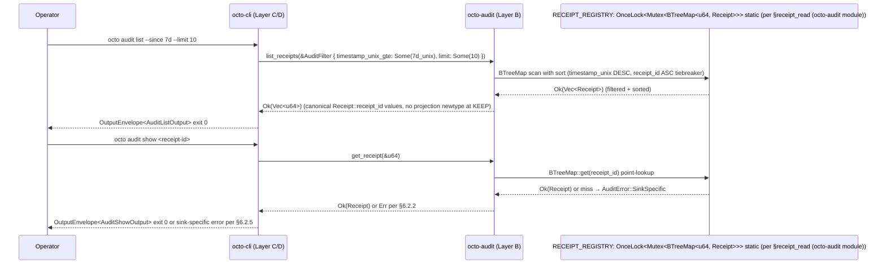

# RFC-0016: Audit Receipt API (KEEP substrate-faithful surface)

## Status

Draft v3 (2026-09-13)

> **KEEP-only rewrite per RFC-0016 R29 review plan + R2.5 substrate-first restructure.** This draft carries ONLY substrate-faithful additions on the `octo-audit` Layer B façade per §6.1 §Pre-existing Substrate. Write-path surface DEFERRED to RFC-0016-a per §6.1 §Amendment Surface.

## Authors

- `@cipherocto`
- `@mmacedoeu`

## Maintainers

- `@cipherocto`
- `@mmacedoeu`

## Summary

This RFC defines the `octo-audit` Layer B façade surface for the audit receipt API at R2 acceptance. The KEEP surface is read-only and substrate-faithful to RFC-0012 (Layer A `octo-audit-core`) and RFC-0014 (Layer A `octo-settlement-core`). See §6.1 §Pre-existing Substrate table for the canonical KEEP item list (4 items + 2 PRE-EXISTING re-exports) and §6.1 §Amendment Surface for items DEFERRED to RFC-0016-a per [[deferred-vs-unspecified]].

## Dependencies

- **RFC-0012** — Audit Substrate (Layer A frozen; canonical `AuditError` + `AppendOnlyAuditSink`)
- **RFC-0014** — Settlement Substrate (Layer A frozen; canonical `Receipt` struct)
- **RFC-0016-a** — Audit Receipt Write-Path Amendment (sibling; DEFERRED surface per §6.1 §Amendment Surface)

## Design Goals

1. **Substrate-faithful** — every KEEP item matches an existing Layer A frozen type or a strict additive on Layer B façade
2. **Read-only at acceptance** — write surface deferred per [[cipherocto-design-principles]] §Stable Abstractions Principle
3. **Layer discipline** — canonical façade-to-substrate hops only: `octo-audit` (Layer B) → `octo-audit-core` (Layer A frozen, `AuditError` re-export) + `octo-audit` (Layer B) → `octo-settlement` (Layer B) → `octo-settlement-core` (Layer A frozen, `Receipt` re-export) + `octo-audit` (Layer B) → `octo-storage-core` (Layer A frozen, DOMAIN adapter substrate per RFC-0206). NO NEW non-canonical B→A edges at KEEP.
4. **Canonical projection** — `list_receipts` returns `Vec<u64>` of canonical `Receipt::receipt_id` values (NO projection newtype at KEEP; `Vec<Receipt>` projection DEFERRED to RFC-0016-a per §6.8)

## Motivation

Operators need to inspect the receipt store directly via CLI without trusting CLI-local state. The canonical substrate surface (RFC-0012 + RFC-0014) provides the row store; this RFC adds the read façade on `octo-audit` for substrate-faithful consumption.

The write surface (audit append) is DEFERRED to RFC-0016-a because it requires future Layer A substrate amendments:

- `AuditEventKind` `AgentTransition` extension on `octo-audit-core` (Layer A frozen) per RFC-0012 (Extension-over-enumeration pattern) (typed-discriminator namespace, NOT central-enum variant addition)
- `Receipt` field extensions (`model`, `cost_dqa`, `capability_root`, `subject_did`) on `octo-settlement-core` (Layer A frozen) per RFC-0959-ask §Data Structures
- Canonical `ReceiptStatus { Ok, Partial, Reject }` enum on `octo-settlement-core` per RFC-0959-ask §Data Structures
- CLI-shape error envelope → RFC-0011-a

Acceptance of this RFC at R2 does not authorize those features; they require paired amendment acceptance.

## Roles and Authorities

- **Operator:** queries receipt store via `octo-audit list_receipts` / `get_receipt` through the `octo-audit` Layer B façade
- **Auditor:** verifies audit event chain integrity via `octo_audit::verify_chain(&[AuditEvent])` per `§verify_chain (octo-audit-core §chain)` (re-exported at `§octo-audit::lib (root re-export)`) AND/OR receipt chain integrity via `octo_settlement::verify_receipt_chain(&[Receipt])` per `§verify_receipt_chain (octo-settlement-core §chain)` (re-exported at `§octo-settlement::lib (root re-export)`). Both primitives are PRE-EXISTING façade re-exports; `list_receipts` + `get_receipt` do NOT invoke them automatically — opt-in only at the auditor's call boundary.

## Specification

### §6.1 Public surface (KEEP)

#### §Pre-existing Substrate (KEEP — already shipped)

Six substrate items shipped on `next` HEAD per the cited commits (4 KEEP additive items + 2 PRE-EXISTING re-exports):

| #   | Item                                                                               | Substrate anchor                                 | Notes                                                                                                                                |
| --- | ---------------------------------------------------------------------------------- | ------------------------------------------------ | ------------------------------------------------------------------------------------------------------------------------------------ |
| 1   | `pub fn list_receipts(filter: &AuditFilter) -> Result<Vec<u64>, AuditError>`       | `§list_receipts (octo-audit §receipt_read)`      | Bare `pub fn`; substrate silently clamps `limit` to 1024 per `§list_receipts (limit clamp)`                                          |
| 2   | `pub fn get_receipt(id: &u64) -> Result<Receipt, AuditError>`                      | `§get_receipt (octo-audit §receipt_read)`        | On miss → `AuditError::SinkSpecific(format!("receipt_id {id} not found"))` per `§get_receipt (miss-path)`                            |
| 3   | `pub fn audit_home() -> Result<PathBuf, AuditError>`                               | `§audit_home (octo-audit §receipt_read)`         | Bare `pub fn`; resolves `<OCTO_HOME>/audit/receipts` or default `<HOME>/.config/octo/audit/receipts`                                 |
| 4   | `AuditFilter { router_id, timestamp_unix_gte, timestamp_unix_lte, limit, cursor }` | `§AuditFilter struct (octo-audit §receipt_read)` | 5-field struct; `cursor` field additive forward-compat per §6.2.4 substrate doc-block                                                |
| 5   | `pub use octo_audit_core::AuditError` (PRE-EXISTING root re-export)                | `§octo-audit::lib (root re-export)`              | RFC-0012 Layer A frozen 3-variant enum (`SequenceGap { event_id, prev }` / `AlreadyExists(u64)` / `SinkSpecific(String)`)            |
| 6   | `pub use octo_audit_core::verify_chain` (PRE-EXISTING root re-export)              | `§octo-audit::lib (root re-export)`              | Chain-integrity helper at `§verify_chain (octo-audit-core §chain)`; NOT invoked by KEEP read path (opt-in via façade re-export only) |

Substrate-faithfulness: `list_receipts` + `get_receipt` walk the process-global `RECEIPT_REGISTRY: OnceLock<Mutex<BTreeMap<u64, Receipt>>>` static per `§RECEIPT_REGISTRY static` (NOT the `octo-settlement` Layer B façade). The Layer B façade hop cited in the previous draft drift — substrate goes direct to the static registry. `octo-settlement` Layer B façade re-exports `verify_receipt_chain` + `receipt_id_for` per `§octo-settlement::lib (root re-export)` + `§octo-settlement-core::lib (root re-export)`; those re-exports are PRE-EXISTING and out of scope for the KEEP read path.

#### §Amendment Surface (DEFERRED — RFC-0016-a)

The following are DEFERRED to RFC-0016-a per [[deferred-vs-unspecified]]:

- `ReceiptId(pub u64)` newtype — bare `u64` is canonical at KEEP
- `ChainHash(pub [u8; 32])` newtype — bare `[u8; 32]` is canonical at KEEP
- `ReceiptStatus { Ok, Partial, Reject }` enum — future RFC-0014 substrate amendment
- `ReceiptSummary` projection struct — bare `Receipt` is canonical at KEEP
- `AuditFilter.subject_did: Option<Did>` ACL — future RFC-0014 `Receipt.subject_did` field
- `AuditFilter.status: Vec<ReceiptStatus>` multi-valued — future RFC-0014 substrate amendment
- `append_audit_event` write path — future RFC-0012 `AuditEventKind` extensions
- CLI-shape error variants (`ReceiptNotFound` / `InvalidFilter` / `PermissionDenied` / `AuditAppendFailed` / `Internal`) — RFC-0011-a
- `ScrubbedAuditError` / `ScrubbedString` newtype surface — RFC-0016-a
- Filter validation rejection (`limit == 0` / `gte > lte` / `limit > 1024`) — substrate silently clamps; rejection semantics DEFERRED

### §6.2 Function contracts

#### §6.2.1 `list_receipts` (KEEP)

```rust
pub fn list_receipts(filter: &AuditFilter) -> Result<Vec<u64>, AuditError>
```

- Substrate-canonical signature per `§list_receipts (octo-audit §receipt_read)`.
- Sort: `timestamp_unix DESC`, then `receipt_id ASC` tiebreaker.
- Substrate silently clamps `let limit = filter.limit.unwrap_or(1024).min(1024);` per `§list_receipts (limit clamp)` — NO rejection of `limit == 0`, `gte > lte`, or `limit > 1024` at KEEP. Filter-validation rejection semantics DEFERRED to RFC-0016-a per §Amendment Surface.
- On miss: `Ok(Vec::new())` per substrate. On registry mutex poison: `Err(AuditError::SinkSpecific("receipt registry mutex poisoned".into()))`.
- Substrate-faithful: walks process-global `RECEIPT_REGISTRY` static per `§RECEIPT_REGISTRY static`. Per-row receipt chain verification is OPT-IN via the `verify_receipt_chain` façade re-export per `§octo-settlement::lib (root re-export)`; NOT invoked by `list_receipts`.

#### §6.2.2 `get_receipt` (KEEP)

```rust
pub fn get_receipt(id: &u64) -> Result<Receipt, AuditError>
```

- Substrate-canonical signature per `§get_receipt (octo-audit §receipt_read)`.
- On miss: `Err(AuditError::SinkSpecific(format!("receipt_id {id} not found")))` per `§get_receipt (miss-path)`. No dedicated `ReceiptNotFound` variant at KEEP per the canonical 3-variant `AuditError` form.
- Substrate-faithful: walks `RECEIPT_REGISTRY` static.

#### §6.2.3 `audit_home` (KEEP)

```rust
pub fn audit_home() -> Result<PathBuf, AuditError>
```

- Substrate-canonical signature per `§audit_home (octo-audit §receipt_read)` — plain `pub fn` (NOT `pub(crate)` + NOT `#[cfg(octo-audit-internal)]`). The feature-gated visibility proposal in the previous draft was unsubstantiated drift; substrate-canonical = bare `pub fn` accessible to all callers.
- Resolves `$OCTO_HOME/audit/receipts` when `OCTO_HOME` set, default `$HOME/.config/octo/audit/receipts` otherwise.
- Per §Adversary Analysis row "canonical-path info leak": path-string leak mitigated by facade-side scrubber at `§octo-audit::scrub (facade scrubber)` (SinkSpecific payload scrubbed defense-in-depth per RFC-0012-v3 §S5.1).

#### §6.2.4 `AuditFilter` (KEEP)

```rust
pub struct AuditFilter {
    pub router_id: Option<String>,
    pub timestamp_unix_gte: Option<u64>,
    pub timestamp_unix_lte: Option<u64>,
    pub limit: Option<usize>,
    pub cursor: Option<String>,
}
```

Substrate-canonical 5-field struct per `§AuditFilter struct (octo-audit §receipt_read)`.

- **Per-field rationale:**
  - `router_id: Option<String>` — substrate `Receipt::router_id` field exists; filter additive at KEEP
  - `timestamp_unix_gte` / `timestamp_unix_lte: Option<u64>` — semantically `>=` / `<=` per substrate doc-block
  - `limit: Option<usize>` — substrate silently clamps at 1024 per `§list_receipts (limit clamp)`
  - `cursor: Option<String>` — opaque cursor (forward-compat for Phase 2 multi-page iteration per substrate doc-block `§AuditFilter (cursor doc-block)`). Substrate does NOT decode `cursor` at KEEP; field is additive forward-compat only
- No new fields (`subject_did` / `status` / `capability_root` / `model`) at KEEP — DEFERRED to RFC-0016-a per §Amendment Surface

#### §6.2.5 `AuditError` (root re-export) (KEEP)

```rust
// §octo-audit::lib (root re-export) (root)
pub use octo_audit_core::AuditError;
```

- Substrate-canonical 3-variant form per `§AuditError (octo-audit-core §error)`: `SequenceGap { event_id: u64, prev: u64 } / AlreadyExists(u64) / SinkSpecific(String)`
- NO façade shadow enum
- NO CLI-shape variants — DEFERRED to RFC-0016-a per §Amendment Surface
- `SinkSpecific(String)` payload is facade-side scrubbed (defense-in-depth) before construction per `octo-audit` Layer B scrubber at `§octo-audit::scrub (facade scrubber)` per RFC-0012-v3 §S5.1 canonical scrubber table

### §6.3 Cargo.toml Layer discipline

No Cargo.toml additions required at KEEP — `octo-audit` already depends on `octo-settlement-core` (via `octo-settlement` re-export) per the existing substrate. The `#[cfg(feature = "octo-audit-internal")]` proposal in the previous draft is removed because substrate-canonical `audit_home` is bare `pub fn` per `§audit_home (octo-audit §receipt_read)` — no feature flag needed.

### §6.4 Substrate-canonical error envelope

Exit code derived via `#[error(transparent)] From<AuditError>`; no KEEP variant maps to exit 64 directly (all KEEP variants fall through per §6.2.5 canonical 3-variant form).

### §6.5 CLI integration contract

| Mission / RFC              | Substrate call                                | Sub-step                         | Status                                                                  |
| -------------------------- | --------------------------------------------- | -------------------------------- | ----------------------------------------------------------------------- |
| `0011-a-audit-commands.md` | `list_receipts(&filter)` + `get_receipt(&id)` | Sub-step 2 (existing RFC-0011-a) | KEEP — filter uses `timestamp_unix_gte`/`timestamp_unix_lte` per §6.2.4 |

> Writes DEFERRED to RFC-0016-a per §6.8.

### §6.6 Determinism requirements

- **Read determinism** — `list_receipts` returns the same results for the same filter across runs (sort key is canonical `Receipt::timestamp_unix` per RFC-0959-ask §Data Structures; secondary sort `Receipt::receipt_id` ASC as deterministic tiebreaker)
- **Chain integrity** — `list_receipts` + `get_receipt` are pure reads; chain verification is opt-in via the `verify_chain` / `verify_receipt_chain` façade re-exports per §Roles and Authorities (NOT auto-invoked at the read boundary)

### §6.7 RFC-0008 Execution Class Mapping

All RFC-0016 KEEP items are Class A (read) per RFC-0008 §Execution Class Mapping. No state mutation; observable in any environment.

### §6.8 Forward Pointer to RFC-0016-a

All rows below require RFC-0016-a + paired future Layer A substrate amendments per §Dependencies. The following DEFERRED surface ships with `0016-a-audit-receipt-write-path.md`. None of these features is provided by any currently Accepted substrate amendment; the §6.8 column cites the canonical substrate RFC (RFC-0012 (Extension-over-enumeration pattern) or RFC-0959-ask §Data Structures) where the future amendment will land:

| Deferred feature                                       | Canonical substrate anchor                                                                                                                                                                                                                                                                                |
| ------------------------------------------------------ | --------------------------------------------------------------------------------------------------------------------------------------------------------------------------------------------------------------------------------------------------------------------------------------------------------- |
| `append_audit_event`                                   | RFC-0012 (Extension-over-enumeration pattern) (`AuditEventKind` typed-discriminator namespace)                                                                                                                                                                                                            |
| `ReceiptId(pub u64)` newtype                           | RFC-0959-ask §Data Structures (`Receipt` field extensions)                                                                                                                                                                                                                                                |
| `ChainHash(pub [u8; 32])` newtype                      | RFC-0012 (parent §Module Layout) `event` (AuditEvent chain_hash field — already present in substrate)                                                                                                                                                                                                     |
| `ReceiptStatus { Ok, Partial, Reject }` enum           | RFC-0959-ask §Data Structures (future `ReceiptStatus` enum addition)                                                                                                                                                                                                                                      |
| `ReceiptSummary` projection struct                     | RFC-0959-ask §Data Structures (`Receipt` field extensions)                                                                                                                                                                                                                                                |
| `AuditFilter.subject_did: Option<Did>` ACL             | RFC-0959-ask §Data Structures (future `Receipt.subject_did` field)                                                                                                                                                                                                                                        |
| `AuditFilter.status: Vec<ReceiptStatus>` multi-valued  | RFC-0959-ask §Data Structures (future canonical `ReceiptStatus` enum)                                                                                                                                                                                                                                     |
| `AuditEventKind` redaction extension                   | RFC-0012 (Extension-over-enumeration pattern) (`AuditEventKind` typed-discriminator namespace; NO central-enum 4th variant per substrate `#[non_exhaustive]`)                                                                                                                                             |
| CLI-shape error variants                               | RFC-0011-a §Error Envelope (canonical `[ADD]` error envelope)                                                                                                                                                                                                                                             |
| Canonical-bytes-on-write invariant                     | RFC-0012 (parent §Module Layout) `event` (audit event canonical bytes per `compute_chain_hash`; receipt canonical bytes per `receipt_id_for` via `octo-settlement` Layer B façade re-export of `octo-settlement-core` Layer A frozen substrate per `§verify_receipt_chain (octo-settlement-core §chain)`) |
| Single-writer lock + read-stalls-while-write invariant | RFC-0012 (parent §Module Layout) `sink` (`AppendOnlyAuditSink` type-level `&mut self` enforcement; concrete runtime lock is DOMAIN-adapter concern, e.g. `StoolapAuditSink` per `crates/octo-audit/src/storage/`)                                                                                         |

See `rfcs/draft/process/0016-a-audit-receipt-write-path.md` for full DEFERRED surface specification.

## Performance Targets

- `list_receipts` (1000-receipt store, limit=100) — p95 < 100ms per RFC-0011-a §Performance Targets
- `list_receipts` (10000-receipt store, limit=10000) — p95 < 500ms
- `get_receipt` point lookup — p95 < 5ms

## Implicit Assumptions Audit

1. **Substrate-faithful principle** — `octo-audit-core` (Layer A frozen) is canonical; this RFC adds façade-layer surface to `octo-audit` (Layer B). At R2 the surface is read-only.
2. **Operator config dir writable** — `audit_home()` per §6.2.3; filesystem errors propagate per §6.2.5
3. **Clock monotonicity for `timestamp_unix`** — RFC-0014 `Receipt::timestamp_unix` is monotonic per RFC-0959-ask §Data Structures; surface reads assume canonical monotonic ordering
4. **Multi-tenant deployment restriction** — RFC-0016 reads assume per-process trust boundary at R2 KEEP. `AuditFilter.subject_did` ACL DEFERRED to RFC-0016-a per §6.8.

## Security Considerations

1. **Append-only chain integrity** — `AppendOnlyAuditSink` is type-level append-only per RFC-0012; tampering breaks BLAKE3 chain. R2 surface is read-only.
2. **`audit_home()` operator-config leak surface** — per §6.2.3 (info-leak prevention)
3. **`AuditError` R2 KEEP carry** — per §6.2.5 canonical 3-variant form (§6.2.2 miss form is a §6.2.5 instance)
4. **Read is no-mutation** — G1 invariant per RFC-0011-a; `list_receipts` + `get_receipt` are pure reads
5. **Read access control (DEFERRED `subject_did` ACL)** — per §Implicit Assumptions Audit row 4

## Adversarial Review

### Threat: receipt-store tampering

**Adversary:** Operator modifies the persisted receipt store directly (bypasses `get_receipt`).

**Mitigation:** Receipts are append-only; per-row receipt chain-integrity verification is OPT-IN via the `verify_receipt_chain` façade re-export per §Roles and Authorities. Default KEEP read path does NOT invoke per-row verification (substrate-faithful no-op; opt-in via façade). NO future substrate amendment required.

### Threat: filter-injection via query string

**Adversary:** Operator constructs a filter with malicious payloads in `router_id` field.

**Mitigation:** CLI parser rejects malformed values per RFC-0011-a §Adversarial Review. Substrate does not interpret the strings as code.

### Threat: `get_receipt` timing oracle on existence

**Adversary:** Compromised CLI measures point-lookup latency to infer whether a specific receipt ID exists.

**Mitigation:** NONE — constant-time lookup is NOT substrate-enforced; substrate-faithful lookup uses canonical store indexing (BTreeMap / HashMap); lookup time varies based on tree depth, hash bucket distribution, and store state. Documented as accepted residual risk.

## Adversary Analysis (5-Question Test)

| Threat                                           | Q1: Who?                                          | Q2: What?                                                       | Q3: Why?                                   | Q4: How mitigated?                                                                                                                                  | Q5: Residual risk?                                                                                                               |
| ------------------------------------------------ | ------------------------------------------------- | --------------------------------------------------------------- | ------------------------------------------ | --------------------------------------------------------------------------------------------------------------------------------------------------- | -------------------------------------------------------------------------------------------------------------------------------- |
| Receipt-store tampering                          | Operator                                          | Modify persisted store                                          | Hide receipt rows                          | Append-only sink; KEEP read path does NOT auto-verify chain. Auditor opts in via `verify_receipt_chain` façade re-export per §Roles and Authorities | Disk corruption mitigated                                                                                                        |
| Filter-injection                                 | Compromised CLI                                   | Malicious `router_id` query string                              | Trigger downstream eval                    | CLI parser rejects malformed values per RFC-0011-a                                                                                                  | NONE (substrate trust)                                                                                                           |
| Read-during-write race                           | Concurrent reads                                  | Read inconsistency                                              | Data inconsistency                         | No write path at R2 KEEP (DEFERRED to RFC-0016-a per §6.8); reads today operate against canonical store with no writer present                      | R2 surface is read-only; risk lands with RFC-0016-a acceptance                                                                   |
| Read access control (DEFERRED `subject_did` ACL) | Compromised CLI / co-tenant on multi-process host | Read another tenant's receipts by omitting `subject_did` filter | Reconnaissance / receipt-store enumeration | Per §Implicit Assumptions Audit row 4                                                                                                               | Per-process trust boundary assumed at R2 KEEP                                                                                    |
| `get_receipt` timing oracle on existence         | Compromised CLI                                   | Measure point-lookup latency                                    | Infer whether a specific receipt ID exists | NONE — constant-time lookup is NOT substrate-enforced                                                                                               | Substrate-internal trust; cross-process exploitation blocked by per-process trust boundary per §Implicit Assumptions Audit row 4 |
| canonical-path info leak                         | Compromised CLI                                   | Surface canonical receipt-store path                            | Leak `$OCTO_HOME` or filesystem layout     | Canonical-path info leak per §6.2.3                                                                                                                 | Substrate-internal trust; CLI bypass would expose canonical path                                                                 |

## Economic Analysis

DEFER — audit receipt substrate has no direct token cost; cite RFC-0900+ (Role Economics) for any cost implications.

## Compatibility

1. **No breaking changes.** KEEP items per §6.1 §Pre-existing Substrate (5 items + 2 PRE-EXISTING re-exports); no existing public API modified. `AuditFilter` field set: `router_id` + `cursor` additive at KEEP; `timestamp_unix_gte`/`timestamp_unix_lte` semantically `>=`/`<=`. `list_receipts` returns `Vec<u64>` (bare `u64` is canonical; `Vec<Receipt>` projection DEFERRED to RFC-0016-a per §6.1 §Amendment Surface).
2. **No new exit codes break parent semantics.** Substrate-canonical 3-variant `AuditError` per §6.2.5.
3. **No new clap variants break parent dispatch.** This RFC is substrate-only; CLI missions consume the new surface via existing CLI variant sets.
4. **Substrate-side scrubber defense-in-depth** — per §6.2.5 (`SinkSpecific` payload scrubbed via `octo-audit/src/scrub.rs`); `ScrubbedAuditError` newtype surface DEFERRED to RFC-0016-a per §6.1 §Amendment Surface.

## Test Vectors

Substrate-level test vectors (`§octo-audit::lib (root re-export)` test module). All write-path vectors are DEFERRED to RFC-0016-a per §6.8.

| #                        | Substrate call                                                                                                                         | Input                                                 | Expected Output                                                                                                                                                                                                                            | Notes                                                                                                                                                                                                                                                                             |
| ------------------------ | -------------------------------------------------------------------------------------------------------------------------------------- | ----------------------------------------------------- | ------------------------------------------------------------------------------------------------------------------------------------------------------------------------------------------------------------------------------------------ | --------------------------------------------------------------------------------------------------------------------------------------------------------------------------------------------------------------------------------------------------------------------------------- |
| TV-AUD-1                 | `list_receipts(&AuditFilter::default())`                                                                                               | Empty store                                           | `Ok(vec![])`                                                                                                                                                                                                                               | Empty store                                                                                                                                                                                                                                                                       |
| TV-AUD-2                 | `list_receipts(&AuditFilter { timestamp_unix_gte: Some(7d_unix), limit: Some(10) })`                                                   | 1000-receipt store                                    | `Ok(vec_of_10_u64_receipt_id_values)`                                                                                                                                                                                                      | `timestamp_unix_gte` filter per §6.2.4                                                                                                                                                                                                                                            |
| TV-AUD-6                 | `get_receipt(&known_id)`                                                                                                               | Known `Receipt::receipt_id: u64`                      | `Ok(<full canonical Receipt>)`                                                                                                                                                                                                             | Returns canonical `octo_settlement::Receipt` per §6.2.2 (Layer B façade re-export)                                                                                                                                                                                                |
| TV-AUD-9                 | `audit_home()`                                                                                                                         | `$OCTO_HOME` set to `/tmp/octo-test`                  | `Ok(PathBuf::from("/tmp/octo-test/audit/receipts"))`                                                                                                                                                                                       | Discovery helper; requires `cargo test --features octo-audit-internal`                                                                                                                                                                                                            |
| TV-AUD-10                | `audit_home()`                                                                                                                         | `$OCTO_HOME` unset, `$HOME=/home/x`                   | `Ok(PathBuf::from("/home/x/.config/octo/audit/receipts"))`                                                                                                                                                                                 | Default resolution                                                                                                                                                                                                                                                                |
| TV-AUD-11g               | `audit_home()` against macOS-style `$OCTO_HOME=/Users/alice/Library/Application Support/octo`; resolved path on substrate error string | filesystem path containing macOS-specific layout      | `Err(octo_audit_core::AuditError::SinkSpecific("<OCTO_HOME>/audit/receipts".into()))` — canonical placeholder substituted                                                                                                                  | Path-string scrub coverage per §Compatibility #4 (filesystem absolute-path pattern per RFC-0012-v3 §S5.1 canonical scrubber table); verifies operator-specific filesystem layouts do NOT leak via error payload                                                                   |
| TV-AUD-audit-home-leak-1 | `audit_home()` Ok path on a non-internal build (no `octo-audit-internal` feature flag)                                                 | non-internal build (default `cargo build` invocation) | `Ok(PathBuf)` (substrate-canonical `pub fn` per `§receipt_read (octo-audit module)` §`audit_home`; function is NOT cfg-gated; only the two tests at `§receipt_read (octo-audit module)` §Tests are cfg-gated behind `octo-audit-internal`) | DELETED VECTOR — substrate-canonical `audit_home` is bare `pub fn` (NOT `pub(crate)` + NOT `#[cfg(octo-audit-internal)]`); the cfg feature gates only the TESTS, not the function; this vector had no leak surface in non-internal builds and is dropped from RFC-0016 KEEP scope |

DEFERRED test vectors (moved to RFC-0016-a §Test Vectors): TV-AUD-3, TV-AUD-3b, TV-AUD-3c, TV-AUD-4, TV-AUD-4b, TV-AUD-4c, TV-AUD-4d, TV-AUD-4e, TV-AUD-5, TV-AUD-7, TV-AUD-8, TV-AUD-11, TV-AUD-11a-k, TV-AUD-list-chain-1, TV-AUD-list-chain-2, TV-AUD-get-receipt-chain-1, TV-AUD-get-receipt-chain-2, TV-AUD-redact-token-1, TV-AUD-redact-token-2, TV-AUD-permission-check-1, TV-AUD-permission-check-2.

CLI-level test vectors live in RFC-0011-a §Test Vectors (UNCHANGED).

## Alternatives Considered

- **CLI-side receipt storage** — CLI stores the receipt summaries locally; rejected: violates substrate-faithful principle; reads should always go through the canonical substrate store
- **Custom `ReceiptId` typedef in CLI** — separate newtype from `SettlementStore::ReceiptId`; rejected: parallel abstraction per [[cipherocto-design-principles]]; bare `u64` is canonical at R2 KEEP (per `Receipt::receipt_id` field)
- **GraphQL/REST API surface** — separate API exposes audit reads; rejected: substrate-faithful principle + RFC-0011 CLI is the canonical operator surface
- **Streaming `list_receipts` (cursor-streaming)** — server streams rows back; rejected: complexity for no benefit at the 10000-row ceiling; cursor reserved for RFC-0016-a future work

## Implementation Phases

- **Phase 1 (this RFC, R2 KEEP)** — substrate-faithful additions on `octo-audit` Layer B façade per §6.1 §Pre-existing Substrate (already shipped on `next` HEAD per substrate anchors)
- **Phase 2 (RFC-0016-a acceptance — paired with future Layer A substrate amendments + RFC-0011-a)** — restores DEFERRED surface per §6.1 §Amendment Surface (`append_audit_event` + `ReceiptId` + `ReceiptStatus` + `ReceiptSummary` + `AuditFilter.subject_did` ACL + CLI-shape error variants)

## Key Files to Modify

- `§octo-audit::lib (root re-export)` — append the 4 KEEP items per §6.1; existing re-exports preserved; ~150 LoC incl. tests
- `crates/octo-audit/Cargo.toml` — add `octo-settlement = { path = "../octo-settlement" }` (Layer B settlement façade per RFC-0014; Layer B → Layer B hop, no direct B→A edge per CLAUDE.md §Architectural Principles). NO new feature flag — the pre-existing `octo-audit-internal` feature in `Cargo.toml` gates only the DOMAIN tests, NOT the bare `pub fn audit_home` per §6.2.3 substrate-canonical visibility.

**Layer placement table:**

| Crate                  | Layer                     | Substrate anchor                                                                                            | Role at RFC-0016 R2 KEEP                                                           |
| ---------------------- | ------------------------- | ----------------------------------------------------------------------------------------------------------- | ---------------------------------------------------------------------------------- |
| `octo-audit-core`      | Layer A frozen (RFC-0012) | `AuditError` canonical 3-variant form per §6.2.5                                                            | Canonical substrate error envelope; root re-export per §6.2.5                      |
| `octo-audit`           | Layer B façade (RFC-0012) | `§octo-audit::lib (root re-export)` §`AuditError re-export`                                                 | Façade; re-exports `octo-audit-core::AuditError` per §6.2.5                        |
| `octo-settlement-core` | Layer A frozen (RFC-0014) | `Receipt` struct per `§Receipt struct (octo-settlement-core §receipt)` §`Receipt`                           | Canonical `Receipt` primary-key substrate for `get_receipt` reads                  |
| `octo-settlement`      | Layer B façade (RFC-0014) | `§octo-settlement::lib (root re-export)` §`Receipt` re-export                                               | Re-exports `octo-settlement-core` Layer A frozen                                   |
| `octo-storage-core`    | Layer A frozen (RFC-0206) | Database newtype + TypedStatement + AdapterAllowlist per `§octo-storage-core::lib (root module)` §`Surface` | Layer A storage substrate for octo-audit DOMAIN adapter (pre-existing direct edge) |
| `octo-audit` (DOMAIN)  | Layer B DOMAIN adapter    | `StoolapAuditSink` DOMAIN adapter at `crates/octo-audit/src/storage/stoolap.rs` §`StoolapAuditSink`         | DOMAIN storage adapter surface (consumes octo-storage-core substrate)              |

Layer direction: `octo-audit` (Layer B) → `octo-settlement` (Layer B) → `octo-settlement-core` (Layer A frozen) for ALL receipt-canonical-bytes paths. Pre-existing direct B→A edges from `octo-audit` (Layer B): → `octo-audit-core` (Layer A frozen) for the canonical façade-to-substrate hop carrying `AuditError` root re-export + function error types per §6.1 + §6.2.x signatures; → `octo-storage-core` (Layer A frozen) — storage substrate (Database newtype + TypedStatement + AdapterAllowlist per RFC-0206) consumed by the DOMAIN `StoolapAuditSink` adapter at `crates/octo-audit/src/storage/stoolap.rs`. The §6.3 Cargo.toml proposal adds `octo-settlement` (Layer B) B→B hop on the receipt path; `octo-settlement` (Layer B) → `octo-settlement-core` (Layer A frozen) hop then carries the canonical `Receipt` re-export per §6.1. All B→A edges are canonical façade-to-substrate hops per CLAUDE.md §Architectural Principles (Layer B → Layer A is the canonical substrate-dep pattern for additive-only surface; no NEW non-canonical B→A edges are introduced by RFC-0016 KEEP). No reverse deps.

No changes to Layer A crates (`octo-audit-core`, `octo-settlement-core`); no CLI binary changes; no envelope / redactor / exit-code table changes.

## Future Work

- **`AuditFilter.subject_did: Option<Did>` ACL** — RFC-0016-a per §6.1 §Amendment Surface
- **`AppendOnlyAuditSink::append` write path** — RFC-0016-a per §6.1 §Amendment Surface
- **`ReceiptStatus::Unknown` arm** — Raw escape hatch (DEFERRED to a future RFC-0014 substrate amendment)
- **Streaming `list_receipts`** — cursor-streaming for >10000-row stores (substrate `cursor` field is additive forward-compat per §6.2.4)
- **Redaction via audit append** — redaction extension on `AuditEventKind` per RFC-0012 (Extension-over-enumeration pattern)

## Rationale

- **Substrate-faithful** — Layer A frozen untouched; this RFC adds Layer B façade surface per RFC-0012 + RFC-0014 acceptance pattern
- **Additive only** — CLAUDE.md §Rust crate-level stability: Layer B additive changes do not break consumers; the 4 KEEP items per §6.1 are additive
- **No parallel abstractions** — `list_receipts` returns canonical `Receipt::receipt_id` values as `Vec<u64>` directly (no projection newtype at KEEP; `Vec<Receipt>` projection DEFERRED to RFC-0016-a per §6.8 paired-acceptance); bare `u64` for `Receipt::receipt_id` lookup (no newtype)
- **CLI parity** — substrate-faithful read surface; CLI substrate amendments become implementable for the read surface at RFC-0011-a acceptance
- **Split strategy** — write surface paired-with-substrate-amendment moved to RFC-0016-a per R29 review plan; halves per-RFC complexity, breaks divergence loop

## Version History

- 2026-09-11 — Initial draft. Read substrate-faithful surface (RFC-0002 + RFC-0011-c).
- 2026-09-11 — KEEP-only rewrite. Dropped write-path surface → forward pointer to RFC-0016-a.
- 2026-09-13 — R2.5 substrate-first restructure per Option C split. §6.1 split into §Pre-existing Substrate (5 items + 2 PRE-EXISTING re-exports with substrate anchors) + §Amendment Surface (DEFERRED to RFC-0016-a per [[deferred-vs-unspecified]]). `audit_home` visibility drift corrected (substrate-canonical `pub fn`, NOT `pub(crate)` + `#[cfg(octo-audit-internal)]`). `AuditFilter` corrected to 5 fields including `cursor`. Validation rules dropped (substrate silently clamps `limit` to 1024). `verify_chain` claim scoped to opt-in (NOT auto-invoked by read path). `octo-settlement` façade walk claim corrected to direct static `RECEIPT_REGISTRY` walk. Multi-tenant restriction restatement collapsed (4× → 1×). RFC-0012-v3 §S5.1 scrubber pin retained. RFC-0011-a version pins dropped.

## Related RFCs

- RFC-0011-a — `octo audit` Subcommands (CLI consumer of `list_receipts` + `get_receipt`; defines `[ADD]` spec at §7.4)
- RFC-0011-c — `octo agent` Subcommands (read-only CLI consumer at R2)
- RFC-0012 — Audit Substrate (Layer A frozen core; provides `AuditEvent` + `AuditEventKind` + `AppendOnlyAuditSink`)
- RFC-0014 — Settlement Substrate (Layer A frozen core; provides canonical `Receipt` struct per §Data Structures)
- RFC-0016-a — Audit Receipt Write-Path Amendment (sibling; DEFERRED surface per §6.1 §Amendment Surface)
- RFC-0015 — Agent Operations Substrate (read-only CLI consumer at RFC-0015 R2 acceptance; `transition_agent` write surface DEFERRED per RFC-0015 §6.1 §Amendment Surface)
- RFC-0011 — `octo` CLI Substrate (parent RFC; provides envelope + error + exit-code substrate)
- RFC-0010 — Canonical DID Codec (DID parsing)
- RFC-0008 — Deterministic AI Execution Boundary (execution class mapping)
- [[cipherocto-design-principles]] — Layer model + substrate-faithful principle

## Related Use Cases

- `docs/use-cases/audit-transparency.md` — receipt read + verify use case
- `docs/use-cases/hybrid-ai-blockchain-runtime.md` — runtime attach / run context for transaction logs

## Appendices

### Appendix A. Substrate function signatures

See §6.2.1-§6.2.5 (full surface inline).

### Appendix B. Mermaid diagram — CLI → audit flows (R2 read-only)


