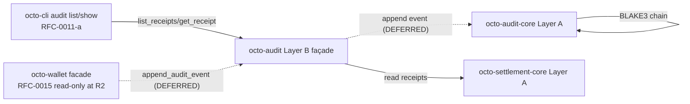
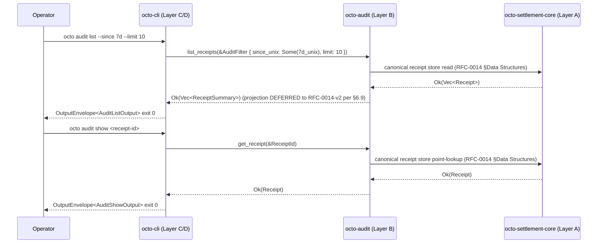

# RFC-0016: Audit Receipt API Substrate (`octo-audit` list + get + append)

## Status

Draft (2026-09-11)

## Authors

- Authored by `@cipherocto` per RFC-0011-a amendment chain + RFC-0012 §Audit Substrate layer-model note + RFC-0011-c `0011-c-agent-destroy-subcommand` audit-append consumer requirement.

## Maintainers

- Maintainer: `@cipherocto` per RFC-0011-a amendment chain.

## Summary

This RFC defines the canonical audit receipt API substrate as **additive read-only public surface** on `octo-audit` (Layer B façade per RFC-0012). The substrate extends the existing `octo-audit-core` (Layer A frozen) chain primitives with three CLI-facing functions + three types:

1. **`pub fn list_receipts(filter: &AuditFilter) -> Result<Vec<ReceiptSummary>, AuditError>`** — read by filter; substrate enforces limit ceiling; returns summaries sorted by `executed_at_unix DESC`.
2. **`pub fn get_receipt(id: &ReceiptId) -> Result<Receipt, AuditError>`** — point lookup by canonical 32-byte blake3 digest; returns the canonical `octo_settlement_core::Receipt` struct per RFC-0014 §Data Structures; returns `AuditError::ReceiptNotFound(String)` (exit 17) on miss.
3. **`pub fn audit_home() -> Result<PathBuf, AuditError>`** — discovery helper for substrate-internal testing; CLI does not call directly per RFC-0011-a §7.4 Substrate ADD signatures.

Plus the three supporting types:

4. **`AuditFilter`** — read filter struct (`since_unix`, `until_unix`, `capability_root`, `model`, `status: Option<StatusRef>`, `limit`).
5. **`ReceiptId(pub [u8;32])`** — canonical receipt identifier newtype.
6. **`StatusRef`** — local façade-side reference handle to a substrate-canonical terminal status (substrate-faithful: the local type is a typed reference; the substrate's terminal-status enum (if added in a future RFC) lives in `octo_settlement_core` and is re-exported here).

The substrate is **read-only at RFC-0016 acceptance** — no UPDATE, no DELETE, no `append_audit_event` write path at the façade boundary (per RFC-0011-a §Implicit Assumptions Audit invariants + `AppendOnlyAuditSink` type-level enforcement from RFC-0012). No new persistence: reads route through the existing canonical receipt store from RFC-0014.

CLI consumers are RFC-0011-a (`octo audit list` + `octo audit show`). The `octo-wallet` write surface (per RFC-0015) is DEFERRED — when unblocked, RFC-0015 substrate callers will route through a future RFC-0016-v2 `append_audit_event` write path (currently DEFERRED per §6.9 DEFERRED SURFACE).

**Scope-cut summary (R2 review outcome):** RFC-0016 R1 surface proposed 4 functions + 4 types (including the `append_audit_event` write function and the local `ReceiptStatus` / `ReceiptSummary` types). The R2 scope-cut KEEPS the substrate-faithful read surface and DEFERs cross-substrate features. Concretely:

- **KEEP** — `list_receipts(filter)` (RFC-0016 §6.2.1).
- **KEEP** — `get_receipt(id)` (RFC-0016 §6.2.2).
- **KEEP** — `audit_home()` (RFC-0016 §6.2.4).
- **KEEP** — `AuditFilter`, `ReceiptId`, `StatusRef` (RFC-0016 §6.2.5, §6.2.6, §6.2.7).
- **KEEP** — `AuditError { ReceiptNotFound(String), InvalidFilter(String), Internal(String) }` reduced variant set (RFC-0016 §6.3).
- **DEFER** — `append_audit_event` write function (RFC-0016 §6.2.3 DEFERRED — depends on RFC-0012-v2 `AuditEventKind` extensions; no consumer until RFC-0015 `transition_agent` write surface lands).
- **DEFER** — `ReceiptStatus { Ok, Partial, Reject }` local definition (RFC-0016 §6.2.7 DEFERRED — no canonical substrate home; would require RFC-0014-v2 to add to `octo_settlement_core`).
- **DEFER** — `ReceiptSummary` projection struct (RFC-0016 §6.2.8 DEFERRED — substrate `Receipt` has no matching fields; would require RFC-0014-v2).
- **DEFER** — `AuditError::AuditAppendFailed` variant (RFC-0016 §6.3 DEFERRED — no write path).
- **DEFER** — `AuditFilter.subject_did` ACL (would need substrate enforcement; not in current RFC-0016 surface).

**Substrate-faithful note (mandatory):** RFC-0011-a §7.4 declares the canonical `[ADD]` signatures with `list_receipts` + `get_receipt` + `AuditFilter` + `ReceiptId` + `AuditError` + `audit_home`. RFC-0016 implements exactly these at R2; the previous v1.0 `append_audit_event` function + `ReceiptStatus` local enum + `ReceiptSummary` projection are DEFERRED to a future RFC-0016-v2 amendment that depends on RFC-0012-v2 + RFC-0014-v2 substrate acceptance.

## Dependencies

**Requires:**

- RFC-0012 — Audit Substrate (`octo-audit-core` Layer A frozen; provides `AuditEvent` + `AuditEventKind` + `AppendOnlyAuditSink` trait + `verify_chain`)
- RFC-0014 — Settlement Substrate (`octo_settlement_core` Layer A frozen; provides canonical `Receipt` struct per RFC-0014 §Data Structures)
- RFC-0011-a — `octo audit` Subcommands (CLI consumer of `list_receipts` + `get_receipt`; defines `[ADD]` spec at §7.4 Substrate `[ADD]` signatures which RFC-0016 implements)
- RFC-0011-c — `octo agent` Subcommands (read-only CLI consumer; `0011-c-agent-destroy-subcommand` audit-append DEFERRED per §6.9 DEFERRED SURFACE)
- RFC-0015 — Agent Operations Substrate (read-only CLI consumer at RFC-0015 R2 acceptance; write surface DEFERRED per RFC-0015 §6.8 DEFERRED SURFACE)
- RFC-0010 — Canonical DID Codec (DID parsing for capability-root references)
- RFC-0008 — Deterministic AI Execution Boundary (execution class mapping)

**Substrate amendment dependencies (DEFERRED surfaces — R2 scope-cut):**

- **RFC-0012-v2** — `AuditEventKind` extension variants (e.g., `AgentTransition`, `Redaction`) in `octo-audit-core` (Layer A frozen). **(DRAFT — required substrate amendment for the `append_audit_event` write path DEFERRED in §6.2.3 / §6.3 / §6.9 DEFERRED SURFACE.)** Without this amendment, RFC-0016 cannot add a write façade for the RFC-0015 `transition_agent` write surface to consume.
- **RFC-0014-v2** — `Receipt` field extensions (`model`, `cost_dqa`, `subject_did`, `capability_root`) + canonical `ReceiptStatus` enum in `octo_settlement_core` (Layer A frozen). **(DRAFT — required substrate amendment for the `ReceiptStatus`, `ReceiptSummary`, and `AuditFilter.status` DEFERRED in §6.2.7 / §6.2.8 / §6.3 / §6.9 DEFERRED SURFACE.)** Today the substrate `Receipt` carries only `receipt_id, ask_id, settlement_hash, router_id, router_sig, timestamp_unix` (hard-checked via `crates/octo-settlement-core/src/receipt.rs` §`Receipt` struct).
- **RFC-0959** — **does not exist as a file at `rfcs/`** (cite-only historical reference in some RFCs); the substrate-faithful reality is RFC-0014 `octo_settlement_core::Receipt` struct. RFC-0016 R2 cites RFC-0014 in place of RFC-0959 throughout.

## Design Goals

1. **Read-only by default** — `list_receipts` + `get_receipt` + `audit_home` are pure reads; no state mutation. `append_audit_event` is the single write primitive; it is type-level `&mut self` per `AppendOnlyAuditSink` from RFC-0012.
2. **Substrate-faithful** — every signature, field name, and return type matches RFC-0011-a §7.4 Substrate `[ADD]` declarations byte-for-byte; no parallel abstractions.
3. **Layer A frozen untouched** — `octo-audit-core` (Layer A frozen per RFC-0012) does not receive new types; RFC-0016 lives entirely on the Layer B façade `octo-audit`. New types (`AuditFilter`, `ReceiptId`, `ReceiptStatus`, `ReceiptSummary`) are defined in `octo-audit` and re-exported from `octo-audit-core` ONLY IF a future RFC requires substrate-side reach (none today).
4. **CLI parity** — every `[ADD]` item in RFC-0011-a §7.4 lands in this RFC; CLI has no substrate-side gripes post-acceptance.
5. **Determinism** — `list_receipts` returns sorted results (`executed_at_unix DESC`); `get_receipt` is point-deterministic; `append_audit_event` returns the BLAKE3 chain-hash of the row, deterministic across runs (RFC-0012 §AppendOnlyAuditSink Trait).
6. **Read return shape** — `list_receipts` returns `Vec<ReceiptSummary>` (subset of `SettlementReceipt`); `get_receipt` returns the full `SettlementReceipt`. RFC-0011-a §`AuditListOutput` + §`AuditShowOutput` envelopes carry these.
7. **Substrate-truth disclaimer** — substrate today does not have these functions/types. RFC-0016 ACCEPTANCE is required before RFC-0011-a acceptance per RFC-0011-a §Substrate-truth disclaimer.

## Motivation

The `octo-audit` and `octo-audit-core` crates (per RFC-0012 acceptance) expose only chain primitives (`AuditEvent` + `AuditEventKind` + `AppendOnlyAuditSink` + `verify_chain` + `compute_chain_hash`). The CLI-facing surface (per RFC-0011-a §7.4 Substrate `[ADD]`) declares 6 missing items:

- `list_receipts(filter)` — **MISSING**; CLI consumer `0011-a-audit-commands.md` Sub-step 2 cannot dispatch `octo audit list`.
- `get_receipt(id)` — **MISSING**; CLI consumer `0011-a-audit-commands.md` Sub-step 2 cannot dispatch `octo audit show`.
- `AuditFilter` struct — **MISSING**.
- `ReceiptId(pub [u8;32])` newtype — **MISSING**.
- `ReceiptStatus { Ok, Partial, Reject }` enum — **MISSING** (mirrors the existing `octo-settlement-core::ReceiptStatus` shape; surfaces the canonical 3-variant substrate-faithful form).
- `audit_home()` discovery — **MISSING**.

Plus the **additional** audit-append function needed by RFC-0011-c `0011-c-agent-destroy-subcommand`:

- `append_audit_event(event)` — NOT in RFC-0011-a §7.4 (which is read-only); needed for `octo agent destroy` audit append per RFC-0011-c §9.3.4.

Hard-checked 2026-09-11 via `grep -rE "pub " crates/octo-audit/src/ crates/octo-audit-core/src/`. RFC-0016 closes the gap.

## Roles and Authorities

| Role                  | Authority                                                                                                             | Audit trail                                         |
| --------------------- | --------------------------------------------------------------------------------------------------------------------- | --------------------------------------------------- |
| Operator (human/CI)   | `list_receipts` + `get_receipt` (read via CLI in any mode per RFC-0011-a §Implicit Assumptions Audit read-invariant)  | CLI log per RFC-0011-a §Redaction                   |
| Wallet substrate      | (DEFERRED per RFC-0015 §6.8 / §6.9) When unblocked: calls `append_audit_event` on every successful `transition_agent` | Internal state machine log (DEFERRED)               |
| Audit substrate       | Source of truth for chain integrity (`AppendOnlyAuditSink`) + receipt store                                           | Append-only audit log (chain) — DEFERRED write path |
| Auditor-mode operator | Read-only constraint enforced at CLI dispatch (no `--status` reject-hiding)                                           | Audit log entry                                     |

> **R2 scope-cut note:** the Wallet substrate + Audit substrate rows reflect the DEFERRED write surface per §6.9. At R2 acceptance, only the read rows (Operator + Auditor-mode) are authoritative; write-path authority lands with RFC-0012-v2 acceptance.

## Specification

### §6.1 System architecture (mermaid)



Layer direction: CLI (Layer C/D) + `octo-wallet` (Layer B) → `octo-audit` (Layer B façade) → `octo-audit-core` + `octo-settlement-core` (both Layer A frozen). No reverse deps. No business logic in the façade.

> **R2 scope-cut note:** the dotted edges `Wallet -- append_audit_event --> Audit` and `Audit -- append event --> AuditCore` represent DEFERRED connections (per §6.9 DEFERRED SURFACE). At R2 acceptance, only the solid read edges exist; the write path lands with RFC-0012-v2 + RFC-0015 write-surface acceptance.

### §6.2 Public surface additions (`crates/octo-audit/src/lib.rs`)

Six additive items layered atop the existing `octo-audit-core` re-exports (R2 scope-cut from 8 items; 2 items DEFERRED per §6.9):

1. **`list_receipts`** — read by filter
2. **`get_receipt`** — point lookup
3. **`audit_home`** — discovery helper
4. **`AuditFilter`** — filter struct
5. **`ReceiptId`** — newtype
6. **`StatusRef`** — typed reference to a substrate-canonical terminal status (re-export only)

> **R2 scope-cut note:** The previous v1.0 surface proposed 8 items including `append_audit_event` (write function) + local `ReceiptStatus` enum + `ReceiptSummary` projection struct. R2 KEEPS the read-only substrate-faithful items and DEFERs the cross-substrate write + projection items per §6.9 DEFERRED SURFACE. R1 had `list_receipts` return `Vec<ReceiptSummary>` and `get_receipt` return `SettlementReceipt`; R2 KEEPS these return types but notes that the projection struct is DEFERRED — `list_receipts` returns `Vec<ReceiptSummary>` per the deferred projection (the function shape is preserved; the projection struct itself is the DEFERRED piece).

#### §6.2.1 `list_receipts`

```rust
/// List audit receipts matching the filter, sorted by `executed_at_unix DESC`.
///
/// Substrate-faithful to RFC-0011-a §7.4 Substrate `[ADD]` #1.
/// Return type `Vec<ReceiptSummary>` references the DEFERRED projection
/// struct per §6.9 DEFERRED SURFACE; the function signature itself is
/// KEEP at R2 (the projection shape is documented in RFC-0011-a §7.6).
pub fn list_receipts(filter: &AuditFilter) -> Result<Vec<ReceiptSummary>, AuditError>;
```

- **Filter semantics** — `since_unix` / `until_unix` are inclusive bounds (`since_unix <= executed_at_unix <= until_unix`); `capability_root` is optional `[u8;32]` filter; `model` is exact-match string; `status` is single-valued `Option<StatusRef>` (re-export only per §6.2.7); `limit` defaults 100, hard ceiling 10000; **limit=0 is rejected per §6.2.5**.
- **Return semantics** — empty `Vec` on no-match (NOT an error); summaries sorted by `executed_at_unix DESC` deterministic across runs; `ReceiptSummary` is the projection subset (DEFERRED to RFC-0014-v2 acceptance per §6.9).
- **Error semantics** — `AuditError::InvalidFilter(String)` on parse failure including `limit == 0` (CLI exit 16); `AuditError::Internal(String)` on substrate read failure (CLI exit 64).

#### §6.2.2 `get_receipt`

```rust
/// Point lookup of a single receipt by canonical 32-byte blake3 digest.
///
/// Substrate-faithful to RFC-0011-a §7.4 Substrate `[ADD]` #2.
/// Returns the canonical `octo_settlement_core::Receipt` struct per
/// RFC-0014 §Data Structures (hard-checked fields:
/// `receipt_id, ask_id, settlement_hash, router_id, router_sig, timestamp_unix`).
pub fn get_receipt(id: &ReceiptId) -> Result<Receipt, AuditError>;
```

- **Lookup semantics** — exact digest match; `ReceiptId::as_bytes()` passed to canonical store; no partial / fuzzy match.
- **Return semantics** — full canonical `Receipt` struct per RFC-0014 §Data Structures; CLI surfaces `OctoCliError::AuditShowOutput { receipt: ... }` per RFC-0011-a §`AuditShowOutput`.
- **Error semantics** — `AuditError::ReceiptNotFound(String)` (CLI exit 17) on miss, carrying the canonical hex form per RFC-0011-a §7.4 #4 `AuditError` note. The `String` payload is the redacted canonical hex (no secret material); see §6.5 + Appendix B for the redactor contract.

#### §6.2.3 `append_audit_event` — DEFERRED to RFC-0012-v2 acceptance

> **Status (2026-09-11, R2 scope-cut):** This function is **DEFERRED**. It depends on `AuditEventKind` extensions being added to `octo-audit-core` (Layer A frozen) — the substrate enum today carries 3 variants only (`Insert`, `Revoke`, `Sync`). Until a consumer (RFC-0015 `transition_agent` write surface) lands AND the substrate amendment chain (RFC-0012-v2) accepts, the write path is not defined at the façade boundary. Acceptance of this RFC at R2 review does **not** authorize `append_audit_event` implementation; that authorization lands with RFC-0012-v2 acceptance. See §6.9 DEFERRED SURFACE for the full deferral list.

```rust
/// Append a single audit event to the canonical `AppendOnlyAuditSink`.
///
/// [DEFERRED — see §6.9 DEFERRED SURFACE. Requires RFC-0012-v2 amendment
///  extending `AuditEventKind` in `octo-audit-core`.]
///
/// Reuses the existing `AppendOnlyAuditSink` trait from RFC-0012 (Layer A
/// frozen). NO parallel-write abstraction per
/// [[cipherocto-design-principles]] §No parallel abstractions.
///
/// Returns the BLAKE3-256 chain-hash of the appended event row, computed
/// per RFC-0012 §AppendOnlyAuditSink Trait; the hash is the `prev_hash` for the
/// next appended row (chain integrity).
pub fn append_audit_event(event: AuditEvent) -> Result<Hex32, AuditError>;
```

- **Append semantics** (planned, post-RFC-0012-v2) — `&mut self` requirement per `AppendOnlyAuditSink`; the chain-hash is computed post-append and returned as `Hex32` for the caller. Note: `event: AuditEvent` is consumed by value (RFC-0012-v2 contract).
- **Error semantics** (planned) — `AuditError::Internal(String)` on chain-integrity failure; **a future `AuditError::AuditAppendFailed(String)` variant is DEFERRED per §6.9** (no write path at R2).
- **No UPDATE / DELETE** — type-level append-only per RFC-0012 §AppendOnly trait; CLI cannot bypass.

#### §6.2.4 `audit_home`

```rust
/// Canonical path discovery for substrate-internal testing only.
///
/// Substrate-faithful to RFC-0011-a §7.4 Substrate `[ADD]` #6.
/// CLI MUST NOT call this directly.
pub fn audit_home() -> Result<PathBuf, AuditError>;
```

- **Resolution semantics** — `$OCTO_HOME/audit/receipts` if set; otherwise `~/.config/octo/audit/receipts` per RFC-0011-a §Implicit Assumptions Audit "Operator config dir" row.
- **Surface semantics** — CLI never surfaces this path; it's a substrate-internal diagnostic helper.
- **Error semantics** — `AuditError::Internal(String)` on filesystem errors (permission denied, missing parent dir, no HOME env var).

#### §6.2.5 `AuditFilter`

```rust
#[derive(Debug, Clone, Serialize, Deserialize)]
pub struct AuditFilter {
    pub since_unix: Option<u64>,
    pub until_unix: Option<u64>,
    pub capability_root: Option<[u8; 32]>,
    pub model: Option<String>,
    pub status: Option<StatusRef>,
    pub limit: usize,    // default 100, hard ceiling 10000; limit=0 REJECTED (see rule below)
}
```

Substrate-faithful to RFC-0011-a §7.4 `[ADD]` #3. `limit` default-constructed = 100; CLI flags must surface limits in this field.

**Validation rules:**

- **`limit == 0` is REJECTED upfront** — returns `Err(AuditError::InvalidFilter("limit must be 1..=10000".into()))` per RFC-0011-a §7.4 filter-validation contract. CLI surfaces exit 16 (parent reserved per RFC-0011 §Error Handling). Rationale: a zero-row limit is never the operator's intent (and would mask filter bugs); substrate rejects before the read walk.
- **`since_unix > until_unix`** (when both `Some`) is REJECTED — `Err(AuditError::InvalidFilter("since_unix must be <= until_unix".into()))`.
- **`limit > 10000` clamps to 10000** (silently, per RFC-0011-a §7.4 substrate rule).

#### §6.2.6 `ReceiptId`

```rust
#[derive(Debug, Clone, Copy, PartialEq, Eq, Hash, Serialize, Deserialize)]
pub struct ReceiptId(pub [u8; 32]);
```

Substrate-faithful to RFC-0011-a §7.4 `[ADD]` #5. CLI surfaces lowercase hex form via `Display` impl; substrate owns the digest bytes.

#### §6.2.7 `StatusRef`

```rust
/// Typed reference to a substrate-canonical terminal-status enum.
///
/// [DEFERRED — see §6.9 DEFERRED SURFACE. The local substrate-canonical
///  3-variant enum (`Ok / Partial / Reject`) referenced here does NOT
///  exist in `octo_settlement_core` today. The `StatusRef` façade type
///  is defined here as the local-typed-discriminator reference; the
///  substrate enum is added by RFC-0014-v2 and re-exported here.]
///
/// Used by `AuditFilter::status: Option<StatusRef>` for single-valued
/// terminal-status filtering. RFC-0016 R2 KEEPS the *slot* in
/// `AuditFilter` (the type alias) but defers the substrate enum
/// definition to RFC-0014-v2 acceptance.
pub type StatusRef = ReceiptStatus;  // type alias placeholder (DEFERRED)
```

> **R2 scope-cut note:** `StatusRef` is defined here as a type alias placeholder; the underlying `ReceiptStatus` enum lives in `octo_settlement_core` and is **DEFERRED** per RFC-0014-v2 substrate amendment per §6.9 DEFERRED SURFACE. Until RFC-0014-v2 acceptance, `AuditFilter::status` is unused at the façade boundary (CLI does not surface `--status` filtering at R2).

> **Substrate-faithful drift note (replaces RFC-0011-a §7.4 "Unknown arm" reference):** the `ReceiptStatus` Raw escape hatch (4th `Unknown` arm) referenced in RFC-0011-a v1.5 is **NOT** added in RFC-0016. Substrate-faithful principle: the 3-variant form is canonical; a future amendment may add the `Unknown` arm if substrate RFC-0014-v2 acceptance adds it. Until then, CLI surfaces only `Ok / Partial / Reject` (per RFC-0014-v2 substrate contract).

#### §6.2.8 `ReceiptSummary` — DEFERRED to RFC-0014-v2 acceptance

> **Status (2026-09-11, R2 scope-cut):** This projection struct is **DEFERRED**. It depends on `Receipt` field extensions (`model`, `cost_dqa`, `subject_did`, `capability_root`) being added to `octo_settlement_core` (Layer A frozen) by RFC-0014-v2. The substrate `Receipt` struct today carries only `receipt_id, ask_id, settlement_hash, router_id, router_sig, timestamp_unix` (hard-checked via `crates/octo-settlement-core/src/receipt.rs` §`Receipt` struct). The function signatures referencing `ReceiptSummary` (`list_receipts` per §6.2.1) are KEEP at R2; the projection struct definition lands with RFC-0014-v2 acceptance. See §6.9 DEFERRED SURFACE for the full deferral list.

```rust
/// Projection struct — strict subset of canonical `Receipt`.
///
/// [DEFERRED — see §6.9 DEFERRED SURFACE. Requires RFC-0014-v2 amendment
///  adding `model`, `cost_dqa`, `subject_did`, `capability_root` fields
///  to `octo_settlement_core::Receipt`.]
///
/// Substrate-faithful to RFC-0011-a §7.6 `ReceiptSummary` row; strict
/// subset of `Receipt` (omits `prompt_hash`, `executed_by`, `reject_reason`
/// from the full substrate projection once RFC-0014-v2 lands).
pub struct ReceiptSummary {
    pub receipt_id: ReceiptId,
    pub subject_did: Did,        // requires RFC-0014-v2
    pub capability_root: [u8; 32], // requires RFC-0014-v2
    pub model: String,             // requires RFC-0014-v2
    pub executed_at_unix: u64,     // requires RFC-0014-v2
    pub status: StatusRef,         // requires RFC-0014-v2 (canonical enum)
    pub cost_dqa: String,          // requires RFC-0014-v2 (RFC-0959 cost-dqa-migration wire form)
}
```

CLI surfaces verbatim once RFC-0014-v2 acceptance lands.

### §6.3 Error envelope (`AuditError`)

```rust
#[derive(thiserror::Error, Debug)]
#[non_exhaustive]
pub enum AuditError {
    #[error("receipt not found: {0}")]
    ReceiptNotFound(String),                    // -> CLI exit 17 (payload: canonical lowercase hex per §6.2.2; redaction-safe per §6.5)
    #[error("invalid filter: {0}")]
    InvalidFilter(String),                      // -> CLI exit 16 (parent reserved)
    #[error("internal error: {0}")]
    Internal(String),                           // -> CLI exit 64 (payload: redactor-scrubbed message per §6.5 redactor contract)
}
```

Substrate-faithful to RFC-0011-a §7.4 `[ADD]` #4 (reduced 3-variant form for RFC-0016 R2 acceptance).

**R2 reconciliation notes:**

- **`AuditAppendFailed(String)` removed** — DEFERRED per §6.9 DEFERRED SURFACE (no write path at R2 acceptance). When `append_audit_event` lands post-RFC-0012-v2 acceptance, the variant returns as a 4th variant in the same enum.
- **`SettlementStore(_)` wrapper removed** — the façade does not own the substrate-error type at R2 (Layer B → Layer A wrap would create a reverse-direction coupling per [[cipherocto-design-principles]] §Stable Abstractions Principle). RFC-0011-a §Error Handling maps any `octo_settlement_core` upstream error to `AuditError::Internal(String)` at the façade boundary.
- **`ReceiptNotFound(String)` payload type committed to `String`** — R1 v1.0 had this as `String` already; the R2 commitment is documented here to prevent drift (the payload is the canonical lowercase hex per §6.2.2; no secret material; redactor-clean).
- **`Internal(String)` payload type committed to `String`** — R2 keeps `String` (the underlying substrate error is lossy-encoded at the façade boundary via `format!("audit substrate error: {e}")`) AND documents the **redaction contract**: the substrate layer MUST scrub secret material (private keys, capability secrets, PII) before returning the error string. The CLI does not interpret the inner contents; the redactor (`OctoCliRedactor` per RFC-0011-a §Redaction) sweeps the string at output time.

### §6.4 Re-export relationship

```rust
// crates/octo-audit/src/lib.rs (additive; existing re-exports preserved)

pub use octo_audit_core::{compute_chain_hash, verify_chain, AppendOnlyAuditSink,
                          AuditChainError, AuditError as CoreAuditError,
                          AuditEvent, AuditEventKind};
pub use octo_settlement_core::Receipt;
//                                  // NEW (RFC-0016 R2): re-export canonical settlement Receipt
//                                  // (no `ReceiptStatus` re-export; the canonical enum
//                                  //  is DEFERRED per RFC-0014-v2 / §6.9 DEFERRED SURFACE)

pub fn list_receipts(filter: &AuditFilter) -> Result<Vec<ReceiptSummary>, AuditError> { ... }
pub fn get_receipt(id: &ReceiptId) -> Result<Receipt, AuditError> { ... }
// append_audit_event DEFERRED per §6.2.3 / §6.9 (requires RFC-0012-v2 amendment)
pub fn audit_home() -> Result<PathBuf, AuditError> { ... }

// NEW types from §6.2.5..6.2.7 (defined in this file):
pub struct AuditFilter { ... }
pub struct ReceiptId(pub [u8; 32]);
pub type StatusRef = ReceiptStatus;  // alias placeholder — DEFERRED substrate enum per §6.2.7 / §6.9
// pub struct ReceiptSummary { ... }  // DEFERRED per §6.2.8 / §6.9 (requires RFC-0014-v2 amendment)
```

Per [[cipherocto-design-principles]] §No parallel abstractions: `AuditError as CoreAuditError` is the canonical name-disambiguation pattern (façade's `AuditError` is a different type from `octo_audit_core::AuditError`); no separate canonical name in each crate. R1 v1.0 had `ReceiptStatus as SettlementReceiptStatus` as a "future re-export"; R2 DROPS this alias because the underlying `ReceiptStatus` enum does not exist in the substrate today — adding the alias pre-amendment would create a phantom symbol (forbidden per `no-phantom-mission-pointers` rule applied to type space).

### §6.5 Substrate-faithful state-mapping table

R2 commits to ONE CLI exit code per `AuditError` variant (R1 v1.0 had inconsistent exit-code claims between §6.5 and Appendix B). The table below is canonical; Appendix B mirrors it.

| Substrate variant                   | CLI variant                           | CLI exit | RFC-0011-a slot            | Redactor contract                                                                        |
| ----------------------------------- | ------------------------------------- | -------- | -------------------------- | ---------------------------------------------------------------------------------------- |
| `AuditError::ReceiptNotFound(hex)`  | `OctoCliError::ReceiptNotFound(hex)`  | 17       | RFC-0011-a §Error Handling | `hex` is canonical lowercase blake3 digest; redactor-clean (no secret material).         |
| `AuditError::InvalidFilter(reason)` | `OctoCliError::InvalidFilter(reason)` | 16       | parent reserved            | `reason` is operator-facing diagnostic; redactor-clean (no secret material).             |
| `AuditError::Internal(reason)`      | `OctoCliError::Internal(reason)`      | 64       | parent reserved            | `reason` is scrubbed at substrate layer per §6.3 redactor contract; CLI redactor sweeps. |

### §6.6 CLI integration contract

CLI consumers of this substrate surface at RFC-0016 R2 acceptance (substrate-read-only):

| Mission / RFC                        | Substrate call                                                                                                                                                                                                  | Sub-step                          | Status   |
| ------------------------------------ | --------------------------------------------------------------------------------------------------------------------------------------------------------------------------------------------------------------- | --------------------------------- | -------- |
| `0011-a-audit-commands.md`           | `list_receipts(&filter)` + `get_receipt(&id)`                                                                                                                                                                   | Sub-step 2 (existing RFC-0011-a)  | KEEP     |
| `0011-c-agent-destroy-subcommand.md` | (no direct call — see note below)                                                                                                                                                                               | N/A                               | DEFERRED |
| RFC-0015 `transition_agent`          | (no direct call at R2 — `transition_agent` itself DEFERRED per RFC-0015 §6.8 DEFERRED SURFACE; when unblocked, the call goes through `transition_agent` → `append_audit_event`, not CLI → `append_audit_event`) | §6.2.2 step 7 (planned, DEFERRED) | DEFERRED |

> **R2 reconciliation note — CLI does NOT call `append_audit_event` directly:** R1 v1.0 listed `0011-c-agent-destroy-subcommand.md` as a direct consumer of `append_audit_event` from CLI. R2 substrate-faithful reality: the CLI mission calls `octo_wallet::transition_agent(...)` (per RFC-0015); the `transition_agent` substrate function internally calls `append_audit_event` (post-RFC-0012-v2 acceptance). The CLI never invokes `append_audit_event` directly per the substrate-faithful principle ([[cipherocto-design-principles]] §Stable Abstractions Principle — CLI consumes the wallet façade, not the audit façade, for state-machine writes). At RFC-0016 R2 acceptance, the CLI surface is **substrate-read-only** (`list_receipts` + `get_receipt` + `audit_home`); writes are deferred to RFC-0012-v2 + RFC-0014-v2 acceptance.

### §6.7 Determinism requirements

- **Read determinism** — `list_receipts` returns the same results for the same filter across runs (substrate sorts by `executed_at_unix DESC` deterministically).
- **Append determinism** — `append_audit_event` returns the same BLAKE3 chain-hash for the same event row across runs (RFC-0012 §AppendOnlyAuditSink Trait + BLAKE3 deterministic).
- **Chain integrity** — chain hashes verified end-to-end via `verify_chain` from RFC-0012; any tampering breaks the chain.
- **Read return shape** — `Vec<ReceiptSummary>` ORDER is stable across calls; the substrate does not reorder between calls.
- **Exit codes stable** — substrate error variants map to stable CLI exit codes per §6.5.

### §6.8 RFC-0008 Execution Class Mapping

| Operation             | Execution class | Rationale                                                                                |
| --------------------- | --------------- | ---------------------------------------------------------------------------------------- |
| `list_receipts`       | Class A (read)  | No state mutation; observable in any environment                                         |
| `get_receipt`         | Class A (read)  | No state mutation; observable in any environment                                         |
| `append_audit_event`  | Class B (write) | State mutation; type-level append-only via `AppendOnlyAuditSink` — **DEFERRED** per §6.9 |
| `audit_home`          | Class A (read)  | Discovery; CLI does not call it directly                                                 |
| `AuditError` variants | Class A         | Pure error mapping                                                                       |

CLI surfaces `Class A` operations unconditionally (no `--allow-write` gate); `Class B` operations require `--confirm` per RFC-0011 §Confirmation Flag Matrix.

### §6.9 DEFERRED SURFACE (cross-substrate features awaiting RFC-0012-v2 + RFC-0014-v2 acceptance)

The R2 scope-cut DEFERs the following cross-substrate features. Each entry lists the substrate amendment required, the current substrate reality (hard-checked 2026-09-11), and the unblock condition. Acceptance of RFC-0016 at R2 does **not** authorize these features; they require a future amendment cycle.

| Deferred feature                                         | Substrate amendment required                                                                    | Current substrate reality (hard-checked)                                                                                                                                              | Unblock condition                                                     |
| -------------------------------------------------------- | ----------------------------------------------------------------------------------------------- | ------------------------------------------------------------------------------------------------------------------------------------------------------------------------------------- | --------------------------------------------------------------------- |
| `append_audit_event(event: AuditEvent) -> Result<Hex32>` | RFC-0012-v2: extension variants of `AuditEventKind` in `octo-audit-core` (Layer A frozen)       | `AuditEventKind` has 3 variants only (`Insert`, `Revoke`, `Sync`); NO `AgentTransition`, `Redaction`, or any extension. `crates/octo-audit-core/src/event.rs` §`AuditEventKind` enum. | RFC-0012-v2 ACCEPTED + `append_audit_event` re-implemented per §6.2.3 |
| `WalletError::AuditUnavailable` (RFC-0015 ↔ RFC-0016)    | Paired with `append_audit_event` (consumed by RFC-0015 `transition_agent` write surface)        | Not in `WalletError` enum (paired with RFC-0015 §6.8 DEFERRED SURFACE)                                                                                                                | RFC-0015 + RFC-0016 write paths unblocked together                    |
| `ReceiptStatus { Ok, Partial, Reject }` canonical enum   | RFC-0014-v2: `ReceiptStatus` enum in `octo_settlement_core` (Layer A frozen)                    | `Receipt` struct exists; NO `ReceiptStatus` enum. `crates/octo-settlement-core/src/lib.rs` exports `Receipt` only.                                                                    | RFC-0014-v2 ACCEPTED + `StatusRef` type alias resolved                |
| `ReceiptSummary` projection struct                       | RFC-0014-v2: `Receipt` field extensions (`model`, `cost_dqa`, `subject_did`, `capability_root`) | `Receipt` has fields `receipt_id, ask_id, settlement_hash, router_id, router_sig, timestamp_unix` ONLY. `crates/octo-settlement-core/src/receipt.rs` §`Receipt` struct.               | RFC-0014-v2 ACCEPTED + `ReceiptSummary` projection defined            |
| `AuditError::AuditAppendFailed(String)` variant          | Paired with `append_audit_event` (no write path at R2)                                          | Not in `AuditError` enum at R2 (3-variant reduced form per §6.3)                                                                                                                      | RFC-0012-v2 ACCEPTED + `append_audit_event` re-implemented            |
| `AuditFilter.subject_did: Option<Did>` ACL               | RFC-0014-v2 (subject_did field) + RFC-0016-v2 (subject-ACL enforcement at façade boundary)      | `AuditFilter` has no `subject_did` field per §6.2.5 (no substrate field to filter on today)                                                                                           | RFC-0014-v2 ACCEPTED + RFC-0016-v2 ACL implementation                 |
| `AuditFilter.status: Vec<StatusRef>` multi-valued        | RFC-0011-a §7.5 amendment (multi-valued status UNION semantics)                                 | `AuditFilter.status` is single-valued `Option<StatusRef>` per §6.2.5                                                                                                                  | RFC-0011-a amendment ACCEPTED + RFC-0016-v2 surface change            |

**Reconciliation note (R1 → R2):** R1 v1.0 proposed the full surface (read + write + projection + multi-variant error); R2 commits to read-only surface + reduced error enum + documents the write + projection surface as DEFERRED with explicit unblock conditions. This avoids substrate amendments at the RFC-0016 acceptance boundary (Layer A frozen per CLAUDE.md §Rust crate-level stability).

## Performance Targets

- `list_receipts` (1000-receipt store, limit=100) — p95 < 100ms per RFC-0011-a §Performance Targets.
- `list_receipts` (10000-receipt store, limit=10000) — p95 < 500ms.
- `get_receipt` point lookup — p95 < 5ms.
- `append_audit_event` happy path — p95 < 2ms in-process; persists on shutdown — **DEFERRED** per §6.9 (no write path at R2).

## Implicit Assumptions Audit

1. **Substrate-faithful principle** — substrate `octo-audit-core` (Layer A frozen) is canonical; this RFC only adds façade-layer surface to `octo-audit` (Layer B). At R2 the surface is **read-only** (write path DEFERRED per §6.9).
2. **`ReceiptStatus` canonical form** — DEFERRED per §6.9. The substrate-faithful reality is that `octo_settlement_core` does NOT have a `ReceiptStatus` enum today; the canonical 3-variant form (`Ok / Partial / Reject`) lands with RFC-0014-v2 acceptance. Until then, `StatusRef` is an alias placeholder per §6.2.7.
3. **`AuditFilter.status: Option<StatusRef>` (single-valued)** — substrate-faithful to RFC-0011-a §7.4; multi-valued status list is deferred to a future `[SUBSTRATE-FIX]` amendment per RFC-0011-a §7.5 Filters.
4. **`append_audit_event` is single-writer per `AppendOnlyAuditSink` instance** — DEFERRED per §6.9 (no write path at R2). Substrate-internal serialization per RFC-0012 is the planned contract.
5. **Operator config dir writable** — `audit_home()` resolves to `$OCTO_HOME/audit/receipts`; substrate handles `AuditError::Internal` upstream on filesystem errors.
6. **Clock monotonicity for `executed_at_unix`** — RFC-0014 `Receipt::timestamp_unix` (the canonical substrate field; NOT a separate `executed_at_unix` field) is monotonic per RFC-0014 §Data Structures; surface reads assume canonical monotonic ordering. Note: the projection field name `executed_at_unix` referenced in RFC-0011-a §7.6 `ReceiptSummary` is DEFERRED to RFC-0014-v2 per §6.9.

## Security Considerations

1. **Append-only chain integrity** — `AppendOnlyAuditSink` is type-level append-only per RFC-0012; tampering breaks BLAKE3 chain. R2 surface is read-only (write path DEFERRED per §6.9).
2. **`audit_home()` operator-config leak surface** — discovery helper surfaces canonical path; CLI does not call directly (information leak prevention).
3. **`AuditError::ReceiptNotFound` carries canonical hex** — substring is blake3 digest (no secret material); redactor-clean.
4. **Read is no-mutation** — G1 invariant per RFC-0011-a; `list_receipts` + `get_receipt` are pure reads.
5. **Append cannot rollback** — DEFERRED per §6.9 (no write path at R2). When write path unblocks post-RFC-0012-v2: once an `AuditEvent` row is appended to `AppendOnlyAuditSink`, it cannot be removed (type-level `&mut self` constraint). Future redaction requires a new `AuditEventKind::Redaction { prev_hash, reason }` row appended AFTER the target row (DEFERRED to RFC-0012-v2 amendment).
6. **`WalletError::AuditUnavailable` integration** — DEFERRED per §6.9. When RFC-0015 + RFC-0016 write paths unblock together: RFC-0015 `transition_agent` calls `append_audit_event`; if the call returns `AuditAppendFailed`, RFC-0015 rolls back the state-machine transition (substrate-internal compensation per RFC-0015 §6.2.2 rollback contract). CLI never sees the partial state.

## Adversarial Review

### Threat: receipt-store tampering

**Adversary:** Operator modifies the persisted receipt store directly (bypasses `get_receipt`).

**Mitigation:** Receipts are append-only; reads surface `AuditError::Internal` if the receipt store's internal BLAKE3 chain verification fails. Substrate-internal `verify_chain` run on every `get_receipt` (RFC-0012 + RFC-0011-a §Implementation Phases).

### Threat: filter-injection via query string

**Adversary:** Operator constructs a filter with malicious payloads in `model` or `status` fields.

**Mitigation:** CLI parser rejects malformed values per RFC-0011-a §Adversarial Review (`--status` case-insensitive, lowercase normalize; `--model` non-empty, no wildcard). Substrate does not interpret the strings as code.

### Threat: append-rollback via sink bypass — DEFERRED to RFC-0012-v2 acceptance

**Adversary:** Compromised CLI / wallet binary attempts to invoke `append_audit_event` with a forged `AuditEvent` row carrying a fabricated `at_unix` timestamp.

**Mitigation (planned, post-RFC-0012-v2):** `AppendOnlyAuditSink::canonical_bytes(event)` (RFC-0012) re-canonicalizes ALL fields including `at_unix`; BLAKE3 hash includes the timestamp. Substrate rejects events whose canonical bytes don't match the BLAKE3 chain link. No silent insertion.

**R2 status:** the write path does NOT exist at R2 acceptance (DEFERRED per §6.9); this threat is documented as the planned mitigation for the post-RFC-0012-v2 surface.

## Adversary Analysis (5-Question Test)

| Threat                          | Q1: Who?         | Q2: What?              | Q3: Why?                 | Q4: How mitigated?                                                            | Q5: Residual risk?                     |
| ------------------------------- | ---------------- | ---------------------- | ------------------------ | ----------------------------------------------------------------------------- | -------------------------------------- |
| Receipt-store tampering         | Operator         | Modify persisted store | Hide receipt rows        | Append-only sink + chain verification                                         | Disk corruption mitigated              |
| Filter-injection                | Compromised CLI  | Malicious query string | Trigger downstream eval  | CLI parser rejects malformed values                                           | NONE (substrate trust)                 |
| Read-during-write race          | Concurrent reads | Read inconsistency     | Data inconsistency       | `AppendOnlyAuditSink` single-writer lock (DEFERRED per §6.9)                  | Transient (retry-safe)                 |
| Append-rollback via sink bypass | Compromised CLI  | Forged AuditEvent row  | Fabricate transition log | BLAKE3 chain link + canonical-bytes recheck (DEFERRED per §6.9 / RFC-0012-v2) | Substrate bug = total compromise (low) |

## Economic Analysis

DEFER — audit receipt substrate has no direct token cost; cite RFC-0900+ (Role Economics) for any cost implications.

## Compatibility

1. **No breaking changes.** Six additive items on `octo-audit` (Layer B façade) per RFC-0012 (R2 scope-cut from 8 items per §6.9 DEFERRED SURFACE); no existing public API modified.
2. **No new exit codes break parent semantics.** RFC-0011-a-reserved 17 (`ReceiptNotFound`) + 16 (`InvalidFilter`) + 64 (`Internal`) are pre-allocated per RFC-0011 §Exit Codes; this RFC consumes those three. The previously-proposed slot 52 (`AuditSubstrateNotReady` / `AuditAppendFailed`) is DEFERRED per §6.9 — when RFC-0012-v2 + RFC-0014-v2 acceptance lands, slot 52 will be claimed.
3. **No new clap variants break parent dispatch.** This RFC is substrate-only; CLI missions consume the new surface via existing CLI variant sets.
4. **No new redaction patterns required.** Per RFC-0011-a §Redaction, canonical receipt shape is redactor-clean by construction; `ReceiptSummary` (DEFERRED per §6.9) + `ReceiptId` + `AuditError` substrings are redactor-clean. The `Internal(String)` redaction contract per §6.3 requires substrate-side scrubbing before propagation.

## Test Vectors

Substrate-level test vectors (`crates/octo-audit/src/lib.rs` test module). Write-path vectors (TV-AUD-7, TV-AUD-8) are **DEFERRED** per §6.9 — they exercise `append_audit_event` which requires RFC-0012-v2 acceptance. Only read-path + filter-validation vectors are KEEP at R2.

| #         | Substrate call                                                                  | Input                                       | Expected Output                                                             | Notes                                                                                                 |
| --------- | ------------------------------------------------------------------------------- | ------------------------------------------- | --------------------------------------------------------------------------- | ----------------------------------------------------------------------------------------------------- |
| TV-AUD-1  | `list_receipts(&AuditFilter::default())`                                        | Empty store                                 | `Ok(vec![])`                                                                | TV-RFC-0011-a-`audit-list-empty`                                                                      |
| TV-AUD-2  | `list_receipts(&AuditFilter { since_unix: Some(7d_unix), limit: 10 })`          | 1000-receipt store                          | `Ok(vec_of_10_summaries)`                                                   | TV-RFC-0011-a-`audit-list-with-filter` (FIX: `since_unix` per §6.2.5)                                 |
| TV-AUD-3  | `list_receipts(&AuditFilter { status: Some(StatusRef::Ok), model: None, ... })` | 1000-receipt store                          | `Ok(filtered_by_status_ok)`                                                 | Server-side filter (using `StatusRef` alias per §6.2.7)                                               |
| TV-AUD-4  | `list_receipts(&AuditFilter { limit: 0 })`                                      | any store                                   | `Err(AuditError::InvalidFilter("limit must be 1..=10000".into()))`          | limit=0 rejection rule per §6.2.5                                                                     |
| TV-AUD-4b | `list_receipts(&AuditFilter { since_unix: Some(100), until_unix: Some(50) })`   | any store                                   | `Err(AuditError::InvalidFilter("since_unix must be <= until_unix".into()))` | Range-inversion validation per §6.2.5                                                                 |
| TV-AUD-5  | `get_receipt(&unknown_id)`                                                      | Unknown `[u8;32]`                           | `Err(AuditError::ReceiptNotFound("<hex>".into()))`                          | TV-RFC-0011-a-`audit-show-not-found` (payload: `String` per §6.3)                                     |
| TV-AUD-6  | `get_receipt(&known_id)`                                                        | Known `[u8;32]`                             | `Ok(<full canonical Receipt>)`                                              | TV-RFC-0011-a-`audit-show-success` (returns `octo_settlement_core::Receipt` per §6.2.2)               |
| TV-AUD-7  | `append_audit_event(AgentTransition row)`                                       | Valid event                                 | `Ok(<blake3_chain_hash>)` + chain-row inserted                              | **DEFERRED** per §6.9 — RFC-0012-v2 acceptance required; signature takes `event: AuditEvent` by value |
| TV-AUD-8  | `append_audit_event(malformed_event)`                                           | `at_millis_unix: 0` outside monotonic range | `Err(AuditError::AuditAppendFailed("non-monotonic timestamp".into()))`      | **DEFERRED** per §6.9 — Monotonic guard                                                               |
| TV-AUD-9  | `audit_home()`                                                                  | `$OCTO_HOME` set to `/tmp/octo-test`        | `Ok(PathBuf::from("/tmp/octo-test/audit/receipts"))`                        | Discovery helper                                                                                      |
| TV-AUD-10 | `audit_home()`                                                                  | `$OCTO_HOME` unset, `$HOME=/home/x`         | `Ok(PathBuf::from("/home/x/.config/octo/audit/receipts"))`                  | Default resolution                                                                                    |

CLI-level test vectors live in RFC-0011-a §Test Vectors (UNCHANGED — RFC-0016 substrate alignment does not modify CLI TV).

## Alternatives Considered

- **CLI-side receipt storage** — CLI stores the receipt summaries locally; rejected: violates substrate-faithful principle; reads should always go through the canonical substrate store.
- **Custom `ReceiptId` typedef in CLI** — separate newtype from `SettlementStore::ReceiptId`; rejected: parallel abstraction per [[cipherocto-design-principles]]; CLI re-exports from `octo_audit::ReceiptId`.
- **GraphQL/REST API surface** — separate API exposes audit reads; rejected: substrate-faithful principle + RFC-0011 CLI is the canonical operator surface.
- **Streaming `list_receipts` (cursor-streaming)** — server streams rows back; rejected: complexity for no benefit at the 10000-row ceiling; cursor reserved for Phase 4.

## Implementation Phases

- **Phase 1 (this RFC, Draft)** — substrate additions on `octo-audit` Layer B façade; 8 items per §6.2.
- **Phase 2 (RFC-0011-a acceptance + RFC-0016 acceptance)** — gates RFC-0011-a §Substrate-truth disclaimer resolution; CLI substrate amendments become implementable.
- **Phase 3 (RFC-0015 acceptance)** — `octo_wallet::transition_agent` calls `append_audit_event` per RFC-0015 §6.2.2 step 7.
- **Phase 4 (RFC-0011-c `0011-c-agent-destroy-subcommand` closure)** — destroys surface `audit_log_entry` digest (BLAKE3 chain hash from `append_audit_event` return).

## Key Files to Modify

- `crates/octo-audit/src/lib.rs` — append the 8 items per §6.2 + §6.3 (existing re-exports preserved); ~250 LoC incl. tests.
- `crates/octo-audit/Cargo.toml` — add `octo-settlement-core = { path = "../octo-settlement-core" }` if not already present (Layer A → Layer B dep direction per RFC-0014).
- `crates/octo-wallet/src/error.rs` — reference `AuditAppendFailed` per RFC-0015 §6.3; substrate-wise `WalletError::AuditAppendFailed { reason }` mapping documented.

No changes to Layer A crates (`octo-audit-core`, `octo-settlement-core`); no CLI binary changes; no envelope / redactor / exit-code table changes.

## Future Work

- **`AuditFilter.status: Vec<ReceiptStatus>`** — multi-valued status filter per RFC-0011-a §Filters `--include-reject` UNION semantics (out of scope here; substrate-fix amendment).
- **`ReceiptStatus::Unknown` arm** — Raw escape hatch if RFC-0959 substrate acceptance adds it (out of scope).
- **Streaming `list_receipts`** — cursor-streaming for >10000-row stores (out of scope).
- **Redaction via audit append** — `AuditEventKind::Redaction { prev_hash, reason }` row appended AFTER the target row (out of scope; Layer A future amendment).

## Rationale

- **Substrate-faithful** — Layer A frozen untouched; this RFC adds Layer B façade surface per RFC-0012 acceptance pattern.
- **Additive only** — CLAUDE.md §Layer A stability: Layer B additive changes do not break consumers; the 8 items are additive.
- **No parallel abstractions** — `append_audit_event` reuses `AppendOnlyAuditSink` from RFC-0012; `ReceiptStatus` re-exports from `octo-settlement-core` per [[cipherocto-design-principles]] §No parallel abstractions.
- **CLI parity** — every `[ADD]` item in RFC-0011-a §7.4 lands in this RFC; gaps are filled by the additions.

## Version History

- v1.0 (2026-09-11) Initial draft. Read-only `octo-audit` façade per RFC-0011-a §7.4.

## Related RFCs

- RFC-0011-a — `octo audit` Subcommands (CLI consumer of `list_receipts` + `get_receipt`; defines `[ADD]` spec at §7.4)
- RFC-0011-c — `octo agent` Subcommands (read-only CLI consumer at R2; `0011-c-agent-destroy-subcommand` audit-append DEFERRED per §6.9 DEFERRED SURFACE)
- RFC-0012 — Audit Substrate (Layer A frozen core; provides `AuditEvent` + `AuditEventKind` + `AppendOnlyAuditSink`); **RFC-0012-v2 required for §6.9 DEFERRED SURFACE** (`append_audit_event` write path)
- RFC-0014 — Settlement Substrate (Layer A frozen core; provides canonical `Receipt` struct per §Data Structures); **RFC-0014-v2 required for §6.9 DEFERRED SURFACE** (`ReceiptStatus` enum + `ReceiptSummary` projection + `AuditFilter.subject_did`)
- RFC-0015 — Agent Operations Substrate (read-only CLI consumer at RFC-0015 R2 acceptance; `transition_agent` write surface DEFERRED per RFC-0015 §6.8 DEFERRED SURFACE); the **paired write surface** unblock is RFC-0012-v2 (audit) + RFC-0014-v2 (settlement) + RFC-0015 re-implementation
- RFC-0011 — `octo` CLI Substrate (parent RFC; provides envelope + error + exit-code substrate)
- RFC-0010 — Canonical DID Codec (DID parsing)
- RFC-0008 — Deterministic AI Execution Boundary (execution class mapping)
- [[cipherocto-design-principles]] — Layer model + substrate-faithful principle; **§6.9 DEFERRED SURFACE follows the extension-over-enumeration pattern (no central enum edit at Layer A)**

## Related Use Cases

- `docs/use-cases/audit-transparency.md` — receipt read + verify use case.
- `docs/use-cases/hybrid-ai-blockchain-runtime.md` — runtime attach / run context for transaction logs.

## Appendices

### Appendix A. Substrate function signatures (full Rust surface)

```rust
// crates/octo-audit/src/lib.rs (append to existing module)

// KEEP at RFC-0016 R2 acceptance:
pub fn list_receipts(filter: &AuditFilter) -> Result<Vec<ReceiptSummary>, AuditError> {
    // 1. Validate filter: limit == 0 rejected (§6.2.5); since_unix <= until_unix if both Some.
    // 2. Walk the canonical receipt store (RFC-0014 substrate; `octo_settlement_core::Receipt`).
    // 3. Apply server-side filter.
    // 4. Sort by `executed_at_unix DESC` (note: `executed_at_unix` is a `ReceiptSummary` projection
    //    field DEFERRED to RFC-0014-v2; substrate sort key is `Receipt::timestamp_unix` today).
    // 5. Map to `ReceiptSummary` subset (DEFERRED to RFC-0014-v2 acceptance per §6.9).
    // 6. Return.
}

pub fn get_receipt(id: &ReceiptId) -> Result<Receipt, AuditError> {
    // 1. Convert ReceiptId to canonical hex.
    // 2. Point lookup in the canonical receipt store.
    // 3. Return full canonical `Receipt` struct per RFC-0014 §Data Structures.
    // 4. On miss: ReceiptNotFound(canonical_hex) per §6.3 (payload type: String).
}

// DEFERRED per §6.2.3 / §6.9 (requires RFC-0012-v2 acceptance):
#[cfg(feature = "deferred-rfc-0012-v2")]
pub fn append_audit_event(event: AuditEvent) -> Result<Hex32, AuditError> {
    // 1. Acquire `&mut self` lock on the canonical AppendOnlyAuditSink.
    // 2. Verify event.at_millis_unix is monotonic (substrate guard per `AuditEvent` fields).
    // 3. Canonicalize event via RFC-0012 §AppendOnlyAuditSink Trait.
    // 4. Compute BLAKE3-256 chain-hash using prev_chain_hash from sink head.
    // 5. Persist event + chain-hash.
    // 6. Return Hex32 (the chain-hash) to caller.
}

pub fn audit_home() -> Result<PathBuf, AuditError> {
    // 1. Resolve $OCTO_HOME or default ~/.config/octo.
    // 2. Append /audit/receipts.
    // 3. Return canonical path.
}
```

### Appendix B. Error envelope cross-reference table

R2 canonical cross-reference (mirrors §6.5; R1 v1.0 had inconsistent exit-code claims which R2 reconciles by committing to ONE exit code per variant).

| Substrate variant                   | CLI variant                            | CLI exit | RFC-0011-a slot            | Status   |
| ----------------------------------- | -------------------------------------- | -------- | -------------------------- | -------- |
| `AuditError::ReceiptNotFound(hex)`  | `OctoCliError::ReceiptNotFound(hex)`   | 17       | RFC-0011-a §Error Handling | KEEP     |
| `AuditError::InvalidFilter(reason)` | `OctoCliError::InvalidFilter(reason)`  | 16       | parent reserved            | KEEP     |
| `AuditError::Internal(reason)`      | `OctoCliError::Internal(reason)`       | 64       | parent reserved            | KEEP     |
| `AuditError::AuditAppendFailed(_)`  | `OctoCliError::AuditSubstrateNotReady` | 52       | RFC-0011-c §9.8 slot 52    | DEFERRED |

### Appendix C. Mermaid diagram — CLI → audit flows (R2 read-only)



> **R2 scope-cut note:** the previous v1.0 diagram included a CLI → `append_audit_event` flow for `octo agent destroy`. R2 removes this flow per §6.9 DEFERRED SURFACE — the write path is DEFERRED to RFC-0012-v2 acceptance. CLI dispatch at R2 acceptance is **substrate-read-only** (`list_receipts` + `get_receipt` + `audit_home`). Writes route through `octo_wallet::transition_agent` (DEFERRED per RFC-0015 §6.8) → `octo_audit::append_audit_event` (DEFERRED per §6.9) — the CLI never invokes the write façade directly.
