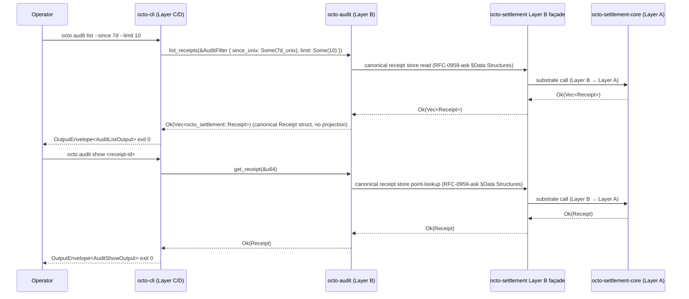

# RFC-0016: Audit Receipt API (KEEP substrate-faithful surface)

## Status

Draft v2 (2026-09-11)

> **KEEP-only rewrite per RFC-0016 R29 review plan.** This draft carries ONLY substrate-faithful additions on the `octo-audit` Layer B façade. Write-path surface (`append_audit_event` + `ReceiptId` + `ChainHash` + `ReceiptStatus` + `ReceiptSummary` + `AuditFilter.subject_did` ACL + CLI-shape error variants + `ScrubbedAuditError` / `ScrubbedString`) DEFERRED to RFC-0016-a. RFC-0016-a acceptance requires paired acceptance of future Layer A substrate amendments adding `AuditEventKind` extensions (per RFC-0012 (Extension-over-enumeration pattern); typed-discriminator namespace, NOT central-enum variant additions) + `ReceiptStatus` enum + `Receipt` field extensions (`model`, `cost_dqa`, `capability_root`, `subject_did`) on `octo-settlement-core` + RFC-0011-a (CLI-shape error envelope).

## Authors

- `@cipherocto`
- `@mmacedoeu`

## Maintainers

- `@cipherocto`
- `@mmacedoeu`

## Summary

This RFC defines the `octo-audit` Layer B façade surface for the audit receipt API at R2 acceptance. The KEEP surface is read-only and substrate-faithful to RFC-0012 (Layer A `octo-audit-core`) and RFC-0014 (Layer A `octo-settlement-core`):

- `list_receipts(filter)` — substrate-faithful list of canonical `octo_settlement::Receipt` rows
- `get_receipt(id)` — bare `u64` primary-key lookup returning canonical `Receipt`
- `audit_home()` per §6.2.3
- `AuditFilter { since_unix, until_unix, limit }` — UNCONDITIONAL filter struct (no `capability_root`, `model`, `subject_did`, or `status` fields at KEEP; the substrate `Receipt` per `crates/octo-settlement-core/src/receipt.rs` §`Receipt` has 6 fields only)
- Substrate-canonical 3-variant `AuditError` re-export at façade root (PRE-EXISTING per `crates/octo-audit/src/lib.rs`; included for completeness only, NOT a KEEP additive item)

## Dependencies

- **RFC-0012** — Audit Substrate (Layer A frozen; provides canonical `AuditError` + `AppendOnlyAuditSink`)
- **RFC-0014** — Settlement Substrate (Layer A frozen; provides canonical `Receipt` struct)
- **RFC-0016-a** (sibling amendment) — Audit Receipt Write-Path: `append_audit_event` + `ReceiptId` + `ChainHash` + `ReceiptStatus` + `ReceiptSummary` + `AuditFilter.subject_did` ACL + CLI-shape error variants + `ScrubbedAuditError`. DEFERRED to paired acceptance with future Layer A substrate amendments adding the `AuditEventKind` extensions (per RFC-0012 (Extension-over-enumeration pattern)) + `ReceiptStatus` enum + `Receipt` field extensions (per RFC-0959-ask §Data Structures) + RFC-0011-a (CLI-shape error envelope). See `rfcs/draft/process/0016-a-audit-receipt-write-path.md`.

## Design Goals

1. **Substrate-faithful** — every KEEP item matches an existing Layer A frozen type or a strict additive on Layer B façade
2. **Read-only at acceptance** — write surface deferred per [[cipherocto-design-principles]] §Stable Abstractions Principle
3. **Layer discipline** — `octo-audit` (Layer B) → `octo-settlement` (Layer B) → `octo-settlement-core` (Layer A frozen); no direct B→A edges
4. **Canonical projection** — `list_receipts` returns canonical `octo_settlement::Receipt` rows; no projection newtype at KEEP

## Motivation

Operators need to inspect the receipt store directly via CLI without trusting CLI-local state. The canonical substrate surface (RFC-0012 + RFC-0014) provides the row store; this RFC adds the read façade on `octo-audit` for substrate-faithful consumption.

The write surface (audit append) is DEFERRED to RFC-0016-a because it requires future Layer A substrate amendments:

- `AuditEventKind` `AgentTransition` extension on `octo-audit-core` (Layer A frozen) per RFC-0012 (Extension-over-enumeration pattern) (typed-discriminator namespace, NOT central-enum variant addition)
- `Receipt` field extensions (`model`, `cost_dqa`, `capability_root`, `subject_did`) on `octo-settlement-core` (Layer A frozen) per RFC-0959-ask §Data Structures
- Canonical `ReceiptStatus { Ok, Partial, Reject }` enum on `octo-settlement-core` per RFC-0959-ask §Data Structures
- CLI-shape error envelope → RFC-0011-a

Acceptance of this RFC at R2 does not authorize those features; they require paired amendment acceptance.

## Roles and Authorities

- **Operator:** queries receipt store via `octo-audit list_receipts` / `get_receipt` through the `octo-audit` Layer B façade
- **Auditor:** verifies (a) audit event chain integrity via `octo_audit::verify_chain` (RFC-0012 chain-hash primitive on `&[AuditEvent]` per `crates/octo-audit-core/src/chain.rs`) AND/OR (b) receipt chain integrity via `octo_settlement::verify_receipt_chain` (per §6.1 chain-hash canonical; canonical B→B→A path per §6.3)

## Specification

### §6.1 Public surface (R2 KEEP)

| Item                          | Type                                                                                     | Substrate anchor                                                                                |
| ----------------------------- | ---------------------------------------------------------------------------------------- | ----------------------------------------------------------------------------------------------- |
| `list_receipts`               | `fn(&AuditFilter) -> Result<Vec<octo_settlement::Receipt>, octo_audit_core::AuditError>` | RFC-0014 `Receipt` struct (Layer A frozen)                                                      |
| `get_receipt`                 | `fn(id: &u64) -> Result<octo_settlement::Receipt, octo_audit_core::AuditError>`          | RFC-0014 `Receipt::receipt_id` (bare `u64` primary key)                                         |
| `audit_home`                  | `pub(crate) fn audit_home() per §6.2.3`                                                  | RFC-0012 `octo-audit-core` substrate path resolution                                            |
| `AuditFilter`                 | `struct { since_unix: Option<u64>, until_unix: Option<u64>, limit: Option<u32> }`        | No substrate field extensions (NO `subject_did`, NO `status`, NO `capability_root`, NO `model`) |
| `AuditError` (root re-export) | `pub use octo_audit_core::AuditError` (PRE-EXISTING, no addition)                        | RFC-0012 Layer A frozen 3-variant enum                                                          |

> **Note (§6.1 chain-hash canonical):** audit event chain integrity uses `verify_chain(&[AuditEvent])` per `crates/octo-audit-core/src/chain.rs`; receipt chain integrity uses `receipt_id_for` + `verify_receipt_chain` via `octo-settlement` Layer B façade re-export of `octo-settlement-core` Layer A frozen substrate (canonical B→B→A path per §6.3; `pub fn receipt_id_for(receipt: &Receipt) -> [u8; 32]` + `pub fn verify_receipt_chain(receipts: &[Receipt]) -> Result<(), SettlementError>` at `crates/octo-settlement-core/src/chain.rs`).

### §6.2 Function contracts

#### §6.2.1 `list_receipts` (KEEP)

```rust
pub fn list_receipts(filter: &AuditFilter) -> Result<Vec<octo_settlement::Receipt>, octo_audit_core::AuditError> {
    // 1. Validate filter per §6.2.4
    // 2. Walk canonical receipt store via octo-settlement Layer B façade
    // 3. Apply server-side filter
    // 4. Sort by canonical Receipt::timestamp_unix DESC (substrate-faithful per RFC-0959-ask §Data Structures)
    // 5. Secondary sort by Receipt::receipt_id ASC (deterministic tiebreaker)
    // 6. Return Vec<Receipt> directly (NO projection newtype at KEEP)
}
```

- Returns canonical `octo_settlement::Receipt` rows (Layer B façade re-export of `octo_settlement_core::Receipt`)
- Sort: `Receipt::timestamp_unix DESC`, then `Receipt::receipt_id ASC` as deterministic tiebreaker
- On miss/error: returns `AuditError` (per §6.2.5 canonical 3-variant form) — no `ReceiptNotFound` variant at KEEP
- On filter violation: filter validated per §6.2.4
- KEEP does NOT verify per-row receipt chain integrity at the read boundary by default; per-row receipt chain verification is OPT-IN per §6.1 chain-hash canonical. Reads return canonical `Receipt` rows on miss/hit; opt-in per-row verification is one-line trivial façade hop via `octo-settlement` Layer B façade re-export, NO new substrate amendment needed (per-row invocation recommended with optional skip-on-large-resultset flag).

#### §6.2.2 `get_receipt` (KEEP)

```rust
pub fn get_receipt(id: &u64) -> Result<octo_settlement::Receipt, octo_audit_core::AuditError> {
    // 1. Point lookup in canonical receipt store via octo-settlement Layer B façade
    // 2. On hit: return canonical Receipt
    // 3. On miss: AuditError per §6.2.5 canonical 3-variant form
}
```

- Bare `u64` primary-key lookup (NO `ReceiptId` newtype at KEEP; `Receipt::receipt_id: u64` per `crates/octo-settlement-core/src/receipt.rs` §`Receipt`)
- Returns canonical `octo_settlement::Receipt` struct
- No per-row chain integrity check at v2 KEEP (see §6.6)

#### §6.2.3 `audit_home` (KEEP)

```rust
#[cfg(feature = "octo-audit-internal")]
pub(crate) fn audit_home() -> Result<PathBuf, octo_audit_core::AuditError> {
    // 1. Resolve $OCTO_HOME or default ~/.config/octo
    // 2. Append /audit/receipts
    // 3. Return canonical path
}
```

- `pub(crate)` + `#[cfg(feature = "octo-audit-internal")]` — feature flag PROPOSED as ADDITIVE per `Cargo.toml` edit in §Key Files to Modify (does NOT exist in non-internal builds)
- CLI does not call directly per info-leak prevention (per §Adversary Analysis row "canonical-path info leak")

#### §6.2.4 `AuditFilter` (KEEP)

```rust
pub struct AuditFilter {
    pub since_unix: Option<u64>,
    pub until_unix: Option<u64>,
    pub limit: Option<u32>,
}
```

- No `subject_did`/`status`/`capability_root`/`model` fields at KEEP (DEFERRED to RFC-0016-a per §6.8).
- Validation: `limit == 0` / `since_unix > until_unix` / `limit > 10000` rejected at substrate boundary (per §6.2.5 canonical 3-variant form)

#### §6.2.5 `AuditError` (root re-export) (KEEP)

```rust
// crates/octo-audit/src/lib.rs (root)
pub use octo_audit_core::AuditError;
```

- Substrate-canonical 3-variant form: `SequenceGap { event_id: u64, prev: u64 } / AlreadyExists(u64) / SinkSpecific(String)`
- NO façade shadow enum
- NO CLI-shape variants (`ReceiptNotFound` / `InvalidFilter` / `PermissionDenied` / `AuditAppendFailed` / `Internal`) — DEFERRED to RFC-0011-a per canonical `[ADD]` error envelope pattern
- `SinkSpecific(String)` payload is facade-side scrubbed (defense-in-depth) before construction per `octo-audit` Layer B scrubber at `crates/octo-audit/src/scrub.rs` per RFC-0012-v3 §S5.1 canonical scrubber table

### §6.3 Cargo.toml Layer discipline

```toml
[dependencies]
octo-settlement = { path = "../octo-settlement" }

[features]
# Default OFF — internal-only surfaces per §6.2.3
octo-audit-internal = []
```

### §6.4 Substrate-canonical error envelope

Exit code derived at RFC-0011-a §Error via `#[error(transparent)] From<AuditError>`; no KEEP variant maps to exit 64 directly (all KEEP variants fall through per §6.2.5 canonical 3-variant form).

### §6.5 CLI integration contract

| Mission / RFC              | Substrate call                                | Sub-step                         | Status |
| -------------------------- | --------------------------------------------- | -------------------------------- | ------ |
| `0011-a-audit-commands.md` | `list_receipts(&filter)` + `get_receipt(&id)` | Sub-step 2 (existing RFC-0011-a) | KEEP   |

> Writes DEFERRED to RFC-0016-a per §6.8.

### §6.6 Determinism requirements

- **Read determinism** — `list_receipts` returns the same results for the same filter across runs (sort key is canonical `Receipt::timestamp_unix` per RFC-0959-ask §Data Structures; secondary sort `Receipt::receipt_id` ASC as deterministic tiebreaker)
- **Chain integrity** — per §6.1 chain-hash canonical. `list_receipts` + `get_receipt` are substrate-faithful to RFC-0012 + RFC-0014 chain-hash primitives; per-row receipt verification is opt-in at the read boundary (one-line trivial hop via façade re-export, NO new substrate amendment needed).

### §6.7 RFC-0008 Execution Class Mapping

All RFC-0016 R2 KEEP items are Class A (read) per RFC-0008 §Execution Class Mapping (mirrors RFC-0015 §6.6). No state mutation; observable in any environment.

CLI surfaces `Class A` operations unconditionally (no `--allow-write` gate).

### §6.8 Forward Pointer to RFC-0016-a

All rows below require RFC-0016-a + paired future Layer A substrate amendments per §Dependencies. The following DEFERRED surface ships with `0016-a-audit-receipt-write-path.md`. None of these features is provided by any currently Accepted substrate amendment; the §6.8 column cites the canonical substrate RFC (RFC-0012 (Extension-over-enumeration pattern) or RFC-0959-ask §Data Structures) where the future amendment will land:

| Deferred feature                                       | Canonical substrate anchor                                                                                                                                                                                                                                                                     |
| ------------------------------------------------------ | ---------------------------------------------------------------------------------------------------------------------------------------------------------------------------------------------------------------------------------------------------------------------------------------------- |
| `append_audit_event`                                   | RFC-0012 (Extension-over-enumeration pattern) (`AuditEventKind` typed-discriminator namespace)                                                                                                                                                                                                 |
| `ReceiptId(pub u64)` newtype                           | RFC-0959-ask §Data Structures (`Receipt` field extensions)                                                                                                                                                                                                                                     |
| `ChainHash(pub [u8; 32])` newtype                      | RFC-0012 (parent §Module Layout) `event` (AuditEvent chain_hash field — already present in substrate)                                                                                                                                                                                          |
| `ReceiptStatus { Ok, Partial, Reject }` enum           | RFC-0959-ask §Data Structures (future `ReceiptStatus` enum addition)                                                                                                                                                                                                                           |
| `ReceiptSummary` projection struct                     | RFC-0959-ask §Data Structures (`Receipt` field extensions)                                                                                                                                                                                                                                     |
| `AuditFilter.subject_did: Option<Did>` ACL             | RFC-0959-ask §Data Structures (future `Receipt.subject_did` field)                                                                                                                                                                                                                             |
| `AuditFilter.status: Vec<ReceiptStatus>` multi-valued  | RFC-0959-ask §Data Structures (future canonical `ReceiptStatus` enum)                                                                                                                                                                                                                          |
| `AuditEventKind` redaction extension                   | RFC-0012 (Extension-over-enumeration pattern) (`AuditEventKind` typed-discriminator namespace; NO central-enum 4th variant per substrate `#[non_exhaustive]`)                                                                                                                                  |
| CLI-shape error variants                               | RFC-0011-a §Error Envelope (canonical `[ADD]` error envelope)                                                                                                                                                                                                                                  |
| Canonical-bytes-on-write invariant                     | RFC-0012 (parent §Module Layout) `event` (audit event canonical bytes per `compute_chain_hash`; receipt canonical bytes per `receipt_id_for` via `octo-settlement` Layer B façade re-export of `octo-settlement-core` Layer A frozen substrate per `crates/octo-settlement-core/src/chain.rs`) |
| Single-writer lock + read-stalls-while-write invariant | RFC-0012 (parent §Module Layout) `sink` (`AppendOnlyAuditSink` type-level `&mut self` enforcement; concrete runtime lock is DOMAIN-adapter concern, e.g. `StoolapAuditSink` per `crates/octo-audit/src/storage/`)                                                                              |

See `rfcs/draft/process/0016-a-audit-receipt-write-path.md` for full DEFERRED surface specification.

## Performance Targets

- `list_receipts` (1000-receipt store, limit=100) — p95 < 100ms per RFC-0011-a §Performance Targets
- `list_receipts` (10000-receipt store, limit=10000) — p95 < 500ms
- `get_receipt` point lookup — p95 < 5ms

## Implicit Assumptions Audit

1. **Substrate-faithful principle** — `octo-audit-core` (Layer A frozen) is canonical; this RFC adds façade-layer surface to `octo-audit` (Layer B). At R2 the surface is read-only.
2. **Operator config dir writable** — `audit_home()` per §6.2.3; filesystem errors propagate per §6.2.5
3. **Clock monotonicity for `timestamp_unix`** — RFC-0014 `Receipt::timestamp_unix` is monotonic per RFC-0959-ask §Data Structures; surface reads assume canonical monotonic ordering
4. **Multi-tenant deployment restriction** — RFC-0016 reads MUST NOT be enabled in deployments sharing the receipt store across tenants until `AuditFilter.subject_did` ACL lands (per §6.8 forward pointer). Per-process trust boundary assumed at R2 KEEP; co-tenant on a multi-process host could read another tenant's receipts by omitting `subject_did`. Multi-tenant deployments MUST deploy per-tenant receipt stores OR wait for RFC-0016-a acceptance.

## Security Considerations

1. **Append-only chain integrity** — `AppendOnlyAuditSink` is type-level append-only per RFC-0012; tampering breaks BLAKE3 chain. R2 surface is read-only.
2. **`audit_home()` operator-config leak surface** — per §6.2.3 (info-leak prevention)
3. **`AuditError` R2 KEEP carry** — per §6.2.5 canonical 3-variant form (§6.2.2 miss form is a §6.2.5 instance)
4. **Read is no-mutation** — G1 invariant per RFC-0011-a; `list_receipts` + `get_receipt` are pure reads
5. **Read access control (DEFERRED `subject_did` ACL)** — per §Implicit Assumptions Audit row 4 (multi-tenant restriction)

## Adversarial Review

### Threat: receipt-store tampering

**Adversary:** Operator modifies the persisted receipt store directly (bypasses `get_receipt`).

**Mitigation:** Receipts are append-only; per-row receipt chain-integrity verification is OPT-IN at the read boundary per §6.1 chain-hash canonical. Default KEEP read path does NOT invoke per-row verification (substrate-faithful no-op; opt-in via façade). NO future substrate amendment required.

### Threat: filter-injection via query string

**Adversary:** Operator constructs a filter with malicious payloads in `model` field.

**Mitigation:** CLI parser rejects malformed values per RFC-0011-a §Adversarial Review (`--model` non-empty, no wildcard). Substrate does not interpret the strings as code.

### Threat: `get_receipt` timing oracle on existence

**Adversary:** Compromised CLI measures point-lookup latency to infer whether a specific receipt ID exists.

**Mitigation:** NONE — constant-time lookup is NOT substrate-enforced; substrate-faithful lookup uses canonical store indexing (BTreeMap / HashMap); lookup time varies based on tree depth, hash bucket distribution, and store state. Documented as accepted residual risk.

## Adversary Analysis (5-Question Test)

| Threat                                           | Q1: Who?                                          | Q2: What?                                                       | Q3: Why?                                   | Q4: How mitigated?                                                                                                                                                                                                                                      | Q5: Residual risk?                                                                                                                                                  |
| ------------------------------------------------ | ------------------------------------------------- | --------------------------------------------------------------- | ------------------------------------------ | ------------------------------------------------------------------------------------------------------------------------------------------------------------------------------------------------------------------------------------------------------- | ------------------------------------------------------------------------------------------------------------------------------------------------------------------- |
| Receipt-store tampering                          | Operator                                          | Modify persisted store                                          | Hide receipt rows                          | Append-only sink — substrate-faithful chain verification via `octo-settlement` Layer B façade re-export of `octo-settlement-core` Layer A frozen substrate (opt-in at the read boundary per §6.1 chain-hash canonical; default KEEP read path is no-op) | Disk corruption mitigated                                                                                                                                           |
| Filter-injection                                 | Compromised CLI                                   | Malicious query string                                          | Trigger downstream eval                    | CLI parser rejects malformed values per RFC-0011-a                                                                                                                                                                                                      | NONE (substrate trust)                                                                                                                                              |
| Read-during-write race                           | Concurrent reads                                  | Read inconsistency                                              | Data inconsistency                         | No write path at R2 KEEP (DEFERRED to RFC-0016-a per §6.8); reads today operate against canonical store with no writer present                                                                                                                          | R2 surface is read-only; risk lands with RFC-0016-a acceptance                                                                                                      |
| Read access control (DEFERRED `subject_did` ACL) | Compromised CLI / co-tenant on multi-process host | Read another tenant's receipts by omitting `subject_did` filter | Reconnaissance / receipt-store enumeration | Per §Implicit Assumptions Audit row 4 (multi-tenant restriction)                                                                                                                                                                                        | Per-process trust boundary assumed at R2 KEEP; multi-tenant deployments sharing `$OCTO_HOME` across tenants MUST NOT enable RFC-0016 reads on shared receipt stores |
| `get_receipt` timing oracle on existence         | Compromised CLI                                   | Measure point-lookup latency                                    | Infer whether a specific receipt ID exists | NONE — constant-time lookup is NOT substrate-enforced                                                                                                                                                                                                   | Substrate-internal trust; cross-process exploitation blocked by per-process trust boundary per §Implicit Assumptions Audit row 4                                    |
| canonical-path info leak                         | Compromised CLI                                   | Surface canonical receipt-store path                            | Leak `$OCTO_HOME` or filesystem layout     | Canonical-path info leak per §6.2.3                                                                                                                                                                                                                     | Substrate-internal trust; CLI bypass would expose canonical path                                                                                                    |

## Economic Analysis

DEFER — audit receipt substrate has no direct token cost; cite RFC-0900+ (Role Economics) for any cost implications.

## Compatibility

1. **No breaking changes.** 4 KEEP items on `octo-audit` (Layer B façade) per RFC-0012; no existing public API modified.
2. **No new exit codes break parent semantics.** Substrate-canonical 3-variant `AuditError` per §6.2.5; reserved slots per §6.8.
3. **No new clap variants break parent dispatch.** This RFC is substrate-only; CLI missions consume the new surface via existing CLI variant sets.
4. **Substrate-side scrubber defense-in-depth** — per §6.2.5 (SinkSpecific payload scrubbed via `octo-audit/src/scrub.rs`); ScrubbedAuditError newtype surface DEFERRED to RFC-0016-a per §6.8.

## Test Vectors

Substrate-level test vectors (`crates/octo-audit/src/lib.rs` test module). All write-path vectors are DEFERRED to RFC-0016-a per §6.8.

| #                        | Substrate call                                                                                                                         | Input                                                 | Expected Output                                                                                                           | Notes                                                                                                                                                                                                           |
| ------------------------ | -------------------------------------------------------------------------------------------------------------------------------------- | ----------------------------------------------------- | ------------------------------------------------------------------------------------------------------------------------- | --------------------------------------------------------------------------------------------------------------------------------------------------------------------------------------------------------------- |
| TV-AUD-1                 | `list_receipts(&AuditFilter::default())`                                                                                               | Empty store                                           | `Ok(vec![])`                                                                                                              | Empty store                                                                                                                                                                                                     |
| TV-AUD-2                 | `list_receipts(&AuditFilter { since_unix: Some(7d_unix), limit: Some(10) })`                                                           | 1000-receipt store                                    | `Ok(vec_of_10_canonical_Receipts)`                                                                                        | `since_unix` filter per §6.2.4                                                                                                                                                                                  |
| TV-AUD-6                 | `get_receipt(&known_id)`                                                                                                               | Known `Receipt::receipt_id: u64`                      | `Ok(<full canonical Receipt>)`                                                                                            | Returns canonical `octo_settlement::Receipt` per §6.2.2 (Layer B façade re-export)                                                                                                                              |
| TV-AUD-9                 | `audit_home()`                                                                                                                         | `$OCTO_HOME` set to `/tmp/octo-test`                  | `Ok(PathBuf::from("/tmp/octo-test/audit/receipts"))`                                                                      | Discovery helper; requires `cargo test --features octo-audit-internal`                                                                                                                                          |
| TV-AUD-10                | `audit_home()`                                                                                                                         | `$OCTO_HOME` unset, `$HOME=/home/x`                   | `Ok(PathBuf::from("/home/x/.config/octo/audit/receipts"))`                                                                | Default resolution                                                                                                                                                                                              |
| TV-AUD-11g               | `audit_home()` against macOS-style `$OCTO_HOME=/Users/alice/Library/Application Support/octo`; resolved path on substrate error string | filesystem path containing macOS-specific layout      | `Err(octo_audit_core::AuditError::SinkSpecific("<OCTO_HOME>/audit/receipts".into()))` — canonical placeholder substituted | Path-string scrub coverage per §Compatibility #4 (filesystem absolute-path pattern per RFC-0012-v3 §S5.1 canonical scrubber table); verifies operator-specific filesystem layouts do NOT leak via error payload |
| TV-AUD-audit-home-leak-1 | `audit_home()` Ok path on a non-internal build (no `octo-audit-internal` feature flag)                                                 | non-internal build (default `cargo build` invocation) | `compile error / function-not-callable` (function gated behind `#[cfg(feature = "octo-audit-internal")]`)                 | Path-leak vector; verifies the Ok path does NOT leak canonical paths in non-internal builds                                                                                                                     |

DEFERRED test vectors (moved to RFC-0016-a §Test Vectors): TV-AUD-3, TV-AUD-3b, TV-AUD-3c, TV-AUD-4, TV-AUD-4b, TV-AUD-4c, TV-AUD-4d, TV-AUD-4e, TV-AUD-5, TV-AUD-7, TV-AUD-8, TV-AUD-11, TV-AUD-11a-k, TV-AUD-list-chain-1, TV-AUD-list-chain-2, TV-AUD-get-receipt-chain-1, TV-AUD-get-receipt-chain-2, TV-AUD-redact-token-1, TV-AUD-redact-token-2, TV-AUD-permission-check-1, TV-AUD-permission-check-2.

CLI-level test vectors live in RFC-0011-a §Test Vectors (UNCHANGED).

## Alternatives Considered

- **CLI-side receipt storage** — CLI stores the receipt summaries locally; rejected: violates substrate-faithful principle; reads should always go through the canonical substrate store
- **Custom `ReceiptId` typedef in CLI** — separate newtype from `SettlementStore::ReceiptId`; rejected: parallel abstraction per [[cipherocto-design-principles]]; bare `u64` is canonical at R2 KEEP (per `Receipt::receipt_id` field)
- **GraphQL/REST API surface** — separate API exposes audit reads; rejected: substrate-faithful principle + RFC-0011 CLI is the canonical operator surface
- **Streaming `list_receipts` (cursor-streaming)** — server streams rows back; rejected: complexity for no benefit at the 10000-row ceiling; cursor reserved for RFC-0016-a future work

## Implementation Phases

- **Phase 1 (this RFC, R2 KEEP)** — substrate additions on `octo-audit` Layer B façade; 4 KEEP items per §6.1; 12+ DEFERRED items per §6.8 forward pointer
- **Phase 2 (RFC-0011-a acceptance + RFC-0016 acceptance)** — gates RFC-0011-a §Substrate-truth disclaimer resolution; CLI substrate amendments become implementable for the read surface
- **Phase 3 (RFC-0016-a acceptance — paired with future Layer A substrate amendments + RFC-0011-a)** — restores DEFERRED surface per §6.8 (the future substrate amendments per §6.8 add `AuditEventKind` extensions + `Receipt` field extensions + canonical `ReceiptStatus` enum; not yet implemented)

## Key Files to Modify

- `crates/octo-audit/src/lib.rs` — append the 4 KEEP items per §6.1; existing re-exports preserved; ~150 LoC incl. tests
- `crates/octo-audit/Cargo.toml` — add `octo-settlement = { path = "../octo-settlement" }` (Layer B settlement façade per RFC-0014; Layer B → Layer B hop, no direct B→A edge per CLAUDE.md §Architectural Principles) + ADDITIVE `[features] octo-audit-internal = []` feature-flag (default builds DO NOT include the feature; gating per §6.2.3)

**Layer placement table:**

| Crate                  | Layer                     | Substrate anchor                                                                                             | Role at RFC-0016 R2 KEEP                                                           |
| ---------------------- | ------------------------- | ------------------------------------------------------------------------------------------------------------ | ---------------------------------------------------------------------------------- |
| `octo-audit-core`      | Layer A frozen (RFC-0012) | `AuditError` canonical 3-variant form per §6.2.5                                                             | Canonical substrate error envelope; root re-export per §6.2.5                      |
| `octo-audit`           | Layer B façade (RFC-0012) | `crates/octo-audit/src/lib.rs` §`AuditError re-export`                                                       | Façade; re-exports `octo-audit-core::AuditError` per §6.2.5                        |
| `octo-settlement-core` | Layer A frozen (RFC-0014) | `Receipt` struct per `crates/octo-settlement-core/src/receipt.rs` §`Receipt`                                 | Canonical `Receipt` primary-key substrate for `get_receipt` reads                  |
| `octo-settlement`      | Layer B façade (RFC-0014) | `crates/octo-settlement/src/lib.rs` §`Receipt` re-export                                                     | Re-exports `octo-settlement-core` Layer A frozen                                   |
| `octo-storage-core`    | Layer A frozen (RFC-0206) | Database newtype + TypedStatement + AdapterAllowlist per `crates/octo-storage-core/src/lib.rs` §`Re-exports` | Layer A storage substrate for octo-audit DOMAIN adapter (pre-existing direct edge) |
| `octo-audit` (DOMAIN)  | Layer B DOMAIN adapter    | `StoolapAuditSink` DOMAIN adapter at `crates/octo-audit/src/storage/stoolap.rs`                              | DOMAIN storage adapter surface (consumes octo-storage-core substrate)              |

Layer direction: `octo-audit` (Layer B) → `octo-settlement` (Layer B) → `octo-settlement-core` (Layer A frozen) for ALL receipt-canonical-bytes paths. Pre-existing direct B→A edges from `octo-audit` (Layer B): → `octo-audit-core` (Layer A frozen) for the canonical façade-to-substrate hop carrying `AuditError` root re-export + function error types per §6.1 + §6.2.x signatures; → `octo-storage-core` (Layer A frozen) — storage substrate (Database newtype + TypedStatement + AdapterAllowlist per RFC-0206) consumed by the DOMAIN `StoolapAuditSink` adapter at `crates/octo-audit/src/storage/stoolap.rs`. The §6.3 Cargo.toml proposal adds `octo-settlement` (Layer B) B→B hop on the receipt path; `octo-settlement` (Layer B) → `octo-settlement-core` (Layer A frozen) hop then carries the canonical `Receipt` re-export per §6.1. All B→A edges are canonical façade-to-substrate hops per CLAUDE.md §Architectural Principles (Layer B → Layer A is the canonical substrate-dep pattern for additive-only surface; no NEW non-canonical B→A edges are introduced by RFC-0016 v2 KEEP). No reverse deps.

No changes to Layer A crates (`octo-audit-core`, `octo-settlement-core`); no CLI binary changes; no envelope / redactor / exit-code table changes.

## Future Work

- **`AuditFilter.subject_did: Option<Did>` ACL** — RFC-0016-a per §6.8 (requires future RFC-0014 substrate amendment adding `Receipt.subject_did` + RFC-0016-a façade ACL)
- **`AuditFilter.status: Vec<ReceiptStatus>` multi-valued** — RFC-0016-a per §6.8 (requires future RFC-0014 substrate amendment adding canonical `ReceiptStatus` enum + RFC-0016-a façade field type change)
- **`AppendOnlyAuditSink::append` write path** — RFC-0016-a per §6.8 (requires future substrate amendment adding `AuditEventKind` extensions per RFC-0012 (Extension-over-enumeration pattern) + canonical-bytes-on-write invariant)
- **`ReceiptStatus::Unknown` arm** — Raw escape hatch (DEFERRED to a future RFC-0014 substrate amendment; not provided by any current Accepted amendment)
- **Streaming `list_receipts`** — cursor-streaming for >10000-row stores
- **Redaction via audit append** — redaction extension on `AuditEventKind` per RFC-0012 (Extension-over-enumeration pattern) (typed-discriminator namespace; NOT central-enum 4th variant); row appended AFTER the target row (Layer A future amendment)

## Rationale

- **Substrate-faithful** — Layer A frozen untouched; this RFC adds Layer B façade surface per RFC-0012 + RFC-0014 acceptance pattern
- **Additive only** — CLAUDE.md §Rust crate-level stability: Layer B additive changes do not break consumers; the 4 KEEP items per §6.1 are additive
- **No parallel abstractions** — `list_receipts` returns canonical `Receipt` directly (no projection newtype at KEEP); bare `u64` for `Receipt::receipt_id` lookup (no newtype)
- **CLI parity** — substrate-faithful read surface; CLI substrate amendments become implementable for the read surface at RFC-0011-a acceptance
- **Split strategy** — write surface paired-with-substrate-amendment moved to RFC-0016-a per R29 review plan; halves per-RFC complexity, breaks divergence loop

## Version History

- v1.0 (2026-09-11) Initial draft. Read substrate-faithful surface (RFC-0002 + RFC-0011-c).
- v2 (2026-09-11) KEEP-only rewrite. Dropped write-path surface (`append_audit_event` + `ReceiptId`/`ChainHash`/`ReceiptStatus`/`ReceiptSummary`/`subject_did` ACL + CLI-shape variants + `ScrubbedAuditError`/`ScrubbedString` + DEFERRED TVs) → forward pointer to RFC-0016-a. Slimmed to 4 KEEP items per §6.1 (plus the PRE-EXISTING `AuditError` re-export per §6.2.5, NOT counted in KEEP scope per §6.1 table annotation).

## Related RFCs

- RFC-0011-a — `octo audit` Subcommands (CLI consumer of `list_receipts` + `get_receipt`; defines `[ADD]` spec at §7.4)
- RFC-0011-c — `octo agent` Subcommands (read-only CLI consumer at R2)
- RFC-0012 — Audit Substrate (Layer A frozen core; provides `AuditEvent` + `AuditEventKind` + `AppendOnlyAuditSink`); **future substrate amendment required for §6.8 DEFERRED SURFACE** (`AuditEventKind` extensions for `append_audit_event` write path; not yet implemented)
- RFC-0014 — Settlement Substrate (Layer A frozen core; provides canonical `Receipt` struct per §Data Structures); **future substrate amendment required for §6.8 DEFERRED SURFACE** (`ReceiptStatus` enum + `Receipt` field extensions + `AuditFilter.subject_did`; not yet implemented)
- RFC-0016-a — Audit Receipt Write-Path Amendment (sibling; DEFERRED surface paired with future Layer A substrate amendments + RFC-0011-a per §6.8)
- RFC-0015 — Agent Operations Substrate (read-only CLI consumer at RFC-0015 R2 acceptance; `transition_agent` write surface DEFERRED per RFC-0015 §6.8 forward pointer)
- RFC-0011 — `octo` CLI Substrate (parent RFC; provides envelope + error + exit-code substrate)
- RFC-0010 — Canonical DID Codec (DID parsing)
- RFC-0008 — Deterministic AI Execution Boundary (execution class mapping)
- [[cipherocto-design-principles]] — Layer model + substrate-faithful principle; **§6.8 DEFERRED SURFACE follows the extension-over-enumeration pattern (no central enum edit at Layer A)**

## Related Use Cases

- `docs/use-cases/audit-transparency.md` — receipt read + verify use case
- `docs/use-cases/hybrid-ai-blockchain-runtime.md` — runtime attach / run context for transaction logs

## Appendices

### Appendix A. Substrate function signatures

See §6.2.1-§6.2.5 (full surface inline).

### Appendix B. Mermaid diagram — CLI → audit flows (R2 read-only)


