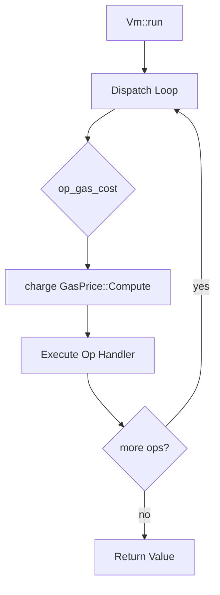

# RFC-0201: Expression VM Gas Metering Integration

## Status

Draft

## Authors

- Author: @mmacedoeu

## Maintainers

- Maintainer: @mmacedoeu

## Summary

Integrate the existing `GasMeter` infrastructure into the stoolap expression VM dispatch loop so that expensive deterministic floating-point operations (DFP arithmetic, DFP square root, and their DECIMAL equivalents) consume gas proportionally to their computational cost. This closes the gap where `Op::DfpSqrt` executes without metering despite gas infrastructure being present in the execution layer.

## Dependencies

**Requires:**

- RFC-0116: Unified Deterministic Execution Model (deterministic execution context)

**Optional:**

- RFC-0202: Stoolap BIGINT/DECIMAL Conversions (BIGINT type needed for BigintShl/BigintShr)

## Design Goals

| Goal | Target | Metric |
|------|--------|--------|
| G1 | Zero overhead when metering disabled | No gas meter = same performance as before |
| G2 | Centralized metering | Single charge point in dispatch loop |
| G3 | Opt-in metering | VM works without gas configuration |
| G4 | Correct error propagation | OutOfGas returns `Error::OutOfGas` |

## Motivation

The stoolap expression VM (`src/executor/expression/vm.rs`) executes SQL expressions as a bytecode dispatch loop. Gas metering exists at the execution context level (`ExecutionContext::insert`, `ExecutionContext::update`, etc.) but **has no integration with the VM dispatch loop**. Every `Op` handler runs unconditionally, including expensive operations like DFP square root.

Specifically:
- `Op::DfpSqrt` performs arbitrary-precision square root — this is expensive relative to add/sub/mul
- `Op::DecimalSqrt` similarly performs decimal square root
- `Op::DfpAdd/Sub/Mul/Div` and `Op::DecimalAdd/Sub/Mul/Div` are cheaper but still non-trivial
- The VM has no `gas_meter` field — it's not plumbed into the dispatch

The gas infrastructure in stoolap's `execution/gas.rs` defines `GasPrice::Compute` at 1 unit, but the expression VM never calls `charge(GasPrice::Compute)`.

## Specification

### System Architecture



### Data Structures

```rust
pub struct Vm {
    // ... existing fields ...
    gas_meter: Option<GasMeter>,
}
```

`Vm::new` and `Vm::with_state` accept optional gas parameters. When `gas_meter` is `None`, no metering occurs (backward compatible for non-blockchain use).

### Algorithms

**Gas cost per VM opcode:**

```rust
/// Gas cost per VM opcode
fn op_gas_cost(op: &Op) -> u64 {
    match op {
        // Zero-cost ops (stack only)
        Op::LoadConst | Op::LoadColumn | Op::LoadNull | Op::Return => 0,
        // Light ops (1 gas)
        Op::Add | Op::Sub | Op::Mul | Op::Div | Op::Mod => 1,
        Op::Neg | Op::BitNot => 1,
        Op::Eq | Op::Ne | Op::Lt | Op::Le | Op::Gt | Op::Ge => 1,
        // Medium ops (10 gas)
        Op::DfpAdd | Op::DfpSub | Op::DfpMul | Op::DfpDiv | Op::DfpNeg => 10,
        Op::DecimalAdd | Op::DecimalSub | Op::DecimalMul | Op::DecimalDiv => 10,
        Op::BigintAdd | Op::BigintSub | Op::BigintMul | Op::BigintDiv | Op::BigintMod => 10,
        Op::BigintShl | Op::BigintShr => 10,
        // Expensive ops (50 gas)
        Op::DfpSqrt | Op::DecimalSqrt => 50,
        // ...
    }
}
```

**Charge gas at dispatch entry:**

```rust
if let Some(ref mut meter) = self.gas_meter {
    let cost = op_gas_cost(op);
    if cost > 0 {
        meter.charge(GasPrice::Compute).map_err(|_| Error::OutOfGas)?;
    }
}
```

This is a single insertion point at the top of the match on `Op` — the dispatch already handles every op through one match, so gas charging is centralized rather than added to each handler.

### Error Handling

If `charge` returns `Error::OutOfGas`, the VM returns `Err(Error::OutOfGas { ... })` from the dispatch function, propagating to the caller.

| Error | Condition | Response |
|-------|-----------|----------|
| OutOfGas | `meter.charge()` fails | `Err(Error::OutOfGas)` from dispatch |

## Open Questions

None at this time.

## Performance Targets

| Metric | Target | Notes |
|--------|--------|-------|
| Latency (no meter) | Same as before | Zero overhead when metering disabled |
| Latency (with meter) | <5% overhead | Per-op charge is constant time |

## Security Considerations

MUST document:
- **Gas exhaustion**: Unbounded loop with no gas could DoS blockchain nodes. This RFC mitigates by adding metering to VM dispatch.
- **Determinism violations**: Gas metering must not introduce non-determinism. The `op_gas_cost` function is pure and returns the same cost for the same `Op` variant.

## Adversarial Review

| Threat | Impact | Mitigation |
|--------|--------|------------|
| Gas exhaustion attack | High | VM dispatches charge gas per opcode; no free infinite loops |
| Non-deterministic gas | Critical | `op_gas_cost` is pure function, same Op = same cost |

## Compatibility

- **Backward compatible**: `Vm::new()` continues to work without gas parameters — metering is opt-in
- **Non-blockchain deployments**: Testing, casual use unaffected — gas metering only activates when `gas_meter` is set

## Test Vectors

1. `Vm` with gas limit exhausts gas on expensive op (`DfpSqrt`)
2. `Vm` without gas meter runs without charging
3. `Vm` with insufficient gas returns `Error::OutOfGas`
4. `Vm` with sufficient gas completes expression evaluation

## Alternatives Considered

| Approach | Pros | Cons |
|---------|------|------|
| Per-handler charging | Fine-grained control | Risk of forgetting to charge in handlers |
| Opt-in at constructor | Backward compatible | Requires VM reconstruction to enable |
| Global meter | Simple | Not composable, affects all VMs |

## Implementation Phases

### Phase 1: Core Infrastructure

- [ ] Add `gas_meter: Option<GasMeter>` to `Vm` struct in `vm.rs`
- [ ] Add `Vm::with_gas(limit: u64)` constructor variant
- [ ] Add `op_gas_cost(op: &Op) -> u64` function
- [ ] Insert gas charging call at the top of the dispatch match

### Phase 2: Cost Calibration

- [ ] Assign cost=0 to stack-only ops (LoadConst, LoadColumn, etc.)
- [ ] Assign cost=1 to cheap ops (Add, Sub, Mul, Div, Mod, comparisons)
- [ ] Assign cost=10 to DFP/DECIMAL/BIGINT arithmetic ops
- [ ] Assign cost=50 to DfpSqrt/DecimalSqrt

### Phase 3: Verification

- [ ] Add test that `Vm` with gas limit exhausts gas on expensive op
- [ ] Add test that `Vm` without gas meter runs without charging

## Key Files to Modify

| File | Change |
|------|--------|
| `src/executor/expression/vm.rs` | Add gas_meter field, op_gas_cost function, dispatch charging |
| `src/executor/expression/ops.rs` | Document gas costs per opcode |

## Future Work

- F1: Benchmark DfpSqrt vs DfpAdd to calibrate relative costs
- F2: Consider stack-depth-based gas charges for binary ops
- F3: Integrate with execution context gas tracking end-to-end

## Rationale

### Why charge at dispatch entry rather than per-handler?

Centralizing gas charging at one point avoids the risk of forgetting to charge in individual handlers. The match-based dispatch means there's exactly one place where `Op` is pattern-matched, making this clean and maintainable.

### Why not use existing `GasPrice::Compute` directly?

`GasPrice` defines operation-level costs (ReadRow, WriteRow, IndexScan, FullScan, Compute). `op_gas_cost` is more granular — specific to VM opcodes — and returns a raw `u64` cost. The VM charges `GasPrice::Compute` for all expression-level gas, with the per-op cost determined by `op_gas_cost`.

### Why make gas metering opt-in?

Not all consumers of the expression VM are blockchain nodes. SQL engines and testing frameworks should not need to configure gas to evaluate expressions. The `Option<GasMeter>` design makes metering explicit rather than mandatory.

## Version History

| Version | Date | Changes |
|---------|------|---------|
| 1.0 | 2026-04-11 | Initial draft |

## Related RFCs

- [RFC-0116: Unified Deterministic Execution Model](../numeric/0116-unified-deterministic-execution-model.md) — deterministic execution context
- [RFC-0202: Stoolap BIGINT/DECIMAL Conversions](./0202-stoolap-bigint-decimal-conversions.md) — BIGINT/DECIMAL type support

## Related Use Cases

- [Mission 0202-d: Expression VM Bug Fixes + Gas Integration](../../missions/claimed/0202-d-bigint-decimal-vm.md)