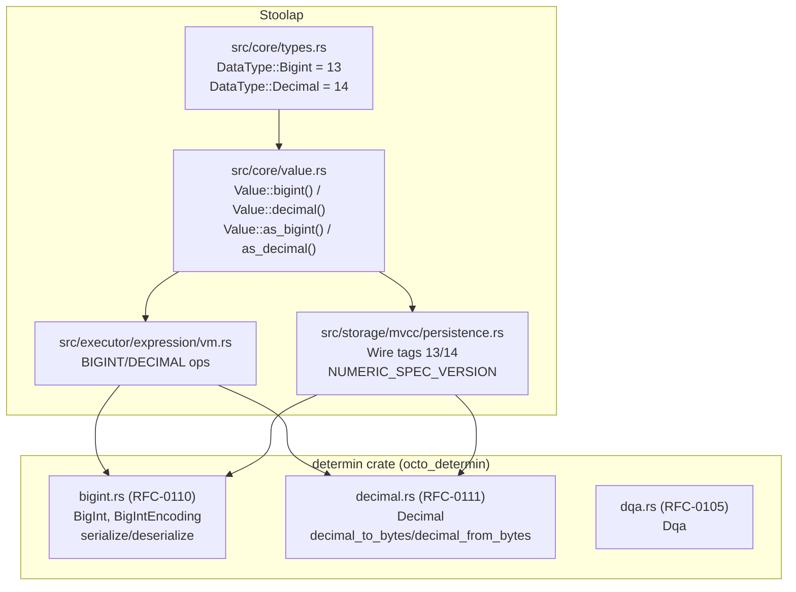

# RFC-0202-A (Storage): Stoolap BIGINT and DECIMAL Core Types

## Status

**Version:** 1.5 (2026-03-30)
**Status:** Draft

## Authors

- Author: @agent

## Maintainers

- Maintainer: @ciphercito

## Summary

This RFC specifies the integration of BIGINT (RFC-0110) and DECIMAL (RFC-0111) **core types** into Stoolap — DataType variants, Value constructors/extractors, SQL keyword parsing, and Expression VM dispatch. Conversion functions between numeric types are covered by **RFC-0202-B** (Conversions), which is a separate RFC for later implementation.

This separation allows the core type infrastructure to proceed independently while the conversion RFCs (0131-0135) complete their adversarial review cycle.

## Dependencies

**Requires:**

- RFC-0104 (Numeric/Math): Deterministic Floating-Point (DFP) — Implemented in Stoolap
- RFC-0105 (Numeric/Math): Deterministic Quant (DQA) — Implemented in Stoolap
- RFC-0110 (Numeric/Math): Deterministic BIGINT — **Accepted** (reference spec, algorithms in `determin` crate)
- RFC-0111 (Numeric/Math): Deterministic DECIMAL — **Accepted** (reference spec, algorithms in `determin` crate)

**Does NOT depend on:**
- RFC-0131, RFC-0132, RFC-0133, RFC-0134, RFC-0135 (conversions — separate RFC-0202-B)

**Optional:**

- RFC-0124 (Numeric/Math): Deterministic Numeric Lowering — DFP→DQA→BIGINT lowering (future work)

## Design Goals

| Goal | Target | Metric |
|------|--------|--------|
| G1 | BIGINT type in Stoolap | SQL keyword `BIGINT` parsed to `DataType::Bigint` |
| G2 | DECIMAL type in Stoolap | SQL keyword `DECIMAL`/`NUMERIC` parsed to `DataType::Decimal` |
| G3 | Canonical serialization | Wire format matches RFC-0110/RFC-0111 exactly |
| G4 | VM arithmetic dispatch | BIGINT/DECIMAL ops execute via determin crate |

---

## Architecture Overview



**Key principle:** Core algorithms (RFC-0110/RFC-0111) live in `determin` crate. Stoolap adds SQL parsing, type system integration, and VM execution. Conversion functions are NOT in scope (RFC-0202-B).

---

## Specification

### 1. DataType Enum Extension (Stoolap)

**File:** `src/core/types.rs`

```rust
#[derive(Debug, Clone, Copy, PartialEq, Eq, PartialOrd, Ord, Hash, Default)]
#[repr(u8)]
pub enum DataType {
    // ... existing variants (0-9) ...
    Null = 0,
    Integer = 1,
    Float = 2,
    Text = 3,
    Boolean = 4,
    Timestamp = 5,
    Json = 6,
    Vector = 7,
    DeterministicFloat = 8,
    Quant = 9,

    // Note: 10 = Blob (RFC-0201), 8 = DeterministicFloat (RFC-0104), 9 = Quant (RFC-0105)
    // 11 = unused discriminant, 12+ available

    /// Deterministic BIGINT per RFC-0110
    /// Arbitrary precision integer (up to 4096 bits)
    Bigint = 13,

    /// Deterministic DECIMAL per RFC-0111
    /// i128 scaled integer with 0-36 decimal places
    Decimal = 14,
}
```

**Updated `FromStr` implementation:**

> **Migration note (C3):** The current Stoolap `FromStr` maps `BIGINT` → `DataType::Integer` and `DECIMAL`/`NUMERIC` → `DataType::Float`. Remapping these keywords is a **breaking change** for existing databases. A `NUMERIC_SPEC_VERSION` gate controls the behavior:
>
> - **Version 1 databases** (created before this RFC): `BIGINT` → `Integer`, `DECIMAL`/`NUMERIC` → `Float` (legacy behavior)
> - **Version 2+ databases**: `BIGINT` → `Bigint`, `DECIMAL`/`NUMERIC` → `Decimal` (new behavior)
>
> The version is read from the WAL/snapshot header at recovery time. See §NUMERIC_SPEC_VERSION below.

```rust
impl FromStr for DataType {
    fn from_str(s: &str) -> Result<Self, Self::Err> {
        let upper = s.to_uppercase();
        if upper.starts_with("VECTOR") {
            return Ok(DataType::Vector);
        }
        if upper.starts_with("DQA") {
            return Ok(DataType::Quant);
        }
        // DECIMAL(p,s) and DECIMAL — parse parameterized form, store scale in SchemaColumn
        if upper.starts_with("DECIMAL") || upper.starts_with("NUMERIC") {
            return Ok(DataType::Decimal);
        }
        match upper.as_str() {
            "NULL" => Ok(DataType::Null),
            "INTEGER" | "INT" | "SMALLINT" | "TINYINT" => Ok(DataType::Integer),
            "BIGINT" => Ok(DataType::Bigint),
            "FLOAT" | "DOUBLE" | "REAL" => Ok(DataType::Float),
            "TEXT" | "VARCHAR" | "CHAR" | "STRING" => Ok(DataType::Text),
            "BOOLEAN" | "BOOL" => Ok(DataType::Boolean),
            "TIMESTAMP" | "DATETIME" | "DATE" | "TIME" => Ok(DataType::Timestamp),
            "JSON" | "JSONB" => Ok(DataType::Json),
            "DFP" | "DETERMINISTICFLOAT" => Ok(DataType::DeterministicFloat),
            _ => Err(Error::InvalidColumnType),
        }
    }
}
```

**Version-gated dispatch at recovery:**

```rust
// In FromStr path used during DDL replay / schema loading:
fn from_str_versioned(s: &str, spec_version: u32) -> Result<DataType, Error> {
    let upper = s.to_uppercase();
    if spec_version < 2 {
        // Legacy: BIGINT → Integer, DECIMAL/NUMERIC → Float
        // Use starts_with to catch parameterized forms like DECIMAL(10,2)
        if upper == "BIGINT" {
            return Ok(DataType::Integer);
        }
        if upper.starts_with("DECIMAL") || upper.starts_with("NUMERIC") {
            return Ok(DataType::Float);
        }
        return upper.parse(); // standard path
    }
    upper.parse() // new path with Bigint/Decimal
}
```

**Updated `as_u8` and `from_u8`:**

```rust
impl DataType {
    pub fn from_u8(value: u8) -> Option<Self> {
        match value {
            0 => Some(DataType::Null),
            1 => Some(DataType::Integer),
            2 => Some(DataType::Float),
            3 => Some(DataType::Text),
            4 => Some(DataType::Boolean),
            5 => Some(DataType::Timestamp),
            6 => Some(DataType::Json),
            7 => Some(DataType::Vector),
            8 => Some(DataType::DeterministicFloat),
            9 => Some(DataType::Quant),
            10 => Some(DataType::Blob),
            13 => Some(DataType::Bigint),
            14 => Some(DataType::Decimal),
            _ => None,
        }
    }
}

impl fmt::Display for DataType {
    fn fmt(&self, f: &mut fmt::Formatter<'_>) -> fmt::Result {
        match self {
            DataType::DeterministicFloat => write!(f, "DFP"),
            DataType::Quant => write!(f, "DQA"),
            DataType::Bigint => write!(f, "BIGINT"),
            DataType::Decimal => write!(f, "DECIMAL"),
            // ... existing matches ...
        }
    }
}
```

---

### 2. Value Type Extension (Stoolap)

**File:** `src/core/value.rs`

BIGINT and DECIMAL values are stored in the `Extension` variant using the determin crate's canonical serialization formats.

```rust
use std::str::FromStr;
use octo_determin::{decimal_from_bytes, decimal_to_bytes, decimal_to_string, BigInt, Decimal};

impl Value {
    /// Create a BIGINT value from a determin crate BigInt
    /// Uses wire tag 13 per RFC-0110 wire format specification
    pub fn bigint(b: BigInt) -> Self {
        let encoding_bytes = b.serialize().to_bytes();
        let mut bytes = Vec::with_capacity(1 + encoding_bytes.len());
        bytes.push(DataType::Bigint as u8); // tag 13
        bytes.extend_from_slice(&encoding_bytes);
        Value::Extension(CompactArc::from(bytes))
    }

    /// Create a DECIMAL value from a determin crate Decimal
    /// Uses wire tag 14 per RFC-0111 wire format specification
    pub fn decimal(d: Decimal) -> Self {
        let encoding = decimal_to_bytes(&d);
        let mut bytes = Vec::with_capacity(1 + 24);
        bytes.push(DataType::Decimal as u8); // tag 14
        bytes.extend_from_slice(&encoding);
        Value::Extension(CompactArc::from(bytes))
    }

    /// Extract BIGINT as determin crate BigInt
    pub fn as_bigint(&self) -> Option<BigInt> {
        match self {
            Value::Extension(data)
                if data.first().copied() == Some(DataType::Bigint as u8) => // tag 13
            {
                let encoding_bytes = &data[1..];
                BigInt::deserialize(encoding_bytes).ok()
            }
            _ => None,
        }
    }

    /// Extract DECIMAL as determin crate Decimal
    pub fn as_decimal(&self) -> Option<Decimal> {
        match self {
            Value::Extension(data)
                if data.first().copied() == Some(DataType::Decimal as u8) => // tag 14
            {
                let encoding_bytes: [u8; 24] = data[1..25].try_into().ok()?;
                decimal_from_bytes(encoding_bytes).ok()
            }
            _ => None,
        }
    }
}
```

> **Note on canonical form:** `Value::bigint()` relies on `BigInt::serialize()` for canonical form enforcement. Non-canonical BigInt inputs are prevented from entering the system at construction time. DECIMAL deserialization rejects non-canonical inputs per RFC-0111.

> **Extraction length consistency:** The BIGINT extractor uses `BigInt::deserialize(&data[1..])` which handles variable-length data internally. The DECIMAL extractor reads exactly `data[1..25]` (24 bytes). Both match their respective constructor output sizes exactly. This avoids the length mismatch pattern found in the existing `Value::quant()` / `extract_dqa_from_extension()` pair (where the constructor writes 10 bytes but extraction requires ≥17).

---

### 3. Wire Formats

> **Note:** Byte-layout diagrams below use ASCII box notation (`┌─`, `└─`). Mermaid has no equivalent for byte-level format specification, so ASCII is used here as an exception to the CLAUDE.md §Documentation Standards rule.

#### BIGINT Wire Format (RFC-0110 §Canonical Byte Format)

> **Naming note:** The wire format is defined by RFC-0110's `BigIntEncoding` type. The DataType variant is `Bigint` (lowercase 'i'); the encoding type is `BigIntEncoding` (uppercase 'I'). These are independent names.

```
┌─────────────────────────────────────────────────────────────┐
│ Byte 0: Version (0x01)                                      │
│ Byte 1: Sign (0 = positive, 0xFF = negative)               │
│ Bytes 2-3: Reserved (0x0000)                                 │
│ Byte 4: Number of limbs (u8, range 1–64)                     │
│ Bytes 5-7: Reserved (MUST be 0x00)                           │
│ Byte 8+: Limb array (little-endian u64 × num_limbs)          │
└─────────────────────────────────────────────────────────────┘
```

**Maximum size:** 8 + (64 × 8) = 520 bytes

**Verification:** Matches `BigIntEncoding::to_bytes()` in `determin/src/bigint.rs` — produces `[version, sign, 0, 0, num_limbs, 0, 0, 0, limb0_le[8], ...]`.

#### DECIMAL Wire Format (RFC-0111 §Canonical Byte Format)

```
┌─────────────────────────────────────────────────────────────┐
│ Byte 0: Version (0x01)                                     │
│ Byte 1: Reserved (MUST be 0x00)                           │
│ Bytes 2-3: Reserved (MUST be 0x00)                        │
│ Byte 4: Scale (u8, range 0-36)                            │
│ Bytes 5-7: Reserved (MUST be 0x00)                        │
│ Bytes 8-23: Mantissa (i128 big-endian, two's complement)   │
└─────────────────────────────────────────────────────────────┘
```

**Total size:** 24 bytes

**Verification:** Matches `decimal_to_bytes()` in `determin/src/decimal.rs:246` — sets `bytes[0]=0x01`, `bytes[4]=scale`, `bytes[8..24]=mantissa.to_be_bytes()`.

---

### 4. NUMERIC_SPEC_VERSION (Migration Gate)

**File:** `src/storage/mvcc/persistence.rs`

```rust
/// Numeric specification version stored in WAL/snapshot header.
/// Controls BIGINT/DECIMAL keyword resolution during DDL replay.
///
/// Version history:
///   1 — Original: BIGINT → Integer, DECIMAL/NUMERIC → Float
///   2 — This RFC: BIGINT → Bigint, DECIMAL/NUMERIC → Decimal
pub const NUMERIC_SPEC_VERSION: u32 = 2;
```

**Behavior:**

| Spec Version | `BIGINT` resolves to | `DECIMAL`/`NUMERIC` resolves to |
|---|---|---|
| 1 (pre-RFC) | `DataType::Integer` | `DataType::Float` |
| 2+ (this RFC) | `DataType::Bigint` | `DataType::Decimal` |

**Recovery flow:**

1. On WAL/snapshot open, read `NUMERIC_SPEC_VERSION` from header
2. If version ≤ 1: use legacy `FromStr` mappings (BIGINT→Integer, DECIMAL→Float)
3. If version ≥ 2: use new mappings (BIGINT→Bigint, DECIMAL→Decimal)
4. When a version-1 database is first opened with new code, the spec version in the header is upgraded to 2 on the next write
5. No data migration is needed — existing data stored as `DataType::Integer`/`DataType::Float` remains valid; only new DDL statements use the new types

---

### 5. Persistence Wire Format

The persistence layer (`serialize_value`/`deserialize_value` in `persistence.rs`) uses separate wire tags from the in-memory DataType discriminants. Current tags:

| Wire Tag | Type | Notes |
|---|---|---|
| 0 | Null | With optional DataType byte |
| 1 | Boolean | |
| 2 | Integer | 8-byte LE i64 |
| 3 | Float | 8-byte LE f64 |
| 4 | Text | len_u32_le + UTF-8 bytes |
| 5 | Timestamp (legacy) | RFC3339 string |
| 6 | JSON | len_u32_le + UTF-8 bytes |
| 8 | Timestamp (binary) | secs_i64_le + nanos_u32_le |
| 9 | Vector (old) | dim_u32_le + f32 LE bytes |
| 10 | Vector (new) | dim_u32_le + f32 LE bytes |
| 11 | Extension (generic) | dt_u8 + len_u32_le + bytes |
| 12 | Blob | len_u32_be + raw bytes |

**New wire tags for BIGINT and DECIMAL:**

| Wire Tag | Type | Format |
|---|---|---|
| 13 | BIGINT | Raw `BigIntEncoding::to_bytes()` output (8-byte header + limb array) |
| 14 | DECIMAL | Raw `decimal_to_bytes()` output (24-byte canonical format) |

**Serialization (append to `serialize_value`):**

```rust
Value::Extension(data) => {
    let tag = data.first().copied().unwrap_or(0);
    let payload = &data[1..];
    // ... existing branches for Json(6), Vector(10) ...
    if tag == DataType::Bigint as u8 {
        // Tag 13: BIGINT — raw BigIntEncoding bytes
        buf.push(13);
        buf.extend_from_slice(payload);
    } else if tag == DataType::Decimal as u8 {
        // Tag 14: DECIMAL — raw decimal_to_bytes output (24 bytes)
        buf.push(14);
        buf.extend_from_slice(payload);
    } else {
        // Tag 11: generic extension (dt_u8 + len + raw bytes)
        // ... existing code ...
    }
}
```

**Deserialization (add cases to `deserialize_value`):**

```rust
13 => {
    // BIGINT: variable-length — must read header to determine exact byte count
    // BigIntEncoding::deserialize validates data.len() == 8 + num_limbs * 8
    // and REJECTS trailing bytes. Must slice exactly the right length.
    if rest.len() < 8 {
        return Err(Error::internal("truncated bigint header"));
    }
    let num_limbs = rest[4] as usize;
    let total = 8 + num_limbs * 8;
    if rest.len() < total {
        return Err(Error::internal("truncated bigint data"));
    }
    let big_int = BigInt::deserialize(&rest[..total])
        .map_err(|e| Error::internal(format!("bigint deserialization: {:?}", e)))?;
    // Caller advances buffer position by total bytes
    Ok(Value::bigint(big_int))
}
14 => {
    // DECIMAL: raw decimal_to_bytes output (24 bytes)
    if rest.len() < 24 {
        return Err(Error::internal("missing decimal data"));
    }
    let encoding_bytes: [u8; 24] = rest[..24].try_into().unwrap();
    let decimal = decimal_from_bytes(encoding_bytes)
        .map_err(|e| Error::internal(format!("decimal deserialization: {:?}", e)))?;
    Ok(Value::decimal(decimal))
}
```

> **Design choice:** Dedicated wire tags (13/14) are preferred over generic Extension (tag 11) for performance — BIGINT and DECIMAL skip the sub-tag and length prefix, saving 5 bytes per value. BIGINT values also have variable length, so a dedicated tag avoids the u32 length overhead.

> **Implementation order:** BIGINT/DECIMAL checks MUST appear **before** the generic Extension fallback (tag 11) in the `serialize_value` match chain. If the generic branch matches first, BIGINT/DECIMAL values would be serialized as generic extensions, losing the dedicated wire tags and 5-byte savings.

---

### 6. Type System Integration

#### 6.1 is_numeric() Update (H1)

```rust
pub fn is_numeric(&self) -> bool {
    matches!(
        self,
        DataType::Integer
            | DataType::Float
            | DataType::DeterministicFloat
            | DataType::Quant
            | DataType::Bigint
            | DataType::Decimal
    )
}
```

BIGINT and DECIMAL are numeric types. Without this update, cross-type numeric comparison in `Value::compare()` falls through to string comparison, and the optimizer skips numeric-specific optimizations.

#### 6.2 is_orderable() (H2)

BIGINT and DECIMAL are orderable by default under the current `is_orderable()` definition (they are not Json/Vector). The RFC explicitly confirms:

- **BIGINT ordering:** Numeric ordering via `BigInt::compare()` (sign-magnitude comparison, then limb-by-limb)
- **DECIMAL ordering:** Numeric ordering via `decimal_cmp()` (scale alignment, then mantissa comparison)

#### 6.3 Display Implementation (H3)

BIGINT and DECIMAL values MUST display as their numeric string representation, not as `<extension:13>`:

```rust
// In Value's Display impl:
(Value::Extension(data), _) if data.first() == Some(&(DataType::Bigint as u8)) => {
    if let Some(bi) = self.as_bigint() {
        return write!(f, "{}", bi.to_string());
    }
    write!(f, "<invalid bigint>")
}
(Value::Extension(data), _) if data.first() == Some(&(DataType::Decimal as u8)) => {
    if let Some(d) = self.as_decimal() {
        // Decimal has no Display impl; use free function decimal_to_string()
        return write!(f, "{}", decimal_to_string(&d).unwrap_or_default());
    }
    write!(f, "<invalid decimal>")
}
```

#### 6.4 as_string() Update (H2)

BIGINT and DECIMAL Extension data is binary — the existing `as_string()` fallback tries `from_utf8(&data[1..])` which returns `None`. Add explicit cases:

```rust
// In as_string() Extension match, before generic fallback:
Value::Extension(data) if data.first() == Some(&(DataType::Bigint as u8)) => {
    self.as_bigint().map(|bi| bi.to_string())
}
Value::Extension(data) if data.first() == Some(&(DataType::Decimal as u8)) => {
    self.as_decimal().and_then(|d| decimal_to_string(&d).ok())
}
```

#### 6.5 NULL Handling (M3)

- `Value::Null(DataType::Bigint)` and `Value::Null(DataType::Decimal)` follow existing NULL patterns
- `Value::Null(DataType::Bigint).as_bigint()` returns `None`
- `Value::Null(DataType::Decimal).as_decimal()` returns `None`
- NULLs in BIGINT/DECIMAL columns participate in three-valued logic as per existing Stoolap behavior

#### 6.6 compare_same_type() for BIGINT/DECIMAL (M8)

The current Extension comparison only supports equality. BIGINT and DECIMAL need full ordering:

```rust
// Inside compare_same_type(&self, other):
(Value::Extension(a), Value::Extension(b)) => {
    if a.first() != b.first() {
        return Err(Error::IncomparableTypes);
    }
    let tag = a.first().copied().unwrap_or(0);
    match tag {
        t if t == DataType::Bigint as u8 => {
            let ba = self.as_bigint().ok_or(Error::Internal("invalid bigint data"))?;
            let bb = other.as_bigint().ok_or(Error::Internal("invalid bigint data"))?;
            // BigInt::compare() returns i32 (-1, 0, +1), convert to Ordering
            Ok(match ba.compare(&bb) {
                -1 => Ordering::Less,
                0 => Ordering::Equal,
                _ => Ordering::Greater,
            })
        }
        t if t == DataType::Decimal as u8 => {
            let da = self.as_decimal().ok_or(Error::Internal("invalid decimal data"))?;
            let db = other.as_decimal().ok_or(Error::Internal("invalid decimal data"))?;
            // decimal_cmp() returns i32 (-1, 0, +1), convert to Ordering
            Ok(match decimal_cmp(&da, &db) {
                -1 => Ordering::Less,
                0 => Ordering::Equal,
                _ => Ordering::Greater,
            })
        }
        _ => {
            // Other extension types: equality only
            if a == b { Ok(Ordering::Equal) }
            else { Err(Error::IncomparableTypes) }
        }
    }
}
```

#### 6.7 Type Coercion Hierarchy (M1)

The numeric type hierarchy for implicit coercion:

```
INTEGER → BIGINT  (widening, always valid via From)
BIGINT  → DECIMAL (widening, scale=0 via bigint_to_decimal_full)
INTEGER → DECIMAL (shortcut, scale=0)
INTEGER → FLOAT   (existing)
BIGINT  → FLOAT   (lossy, explicit CAST only)
DECIMAL → FLOAT   (lossy, explicit CAST only)
```

**Implicit coercion rules (in `coerce_to_type`):**

| Source → Target | Method | Behavior |
|---|---|---|
| INTEGER → BIGINT | `BigInt::from(i64)` via `From<i64>` trait | Always valid |
| INTEGER → DECIMAL | `Decimal::new(i128::from(i), 0)` | Always valid |
| BIGINT → DECIMAL | `bigint_to_decimal_full()` (RFC-0133) | Scale=0, TRAP if overflow |
| BIGINT → FLOAT | Blocked | Use explicit CAST |
| DECIMAL → FLOAT | Blocked | Use explicit CAST |
| BIGINT → INTEGER | `TryFrom<BigInt>` | TRAP if out of i64 range |
| DECIMAL → INTEGER | Via BIGINT | TRAP if scale > 0 or out of range |

> **Note:** BIGINT↔DQA and DECIMAL↔DQA conversions are specified in RFC-0202-B.

> **Note on `From<i64>` for BigInt:** The `impl From<i64> for BigInt` exists in `determin/src/bigint.rs` but is not formally specified in RFC-0110. This is a specification gap to address in a future RFC-0110 revision.

> **Note on `into_coerce_to_type()`:** All coercion rules above apply to both `coerce_to_type()` (borrowing) and `into_coerce_to_type()` (consuming/move). The consuming version avoids cloning when the source type already matches the target.

> **Note on BIGINT→DECIMAL coercion:** This path requires `bigint_to_decimal_full()` from RFC-0133, which is in RFC-0202-B scope. Until RFC-0202-B is implemented, this coercion path returns `Value::Null(DataType::Decimal)` (treated as unsupported, not an error).

#### 6.8 from_typed() Update (H4)

```rust
DataType::Bigint => {
    if let Some(s) = v.downcast_ref::<String>() {
        // Parse string as BIGINT
        BigInt::from_str(s)
            .map(Value::bigint)
            .unwrap_or(Value::Null(data_type))
    } else if let Some(&i) = v.downcast_ref::<i64>() {
        Value::bigint(BigInt::from(i))
    } else {
        Value::Null(data_type)
    }
}
DataType::Decimal => {
    if let Some(s) = v.downcast_ref::<String>() {
        // Parse string as DECIMAL
        // Note: the determin crate has no FromStr for Decimal.
        // Stoolap must provide its own parser that splits on '.',
        // computes mantissa and scale, then calls Decimal::new(mantissa, scale).
        stoolap_parse_decimal(s)
            .map(Value::decimal)
            .unwrap_or(Value::Null(data_type))
    } else if let Some(&i) = v.downcast_ref::<i64>() {
        Value::decimal(Decimal::new(i as i128, 0).expect("i64 always fits in Decimal"))
    } else {
        Value::Null(data_type)
    }
}
```

#### 6.9 SchemaColumn Extension for DECIMAL(p,s) (H5)

**File:** `src/core/schema.rs`

```rust
pub struct SchemaColumn {
    // ... existing fields ...
    /// Number of dimensions for VECTOR columns (0 = not a vector column)
    pub vector_dimensions: u16,
    /// Decimal scale for DQA columns (0-18, 0 = not a DQA column)
    pub quant_scale: u8,
    /// Decimal scale for DECIMAL columns (0-36, 0 = not a DECIMAL column or DECIMAL with scale 0)
    pub decimal_scale: u8,
    /// Maximum length for BLOB columns (None = no limit)
    pub blob_length: Option<u32>,
}
```

**DECIMAL(p,s) parsing:** The `FromStr` implementation uses `starts_with("DECIMAL")` to handle parameterized forms. Precision and scale are extracted by the DDL parser:

```
DECIMAL       → DataType::Decimal, decimal_scale=0
DECIMAL(10)   → DataType::Decimal, decimal_scale=0  (precision only)
DECIMAL(10,2) → DataType::Decimal, decimal_scale=2
NUMERIC(5,3)  → DataType::Decimal, decimal_scale=3
```

The scale is enforced at INSERT time: values with more decimal places than `decimal_scale` are rounded using `decimal_round(d, decimal_scale, RoundHalfEven)` (matching PostgreSQL behavior).

**Builder method:** A parallel `SchemaColumnBuilder::set_last_decimal_scale(&mut self, scale: u8)` method is required, following the existing pattern of `set_last_quant_scale()`, `set_last_vector_dimensions()`, and `set_last_blob_length()`.

#### 6.10 Index Type Selection (H6)

```rust
// In auto_select_index_type():
DataType::Bigint | DataType::Decimal => IndexType::BTree,
```

BTree is selected for both types:
- **BIGINT:** Variable-length (up to 520 bytes) — BTree provides range scans and handles variable keys
- **DECIMAL:** Fixed 24 bytes — BTree provides range scans for scale-aware numeric ordering

Hash indexes are NOT recommended for BIGINT due to the large key size.

#### 6.11 Ord Implementation Update

The existing `Ord for Value` implementation compares Extension types via raw byte comparison:

```rust
// EXISTING (INCORRECT for numeric types):
(Value::Extension(a), Value::Extension(b)) => a.cmp(b),
```

This gives **wrong numeric order** for BIGINT (limbs are little-endian) and DECIMAL (two's complement mantissa). BTree indexes would return incorrect range scans.

**Fix:** Dispatch BIGINT/DECIMAL Extension types to numeric comparison:

```rust
(Value::Extension(a), Value::Extension(b)) => {
    // Tags MUST match for comparison
    if a.first() != b.first() {
        return a.cmp(b); // different extension types: byte order
    }
    let tag = a.first().copied().unwrap_or(0);
    match tag {
        t if t == DataType::Bigint as u8 => {
            // Numeric ordering for BIGINT (deserialize + compare)
            match (Value::as_bigint(self), Value::as_bigint(other)) {
                (Some(ba), Some(bb)) => match ba.compare(&bb) {
                    -1 => Ordering::Less,
                    0 => Ordering::Equal,
                    _ => Ordering::Greater,
                },
                _ => a.cmp(b), // fallback if deserialization fails
            }
        }
        t if t == DataType::Decimal as u8 => {
            // Numeric ordering for DECIMAL (deserialize + compare)
            match (Value::as_decimal(self), Value::as_decimal(other)) {
                (Some(da), Some(db)) => match octo_determin::decimal_cmp(&da, &db) {
                    -1 => Ordering::Less,
                    0 => Ordering::Equal,
                    _ => Ordering::Greater,
                },
                _ => a.cmp(b), // fallback if deserialization fails
            }
        }
        _ => a.cmp(b), // other extensions: byte order (existing behavior)
    }
}
```

> **Note:** The Ord implementation deserializes on every comparison. For BTree index operations with many keys, this is O(n × deserialize_cost). This is acceptable for the initial implementation; a future optimization could cache the deserialized value or store BIGINT/DECIMAL in a format that sorts lexicographically.

#### 6.12 Cross-Type Numeric Comparison (C2)

The existing `Value::compare()` cross-type numeric path uses `as_float64().unwrap()` which **panics** for Extension-based numeric types (BIGINT, DECIMAL, DFP, Quant). Adding BIGINT/DECIMAL to `is_numeric()` triggers this panic for any cross-type comparison like `WHERE bigint_col > 42`.

**Fix:** Add BIGINT/DECIMAL-specific comparison paths before the `as_float64()` fallback:

```rust
// In Value::compare(), after same-type check and before existing numeric path:

// Cross-type comparison involving BIGINT or DECIMAL
// Coerce both sides to the wider type for comparison
if self.data_type().is_numeric() && other.data_type().is_numeric() {
    let self_dt = self.data_type();
    let other_dt = other.data_type();

    // BIGINT/DECIMAL vs Integer/Float: coerce to BIGINT/DECIMAL
    if matches!(self_dt, Bigint | Decimal) || matches!(other_dt, Bigint | Decimal) {
        // Determine target type (wider type wins)
        let target = if self_dt == DataType::Decimal || other_dt == DataType::Decimal {
            DataType::Decimal
        } else {
            DataType::Bigint
        };
        let coerced_self = self.coerce_to_type(target);
        let coerced_other = other.coerce_to_type(target);
        if coerced_self.is_null() || coerced_other.is_null() {
            return Err(Error::IncomparableTypes);
        }
        return coerced_self.compare_same_type(&coerced_other);
    }

    // Existing DFP and Integer/Float paths follow...
}
```

> **Pre-existing note:** DFP and Quant already trigger the `as_float64().unwrap()` panic when compared cross-type with Integer/Float. This is a latent bug that should be fixed separately. The BIGINT/DECIMAL path above avoids the issue by coercing to the wider type before comparison.

#### 6.13 as_int64()/as_float64() Extension (L4)

The existing `as_int64()` and `as_float64()` return `None` for all Extension types. While the cross-type comparison path (§6.12) intercepts BIGINT/DECIMAL before reaching `as_float64()`, other code paths that call these methods directly would still get `None`. Add:

```rust
// In as_int64():
Value::Extension(data) if data.first() == Some(&(DataType::Bigint as u8)) => {
    self.as_bigint().and_then(|bi| bi.to_i64())
}

// In as_float64():
Value::Extension(data) if data.first() == Some(&(DataType::Decimal as u8)) => {
    self.as_decimal().and_then(|d| {
        let mantissa = d.mantissa() as f64;
        let scale = d.scale();
        Some(mantissa / 10f64.powi(scale as i32))
    })
}
```

> **Note:** BIGINT→f64 conversion is NOT provided because BigInt values may exceed f64 precision. Use explicit CAST through DECIMAL for lossy BIGINT→FLOAT conversion.

#### 6.14 PartialEq Consistency (L6)

The current `PartialEq` for `Value` has a special case for `Integer ↔ Float` equality (`Integer(5) == Float(5.0)`). BIGINT and DECIMAL Extension values do **NOT** compare equal to Integer/Float values via `PartialEq` — they match `(Extension, Extension)` which does raw byte comparison on different representations. This is a deliberate design choice: BIGINT/DECIMAL are strict types requiring explicit CAST for comparison. The cross-type comparison path (§6.12) handles this at the `compare()` level for SQL operations.

#### 6.15 Public API Export Requirements

Both RFC-0202-A and RFC-0202-B reference functions from the `determin` crate that are not currently publicly exported from `determin/src/lib.rs`. The implementation phase must add public exports for:

- `decimal_cmp`, `decimal_to_string`, `decimal_add`, `decimal_sub`, `decimal_mul`, `decimal_div`, `decimal_round` — from `decimal.rs`
- `BigIntEncoding`, `BigIntError` — from `bigint.rs`
- `bigint_shl`, `bigint_shr`, `bigint_mod` — from `bigint.rs` (partially exported)
- `decimal_to_dqa`, `dqa_to_decimal` — from `decimal.rs`
- `TryFromBigIntError` — error type from `BigInt::try_into()` for i64 conversion

---

### 7. Arithmetic Operations (VM Dispatch)

All arithmetic operations use the determin crate implementations:

> **Ownership note:** BigInt arithmetic functions take operands **by value** (`BigInt`). Stoolap's VM must clone values before passing them to these functions. Decimal arithmetic functions take **references** (`&Decimal`), so borrowing is sufficient. This asymmetry is inherent to the determin crate API.

| Operation | BIGINT Function (takes ownership) | DECIMAL Function (takes &ref) |
|-----------|----------------------------------|-------------------------------|
| ADD | `bigint_add(a: BigInt, b: BigInt)` | `decimal_add(a: &Decimal, b: &Decimal)` |
| SUB | `bigint_sub(a: BigInt, b: BigInt)` | `decimal_sub(a: &Decimal, b: &Decimal)` |
| MUL | `bigint_mul(a: BigInt, b: BigInt)` | `decimal_mul(a: &Decimal, b: &Decimal)` |
| DIV | `bigint_div(a: BigInt, b: BigInt)` | `decimal_div(a: &Decimal, b: &Decimal, _target_scale: u8)` |
| MOD | `bigint_mod(a: BigInt, b: BigInt)` | N/A |
| CMP | `a.compare(&b) → i32` (method) | `decimal_cmp(a: &Decimal, b: &Decimal) → i32` |
| SQRT | N/A | `decimal_sqrt(a: &Decimal)` |
| SHL | `bigint_shl(a: BigInt, shift: usize)` | N/A |
| SHR | `bigint_shr(a: BigInt, shift: usize)` | N/A |

> **Note on `decimal_div`:** The `_target_scale` parameter is currently unused (underscore prefix). The actual target scale is computed internally as `min(36, max(a.scale, b.scale) + 6)`. It is reserved for future explicit scale control.

---

### 8. Gas Model

Gas costs are defined in the determin crate per RFC-0110 and RFC-0111:

**BIGINT Gas (RFC-0110):**

| Operation | Formula | Example (64 limbs) |
|-----------|---------|-------------------|
| ADD/SUB | 10 + limbs | 74 |
| MUL | 50 + 2 × limbs_a × limbs_b | 8,242 |
| DIV/MOD | 50 + 3 × limbs_a × limbs_b | 12,362 |
| CMP | 5 + limbs | 69 |
| SHL/SHR | 10 + limbs | 74 |

**DECIMAL Gas (RFC-0111):**

| Operation | Formula | Max (scales=36) |
|-----------|---------|------------------|
| ADD/SUB | 10 + 2 × |scale_a - scale_b| | 82 |
| MUL | 20 + 3 × scale_a × scale_b | 3,908 |
| DIV | 50 + 3 × scale_a × scale_b | 3,938 |
| SQRT | 100 + 5 × scale | 280 |

**Per-query budget:** 50,000 gas (configurable via `SET gas_limit = N`)

**Gas metering integration (M6):**

Gas metering is **formula-based**, not counter-based. The determin crate defines no runtime gas accumulator (`GAS_COUNTER` does not exist). Gas costs are defined as pure formulas in RFC-0110 and RFC-0111. Stoolap computes gas independently:

1. Before each operation, Stoolap records the operand sizes (limb count for BIGINT, scales for DECIMAL)
2. After the operation, Stoolap computes gas using the RFC-0110/RFC-0111 formulas above
3. The computed gas is added to the current query's gas accumulator
4. If the query's total exceeds a configurable per-query gas limit (default: 50,000), the query is aborted with a gas limit error
5. The determin crate's `MAX_BIGINT_OP_COST` (15,000) and `MAX_DECIMAL_OP_COST` (5,000) constants serve as per-operation caps for pre-flight cost estimation

**Aggregate function gas considerations (M7):**

`SUM(bigint_col)` over N rows costs approximately `N × (10 + avg_limbs)` gas. For 1000 rows at 64 limbs each: 74,000 gas — exceeding the 50,000 budget. Two mitigation strategies:

1. **Per-query gas budget** (not per-block): The 50,000 limit applies to a single query, not a single block. Aggregates may allocate a higher budget via `SET gas_limit = 200000`.
2. **Streaming aggregation:** SUM processes rows incrementally — gas is checked after each row, allowing partial results or early termination.

> **Out of scope:** Multi-row aggregate gas management is a Stoolap-level concern, not a determin crate concern. The determin crate only meters individual operations.

---

## Implementation Phases

### Phase 1: Stoolap Core Types

**Objective:** Add BIGINT and DECIMAL to Stoolap's type system.

- [ ] Add `DataType::Bigint = 13` and `DataType::Decimal = 14` to `src/core/types.rs`
- [ ] Update `FromStr` to parse `BIGINT` and `DECIMAL`/`NUMERIC` keywords (with `starts_with` for parameterized forms)
- [ ] Add version-gated `from_str_versioned()` for NUMERIC_SPEC_VERSION migration
- [ ] Update `Display` to render `BIGINT` and `DECIMAL`
- [ ] Add `is_numeric()` update: include `Bigint | Decimal`
- [ ] Add `from_u8()` entries for discriminants 13 and 14
- [ ] Add `NUMERIC_SPEC_VERSION: u32 = 2` constant to `src/storage/mvcc/persistence.rs`
- [ ] Add `SchemaColumn.decimal_scale: u8` field
- [ ] Add `Value::bigint()` and `Value::decimal()` constructors (using free functions for Decimal)
- [ ] Add `Value::as_bigint()` and `Value::as_decimal()` extractors
- [ ] Update `Value::from_typed()` for Bigint/Decimal cases
- [ ] Update `Value::coerce_to_type()` / `cast_to_type()` for type coercion hierarchy
- [ ] Update `Value::Display` for BIGINT/DECIMAL numeric string output
- [ ] Update `compare_same_type()` for BIGINT/DECIMAL full ordering

### Phase 2: Persistence and Indexing

**Objective:** Serialize and index BIGINT/DECIMAL values.

- [ ] Add persistence wire tags 13 (BIGINT) and 14 (DECIMAL) to `serialize_value`/`deserialize_value`
- [ ] Add `auto_select_index_type()` cases for Bigint/Decimal → BTree
- [ ] Wire NUMERIC_SPEC_VERSION to WAL/snapshot header read/write

### Phase 3: Expression VM Support

**Objective:** Execute BIGINT and DECIMAL operations in the query VM.

- [ ] Add BIGINT operation dispatch in `src/executor/expression/vm.rs`
- [ ] Add DECIMAL operation dispatch
- [ ] Wire up gas metering: compute gas using RFC-0110/RFC-0111 formulas, accumulate per-query
- [ ] Add cost estimates for optimizer

### Phase 4: Integration Testing

**Objective:** Verify end-to-end functionality.

- [ ] Integration tests with RFC-0110 test vectors
- [ ] Integration tests with RFC-0111 test vectors
- [ ] SQL parser tests for BIGINT and DECIMAL keywords

---

## Security Considerations

### Overflow Handling

- BIGINT operations that exceed 4096 bits MUST return error
- DECIMAL operations that exceed ±(10^36 - 1) MUST return error
- Division by zero MUST return error
- All error handling uses determin crate error types

### Canonicalization Enforcement

- The determin crate enforces canonical form after every operation
- Stoolap's Value constructors use the determin crate's serialization
- Non-canonical inputs are rejected at deserialization

### Determinism Requirements

All operations MUST be deterministic per RFC-0110 and RFC-0111:

1. Algorithm locked (no implementation variance)
2. No Karatsuba for BIGINT multiplication
3. No SIMD or hardware carry flags
4. Fixed iteration bounds for division
5. 128-bit intermediate arithmetic for limb operations
6. Post-operation canonicalization

---

## Test Vectors

### Reference Test Vectors

BIGINT test vectors are defined in RFC-0110 §Test Vectors (56 entries with Merkle root).

DECIMAL test vectors are defined in RFC-0111 §Test Vectors (57 entries with Merkle root).

### Additional Integration Tests

| Test | SQL | Expected |
|------|-----|----------|
| BIGINT literal | `SELECT BIGINT '12345678901234567890'` | BigInt with correct limbs |
| DECIMAL literal | `SELECT DECIMAL '123.45'` | Decimal { mantissa: 12345, scale: 2 } |
| BIGINT add | `SELECT BIGINT '1' + BIGINT '2'` | BigInt '3' |
| BIGINT sub | `SELECT BIGINT '100' - BIGINT '200'` | BigInt '-100' |
| BIGINT mul | `SELECT BIGINT '123' * BIGINT '456'` | BigInt '56088' |
| BIGINT div | `SELECT BIGINT '100' / BIGINT '7'` | BigInt '14' (truncating) |
| BIGINT cmp neg | `SELECT BIGINT '-5' < BIGINT '5'` | true |
| BIGINT cmp zero | `SELECT BIGINT '0' = BIGINT '-0'` | true (canonical) |
| DECIMAL add | `SELECT DECIMAL '1.5' + DECIMAL '2.5'` | Decimal '4' (canonical: mantissa=4, scale=0) |
| DECIMAL canonicalizes | `SELECT DECIMAL '1.50'` | Decimal { mantissa: 15, scale: 1 } (canonicalized from input — `Decimal::new` strips trailing zeros) |
| DECIMAL mul scales | `SELECT DECIMAL '1.2' * DECIMAL '3.4'` | Decimal '4.08' (scale=2) |
| BIGINT overflow | `SELECT BIGINT '2' ^ 4096` | Error: overflow |
| DECIMAL scale overflow | `SELECT DECIMAL '1' / DECIMAL '3'` | Canonical result with scale 6 |
| NULL BIGINT | `INSERT INTO t (b) VALUES (NULL)` where b is BIGINT | Value::Null(DataType::Bigint) |
| NULL DECIMAL | `INSERT INTO t (d) VALUES (NULL)` where d is DECIMAL | Value::Null(DataType::Decimal) |
| BIGINT persistence | WAL round-trip: serialize → deserialize | Byte-identical BIGINT value |
| DECIMAL persistence | WAL round-trip: serialize → deserialize | Byte-identical DECIMAL value |
| BIGINT index scan | `SELECT * FROM t WHERE bigint_col > BIGINT '1000'` | BTree range scan |
| DECIMAL index scan | `SELECT * FROM t WHERE dec_col < DECIMAL '99.99'` | BTree range scan |
| BIGINT 4096-bit | `SELECT BIGINT '2' ^ 4095` | Valid BigInt at 64 limbs |
| Display BIGINT | `SELECT BIGINT '12345678901234567890'` | Prints '12345678901234567890' |
| Display DECIMAL | `SELECT DECIMAL '123.45'` | Prints '123.45' |
| DECIMAL(p,s) DDL | `CREATE TABLE t (d DECIMAL(10,2))` | SchemaColumn.decimal_scale=2 |
| BIGINT → INTEGER TRAP | `CAST(BIGINT '99999999999999999999' AS INTEGER)` | Error: TryFromBigIntError |
| DECIMAL → BIGINT TRAP | `CAST(DECIMAL '123.45' AS BIGINT)` | Error: ConversionLoss (scale > 0) |
| INTEGER → BIGINT | `CAST(42 AS BIGINT)` | BigInt '42' |
| INTEGER → DECIMAL | `CAST(42 AS DECIMAL)` | Decimal { mantissa: 42, scale: 0 } |

---

## Key Files to Modify

### Stoolap

| File | Change |
|------|--------|
| `src/core/types.rs` | Add `DataType::Bigint = 13`, `DataType::Decimal = 14`, update `is_numeric()`, `from_u8()`, `FromStr` (with version gating), `Display` |
| `src/core/value.rs` | Add `Value::bigint()`, `Value::decimal()`, extractors, `from_typed()`, `coerce_to_type()`, `cast_to_type()`, `Display`, `as_string()`, `as_int64()`, `as_float64()`, `compare_same_type()` |
| `src/core/schema.rs` | Add `SchemaColumn.decimal_scale: u8`, `set_last_decimal_scale()` builder |
| `src/storage/mvcc/persistence.rs` | Add `NUMERIC_SPEC_VERSION`, wire tags 13/14, header read/write, `from_str_versioned()` dispatcher |
| `src/storage/mvcc/table.rs` | Add `auto_select_index_type()` cases for Bigint/Decimal |
| `src/executor/expression/vm.rs` | Add BIGINT/DECIMAL operation dispatch, gas metering |
| `src/executor/expression/ops.rs` | Add BIGINT/DECIMAL operators |

---

## Future Work

- RFC-0202-B: BIGINT and DECIMAL conversions (RFC-0131-0135)
- RFC-0124: DFP→DQA→BIGINT lowering integration
- DECIMAL aggregate functions (SUM, AVG with exact arithmetic)
- Vectorized BIGINT/DECIMAL operations for analytical queries
- Per-query gas budget configuration (`SET gas_limit = N`)
- Update stale RFC-0130 references in other RFC files and rfcs/README.md to RFC-0202

## Storage Overhead (L3)

BIGINT stored as Extension: 1 byte tag + up to 520 bytes BigIntEncoding = **521 bytes max per value**. Compare with INTEGER at 8 bytes. A table with 10 BIGINT columns and 1M rows uses ~5.2 GB of Extension data vs ~80 MB for INTEGER.

This overhead is acceptable for the intended use cases (blockchain hashes, large numbers), but users should prefer INTEGER for values within i64 range. The `BIGINT` keyword remapping gate (NUMERIC_SPEC_VERSION) ensures existing databases are not affected.

## SQL Literal Syntax (L4)

BIGINT and DECIMAL literals use typed string syntax:

```sql
BIGINT '12345678901234567890'          -- BIGINT literal
DECIMAL '123.45'                       -- DECIMAL literal
```

Bare integer literals that exceed i64 range (e.g., `12345678901234567890`) are typed as BIGINT only when used in a BIGINT column context. In ambiguous contexts, they produce a parse error and must use explicit `BIGINT '...'` syntax.

---

## Rationale

### Why conversions are separate (RFC-0202-B)

Conversion functions (BIGINT↔DQA, BIGINT↔DECIMAL) depend on RFCs 0131-0135 which are still in Draft status with mutual dependencies. Splitting them out allows:

1. **Parallel progress**: Core types can be implemented while conversion RFCs complete review
2. **Smaller scope**: Each RFC is easier to review and implement
3. **Reduced risk**: Core type infrastructure doesn't block on conversion spec finalization

### Why not re-implement RFC-0110/RFC-0111?

Re-implementing the algorithms would introduce consensus risk. The determin crate is the reference implementation. Using it ensures Stoolap produces identical results to other compliant implementations.

---

## Version History

| Version | Date | Changes |
|---------|------|---------|
| 1.5 | 2026-03-30 | Adversarial review round 4: H2 (as_string() for BIGINT/DECIMAL — §6.4), M4 (SchemaColumn builder method — §6.9), M5 (test vector: DECIMAL '1.50' canonicalizes, not rejected), L4 (as_int64/as_float64 extension — §6.13), L5 (compare_same_type unwrap→ok_or — §6.6), L6 (PartialEq consistency note — §6.14), X-3 (public API export requirements — §6.15). Renumbered §6.4–§6.15. |
| 1.4 | 2026-03-30 | Adversarial review round 3: C1 (Ord numeric dispatch for BIGINT/DECIMAL), C2 (cross-type comparison — coerce to wider type), H1 (BIGINT deserialization — read header for exact length), M1 (from_str_versioned starts_with for parameterized types), M2 (test vector 4.0→4 canonical), M3 (per-block→per-query gas), L1 (FromStr import), L2 (rounded spec), L3 (coercion dependency note). New §6.10 Ord, §6.11 Cross-Type Comparison. |
| 1.3 | 2026-03-30 | Adversarial review round 2: C1-C6 (i32→Ordering conversion, stoolap_parse_decimal, decimal_to_string, BigInt::from, formula-based gas), H1-H5 (ownership annotations, Result wrapping, into_coerce note, serialization order), M1-M8 (imports, test vectors, extraction consistency, wire format notes, dead parameter, gas metering, aggregate gas) |
| 1.2 | 2026-03-30 | Adversarial review fixes: C1 rebuttal (wire format verified correct), C2 fix (free function API), C3 fix (NUMERIC_SPEC_VERSION migration gate), C4 fix (DataType comment). Added: persistence wire format (§5), type system integration (§6 — is_numeric, orderable, Display, NULL, compare, coercion, from_typed, SchemaColumn, index selection), gas metering (§8), expanded test vectors (27 entries), storage overhead note, SQL literal syntax, Mermaid diagram |
| 1.1 | 2026-03-29 | Fix wire tag conflicts: Bigint=13, Decimal=14 (avoid conflicts with Vector=10, Extension=11, Blob=12) |
| 1.0 | 2026-03-28 | Initial draft — core types only, conversions separated to RFC-0202-B |

---

## Related RFCs

- RFC-0104 (Numeric/Math): Deterministic Floating-Point (DFP)
- RFC-0105 (Numeric/Math): Deterministic Quant (DQA)
- RFC-0110 (Numeric/Math): Deterministic BIGINT
- RFC-0111 (Numeric/Math): Deterministic DECIMAL
- RFC-0124 (Numeric/Math): Deterministic Numeric Lowering (optional)
- **RFC-0202-B** (Storage): BIGINT and DECIMAL Conversions (later phase)

> **Note:** RFC-0135 exists in both `numeric/` (DECIMAL↔DQA Conversion) and `proof-systems/` (Proof Format Standard). This RFC references the numeric version.

---

**RFC Template:** Based on `docs/BLUEPRINT.md` RFC template v1.2
