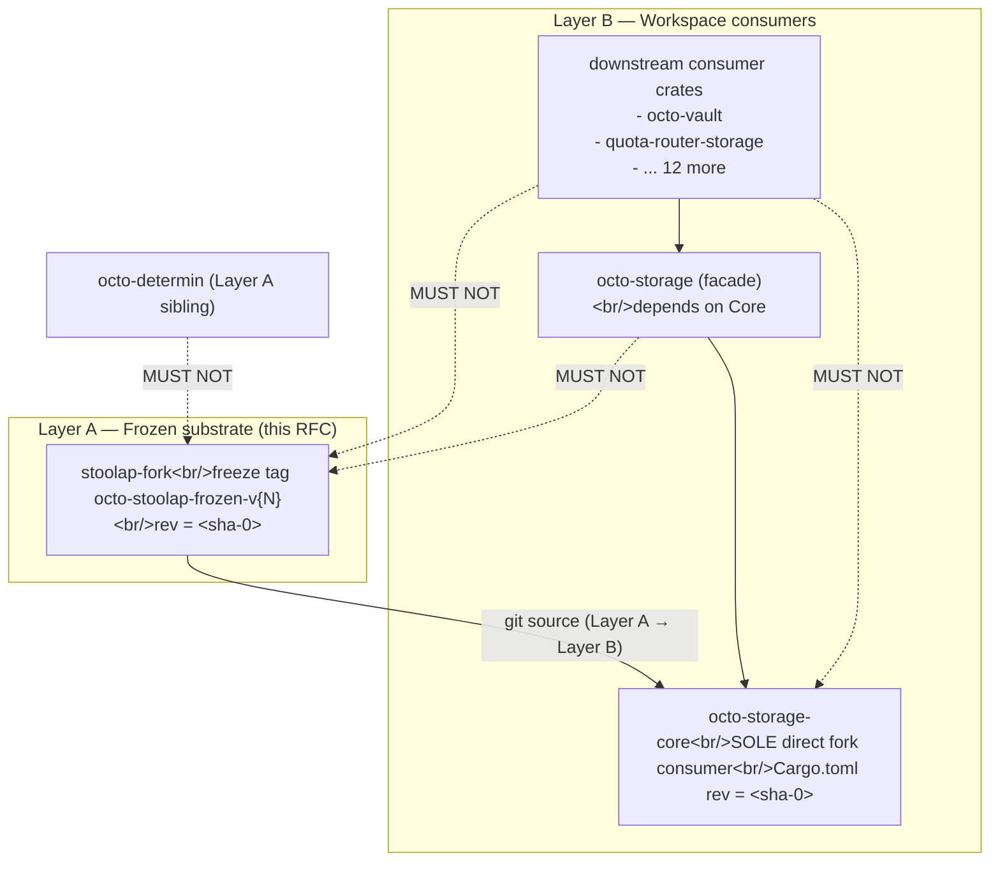

# RFC-0205 — Stoolap Fork Stability Certification

## Status

**Version:** 2.0 (2026-08-20)
**Status:** Draft
**Supersedes:** RFC-0205 v1.8 (archived 2026-08-20)

## Summary

This RFC certifies the Stoolap fork (https://github.com/CipherOcto/stoolap at `feat/blockchain-sql`) as a stable CipherOcto substrate dependency. Scope is **narrowed** from v1.8: substrate API newtype refactor, Layer B TYPE renames, and per-adapter TV enforcement are deferred to RFC-0206 v2.0 (octo-storage Substrate Split) per cross-RFC dependency direction.

Layer A (this RFC) establishes: (a) freeze-tag mechanism pinning the fork to immutable SHA, (b) hardware-key custody + attestation for 2-of-3 quorum, (c) reproducible-build ceremony, (d) SHA-256 git-object migration for collision resistance, (e) post-freeze CVE response procedures.

The 2-cycle with RFC-0206 (octo-storage Substrate Split) resolves per `docs/BLUEPRINT.md` §Dependency Validation Rules → 2-Cycle Atomic Promotion (amendment filed in v2.0 batch): both RFCs reach Accepted in same RFC-review Cycle by single board, OR both stay at Draft. Asymmetric promotion is process defect.

## Definitions

| Term                    | Meaning                                                                                                                                     |
| ----------------------- | ------------------------------------------------------------------------------------------------------------------------------------------- |
| **Freeze tag**          | `octo-stoolap-frozen-v{N}` tag minted at freeze-moment; immutable; carries GPG signature from ≥2-of-3 FPRs + SHA-256SUMS detached signature |
| **Fork SHA**            | `<sha-0>` commit hash freeze tag points to; bound by `Cargo.toml` `rev = "<sha-0>"` pin in substrate                                        |
| **Quorum**              | 2-of-3 GPG FPRs in `trusted-keys.txt` required for freeze tag + freeze-bump tag signing                                                     |
| **External trust root** | `cipherocto-stewards-meta` repo at known commit-hash; bootstraps `trusted-keys.txt`                                                         |
| **Pinned rustc**        | rustc toolchain version pinned via `rust-toolchain.toml` committed to fork repo at freeze-moment                                            |

## §Adversary Analysis

Sorted by severity descending (HIGH → MED → LOW), then by defense cost ascending.

| Sev  | Adversary                                                                                | Defense                                                                                                              | Residual                                |
| ---- | ---------------------------------------------------------------------------------------- | -------------------------------------------------------------------------------------------------------------------- | --------------------------------------- |
| HIGH | crates.io registry index compromise → poisoned Cargo.toml for transitive dep             | TV-0205-22 `--frozen` + vendored `vendor/stoolap/`; SHA-256 of every `~/.cargo/registry/cache/*/<crate>-<ver>.crate` | LOW (frozen checkout)                   |
| HIGH | Cargo.toml URL hostile-mirror substitution (`stoolapp`, `Cipher0cto`)                    | TV-0205-04 prefix-match on canonicalized `git+https://github.com/CipherOcto/stoolap?`; typosquat defense             | LOW (parsed canonical URL)              |
| HIGH | SHA-1 collision on freeze tag (SHAmbles 2020 chosen-prefix, $75k actual / <$10k by 2025) | SHA-256 git-object migration per §Security Considerations                                                            | LOW (SHA-256 native)                    |
| HIGH | Local cargo cache (`~/.cargo/git/db/<hash>/`) write-access                               | TV-0205-22 cross-check via `git checkout <sha-0>` + SHA-256 tree-hash verify                                         | LOW                                     |
| HIGH | YubiKey firmware CVE (YSA-2024-03 Infineon ECDSA Private Key Recovery, firmware <5.7.0)  | §HW Key Custody §Firmware Attestation                                                                                | LOW                                     |
| HIGH | `trusted-keys.txt` tampering (file edit + quorum-replay)                                 | Tag-mtime + content check (≥3 non-empty commits per quarter); every entry GPG-signed by FPR in `trusted-keys.txt`    | LOW                                     |
| HIGH | Compromised steward (one FPR compromised)                                                | 2-of-3 quorum + freeze-tag audit log                                                                                 | LOW                                     |
| MED  | Fork CVE (post-freeze vuln disclosed in frozen rev)                                      | §Bump Acceptance Criteria 30-day SLA + `cve-bumps/` directory                                                        | LOW                                     |
| MED  | Transitive-dep poisoning at freeze-moment `cargo fetch`                                  | TV-0205-22 hashes `~/.cargo/registry/index/*/config.json` at freeze-moment                                           | LOW                                     |
| MED  | `[patch.crates-io] stoolap = ...` injected into transitive crate Cargo.toml              | TV-0205-07 greps workspace root + workspace member Cargo.toml                                                        | LOW (orphan-rule single-impl guarantee) |
| MED  | YubiKey supply-chain (rogue YubiKey presenting as genuine)                               | AAGUID allowlist pinned to FIDO MDS3 published entries + Yubico-published AAGUID list                                | LOW                                     |
| MED  | Vendor attestation root CA migration breaks fail-closed                                  | §HW Key Custody clause (c.2): vendor migration recognized; allowlist update + tracked issue                          | LOW                                     |
| LOW  | Pre-v0 tag retroactively quoted as stability precedent                                   | §Pre-v0 Tag Lifecycle: deleted after v0 OR archived SHA-1 (no migration); never cited                                | LOW                                     |
| LOW  | SHA-1 commit collision in fork history (not just freeze tag)                             | Closed by SHA-256 repo migration                                                                                     | LOW                                     |
| LOW  | SHA-256 tree-hash collision (cheaper than tag-hash)                                      | Closed by `git init/clone --object-format=sha256` (full repo migration)                                              | LOW                                     |

## §Two-Tier Architecture

This RFC defines TWO layers:

| Layer                             | Scope                                                                                               | Stability                                    |
| --------------------------------- | --------------------------------------------------------------------------------------------------- | -------------------------------------------- |
| **Layer A — Frozen substrate**    | Stoolap fork repo + freeze tag + trust anchors                                                      | RFC-frozen, semver-major only (years-stable) |
| **Layer B — Workspace consumers** | `octo-storage-core/` substrate crate + workspace crates consuming substrate via `octo-storage-core` | RFC-driven (additive only)                   |

**Dependency direction:** Layer A → Layer B (consumer relationship). Never reverse. Layer B crates depend on Layer A via substrate (`octo-storage-core`); Layer A (fork) consumed ONLY by `octo-storage-core/Cargo.toml`.

**Out of scope for this RFC:** substrate API newtype refactor (deferred to RFC-0206 v2.0). `octo-storage-core::open()` / `open_in_memory()` return-type newtype is RFC-0206 substrate scope; this RFC assumes substrate API is `Result<octo_storage_core::Database, _>` per RFC-0206 v2.0 §Cargo.toml Templates Layer A.



**Edges:** 3 positive (`Frozen → Core`, `Facade → Core`, `Consumers → Facade`) + 4 MUST NOT.

## §Cargo.toml Pinning

### Layer A (substrate Cargo.toml)

```toml
[dependencies.stoolap]
git = "https://github.com/CipherOcto/stoolap"
rev = "<sha-0>"            # immutable pin to freeze tag commit SHA
# branch = removed entirely (RFC-0206 §Cargo.toml Templates Layer A HIGH-severity risk)
```

`rev = "<sha-0>"` constrains cargo to exact commit. Changing value requires new freeze tag.

### Layer B (workspace root + downstream Cargo.toml)

```toml
[dependencies]
octo-storage-core = { path = "crates/octo-storage-core" }

# NO direct stoolap dependency in downstream crates.
# Handle consumed via octo-storage-core re-export per RFC-0206.
```

**EXCEPTION:** `crates/octo-storage-core/Cargo.toml` is SOLE direct consumer of fork. Owner-trait crates (e.g., `octo-ident`, `octo-cap-macaroon`) DO NOT declare `stoolap` dependency — they consume trait surface registered by adapter crates per RFC-0206 §Wiring Pattern.

**Test-harness exemption:** `sync-e2e-tests/stoolap-node/Cargo.toml` may declare `stoolap` for integration testing. Each such crate recorded in `crates/octo-storage-core/test-harness-allowlist.toml` with `(path, sha256-of-Cargo.toml-contents)` tuple per TV-0205-07.

## §Release-Tag Pin Policy

| #   | Policy                                                                                                                            | Enforcement                                                                                                                                                          |
| --- | --------------------------------------------------------------------------------------------------------------------------------- | -------------------------------------------------------------------------------------------------------------------------------------------------------------------- |
| 1   | Freeze tag format: `octo-stoolap-frozen-v{N}` where N starts at 0                                                                 | `git tag -l 'octo-stoolap-frozen-v*' \| sort -V` MUST monotonically increase                                                                                         |
| 2   | Freeze tag must be GPG-signed by ≥2-of-3 FPRs from `trusted-keys.txt`                                                             | `git verify-tag <tag>` reports exactly 2 valid signatures                                                                                                            |
| 3   | Freeze tag must be accompanied by `.tgz` archive (canonical fork content at freeze-moment)                                        | `git archive --format=tgz --prefix=octo-stoolap-frozen-v{N}/ <sha-0> -o octo-stoolap-frozen-v{N}.tgz` (NOT `tar -czf <sha-0>` which does NOT dereference commit SHA) |
| 4   | `.tgz` SHA-256SUMS file: 1 line per artifact, single space separator, `<lowercase-hex-64>  octo-stoolap-frozen-v{N}.tgz\n` format | TV-0205-14(d): `sha256sum -c SHA256SUMS` exits 0                                                                                                                     |
| 5   | `.tgz` co-signed by 2 GPG FPRs with DISTINCT output paths                                                                         | `gpg --detach-sign --armor --local-user <FPR1> --output SHA256SUMS.<FPR1-short>.asc SHA256SUMS` (default `--output` would overwrite)                                 |
| 6   | `.tgz` + `SHA256SUMS` + `.asc` files distributed to `cipherocto-stewards-meta` trust-anchor repo (pinned distribution path)       | Cross-anchor check: `.tgz` SHA-256 byte-equal between fork repo + cipherocto-stewards-meta                                                                           |
| 7   | Bump-expiry: CRITICAL CVE in frozen rev → 7-day bypass window                                                                     | `docs/audits/cve-bumps/cve-<CVE-ID>-v{N+1}.md` with `CVE-DISCLOSED-DATE:` header (TV-0205-12)                                                                        |
| 8   | Re-cert cadence: quarterly review by security steward                                                                             | `docs/audits/stoolap-quarterly-reviews.md` with ≥3 non-empty commits per quarter (TV-0205-09)                                                                        |

## §Determinism Requirements

| #   | Requirement                                      | Enforcement                                                                                                                                                                                           |
| --- | ------------------------------------------------ | ----------------------------------------------------------------------------------------------------------------------------------------------------------------------------------------------------- |
| 1   | Fork repo SHA-256 git-object format              | `git rev-parse --show-object-format` returns `sha256` at fork clone (NOTE: `--object-format` flag does NOT exist for `git tag`; tag inherits from repo `extensions.objectformat`)                     |
| 2   | Pinned rustc toolchain                           | `rust-toolchain.toml` committed at fork freeze-moment pinning channel + target triple (e.g., `channel = "1.78.0"`); CI pre-flight `cargo --version` byte-equal expected                               |
| 3   | DQA wire form unchanged across re-cert           | `determin` crate byte-exact test vectors unchanged (RFC-0105 owns wire form)                                                                                                                          |
| 4   | Reproducible build between 2 independent runners | TV-0205-25: SHA-256 of `cargo build --locked --release -p octo-storage-core --bin <bin>` output is byte-equal across 2 runners with same pinned rustc                                                 |
| 5   | CI Heterogeneity Requirement                     | TV-0205-23: ≥2 of 5 critical TVs (TV-0205-04, 05, 07, 14, 22) MUST run on secondary CI vendor with separation on (a) SaaS provider (b) underlying cloud (c) base runner image (d) runner provisioning |

## §Security Considerations

| #   | Threat                                                                                                                                                                     | Mitigation                                                                                                                                                                                                                                                                 |
| --- | -------------------------------------------------------------------------------------------------------------------------------------------------------------------------- | -------------------------------------------------------------------------------------------------------------------------------------------------------------------------------------------------------------------------------------------------------------------------- |
| 1   | SHA-1 collision on freeze tag (SHAmbles 2020 chosen-prefix: $75k actual / $45k 2024 estimate / <$10k by 2025)                                                              | Full SHA-256 git-object migration: fork repo MUST clone with `git clone --object-format=sha256 <fork-url>`; `extensions.objectformat = sha256` in fork `.git/config`; `git cat-file -p <tree>` returns SHA-256 tree-hash. Closing tag-hash alone insufficient (Trigger 2). |
| 2   | SHA-1 collision on tree-hash (cheaper than tag-hash; SHAmbles 2020 demonstrated against PGP keys with attacker-controlled payload — git tree objects fall into this class) | Same SHA-256 migration. Tree-hash collision closed by full repo SHA-256 namespace.                                                                                                                                                                                         |
| 3   | Git ≥ 2.42 preflight                                                                                                                                                       | If `git --version` reports < 2.42.0, freeze tag-create fails-closed with `freeze-tag-create-aborted-git-too-old` (exit code 78 EX_CONFIG); no SHA-1 fallback.                                                                                                              |
| 4   | YubiKey firmware CVE (YSA-2024-03 Infineon ECDGA Private Key Recovery; firmware <5.7.0; FIDO2 primary impact)                                                              | §HW Key Custody §Firmware Attestation: 30-day patch SLA + `ykman fido attest` + `openssl verify` against vendored Yubico root cert + AAGUID allowlist pinned to FIDO MDS3 entries.                                                                                         |
| 5   | Local cargo cache tampering (`~/.cargo/git/db/<hash>/` or `~/.cargo/registry/index/`)                                                                                      | TV-0205-22 hashes every `.crate` file referenced by `Cargo.lock`; cross-checks bare-repo checkout against vendored SHA-256 tree-hash.                                                                                                                                      |
| 6   | Pre-v0 tag retroactively referenced as stability precedent                                                                                                                 | §Pre-v0 Tag Lifecycle: pre-v0 tags deleted (`git tag -d` + `git push --delete`) OR archived SHA-1 (no migration); never cited as stability precedent.                                                                                                                      |
| 7   | `Cargo.toml` URL typosquat / path traversal (`/../` segments)                                                                                                              | TV-0205-04 canonicalizes via `url::Url` (normalize path, drop `..`, lowercase host, drop default ports, drop `.git` suffix) BEFORE prefix-match.                                                                                                                           |
| 8   | `[patch.crates-io] stoolap = ...` injected into transitive crate                                                                                                           | TV-0205-07 greps workspace root + members; orphan-rule single-impl guarantee per RFC-0206.                                                                                                                                                                                 |
| 9   | PR-merge attacker modifies vendor file alongside Cargo.toml                                                                                                                | TV-0205-22 anchors `frozen-source-allowlist.toml` to freeze tag tree-hash via `git rev-parse <freeze_tag>^{tree}`.                                                                                                                                                         |

## §HW Key Custody

### §Quorum

- **3 FPRs** in `trusted-keys.txt` (vendored at `cipherocto-stewards-meta` trust-anchor repo at known commit-hash)
- **2-of-3** signatures required for any freeze tag or bump tag
- FPR format: `^[A-F0-9]{40}$` per line, blank lines ignored, `#` comments

### §Key Custody Policy

- Each FPR corresponds to physical FIDO2 token (no software fallback)
- 3 holders independent (different organizations, no shared employer / infrastructure)
- OpenPGP applet FORBIDDEN on all 3 tokens — FIDO2 only
- Holders meet annually in person for cross-attestation

### §Firmware Attestation

**a. Command sequence:**

1. `ykman fido attest` → PEM cert at `/tmp/attestation.pem`
2. `openssl verify -CAfile pinned/yubico-fido2-attestation-root.pem /tmp/attestation.pem` → exit 0
3. `openssl x509 -in /tmp/attestation.pem -text -noout` → extract firmware version from `Authority Key Identifier` + `Subject` OID
4. Cross-reference `(AAGUID, firmware_version, attestation_certificate_sha256)` against `crates/octo-storage-core/firmware-allowlist.toml`

**b. Allowlist entries:**

- `AAGUID` MUST match published FIDO MDS3 entry at `https://mds.fidoalliance.org/`
- `firmware_version` MUST match Yubico-published firmware advisory list
- `attestation_certificate_sha256` is per-device-batch secret (capture-locked)
- Vendor root cert PEM + SHA-256 fingerprint pinned in repo (NOT fetched live)

**c. Drift behavior:**

- (c.1) Genuine drift (no matching pinned root) → fail-closed; revert to last good ceremony
- (c.2) Vendor CA migration (traceable to Yubico-published attestation root migration, verified by `openssl verify` against BOTH old + new pinned roots) → accept new tuple; tracked issue to update allowlist

**d. CVE response:**

- 30-day patch SLA from CVE publication
- Token re-enrolled with patched firmware OR holder replaced via §Emergency Revocation
- Separate `docs/audits/stoolap-firmware-cve-replacements.md` (NOT §Emergency Revocation log — preventive vs security incident)
- Reversible: swapped-out holder MAY re-enroll after patched firmware available
- All-3-holders-share-CVE scenario: pre-provision backup token (FIDO2-only, allowlisted) BEFORE 30-day window closes

**e. CI gate:**

- TV-0205-24 two-track: (i) static check on `firmware-allowlist.toml` (every entry is well-formed `(AAGUID, firmware_version, attestation_certificate_sha256)`, AAGUID in FIDO MDS3, no duplicates, monotonic timestamps); (ii) hardware-in-the-loop integration test against CI-maintained reference YubiKey (NOT a quorum member); `ykman` NOT assumed in CI

### §Emergency Revocation (separate from firmware CVE)

- Loss / theft / suspected compromise → 1-hour SLA: drop FPR from `trusted-keys.txt`, add to `trusted-keys-deny.txt`, re-issue signature file, audit-log entry
- `firmware-allowlist.toml` tuple annotated with `revoked_at = <RFC3339>` (retained for audit)
- Distinct from §Firmware Attestation clause (d) — not used for preventive CVE replacement

## §Test Vectors

| TV         | Description                                                                                              | Status         | Gate                                                                                                                                                                                                                                                                                                                                            |
| ---------- | -------------------------------------------------------------------------------------------------------- | -------------- | ----------------------------------------------------------------------------------------------------------------------------------------------------------------------------------------------------------------------------------------------------------------------------------------------------------------------------------------------- |
| TV-0205-01 | Cargo.toml `rev = "<sha-0>"` not `branch = "feat/blockchain-sql"`                                        | ACTIVE         | `rg '^\s*stoolap\s*=' crates/octo-storage-core/Cargo.toml \| rg 'rev\s*='` exits 0                                                                                                                                                                                                                                                              |
| TV-0205-02 | NO direct `stoolap` dep in workspace member Cargo.toml                                                   | ACTIVE         | `rg '^\s*stoolap\s*=' crates/*/Cargo.toml \| grep -v 'crates/octo-storage-core/Cargo.toml' \| wc -l` equals 0 (excludes test-harness exemption)                                                                                                                                                                                                 |
| TV-0205-04 | Canonicalized URL prefix-match on cargo `.source` field                                                  | ACTIVE         | `cargo metadata --format-version 1 \| jq -r '.packages[] \| select(.name == "stoolap") \| .source' \| xargs -I {} sh -c 'echo {} \| urlnorm \| grep -q "^git+https://github.com/CipherOcto/stoolap?"'`                                                                                                                                          |
| TV-0205-05 | `trusted-keys.txt` byte-equal between cipherocto-stewards-meta + freeze-tag tree-hash                    | ACTIVE         | `diff <(git show <freeze_tag>:trusted-keys.txt) <(curl -s https://raw.githubusercontent.com/CipherOcto/cipherocto-stewards-meta/<known-sha>/trusted-keys.txt) \| wc -l` equals 0                                                                                                                                                                |
| TV-0205-07 | Test-harness allowlist: `test-harness-allowlist.toml` (path, sha256) tuples                              | ACTIVE         | `rg -c '^\[\[harness\]\]' crates/octo-storage-core/test-harness-allowlist.toml` matches count of `crates/*/Cargo.toml` with `stoolap` dep outside substrate                                                                                                                                                                                     |
| TV-0205-09 | Quarterly review file: ≥3 non-empty commits per quarter                                                  | ACTIVE         | `git log --since='3 months ago' --until='now' --oneline docs/audits/stoolap-quarterly-reviews.md \| wc -l` ≥ 3                                                                                                                                                                                                                                  |
| TV-0205-12 | CVE bump file with `CVE-DISCLOSED-DATE:` header                                                          | ACTIVE on bump | `awk '/^CVE-DISCLOSED-DATE:/ {print $2; exit}' <cve-bump-md>` returns YYYY-MM-DD                                                                                                                                                                                                                                                                |
| TV-0205-14 | SHA256SUMS wrapper ceremony                                                                              | ACTIVE         | (a) `git archive --format=tgz --prefix=octo-stoolap-frozen-v{N}/ <sha-0> -o octo-stoolap-frozen-v{N}.tgz`; (b) `sha256sum octo-stoolap-frozen-v{N}.tgz > SHA256SUMS`; (c) `gpg --detach-sign --armor --local-user <FPR1> --output SHA256SUMS.<FPR1-short>.asc SHA256SUMS` (×2 distinct FPRs); (d) `sha256sum -c SHA256SUMS` exits 0             |
| TV-0205-17 | Branch protection enforced on `feat/blockchain-sql` branch                                               | ACTIVE         | `gh api repos/CipherOcto/stoolap/branches/feat/blockchain-sql/protection` returns HTTP 200 (NOT 404)                                                                                                                                                                                                                                            |
| TV-0205-21 | SHA-256 git-object format at fork clone                                                                  | ACTIVE         | `git rev-parse --show-object-format` returns `sha256` (NOT `sha1`)                                                                                                                                                                                                                                                                              |
| TV-0205-22 | Frozen-source-allowlist + `--frozen` + vendored sources                                                  | ACTIVE         | (a) `cargo vendor vendor/` at freeze-moment; commit `vendor/stoolap/`; (b) `cargo build --frozen --config 'source.vendored-sources.replace-with="vendored"' -p octo-storage-core`; (c) byte-equal `Cargo.lock` `[[package]]` `(name, version, source)` set between freeze-moment + rebuild                                                      |
| TV-0205-23 | CI heterogeneity: ≥2 of 5 critical TVs on secondary vendor                                               | ACTIVE         | `docs/audits/stoolap-ci-heterogeneity-log.md` records per-run secondary vendor + job URL for ≥2 of TV-0205-04, 05, 07, 14, 22                                                                                                                                                                                                                   |
| TV-0205-24 | Firmware allowlist: AAGUID in MDS3 + tuple uniqueness                                                    | ACTIVE         | (i) every `firmware-allowlist.toml` entry has well-formed `(AAGUID, firmware_version, attestation_certificate_sha256)`; (ii) AAGUID in FIDO MDS3 BLOB at `https://mds.fidoalliance.org/`; (iii) no duplicate tuples; (iv) monotonic timestamps                                                                                                  |
| TV-0205-25 | Reproducible build: SHA-256 of release binary byte-equal across 2 runners                                | ACTIVE         | `sha256sum target/release/<bin>` from 2 independent runners with pinned `rust-toolchain.toml` returns byte-equal                                                                                                                                                                                                                                |
| TV-0205-26 | Pre-v0 tag lifecycle: no pre-v0 tag exists in fork tag namespace with SHA-1 tree reference older than v0 | ACTIVE         | `git for-each-ref --format='%(refname:short) %(objecttype) %(*objecttype)' refs/tags/ \| awk '$2=="tag" && $3=="commit"' \| while read t _; do git cat-file -p "$t" \| head -1 \| grep -q "$(git rev-parse <freeze_tag>)" \|\| test "$(git log -1 --format='%ct' "$t^{commit}")" -lt "$(git log -1 --format='%ct' <freeze_tag>)"; done` exits 0 |

**Inactive / forward-requirement TVs (post-Phase 1 Task 4a only):**

| TV         | Description                                                   | Forward gate    |
| ---------- | ------------------------------------------------------------- | --------------- |
| TV-0205-06 | `scripts/stoolap_recert.sh` per-step audit                    | Phase 1 Task 4a |
| TV-0205-13 | `determin/tests/dqa_wire_form_byte_eq.rs` byte-exact fixtures | Phase 2 Task 13 |
| TV-0205-16 | 4-step FPR extraction                                         | Phase 1 Task 4a |
| TV-0205-18 | `scripts/verify-external-root.sh`                             | Phase 1 Task 4a |
| TV-0205-19 | CVE bump re-cert                                              | Phase 1 Task 4a |
| TV-0205-20 | Frozen-tag mtime window (≤NOW-30d)                            | Phase 1 Task 4a |

**Note:** 16 v1.8 forward-requirement fixture files (10 scripts + audit docs + 4 allowlist tomles + `trusted-keys*.txt` + `determin/tests/dqa_wire_form_byte_eq.rs` + `cipherocto-stewards-meta` repo) moved to Phase 2/3 missions. v1.8 fixture-absent note (which itself noted own absence) deleted — fixtures now follow concrete phased delivery per §Implementation Phases, not deferred all-once.

## §Implementation Phases

### Phase 0 (precondition)

- **0.1** Create `cipherocto-stewards-meta` repo; bootstrap `trusted-keys.txt` with 3 FPRs; first commit GPG-signed by 1-of-3 (acceptable for bootstrap)

### Phase 1 (RFC-0205 acceptance path)

- **1.1** Phase 0 complete (cipherocto-stewards-meta bootstrapped)
- **1.2** RFC-0206 v2.0 reaches Accepted (cross-RFC dependency per BLUEPRINT.md §Dependency Validation Rules → 2-Cycle Atomic Promotion)
- **1.3** Land `crates/octo-storage-core/Cargo.toml` `rev = "<sha-0>"` pin
- **1.4** Land `crates/octo-storage-core/firmware-allowlist.toml` (initial 3 entries from current quorum tokens)
- **1.5** Land `crates/octo-storage-core/test-harness-allowlist.toml` (initial empty; populates as tests land)
- **1.6** Land `crates/octo-storage-core/frozen-source-allowlist.toml` (initial entry for v0 freeze tag)
- **1.7** Land `crates/octo-storage-core/external-root-config.toml` (mode = `local-pin` for CI)
- **1.8** Land `docs/runbooks/stoolap-steward.md` (procedures)
- **1.9** Land `docs/audits/cve-bumps/` directory (empty; populated on bump)
- **1.10** Land `docs/audits/stoolap-ci-heterogeneity-log.md` (empty)
- **1.11** Land `docs/audits/stoolap-firmware-cve-replacements.md` (empty; separate from §Emergency Revocation log)

### Phase 2 (post-acceptance: bump ceremony)

- **2.1** Fork CVE detected → `cve-bumps/cve-<ID>-v{N+1}.md`
- **2.2** 2-of-3 quorum signs new freeze tag
- **2.3** SHA256SUMS wrapper ceremony (TV-0205-14)
- **2.4** Trust-anchor repo updated; freeze tag tree-hash entry added to `docs/audits/stoolap-fork-stability-tree-hashes.json`

### Phase 3 (post-acceptance: re-cert)

- **3.1** Quarterly review (`docs/audits/stoolap-quarterly-reviews.md`)
- **3.2** Recert audit (`docs/audits/stoolap-recert-audit.md`)
- **3.3** Key revocation ceremony (if applicable)

## §Pre-v0 Tag Lifecycle

Pre-v0 tags (sandbox runs, RFC review tags) MUST be:

- (a) Deleted after v0 freeze tag is minted (`git tag -d <pre-v0-tag>` + `git push origin --delete <pre-v0-tag>`); OR
- (b) Archived SHA-1 (no migration); NEVER cited as stability precedent

TV-0205-26: at every re-cert, verify no pre-v0 tag exists in fork tag namespace with SHA-1 tree reference older than v0.

## §Substrate Cross-Reference

This RFC assumes substrate API per RFC-0206 v2.0 §Cargo.toml Templates Layer A:

- `pub struct Database(stoolap::Database)` newtype (handles TYPE leak)
- `Database::execute_checked(adapter_id, TypedStatement)` API (DDL allowlist at substrate level)
- `From<Database> for stoolap::Database` one-way escape for typed-query allowlist sites

If RFC-0206 v2.0 acceptance path alters (e.g., newtype refactor deferred again), this RFC `crates/octo-storage-core` consumption contracts revert to `Result<stoolap::Database, _>` and Layer B TYPE-leak concerns re-emerge. 2-cycle atomicity rule (BLUEPRINT.md) is enforcement mechanism.

## §Promotion Path

**Condition 1 (Sibling RFC frozen at Accepted):** RFC-0206 v2.0 MUST reach Accepted per BLUEPRINT.md §Dependency Validation Rules → 2-Cycle Atomic Promotion before this RFC promotes to Accepted. Symmetric: both RFCs reviewed in same Cycle by single board; both reach Accepted in same Cycle, OR both stay at Draft.

**Condition 2 (Phase 0-1 complete):** cipherocto-stewards-meta repo bootstrapped (Phase 0.1) + Phase 1.1-1.11 landed.

**Condition 3 (No CRITICAL findings from R10 reviewer pass):** R10 dispatches ≥2 reviewers post-RFC-body-finalization; zero unresolved CRITICAL findings.

**Condition 4 (RFC body byte-equal to commit hash):** `git rev-parse HEAD:rfcs/draft/storage/0205-stoolap-fork-stability.md` byte-equal to version reviewed at R10 close.

## §Future Work

| Mission                                     | Scope                                                                             | Target    |
| ------------------------------------------- | --------------------------------------------------------------------------------- | --------- |
| `0205-stoolap-fork-feature-upstreaming`     | Periodic upstream PRs from cipherocto fork to upstream Stoolap                    | v3.0      |
| `0205-octo-stoolap-frozen-release-process`  | Automated release pipeline for freeze tag + artifacts                             | v3.0      |
| `0205-stoolap-fork-retirement`              | Plan for retiring cipherocto fork in favor of upstream (when upstream stabilizes) | v3.0+     |
| `0205-stoolap-quarterly-reviews-automation` | Automation of quarterly re-cert ceremony                                          | v3.0      |
| `0205-octo-storage-core-newtype-deferral`   | Track RFC-0206 v2.0 newtype refactor schedule                                     | cross-RFC |

## §Out of Scope

- Substrate API newtype refactor (RFC-0206 v2.0 scope)
- Layer B TYPE renames (RFC-0206 v2.0 scope)
- Per-adapter TV enforcement (RFC-0206 v2.0 scope)
- TypedStatement enum at substrate level (RFC-0206 v2.0 scope)
- 8-pub-use cap (RFC-0206 v2.0 scope)
- Per-adapter transaction isolation (v3.0+)
- Connection-pool DoS (v3.0+)
- GDPR right-to-erasure substrate ceremony (v3.0+)

## §Dependencies

| Dependency                                                                  | Required Status                                         |
| --------------------------------------------------------------------------- | ------------------------------------------------------- |
| RFC-0206 v2.0                                                               | At Accepted (per BLUEPRINT.md 2-Cycle Atomic Promotion) |
| `docs/BLUEPRINT.md` §Dependency Validation Rules → 2-Cycle Atomic Promotion | Filed (committed in v2.0 batch)                         |
| `cipherocto-stewards-meta` repo                                             | Bootstrapped (Phase 0.1)                                |
| Fork repo at SHA-256 git-object format                                      | Cloned with `--object-format=sha256` (Phase 1.3)        |
| git ≥ 2.42                                                                  | Pinned in `rust-toolchain.toml` (Phase 1.3)             |

## §Required-by

This RFC is required by:

- RFC-0206 v2.0 (cross-RFC atomic pair)

## §Cross-RFC Atomicity

Per `docs/BLUEPRINT.md` §Dependency Validation Rules → 2-Cycle Atomic Promotion:

- This RFC and RFC-0206 v2.0 are coupled pair
- Both reviewed in same RFC-review Cycle by single board
- Both reach Accepted in same Cycle, OR both stay at Draft
- Asymmetric promotion is process defect flagged at next re-cert

Cross-RFC atomicity mechanism is BLUEPRINT.md amendment, not RFC-internal language.

## §Version History

| Version | Date           | Change                                                                                                                                                                                                                                                                                                                                                                                                                                                                                                                                                                                                                                                                                                                                                                   |
| ------- | -------------- | ------------------------------------------------------------------------------------------------------------------------------------------------------------------------------------------------------------------------------------------------------------------------------------------------------------------------------------------------------------------------------------------------------------------------------------------------------------------------------------------------------------------------------------------------------------------------------------------------------------------------------------------------------------------------------------------------------------------------------------------------------------------------ |
| 1.0     | 2026-08-13     | Initial Draft                                                                                                                                                                                                                                                                                                                                                                                                                                                                                                                                                                                                                                                                                                                                                            |
| 1.1     | 2026-08-14     | R1 review fixes                                                                                                                                                                                                                                                                                                                                                                                                                                                                                                                                                                                                                                                                                                                                                          |
| 1.2     | 2026-08-15     | R2 review fixes                                                                                                                                                                                                                                                                                                                                                                                                                                                                                                                                                                                                                                                                                                                                                          |
| 1.3     | 2026-08-16     | R3 review fixes                                                                                                                                                                                                                                                                                                                                                                                                                                                                                                                                                                                                                                                                                                                                                          |
| 1.4     | 2026-08-17     | R4 review fixes                                                                                                                                                                                                                                                                                                                                                                                                                                                                                                                                                                                                                                                                                                                                                          |
| 1.5     | 2026-08-18     | R5 review fixes                                                                                                                                                                                                                                                                                                                                                                                                                                                                                                                                                                                                                                                                                                                                                          |
| 1.6     | 2026-08-19     | R6 review fixes (CRIT-blockers)                                                                                                                                                                                                                                                                                                                                                                                                                                                                                                                                                                                                                                                                                                                                          |
| 1.7     | 2026-08-19     | R7 review fixes                                                                                                                                                                                                                                                                                                                                                                                                                                                                                                                                                                                                                                                                                                                                                          |
| 1.8     | 2026-08-20     | R8 review fixes (CRIT-blockers)                                                                                                                                                                                                                                                                                                                                                                                                                                                                                                                                                                                                                                                                                                                                          |
| **2.0** | **2026-08-20** | **Wholesale rewrite per R9 multi-reviewer structural-trigger: scope narrowed (substrate TYPE-leak deferred to RFC-0206 v2.0); fabricated mechanisms replaced (YubiKey attestation, git tag object-format, registry-index bypass); 16 v1.8 forward-requirement fixtures moved to Phase 2/3 missions; cross-RFC atomicity via BLUEPRINT.md amendment; SHA-256 git-object migration via full repo init (not tag flag); 2-cycle atomic-promotion rule cited; ceremony broken patterns replaced (git archive + distinct gpg output paths); §Adversary Analysis severity-sorted; phantom changelog claims removed; §HW Key Custody rewritten with real ykman commands + vendored Yubico root + FIDO MDS3 AAGUID cross-reference; TV-0205-26 pre-v0 tag lifecycle check added** |

## §References

- RFC-0206 (octo-storage Substrate Split) — coupled pair per BLUEPRINT.md §Dependency Validation Rules → 2-Cycle Atomic Promotion
- `docs/BLUEPRINT.md` §Dependency Validation Rules (2-Cycle Atomic Promotion amendment filed in v2.0 batch)
- RFC-0105 (DQA wire form owner — referenced via TV-0205-13 determin test vectors)
- `docs/audits/octo-storage-trait-surface-2026-08-19.md` (ground-truth for substrate re-export surface)
- `docs/audits/rfc-0205-0206-r9-findings-2026-08-20.md` (R9 aggregate driving v2.0 wholesale rewrite)
- Yubico PIV Tool Attestation documentation: https://docs.yubico.com/software/yubikey/tools/pivtool/piv-tool-attestation.html
- FIDO Alliance Metadata Service (MDS3): https://mds.fidoalliance.org/
- git hash-function-transition: https://git-scm.com/docs/hash-function-transition
- SHAmbles 2020 chosen-prefix collision: https://sha-mbles.github.io/
