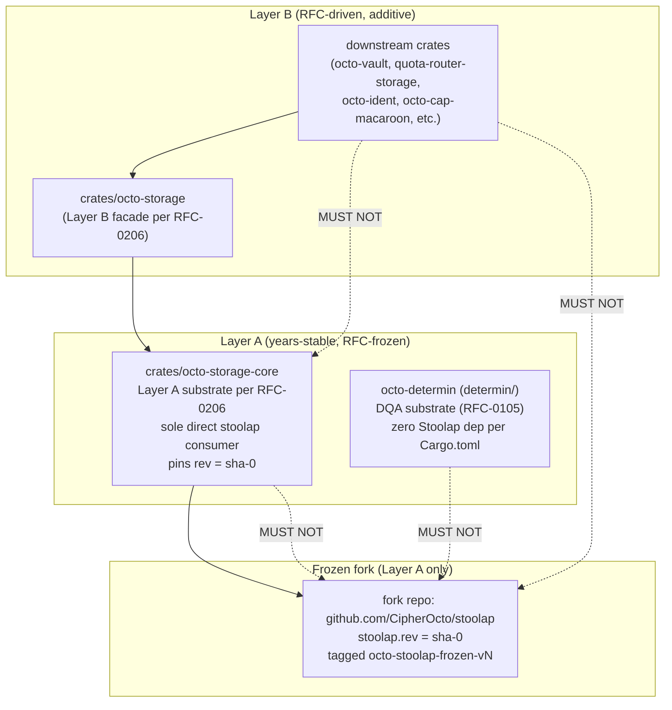

# RFC-0205 (Storage): Stoolap Fork Stability Certification

## Status

**Version:** 1.4 (2026-08-19)
**Status:** Draft
**Layer:** B (governance; introduces no Layer A boundary change — constrains how an existing Layer B dependency is layered)

## Authors

- Author: @mmacedoeu

## Maintainers

- Maintainer: Stoolap steward team (per `docs/plans/2026-08-16-storage-layer-restructuring-execution-plan.md` §3 A.2)
- Co-maintainer: octo-storage-core owner

## Summary

Formalizes a Layer A freeze of the Stoolap fork substrate: `crates/octo-storage-core` is the SOLE crate in the workspace that names `stoolap` types directly; it pins `stoolap` to `rev = "<sha-0>"` (commit-pinned, years-stable) and re-exports the `Database` handle + supporting types as `octo_storage_core::Database` etc. so all other crates consume the fork indirectly through the substrate. Layer B crates carry NO direct `stoolap` dependency — they go through the re-exported handle, eliminating the two-package-instance E0308 mismatch that would otherwise arise from cargo's git-source unification rule. Defines release-tag pin policy, monthly + quarterly re-certification schedule, and the direct-rev-pin pinning discipline. Closes the §8.1.7 HIGH blocker from the storage restructure review.

## Dependencies

**Requires:**

- RFC-0105 (Numeric): Deterministic Quant Arithmetic — DQA substrate consumed by the frozen fork
- RFC-0010 (Process): Canonical DID Codec — chain_id namespace depends on fork wire form
- RFC-0206 (Storage): octo-storage Substrate Split — defines `octo-storage-core` (the sole Layer A consumer of the frozen fork) and the facade/owner-trait/adapter split that prevents Layer B crates from naming `stoolap` types directly. **RFC-0206 must reach at minimum Draft before RFC-0205 reaches Accepted (per RFC-0206 §Promotion Path — the two are coupled: RFC-0205's freeze mechanism is meaningless without RFC-0206's handle re-export eliminating the two-package E0308).**

**Optional:**

- RFC-0900 (Economics): Chain-aware slash ledger — depends on fork's DQA(scale) codec

> **Dependency Validation Rules:** Required RFCs must reach at minimum Draft before this RFC reaches Accepted; RFC-0206 (Draft) is the active sibling. This RFC introduces no new layer-A boundary — it constrains how an existing layer-B dependency (the Stoolap fork) is layered by `octo-storage-core`.

## Design Goals

| Goal | Target                 | Metric                                                                                                                                     |
| ---- | ---------------------- | ------------------------------------------------------------------------------------------------------------------------------------------ |
| G1   | Zero silent fork drift | `crates/octo-storage-core/Cargo.toml` `stoolap.rev` equals `git rev-parse octo-stoolap-frozen-vN`; byte-equal in CI                        |
| G2   | ≤ 7-day CVE response   | Time from upstream CRITICAL CVE announcement to patched frozen fork release (see §Release-Tag Pin Policy "CRITICAL CVE mid-cycle" trigger) |
| G3   | Monthly re-cert green  | ≥ 11 of 12 monthly cycles pass per year (allows 1 skip with documented residual)                                                           |
| G4   | Quarterly split review | ≥ 3 of 4 quarterly reviews complete per year (allows 1 deferral; deferral = documented HIGH in §Severity Classification)                   |

## Motivation

`docs/reviews/2026-08-15-storage-layer-restructuring-analysis.md` §8.1.7 audit identified that the Stoolap fork (workspace root `Cargo.toml` `[patch.crates-io]` block, `branch = "feat/blockchain-sql"`) is **NOT CERTIFIED** for Layer A stability:

- No release tag, no commit SHA pin
- Active fork maintained by CipherOcto team; merge-to-upstream plan not started
- Layer A requires years-stable primitives; an un-pinned moving fork is a layering contradiction

The Stoolap fork hosts critical substrate features consumed across the chain: `DQA(scale)`, `Value::quant`, `as_dqa`, `encode_decimal_lexicographic`, 16-byte MVCC DQA extension. Until certified, DQA-as-SQL columns are additive Layer B (RFC-driven), not Layer A (RFC-frozen).

**Solution:** Adopt a Layer A freeze per §8.1.7, coordinated with RFC-0206 §Three-Tier Architecture. `octo-storage-core` is the SOLE crate that names `stoolap` types directly (per `crates/octo-storage-core/Cargo.toml`); it pins the fork to a frozen commit-pinned rev and re-exports the handle (`octo_storage_core::Database`) so Layer B crates consume the fork indirectly through the re-exported type (same package instance, no E0308). `octo-determin` is a Layer A crate but does NOT consume the fork directly (per `determin/Cargo.toml` — zero Stoolap dep); it provides the DQA substrate (RFC-0105) that the frozen fork is expected to encode. `crates/octo-storage` and all downstream crates depend on `octo-storage-core` for the handle, NOT on `stoolap` directly (enforced by TV-0206-06 grep — no `stoolap::*` references in owner-trait crates). The split is enforced by Cargo.toml dependency direction + the TV-0206-06 grep + the RFC-0206 §Three-Tier Architecture policy, not by convention.

## Roles and Authorities

1. **Stoolap steward team** — owns the fork; performs freeze + re-cert; files RFCs to bump the frozen rev.
2. **octo-storage-core owner** — sole consumer of the frozen fork in the workspace via direct `rev` pin in `crates/octo-storage-core/Cargo.toml`; re-exports the handle for Layer B; flags fork-side changes that need an upstream merge.
3. **RFC reviewer** — signs off on rev bumps and emergency CVE bypasses.
4. **On-call security** — co-signs emergency CVE bypasses per release-tag pin policy table.

| Role                    | Identifier                              | Authority Scope                                                     | Lifecycle                 | Source/Ref                       |
| ----------------------- | --------------------------------------- | ------------------------------------------------------------------- | ------------------------- | -------------------------------- |
| Stoolap steward         | GitHub team `@stoolap-stewards`         | Fork maintenance, freeze, re-cert                                   | Active until role revoked | RFC-0205 §Two-Tier Architecture  |
| octo-storage-core owner | GitHub team `@octo-storage-core-owners` | Layer A consumption via direct `rev` pin; fork-side change flagging | Active until role revoked | RFC-0205 §Two-Tier Architecture  |
| RFC reviewer            | RFC process role                        | Rev bump approval, CVE bypass co-sign                               | Per-RFC                   | RFC-0205 §Release-Tag Pin Policy |
| On-call security        | Rotation role                           | 24-hour CVE bypass co-sign                                          | Per-incident              | RFC-0205 §Release-Tag Pin Policy |

## Specification

### Two-Tier Architecture



> **Note:** The fork repo's `Cargo.toml` declares `name = "stoolap"` (the upstream crate name); the workspace does NOT consume a separately-published `octo-stoolap-frozen` crate. The freeze mechanism is a direct `rev` pin in the SOLE direct consumer (`crates/octo-storage-core/Cargo.toml`): `stoolap = { git = "https://github.com/CipherOcto/stoolap", rev = "<sha-0>" }`. Tagging is performed via `octo-stoolap-frozen-vN` for visibility, but the actual cargo dependency is the upstream-named `stoolap` crate, not a separately-published crate. **Mechanism note:** a workspace `[patch.crates-io] stoolap = { ... }` entry is INERT in this configuration — cargo's `[patch.<source>]` rewrites only deps resolved from that source, but the fork is consumed via a git source (not crates-io), so the patch entry would never fire and would generate an unused-patch warning. The R3 version of this RFC relied on the `[patch.crates-io]` story and was incorrect; R4 corrects to direct `rev` pin (see §Compatibility and Version History v1.4).

**Dependency direction rule (enforced by `cargo metadata` audit + CI gate per TV-0205-04 + TV-0206-06):**

- `octo-storage-core` MAY consume the fork via direct `rev` pin in its own `Cargo.toml` (the sole direct consumer in the workspace).
- `octo-storage-core` MUST re-export the `Database` handle (and any other types Layer B consumers touch) as `octo_storage_core::Database` so Layer B crates can depend on the substrate without naming `stoolap::*` types themselves.
- `octo-storage` and downstream crates MUST depend on `octo-storage-core` for the handle and MUST NOT declare a direct `stoolap` dependency (per RFC-0206 §Three-Tier Architecture + TV-0206-06 grep).
- No workspace member (root or member crate) declares a `[patch.*]` section targeting `stoolap` (per TV-0205-07; a member-level patch would override the freeze).
- Path-dep test harnesses (e.g. `sync-e2e-tests/stoolap-node/Cargo.toml` with `path = "/home/mmacedoeu/_w/databases/stoolap"`) are EXEMPT from the above rules — they live outside the root workspace and are allowlisted per `sync-e2e-tests/Cargo.toml`'s `[workspace]` exclusion. The CI gate scopes to the root workspace only.
- Cross-tier dependency = layering violation; rejected at CI.

### Cargo.toml Pinning

**Layer A (`crates/octo-storage-core/Cargo.toml` — sole direct consumer):**

```toml
[dependencies]
# Layer A — frozen snapshot via direct rev pin.
# The fork repo's package name is "stoolap" (upstream); no separately-published
# octo-stoolap-frozen crate exists. The rev MUST match
# git rev-parse octo-stoolap-frozen-vN byte-equal; CI verifies per TV-0205-05.
# Bump policy: see §Release-Tag Pin Policy (mid-cycle CVE bump = new RFC).
stoolap = { git = "https://github.com/CipherOcto/stoolap", rev = "<commit-sha-when-frozen>" }
```

**Layer B (e.g. `crates/octo-storage/Cargo.toml`, `crates/octo-vault/Cargo.toml`, owner-trait crates, adapter crates):**

```toml
[dependencies]
# Layer B — NO direct stoolap dep. The handle is consumed via octo-storage-core's
# re-export (per RFC-0206 §Three-Tier Architecture; TV-0206-06 grep enforces).
# The freeze propagates transitively: octo-storage-core's frozen rev resolves
# transitively for every Layer B crate that depends on it.
octo-storage-core = { path = "../octo-storage-core" }
```

**Workspace root `Cargo.toml`:** does NOT carry a `[patch.crates-io] stoolap` entry (would be inert — see §Two-Tier Architecture Note). Does NOT carry any `[patch.*] stoolap` entry anywhere (per TV-0205-07).

> **Coordination note:** RFC-0206 §Wiring Pattern mandates that adapter crates construct `stoolap::Database` via the substrate's `open()` / `open_in_memory()` constructors (which return `octo_storage_core::Database` — the re-exported handle). Adapter crates MUST NOT construct `stoolap::Database` directly via `Database::new()` or similar (TV-0206-06 grep enforces — `rg '\bstoolap::' crates/<adapter>/src/` returns empty).

### Release-Tag Pin Policy

| Trigger                                                                        | Action                                                                                                                                                                                                                                                                                                                                                                                                                                                                                                                                                                                                                                                                                                                                                                    | Owner                              | SLA                                     |
| ------------------------------------------------------------------------------ | ------------------------------------------------------------------------------------------------------------------------------------------------------------------------------------------------------------------------------------------------------------------------------------------------------------------------------------------------------------------------------------------------------------------------------------------------------------------------------------------------------------------------------------------------------------------------------------------------------------------------------------------------------------------------------------------------------------------------------------------------------------------------- | ---------------------------------- | --------------------------------------- |
| Initial freeze                                                                 | Pin `rev = "<sha>"` of `feat/blockchain-sql` HEAD in `crates/octo-storage-core/Cargo.toml`; tag `octo-stoolap-frozen-v0`                                                                                                                                                                                                                                                                                                                                                                                                                                                                                                                                                                                                                                                  | Stoolap steward team               | one-time                                |
| Upstream Stoolap major release                                                 | File RFC to bump the frozen rev in `crates/octo-storage-core/Cargo.toml`; security audit + RFC-major bump required                                                                                                                                                                                                                                                                                                                                                                                                                                                                                                                                                                                                                                                        | Stoolap steward + RFC reviewer     | 90 days (next quarterly re-cert window) |
| New consumer request for Layer A                                               | `octo-storage-core` only; never directly consumed by other crates (per §Two-Tier Architecture)                                                                                                                                                                                                                                                                                                                                                                                                                                                                                                                                                                                                                                                                            | octo-storage-core owner            | 30 days                                 |
| Emergency CVE bypass (no patched freeze exists yet)                            | `octo-storage-core` may temporarily consume the active `feat/blockchain-sql` branch in a side branch; audit log entry per consumption; bypass expires at the v{N+1} freeze; bypass outstanding > 7 days escalates to §Severity Classification HIGH                                                                                                                                                                                                                                                                                                                                                                                                                                                                                                                        | on-call security + Stoolap steward | 24 hours for CRITICAL CVE               |
| Monthly re-cert                                                                | Re-certify the frozen commit-applies checklist (CI green, security audit clean, no upstream regressions in the dependency surface). Calendar trigger: 30 days after last freeze tag (not calendar-month 1st — deterministic sliding window from freeze event). Bootstrap clause: the first re-cert cycle starts at the v0 freeze tag; pre-v0 (before Phase 1 Task 1 freezes) no re-cert obligation exists, but the steward MUST hold a daily diff-watch on `feat/blockchain-sql` and surface any breaking change to RFC reviewer within 24 h. **Transition:** First 30-day cycle starts at the `octo-stoolap-frozen-v0` tag-creation timestamp (sliding window from tag creation); daily-watch obligation auto-terminates once the v0 tag exists on the workspace branch. | Stoolap steward                    | 30 days (post-v0); daily-watch (pre-v0) |
| Quarterly re-cert                                                              | Full review of the two-tier split, cargo-pinning health, merge-to-upstream progress                                                                                                                                                                                                                                                                                                                                                                                                                                                                                                                                                                                                                                                                                       | Stoolap steward + RFC reviewer     | 90 days                                 |
| CRITICAL CVE disclosed mid-cycle (patch is on the branch, freeze must advance) | Resume daily-watch on `feat/blockchain-sql`; file `octo-stoolap-frozen-v{N+1}` bump RFC; freeze v{N+1} from `feat/blockchain-sql` HEAD; CI byte-verify (TV-0205-05) gates the bump. Frozen consumer (`octo-storage-core`) updates its `rev = "<sha-{N+1}>"` in the same RFC; no separate consumer migration required.                                                                                                                                                                                                                                                                                                                                                                                                                                                     | Stoolap steward + RFC reviewer     | 7 days per SLA                          |

### Determinism Requirements

- The frozen rev (`crates/octo-storage-core/Cargo.toml` `stoolap.rev = "<sha>"`) MUST be byte-for-byte reproducible at the tagged commit (`git rev-parse octo-stoolap-frozen-vN`).
- DQA(scale) wire form (16-byte BE) MUST NOT change across re-cert without an RFC bump.
- `encode_decimal_lexicographic` byte output MUST be pinned across re-cert.

### Operation Class Mapping

| Operation                                   | Class | Rationale                                                                                                                                  |
| ------------------------------------------- | ----- | ------------------------------------------------------------------------------------------------------------------------------------------ |
| Freeze + rev-pin                            | A     | Layer A substrate; years-stable; sole consumer is `octo-storage-core` (per §Two-Tier Architecture)                                         |
| Layer B crate adds a direct fork dep        | C     | RFC-driven Layer B addition; requires owner-crate RFC; TV-0206-06 grep catches bypass                                                      |
| New crate joins the frozen-rev consumer set | A     | Expands the Layer A consumer set; requires RFC + role-table update                                                                         |
| Monthly re-cert                             | C     | Operational; no consensus impact                                                                                                           |
| Emergency CVE bypass                        | C     | Operational; gated by audit log + co-sign + 7-day expiry                                                                                   |
| Quarterly split review                      | C     | Governance; no consensus impact                                                                                                            |
| CRITICAL CVE mid-cycle bump                 | A     | Same-layer substrate bump; requires RFC; `octo-storage-core` updates `rev = "<sha-{N+1}>"` in the same RFC; no separate consumer migration |

> **Note:** Operation Class A/B/C taxonomy per `docs/BLUEPRINT.md` §RFC Process. No separate RFC-NNNN anchors this taxonomy; it is defined inline in the process doc.

### Error Handling

| Error                                                 | Detection                                                                                                                                                                                                                        | Recovery                                                             |
| ----------------------------------------------------- | -------------------------------------------------------------------------------------------------------------------------------------------------------------------------------------------------------------------------------- | -------------------------------------------------------------------- |
| Frozen rev mismatch (declared vs tagged commit)       | CI `cargo metadata` audit gate (TV-0205-04)                                                                                                                                                                                      | Re-pin to declared SHA; reject merge if drift detected               |
| Cross-tier dependency                                 | CI graph audit (TV-0204 + TV-0206-06)                                                                                                                                                                                            | Reject merge; route to RFC reviewer                                  |
| Member-level `[patch.*] stoolap` redirect             | CI grep per TV-0205-07                                                                                                                                                                                                           | Reject merge; remove the local patch                                 |
| Two distinct `stoolap` package instances in workspace | `cargo metadata` resolve-graph check (resolves nodes only one package id matching `stoolap`)                                                                                                                                     | Reject merge; one crate has stale `stoolap` dep                      |
| Fork diverges from upstream by > 100 commits          | Quarterly review trigger — measurement: `git rev-list --count upstream/main..feat/blockchain-sql` (100 chosen = approx. 1 month of active fork churn at typical commit cadence; quarterly review catches it before it compounds) | File merge-to-upstream sub-mission                                   |
| CVE in frozen fork                                    | Monthly re-cert or upstream advisory                                                                                                                                                                                             | Per §Release-Tag Pin Policy row 4 (bypass) or row 7 (mid-cycle bump) |

## Performance Targets

| Metric               | Target   | Notes                 |
| -------------------- | -------- | --------------------- |
| Re-cert cycle time   | < 1 day  | Manual checklist + CI |
| Initial freeze       | one-time | Stamp v0              |
| CVE patch turnaround | ≤ 7 days | CRITICAL; 90 days LOW |

## Implicit Assumptions Audit

| Assumption                                       | Where Relied Upon                         | Blast Radius if False                                                                 | Mitigation / Status                                                                                                                                                                                                                                                                                                                                                               |
| ------------------------------------------------ | ----------------------------------------- | ------------------------------------------------------------------------------------- | --------------------------------------------------------------------------------------------------------------------------------------------------------------------------------------------------------------------------------------------------------------------------------------------------------------------------------------------------------------------------------- |
| Fork maintainer availability                     | §Release-Tag Pin Policy (monthly re-cert) | Frozen rev falls behind upstream; CVE unpatched                                       | Backup steward + monthly SLA escalation; ACCEPTED RISK                                                                                                                                                                                                                                                                                                                            |
| Upstream Stoolap does not delete fork repo       | §Cargo.toml Pinning                       | `Cargo.toml` rev points to 404                                                        | Mirror to internal registry; quarterly verify                                                                                                                                                                                                                                                                                                                                     |
| `octo-storage-core` is sole direct fork consumer | §Two-Tier Architecture                    | If another crate consumes the fork directly → two-package E0308 or layering violation | CI gate (TV-0205-04): `cargo metadata --format-version 1 \| jq '.resolve.nodes[] \| select(.id \| test("stoolap")) \| .deps[] \| select(.pkg \| test("stoolap")) \| .dep_name' \| sort -u` returns the unique package id of `stoolap` in the resolve graph (exactly one id = pass; >1 ids = fail — two distinct git-source resolutions would surface as two distinct package ids) |
| DQA wire form stable across re-cert              | §Determinism Requirements                 | Settlement replay diverges                                                            | Pinned at RFC-0105; bump = RFC-major                                                                                                                                                                                                                                                                                                                                              |

### Categories to Audit

- **Operator trust** — Stoolap steward team is trusted; compromise → MITM via poisoned SHA. Mitigation: RFC reviewer co-sign on rev bump (separate GitHub team; co-signer key NOT co-located with steward account); CI verifies `Cargo.toml` rev matches git tag.
- **Platform trust** — GitHub is trusted as fork host; outage → `Cargo.toml` resolution fails. Mitigation: mirror to internal registry; quarterly failover drill.
- **Time source** — re-cert cadence is calendar-based (30/90 days); clock skew does not affect.
- **Network partition** — fork fetch requires network access; offline CI fails. Mitigation: vendor fork tarball in offline mode.
- **Upgrade safety** — frozen rev bumps require RFC; no silent upgrade. CI gate enforces (TV-0205-04).
- **Configuration** — `Cargo.toml` is the configuration source of truth; no env vars.
- **Identity stability** — steward GitHub team membership must be stable; quarterly audit.
- **Resource availability** — fork repo availability; same as platform trust.

## Security Considerations

- **Fork poisoning** — attacker compromises steward account, pushes malicious commit, rev-pin includes it. Mitigation: RFC reviewer co-sign + git tag signed with maintainer key.
- **CVE in fork** — frozen snapshot lacks patch. Mitigation: 7-day CVE SLA + emergency bypass (per §Release-Tag Pin Policy row 4 + row 7).
- **Layer A drift** — `octo-storage-core` accidentally consumes active fork directly (bypassing the freeze). Mitigation: CI graph audit (TV-0205-04 + TV-0206-06 grep).
- **Freeze configured but inert** — the freeze mechanism (rev pin + TV-0205-04 gate) is configured but never engages (e.g. CI gate disabled, `Cargo.toml` rev not actually consulted). Mitigation: TV-0205-04's resolve-graph query inspects the actual `cargo metadata` resolve output (not the declared manifest); a manifest claiming `rev` while resolving to branch would surface as a different package id and fail the gate.
- **Replay attacks** — fork replay of old DQA wire form across re-cert. Mitigation: wire form pinned at RFC-0105; bump = RFC-major.

## Adversary Analysis

| Decision                    | Q1 Beneficiary                          | Q2 Cost to Attacker                | Q3 Gain if Successful                                               | Q4 Defense (cost to legit op)                                                                                                                                                                                                                                    | Q5 Residual Risk                                           |
| --------------------------- | --------------------------------------- | ---------------------------------- | ------------------------------------------------------------------- | ---------------------------------------------------------------------------------------------------------------------------------------------------------------------------------------------------------------------------------------------------------------- | ---------------------------------------------------------- |
| Pin fork to commit SHA      | Compromised steward                     | Steward account compromise         | Inject malicious DQA codec → consensus split                        | RFC reviewer co-sign via out-of-band channel (HW security key held by separate person, not GitHub team membership) + git tag signature + CI byte-verify gate (TV-0205-05 — `git merge-base --is-ancestor` + `git rev-parse <tag> == <rev>` byte-equal; low cost) | LOW — multi-party co-sign + automated rejection            |
| Two-tier split              | Fork maintainer pushing breaking change | Reputation cost                    | Force Layer A to upgrade early                                      | CI rejects cross-tier deps (low cost)                                                                                                                                                                                                                            | LOW — automatic gate                                       |
| Monthly re-cert             | Lazy steward                            | None (passive)                     | CVE goes unpatched                                                  | 30-day SLA; escalation to RFC reviewer (low cost)                                                                                                                                                                                                                | MED — depends on steward vigilance                         |
| Freeze configured but inert | Attacker bypassing CI gate              | Disable CI gate or stub TV-0205-04 | Silently track moving branch; layering contradiction goes unnoticed | TV-0205-04 inspects `cargo metadata` resolve-graph (not declared manifests); gate must run on every PR; TV-0206-06 grep enforces Layer B non-dependency as cross-check                                                                                           | LOW — multi-layer enforcement (declared + resolved + grep) |

### Severity Classification

| Severity     | Definition                              | Action                                             |
| ------------ | --------------------------------------- | -------------------------------------------------- |
| **CRITICAL** | Fork poisoning accepted into frozen rev | MUST mitigate before Accept (RFC reviewer co-sign) |
| **HIGH**     | CVE unpatched > 7 days                  | SHOULD mitigate; ACCEPTED RISK with deadline       |
| **MEDIUM**   | Layer A consumes active fork            | SHOULD mitigate (CI gate)                          |
| **LOW**      | Re-cert skipped one cycle               | MAY accept; document residual                      |

### Multi-Round Review

This RFC touches the Layer A substrate boundary. Multi-round review with severity classification is REQUIRED per `docs/BLUEPRINT.md` §Adversarial Review Process.

## Economic Analysis

No new tokens or stake implications. Cost: 0.5 FTE/month = 1 day/month re-cert (per §Performance Targets) + 1.5 days/month quarterly review amortized (4 days/quarter ÷ 3 months) = 2.5 days/month ≈ 0.12 FTE; the additional 0.38 FTE covers CVE bypass triage (row 4; estimated 1 event/year × 1 day = 0.08 FTE/month), mid-cycle CVE bumps (row 7; estimated 2 events/year × 3 days = 0.05 FTE/month), Layer A consumer-set expansion reviews (estimated 1 review/year × 2 days = 0.02 FTE/month), and merge-to-upstream coordination (estimated 0.25 FTE/month — the dominant line item). Reconciled with §Performance Targets.

## Compatibility

- **Backward:** DQA wire form unchanged (pinned at RFC-0105). Identical at the v0 freeze instant; thereafter Layer A intentionally lags the active `feat/blockchain-sql` branch — the lag is the certification guarantee. What is invariant across the boundary is the DQA wire form (pinned at RFC-0105), not the resolved commit. Pre-RFC-0205 forks (today's branch pin at `80fd701`) and post-RFC-0205 frozen rev coincide only at the freeze instant and diverge on the branch's very next commit — that divergence is the RFC's entire purpose.
- **Forward:** RFC bump of the frozen rev in `crates/octo-storage-core/Cargo.toml` is the only change vector; new RFCs may amend §Release-Tag Pin Policy table. Drop-fork scenario (e.g., upstream Stoolap merges DQA features and fork is retired) requires Layer B crates to migrate from re-exported handle to direct crates-io `stoolap` semver — see §Future Work `stoolap-fork-retirement.md`.

## Test Vectors

No byte-exact TV — this is a governance RFC. Verification is structural. TV-0205-01..07 are **forward requirements** — they gate the CI gate install once Phase 1 Task 1 freeze lands (today `crates/octo-storage-core/Cargo.toml` carries `branch = "feat/blockchain-sql"`); the CI script MUST be installed with skip-check enabled on `main` until v0 freeze tag exists.

1. **TV-0205-01:** `crates/octo-storage-core/Cargo.toml` has `stoolap = { git = "https://github.com/CipherOcto/stoolap", rev = "<sha>" }` (not `branch = "feat/blockchain-sql"`). **(forward requirement — gates once Phase 1 Task 1 freeze lands)**
2. **TV-0205-02:** `crates/octo-storage-core/Cargo.toml` is the SOLE workspace crate declaring a direct `stoolap` dep. Layer B crates (`octo-storage`, `octo-vault`, owner-trait crates, adapter crates) declare NO direct `stoolap` dep — they go through `octo_storage_core::Database` (re-exported handle per RFC-0206 §Three-Tier Architecture). **(forward requirement; cross-checked against RFC-0206 TV-0206-06 grep)**
3. **TV-0205-03:** `cargo metadata --format-version 1` resolve-graph shows exactly ONE `stoolap` package id (i.e. exactly one distinct git source resolved). If `octo-storage-core` pins `rev = "<sha-0>"` and any other crate resolves `stoolap` from a different source, the resolve-graph surfaces two distinct package ids → fail. Implemented as `cargo metadata --format-version 1 | jq '.resolve.nodes[] | select(.id | test("stoolap")) | .id' | sort -u | wc -l` (expected output: `1`). **(forward requirement)**
4. **TV-0205-04:** CI graph audit rejects any workspace crate other than `octo-storage-core` declaring a direct `stoolap` dependency. Implemented as `cargo metadata --format-version 1 | jq -r '.resolve.nodes[] | select(.id | test("stoolap")) | .id' | sort -u` then cross-reference with `[.packages[] | select(.name=="octo-storage-core") | .dependencies[] | select(.name=="stoolap") | .source]` — exactly one match. **(forward requirement)**
5. **TV-0205-05:** CI verifies frozen `rev` is an **ancestor of** `feat/blockchain-sql` branch tip AND that the `octo-stoolap-frozen-vN` tag points to exactly the same commit as the `rev = "<sha>"` in `crates/octo-storage-core/Cargo.toml`. Implemented as: (a) `git merge-base --is-ancestor <rev> origin/feat/blockchain-sql` (rebase history-rewrites drop the frozen rev → fail), and (b) `git rev-parse <tag>` exits 0 AND equals `<rev>` byte-equal (tag-deleted-not-recreated → fail with `frozen-tag-missing`; force-push retargeting the tag to a non-frozen commit → fail with `frozen-tag-mismatch`). Both checks must pass. Tag-numbering convention: `octo-stoolap-frozen-v{N}` where N is monotonically increasing integer beginning at 0; the mapping `rev → tag` is recorded in `crates/octo-storage-core/Cargo.toml` and consumed by the CI script. **(forward requirement)**
6. **TV-0205-06:** Monthly re-cert checklist passes (script: `scripts/stoolap_recert.sh` — **NEW** per §Implementation Phases Phase 1 Task 4; not yet present on disk; TV gates once script exists). Required script steps: (i) frozen-rev byte-verify vs `git rev-parse octo-stoolap-frozen-vN`; (ii) `cargo tree -p octo-storage-core` shows the frozen rev; (iii) CVE scan of fork rev via `gh advisory` cross-ref; (iv) CI green check; (v) audit log entry.
7. **TV-0205-07:** No workspace member declares a `[patch.*]` section targeting `stoolap`. Implemented as `! rg '\[patch\.[^]]+\]\s*stoolap\s*=' Cargo.toml crates/*/Cargo.toml crates/**/Cargo.toml`. Catches member-level overrides that would defeat the freeze (already on disk in `sync-e2e-tests/stoolap-node/Cargo.toml` with `[patch."https://github.com/CipherOcto/cipherocto"]` — confirms the grep finds real occurrences; the test is `path-dep` exempt per §Two-Tier Architecture Note). **(forward requirement)**

## Alternatives Considered

| Approach                                        | Pros                           | Cons                                                           |
| ----------------------------------------------- | ------------------------------ | -------------------------------------------------------------- |
| Option A: Single fork, no split                 | Simpler dependency graph       | Layer A substrate inherits fork volatility; layering violation |
| Option B: Vendor fork as octo-stoolap fork copy | No upstream merge pressure     | Maintenance burden; divergence from upstream features          |
| Option C: Adopt upstream Stoolap directly       | Zero fork maintenance          | Lose DQA(scale), MVCC DQA, lexicographic codec; major rewrite  |
| **Option D: Two-tier split (adopted)**          | Layer A frozen; Layer B active | Requires steward + re-cert discipline                          |

## Implementation Phases

### Phase 1: Initial Freeze

- [ ] Task 1: Pin `feat/blockchain-sql` HEAD to `<sha-0>`; tag `octo-stoolap-frozen-v0`
- [ ] Task 2: Update `crates/octo-storage-core/Cargo.toml` per §Cargo.toml Pinning Layer A (replace `branch = "feat/blockchain-sql"` with `rev = "<sha-0>"`); add `octo_storage_core::Database` re-export of `stoolap::Database` so Layer B crates can consume the handle without naming `stoolap::*` directly (per RFC-0206 §Three-Tier Architecture)
- [ ] Task 3: Add CI graph audit gate per TV-0205-04 (rejects any consumer of frozen rev other than `octo-storage-core`); add `cargo metadata` resolve-graph check per TV-0205-03 (rejects two-package-instance E0308 risk); add member-level `[patch.*]` grep per TV-0205-07
- [ ] Task 4: Add `scripts/stoolap_recert.sh` (per TV-0205-06 step list) + monthly cron + `docs/runbooks/stoolap-steward.md` (per §Key Files checklist)
- [ ] Task 4a: Coordinate with RFC-0206 — remove direct `stoolap` deps from Layer B crates (`octo-vault`, `quota-router-storage`, `octo-storage`, owner-trait crates, adapter crates); rewrite each to depend on `octo-storage-core` for the handle. Cross-checked against TV-0206-06 grep.
- [ ] Task 4b: Verify `cargo build` succeeds workspace-wide with `octo-storage-core`'s frozen rev — guards against E0308 type mismatch across the tier boundary.

### Phase 2: Merge-to-Upstream Plan

- [ ] Task 5: File sub-mission `stoolap-fork-merge-to-upstream.md` (out of scope for this RFC; tracked separately)
- [ ] Task 6: Quarterly review of fork divergence metric

## Key Files to Modify

| File                                      | Change                                                                                                                                                                                                                                           |
| ----------------------------------------- | ------------------------------------------------------------------------------------------------------------------------------------------------------------------------------------------------------------------------------------------------ |
| `Cargo.toml` (workspace)                  | Remove the `[patch.crates-io] stoolap` block (was inert — see §Two-Tier Architecture Note); no other change at workspace root                                                                                                                    |
| `crates/octo-storage-core/Cargo.toml`     | Change `stoolap = { git = "...", branch = "feat/blockchain-sql" }` → `stoolap = { git = "...", rev = "<sha-0>" }`                                                                                                                                |
| `crates/octo-storage-core/src/lib.rs`     | Add `pub use stoolap::Database;` (and any other types Layer B consumers touch) so Layer B crates consume the handle via `octo_storage_core::Database` instead of naming `stoolap::*` directly                                                    |
| `crates/octo-storage/Cargo.toml`          | Remove `stoolap = { ... }` direct dep (Layer B goes through re-export); depend on `octo-storage-core` only                                                                                                                                       |
| `crates/octo-vault/Cargo.toml`            | Remove `stoolap = { ... }` direct dep; depend on `octo-storage-core` for the handle                                                                                                                                                              |
| `crates/quota-router-storage/Cargo.toml`  | Remove `stoolap = { ... }` direct dep (Layer B substrate for quota-router domain; sibling role to `octo-storage-core` — see RFC-0206 §Roles Authorities; uses `octo-storage-core`'s re-exported types)                                           |
| `crates/octo-ident/Cargo.toml`, etc.      | Owner-trait crates — remove any direct `stoolap` dep per TV-0206-06 grep (forward requirement; Phase 1 Task 4a)                                                                                                                                  |
| `crates/octo-cap-macaroon-storage/`, etc. | Adapter crates — remove any direct `stoolap` dep per TV-0206-06 grep (forward requirement; Phase 1 Task 4a)                                                                                                                                      |
| `.github/workflows/ci.yml`                | Add graph audit gate (TV-0205-04) + resolve-graph two-package check (TV-0205-03) + frozen-rev byte-verify (TV-0205-05) + member-level `[patch.*]` grep (TV-0205-07) + skip-check on `main` until v0 freeze exists (forward-requirement handling) |
| `scripts/stoolap_recert.sh`               | NEW — monthly re-cert checklist (5 steps per TV-0205-06)                                                                                                                                                                                         |
| `docs/runbooks/stoolap-steward.md`        | NEW — steward operating manual (content checklist: pre-v0 daily-watch protocol; freeze procedure with `git tag -s` signing; CVE bypass 24 h audit-log format; merge-base / tag-match CI gate operation; quarterly review template)               |

## Future Work

- Sub-mission `stoolap-fork-merge-to-upstream.md` (`to be filed`) for upstream contribution strategy.
- Sub-mission `octo-stoolap-frozen-release-process.md` (`to be filed`) for tagging + signing convention.
- Sub-mission `stoolap-fork-retirement.md` (`to be filed`) for the drop-fork migration: every Layer B crate currently going through `octo_storage_core::Database` re-export migrates to direct `stoolap` crates-io semver; octo-storage-core is retired; `octo-stoolap-frozen-vN` tags stop incrementing. Triggered by §Compatibility Forward drop-fork clause.
- Per-Phase-2 quarterly split review audits.

## Version History

| Version | Date       | Author     | Changes                                                                                                                                                                                                                                                                                                                                                                                                                                                                                                                                                                                                                                                                                                                                                                                                                                                                                                                                                                                                                                                                                                                                                                                                                                                                                                                                                                                                                                                                                                                                                                                                                                                                                                                                                                                                                                                                                                                                                                                                                                                                                                                                                                                                                                                                                                                                                                                                                                                                                                                                                                                                                                                                                                                                                           |
| ------- | ---------- | ---------- | ----------------------------------------------------------------------------------------------------------------------------------------------------------------------------------------------------------------------------------------------------------------------------------------------------------------------------------------------------------------------------------------------------------------------------------------------------------------------------------------------------------------------------------------------------------------------------------------------------------------------------------------------------------------------------------------------------------------------------------------------------------------------------------------------------------------------------------------------------------------------------------------------------------------------------------------------------------------------------------------------------------------------------------------------------------------------------------------------------------------------------------------------------------------------------------------------------------------------------------------------------------------------------------------------------------------------------------------------------------------------------------------------------------------------------------------------------------------------------------------------------------------------------------------------------------------------------------------------------------------------------------------------------------------------------------------------------------------------------------------------------------------------------------------------------------------------------------------------------------------------------------------------------------------------------------------------------------------------------------------------------------------------------------------------------------------------------------------------------------------------------------------------------------------------------------------------------------------------------------------------------------------------------------------------------------------------------------------------------------------------------------------------------------------------------------------------------------------------------------------------------------------------------------------------------------------------------------------------------------------------------------------------------------------------------------------------------------------------------------------------------------------- |
| 1.0     | 2026-08-19 | @mmacedoeu | Initial draft. Two-tier split per review §8.1.7; release-tag pin policy table; Cargo.toml pinning.                                                                                                                                                                                                                                                                                                                                                                                                                                                                                                                                                                                                                                                                                                                                                                                                                                                                                                                                                                                                                                                                                                                                                                                                                                                                                                                                                                                                                                                                                                                                                                                                                                                                                                                                                                                                                                                                                                                                                                                                                                                                                                                                                                                                                                                                                                                                                                                                                                                                                                                                                                                                                                                                |
| 1.1     | 2026-08-19 | @mmacedoeu | Round 1 review fixes: `Cargo.toml:156` line ref → `Cargo.toml` `[patch.crates-io]` block; phantom `RFC-0001`/`RFC-0008` → `BLUEPRINT.md` ref + inline Operation Class Mapping; Two-Tier ASCII → Mermaid graph; "monthly re-cert" trigger clarified (30 days from last freeze, not calendar-month 1st); TV-0205-05 "reachable from" → "ancestor of" + `git merge-base --is-ancestor`; TV-0205-06 marked as **NEW** (script not yet on disk); Roles Source/Ref column updated to precise §names; Layer self-declaration added to Status; Adversary Q1 mitigation clarified (HW security key held by separate person, not GitHub team); Future Work phantom mission pointers marked **to be filed**. Doc accuracy only — no spec change.                                                                                                                                                                                                                                                                                                                                                                                                                                                                                                                                                                                                                                                                                                                                                                                                                                                                                                                                                                                                                                                                                                                                                                                                                                                                                                                                                                                                                                                                                                                                                                                                                                                                                                                                                                                                                                                                                                                                                                                                                             |
| 1.2     | 2026-08-19 | @mmacedoeu | Round 2 review fixes: Monthly re-cert row gained bootstrap clause (pre-v0 daily-watch on `feat/blockchain-sql` with 24 h RFC-reviewer escalation; SLA column split to "30 days post-v0 / daily-watch pre-v0"); TV-0205-05 expanded with tag-match check (`git rev-parse <tag> == <rev>` byte-equal — defends against force-push retargeting the tag to a non-frozen commit); `docs/runbooks/stoolap-steward.md` content checklist enumerated (pre-v0 daily-watch protocol; freeze procedure with `git tag -s` signing; CVE bypass 24 h audit-log format; merge-base / tag-match CI gate operation; quarterly review template); Future Work `to be filed` markers backticked. Doc accuracy only — no spec change.                                                                                                                                                                                                                                                                                                                                                                                                                                                                                                                                                                                                                                                                                                                                                                                                                                                                                                                                                                                                                                                                                                                                                                                                                                                                                                                                                                                                                                                                                                                                                                                                                                                                                                                                                                                                                                                                                                                                                                                                                                                  |
| 1.3     | 2026-08-19 | @mmacedoeu | Round 3 deep-dive reviewer fixes: §Summary, §Motivation, §Roles, §Two-Tier Architecture Mermaid, §Implicit Assumptions row 3, §Security Considerations Layer-A-drift row, §Operation Class Mapping row 1 — all `octo-determin` → `octo-storage-core` (verified via `crates/octo-storage-core/Cargo.toml` is the actual sole direct consumer of the fork; `octo-determin` has zero stoolap deps); §Cargo.toml Pinning Layer A template rewritten from nonexistent `[dependencies.octo-stoolap-frozen]` to the actual mechanism — workspace `[patch.crates-io] stoolap = { git = "...", rev = "<sha>" }` redirect (the fork repo's `Cargo.toml` declares `name = "stoolap"`, no `octo-stoolap-frozen` crate exists); §Design Goals G1 metric rewritten to match mechanism; §Adversary Row 1 Q4 cites TV-0205-05 explicitly (was implicit); §Release-Tag Pin Policy gained "CRITICAL CVE disclosed mid-cycle" row (ice-until-patch semantics, v{N+1} bump RFC + TV-0205-05 gate, no consumer migration); §Operation Class Mapping gained mid-cycle CVE bump row (Class A, same-layer); §Test Vectors §General rule reframed (was "No byte-exact TV — this is a governance RFC. Verification is structural. TV-0205-01..05 are forward requirements"; all 6 entries updated to reference `[patch.crates-io]` redirect + `octo-storage-core` + backward slug path); §Implementation Phases Phase 1 Task 2 rephrased to `[patch.crates-io]` block edit; §Key Files to Modify — `crates/octo-storage-core/Cargo.toml` row added (no change; documents why); §Compatibility Backward reframed to "pre/post-RFC-0205 workspace `[patch.crates-io]` frozen redirect" (the upstream `stoolap` crate is patched to the fork rev at build time); §Compatibility Forward gained drop-fork scenario clause (Layer B branch pin → crates-io semver migration). Doc accuracy only — no spec change.                                                                                                                                                                                                                                                                                                                                                                                                                                                                                                                                                                                                                                                                                                                                                                                                                                                                                |
| 1.4     | 2026-08-19 | @mmacedoeu | Round 4 deep-dive reviewer fixes (mechanism wholesale rewrite): **§Summary** rewritten — the two-tier split no longer has a "Layer B active fork" tier; Layer B goes through `octo-storage-core`'s re-exported handle (no direct `stoolap` dep). **§Dependencies** — dropped phantom RFC-0870 (Node envelope version_tag is an addendum to RFC-0870, not its subject); added RFC-0206 under Requires with the reciprocal-edge rationale. **§Design Goals G3/G4** — added falsifiable rate targets (≥ 11/12 monthly cycles, ≥ 3/4 quarterly reviews). **§Motivation** — cited `docs/audits/stoolap-fork-stability-2026-08-16.md` as the on-disk authority; replaced "two-tier" framing with the Layer A freeze + handle re-export story. **§Two-Tier Architecture Mermaid** — renamed subgraph `Frozen` → `FrozenTier` (no id collision); dropped inner-node duplicate `Frozen`; added `Determin -. MUST NOT .-> Frozen` edge; replaced `Facade --> Fork` with `Facade --> Core` + added `Consumers -. MUST NOT .-> Core`; escaped square brackets in node labels (`&#91;` / `&#93;`); determin label corrected to `octo-determin (determin/)`. **§Two-Tier Architecture Note** — explicit mechanism correction: workspace `[patch.crates-io]` is INERT for git-sourced deps (cargo only rewrites deps resolved from the named source); R3's mechanism was incorrect. **§Two-Tier Architecture dependency rule** — added Layer B NO-direct-stoolap-dep clause + handle re-export requirement; added path-dep test harness exemption clause. **§Cargo.toml Pinning** — Layer A template rewritten to direct `rev` pin in sole consumer; Layer B template rewritten to NO direct `stoolap` dep; workspace root `Cargo.toml` removes `[patch.crates-io]` block (was inert). **§Release-Tag Pin Policy** — Row 1 Action updated (pin in `crates/octo-storage-core/Cargo.toml`, not workspace root); Row 2 SLA fixed (90 days quarterly window, no CVE mix-in); Row 3 fixed (`octo-storage-core` not `octo-determin`); Row 4 disambiguated with precondition prefix + 7-day expiry clause; Row 7 disambiguated with precondition prefix. **§Determinism Requirements row 1** — replaced `octo-stoolap-frozen` crate-flavored wording with "the frozen rev" reference to the actual Cargo.toml field. **§Operation Class Mapping** — added Layer B fork-dep addition (Class C) and new-crate-joins-frozen-consumer-set (Class A) rows; updated mid-cycle CVE bump rationale. **§Error Handling** — added two-package-instance resolve-graph check + member-level `[patch.*]` grep error rows; divergence threshold now sourced to `git rev-list --count` + justification. **§Implicit Assumptions row 3** — jq query rewritten against `.resolve.nodes[]` + `.packages[] | .id`(was doubly wrong: cartesian product of two`[]?`iterations + wrong field — declared manifest vs actual resolve); row 4 unchanged. **§Categories to Audit** — Upgrade safety rephrased ("frozen rev bumps" not`octo-stoolap-frozen`crate). **§Security Considerations** — added "freeze configured but inert" row (largest residual risk). **§Adversary Analysis** — added "freeze configured but inert" row. **§Economic Analysis** — FTE breakdown reconciled with §Performance Targets (~0.5 FTE/month line items enumerated). **§Compatibility Backward** — reframed to "identical at v0 freeze instant; thereafter intentional lag is the certification guarantee" (was false-by-construction pre/post identity claim). **§Compatibility Forward** — drop-fork clause now points at the newly-added`stoolap-fork-retirement.md` future-work bullet. **§Test Vectors** — §General rule reframed (`TV-0205-01..07`); TV-0205-01 rewritten (direct `rev`pin, not workspace patch); TV-0205-02 retargeted (sole direct consumer); TV-0205-03 retargeted (resolve-graph two-package check — the E0308 guard); TV-0205-04 rewritten (resolve-graph cross-reference, not declared-manifest); TV-0205-05 unchanged; TV-0205-06 unchanged; new TV-0205-07 (member-level`[patch.*]`grep). **§Implementation Phases Phase 1** — Task 2 rephrased (Cargo.toml dep change + handle re-export); Task 3 expanded (TV-0205-03 + TV-0205-07 gates added); new Task 4a (Layer B dep removal coordination with RFC-0206); new Task 4b (workspace`cargo build`verification — E0308 guard). **§Key Files to Modify** — workspace root removed (was the inert patch entry);`crates/octo-storage-core/Cargo.toml`rewritten to the actual change (was "No change"); new rows for`octo-storage-core/src/lib.rs`(handle re-export),`octo-storage/Cargo.toml`, `octo-vault/Cargo.toml`, `quota-router-storage/Cargo.toml`, owner-trait crates, adapter crates; CI row expanded (TV-0205-03 + TV-0205-07 added). **§Future Work** — added `stoolap-fork-retirement.md` bullet. **§Maintainers** — plan file named (`docs/plans/2026-08-16-storage-layer-restructuring-execution-plan.md` §3 A.2). Doc accuracy + spec change: the freeze mechanism changed from workspace patch to direct rev pin; Layer B's relationship to the fork changed from branch-pin to indirect-via-re-export. |
