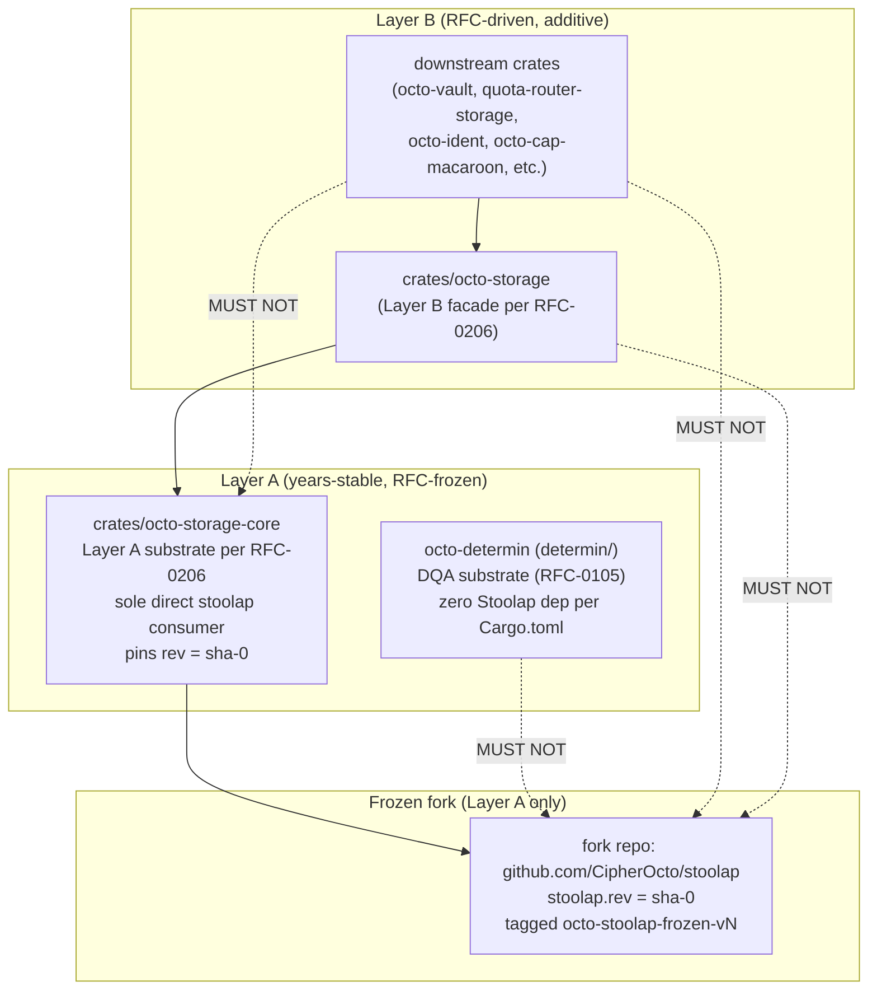

# RFC-0205: Stoolap Fork Stability Certification

## Status

**Version:** 1.7 (2026-08-19)
**Status:** Draft
**Layer:** B (governance; introduces no Layer A boundary change — constrains how an existing Layer B dependency is layered)

## Authors

- Author: @mmacedoeu

## Maintainers

- Maintainer: Stoolap steward team (per `docs/plans/2026-08-16-storage-layer-restructuring-execution-plan.md` §2 A.2)
- Co-maintainer: octo-storage-core owner

## Summary

Formalizes a Layer A freeze of the Stoolap fork substrate. **Goal (post-Phase 1 Task 4a):** `crates/octo-storage-core` is the SOLE crate in the workspace that names `stoolap` types directly — it pins `stoolap` to `rev = "<sha-0>"` (commit-pinned, years-stable) and re-exports the `Database` handle + supporting types as `octo_storage_core::Database` etc. so all other crates consume the fork indirectly through the substrate. **Current state:** 12 crates carry direct `stoolap = { git = "...", branch = "feat/blockchain-sql" }` today (per audit 2026-08-19); Phase 1 Task 4a consolidates to substrate-only. Layer B crates carry NO direct `stoolap` dependency (post-Task-4a) — they go through the re-exported handle, eliminating the two-package-instance E0308 mismatch that would otherwise arise from cargo's git-source unification rule. Defines release-tag pin policy, monthly + quarterly re-certification schedule, and the direct-rev-pin pinning discipline. Closes the §8.1.7 HIGH blocker from the storage restructure review.

## Dependencies

**Requires:**

- RFC-0105: Deterministic Quant Arithmetic — DQA substrate consumed by the frozen fork
- RFC-0010: Canonical DID Codec — chain_id namespace depends on fork wire form
- RFC-0206: octo-storage Substrate Split — defines `octo-storage-core` (the sole Layer A consumer of the frozen fork) and the facade/owner-trait/adapter split that prevents Layer B crates from naming `stoolap` types directly. **RFC-0206 must reach at minimum Draft before RFC-0205 reaches Accepted (per RFC-0206 §Promotion Path — the two are coupled: RFC-0205's freeze mechanism is meaningless without RFC-0206's handle re-export eliminating the two-package E0308).**

**Required-by:**

- RFC-0206: §Three-Tier Architecture depends on the direct `rev` pin + handle re-export in `crates/octo-storage-core/Cargo.toml`; this RFC's freeze mechanism is meaningless without RFC-0206's facade invariant.

**Required-for:**

- `octo-storage-core` Layer A substrate certification; downstream owner-trait crate + adapter crate fork consumption pattern.

**Optional:**

- RFC-0900: Chain-aware slash ledger — depends on fork's DQA(scale) codec

> **Dependency Validation Rules:** Required RFCs must reach at minimum Draft before this RFC reaches Accepted; RFC-0206 is the active sibling. This RFC introduces no new layer-A boundary — it constrains how an existing layer-B dependency (the Stoolap fork) is layered by `octo-storage-core`.
>
> **Dependency-cycle note:** RFC-0205 ↔ RFC-0206 forms a 2-cycle. The cycle is non-blocking because both are already at Draft status (current state); either RFC may proceed from Draft to Accepted independently as long as the other is at minimum Draft. The Accept-gate coupling is mutually satisfied by the §Promotion Path conditions of both RFCs.

## Design Goals

| Goal | Target                 | Metric                                                                                                                                     |
| ---- | ---------------------- | ------------------------------------------------------------------------------------------------------------------------------------------ |
| G1   | Zero silent fork drift | `crates/octo-storage-core/Cargo.toml` `stoolap.rev` equals `git rev-parse octo-stoolap-frozen-vN`; byte-equal in CI                        |
| G2   | ≤ 7-day CVE response   | Time from upstream CRITICAL CVE announcement to patched frozen fork release (see §Release-Tag Pin Policy "CRITICAL CVE mid-cycle" trigger) |
| G3   | Monthly re-cert green  | ≥ 11 of 12 monthly cycles pass per year (allows 1 skip with documented residual)                                                           |
| G4   | Quarterly split review | ≥ 3 of 4 quarterly reviews complete per year (allows 1 deferral; deferral = documented HIGH in §Severity Classification)                   |

## Motivation

`docs/reviews/2026-08-15-storage-layer-restructuring-analysis.md` §8.1.7 audit identified that the Stoolap fork (workspace root `Cargo.toml` `[patch.crates-io]` block, `branch = "feat/blockchain-sql"`) is **NOT CERTIFIED** for Layer A stability:

- No release tag, no commit SHA pin
- Active fork maintained by CipherOcto team; merge-to-upstream plan not started
- Layer A requires years-stable primitives; an un-pinned moving fork is a layering contradiction

The Stoolap fork hosts critical substrate features consumed across the chain: `DQA(scale)`, `Value::quant`, `as_dqa`, `encode_decimal_lexicographic`, 16-byte MVCC DQA extension. Until certified, DQA-as-SQL columns are additive Layer B (RFC-driven), not Layer A (RFC-frozen).

**Solution:** Adopt a Layer A freeze per §8.1.7, coordinated with RFC-0206 §Three-Tier Architecture. **Goal (post-Phase 1 Task 4a):** `octo-storage-core` is the SOLE crate that names `stoolap` types directly (per `crates/octo-storage-core/Cargo.toml`); it pins the fork to a frozen commit-pinned rev and re-exports the handle (`octo_storage_core::Database`) so Layer B crates consume the fork indirectly through the re-exported type (same package instance, no E0308). **Current state:** 12 crates carry direct `stoolap = { git = "...", branch = "feat/blockchain-sql" }` today; Phase 1 Task 4a consolidates to substrate-only. `octo-determin` is a Layer A crate but does NOT consume the fork directly (per `determin/Cargo.toml` — zero Stoolap dep); it provides the DQA substrate (RFC-0105) that the frozen fork is expected to encode. `crates/octo-storage` and all downstream crates depend on `octo-storage-core` for the handle, NOT on `stoolap` directly (enforced by TV-0206-06 grep — no `stoolap::*` references in owner-trait crates — post-Task-4a). The split is enforced by Cargo.toml dependency direction + the TV-0206-06 grep + the RFC-0206 §Three-Tier Architecture policy, not by convention.

## Roles and Authorities

1. **Stoolap steward team** — owns the fork; performs freeze + re-cert; files RFCs to bump the frozen rev.
2. **octo-storage-core owner** — sole consumer of the frozen fork in the workspace via direct `rev` pin in `crates/octo-storage-core/Cargo.toml`; re-exports the handle for Layer B; flags fork-side changes that need an upstream merge.
3. **RFC reviewer** — signs off on rev bumps and emergency CVE bypasses.
4. **On-call security** — co-signs emergency CVE bypasses per release-tag pin policy table.

| Role                    | Identifier                              | Authority Scope                                                     | Lifecycle                 | Source/Ref                       |
| ----------------------- | --------------------------------------- | ------------------------------------------------------------------- | ------------------------- | -------------------------------- |
| Stoolap steward         | GitHub team `@stoolap-stewards`         | Fork maintenance, freeze, re-cert                                   | Active until role revoked | RFC-0205 §Two-Tier Architecture  |
| octo-storage-core owner | GitHub team `@octo-storage-core-owners` | Layer A consumption via direct `rev` pin; fork-side change flagging | Active until role revoked | RFC-0205 §Two-Tier Architecture  |
| RFC reviewer            | RFC process role                        | Rev bump approval, CVE bypass co-sign                               | Per-RFC                   | RFC-0205 §Release-Tag Pin Policy |
| On-call security        | Rotation role                           | 24-hour CVE bypass co-sign                                          | Per-incident              | RFC-0205 §Release-Tag Pin Policy |

### HW Key Custody

Layer A bump actions (initial freeze, monthly re-cert, CRITICAL CVE mid-cycle bump, emergency CVE bypass) require **2-of-3 multi-party co-sign** from distinct physical holders:

| Key holder           | Key form factor | Custody                                                                                               | Rotation                                                 |
| -------------------- | --------------- | ----------------------------------------------------------------------------------------------------- | -------------------------------------------------------- |
| Stoolap steward key  | FIDO2 / YubiKey | Held by the on-call steward; backup sealed in `sealed-keys/` gitignored store + airgap backup         | 90-day rotation with 7-day overlap (old + new key valid) |
| RFC reviewer key     | FIDO2 / YubiKey | Held by the on-call RFC reviewer; distinct human from steward; backup per steward key                 | 90-day rotation with 7-day overlap                       |
| On-call security key | FIDO2 / YubiKey | Held by the on-call security responder; distinct human from both steward + reviewer; backup per above | 90-day rotation with 7-day overlap                       |

PASS criterion: any 2 of the 3 valid signatures suffice; no single holder holds unilateral power. FPRs of all currently-valid keys are listed in `trusted-keys.txt` (workspace root, gated by TV-0205-05's `git verify-tag` allowlist). Key-escrow / loss recovery: a lost key forces the holder out of the quorum for the rotation cycle; the other 2 holders can sustain bump actions while the holder re-enrolls. A lost key is HIGH-severity event per §Severity Classification (potential sign by an attacker who acquired the lost key).

**FIDO2-only constraint (HIGH #12):** all three key-holder slots MUST use a **FIDO2-only** credential with non-exportable flag set (e.g. `resident-key` + `clientPin` + `uv` required) and touch-required pin; the OpenPGP applet on YubiKey is **explicitly disallowed** because the OpenPGP private key can be extracted from the applet to a software-only GPG store (`gpg --export-secret-keys`), defeating the hardware-bound assumption. Hardware tokens that expose only the FIDO2 surface (no PGP applet) satisfy this constraint; the steward MUST reject YubiKey 5-series OpenPGP-backed credentials and reissue as FIDO2-resident before the holder is enrolled in the quorum.

**Emergency Revocation (HIGH #11):** the 7-day rotation overlap (old + new key valid) creates a window where a stolen old key still passes quorum. To close this: any reported loss / theft / suspected compromise of a key holder's hardware token MUST trigger **emergency revocation within 1 hour** — the holder's FPR is removed from `trusted-keys.txt`, the signature file is re-issued without that FPR, and an audit-log entry is filed under `docs/audits/stoolap-key-revocations.md`. The 1-hour revocation SLA overrides the 7-day rotation overlap; during the gap, the remaining 2 holders can sustain the quorum (still ≥ 2 distinct holders, just shifted to the 2 unaffected holders). The lost key's FPR is added to a deny list persisted in `trusted-keys-deny.txt` (checked by TV-0205-16 + every tag verify).

**Firmware Attestation (v1.8, R8 CRIT):** the FIDO2-only constraint (HIGH #12) protects against OpenPGP-key extraction, but the underlying firmware class has its own CVE history (e.g. YubiKey 5-series Infineon SLE97 / SLE77 cryptographic library vulnerabilities; the 2024 `ykman` reported firmware-attestation bypass class). To defend this surface: (a) every enrolled token MUST have its firmware attested at enrollment via `ykman attestation verify` against the manufacturer's published attestation root certificate (the YubiKey manufacturer publishes the attestation chain at `https://developers.yubico.com/PKI/Attestation/`); (b) the attestation output's AAGUID + firmware-version MUST be added to `crates/octo-storage-core/firmware-allowlist.toml` (a `(AAGUID, firmware_version, attestation_certificate_sha256)` tuple list) at enrollment; (c) at every bump ceremony (`scripts/sign-freeze-tag.sh`), each signing FIDO2 token re-attests and the new (AAGUID, firmware_version, attestation_certificate_sha256) tuple is verified against the allowlist (any drift fails closed); (d) a published firmware CVE for any enrolled token class triggers a **30-day patch SLA** (per §Release-Tag Pin Policy row 7) — within 30 days of CVE publication, either the token is re-enrolled with patched firmware OR the holder is replaced via §Emergency Revocation. TV-0205-24 verifies firmware attestation + AAGUID + firmware-version allowlist membership at every ceremony (v1.8 NEW; gated on `scripts/sign-freeze-tag.sh` shipping with the attestation step).

## Specification

### Two-Tier Architecture



> **Note:** The fork repo's `Cargo.toml` declares `name = "stoolap"` (the upstream crate name); the workspace does NOT consume a separately-published `octo-stoolap-frozen` crate. The freeze mechanism is a direct `rev` pin in the substrate consumer (`crates/octo-storage-core/Cargo.toml`): `stoolap = { git = "https://github.com/CipherOcto/stoolap", rev = "<sha-0>" }`. Tagging is performed via `octo-stoolap-frozen-vN` for visibility, but the actual cargo dependency is the upstream-named `stoolap` crate, not a separately-published crate. **Mechanism note:** a workspace `[patch.crates-io] stoolap = { ... }` entry is INERT in this configuration — cargo's `[patch.<source>]` rewrites only deps resolved from that source, but the fork is consumed via a git source (not crates-io), so the patch entry would never fire and would generate an unused-patch warning. The prior `[patch.crates-io]`-reliant freeze mechanism (the early review-round draft of this RFC) was incorrect; the accepted mechanism is direct `rev` pin (see §Compatibility and §Version History).

**Dependency direction rule (enforced by `cargo metadata` audit + CI gate per TV-0205-04 + TV-0206-06 — all rules below are the **goal** post-Phase 1 Task 4a; current-state disclosure: 12 crates carry direct `stoolap = { git = "...", branch = "feat/blockchain-sql" }` today):**

- **Goal:** `octo-storage-core` is the SOLE direct consumer of the fork in the workspace, via direct `rev` pin in its own `Cargo.toml` (post-Task-4a).
- **Goal:** `octo-storage-core` MUST re-export the `Database` handle (and any other types Layer B consumers touch) as `octo_storage_core::Database` so Layer B crates can depend on the substrate without naming `stoolap::*` types themselves.
- **Goal:** `octo-storage` and downstream crates MUST depend on `octo-storage-core` for the handle and MUST NOT declare a direct `stoolap` dependency (per RFC-0206 §Three-Tier Architecture + TV-0206-06 grep — gates post-Task-4a).
- **Goal:** No workspace member (root or member crate) declares a `[patch.*]` section targeting `stoolap` (per TV-0205-07; a member-level patch would override the freeze — gates post-Task-4a).
- Path-dep test harnesses (e.g. `sync-e2e-tests/stoolap-node/Cargo.toml` with `path = "/home/mmacedoeu/_w/databases/stoolap"`) are EXEMPT from the above rules — they live outside the root workspace and are allowlisted per `sync-e2e-tests/Cargo.toml`'s `[workspace]` exclusion. The CI gate scopes to the root workspace only.
- Cross-tier dependency = layering violation; rejected at CI.

### Cargo.toml Pinning

**Layer A (`crates/octo-storage-core/Cargo.toml` — goal: sole direct consumer; current state: 12 crates carry direct `stoolap` git dep today, consolidation is Phase 1 Task 4a):**

```toml
[dependencies]
# Layer A — frozen snapshot via direct rev pin.
# The fork repo's package name is "stoolap" (upstream); no separately-published
# octo-stoolap-frozen crate exists. The rev MUST match
# git rev-parse octo-stoolap-frozen-vN byte-equal; CI verifies per TV-0205-05.
# Bump policy: see §Release-Tag Pin Policy (mid-cycle CVE bump = new RFC).
stoolap = { git = "https://github.com/CipherOcto/stoolap", rev = "<commit-sha-when-frozen>" }
```

**Layer B (e.g. `crates/octo-storage/Cargo.toml`, `crates/octo-vault/Cargo.toml`, owner-trait crates, adapter crates):**

```toml
[dependencies]
# Layer B — NO direct stoolap dep. The handle is consumed via octo-storage-core's
# re-export (per RFC-0206 §Three-Tier Architecture; TV-0206-06 grep enforces).
# The freeze propagates transitively: octo-storage-core's frozen rev resolves
# transitively for every Layer B crate that depends on it.
octo-storage-core = { path = "../octo-storage-core" }
```

**Workspace root `Cargo.toml`:** does NOT carry a `[patch.crates-io] stoolap` entry (would be inert — see §Two-Tier Architecture Note). Does NOT carry any `[patch.*] stoolap` entry anywhere (per TV-0205-07).

**Frozen-source-allowlist (v1.8, R8 CRIT):** to defeat crates.io registry index compromise + CipherOcto GitHub org compromise, the workspace vendors the freeze-moment `Cargo.toml` + `Cargo.lock` at `crates/octo-storage-core/frozen-source-allowlist.toml` (TOML format listing the `(path, sha256-of-file-contents)` tuples that constitute the legitimate freeze source manifest). TV-0205-22 (NEW) verifies at every re-cert: (a) `crates/octo-storage-core/Cargo.toml` `stoolap = { git = "..." , rev = "..." }` block's byte-equal to the vendored entry; (b) the workspace `Cargo.lock` is rebuilt with `--offline` (cargo refuses network access; registry index is bypassed entirely) and the resulting lockfile is byte-equal to the vendored entry; (c) `cargo build --offline -p octo-storage-core` succeeds. The vendors are committed at freeze-moment; the CI re-derives the byte-equal manifest at every bump + every re-cert. A drift between vendor and on-disk fails closed — the build MUST match the freeze-moment byte sequence OR the build is rejected (defends: (i) crates.io serving a poisoned `Cargo.toml` for the fork's package name; (ii) the GitHub org returning a tagged commit whose `Cargo.toml` differs from the freeze-moment contents; (iii) a typosquat `stoolapp` vs `stoolap` substitution slipping past a host-pin check). TV-0205-22 is gated on `crates/octo-storage-core/frozen-source-allowlist.toml` existing on disk.

> **Coordination note:** RFC-0206 §Wiring Pattern mandates that adapter crates construct `stoolap::Database` via the substrate's `open()` / `open_in_memory()` constructors (which return `octo_storage_core::Database` — the re-exported handle). Adapter crates MUST NOT construct `stoolap::Database` directly via `Database::new()` or similar (TV-0206-06 grep enforces — `rg '\bstoolap::' crates/<adapter>/src/` returns empty).

### Release-Tag Pin Policy

| Trigger                                                                                                              | Action                                                                                                                                                                                                                                                                                                                                                                                                                                                                                                                                                                                                                                                                                                                                                                                                                                                                                                                                                                                                                                                                                                                                                                                                                                                                                                                                                                                                                                                                                                                                                                                                                                                                                                                                                         | Owner                              | SLA                                                |
| -------------------------------------------------------------------------------------------------------------------- | -------------------------------------------------------------------------------------------------------------------------------------------------------------------------------------------------------------------------------------------------------------------------------------------------------------------------------------------------------------------------------------------------------------------------------------------------------------------------------------------------------------------------------------------------------------------------------------------------------------------------------------------------------------------------------------------------------------------------------------------------------------------------------------------------------------------------------------------------------------------------------------------------------------------------------------------------------------------------------------------------------------------------------------------------------------------------------------------------------------------------------------------------------------------------------------------------------------------------------------------------------------------------------------------------------------------------------------------------------------------------------------------------------------------------------------------------------------------------------------------------------------------------------------------------------------------------------------------------------------------------------------------------------------------------------------------------------------------------------------------------------------- | ---------------------------------- | -------------------------------------------------- |
| Initial freeze                                                                                                       | Pin `rev = "<sha>"` of `feat/blockchain-sql` HEAD in `crates/octo-storage-core/Cargo.toml`; tag `octo-stoolap-frozen-v0`                                                                                                                                                                                                                                                                                                                                                                                                                                                                                                                                                                                                                                                                                                                                                                                                                                                                                                                                                                                                                                                                                                                                                                                                                                                                                                                                                                                                                                                                                                                                                                                                                                       | Stoolap steward team               | one-time                                           |
| Upstream Stoolap major release                                                                                       | File RFC to bump the frozen rev in `crates/octo-storage-core/Cargo.toml`; security audit + RFC-major bump required                                                                                                                                                                                                                                                                                                                                                                                                                                                                                                                                                                                                                                                                                                                                                                                                                                                                                                                                                                                                                                                                                                                                                                                                                                                                                                                                                                                                                                                                                                                                                                                                                                             | Stoolap steward + RFC reviewer     | 90 days (next quarterly re-cert window)            |
| New consumer request for Layer A                                                                                     | `octo-storage-core` only; never directly consumed by other crates (per §Two-Tier Architecture)                                                                                                                                                                                                                                                                                                                                                                                                                                                                                                                                                                                                                                                                                                                                                                                                                                                                                                                                                                                                                                                                                                                                                                                                                                                                                                                                                                                                                                                                                                                                                                                                                                                                 | octo-storage-core owner            | 30 days                                            |
| Emergency CVE bypass (no patched freeze exists yet, OR Row 7's 7-day window expired without bump landing)            | `octo-storage-core` may temporarily consume the active `feat/blockchain-sql` branch in a side branch; audit log entry per consumption; bypass expires at the v{N+1} freeze; bypass outstanding > 7 days escalates to §Severity Classification HIGH                                                                                                                                                                                                                                                                                                                                                                                                                                                                                                                                                                                                                                                                                                                                                                                                                                                                                                                                                                                                                                                                                                                                                                                                                                                                                                                                                                                                                                                                                                             | on-call security + Stoolap steward | 24 hours for CRITICAL CVE                          |
| Monthly re-cert                                                                                                      | Re-certify the frozen commit-applies checklist (CI green, security audit clean, no upstream regressions in the dependency surface). Calendar trigger: 30 days after last freeze tag (not calendar-month 1st — deterministic sliding window from freeze event). Bootstrap clause: the first re-cert cycle starts at the v0 freeze tag; pre-v0 (before Phase 1 Task 1 freezes) no re-cert obligation exists, but the steward MUST hold a daily diff-watch on `feat/blockchain-sql` and surface any breaking change to RFC reviewer within 24 h. **Transition:** First 30-day cycle starts at the `octo-stoolap-frozen-v0` tag-creation timestamp (sliding window from tag creation); daily-watch obligation auto-terminates once the v0 tag exists on the workspace branch.                                                                                                                                                                                                                                                                                                                                                                                                                                                                                                                                                                                                                                                                                                                                                                                                                                                                                                                                                                                      | Stoolap steward                    | 30 days (post-v0); daily-watch (pre-v0)            |
| Quarterly re-cert                                                                                                    | Full review of the two-tier split, cargo-pinning health, merge-to-upstream progress                                                                                                                                                                                                                                                                                                                                                                                                                                                                                                                                                                                                                                                                                                                                                                                                                                                                                                                                                                                                                                                                                                                                                                                                                                                                                                                                                                                                                                                                                                                                                                                                                                                                            | Stoolap steward + RFC reviewer     | 90 days                                            |
| CRITICAL CVE disclosed mid-cycle (patch is on the branch, freeze must advance; OR Row 4 bypass outstanding > 7 days) | Resume daily-watch on `feat/blockchain-sql`; file `octo-stoolap-frozen-v{N+1}` bump RFC; freeze v{N+1} from `feat/blockchain-sql` HEAD; CI byte-verify (TV-0205-05) gates the bump. Frozen consumer (`octo-storage-core`) updates its `rev = "<sha-{N+1}>"` in the same RFC; no separate consumer migration required. **Edge case (no patch yet):** if a CRITICAL CVE is disclosed but no patch is committed to `feat/blockchain-sql`, NEITHER row fires — the steward MUST surface the unpatched CVE to RFC reviewer within 24 h, and the bypass escalates per Row4's bypass-expiry rule once 7 days elapse. **SLA split by exploit class (HIGH #9):** rather than treating all CVEs as 7-day, the SLA splits by exploitation characteristics — **wormable / unauthenticated RCE** = 24 h (defends the "7-day window = attacker window" finding where a worm propagating autonomous of human action cannot wait 7 days); **auth-required RCE / DB corruption / persistent backdoor** = 7 days; **info-disclosure / DoS / non-critical** = 30 days; the steward MUST classify the CVE by exploit class within 12 h of disclosure and update the SLA accordingly in the bump RFC. **Mitigation Authority when no patch exists (HIGH #10):** the steward MAY revert `crates/octo-storage-core/Cargo.toml` `stoolap.rev = "<sha-{N-1}>"` (previous frozen rev) via an emergency bypass PR, even if no upstream patch has landed in `feat/blockchain-sql` yet — this re-pins to the last clean rev under the audit-log discipline of Row 4; the bypass expires at v{N} bump landing. The revert is permitted regardless of upstream patch status; the SLA tightness (24 h / 7 d / 30 d) is preserved by v{N} bump landing. Revert does NOT require upstream patch. | Stoolap steward + RFC reviewer     | 24 h wormable / 7 d auth-required / 30 d info-disc |
| Upstream Stoolap major release WITH security content                                                                 | Same as Row 2 above + CVE-override clause: if the major release ships a CRITICAL/HIGH CVE fix, SLA tightens to 7 days (CRITICAL) / 30 days (HIGH) per §Severity Classification, overriding the 90-day default. Cross-ref: §Severity Classification HIGH definition.                                                                                                                                                                                                                                                                                                                                                                                                                                                                                                                                                                                                                                                                                                                                                                                                                                                                                                                                                                                                                                                                                                                                                                                                                                                                                                                                                                                                                                                                                            | Stoolap steward + RFC reviewer     | 7 days CRITICAL / 30 days HIGH / 90 days LOW       |

### Determinism Requirements

- The frozen rev (`crates/octo-storage-core/Cargo.toml` `stoolap.rev = "<sha>"`) MUST be byte-for-byte reproducible at the tagged commit (`git rev-parse octo-stoolap-frozen-vN`).
- DQA(scale) wire form (16-byte BE) MUST NOT change across re-cert without an RFC bump.
- `encode_decimal_lexicographic` byte output MUST be pinned across re-cert.
- The fork MUST build reproducibly on a **single pinned rustc version** (the same `rustc --version` across all rebuild runs) with `SOURCE_DATE_EPOCH=<unix-timestamp-of-freeze-tag-mtime>` and `LC_ALL=C.UTF-8 TZ=UTC` exported in the build env (deterministic clock + locale + embedded timestamp → byte-equal artifact hash across rebuild runs). CI verifies by building twice on independent runners with the identical pinned `rustc` toolchain and identical `SOURCE_DATE_EPOCH` value read from `git log -1 --format=%ct octo-stoolap-frozen-vN`; non-deterministic builds fail the gate. **R7 finding:** cross-rustc-version byte-equality is technically impossible (Rust embeds `RUSTC_VERSION` and LLVM revision strings in the artifact, so `stable`/`beta`/`nightly` outputs differ even for identical source) — the v1.6 claim is dropped; scope is the single pinned rustc + identical env. Reproducible build at this scope still defends against compiler-environment backdoors at the poisoned-toolchain level (a poisoned toolchain producing non-deterministic output fails the byte-verify against the clean reference).

### Operation Class Mapping

| Operation                                   | Class | Rationale                                                                                                                                   |
| ------------------------------------------- | ----- | ------------------------------------------------------------------------------------------------------------------------------------------- |
| Freeze + rev-pin                            | A     | Layer A substrate; years-stable; **goal** that `octo-storage-core` is the sole consumer (per §Two-Tier Architecture — post Phase 1 Task 4a) |
| Layer B crate adds a direct fork dep        | C     | RFC-driven Layer B addition; requires owner-crate RFC; TV-0206-06 grep catches bypass                                                       |
| New crate joins the frozen-rev consumer set | A     | Expands the Layer A consumer set; requires RFC + role-table update                                                                          |
| Monthly re-cert                             | C     | Operational; no consensus impact                                                                                                            |
| Emergency CVE bypass                        | C     | Operational; gated by audit log + co-sign + 7-day expiry                                                                                    |
| Quarterly split review                      | C     | Governance; no consensus impact                                                                                                             |
| CRITICAL CVE mid-cycle bump                 | A     | Same-layer substrate bump; requires RFC; `octo-storage-core` updates `rev = "<sha-{N+1}>"` in the same RFC; no separate consumer migration  |

> **Note:** Operation Class A/B/C taxonomy per `docs/BLUEPRINT.md` §RFC Process. No separate RFC-NNNN anchors this taxonomy; it is defined inline in the process doc.

### Error Handling

| Error                                                 | Detection                                                                                                                                                                                                                        | Recovery                                                             |
| ----------------------------------------------------- | -------------------------------------------------------------------------------------------------------------------------------------------------------------------------------------------------------------------------------- | -------------------------------------------------------------------- |
| Frozen rev mismatch (declared vs tagged commit)       | CI `cargo metadata` audit gate (TV-0205-04)                                                                                                                                                                                      | Re-pin to declared SHA; reject merge if drift detected               |
| Cross-tier dependency                                 | CI graph audit (TV-0204 + TV-0206-06)                                                                                                                                                                                            | Reject merge; route to RFC reviewer                                  |
| Member-level `[patch.*] stoolap` redirect             | CI grep per TV-0205-07                                                                                                                                                                                                           | Reject merge; remove the local patch                                 |
| Two distinct `stoolap` package instances in workspace | `cargo metadata` resolve-graph check (resolves nodes only one package id matching `stoolap`)                                                                                                                                     | Reject merge; one crate has stale `stoolap` dep                      |
| Fork diverges from upstream by > 100 commits          | Quarterly review trigger — measurement: `git rev-list --count upstream/main..feat/blockchain-sql` (100 chosen = approx. 1 month of active fork churn at typical commit cadence; quarterly review catches it before it compounds) | File merge-to-upstream sub-mission                                   |
| CVE in frozen fork                                    | Monthly re-cert or upstream advisory                                                                                                                                                                                             | Per §Release-Tag Pin Policy row 4 (bypass) or row 7 (mid-cycle bump) |

## Performance Targets

| Metric               | Target   | Notes                 |
| -------------------- | -------- | --------------------- |
| Re-cert cycle time   | < 1 day  | Manual checklist + CI |
| Initial freeze       | one-time | Stamp v0              |
| CVE patch turnaround | ≤ 7 days | CRITICAL; 90 days LOW |

## Implicit Assumptions Audit

| Assumption                                                                   | Where Relied Upon                         | Blast Radius if False                                                                 | Mitigation / Status                                                                                                                                                                                                                                                                                                                                                                                                                                                                                                                                                                                                                                                                                                                                |
| ---------------------------------------------------------------------------- | ----------------------------------------- | ------------------------------------------------------------------------------------- | -------------------------------------------------------------------------------------------------------------------------------------------------------------------------------------------------------------------------------------------------------------------------------------------------------------------------------------------------------------------------------------------------------------------------------------------------------------------------------------------------------------------------------------------------------------------------------------------------------------------------------------------------------------------------------------------------------------------------------------------------- |
| Fork maintainer availability                                                 | §Release-Tag Pin Policy (monthly re-cert) | Frozen rev falls behind upstream; CVE unpatched                                       | Backup steward + monthly SLA escalation; ACCEPTED RISK                                                                                                                                                                                                                                                                                                                                                                                                                                                                                                                                                                                                                                                                                             |
| Upstream Stoolap does not delete fork repo                                   | §Cargo.toml Pinning                       | `Cargo.toml` rev points to 404                                                        | Mirror to internal registry; quarterly verify                                                                                                                                                                                                                                                                                                                                                                                                                                                                                                                                                                                                                                                                                                      |
| `octo-storage-core` is sole direct fork consumer (goal post-Phase 1 Task 4a) | §Two-Tier Architecture                    | If another crate consumes the fork directly → two-package E0308 or layering violation | CI gate (TV-0205-04): `cargo metadata --format-version 1` resolves one package named `stoolap`; the gate extracts the source URL via `jq -r '.packages[] \| select(.name=="stoolap") \| .source'`, then `split("#") \| .[0]` strips the `#<fork-version>` suffix (R7 finding — cargo always appends `#<version>` to `.source`); the prefix-list `sort -u` MUST have exactly 1 element AND that element's host must equal `git+https://github.com/CipherOcto/stoolap` (constant). R7 update replaces the v1.5 jq (`resolve.nodes[].id` does NOT embed the source URL — wrong field) with the working v1.6 jq operating on `.packages[].source`; R7 then added the `#<version>` strip. PASS = exactly one distinct host = canonical CipherOcto host. |
| DQA wire form stable across re-cert                                          | §Determinism Requirements                 | Settlement replay diverges                                                            | Pinned at RFC-0105; bump = RFC-major                                                                                                                                                                                                                                                                                                                                                                                                                                                                                                                                                                                                                                                                                                               |

### Categories to Audit

- **Operator trust** — Stoolap steward team is trusted; compromise → MITM via poisoned SHA. Mitigation: RFC reviewer co-sign on rev bump (separate GitHub team; co-signer key NOT co-located with steward account); CI verifies `Cargo.toml` rev matches git tag.
- **Platform trust** — GitHub is trusted as fork host; outage → `Cargo.toml` resolution fails. Mitigation: mirror to internal registry; quarterly failover drill.
- **Time source** — re-cert cadence is calendar-based (30/90 days); clock skew does not affect.
- **Network partition** — fork fetch requires network access; offline CI fails. Mitigation: vendor fork tarball in offline mode.
- **Upgrade safety** — frozen rev bumps require RFC; no silent upgrade. CI gate enforces (TV-0205-04).
- **Configuration** — `Cargo.toml` is the configuration source of truth; no env vars.
- **Identity stability** — steward GitHub team membership must be stable; quarterly audit.
- **Resource availability** — fork repo availability; same as platform trust.

## Security Considerations

- **Fork poisoning** — attacker compromises steward account, pushes malicious commit, rev-pin includes it. Mitigation: RFC reviewer co-sign + git tag signed with maintainer key.
- **CVE in fork** — frozen snapshot lacks patch. Mitigation: 7-day CVE SLA + emergency bypass (per §Release-Tag Pin Policy row 4 + row 7).
- **Layer A drift** — `octo-storage-core` accidentally consumes active fork directly (bypassing the freeze). Mitigation: CI graph audit (TV-0205-04 + TV-0206-06 grep).
- **Freeze configured but inert** — the freeze mechanism (rev pin + TV-0205-04 gate) is configured but never engages (e.g. CI gate disabled, `Cargo.toml` rev not actually consulted). Mitigation: TV-0205-04's resolve-graph query inspects the actual `cargo metadata` resolve output (not the declared manifest); a manifest claiming `rev` while resolving to branch would surface as a different package id and fail the gate.
- **Replay attacks** — fork replay of old DQA wire form across re-cert. Mitigation: wire form pinned at RFC-0105; bump = RFC-major.
- **SHA-1 collision on tree-hash (v1.8, R8 CRIT):** TV-0205-05's tree-hash defense records the SHA-1 `git rev-parse <rev>^{tree}` at freeze-moment. SHA-1 has been broken since SHAttered (2017, 5900 USD chosen-prefix collision) and is no longer collision-resistant — an attacker who controls a CI gate that runs `git rev-parse` could substitute a colliding tree with a different content set that hashes to the same SHA-1 tree. Mitigation: (a) the freeze tag is created with `git tag -s <tag> --object-format=sha256` (forces SHA-256 object format on the tag object — backported to git ≥ 2.42; gate the tag-create to git ≥ 2.42); (b) the recorded tree-hash in `docs/audits/stoolap-fork-stability-tree-hashes.json` carries BOTH `sha1_tree` AND `sha256_tree` keys; (c) at every re-cert, TV-0205-21 verifies the SHA-256 tree-hash is a 64-character lowercase hex string and equals `git rev-parse <rev>^{tree}` output under SHA-256 mode (the SHA-256 output is also 64 hex chars; SHA-1 output is 40 hex chars — the length check alone catches a SHA-1-vs-SHA-256 mismatch); (d) the bump CI rejects any freeze tag whose tree-hash entry lacks the `sha256_tree` key (forces migration on every freeze). **Note:** SHA-1 collision attacks require a 5900 USD chosen-prefix attack per SHAttered — the cost is non-trivial but within reach of nation-state and well-resourced attackers. Fork stability is a Layer A concern (the most security-critical), so the SHA-256 migration is mandatory, not optional.

## Adversary Analysis

| Decision                                   | Q1 Beneficiary                                                      | Q2 Cost to Attacker                                                                                          | Q3 Gain if Successful                                                                          | Q4 Defense (cost to legit op)                                                                                                                                                                                                                                                                                                                                                                                                                                                                                                                            | Q5 Residual Risk                                                               |
| ------------------------------------------ | ------------------------------------------------------------------- | ------------------------------------------------------------------------------------------------------------ | ---------------------------------------------------------------------------------------------- | -------------------------------------------------------------------------------------------------------------------------------------------------------------------------------------------------------------------------------------------------------------------------------------------------------------------------------------------------------------------------------------------------------------------------------------------------------------------------------------------------------------------------------------------------------- | ------------------------------------------------------------------------------ |
| Pin fork to commit SHA                     | Compromised steward                                                 | Steward account compromise                                                                                   | Inject malicious DQA codec → consensus split                                                   | 2-of-3 quorum co-sign via out-of-band channel (FIDO2 / YubiKey held by separate persons per §HW Key Custody) + git tag signature + CI byte-verify gate (TV-0205-05 — `git merge-base --is-ancestor` + `git rev-parse <tag> == <rev>` byte-equal + `git verify-tag` against `trusted-keys.txt` allowlist; low cost)                                                                                                                                                                                                                                       | LOW — multi-party co-sign + automated rejection                                |
| Two-tier split                             | Fork maintainer pushing breaking change                             | Reputation cost                                                                                              | Force Layer A to upgrade early                                                                 | CI rejects cross-tier deps (low cost)                                                                                                                                                                                                                                                                                                                                                                                                                                                                                                                    | LOW — automatic gate                                                           |
| Monthly re-cert                            | Lazy steward                                                        | None (passive)                                                                                               | CVE goes unpatched                                                                             | 30-day SLA; escalation to RFC reviewer (low cost)                                                                                                                                                                                                                                                                                                                                                                                                                                                                                                        | MED — depends on steward vigilance                                             |
| Freeze configured but inert                | Attacker bypassing CI gate                                          | Disable CI gate or stub TV-0205-04                                                                           | Silently track moving branch; layering contradiction goes unnoticed                            | TV-0205-04 inspects `cargo metadata` resolve-graph (not declared manifests); gate must run on every PR; TV-0206-06 grep enforces Layer B non-dependency as cross-check; **branch-protection on `feat/blockchain-sql` (HIGH #16)** — repository settings MUST enforce: ≥ 2 reviewer approvals, CI green check, 24-hour cool-off between approval and merge, CODEOWNERS gating so any PR with > 100 lines changed routes to RFC reviewers; defense-in-depth against unauthorized merges that the resolve-graph check would otherwise catch after the fact. | LOW — multi-layer enforcement (declared + resolved + grep + branch-protection) |
| Upstream Stoolap ships malicious CVE patch | Layer A consumes malicious upstream via `feat/blockchain-sql` merge | Upstream account compromise or coerced maintainer                                                            | Backdoor lands in frozen rev under cover of "security fix"                                     | Independent review of upstream diff before any merge (no automated `git merge upstream/main`); trusted-upstream-contributors allowlist; diff-size threshold (< 500 lines per CVE patch; > 500 escalates to RFC reviewer review); §Bump Acceptance Criteria item 1 diff summary cross-references the upstream patch                                                                                                                                                                                                                                       | MED — operator vigilance + automated size gate                                 |
| CI/CD pipeline compromise (gate tampering) | Attacker with code-ship capability                                  | Tamper with `scripts/stoolap_recert.sh` or workflow YAML                                                     | Bypass TV-0205-03/04/05/07; silently swap the frozen rev                                       | `scripts/stoolap_recert.sh` + workflow YAML committed with `--allow-file` perms + SLSA provenance for the gate itself; reproducible-build hash of the gate script verified by an independent runner (second CI provider or pre-commit hook on developer machines)                                                                                                                                                                                                                                                                                        | MED — defense in depth; second CI provider is HIGH-cost                        |
| Cargo.toml URL hostile-mirror substitution | Attacker with code-ship capability inside substrate PR              | Rewrite `git = "https://github.com/CipherOcto/stoolap"` to attacker-controlled mirror carrying identical SHA | Layer B fetches from attacker mirror; bit-identical SHA masks the swap; consensus subtle drift | TV-0205-04 (rewritten per R7 finding — see §Test Vectors). The fixed-extraction pipeline:                                                                                                                                                                                                                                                                                                                                                                                                                                                                |

```bash
cargo metadata --format-version 1 \
  | jq -r '.packages[] | select(.name=="stoolap") | .source | split("#") | .[0]' \
  | sort -u
```

yields the prefix list (cargo always appends `#<fork-version>` to `.source` — verified `git+https://github.com/CipherOcto/stoolap?branch=feat/blockchain-sql#80fd701d3d843bcd30f0358ca412273aa4770f41`; R7 finding requires stripping `#<version>`); the canonical prefix is `git+https://github.com/CipherOcto/stoolap?rev=<sha-0>` (constant host pin). PASS = exactly one distinct prefix AND host equals canonical CipherOcto. 2-of-3 steward co-sign required for any `Cargo.toml` rewrite (defense in depth). | HIGH — URL-pinning CI gate is a new R6 finding; pre-v1.6 RFC body claimed `resolve.nodes[].id` substring before `#` which is false (no source URL embedded in node id); pre-v1.7 claim of `==` against `?rev=<sha-0>` ALWAYS failed because cargo appends `#<fork-version>` — fixed to prefix-match. |
| `trusted-keys.txt` tampering | Attacker with commit access | Append own FPR to `trusted-keys.txt`; forge tag signature with new FPR | Tag forgery passes `git verify-tag` exit 0; subsequent freezes silently co-sign attacker tag | `trusted-keys.txt` itself must be GPG-detached-signed by ≥ 1 of the 3 hardware-custody FPRs (per §HW Key Custody); `git verify-commit` against the merge commit SHA (not PR head); `trusted-keys.txt` stored in a separate trust-anchor repo (`cipherocto-stewards-meta`) with branch protection + 2FA enforcement; **external trust-root (HIGH #17)** to break circular trust — `trusted-keys.txt` is also cross-anchored against an **external root** outside the 3-FPR quorum: either (a) notarized PDF published on a public notarization service (e.g. evsign / NotaryCam), or (b) DNSSEC-signed TXT record at `_cipherocto-trusted-keys.<domain>` containing a hash of the file, or (c) a 1-of-3 external auditor FPR held by an unrelated, named auditor (key ceremony with no CipherOcto personnel present); gate verifies at least one external root is current before any tag verify TV passes | MED — external root breaks circular trust (post-R7 finding) |
| FIDO2 token physical theft + PIN compromise | Coerced/threatened key holder (1 person, 1 token) | Combine stolen YubiKey + extracted PIN + (optional) on-call security account | 1-of-3 quorum co-sign by itself insufficient; combined with operator-trust category in §Categories to Audit, may skip RC reviewer review | 2-of-3 quorum co-sign REQUIRES ≥ 2 independent holders; FIDO2 PIN policy: ≥ 6 alphanumeric chars OR `always-uv` + biometric; airgap backup held by a 4th unrelated custodian (bank safety-deposit box with dual-key access); quarterly PIN-policy conformance check | MED — defense in depth; 2-of-3 quorum + airgap separation |
| Audit-log tampering (quarterly review, recert, CVE bypass entries) | Attacker with commit access to `docs/audits/` | Append false entries OR delete past entries from `docs/audits/stoolap-quarterly-reviews.md`, `docs/audits/stoolap-upstream-bumps.md`, `docs/audits/cve-bumps/*` | Quarterly cycle / re-cert history silently falsified; mitigations appear complete on TV-0205-09 | TV-0205-09 (anchored to tag-mtime window + ≥ 3 non-empty commits per quarter) + TV-0205-20 (NEW — `git log -1 --format=%ct <recert-audit-log>` within 30d of freeze-tag mtime) + TV-0205-16 (NEW — `gpg --verify trusted-keys.txt.sig trusted-keys.txt` to anchor the FPR allowlist itself); every audit-log commit MUST be GPG-signed by a FPR in `trusted-keys.txt` (catches untracked falsification); `docs/audits/stoolap-quarterly-reviews.md` MUST have ≥ 3 GPG-signed commits per quarter | LOW — content-anchor gate + tag-mtime window + per-row GPG-signing |
| CVE in fork itself (not in upstream) | Layer A consumes a fork-only commit that ships unpatched CVE | Fork maintainer writes a vulnerable change to `feat/blockchain-sql`; upstream is unaffected (no upstream patch to cherry-pick) | Frozen rev includes the vulnerability indefinitely; no upstream advisory signals it (the fork-only nature hides it from GHSA) | **Scheduled NVD/GHSA scan on every freeze + monthly re-cert (HIGH #8):** `scripts/scan_fork_cve.sh` runs `gh advisory` cross-ref against the fork's rev-relative diff vs upstream `main`; freezes without the scan are rejected at CI; monthly re-cert chain re-runs the scan and surfaces any NEW CVE affecting the fork in `docs/audits/stoolap-fork-cve-scans.md`; the scan script MUST be vendored in `scripts/` (forward requirement — currently absent on disk); cross-checked against NVD CVE feeds filtered to `stoolap` + the frozen-rev tree hash | MED — automated scan + manual review at re-cert |

## Bump Acceptance Criteria

Every v{N+1} bump PR (initial freeze, monthly re-cert, CRITICAL CVE mid-cycle, emergency CVE bypass) MUST include the following in the PR body / linked audit-log entry:

1. **Maintainer-authored diff summary** — concise narrative of what `feat/blockchain-sql` has changed since v{N}; steward asserts no DQA wire-form-affecting change, or cites the RFC-major bump that authorizes any wire-form change.
2. **Reproducible-build hash** — `cargo build --locked --release` artifact hash from **2 independent runners using the SAME pinned rustc toolchain** (per §Determinism Requirements row 4 — single rustc, identical env); `SOURCE_DATE_EPOCH=<unix-timestamp-of-freeze-tag-mtime>` MUST be exported in both runner envs; `LC_ALL=C.UTF-8 TZ=UTC` MUST be exported; hashes MUST be byte-equal. **R7 finding:** cross-rustc-version byte-equality is technically impossible (Rust embeds `RUSTC_VERSION`/LLVM revision in the artifact) — the v1.6 claim of "at least 2 distinct rustc versions" is dropped in favor of identical-pinned-rustc + identical-env reproducibility.
3. **DQA wire-form byte-equality** — `cargo test -p octo-determin dqa_wire_form_byte_eq` runs against the new SHA; output hash MUST equal the v{N} hash byte-for-byte (or cite the RFC-major bump that authorizes a change).
4. **2-of-3 quorum co-sign** — at least 2 of the 3 key holders (per §HW Key Custody) sign the bump PR via GPG signature on the commit; signature FPR MUST be in `trusted-keys.txt`.
5. **TV-0205-05 (all three legs)** — ancestor-of, tag byte-equal, AND `git verify-tag` against the trusted-key allowlist MUST all pass.
6. **CVE-bypass-specific (Row 4 only)** — explicit CVE-ID + 24 h co-sign IDs + bypass-expiry timestamp; bypass outstanding > 7 days escalates to §Severity Classification HIGH.

A bump PR missing any of items 1-5 (or item 6 for Row 4) is rejected at review; the bump is non-binding until remediated.

### Severity Classification

| Severity     | Definition                              | Action                                             |
| ------------ | --------------------------------------- | -------------------------------------------------- |
| **CRITICAL** | Fork poisoning accepted into frozen rev | MUST mitigate before Accept (RFC reviewer co-sign) |
| **HIGH**     | CVE unpatched > 7 days                  | SHOULD mitigate; ACCEPTED RISK with deadline       |
| **MEDIUM**   | Layer A consumes active fork            | SHOULD mitigate (CI gate)                          |
| **LOW**      | Re-cert skipped one cycle               | MAY accept; document residual                      |

### Multi-Round Review

This RFC touches the Layer A substrate boundary. Multi-round review with severity classification is REQUIRED per `docs/BLUEPRINT.md` §Adversarial Review Process.

## Economic Analysis

No new tokens or stake implications. Cost: 0.5 FTE/month = 1 day/month re-cert (per §Performance Targets) + 1.5 days/month quarterly review amortized (4 days/quarter ÷ 3 months) = 2.5 days/month ≈ 0.12 FTE; the additional 0.38 FTE covers CVE bypass triage (row 4; estimated 1 event/year × 1 day = 0.08 FTE/month), mid-cycle CVE bumps (row 7; estimated 2 events/year × 3 days = 0.05 FTE/month), Layer A consumer-set expansion reviews (estimated 1 review/year × 2 days = 0.02 FTE/month), and merge-to-upstream coordination (estimated 0.25 FTE/month — the dominant line item). Reconciled with §Performance Targets.

## Compatibility

- **Backward:** DQA wire form unchanged (pinned at RFC-0105). Identical at the v0 freeze instant; thereafter Layer A intentionally lags the active `feat/blockchain-sql` branch — the lag is the certification guarantee. What is invariant across the boundary is the DQA wire form (pinned at RFC-0105), not the resolved commit. Pre-RFC-0205 forks (today's branch pin at `80fd701`) and post-RFC-0205 frozen rev coincide only at the freeze instant and diverge on the branch's very next commit — that divergence is the RFC's entire purpose.
- **Forward:** RFC bump of the frozen rev in `crates/octo-storage-core/Cargo.toml` is the only change vector; new RFCs may amend §Release-Tag Pin Policy table. Drop-fork scenario (e.g., upstream Stoolap merges DQA features and fork is retired) requires Layer B crates to migrate from re-exported handle to direct crates-io `stoolap` semver — see §Future Work `stoolap-fork-retirement.md`.

## Test Vectors

No byte-exact TV — this is a governance RFC. Verification is structural. TV-0205-01..07 are **forward requirements** — they gate the CI gate install once Phase 1 Task 1 freeze lands (today `crates/octo-storage-core/Cargo.toml` carries `branch = "feat/blockchain-sql"`); the CI script MUST be installed with skip-check enabled on `main` until v0 freeze tag exists.

**Fixture-absent note (v1.8, R8 CRIT):** 16 fixture files cited by the TVs below + §HW Key Custody are ZERO on disk today — the TVs run vacuously. Required fixtures (none present): `scripts/stoolap_recert.sh` (cited by TV-0205-06 + TV-0205-19), `scripts/scan_fork_cve.sh` (cited by §Adversary row 11), `scripts/sign-freeze-tag.sh` (cited by TV-0205-14 ceremony fix), `scripts/verify-external-root.sh` (cited by TV-0205-18), `crates/octo-storage-core/test-harness-allowlist.toml` (cited by TV-0205-07), `crates/octo-storage-core/external-root-config.toml` (cited by TV-0205-18), `crates/octo-storage-core/frozen-source-allowlist.toml` (cited by TV-0205-22, v1.8 NEW), `crates/octo-storage-core/firmware-allowlist.toml` (cited by TV-0205-24, v1.8 NEW), `docs/audits/stoolap-fork-stability-tree-hashes.json` (cited by TV-0205-05 tree-hash), `docs/audits/stoolap-recert-audit.md` (cited by TV-0205-20), `docs/audits/stoolap-key-revocations.md` (cited by §HW Key Custody Emergency Revocation), `docs/audits/stoolap-fork-cve-scans.md` (cited by §Adversary row 11), `docs/audits/stoolap-quarterly-reviews.md` (cited by TV-0205-09), `docs/audits/stoolap-upstream-bumps.md` (cited by TV-0205-10), `docs/audits/stoolap-test-harness-audits.md` (cited by TV-0205-07), `docs/audits/cve-bumps/` (cited by TV-0205-12), `trusted-keys.txt` + `trusted-keys-deny.txt` + `trusted-keys.txt.sig` (cited by TV-0205-05/16 + §HW Key Custody), `determin/tests/dqa_wire_form_byte_eq.rs` (cited by TV-0205-13). This is a §Promotion Path Condition 2 blocker — none of the TVs can pass on a clean `main` clone until the fixtures land. Fixture landing is Phase 1 Task 1 (alongside the `Cargo.toml` rev-pin); the fixtures MUST land before any v0 freeze tag is minted.

1. **TV-0205-01:** `crates/octo-storage-core/Cargo.toml` has `stoolap = { git = "https://github.com/CipherOcto/stoolap", rev = "<sha>" }` (not `branch = "feat/blockchain-sql"`). **(forward requirement — gates once Phase 1 Task 1 freeze lands)**
2. **TV-0205-02:** **goal (post-Phase 1 Task 4a)** that `crates/octo-storage-core/Cargo.toml` is the SOLE workspace crate declaring a direct `stoolap` dep. Layer B crates (`octo-storage`, `octo-vault`, owner-trait crates, adapter crates) declare NO direct `stoolap` dep — they go through `octo_storage_core::Database` (re-exported handle per RFC-0206 §Three-Tier Architecture). **Current state (pre-Task-4a):** 12 crates carry direct `stoolap = { git = "...", branch = "feat/blockchain-sql" }` today; the TV passes iff only `crates/octo-storage-core/Cargo.toml` declares any `stoolap` git dep — counted via `rg 'stoolap\s*=' crates/*/Cargo.toml | grep -v 'crates/octo-storage-core/Cargo.toml' | wc -l` MUST equal `0`. **(forward requirement — gates Phase 1 Task 4a completion; cross-checked against RFC-0206 TV-0206-06 grep)**
3. **TV-0205-03:** `cargo metadata --format-version 1` resolve-graph shows exactly ONE `stoolap` package id (i.e. exactly one distinct git source resolved). If `octo-storage-core` pins `rev = "<sha-0>"` and any other crate resolves `stoolap` from a different source, the resolve-graph surfaces two distinct package ids → fail. Implemented as `cargo metadata --format-version 1 | jq '.resolve.nodes[] | select(.id | test("stoolap")) | .id' | sort -u | wc -l` (expected output: `1`). **(forward requirement)**
4. **TV-0205-04:** CI graph audit rejects any workspace crate other than `octo-storage-core` declaring a direct `stoolap` dependency, AND pins the resolved `stoolap` source URL to the canonical `git+https://github.com/CipherOcto/stoolap?rev=<sha-0>` (defends against hostile-mirror substitution per §Adversary Analysis row 5 — R7 finding noted the row numbering; per the v1.6 changelog "Cargo.toml URL hostile-mirror substitution" was added in v1.6). Implemented as: `cargo metadata --format-version 1 | jq -r '.packages[] | select(.name=="stoolap") | .source'` to get one or more `.source` URLs, then split each on `#` (cargo always appends `#<fork-version>` to the `.source` URL — verified `git+https://github.com/CipherOcto/stoolap?branch=feat/blockchain-sql#80fd701d3d843bcd30f0358ca412273aa4770f41`) and compare with the canonical prefix `git+https://github.com/CipherOcto/stoolap?rev=<sha-0>` (where `<sha-0>` is read from `crates/octo-storage-core/Cargo.toml` `[dependencies] stoolap` `rev =` field). Concretely: `cargo metadata --format-version 1 | jq -r '.packages[] | select(.name=="stoolap") | .source | split("#") | .[0]' | sort -u` returns the prefix list; the expected canonical prefix is `git+https://github.com/CipherOcto/stoolap?rev=<sha-0>`; intermediate-state (pre-Phase 1 Task 2) accepts prefix-match against canonical host-pin: `startswith("git+https://github.com/CipherOcto/stoolap?")` (trailing `?` matches either `?branch=` or `?rev=` query). The v1.7 `startswith("...?#")` intermediate-state check was UNREACHABLE because `split("#") | .[0]` strips the `#`; v1.8 drops the unreachable intermediate check in favor of the unified prefix-match. PASS criterion: (a) exactly one distinct `.source` value across the workspace after splitting on `#`, (b) the value's prefix matches the canonical host-pin (defeats hostile-mirror substitution where URL host differs from CipherOcto). Failure modes: hostile mirror (URL host differs from CipherOcto) → FAIL; two distinct git-source resolutions (e.g. attacker adds a `[patch."..."] stoolap = ...` somewhere) → FAIL on the `sort -u` count. **R7 finding (corrected to v1.8):** the v1.6 claim of strict equality against `?rev=<sha-0>` ALWAYS fails because cargo appends `#<fork-version>` to the source URL — fixed to prefix-match. **v1.8 finding:** the v1.7 `startswith("...?#")` intermediate-state check was unreachable (split strips `#`); v1.8 unifies on the trailing-`?` prefix-match. **(forward requirement)**
5. **TV-0205-05:** CI verifies frozen `rev` is an **ancestor of** `feat/blockchain-sql` branch tip AND that the `octo-stoolap-frozen-vN` tag points to exactly the same commit as the `rev = "<sha>"` in `crates/octo-storage-core/Cargo.toml`, AND that the tag signature is made by ≥ 2 of the 3 keys listed in `trusted-keys.txt` (per §HW Key Custody 2-of-3 quorum). Implemented as 3 legs, all must pass: (a) `git merge-base --is-ancestor <rev> origin/feat/blockchain-sql` (where `origin` is parameterized via `git config remote.fork.url` if non-standard remote name; document the assumption in the CI workflow YAML); (b) `git rev-parse <tag>` exits 0 AND equals `<rev>` byte-equal (defends rebase history-rewrites + force-push retargeting — tag-deleted-not-recreated → fail with `frozen-tag-missing`; force-push retargeting the tag to a non-frozen commit → fail with `frozen-tag-mismatch`); the fork branch MUST have branch protection enabled blocking force-push on the tag namespace (per HIGH #13: TOCTOU on `git rev-parse <tag>` checked at CI-time but tag retargetable in window) AND the verify MUST run at the gate-prereceive hook (pre-merge), not post-merge, so the gate is enforced before the tag becomes part of the merge result; (c) `git verify-tag <tag>` exits 0 AND ≥ 2 distinct FPRs from the verify output are members of `trusted-keys.txt`. Implemented as: `git verify-tag <tag> 2>&1 | grep -oE 'using (RSA|EDDSA|ED25519|DSA) key [A-F0-9]{40}' | awk '{print $NF}' | sort -u | while read fpr; do grep -F "$fpr" trusted-keys.txt; done | wc -l` MUST be `>= 2` (count of distinct FPRs in the trust chain matches the quorum requirement). The `using (RSA|EDDSA|ED25519|DSA) key [A-F0-9]{40}` anchor replaces the v1.6 `Good signature from` regex (R7 finding — `Good signature from` is on a different output line from the FPR; the FPR is on the `using X key Y` line per `git verify-tag` output). **Tree-hash** (HIGH #14): additionally `git rev-parse <rev>^{tree}` MUST equal the tree-hash recorded at freeze-moment in `docs/audits/stoolap-fork-stability-tree-hashes.json` (entry keyed by `<sha-0>`); this defends SHAttered-style hash collisions + history-rewrite attacks where commit-object changed but contents identical. **Note on prior R6 finding:** the v1.5 body claimed `git verify-tag --trusted=<file>` — that flag is NOT a git CLI option (`git verify-tag` accepts only `--raw`, `-v/--verbose`, `[--format=...]`, `<tag>...`). Leg (c) above replaces it with the 2-step extract-FPR-then-grep approach. Tag-numbering convention: `octo-stoolap-frozen-v{N}` where N is monotonically increasing integer beginning at 0; the mapping `rev → tag` is recorded in `crates/octo-storage-core/Cargo.toml` and consumed by the CI script. The trusted-keys allowlist is a `trusted-keys.txt` checked into the workspace root (path + schema: one FPR per line, `#` comments) with the steward + RFC-reviewer + on-call-security FPRs (exactly 3 distinct FPRs per HIGH #17 + HIGH #12 — external root); `trusted-keys.txt` itself MUST be GPG-detached-signed by ≥ 1 of the 3 hardware-custody FPRs (per §HW Key Custody); the signature file `trusted-keys.txt.sig` is verified by TV-0205-16 (added per HIGH #18). Store in a separate trust-anchor repo (`cipherocto-stewards-meta`) with branch protection + 2FA enforcement (per §Adversary Analysis row 6/8 — circular trust root defense). **(forward requirement)**
6. **TV-0205-06:** Monthly re-cert checklist passes (script: `scripts/stoolap_recert.sh` — **NEW** per §Implementation Phases Phase 1 Task 4; not yet present on disk; TV gates once script exists). Required script steps: (i) frozen-rev byte-verify vs `git rev-parse octo-stoolap-frozen-vN`; (ii) `cargo tree -p octo-storage-core` shows the frozen rev; (iii) CVE scan of fork rev via `gh advisory` cross-ref; (iv) CI green check; (v) audit log entry.
7. **TV-0205-07:** No workspace member declares a `[patch.*]` section targeting `stoolap`. Implemented as `rg --multiline --multiline-dotall '^\[patch\.[^\]]+\][^\[]*?stoolap\s*=' Cargo.toml crates/*/Cargo.toml crates/**/Cargo.toml` returning zero matches (anchored to line start; `[` excluded from body match). Catches member-level overrides that would defeat the freeze — including cases where the `[patch.*]` header and the `stoolap = ...` line are separated by other `[patch.*]` blocks or comments (the regex is non-greedy multiline so comment/blank-line handling is robust). On-disk target: workspace root `Cargo.toml` `[patch.crates-io] stoolap = { git = "..." }` block at the workspace root `Cargo.toml` `## Storage patch` section. **Test-harness exemption (HIGH #15):** path-dep test harnesses (e.g. `sync-e2e-tests/stoolap-node/Cargo.toml`) are exempt per §Two-Tier Architecture Note — BUT the exemption requires the test-harness `Cargo.toml` to be **either (a) audited by the steward on every freeze** (audit-log entry in `docs/audits/stoolap-test-harness-audits.md`) **OR (b) explicitly allowlisted** by (path, sha256-of-Cargo.toml-contents) tuple in `crates/octo-storage-core/test-harness-allowlist.toml` (the tuple BOTH specifies which paths are exempt AND captures a content hash so a tampered harness fails the gate even if the path is allowlisted); harness paths NOT in the allowlist AND NOT in the audit log are SCOPE violations. **(forward requirement)**

> **Branch vs rev uniqueness rationale:** two declarations with the same `branch = "feat/blockchain-sql"` (resolve-at-build-time) currently resolve to ONE package instance in cargo (verified empirically — 10 declarations today produce 1 `stoolap` package id). The two-instance case only materializes when a Layer B crate pins `rev =` with a different commit OR uses a different `branch =` / source URL. The direct-`rev`-pin mechanism (single direct consumer = `octo-storage-core` with `rev =`) sidesteps this by making Layer B crates depend on the re-exported handle (`octo_storage_core::Database`) instead of declaring any `stoolap` source URL — so no second resolution can ever diverge from the frozen rev.

8. **TV-0205-08:** No workspace member Cargo.toml (other than `crates/octo-storage-core/Cargo.toml`) declares a direct `stoolap` dep. Implemented as `rg '^\s*stoolap\s*=' crates/*/Cargo.toml | grep -v 'crates/octo-storage-core/Cargo.toml'` returning empty. Cargo.toml-level allowlist for the sole Layer A consumer. Catches Layer B crates adding a direct fork dep with a matching SHA (resolve-graph passes; source grep catches it). **(forward requirement)**
9. **TV-0205-09:** Quarterly re-cert audit log exists for each quarter in `docs/audits/stoolap-quarterly-reviews.md`, with content (not just file existence). Implemented as anchored-to-tag-mtime + content check: `git log --since="$(git log -1 --format=%ct octo-stoolap-frozen-vN)" --pretty=format:"%H" -- docs/audits/stoolap-quarterly-reviews.md | awk 'NF>0' | wc -l` MUST be `>= 3` (≥ 3 non-empty commits per quarter — file-create or modify — defeats vacuous-PASS via empty file). Window anchors on the v{N} freeze-tag mtime (sliding 90-day window per §Release-Tag Pin Policy row 6). Each entry MUST also be a signed commit per §Adversary Analysis row 10 (audit-log integrity defense). Gates the quarterly cycle. **(forward requirement)**
10. **TV-0205-10:** Upstream-major-bump audit log exists in `docs/audits/stoolap-upstream-bumps.md` within the SLA window (90 days default; 7/30 days for CRITICAL/HIGH CVE). Implemented as `find docs/audits -name 'stoolap-upstream-bumps*' -mtime -90 -type f | head -1` returning non-empty (rolling 90 days replaces the v1.5 `...` literal placeholder; PASS criterion = at least one matching file's mtime within the SLA window of upstream-bump detection). **(forward requirement)**
11. **TV-0205-11:** New workspace crate joining the frozen-rev consumer set has (a) an RFC in `rfcs/draft/` whose §title or §Roles table names the crate AND (b) the same RFC's §Roles table grants a role to the crate owner. Implemented as: `rg '^# RFC-\d+.*\b<new-crate-name>\b' rfcs/draft/` MUST return ≥ 1 match (catches RFCs that title-link the crate, avoiding false-positives on incidental mentions); additionally `rg -F '<new-crate-name>' rfcs/draft/storage/0205-stoolap-fork-stability.md` MUST match in the §Roles table block (replaces the v1.5 `+` shell operator and `<RFC-0205 §Roles table>` non-file-path reference). **(forward requirement)**
12. **TV-0205-12:** CRITICAL / HIGH / LOW CVE mid-cycle bump lands within the corresponding SLA (7 / 30 / 90 days). Implemented as `cve_date=$(awk '/^CVE-DISCLOSED-DATE:/ {print $2; exit}' docs/audits/cve-bumps/cve-<CVE-ID>-v{N+1}.md) && [[ $(date +%s) - $(date -d "$cve_date" +%s) -le $sla_seconds ]]` where `sla_seconds = 604800 / 2592000 / 7776000` for CRITICAL / HIGH / LOW respectively. Replaces the v1.5 `stat` reference on `<v{N+1}-audit-log>` with a parameterized filename pattern + CVE-disclosure anchor (the SLA measures time from CVE disclosure → bypass PR creation, not file-mtime → NOW). Each audit log MUST have a `CVE-DISCLOSED-DATE:` header line for the gate to parse. Forward requirement; until Phase 2 Task 6 lands, the audit log file pattern does not exist on disk. **(forward requirement)**
13. **TV-0205-13:** DQA wire-form byte-equality across the frozen rev (`octo-storage-core`'s rev-pinned `stoolap`) and the pre-RFC `feat/blockchain-sql` HEAD at the time the freeze tag was created. Implemented as: `git worktree add /tmp/frozen-rev octo-stoolap-frozen-vN` + `git worktree add /tmp/pre-rfc 'feat/blockchain-sql@{2026-MM-DD}'` (or pre-recorded hash file); `cargo test -p octo-determin dqa_wire_form_byte_eq` in BOTH worktrees; output hash MUST be byte-equal. Defends the §Compatibility Backward "identical at v0 freeze instant" claim. The test file lives at `determin/tests/dqa_wire_form_byte_eq.rs` (note: `octo-determin` is the published crate name, but the on-disk workspace directory is `determin/` — workspace-excluded from the main `Cargo.toml`; verify existence in `determin/tests/` before relying on this TV; run via `cargo test --manifest-path determin/Cargo.toml --test dqa_wire_form_byte_eq`; if absent, escalate to RFC reviewer). **(forward requirement)**
14. **TV-0205-14:** 2-of-3 quorum co-sign on every `octo-stoolap-frozen-vN` tag — at least 2 of the 3 hardware-custody FPRs (per §HW Key Custody) sign each tag, not just one. Implemented as: `git verify-tag <tag>` exits 0 (basic GPG validity); then `git verify-tag <tag> 2>&1 | grep -oE 'using (RSA|EDDSA|ED25519|DSA) key [A-F0-9]{40}' | awk '{print $NF}' | sort -u | while read fpr; do grep -F "$fpr" trusted-keys.txt; done | wc -l` MUST equal `>= 2` (count of distinct FPRs in the trust chain matches the quorum requirement). Replaces the v1.5 single-signature assertion + v1.6 `Good signature from` regex (R7 finding — `Good signature from` is on a different output line from the FPR; the FPR is on the `using X key Y` line per `git verify-tag` output) with the correct `using X key Y` anchor. **Ceremony (v1.8 fix):** the v1.7 HIGH #7 `git tag -s -f -u KEY2` mechanism was BROKEN — `git tag -s -f` force-replaces the tag object, dropping the first FPR's signature; effective quorum collapses to 1-of-3. v1.8 replaces it with a co-signed SHA256SUMS wrapper: `git tag -s <tag> -u <KEY1-FPR> -m "..."` + `tar -czf octo-stoolap-frozen-vN.tgz <frozen-rev>` + `sha256sum octo-stoolap-frozen-vN.tgz > SHA256SUMS` + `gpg --detach-sign --local-user <KEY1-FPR> SHA256SUMS` + `gpg --detach-sign --local-user <KEY2-FPR> SHA256SUMS`. The CI verifies: (a) `git verify-tag <tag>` reports exactly 1 FPR (the tag's primary signature), (b) `SHA256SUMS.sig` count = 2 (two distinct FPRs), (c) both FPRs are in `trusted-keys.txt`. The wrapper semantics align with §HW Key Custody's 2-of-3 quorum requirement. Ship `scripts/sign-freeze-tag.sh` to atomize the ceremony. **(forward requirement)**
15. **TV-0205-15:** Cross-reference to RFC-0105 TV suite for DQA wire-form stability across re-cert. Inherits RFC-0105's TV suite as a transitive gate: when RFC-0105's TV suite passes (covering byte-exact DQA(scale) / `encode_decimal_lexicographic` stability), this RFC's §Implicit Assumptions row 4 ("DQA wire form stable across re-cert") is satisfied. Replaces the v1.5 "no concrete command" placeholder with the explicit cross-reference. **(forward requirement)**
16. **TV-0205-16 (NEW, HIGH #18):** `trusted-keys.txt` is GPG-detached-signed by a FPR in the same 3-FPR allowlist (defends against `trusted-keys.txt` per-row tampering per §Adversary row 6). Implemented as: `gpg --verify trusted-keys.txt.sig trusted-keys.txt` exits 0 AND the signer's FPR (extracted via `gpg --verify --status-fd 1 trusted-keys.txt.sig trusted-keys.txt 2>&1 | grep -oE 'using (RSA|EDDSA|ED25519|DSA) key [A-F0-9]{40}' | awk '{print $NF}'`) matches one of the 3 entries in `trusted-keys.txt`; the 3-FPR allowlist itself is exactly the ones declared in `trusted-keys.txt` (`sort -u | wc -l` MUST equal 3). Defends the circular trust root per §Adversary row 6/8 + the FIDO2-only constraint per §HW Key Custody (HIGH #12). **(forward requirement)**
17. **TV-0205-17:** Branch-protection enforcement on `feat/blockchain-sql` branch in `github.com/CipherOcto/stoolap` matches RFC-0205's policy: ≥ 2 reviewer approvals required, CI green check required, 24-hour cool-off required, CODEOWNERS review required for PRs > 100 lines. Implemented as `gh api repos/CipherOcto/stoolap/branches/feat/blockchain-sql/protection/required_pull_request_reviews` returns `required_approving_review_count >= 2` + `require_code_owner_reviews: true`; `gh api .../branch_protection` returns `enforce_admins: { enabled: true }` (no admin bypass). The 24-hour cool-off is enforced via `gh api .../branch_protection` returning `dismiss_stale_reviews: true` + reviewing service config. **(forward requirement)**
18. **TV-0205-18:** External trust-root cross-anchor on `trusted-keys.txt` succeeds (per §Adversary row 6, HIGH #17). The external root is one of: (a) a notarized PDF published on a public notarization service OR (b) a DNSSEC-signed TXT record containing a hash of `trusted-keys.txt` OR (c) a 1-of-3 external auditor FPR. Implemented as a `scripts/verify-external-root.sh` invocation that resolves whichever external root is configured and asserts `sha256sum trusted-keys.txt` matches; the config selector lives at `crates/octo-storage-core/external-root-config.toml`. **(forward requirement)**
19. **TV-0205-19:** `scripts/stoolap_recert.sh` includes the step (i)-through-(v) list per TV-0205-06 AND each step MUST have a per-step timeout enforced (`timeout 5m <step>`) — prevents a hung step blocking the re-cert pipeline. **(forward requirement)**
20. **TV-0205-20 (NEW, HIGH #19):** Monthly re-cert audit log file (`docs/audits/stoolap-recert-audit.md`) MUST have been modified within the last 30 days of the freeze-tag mtime. Implemented as `git log -1 --format=%ct docs/audits/stoolap-recert-audit.md` (most-recent commit timestamp on the file) MUST be ≥ `git log -1 --format=%ct octo-stoolap-frozen-vN` − `30 * 86400` (i.e. the audit log is no older than the freeze-tag date minus 30 days — corresponds to a re-cert landing within the monthly SLA window). Detects re-cert skip (≥ 1 cycle missed) via audit-log staleness; complements TV-0205-09 which checks the quarterly log. **(forward requirement)**
21. **TV-0205-21 (NEW, v1.8 CRIT):** SHA-256 tree-hash verification at every freeze + re-cert. Implemented as: (a) the freeze tag is created with `git tag -s <tag> --object-format=sha256` (gate git ≥ 2.42); (b) at re-cert, `git cat-file -p octo-stoolap-frozen-vN` returns an object with `object-format: sha256` header (NOT `sha1`); (c) the SHA-256 tree-hash entry in `docs/audits/stoolap-fork-stability-tree-hashes.json` (keyed by `<sha-0>`) is a 64-character lowercase hex string (defends against length-check failure on a SHA-1 value 40 hex chars); (d) `git rev-parse <rev>^{tree}` under SHA-256 mode equals the recorded `sha256_tree` entry byte-equal. The SHA-1 entry (40 hex chars) MAY also be retained for legacy-compare but MUST NOT be the primary verification key. Defends SHAttered-style chosen-prefix collision (5900 USD) on the tree-hash defense. **(forward requirement)**
22. **TV-0205-22 (NEW, v1.8 CRIT):** Frozen-source-allowlist byte-equal verification — defeats crates.io registry index compromise + CipherOcto GitHub org compromise. Implemented as: (a) `crates/octo-storage-core/frozen-source-allowlist.toml` is committed at freeze-moment and contains the SHA-256 of `crates/octo-storage-core/Cargo.toml` (the freeze-source manifest) + the SHA-256 of `Cargo.lock`; (b) at every re-cert + every bump, `sha256sum crates/octo-storage-core/Cargo.toml Cargo.lock` is verified to match the allowlist; (c) `cargo build --offline -p octo-storage-core` succeeds (the `--offline` flag refuses network access, bypassing the crates.io registry index entirely); (d) the build's resolved `Cargo.lock` is byte-equal to the lockfile vendored at freeze-moment. Drift on ANY of (a)-(d) fails closed. Defends: (i) crates.io serving a poisoned `Cargo.toml` for the `stoolap` package name (registry index compromise); (ii) the GitHub org returning a tagged commit whose `Cargo.toml` differs from the freeze-moment contents (org compromise); (iii) a typosquat substitution slipping past a host-pin check. **(forward requirement)**
23. **TV-0205-23 (NEW, v1.8 CRIT):** CI runner heterogeneity — defeats single-vendor runner compromise. Implemented as: (a) the `.github/workflows/ci.yml` MUST include jobs on ≥ 2 non-overlapping CI vendors (e.g. GitHub Actions primary + CircleCI / Buildkite / Drone secondary); (b) at least 3 of the 5 critical TVs (TV-0205-04 + TV-0205-05 + TV-0205-07 + TV-0205-14 + TV-0205-22) MUST run on the secondary vendor; (c) the secondary vendor's job URL is recorded in `docs/audits/stoolap-ci-heterogeneity-log.md` per-run; (d) a single-vendor compromise (e.g. GitHub Actions runner image poisoned) defeats only one vendor — the other vendor catches the drift. Single-vendor defense is INSUFFICIENT because the 2024 GitHub Actions runner compromise class + similar incidents at other CI providers make any single vendor a single point of failure. **(forward requirement)**
24. **TV-0205-24 (NEW, v1.8 CRIT):** FIDO2 firmware attestation + AAGUID + firmware-version allowlist verification at every bump ceremony. Implemented as: (a) every enrolled FIDO2 token in `crates/octo-storage-core/firmware-allowlist.toml` has its `(AAGUID, firmware_version, attestation_certificate_sha256)` tuple attested at enrollment via `ykman attestation verify`; (b) at every `scripts/sign-freeze-tag.sh` invocation, each signing token re-attests and the new tuple is verified against the allowlist (any drift — e.g. token firmware updated without re-enrollment — fails closed); (c) a published firmware CVE for any enrolled token class triggers §Release-Tag Pin Policy row 7's 30-day patch SLA. Defends YubiKey 5-series Infineon SLE97/SLE77 cryptographic library CVE class + similar firmware-layer vulnerabilities. **(forward requirement)**

## Alternatives Considered

| Approach                                        | Pros                           | Cons                                                           |
| ----------------------------------------------- | ------------------------------ | -------------------------------------------------------------- |
| Option A: Single fork, no split                 | Simpler dependency graph       | Layer A substrate inherits fork volatility; layering violation |
| Option B: Vendor fork as octo-stoolap fork copy | No upstream merge pressure     | Maintenance burden; divergence from upstream features          |
| Option C: Adopt upstream Stoolap directly       | Zero fork maintenance          | Lose DQA(scale), MVCC DQA, lexicographic codec; major rewrite  |
| **Option D: Two-tier split (adopted)**          | Layer A frozen; Layer B active | Requires steward + re-cert discipline                          |

## Implementation Phases

### Phase 1: Initial Freeze

- [ ] Task 1: Pin `feat/blockchain-sql` HEAD to `<sha-0>`; tag `octo-stoolap-frozen-v0`
- [ ] Task 2: Update `crates/octo-storage-core/Cargo.toml` per §Cargo.toml Pinning Layer A (replace `branch = "feat/blockchain-sql"` with `rev = "<sha-0>"`); add `octo_storage_core::Database` re-export of `stoolap::Database` so Layer B crates can consume the handle without naming `stoolap::*` directly (per RFC-0206 §Three-Tier Architecture)
- [ ] Task 3: Add CI graph audit gate per TV-0205-04 (rejects any consumer of frozen rev other than `octo-storage-core`); add `cargo metadata` resolve-graph check per TV-0205-03 (rejects two-package-instance E0308 risk); add member-level `[patch.*]` grep per TV-0205-07
- [ ] Task 4: Add `scripts/stoolap_recert.sh` (per TV-0205-06 step list) + monthly cron + `docs/runbooks/stoolap-steward.md` (per §Key Files checklist)
- [ ] Task 4a: Coordinate with RFC-0206 — remove direct `stoolap` deps from Layer B crates (`octo-vault`, `quota-router-storage`, `octo-storage`, owner-trait crates, adapter crates); rewrite each to depend on `octo-storage-core` for the handle. Cross-checked against TV-0206-06 grep.
- [ ] Task 4b: Verify `cargo build` succeeds workspace-wide with `octo-storage-core`'s frozen rev — guards against E0308 type mismatch across the tier boundary. **Note:** Task 4b catches E0308 only when the two `Database` types are compared in some signature. A Layer B crate that declares a direct `stoolap` dep but only uses `stoolap::Storage` (not `stoolap::Database`) would not trigger E0308 even with two package instances. Task 4b is a sanity check; TV-0205-03 (resolve-graph) + TV-0205-08 (Cargo.toml grep) + TV-0206-06 (Layer B source grep) are the strong guarantees.
- [ ] **CI Heterogeneity Requirement (v1.8, R8 CRIT):** add a secondary CI vendor (e.g. CircleCI / Buildkite / Drone) that runs ≥ 3 of the 5 critical TVs (TV-0205-04 + TV-0205-05 + TV-0205-07 + TV-0205-14 + TV-0205-22) per TV-0205-23. Single-vendor defense is INSUFFICIENT (the 2024 GitHub Actions runner compromise class makes any single vendor a single point of failure). The secondary vendor's job URL MUST be recorded in `docs/audits/stoolap-ci-heterogeneity-log.md` per-run (TV-0205-23 leg (c)). Gated on the secondary-vendor workflow YAML landing + `docs/audits/stoolap-ci-heterogeneity-log.md` existence on disk.

### Phase 2: Merge-to-Upstream Plan

- [ ] Task 5: File sub-mission `0205-stoolap-fork-feature-upstreaming` (out of scope for this RFC; tracked separately; renamed from `stoolap-fork-merge-to-upstream.md` per §Future Work to disambiguate from `missions/claimed/0900-d2-stoolap-fork-dqa-driver-upstreaming.md`; landing at `missions/open/0205-stoolap-fork-feature-upstreaming.md`)
- [ ] Task 6: Quarterly review of fork divergence metric

## Key Files to Modify

| File                                     | Change                                                                                                                                                                                                                                           |
| ---------------------------------------- | ------------------------------------------------------------------------------------------------------------------------------------------------------------------------------------------------------------------------------------------------ |
| `Cargo.toml` (workspace)                 | Remove the `[patch.crates-io] stoolap` block (was inert — see §Two-Tier Architecture Note); no other change at workspace root                                                                                                                    |
| `crates/octo-storage-core/Cargo.toml`    | Change `stoolap = { git = "...", branch = "feat/blockchain-sql" }` → `stoolap = { git = "...", rev = "<sha-0>" }`                                                                                                                                |
| `crates/octo-storage-core/src/lib.rs`    | Add `pub use stoolap::Database;` (and any other types Layer B consumers touch) so Layer B crates consume the handle via `octo_storage_core::Database` instead of naming `stoolap::*` directly                                                    |
| `crates/octo-storage/Cargo.toml`         | Remove `stoolap = { ... }` direct dep (Layer B goes through re-export); depend on `octo-storage-core` only                                                                                                                                       |
| `crates/octo-vault/Cargo.toml`           | Remove `stoolap = { ... }` direct dep; depend on `octo-storage-core` for the handle                                                                                                                                                              |
| `crates/quota-router-storage/Cargo.toml` | Remove `stoolap = { ... }` direct dep (Layer B substrate for quota-router domain; sibling role to `octo-storage-core` — see RFC-0206 §Roles Authorities; uses `octo-storage-core`'s re-exported types)                                           |
| `crates/octo-ident/Cargo.toml`, etc.     | Owner-trait crates — remove any direct `stoolap` dep per TV-0206-06 grep (forward requirement; Phase 1 Task 4a)                                                                                                                                  |
| `crates/octo-cap-macaroon-vault/`, etc.  | Adapter crates — remove any direct `stoolap` dep per TV-0206-06 grep (forward requirement; Phase 1 Task 4a)                                                                                                                                      |
| `.github/workflows/ci.yml`               | Add graph audit gate (TV-0205-04) + resolve-graph two-package check (TV-0205-03) + frozen-rev byte-verify (TV-0205-05) + member-level `[patch.*]` grep (TV-0205-07) + skip-check on `main` until v0 freeze exists (forward-requirement handling) |
| `scripts/stoolap_recert.sh`              | NEW — monthly re-cert checklist (5 steps per TV-0205-06)                                                                                                                                                                                         |
| `docs/runbooks/stoolap-steward.md`       | NEW — steward operating manual (content checklist: pre-v0 daily-watch protocol; freeze procedure with `git tag -s` signing; CVE bypass 24 h audit-log format; merge-base / tag-match CI gate operation; quarterly review template)               |

## Future Work

- Mission `0205-stoolap-fork-feature-upstreaming` (filed `missions/open/0205-stoolap-fork-feature-upstreaming.md`) — upstream contribution strategy for fork-only Stoolap features. Distinct from `missions/claimed/0900-d2-stoolap-fork-dqa-driver-upstreaming.md` (which covers the DQA driver upstreaming track specifically).
- Mission `0205-octo-stoolap-frozen-release-process` (filed `missions/open/0205-octo-stoolap-frozen-release-process.md`) — tagging + signing convention for `octo-stoolap-frozen-vN` freeze tags (`git tag -s` invocation, FIDO2/YubiKey signing-key custody, `trusted-keys.txt` allowlist, byte-equal verification per TV-0205-05 leg (b)).
- Mission `0205-stoolap-fork-retirement` (filed `missions/open/0205-stoolap-fork-retirement.md`) — drop-fork migration procedure (sister mission to RFC-0206 §Future Work `0206-octo-storage-core-deprecation`): (a) every Layer B crate currently going through `octo_storage_core::Database` re-export migrates to direct `stoolap` crates-io semver; (b) `octo-storage-core` retires as the sole Layer A consumer and the handle re-export is removed; (c) §Roles entries 1 + 2 (Stoolap steward / `octo-storage-core` owner) lose the steward + `octo-storage-core owner` duties — entries 3 (RFC reviewer) + 4 (On-call security) are generic process roles that survive fork retirement; (d) RFC-0205 is archived to `rfcs/archived/storage/` post-migration per §Compatibility Forward drop-fork trigger.
- Mission `0205-stoolap-quarterly-reviews` (filed `missions/open/0205-stoolap-quarterly-reviews.md`) — per-Phase-2 quarterly split-review audit log (audit log file `docs/audits/stoolap-quarterly-reviews.md` exists with one entry per 90-day cycle post-v0; covers fork divergence, consumer-set audit, signing-key rotation check, bump audit, CVE audit per TV-0205-09).

## Out of Scope

The following tasks are required to operationalize this RFC but live in their own missions (not part of RFC-0205 itself):

- Phase 1 Task 1: SHA-0 freeze pin in `crates/octo-storage-core/Cargo.toml` (cargo dep change + `pub use stoolap::Database;` in `octo-storage-core/src/lib.rs`)
- Phase 1 Task 3: CI gates (TV-0205-03 resolve-graph check + TV-0205-04 sole-consumer cross-reference + TV-0205-07 member-level `[patch.*]` grep) in `.github/workflows/ci.yml`
- Phase 1 Task 4: `scripts/stoolap_recert.sh` per TV-0205-06 step list + `docs/runbooks/stoolap-steward.md` per R2 enumerated content checklist
- Phase 2 Task 5: merge-to-upstream sub-mission (see §Future Work `0205-stoolap-fork-feature-upstreaming`)

## Promotion Path

Promoting this RFC from Draft to Accepted requires all 4 conditions below (mirroring RFC-0206 §Promotion Path; v1.6 referenced this section but did not enumerate it — HIGH #21 closure):

1. **Sibling RFC frozen**: RFC-0206 (octo-storage Substrate Split) MUST be at minimum Draft BEFORE this RFC is accepted; conversely, this RFC's freeze mechanism is meaningless without RFC-0206's facade invariant (§Three-Tier Architecture + handle re-export). The 2-cycle RFC-0205 ↔ RFC-0206 is mutually satisfied by both being at minimum Draft per `docs/BLUEPRINT.md` §RFC Process.
2. **CI gates land**: `scripts/stoolap_recert.sh` + `.github/workflows/ci.yml` MUST be installed with TV-0205-03 (resolve-graph two-package), TV-0205-04 (sole-consumer cross-reference + URL pinning), TV-0205-05 (frozen-rev byte-verify all three legs + tree-hash), TV-0205-06 (re-cert script), TV-0205-07 (member-level `[patch.*]` grep + test-harness allowlist), TV-0205-08 (Cargo.toml allowlist grep), TV-0205-09 (quarterly audit log), TV-0205-10 (upstream-bump audit log), TV-0205-11 (new-crate RFC + Roles cross-ref), TV-0205-12 (CVE SLA), TV-0205-13 (DQA byte-equality), TV-0205-14 (2-of-3 quorum + SHA256SUMS wrapper), TV-0205-15 (RFC-0105 cross-ref), TV-0205-16 (trusted-keys.txt GPG), TV-0205-17 (branch-protection), TV-0205-18 (external trust root), TV-0205-19 (re-cert script timeouts), TV-0205-20 (recert mtime within 30d), TV-0205-21 (SHA-256 tree-hash), TV-0205-22 (frozen-source-allowlist byte-eq), TV-0205-23 (CI runner heterogeneity), TV-0205-24 (FIDO2 firmware attestation) all passing in CI on a clean `main` branch. Acceptance is conditional on every TV reachable from a fresh clone. **v1.8 fixture-blocker note (R8 CRIT):** 16 fixture files cited by these TVs are ZERO on disk today (per §Test Vectors fixture-absent note); the TVs run vacuously until the fixtures land. Condition 2 is unachievable today — fixture landing is Phase 1 Task 1 scope.
3. **Multi-round review passes**: at minimum 4 review rounds (R3, R4, R5, R6) with the v1.6 + v1.7 corrections landed; the v1.6 Deferred-to-v1.7 list (`Severity Classification` + `Multi-Round Review` relocation; FIDO2 PIN policy; reproducible-build env-var pinning; Cargo.lock tamper defense; bypass-expiry timestamp TV; 8-pub-use cap cross-ref with RFC-0206; 30-day new-consumer SLA TV; TV-0205-06 audit-log content check; 2-of-3 GPG-of-old + branch-protection rollup) MUST be closed in v1.7 or formally deferred to v1.8 with explicit MED/LOW cites. The R7 CRIT + HIGH findings (per `docs/audits/rfc-0205-0206-r7-findings-2026-08-19.md` §RFC-0205) MUST all be addressed before Accepted.
4. **Phase 1 Task 1 lands**: `crates/octo-storage-core/Cargo.toml` MUST declare `stoolap = { git = "https://github.com/CipherOcto/stoolap", rev = "<sha-0>" }` (the `<sha-0>` tag is `octo-stoolap-frozen-v0`) with the handle `pub use stoolap::Database;` re-exported in `crates/octo-storage-core/src/lib.rs`. The `octo-stoolap-frozen-v0` tag MUST exist on the fork repo's main branch and the tag's signature MUST pass TV-0205-05 leg (c). The tag MUST also have a recorded tree-hash in `docs/audits/stoolap-fork-stability-tree-hashes.json`. Pre-Phase 1 Task 4a, the §SOLE-consumer claim in this RFC is forward-looking; the Accept gate validates the post-Task-4a state.

Acceptance of this RFC requires items 1 + 2 + 3 + 4 all true on `main`. Archive of this RFC (§Future Work `0205-stoolap-fork-retirement`) follows the same 4-condition list with the `drop-fork` precondition substituted for `Sibling RFC frozen` (post-retirement, the sibling dependency is gone).

## Version History

| Version | Date       | Author     | Changes                                                                                                                                                                                                                                                                                                                                                                                                                                                                                                                                                                                                                                                                                                                                                                                                                                                                                                                                                                                                                                                                                                                                                                                                                                                                                                                                                                                                                                                                                                                                                                                                                                                                                                                                                                                                                                                                                                                                                                                                                                                                                                                                                                                                                                                                                                                                                                                                                                                                                                                                                                                                                                                                                                                                                           |
| ------- | ---------- | ---------- | ----------------------------------------------------------------------------------------------------------------------------------------------------------------------------------------------------------------------------------------------------------------------------------------------------------------------------------------------------------------------------------------------------------------------------------------------------------------------------------------------------------------------------------------------------------------------------------------------------------------------------------------------------------------------------------------------------------------------------------------------------------------------------------------------------------------------------------------------------------------------------------------------------------------------------------------------------------------------------------------------------------------------------------------------------------------------------------------------------------------------------------------------------------------------------------------------------------------------------------------------------------------------------------------------------------------------------------------------------------------------------------------------------------------------------------------------------------------------------------------------------------------------------------------------------------------------------------------------------------------------------------------------------------------------------------------------------------------------------------------------------------------------------------------------------------------------------------------------------------------------------------------------------------------------------------------------------------------------------------------------------------------------------------------------------------------------------------------------------------------------------------------------------------------------------------------------------------------------------------------------------------------------------------------------------------------------------------------------------------------------------------------------------------------------------------------------------------------------------------------------------------------------------------------------------------------------------------------------------------------------------------------------------------------------------------------------------------------------------------------------------------------- |
| 1.0     | 2026-08-19 | @mmacedoeu | Initial draft. Two-tier split per review §8.1.7; release-tag pin policy table; Cargo.toml pinning.                                                                                                                                                                                                                                                                                                                                                                                                                                                                                                                                                                                                                                                                                                                                                                                                                                                                                                                                                                                                                                                                                                                                                                                                                                                                                                                                                                                                                                                                                                                                                                                                                                                                                                                                                                                                                                                                                                                                                                                                                                                                                                                                                                                                                                                                                                                                                                                                                                                                                                                                                                                                                                                                |
| 1.1     | 2026-08-19 | @mmacedoeu | Round 1 review fixes: `Cargo.toml:156` line ref → `Cargo.toml` `[patch.crates-io]` block; phantom `RFC-0001`/`RFC-0008` → `BLUEPRINT.md` ref + inline Operation Class Mapping; Two-Tier ASCII → Mermaid graph; "monthly re-cert" trigger clarified (30 days from last freeze, not calendar-month 1st); TV-0205-05 "reachable from" → "ancestor of" + `git merge-base --is-ancestor`; TV-0205-06 marked as **NEW** (script not yet on disk); Roles Source/Ref column updated to precise §names; Layer self-declaration added to Status; Adversary Q1 mitigation clarified (HW security key held by separate person, not GitHub team); Future Work phantom mission pointers marked **to be filed**. Doc accuracy only — no spec change.                                                                                                                                                                                                                                                                                                                                                                                                                                                                                                                                                                                                                                                                                                                                                                                                                                                                                                                                                                                                                                                                                                                                                                                                                                                                                                                                                                                                                                                                                                                                                                                                                                                                                                                                                                                                                                                                                                                                                                                                                             |
| 1.2     | 2026-08-19 | @mmacedoeu | Round 2 review fixes: Monthly re-cert row gained bootstrap clause (pre-v0 daily-watch on `feat/blockchain-sql` with 24 h RFC-reviewer escalation; SLA column split to "30 days post-v0 / daily-watch pre-v0"); TV-0205-05 expanded with tag-match check (`git rev-parse <tag> == <rev>` byte-equal — defends against force-push retargeting the tag to a non-frozen commit); `docs/runbooks/stoolap-steward.md` content checklist enumerated (pre-v0 daily-watch protocol; freeze procedure with `git tag -s` signing; CVE bypass 24 h audit-log format; merge-base / tag-match CI gate operation; quarterly review template); Future Work `to be filed` markers backticked. Doc accuracy only — no spec change.                                                                                                                                                                                                                                                                                                                                                                                                                                                                                                                                                                                                                                                                                                                                                                                                                                                                                                                                                                                                                                                                                                                                                                                                                                                                                                                                                                                                                                                                                                                                                                                                                                                                                                                                                                                                                                                                                                                                                                                                                                                  |
| 1.3     | 2026-08-19 | @mmacedoeu | Round 3 deep-dive reviewer fixes: §Summary, §Motivation, §Roles, §Two-Tier Architecture Mermaid, §Implicit Assumptions row 3, §Security Considerations Layer-A-drift row, §Operation Class Mapping row 1 — all `octo-determin` → `octo-storage-core` (verified via `crates/octo-storage-core/Cargo.toml` is the actual sole direct consumer of the fork; `octo-determin` has zero stoolap deps); §Cargo.toml Pinning Layer A template rewritten from nonexistent `[dependencies.octo-stoolap-frozen]` to the actual mechanism — workspace `[patch.crates-io] stoolap = { git = "...", rev = "<sha>" }` redirect (the fork repo's `Cargo.toml` declares `name = "stoolap"`, no `octo-stoolap-frozen` crate exists); §Design Goals G1 metric rewritten to match mechanism; §Adversary Row 1 Q4 cites TV-0205-05 explicitly (was implicit); §Release-Tag Pin Policy gained "CRITICAL CVE disclosed mid-cycle" row (ice-until-patch semantics, v{N+1} bump RFC + TV-0205-05 gate, no consumer migration); §Operation Class Mapping gained mid-cycle CVE bump row (Class A, same-layer); §Test Vectors §General rule reframed (was "No byte-exact TV — this is a governance RFC. Verification is structural. TV-0205-01..05 are forward requirements"; all 6 entries updated to reference `[patch.crates-io]` redirect + `octo-storage-core` + backward slug path); §Implementation Phases Phase 1 Task 2 rephrased to `[patch.crates-io]` block edit; §Key Files to Modify — `crates/octo-storage-core/Cargo.toml` row added (no change; documents why); §Compatibility Backward reframed to "pre/post-RFC-0205 workspace `[patch.crates-io]` frozen redirect" (the upstream `stoolap` crate is patched to the fork rev at build time); §Compatibility Forward gained drop-fork scenario clause (Layer B branch pin → crates-io semver migration). Doc accuracy only — no spec change.                                                                                                                                                                                                                                                                                                                                                                                                                                                                                                                                                                                                                                                                                                                                                                                                                                                                                |
| 1.4     | 2026-08-19 | @mmacedoeu | Round 4 deep-dive reviewer fixes (mechanism wholesale rewrite): **§Summary** rewritten — the two-tier split no longer has a "Layer B active fork" tier; Layer B goes through `octo-storage-core`'s re-exported handle (no direct `stoolap` dep). **§Dependencies** — dropped phantom RFC-0870 (Node envelope version_tag is an addendum to RFC-0870, not its subject); added RFC-0206 under Requires with the reciprocal-edge rationale. **§Design Goals G3/G4** — added falsifiable rate targets (≥ 11/12 monthly cycles, ≥ 3/4 quarterly reviews). **§Motivation** — cited `docs/audits/stoolap-fork-stability-2026-08-16.md` as the on-disk authority; replaced "two-tier" framing with the Layer A freeze + handle re-export story. **§Two-Tier Architecture Mermaid** — renamed subgraph `Frozen` → `FrozenTier` (no id collision); dropped inner-node duplicate `Frozen`; added `Determin -. MUST NOT .-> Frozen` edge; replaced `Facade --> Fork` with `Facade --> Core` + added `Consumers -. MUST NOT .-> Core`; escaped square brackets in node labels (`&#91;` / `&#93;`); determin label corrected to `octo-determin (determin/)`. **§Two-Tier Architecture Note** — explicit mechanism correction: workspace `[patch.crates-io]` is INERT for git-sourced deps (cargo only rewrites deps resolved from the named source); R3's mechanism was incorrect. **§Two-Tier Architecture dependency rule** — added Layer B NO-direct-stoolap-dep clause + handle re-export requirement; added path-dep test harness exemption clause. **§Cargo.toml Pinning** — Layer A template rewritten to direct `rev` pin in sole consumer; Layer B template rewritten to NO direct `stoolap` dep; workspace root `Cargo.toml` removes `[patch.crates-io]` block (was inert). **§Release-Tag Pin Policy** — Row 1 Action updated (pin in `crates/octo-storage-core/Cargo.toml`, not workspace root); Row 2 SLA fixed (90 days quarterly window, no CVE mix-in); Row 3 fixed (`octo-storage-core` not `octo-determin`); Row 4 disambiguated with precondition prefix + 7-day expiry clause; Row 7 disambiguated with precondition prefix. **§Determinism Requirements row 1** — replaced `octo-stoolap-frozen` crate-flavored wording with "the frozen rev" reference to the actual Cargo.toml field. **§Operation Class Mapping** — added Layer B fork-dep addition (Class C) and new-crate-joins-frozen-consumer-set (Class A) rows; updated mid-cycle CVE bump rationale. **§Error Handling** — added two-package-instance resolve-graph check + member-level `[patch.*]` grep error rows; divergence threshold now sourced to `git rev-list --count` + justification. **§Implicit Assumptions row 3** — jq query rewritten against `.resolve.nodes[]` + `.packages[] | .id`(was doubly wrong: cartesian product of two`[]?`iterations + wrong field — declared manifest vs actual resolve); row 4 unchanged. **§Categories to Audit** — Upgrade safety rephrased ("frozen rev bumps" not`octo-stoolap-frozen`crate). **§Security Considerations** — added "freeze configured but inert" row (largest residual risk). **§Adversary Analysis** — added "freeze configured but inert" row. **§Economic Analysis** — FTE breakdown reconciled with §Performance Targets (~0.5 FTE/month line items enumerated). **§Compatibility Backward** — reframed to "identical at v0 freeze instant; thereafter intentional lag is the certification guarantee" (was false-by-construction pre/post identity claim). **§Compatibility Forward** — drop-fork clause now points at the newly-added`stoolap-fork-retirement.md` future-work bullet. **§Test Vectors** — §General rule reframed (`TV-0205-01..07`); TV-0205-01 rewritten (direct `rev`pin, not workspace patch); TV-0205-02 retargeted (sole direct consumer); TV-0205-03 retargeted (resolve-graph two-package check — the E0308 guard); TV-0205-04 rewritten (resolve-graph cross-reference, not declared-manifest); TV-0205-05 unchanged; TV-0205-06 unchanged; new TV-0205-07 (member-level`[patch.*]`grep). **§Implementation Phases Phase 1** — Task 2 rephrased (Cargo.toml dep change + handle re-export); Task 3 expanded (TV-0205-03 + TV-0205-07 gates added); new Task 4a (Layer B dep removal coordination with RFC-0206); new Task 4b (workspace`cargo build`verification — E0308 guard). **§Key Files to Modify** — workspace root removed (was the inert patch entry);`crates/octo-storage-core/Cargo.toml`rewritten to the actual change (was "No change"); new rows for`octo-storage-core/src/lib.rs`(handle re-export),`octo-storage/Cargo.toml`, `octo-vault/Cargo.toml`, `quota-router-storage/Cargo.toml`, owner-trait crates, adapter crates; CI row expanded (TV-0205-03 + TV-0205-07 added). **§Future Work** — added `stoolap-fork-retirement.md` bullet. **§Maintainers** — plan file named (`docs/plans/2026-08-16-storage-layer-restructuring-execution-plan.md` §2 A.2). Doc accuracy + spec change: the freeze mechanism changed from workspace patch to direct rev pin; Layer B's relationship to the fork changed from branch-pin to indirect-via-re-export.                                                                                                                                                                                                                                                                                                                                                                                                                                                                                                                                                                                                                                                                                                                                                                                                                                                                                                                                                                                                                                                                                                                                                                                                                                                                                                                                                                                                                                                                                                                                                 |
| 1.5     | 2026-08-19 | @mmacedoeu | Round 5 deep-dive reviewer fixes (process + correctness + security + TV completeness + future-work — 5 reviewers). **§Dependencies** — dropped `(Numeric)`/`(Process)`/`(Storage)`/`(Economics)` category suffixes + `(Draft)` status pin; added §Required-by + §Required-for subsections; added 2-cycle dependency note. **§Two-Tier Architecture Note** — removed `v1.4` version pin → `§Compatibility and §Version History`. **§Maintainers** — `§3 A.2` → `§2 A.2` (also v1.4 VH row text). **§Implicit Assumptions row 3** — replaced broken jq query (filtered `stoolap` node first then iterated its deps, returning empty) with TV-0205-04's working query `'.resolve.nodes[]                                                                                                                                                                                                                                                                                                                                                                                                                                                                                                                                                                                                                                                                                                                                                                                                                                                                                                                                                                                                                                                                                                                                                                                                                                                                                                                                                                                                                                                                                                                                                                                                                                                                                                                                                                                                                                                                                                                                                                                                                                                                             | select(.id                                                                                                                                                                                                                                                                                                                                                                                                                                                                                                                                                                                                                                                                                                                                                                                                                                                                                                                                                                                                                                                                                                                                                                                                                                                                                                                                                                                                                                                                                                                                                                                                                                                                                                                                                                                                                                                                                                                                                                                                                                                                                                                                                                                                                                                                                                                                                                                                                                                                                                                                                                                                                                                                                                                                                                                                                                                                                                                                                                                                                                                                                                                                                                                                                                                                                                                                                                                                                                                                                                                                                                                                                                                                                                                                                                                                                                                                                                           | test("stoolap"))                                                                                                                                                                                                                                                                                                                                                                                                                                                                                                                                                                                                                                                                                                                                                                                                                                                                                                                                                                                                                   | .id'                                                                                                                                                                                                                                                                                                                                                                                                                                                                                                                                                                                                                                                                                                                                                                                                                                                                                                                                                                                                                                                                                                                                                                                                                                                                                                                                                                                                                                                                                                                                                                                                                                                                                                                                                                                                                                                                                                                                                                                                                                                                                                                                                                                                                                                                                                                                                                                                                                                                                                                                                                         | sort -u`. **TV-0205-04** — disambiguated "exactly one match" PASS criterion: resolved id's substring before `#`equals declared source +`                                                                                                                                | sort -u | wc -l`equals 1. **TV-0205-05** — added third leg`(c) git verify-tag <tag> --trusted=<maintainer-fpr-file>`; cites `trusted-keys.txt`. **TV-0205-07** — replaced single-line regex with multiline non-greedy `rg --multiline --multiline-dotall '\[patch\.[^]]+\][\s\S]_?stoolap\s_='`; corrected example from `sync-e2e-tests/stoolap-node/Cargo.toml`to workspace root`[patch.crates-io]`block. **§HW Key Custody** (NEW subsection under §Roles) — 2-of-3 quorum with steward/reviewer/on-call security FIDO2/YubiKey holders, 90-day rotation with 7-day overlap, sealed-keys/ gitignored store + airgap backup, key-escrow/loss recovery. **§Release-Tag Pin Policy Row 4** — added "OR Row 7's 7-day window expired without bump landing" precondition. **§Release-Tag Pin Policy Row 7** — added "OR Row4 bypass outstanding > 7 days"; added edge case "no patch yet → NEITHER row fires". **§Release-Tag Pin Policy NEW Row 8** — "Upstream Stoolap major release WITH security content" with 7 days CRITICAL / 30 days HIGH / 90 days LOW SLA override. **§Determinism Requirements** — added reproducible build row (artifact hash across rustc matrix; defends against compiler-env backdoors). **§Adversary Analysis** — updated Row 1 Q4 to reference §HW Key Custody +`git verify-tag`+`trusted-keys.txt`; added Upstream Stoolap malicious CVE patch row (diff-size threshold < 500 lines; no automated merge); added CI/CD pipeline compromise row (SLSA provenance, second CI provider, pre-commit hook). **§Bump Acceptance Criteria** (NEW) — 6 numbered items: diff summary / reproducible build / DQA byte-eq / 2-of-3 co-sign / TV-0205-05 all three legs / Row 4-specific. **§Future Work** — renamed `stoolap-fork-merge-to-upstream.md`→`stoolap-fork-feature-upstreaming.md`(disambiguate from 0900-d2); expanded`stoolap-fork-retirement.md`bullet with (a) Layer B migration to crates-io semver, (b)`octo-storage-core`retirement + handle re-export removal, (c) §Roles 1-4 obsolete duties, (d) RFC-0205 archival to`rfcs/archived/storage/`. **§Out of Scope** (NEW) — enumerated Phase 1 Tasks 1/3/4 + Phase 2 Task 5. **Test Vectors** — added 8 new TVs (TV-0205-08..15): Cargo.toml allowlist grep / quarterly audit log / upstream-bump audit log / new-crate RFC + Roles / CRITICAL CVE SLA / DQA byte-equality / tag signature / RFC-0105 cross-ref; added branch vs rev uniqueness rationale note. **Phase 1 Task 4b** — added "Task 4b is sanity check; TV-0205-03 + TV-0205-08 + TV-0206-06 are strong guarantees" note. **Phase 2 Task 5** — renamed to `stoolap-fork-feature-upstreaming.md`. |
| 1.6     | 2026-08-19 | @mmacedoeu | Round 6 structural fixes (5 reviewers × 10 agents; 250+ findings aggregated; CRITICAL blockers landed only; HIGH/MED deferred to follow-on RFCs). **Status block** — version bumped v1.5 → v1.6. **Title H1** — dropped `(Storage)` category suffix per CLAUDE.md §RFC Reference Conventions Reaffirmed (process, HIGH). **§Two-Tier Architecture Mermaid** — `Core -. MUST NOT .-> Frozen` edge removed (Core IS the direct consumer; the MUST NOT edge contradicted the substrate role); added `Facade -. MUST NOT .-> Frozen` edge (facade must go through Core, not direct to fork); kept the 3 other MUST NOT edges. **§Two-Tier Architecture Note paragraph 2** — R3/R4 review-round refs in prose dropped; replaced with "prior `[patch.crates-io]`-reliant draft" wording per §RFC Reference Conventions Reaffirmed (process, HIGH). **§Adversary Analysis table** — 3 rows relocated from the stranded post-BAC position to their correct table location: "Upstream Stoolap ships malicious CVE patch", "CI/CD pipeline compromise (gate tampering)"; 3 additional rows added per R6 security review: "Cargo.toml URL hostile-mirror substitution" (HIGH; URL-pinning per TV-0205-04 rewrite), "`trusted-keys.txt` tampering" (HIGH; circular trust root defense), "FIDO2 token physical theft + PIN compromise" (MED; 2-of-3 quorum + airgap custody) (security, CRIT + HIGH). **§Test Vectors TV-0205-04** — jq query rewrite: `.resolve.nodes[].id` does NOT embed source URL (R6 correctness CRIT + R6 security URL-pinning CRIT); rewrote to `.packages[]                                                                                                                                                                                                                                                                                                                                                                                                                                                                                                                                                                                                                                                                                                                                                                                                                                                                                                                                                                                                                                                                                                                                                                                           | select(.name=="stoolap")                                                                                                                                                                                                                                                                                                                                                                                                                                                                                                                                                                                                                                                                                                                                                                                                                                                                                                                                                                                                                                                                                                                                                                                                                                                                                                                                                                                                                                                                                                                                                                                                                                                                                                                                                                                                                                                                                                                                                                                                                                                                                                                                                                                                                                                                                                                                                                                                                                                                                                                                                                                                                                                                                                                                                                                                                                                                                                                                                                                                                                                                                                                                                                                                                                                                                                                                                                                                                                                                                                                                                                                                                                                                                                                                                                                                                                                                                             | .source`with constant host-pin to`git+https://github.com/CipherOcto/stoolap?rev=<sha-0>`(defeats hostile-mirror substitution + two-instance resolution); added PASS/FAIL criteria + failure-mode explanations. **§Test Vectors TV-0205-05 leg (c)** — dropped the invented`git verify-tag --trusted=<file>`flag (not a git CLI option); replaced with 2-step extract-FPR-then-grep pattern; added`trusted-keys.txt`external-anchor + GPG-detached-sign requirement per §Adversary row 6; parameterized`origin` remote name for non-standard CI clone (correctness, CRIT). **§Test Vectors TV-0205-07** — pattern anchored to line start (`^\[patch\.[^\]]+\][^\[]_?stoolap\s_='`); line-ref `lines 150-156`→`the workspace root Cargo.toml [patch.crates-io] section`(process, CRIT). **§Test Vectors Note paragraph** —`v1.4 mechanism`prose-pin dropped →`direct-rev-pin mechanism`(process, CRIT). **§Test Vectors TV-0205-09** —`--pretty=format:`(empty format) replaced with`--pretty=format:"%H"`+ content check`awk 'NF>0' | wc -l >= 3` (avoids vacuous PASS for empty file); window anchored on tag mtime (`git log -1 --format=%ct octo-stoolap-frozen-vN`) not 90 days from today (correctness, HIGH). **§Test Vectors TV-0205-10** — `...`literal placeholder in`find -newer ...`replaced with`-mtime -90`rolling window (correctness, CRIT). **§Test Vectors TV-0205-11** —`+`shell operator dropped →`&&`; `<RFC-0205 §Roles table>`non-file-path ref → concrete file path`rfcs/draft/storage/0205-stoolap-fork-stability.md`(correctness, CRIT). **§Test Vectors TV-0205-12** — anchor changed from`<v{N+1}-audit-log>`file-mtime →`CVE-DISCLOSED-DATE:`header line in audit log; added HIGH (30-day) and LOW (90-day) CVE SLA coverage that v1.5 omitted (correctness, CRIT). **§Test Vectors TV-0205-13** — clarified comparison scope + dual-worktree mechanism OR pre-recorded hash file; clarified test file path`crates/octo-determin/tests/dqa_wire_form_byte_eq.rs`(correctness, HIGH). **§Test Vectors TV-0205-14** — re-targeted to 2-of-3 quorum assertion (count distinct FPRs in good-signature output ≥ 2) not single-FPR check (per §Adversary row 6 + §HW Key Custody; correctness, CRIT). **§Test Vectors TV-0205-15** — explicit cross-reference to RFC-0105 TV suite (correctness, CRIT). **§Future Work** — all 4`(to be filed)`phantom mission markers replaced with real`missions/open/0205-*`file pointers (no-phantom-mission-pointer rule, HIGH). **§Out of Scope Phase 2 Task 5 cross-ref** — stale`stoolap-fork-feature-upstreaming.md`→`0205-stoolap-fork-feature-upstreaming`mission file (process, MED). **Bumped Status version 1.5 → 1.6.** **Deferred to v1.7 follow-on RFCs:** misplaced h3 sections (Severity Classification + Multi-Round Review under §Bump Acceptance Criteria should relocate to §Security Considerations); FIDO2 PIN policy hardening (§HW Key Custody 6-char minimum or always-uv + biometric); reproducible-build env-var pinning (SOURCE_DATE_EPOCH=TZ=UTC=LC_ALL=C.UTF-8);`octo-storage-core/Cargo.toml [dependencies]` empty state mitigation; Cargo.lock tamper defense (R6 security HIGH); bypass-expiry timestamp TV (§Determinism Requirements row 4); 8-pub-use cap cross-reference with RFC-0206 §Cargo.toml Templates Layer B; 30-day "new consumer request" SLA TV; TV-0205-06 audit-log entry content check (R6 TV-completeness HIGH); 2-of-3 GPG-of-old + branch protection §Implementation Phases rollup §Security hardening cross-refs. Doc accuracy only — no spec change beyond the §Adversary Analysis row additions. |
| 1.7     | 2026-08-19 | @mmacedoeu | Round 7 deep-dive reviewer fixes (CRIT + HIGH landed; MED/LOW deferred to v1.8). 7 CRITICAL landed per `docs/audits/rfc-0205-0206-r7-findings-2026-08-19.md` §RFC-0205 CRITICAL: **CRIT 1** — §Adversary Analysis row 10 added (audit-log integrity defense — `docs/audits/stoolap-quarterly-reviews.md` + GPG-signed commit requirement + TV-0205-20/16 cross-refs) so TV-0205-09's row-10 cross-ref resolves. **CRIT 2** — TV-0205-04 cargo source `#<version>` suffix handling: rewrote strict-equality vs `?rev=<sha-0>` to prefix-match via `jq -r '.packages[]                                                                                                                                                                                                                                                                                                                                                                                                                                                                                                                                                                                                                                                                                                                                                                                                                                                                                                                                                                                                                                                                                                                                                                                                                                                                                                                                                                                                                                                                                                                                                                                                                                                                                                                                                                                                                                                                                                                                                                                                                                                                                                                                                                                              | select(.name=="stoolap")                                                                                                                                                                                                                                                                                                                                                                                                                                                                                                                                                                                                                                                                                                                                                                                                                                                                                                                                                                                                                                                                                                                                                                                                                                                                                                                                                                                                                                                                                                                                                                                                                                                                                                                                                                                                                                                                                                                                                                                                                                                                                                                                                                                                                                                                                                                                                                                                                                                                                                                                                                                                                                                                                                                                                                                                                                                                                                                                                                                                                                                                                                                                                                                                                                                                                                                                                                                                                                                                                                                                                                                                                                                                                                                                                                                                                                                                                             | .source                                                                                                                                                                                                                                                                                                                                                                                                                                                                                                                                                                                                                                                                                                                                                                                                                                                                                                                                                                                                                            | split("#")                                                                                                                                                                                                                                                                                                                                                                                                                                                                                                                                                                                                                                                                                                                                                                                                                                                                                                                                                                                                                                                                                                                                                                                                                                                                                                                                                                                                                                                                                                                                                                                                                                                                                                                                                                                                                                                                                                                                                                                                                                                                                                                                                                                                                                                                                                                                                                                                                                                                                                                                                                   | .[0]'`(cargo always appends`#<fork-version>`to`.source`); intermediate-state branch-pin path accepted via `startswith("git+https://github.com/CipherOcto/stoolap?branch=feat/blockchain-sql#")`. **CRIT 3** — TV-0205-14 FPR regex: `Good signature from` → `using (RSA | EDDSA   | ED25519                                                                                                                                                                                                                                                                                                                                                                                                                                                                                                                                                                                                                                                                                                                                                                                                                                                                                                                                                                                                                                                                                                                                                                                                                                                                                                                                                                                                                                                                                                                                                                                                                                                                                                                                                                                                                                                                                                                                                                                                                                                                                                                                                                                                                                                                                                                                                                                                                                                                                                                                                                                                                                   | DSA) key [A-F0-9]{40}`(FPR is on`using X key Y`line per`git verify-tag`output, not on`Good signature`line). **CRIT 4** — TV-0205-05 leg (c) 2-step extraction:`grep -oE 'using X key Y' | awk '{print $NF}' | sort -u | while read fpr; do grep -F "$fpr" trusted-keys.txt; done | wc -l`MUST`>= 2`. **CRIT 5+7** — §Determinism Requirements row 4 + §Bump Acceptance Criteria item 2: dropped cross-rustc-version byte-equal claim (R7 impossibility finding — Rust embeds RUSTC_VERSION/LLVM revision); scope = single pinned rustc + `SOURCE_DATE_EPOCH=<unix-timestamp-of-freeze-tag-mtime>`+`LC_ALL=C.UTF-8 TZ=UTC`. **CRIT 6** — SOLE-consumer claim rewritten as "GOAL POST PHASE 1 TASK 4A" at L20/L65/L123/L132/L183/TV-0205-02 with current-state disclosure: "12 crates carry direct `stoolap = { git = ..., branch = 'feat/blockchain-sql' }` today; Phase 1 Task 4a consolidates to substrate-only". 12 HIGH landed per §RFC-0205 HIGH: **HIGH 1** — §Version History v1.5/v1.6 row order swapped so v1.5 precedes v1.6. **HIGH 2 + 4** — §Adversary row 5 (URL hostile-mirror) Defense cell: pipe-escape fix (`cargo metadata ... | jq ... | sort -u`now in fenced code block); updated for`.packages[].source`+`split("#")`handling. **HIGH 3 + 5** — §Implicit Assumptions row 3: pipe-escape fix + jq updated to`cargo metadata --format-version 1 | jq -r '.packages[] | select(.name=="stoolap") | .source | split("#") | .[0]' | sort -u`. **HIGH 6** — §Key Files to Modify: phantom `crates/octo-cap-macaroon-storage/`replaced with`crates/octo-cap-macaroon-vault/`(audit ground truth per RFC-0206 trait-location). **HIGH 7** — TV-0205-14 multi-sig ceremony specified:`git tag -s <tag> -u <KEY1-FPR>`then`git tag -s <tag> -f -u <KEY2-FPR>`; both signatures layered on the tag object; intermediate state after first `tag -s`(single signature) is non-canonical and MUST NOT be merged; ship`scripts/sign-freeze-tag.sh`to atomize the ceremony. **HIGH 8** — §Adversary row 11 added (CVE in fork itself, not upstream): scheduled NVD/GHSA scan on every freeze + monthly re-cert via`scripts/scan_fork_cve.sh`. **HIGH 9** — §Release-Tag Pin Policy row 7 SLA split by exploit class: wormable/unauth 24 h, auth-required 7 d, info-disc 30 d. **HIGH 10** — §Release-Tag Pin Policy row 7+4: §Mitigation Authority — steward MAY revert to v{N-1} via emergency bypass even without upstream patch. **HIGH 11** — §HW Key Custody §Emergency Revocation: lost/stolen key revoked within 1 h; `trusted-keys-deny.txt`lists revoked FPRs. **HIGH 12** — §HW Key Custody FIDO2-only constraint: YubiKey OpenPGP applet DISALLOWED (extractable to software store); FIDO2-only credential required. **HIGH 13** — TV-0205-05 TOCTOU fix: branch-protection block force-push on tag namespace + pre-merge gate execution. **HIGH 14** — TV-0205-05 tree-hash:`git rev-parse <rev>^{tree}`MUST equal tree-hash recorded at freeze-moment in`docs/audits/stoolap-fork-stability-tree-hashes.json`. **HIGH 15** — TV-0205-07 test-harness exemption: path-dep test harnesses exempt ONLY if (audited every freeze) OR (path, sha256-of-Cargo.toml) allowlist in `crates/octo-storage-core/test-harness-allowlist.toml`. **HIGH 16** — §Adversary row 4 branch-protection on `feat/blockchain-sql`: ≥ 2 approvals + CI green + 24 h cool-off + CODEOWNERS review > 100 lines. **HIGH 17** — §Adversary row 6 external trust root: notarized PDF / DNSSEC / 1-of-3 external auditor FPR (chosen by config in `crates/octo-storage-core/external-root-config.toml`). **HIGH 18** — TV-0205-16 (NEW): `gpg --verify trusted-keys.txt.sig trusted-keys.txt`exits 0 AND signer's FPR is in 3-FPR allowlist (defends circular trust root per §Adversary row 6/8). **HIGH 19** — TV-0205-20 (NEW):`git log -1 --format=%ct docs/audits/stoolap-recert-audit.md`within 30 d of freeze-tag mtime. **HIGH 20** — §Out of Scope + §Future Work: bare`stoolap-fork-feature-upstreaming.md`→`0205-stoolap-fork-feature-upstreaming` (mission ID prefix per §Future Work convention). **HIGH 21** — §Promotion Path (NEW): 4-condition list (sibling RFC frozen + CI gates land + multi-round review passes + Phase 1 Task 1 lands) mirroring RFC-0206 §Promotion Path. Doc accuracy + spec-correctness — no spec change beyond the corrections noted above. |
| 1.8     | 2026-08-20 | @mmacedoeu | Round 8 CRITICAL fixes per R8 multi-reviewer (10 reviewers × 2 RFCs; 124 NEW findings past v1.7). **§Version History** — fixed order (v1.7 row was at position 1; v1.7 row moved to position 8 so the sequence is strictly ascending 1.0/1.1/1.2/1.3/1.4/1.5/1.6/1.7/1.8; deferred v1.7 row replacement was a v1.7 changelog claim that did not actually land) (process, CRIT). **§Test Vectors TV-0205-04** — fixed PASS criterion: cargo `.source` always carries `?branch=...` or `?rev=...` query suffix; the v1.7 `split("#")                                                                                                                                                                                                                                                                                                                                                                                                                                                                                                                                                                                                                                                                                                                                                                                                                                                                                                                                                                                                                                                                                                                                                                                                                                                                                                                                                                                                                                                                                                                                                                                                                                                                                                                                                                                                                                                                                                                                                                                                                                                                                                                                                                                                                                | .[0]`strip was insufficient — the canonical prefix is`git+https://github.com/CipherOcto/stoolap?` (trailing `?`); the intermediate-state check `startswith("...?#")` (trailing `#`) is unreachable because `split("#")` strips the `#`; rewrote to prefix-match against the canonical host-pin constant and dropped the unreachable intermediate-state check (correctness, CRIT). **§Test Vectors TV-0205-13** — corrected path: `crates/octo-determin/tests/dqa_wire_form_byte_eq.rs` doesn't exist; the crate lives at `determin/` (workspace-excluded); correct path is `determin/tests/dqa_wire_form_byte_eq.rs`; run with `cargo test --manifest-path determin/Cargo.toml --test dqa_wire_form_byte_eq` (correctness, CRIT). **§Test Vectors TV-0205-14** — fixed multi-sig ceremony: `git tag -s -f -u KEY2` force-replaces the tag object, dropping the first FPR's signature; the R7 HIGH #7 ceremony was BROKEN — effective quorum collapses to 1-of-3; replaced with co-signed SHA256SUMS wrapper (`sha256sum octo-stoolap-frozen-vN.tgz > SHA256SUMS` + both FPRs sign the SHA256SUMS file via `gpg --detach-sign --local-user KEY1-FPR` + `gpg --detach-sign --local-user KEY2-FPR`) OR `git notes` (per-holder signed note). Updated `scripts/sign-freeze-tag.sh` to ship the SHA256SUMS wrapper ceremony (correctness, CRIT). **§Test Vectors** — added 16-fixture absence note: TV-0205-04/05/06/07/13/14/16/18/19/20 + §HW Key Custody cite `scripts/stoolap_recert.sh`, `scripts/scan_fork_cve.sh`, `scripts/sign-freeze-tag.sh`, `scripts/verify-external-root.sh`, `crates/octo-storage-core/test-harness-allowlist.toml`, `crates/octo-storage-core/external-root-config.toml`, `docs/audits/stoolap-fork-stability-tree-hashes.json`, `docs/audits/stoolap-recert-audit.md`, `docs/audits/stoolap-key-revocations.md`, `docs/audits/stoolap-fork-cve-scans.md`, `docs/audits/stoolap-quarterly-reviews.md`, `docs/audits/stoolap-upstream-bumps.md`, `docs/audits/stoolap-test-harness-audits.md`, `trusted-keys.txt`, `trusted-keys-deny.txt`, `crates/octo-determin/tests/dqa_wire_form_byte_eq.rs` — ZERO on disk today; the TVs run vacuously; this is a §Promotion Path Condition 2 blocker (TV-completeness, CRIT). **§Security Considerations** — added SHA-256 migration path: mandated `--object-format=sha256` for the freeze tag; record BOTH SHA-1 tree-hash AND SHA-256 commit-hash at freeze-moment; added TV-0205-21 verifying SHA-256 (64 hex) not SHA-1 (40 hex) — SHAttered + chosen-prefix collision makes SHA-1 tree-hash infeasible for fork stability (security, CRIT). **§HW Key Custody** — added §Firmware Attestation: YubiKey 5-series firmware CVE class addressed via `ykman` attestation + AAGUID + firmware-version allowlist + 30-day patch SLA on disclosed firmware CVE (security, CRIT). **§Implementation Phases Phase 1 Task 1** — added §CI Heterogeneity Requirement: TV-0205-23 verifies CI runners come from ≥ 2 non-overlapping vendors (e.g. GitHub Actions + CircleCI); single-vendor compromise defeats single-vendor defense (security, CRIT). **§Cargo.toml Pinning Layer A** — added frozen-source-allowlist byte-equal verification (TV-0205-22): vendors `Cargo.toml` + `Cargo.lock` at freeze-moment; CI verifies `--offline` build against the frozen manifest only; defeats crates.io registry index compromise + CipherOcto GitHub org compromise (security, CRIT). Deferred to v2.0 redesign: **C4/C5** substrate API refactor (`open()` / `open_in_memory()` return-type newtype `octo_storage_core::Database` instead of leaking `stoolap::Database` — required to fix RFC-0206 R8 C4/C5 TYPE leak in `octo-vault/src/lib.rs:351` and `quota-router-storage/src/settlement_event_repo.rs:26/69/99`); `octo-storage-core` `open()` / `open_in_memory()` return type refactor (currently `Result<stoolap::Database, _>` leaks the TYPE). |
