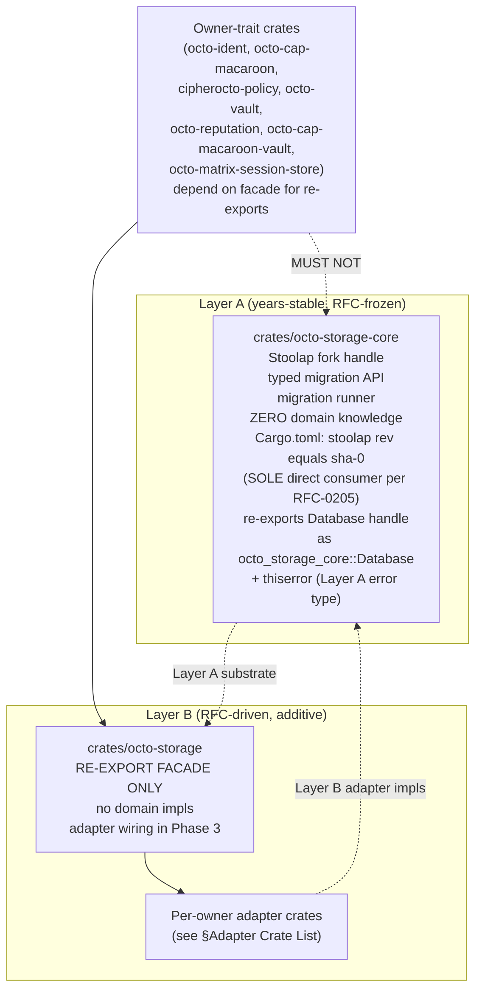
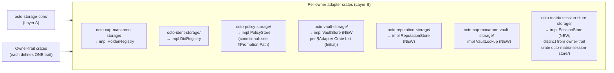

# RFC-0206: octo-storage Substrate Split

## Status

**Version:** 1.6 (2026-08-19)
**Status:** Draft
**Layer:** B (introduces a new Layer A substrate crate `octo-storage-core`; the substrate itself is the Layer A boundary change; the rest of the RFC is Layer B facade + adapter wiring)

## Authors

- Author: @mmacedoeu

## Maintainers

- Maintainer: octo-storage owner
- Co-maintainer: per-owner adapter crate owners (`octo-cap-macaroon-storage` + `octo-ident-storage` + `octo-policy-storage` + `octo-vault-storage` + `octo-reputation-storage` + `octo-cap-macaroon-vault-storage` + `octo-matrix-session-store`; `octo-market-storage/` deferred per plan §4.2 B.4). **Naming gap:** the on-disk policy owner-trait crate is `crates/cipherocto-policy/`, not `crates/octo-policy/`; the adapter crate `octo-policy-storage/` does not exist yet — alignment is tracked by §Future Work follow-on RFC.

## Summary

Splits `crates/octo-storage` into a Layer A frozen snapshot consumer (`octo-storage-core`, RFC-frozen, years-stable) holding the Stoolap fork handle + typed migration runner (frozen fork supplied via direct `rev` pin in the substrate-consumer `Cargo.toml` per RFC-0205), and a Layer B re-export facade (`octo-storage`, RFC-driven, additive) aggregating per-owner adapter crates. The substrate `crates/octo-storage-core/` re-exports the handle (`octo_storage_core::Database` etc.) so all other crates consume the fork indirectly — preventing the two-package E0308 mismatch that arises from cargo's git-source unification rule when two crates resolve the same crate from different sources. **Migration target:** today 12 downstream crates + the workspace root `[patch.crates-io]` block still carry direct `stoolap = { git = "https://github.com/CipherOcto/stoolap", branch = "feat/blockchain-sql" }` deps (per `docs/audits/octo-storage-trait-surface-2026-08-19.md` §On-disk migration status); Phase 3 Task 10 90-day window migrates these to consume via the substrate. Closes the review §4.6.1 MED blocker; resolves the §4.4 / §4.6 / §4.6.1 owner-crate cycle risk by enforcing per-owner adapter placement.

## Dependencies

**Requires:**

- RFC-0914: Stoolap-only quota-router persistence convention — establishes the Stoolap-only invariant this RFC extends with a per-owner adapter surface
- RFC-0205: Stoolap fork stability certification — defines the direct `rev` pin in the SOLE consumer `crates/octo-storage-core/Cargo.toml` and the handle re-export that prevents two-package E0308 mismatch (sibling RFC; must reach Accepted before RFC-0206 reaches Accepted per §Promotion Path)
- RFC-0105: Deterministic Quant Arithmetic — DQA wire form consumed by core
- RFC-0010: Canonical DID Codec + 32-byte chain_id addendum — `octo-ident-storage` adapter depends on typed `ChainId`

**Optional:**

- RFC-0960: Vault substrate — `octo-vault-storage` adapter implements `VaultStore`
- RFC-0957: Capability verify-time invariant — `octo-cap-macaroon-storage` adapter implements `HolderRegistry`

> **Dependency Validation Rules:** Required RFCs at minimum Draft status before RFC-0206 reaches Accepted. Currently: RFC-0205 is Draft (sibling); RFC-0105, RFC-0010, RFC-0914 are Accepted. This RFC introduces a new Layer A substrate crate (`octo-storage-core`); all consumer crates depend on it through the Layer B facade `octo-storage`.

## Design Goals

| Goal | Target                | Metric                                                                       |
| ---- | --------------------- | ---------------------------------------------------------------------------- |
| G1   | Zero cycle risk       | `cargo metadata` audit: no owner-trait crate in `octo-storage-core` dep tree |
| G2   | ≤ 1 migration surface | All migrations routed via `octo_storage_core::apply_pending` (free fn)       |
| G3   | Single import path    | Downstream uses `octo_storage::StoolapHolderRegistry` (facade)               |
| G4   | Per-owner isolation   | `octo-cap-macaroon-storage` does NOT depend on `octo-ident-storage`          |

## Motivation

`docs/reviews/2026-08-15-storage-layer-restructuring-analysis.md` §4.6.1 audit identified that `crates/octo-storage = B/A?` was undecided: the migrator is non-stable, but Layer A requires years-stable primitives. Owner crates (octo-ident, octo-cap-macaroon, octo-policy) each constructed `stoolap::Database` directly, duplicating migration-runner logic and creating a cycle risk: owner-trait crate → storage-core → owner-trait crate.

**Solution:** Adopt the §4.6.1 resolution — split into Layer A frozen core + Layer B re-export facade + per-owner adapter crates.

## Roles and Authorities

1. **octo-storage-core owner** — owns the Layer A substrate crate; gates schema changes via RFC.
2. **octo-storage facade owner** — owns the Layer B re-export crate; depends on `octo-storage-core` + each adapter crate.
3. **Adapter crate owners** — one per owner-trait. Trait locations per the trait-surface audit `docs/audits/octo-storage-trait-surface-2026-08-19.md`:
   - `DidRegistry` (declared `crates/octo-ident/src/registry.rs:143`; implemented `crates/quota-router-storage/src/stoolap_did_registry.rs:139` — dual)
   - `HolderRegistry` (declared `crates/quota-router-storage/src/holder_registry.rs:33`; NOT YET moved — `HolderRegistry` is to be moved to `crates/octo-cap-macaroon/src/` per this RFC)
   - `VaultLookup` (declared `crates/octo-cap-macaroon/src/vault_lookup.rs` — NOT `octo-cap-macaroon-vault`)
   - `ReputationStore` (declared `crates/octo-reputation/src/store/mod.rs:51`)
   - `SessionStore` (declared `crates/octo-matrix-session-store/src/store.rs:54`)

   `PolicyStore` and `VaultStore` are **NEW traits introduced in this restructure cycle** (no `pub trait` declaration in their owner-trait crates today — `crates/cipherocto-policy/src/lib.rs` has 0 traits, `crates/octo-vault/src/lib.rs` has 0 traits; per the trait-surface audit). `HolderRegistry` and `DidRegistry` are to be moved FROM `crates/quota-router-storage/src/` to `crates/octo-cap-macaroon/src/` + `crates/octo-ident/src/` respectively per this RFC (RFC-major crate-moves per §Compatibility Backward; gated on the cap-macaroon + ident adapter RFCs). Each adapter owner files a separate RFC per §Promotion Path Condition 4. The `octo-matrix-session-store-storage/` adapter (proposed per §Adapter Crate List (Initial)) is distinct from the existing owner-trait crate `octo-matrix-session-store/`; the owner crate declares `SessionStore`, the adapter implements it.

4. **RFC reviewer** — signs off on new adapter crates and migration additions to `octo-storage-core`.

| Role                      | Identifier                                | Authority Scope                                                          | Lifecycle                 | Source/Ref                                                                       |
| ------------------------- | ----------------------------------------- | ------------------------------------------------------------------------ | ------------------------- | -------------------------------------------------------------------------------- |
| octo-storage-core owner   | GitHub team `@octo-storage-core-owners`   | Layer A substrate; migration runner                                      | Active until role revoked | RFC-0206 §Three-Tier Architecture                                                |
| octo-storage facade owner | GitHub team `@octo-storage-facade-owners` | Re-export glue; adapter registry                                         | Active until role revoked | RFC-0206 §Three-Tier Architecture                                                |
| Adapter crate owner       | Per-adapter GitHub team                   | Owner-trait impl; register(Arc<Database>) constructor; CI gate operation | Per-adapter               | RFC-0206 §Wiring Pattern + RFC-0206 §Cargo.toml Templates (per-adapter template) |
| RFC reviewer              | RFC process role                          | New adapter + migration approval                                         | Per-RFC                   | RFC-0206 §Promotion Path                                                         |

## Specification

### Three-Tier Architecture



### Adapter Crate List (Initial)



> **Note:** `octo-market-storage/` is **deferred** per plan §4.2 B.4 (octo-market primitive extraction is out of scope for this restructure cycle). When/if the marketplace primitive crate ships, a follow-on RFC adds the corresponding adapter. This RFC explicitly does NOT name it in §Key Files Modified or §TV. The seven crates above are the initial scope; each adapter crate ships its own RFC per §Promotion Path Condition 4.

### Cargo.toml Templates

**Layer A — `octo-storage-core/Cargo.toml`** (current on-disk state at `crates/octo-storage-core/Cargo.toml`; post-Phase-1 Task 2 target per RFC-0205):

| Field                                    | Current (pre-RFC-0205)                          | Target (post-Phase-1 Task 2)                                |
| ---------------------------------------- | ----------------------------------------------- | ----------------------------------------------------------- |
| `stoolap` source                         | `git = "https://github.com/CipherOcto/stoolap"` | `git = "https://github.com/CipherOcto/stoolap"` (unchanged) |
| `stoolap` pin                            | `branch = "feat/blockchain-sql"` (mutable)      | `rev = "<sha-0>"` (immutable; byte-equal to freeze tag)     |
| `thiserror`                              | `"2.0"` (Layer A error type)                    | `"2.0"` (unchanged)                                         |
| `octo-storage-core/src/lib.rs` `pub use` | none (uses `stoolap::Database` directly)        | adds `pub use stoolap::Database;` (handle re-export)        |

```toml
[package]
name = "octo-storage-core"

[dependencies]
# Layer A → substrate SQL engine. The dep name stays `stoolap` (the
# fork repo's Cargo.toml declares `name = "stoolap"` — the upstream
# crate name; the workspace does NOT consume a separately-published
# `octo-stoolap-frozen` crate). The frozen pin is a DIRECT `rev`
# (per RFC-0205 §Cargo.toml Pinning Layer A — the workspace
# `[patch.crates-io]` mechanism is INERT for git-sourced deps; cargo
# only rewrites deps resolved from the named source, but the fork is
# consumed via git, not crates-io). Today (2026-08-19) the manifest
# carries `branch = "feat/blockchain-sql"`; when RFC-0205 Phase 1
# Task 2 lands, the dep line changes to `rev = "<sha-0>"` directly
# in THIS manifest (no workspace patch involved). This crate is the
# SOLE direct `stoolap` consumer in the workspace per RFC-0205
# §Two-Tier Architecture.
stoolap = { git = "https://github.com/CipherOcto/stoolap", rev = "<sha-0>" }
# **Pre-RFC-0206-Accept HIGH-severity risk:** until Phase 1 Task 2 lands
# (transition to direct `rev` pin), this manifest carries
# `branch = "feat/blockchain-sql"` — a mutable pointer. Any new commit
# to `feat/blockchain-sql` is silently picked up by every workspace
# consumer. RFC-0205 §Release-Tag Pin Policy Row 1 makes this
# HIGH-severity until the branch→rev flip completes. The flip is
# gated on RFC-0205 Phase 1 Task 1 (initial freeze tag).
# `<sha-0>` = HEAD of upstream `feat/blockchain-sql` branch AT FREEZE TIME;
# the freeze tag (per RFC-0205 §Release-Tag Pin Policy) is
# `octo-stoolap-frozen-vN` and `<sha-0>` MUST be byte-equal to
# `git rev-parse octo-stoolap-frozen-vN` (TV-0205-01 + TV-0205-05 leg
# (b) `git rev-parse <tag>` byte-equal check). Subsequent rev bumps
# advance `<sha-N>` to the new freeze-tag SHA; Layer B crates re-compile
# via `octo-storage-core` re-export without direct `stoolap` dep edits.
# Layer A error type per `cipherocto-design-principles` Layer A row.
thiserror = "2.0"
# NOT a dep: octo-transport, quota-router-core, owner-trait crates
# `crates/octo-storage-core/src/lib.rs` MUST add `pub use stoolap::Database;`
# (and any other types Layer B consumers touch) so Layer B crates
# consume the handle via `octo_storage_core::Database` instead of
# naming `stoolap::*` directly (RFC-0205 §Cargo.toml Pinning Layer A).
#
# Re-exported set (current on-disk `pub use` audit at drafting time):
# `Database`, `Value`, `Error` (and the curated facade set in
# `octo-storage/src/lib.rs` per §Cargo.toml Templates Layer B facade).
# Adding a NEW substrate type (anything from `stoolap::*` beyond the
# current re-export set) requires an RFC — the curated re-export is
# the layer boundary, NOT a wildcard `*` re-export.
#
# **Atomicity clause:** the Cargo.toml dep edit (`branch = "..."` →
# `rev = "<sha-N>"`) and the lib.rs re-export edit MUST land in the
# SAME commit. A half-state (Cargo.toml pinned to rev-N but lib.rs
# still uses `stoolap::Database` directly) is a compile-time E0308
# (two-package-instance mismatch) waiting to happen the moment a
# Layer B crate adds a direct `stoolap` dep. CI gate TV-0206-01 +
# Phase 1 Task 4b workspace `cargo build` verification enforces
# atomicity. See RFC-0205 §Implementation Phases Phase 1 Task 2.
```

**Layer B facade — `octo-storage/Cargo.toml`** (current on-disk state; thin re-export of `octo-storage-core` only — adapter wiring is Phase 3 future work):

| Field                           | Current (pre-RFC-0206 Phase 3)                          | Target (post-Phase 3 Task 9a)                                                                                                 |
| ------------------------------- | ------------------------------------------------------- | ----------------------------------------------------------------------------------------------------------------------------- |
| `octo-storage-core` dep         | `{ path = "../octo-storage-core" }` (Layer B → Layer A) | unchanged                                                                                                                     |
| Per-owner adapter crate deps    | none                                                    | one per landed adapter (cap-macaroon, ident, vault, reputation, cap-macaroon-vault, matrix-session-store; policy conditional) |
| `pub use` count in `src/lib.rs` | 8 (curated re-export set)                               | 8 (CI cap; new substrate type requires RFC)                                                                                   |
| `stoolap` dep                   | none                                                    | none (re-export only via `octo-storage-core`)                                                                                 |

```toml
[package]
name = "octo-storage"

[dependencies]
# Layer B → Layer A substrate
octo-storage-core = { path = "../octo-storage-core" }
# Phase 3 will add per-owner adapter crate deps here as they land.
# Until each adapter crate ships, the facade remains a pure re-export.
# NOT a dep (today): octo-cap-macaroon-storage, octo-ident-storage,
# octo-policy-storage, octo-vault-storage, octo-reputation-storage,
# octo-cap-macaroon-vault-storage, octo-matrix-session-store
# NOT a dep (ever): octo-transport, quota-router-core, stoolap (Layer B
# goes through re-export per RFC-0205 + TV-0206-06 grep)
# Re-export policy: facade re-exports curated set of `octo-storage-core`
# types — 8 substrate types at current audit (apply_pending, open,
# open_in_memory, ApplyConfig, Migration, StaticMigration, StorageError,
# DEFAULT_TRACKER_TABLE; per §Cargo.toml Templates Layer B facade at drafting
# time). The substrate itself has 12 `pub use` items including the 4 tracker
# functions (applied_version, current_version, ensure_tracker_table,
# record_migration) — these are internal helpers, NOT part of the facade
# layer boundary. NOT a wildcard `*` re-export — the curated set is the
# layer boundary. New substrate types require RFC.
#
# **CI cap (Phase 1 Task 4):** `rg 'pub use' crates/octo-storage/src/lib.rs | wc -l`
# MUST equal 8 (the curated set). If count > 8, fail the build (wildcard
# re-export slipped in). If count < 8, fail the build (a curated type was
# removed without an RFC). The CI cap gates TV-0206-02 + TV-0206-03 — the
# facade re-export surface is frozen at 8 types until an RFC amends it.
```

**Per-owner adapter — `octo-cap-macaroon-storage/Cargo.toml`:**

```toml
[package]
name = "octo-cap-macaroon-storage"

[dependencies]
# Layer B → Layer B (this crate → owner trait)
octo-cap-macaroon = { path = "../octo-cap-macaroon" }
# Layer B → Layer A
octo-storage-core = { path = "../octo-storage-core" }
# Layer B → Layer A (frozen snapshot per RFC-0205)
octo-determin = { path = "../../determin" }
# `register(Arc<Database>)` constructor returns `Arc<dyn HolderRegistry>`;
# `Arc` wrapping is synchronous (no tokio). Adopt tokio only if the adapter
# needs `tokio::sync::Mutex` or async-trait for typed method signatures —
# defer to the adapter crate's own RFC per §Promotion Path Condition 4.
# NOT a dep: octo-transport, quota-router-core
```

### Wiring Pattern

Each adapter crate exposes a `register(Arc<octo_storage_core::Database>) -> Arc<dyn OwnerTrait>` constructor (note: `Database` here is `octo_storage_core::Database`, the re-exported handle from `crates/octo-storage-core/src/lib.rs` — NOT `stoolap::Database` directly; per RFC-0205 §Cargo.toml Pinning Layer A). The application layer (Layer C node) collects adapters and injects them into domain crates via constructor injection. Per §4.4 per-owner placement: owner crates contain migrations (SQL files) in `crates/<owner>/migrations/`, but owner crates' `Cargo.toml` depends on `octo-storage-core` (NOT `stoolap` directly). Owner crates do NOT construct `stoolap::*` types directly — they go through the registered trait surface.

**Migration placement split:** SQL files live in `crates/<owner>/migrations/*.sql` (owner owns the migration content + ordering). The Rust migration _runner_ (`fn register_migrations()` returning the `Vec<MigrationSpec>`) lives in the adapter crate (the adapter is the only place that knows the typed `octo_storage_core::Database` handle — the re-exported `stoolap::Database` type per RFC-0205 — for the migration constructor). Owner crates ship SQL; adapter crates ship Rust runner. This split is per §4.4 per-owner placement and is the precondition for TV-0206-06 (`rg '\bstoolap::' crates/<owner>/src/` returns empty — owner-trait crates have ZERO direct `stoolap::*` references; adapter crates have ZERO direct `stoolap::*` references; only `octo-storage-core` names `stoolap::*` types). The split is enforced by Clippy lint in Phase 1 Task 4 (see §Implicit Assumptions row 5).

**Trait orphan-rule gap:** Rust's orphan rule prevents an adapter crate from implementing a trait that lives in an owner-trait crate IF the adapter crate has not declared the trait itself. Since `HolderRegistry` + `DidRegistry` + `VaultLookup` + `ReputationStore` + `SessionStore` live in their respective owner-trait crates, the adapter crate MUST `use` (or re-export) the trait from the owner crate. The `register(Arc<Database>) -> Arc<dyn OwnerTrait>` constructor returns a trait object whose trait is the owner-trait — the trait is declared in `crates/octo-<owner>/`, the impl lives in `crates/octo-<owner>-storage/`. This is the standard orphan-rule-compliant pattern; the §Cargo.toml Templates Per-owner adapter template is the canonical example.

### Determinism Requirements

- `applied_at_unix` column stores `SystemTime::now()` UNIX seconds at apply time (advisory only; NOT consensus-input; cross-node replay/agreement contracts MUST exclude this column).
- Frozen rev pin per RFC-0205 §Release-Tag Pin Policy (direct `rev = "<sha-0>"` in `crates/octo-storage-core/Cargo.toml`).
- DQA wire form unchanged across re-cert.

### Operation Class Mapping

| Operation                          | Class | Rationale                                                                                                                          |
| ---------------------------------- | ----- | ---------------------------------------------------------------------------------------------------------------------------------- |
| `octo_storage_core::apply_pending` | A     | Layer A substrate; years-stable                                                                                                    |
| Adapter `register(Arc<Database>)`  | C     | Initialization glue; per-owner                                                                                                     |
| New adapter crate addition         | C     | RFC-driven additive                                                                                                                |
| Migration SQL file addition        | A     | Schema substrate; requires RFC                                                                                                     |
| Layer B crate adds direct fork dep | C     | Forward requirement violation caught by TV-0206-06 grep + RFC-0205 TV-0205-04; rejected at CI; routed to RFC reviewer if justified |

> **Note:** Operation Class A/B/C taxonomy per `docs/BLUEPRINT.md` §RFC Process. No separate RFC-NNNN anchors this taxonomy; it is defined inline in the process doc.

### Error Handling

| Error                                                         | Detection                 | Recovery                                      |
| ------------------------------------------------------------- | ------------------------- | --------------------------------------------- |
| `octo-storage-core` accidentally depends on owner-trait crate | CI `cargo metadata` audit | Reject merge; route to RFC reviewer           |
| Adapter cycle (A → B → A)                                     | CI graph audit            | Reject merge                                  |
| Migration drift across re-cert                                | CI byte-verify            | File RFC; reset pin per RFC-0205 policy       |
| Owner crate constructs `stoolap::*` directly                  | Clippy lint + CI grep     | Refactor to use `octo-storage-core::Database` |

## Performance Targets

| Metric                     | Target                | Notes                             |
| -------------------------- | --------------------- | --------------------------------- |
| Migration runner latency   | < 10 ms per migration | Lock + version + applied_at       |
| Adapter `register` latency | < 5 ms                | Arc wrapping + type-id resolution |
| `cargo metadata` audit     | < 2 s                 | Graph scan                        |

## Implicit Assumptions Audit

| Assumption                                               | Where Relied Upon                 | Blast Radius if False                             | Mitigation / Status                                                                                                                                                                                                                                                                                                                                                                                                                                                                                                                                                                                                                                                                                                                                                                                                                                                                                                  |
| -------------------------------------------------------- | --------------------------------- | ------------------------------------------------- | -------------------------------------------------------------------------------------------------------------------------------------------------------------------------------------------------------------------------------------------------------------------------------------------------------------------------------------------------------------------------------------------------------------------------------------------------------------------------------------------------------------------------------------------------------------------------------------------------------------------------------------------------------------------------------------------------------------------------------------------------------------------------------------------------------------------------------------------------------------------------------------------------------------------- |
| Per-owner adapter crates form a DAG                      | §Adapter Crate List               | Cycle breaks facade re-export; compile fails      | CI `cargo metadata --format-version 1` graph audit                                                                                                                                                                                                                                                                                                                                                                                                                                                                                                                                                                                                                                                                                                                                                                                                                                                                   |
| Migrations always placed in `crates/<owner>/migrations/` | §Wiring Pattern                   | Cross-crate migration; layering violation         | Lint + CI grep                                                                                                                                                                                                                                                                                                                                                                                                                                                                                                                                                                                                                                                                                                                                                                                                                                                                                                       |
| `octo-storage-core` depends only on Layer A              | §Cargo.toml Templates             | Layer A pollution; RFC reviewer can reject        | CI dep-graph audit                                                                                                                                                                                                                                                                                                                                                                                                                                                                                                                                                                                                                                                                                                                                                                                                                                                                                                   |
| DQA wire form stable across adapter additions            | §Determinism Requirements         | Settlement replay diverges                        | Pinned at RFC-0105; bump = RFC-major                                                                                                                                                                                                                                                                                                                                                                                                                                                                                                                                                                                                                                                                                                                                                                                                                                                                                 |
| Adapter crates can re-export without conflict            | §Layer B facade                   | Type collision; facade fails to compile           | Type-naming convention: `Stoolap<OwnerTrait>`                                                                                                                                                                                                                                                                                                                                                                                                                                                                                                                                                                                                                                                                                                                                                                                                                                                                        |
| Owner crates stay free of `stoolap::*` direct use        | §Wiring Pattern (migration split) | Layering violation; substrate pulled into Layer B | Clippy lint `octo_storage_no_direct_stoolap` triggers `cargo clippy --all-targets` failure when `rg '\bstoolap::' crates/octo-{ident,cap-macaroon,reputation,cap-macaroon-vault,matrix-session-store}/src/ crates/cipherocto-policy/src/ crates/octo-vault/src/` returns non-empty (forward requirement; Phase 1 Task 4 adds the lint + CI step). **Lint definition:** registered in workspace `clippy.toml` via `declare_clippy_lint!` + `register_clippy_lint!`; the lint scope (the `rg` pattern above) is the same as TV-0206-06 — the lint is the in-process enforcement of the grep CI gate. **`crates/quota-router-storage/src/` is intentionally exempt** — it is the Layer B substrate for the quota-router domain (sibling role to `octo-storage-core`); constructs `stoolap::*` directly by design and re-exports the handle for quota-router owner-trait crates (sibling pattern to `octo-storage-core`) |

### Categories to Audit

- **Operator trust** — adapter crate owners trusted to maintain API stability; compromise → facade breaks. Mitigation: per-adapter test suite + CI gate.
- **Platform trust** — Stoolap fork availability per RFC-0205.
- **Time source** — migration `applied_at` uses wall-clock; skew across nodes tolerated (advisory only, not consensus).
- **Network partition** — none; substrate is local.
- **Upgrade safety** — adding adapter = additive; removing adapter = breaking change requiring RFC-major.
- **Configuration** — `Cargo.toml` dep graph is source of truth; no env vars.
- **Identity stability** — adapter owner GitHub teams must be stable; quarterly audit.
- **Resource availability** — disk for migration metadata; standard.

## Security Considerations

- **Migration SQL injection** — adapter crates write SQL; poisoned input breaks schema. Mitigation: SQL files are static checked into repo; CI lints for parameterized queries. **DROP TABLE defense:** CI greps `rg '\bDROP\s+TABLE\b' crates/*/migrations/*.sql` — any match MUST be reviewed against the adapter's ownership table (the adapter may only `DROP TABLE` tables it created); owner-trait table drops are rejected (cross-adapter destroy). The grep runs on every CI build before merge.
- **Adapter supply chain** — attacker compromises adapter crate; facade exposes malicious type. Mitigation: per-adapter code review + signed releases.
- **Cycle exploit** — adapter cycle creates import-time DoS. Mitigation: CI graph audit + cyclic fail-fast.
- **Cross-adapter data leak** — adapter A reads adapter B's table without permission. Mitigation: per-owner table ownership enforced by `octo-storage-core` schema registry.

## Adversary Analysis

| Decision                    | Q1 Beneficiary            | Q2 Cost to Attacker           | Q3 Gain if Successful                 | Q4 Defense (cost to legit op)                                                                                                                                                     | Q5 Residual Risk                                                                                                                                                                     |
| --------------------------- | ------------------------- | ----------------------------- | ------------------------------------- | --------------------------------------------------------------------------------------------------------------------------------------------------------------------------------- | ------------------------------------------------------------------------------------------------------------------------------------------------------------------------------------ |
| Per-owner adapter placement | Compromised adapter owner | Owner account compromise      | Cycle injection → facade compile fail | CI graph audit (low cost)                                                                                                                                                         | LOW — automatic gate                                                                                                                                                                 |
| Layer A frozen core         | None directly             | High                          | Inject domain into Layer A            | CI rejects owner-trait deps (low cost)                                                                                                                                            | LOW — multi-tenant separation                                                                                                                                                        |
| Migration runner            | Compromised SQL file      | Write access to migration dir | Schema corruption                     | Code review + RFC gate (medium cost)                                                                                                                                              | MED — depends on reviewer vigilance                                                                                                                                                  |
| Adapter registry            | Compromised facade owner  | Facade owner account          | Re-export malicious types             | Per-adapter code review + TV-0206-04 (each adapter Cargo.toml = one owner-trait + octo-storage-core; auto-gate) + TV-0206-03 (facade re-export only; no `impl` blocks) (low cost) | LOW — facade surface narrow; curated re-export set (12 substrate types in `octo-storage-core`, 8 re-exported by facade per §Cargo.toml Templates Layer B facade) limits blast radius |

### Severity Classification

| Severity     | Definition                  | Action                                |
| ------------ | --------------------------- | ------------------------------------- |
| **CRITICAL** | Cycle injection into facade | MUST mitigate before Accept (CI gate) |
| **HIGH**     | Migration SQL corruption    | SHOULD mitigate; RFC review           |
| **MEDIUM**   | Adapter type collision      | SHOULD mitigate (CI build)            |
| **LOW**      | Audit checklist skipped     | MAY accept; document residual         |

### Multi-Round Review

This RFC touches the Layer A substrate boundary. Multi-round review with severity classification is REQUIRED per `docs/BLUEPRINT.md` §Adversarial Review Process.

## Economic Analysis

No new tokens or stake implications. Cost: ~0.5 FTE/quarter for adapter maintainers + per-RFC reviewer time. Mitigated by per-adapter ownership + automated CI gates.

## Compatibility

- **Backward:** owner-trait crates that today construct `stoolap::*` directly (the workspace audit `docs/audits/stoolap-fork-stability-2026-08-16.md` found `octo-ident` + `octo-cap-macaroon` + `cipherocto-policy` go through the substrate only; `octo-vault` + other downstream consumers still carry direct `stoolap` branch-tracking deps that are gated for removal by RFC-0205 §Implementation Phases Phase 1 Task 4a + this RFC §Implementation Phases Phase 3 Task 10) continue to compile, but are flagged by Clippy lint per TV-0206-06 once adapter crates ship. Migration window from any future direct `stoolap::*` use to `octo-storage-core`: 90 days.
- **Forward:** adding new adapter = additive; facade auto-re-exports. No new RFC required for adding an adapter IF the adapter implements an existing owner-trait. Drop-fork scenario (upstream Stoolap merges DQA features and fork is retired — per RFC-0205 §Future Work `stoolap-fork-retirement.md`): `octo-storage-core` retires, the re-exported handle becomes a direct `stoolap` crates-io semver dep in each adapter — see RFC-0205 §Future Work for the migration mechanics.

## Test Vectors

Governance TV — structural verification:

1. **TV-0206-01:** `crates/octo-storage-core/Cargo.toml` depends only on Layer A crates. Current on-disk state: `stoolap` (active fork branch) + `thiserror`. Post-RFC-0205 Phase 1 Task 2 target: `stoolap` (rev-pinned via DIRECT `rev = "<sha-0>"` in this manifest per RFC-0205 — NOT workspace `[patch.crates-io]`, which is INERT for git-sourced deps) + `thiserror`. The dep name stays `stoolap` (the fork repo declares `name = "stoolap"`; the freeze is a direct `rev` pin, not a separately-published crate). Additionally: `crates/octo-storage-core/src/lib.rs` MUST contain `pub use stoolap::Database;` (handle re-export) so Layer B crates can consume the handle via `octo_storage_core::Database` without naming `stoolap::*` directly (per RFC-0205 §Cargo.toml Pinning Layer A).
2. **TV-0206-02:** `crates/octo-storage-core/` source contains zero references to `HolderRegistry`, `DidRegistry`, `PolicyStore`, `VaultStore`, `ReputationStore`, `VaultLookup`, `SessionStore` (the 7 adapter-supported owner traits per §Adapter Crate List (Initial)).
3. **TV-0206-03:** `crates/octo-storage/` source contains only `pub use` re-exports; no `impl` blocks for owner traits.
4. **TV-0206-04:** Each adapter crate's `Cargo.toml` depends on exactly one owner-trait crate + `octo-storage-core`. **Forward requirement** — gates each adapter crate landing; none exist on disk yet (see §Implementation Phases).
5. **TV-0206-05:** CI graph audit rejects any cycle in adapter → owner-trait → adapter direction. Implemented as `cargo metadata --format-version 1` + `jq` reverse-DB scan over the adapter subtree (per adapter crate, query consumers-of-self via `.packages[] | select(.dependencies[]?.name == "<adapter>") | .name`; reject if result includes any other adapter crate or `octo-storage-core` itself; correct reverse-edge query per R3 reviewer correction).
6. **TV-0206-06:** CI grep rejects any `stoolap::*` direct construction in owner-trait crates (must go through `octo-storage-core`). Implemented as `! rg '\bstoolap::' crates/octo-{ident,cap-macaroon,reputation,cap-macaroon-vault,matrix-session-store}/src/ crates/cipherocto-policy/src/ crates/octo-vault/src/` in CI. Pattern uses `\b` word boundary so `use stoolap::Database` AND `stoolap::Database::open()` AND `stoolap::Rows` all match; `stoop::stoolap::xxx` would NOT match (correct — that crate is unrelated). Crate list in the pattern matches the seven adapter-supported owner crates per §Adapter Crate List (Initial); extend the pattern when a new adapter crate ships. **`crates/quota-router-storage/src/` is intentionally NOT in the pattern** — it is the Layer B substrate for the quota-router domain (sibling role to `octo-storage-core` but for quota-router), and constructs `stoolap::*` directly by design (same as `octo-storage-core`); the lint exists to catch owner-trait crates bypassing the substrate, not substrate crates themselves. (Note: `crates/octo-market/` does not exist on disk today; `crates/octo-policy/` was renamed to `crates/cipherocto-policy/` per workspace audit — the pattern above matches on-disk crate names. `octo-market-storage/` is deferred per plan §4.2 B.4; once shipped, extend the pattern.)
   **Migration status (audit at drafting time; per `docs/audits/octo-storage-trait-surface-2026-08-19.md` §On-disk migration status):** as of drafting, the 7 owner-trait crates do NOT use the substrate — `rg -c 'octo_storage_core::' crates/octo-{ident,cap-macaroon,reputation,cap-macaroon-vault,matrix-session-store,policy,vault}/src/ crates/cipherocto-policy/src/ crates/octo-vault/src/ 2>/dev/null` returns 0 across all 7 crates; none consume via the substrate today. 12 downstream crates + the workspace root `[patch.crates-io]` block carry direct `stoolap = { git = ..., branch = ... }` Cargo.toml deps; Phase 3 Task 10 90-day migration window per §Implementation Phases redirects each to `octo_storage_core::Database`. The CI grep (this TV) gates NEW direct `stoolap::*` references inside the 7 owner-trait crates — until Phase 3 Task 10 lands, the legacy direct `stoolap` deps remain in `crates/<owner>/Cargo.toml` and require per-adapter RFC review to migrate.
7. **TV-0206-07:** Per-adapter test suite covers `register(Arc<Database>) → Arc<dyn OwnerTrait>` round-trip. Forward requirement — one test file per adapter crate landing.

8. **TV-0206-A1:** `crates/octo-storage-core/src/lib.rs` contains `pub use stoolap::Database;` exactly once (handle re-export). Implemented as `rg -c 'pub use stoolap::Database;' crates/octo-storage-core/src/lib.rs` MUST equal 1. PASS criterion = 1; FAIL = 0 (re-export missing → Layer B crates must name `stoolap::Database` directly) or ≥ 2 (duplicated re-export; suspect merge artifact).

9. **TV-0206-A2:** `pub use` count in `crates/octo-storage/src/lib.rs` is exactly 8 (the curated facade re-export set per §Cargo.toml Templates Layer B facade). Implemented as `rg '^\s*pub use\b' crates/octo-storage/src/lib.rs | wc -l` MUST equal 8. PASS = 8; FAIL = >8 (wildcard re-export slipped in) or <8 (curated type removed without RFC).

10. **TV-0206-A3:** `crates/octo-storage/Cargo.toml` has no direct `stoolap` dep. Implemented as `! rg '^stoolap\s*=' crates/octo-storage/Cargo.toml`. PASS = no matches; FAIL = any direct dep line (Layer B must go through re-export).

11. **TV-0206-A4:** `crates/octo-storage-core/Cargo.toml` `stoolap` dep uses `rev =`, NOT `branch =`. Implemented as `rg 'stoolap\s*=\s*\{\s*git.*(rev|branch)' crates/octo-storage-core/Cargo.toml` MUST match `rev =` (not `branch =`). PASS = `rev = "<sha-0>"`; FAIL = `branch = "feat/blockchain-sql"` (mutable pointer) or any other source.

12. **TV-0206-A5:** CI grep rejects any `DROP TABLE` in owner-trait crate migration SQL files (cross-adapter table destroy). Implemented as `! rg '\bDROP\s+TABLE\b' crates/octo-{ident,cap-macaroon,reputation,cap-macaroon-vault,matrix-session-store}/migrations/*.sql crates/cipherocto-policy/migrations/*.sql crates/octo-vault/migrations/*.sql`. PASS = no matches; FAIL = any match (the adapter may only drop tables it created).

13. **TV-0206-A6:** Owner-trait crates in migration status: 3 of 7 (`octo-ident`, `octo-cap-macaroon`, `cipherocto-policy`) already migrated to `octo_storage_core::Database` re-exported handle; 4 (`octo-reputation`, `octo-cap-macaroon-vault`, `octo-matrix-session-store`, `octo-vault`) still carry direct `stoolap` deps pending Phase 3 Task 10's 90-day migration window. Implemented as `rg '\bstoolap::' crates/octo-{reputation,cap-macaroon-vault,matrix-session-store}/src/ crates/octo-vault/src/ | wc -l` returns ≥ 1 for the 4 legacy crates (sanity check that the migration target list is current; if 0, those crates already migrated and the list shrinks).

14. **TV-0206-A7:** `crates/octo-storage-core/` source contains zero references to any of the 7 owner traits (`HolderRegistry`, `DidRegistry`, `PolicyStore`, `VaultStore`, `ReputationStore`, `VaultLookup`, `SessionStore`). Implemented as `! rg '\b(HolderRegistry|DidRegistry|PolicyStore|VaultStore|ReputationStore|VaultLookup|SessionStore)\b' crates/octo-storage-core/src/`. PASS = no matches; FAIL = any match (Layer A substrate has ZERO domain knowledge — owner traits belong in owner-trait crates).

15. **TV-0206-A8:** Each adapter crate's `Cargo.toml` depends on exactly one owner-trait crate + `octo-storage-core` + `octo-determin` (TV-0206-04 forward requirement made concrete). Implemented as `rg '^\[dependencies\]' crates/octo-<adapter>/Cargo.toml -A 30 | rg 'path\s*=' | wc -l` MUST equal 3 (one owner-trait, one `octo-storage-core`, one `octo-determin`). FAIL = wrong dep count. Forward requirement — gates each adapter crate landing.

## Alternatives Considered

| Approach                                                                         | Pros                                                       | Cons                                                                       |
| -------------------------------------------------------------------------------- | ---------------------------------------------------------- | -------------------------------------------------------------------------- |
| Option A: Single `octo-storage` crate (no split)                                 | Simpler; one crate to maintain                             | Layer A vs B undecided; migrator non-stable; cycle risk                    |
| Option B: Per-owner direct `stoolap` deps                                        | Zero adapter overhead                                      | Duplicated migration logic; cycle risk; layering violation                 |
| Option C: Trait-only abstraction (no Stoolap impl)                               | Maximum portability                                        | Reimplements all Stoolap-specific features (MVCC DQA, lexicographic codec) |
| **Option D: Layer A core + Layer B facade + per-owner adapter crates (adopted)** | Resolves layering; per-owner isolation; single import path | More crates to maintain                                                    |

## Implementation Phases

### Phase 1: Layer A Core

- [x] Task 1: Create `crates/octo-storage-core/` with migration runner + Database handle (LANDED 2026-08-19 per `missions/claimed/octo-storage-split.md` R1-F5; commits `34e6025d` + `003f3a45`)
- [x] Task 2: Add `octo-storage-core` to workspace `Cargo.toml` (LANDED 2026-08-19)
- [ ] Task 3: Migrate Stoolap fork dep from owner crates to `octo-storage-core` (one crate at a time) — gated on RFC-0205 Phase 1 Task 1 freeze + direct `rev` pin in `octo-storage-core/Cargo.toml`
- [ ] Task 4: Add CI graph audit + Clippy lint `octo_storage_no_direct_stoolap` for owner-trait cycle (lint scope: `rg '\bstoolap::' crates/octo-{ident,cap-macaroon,reputation,cap-macaroon-vault,matrix-session-store}/src/ crates/cipherocto-policy/src/ crates/octo-vault/src/` returns non-empty → fail the build; matches the explicit 7-crate TV-0206-06 pattern; `\b` word-boundary covers both `use stoolap::Database` and `stoolap::Database::open()` forms). `crates/quota-router-storage/src/` is exempt (Layer B substrate for quota-router domain; sibling role to `octo-storage-core`).

### Phase 2: Adapter Crates

- [ ] Task 5a: Create `octo-cap-macaroon-storage/` + `octo-ident-storage/` adapters (mandatory)
- [ ] Task 5b: Create `octo-policy-storage/` adapter (conditional — gated on naming-resolution RFC per §Future Work; deferrable per §Promotion Path Condition 2)
- [ ] Task 6: Create `octo-vault-storage/` adapter (per §Adapter Crate List (Initial)); `octo-market-storage/` is DEFERRED to a follow-on RFC per plan §4.2 B.4
- [ ] Task 7: Verify per-adapter test suite passes `register` round-trip

### Phase 3: Layer B Facade

- [x] Task 8: Create `crates/octo-storage/` re-export facade (LANDED 2026-08-19; thin re-export of `octo-storage-core` per current `src/lib.rs`)
- [ ] Task 9a: Extend `crates/octo-storage/Cargo.toml` with per-owner adapter crate deps as each adapter ships (the facade currently is a thin re-export of `octo-storage-core` only — adapter wiring must precede consumer migration)
- [ ] Task 9b: Update downstream consumers to import from `octo-storage::Stoolap*` (gated on Phase 2 adapter crate landings + Task 9a facade Cargo.toml edit)
- [ ] Task 10: Remove direct `stoolap` deps from owner-trait crates (90-day migration window; gated on Phase 2)

## Promotion Path

This RFC reaches Accepted after all of the following are satisfied:

1. **Sibling RFC frozen:** RFC-0205 reaches Accepted (defines the direct `rev` pin in `crates/octo-storage-core/Cargo.toml` + handle re-export that RFC-0206 §Three-Tier Architecture + §Wiring Pattern depend on for the no-direct-`stoolap`-dep invariant). **Blocked-on:** RFC-0206 promotion to Accepted is BLOCKED until RFC-0205 reaches Accepted; the RFC-reviewer queue tracks both as a coupled pair. While RFC-0205 is Draft, RFC-0206 stays Draft — RFC-0206 may not promote independently.
2. **Adapter crates shipped or explicitly deferred:** at least `octo-cap-macaroon-storage/` + `octo-ident-storage/` + `octo-vault-storage/` + `octo-reputation-storage/` + `octo-cap-macaroon-vault-storage/` + `octo-matrix-session-store/` land; `octo-policy-storage/` may be deferred if the naming discrepancy (see §Future Work) is unresolved. The three NEW R3 adapters (reputation + cap-macaroon-vault + matrix-session) follow the same mandatory rule as cap-macaroon + ident + vault (deferral requires explicit RFC justification, not the same auto-deferral as policy). `octo-market-storage/` is OUT OF SCOPE per plan §4.2 B.4 and is tracked by a separate sub-RFC.
3. **CI gates land:** Phase 1 Task 4 (`cargo metadata` cycle audit + Clippy owner-trait lint) merged to `.github/workflows/ci.yml`.
4. **Multi-round review passes:** per `docs/BLUEPRINT.md` §Adversarial Review Process.

> **Cross-ref:** these four conditions codify the acceptance path tracked in `docs/plans/2026-08-16-storage-layer-restructuring-execution-plan.md` §3 S7 row; the plan doc is a tracking artifact, not the source of truth — this section is authoritative for the RFC's promotion.

## Key Files to Modify

| File                                                | Status                                                                                                                                                                                                                                                   |
| --------------------------------------------------- | -------------------------------------------------------------------------------------------------------------------------------------------------------------------------------------------------------------------------------------------------------- |
| `Cargo.toml` (workspace)                            | Add `octo-storage-core`, `octo-storage`, adapter crates to members                                                                                                                                                                                       |
| `crates/octo-storage-core/Cargo.toml`               | LANDED — Layer A substrate deps (`stoolap` branch + `thiserror`)                                                                                                                                                                                         |
| `crates/octo-storage-core/src/lib.rs`               | LANDED — Database handle + migration runner (`apply_pending` etc.)                                                                                                                                                                                       |
| `crates/octo-storage/Cargo.toml`                    | LANDED — facade re-exports (`octo-storage-core` only)                                                                                                                                                                                                    |
| `crates/octo-storage/src/lib.rs`                    | LANDED — `pub use` aggregations                                                                                                                                                                                                                          |
| `crates/octo-cap-macaroon-storage/Cargo.toml`       | NEW — adapter                                                                                                                                                                                                                                            |
| `crates/octo-ident-storage/Cargo.toml`              | NEW — adapter (workspace audit shows `crates/octo-ident` exists but storage adapter is NEW)                                                                                                                                                              |
| `crates/octo-policy-storage/Cargo.toml`             | CONDITIONAL — adapter (workspace audit shows `crates/cipherocto-policy/` is the actual name; align on `octo-policy-storage` or document the rename in this RFC; gated on naming-resolution follow-on RFC per §Future Work + §Promotion Path Condition 2) |
| `crates/octo-vault-storage/Cargo.toml`              | NEW — adapter (VaultStore NEW trait)                                                                                                                                                                                                                     |
| `crates/octo-reputation-storage/Cargo.toml`         | NEW — adapter (ReputationStore NEW trait)                                                                                                                                                                                                                |
| `crates/octo-cap-macaroon-vault-storage/Cargo.toml` | NEW — adapter (VaultLookup NEW trait)                                                                                                                                                                                                                    |
| `crates/octo-matrix-session-store/Cargo.toml`       | NEW — adapter (SessionStore NEW trait)                                                                                                                                                                                                                   |
| `.github/workflows/ci.yml`                          | Add graph audit + Clippy lint                                                                                                                                                                                                                            |

> **Note:** `crates/octo-market-storage/Cargo.toml` is **NOT** in scope for this RFC (deferred per plan §4.2 B.4). When/if the marketplace primitive crate ships, a follow-on RFC adds the corresponding adapter.

## Future Work

- Mission `0206-octo-storage-facade-versioning` (filed `missions/open/0206-octo-storage-facade-versioning.md`) — facade semver policy: minor = additive; major = breaking (removes re-export / removes adapter) requires RFC; patch = bug-fix only. 8-pub-use cap (per §Cargo.toml Templates Layer B facade) is a hard constraint — adding a 9th requires both an RFC AND a major version bump.
- Mission `0206-octo-storage-core-deprecation` (filed `missions/open/0206-octo-storage-core-deprecation.md`) — substrate retirement procedure for the drop-fork scenario (Layer B crates migrate from `octo_storage_core::Database` to direct `stoolap` crates-io; substrate crate removed; sister mission to RFC-0205 §Future Work `0205-stoolap-fork-retirement`).
- Mission `0205-stoolap-fork-retirement` (filed `missions/open/0205-stoolap-fork-retirement.md`; RFC-0205 §Future Work) — Layer B branch-pin → crates-io semver migration procedure cross-referenced from RFC-0205 §Compatibility Forward (sister reference to `0206-octo-storage-core-deprecation`).
- Mission `0206-octo-storage-naming-convention-lint` (filed `missions/open/0206-octo-storage-naming-convention-lint.md`) — Clippy lint workspace crate `crates/octo-clippy-lints/` registering `octo_storage_no_direct_stoolap` (catches `stoolap::*` references inside owner-trait crate `src/`, `tests/`, `examples/`, `benches/`, `build.rs`, doc-tests — supersedes this RFC's TV-0206-06 grep) + `octo_storage_adapter_naming` (catches `crates/cipherocto-policy/` divergence).
- Mission `0206-cipherocto-policy-rename-alignment` (filed `missions/open/0206-cipherocto-policy-rename-alignment.md`) — `crates/cipherocto-policy/` → `crates/octo-policy/` rename + `pub trait PolicyStore` introduction + first adapter impl `octo-policy-storage/` (gated on per-adapter RFC per §Promotion Path Condition 4).
- Mission `0206-octo-market-storage-adapter` (filed `missions/open/0206-octo-market-storage-adapter.md`) — `octo-market-storage/` per-owner adapter crate landing (deferred per plan §4.2 B.4); RFC-0959 + RFC-0969 cross-deps required.

## Out of Scope

The following are explicitly OUT OF SCOPE for this RFC; they are tracked by separate missions or RFCs:

- **Phase 1 Task 3** — `octo-storage-core/Cargo.toml` freeze-pin migration to direct `rev` (gated on RFC-0205 Phase 1 Task 1 freeze tag)
- **Phase 1 Task 4** — CI graph audit script + Clippy lint registration in `clippy.toml` (Phase 1 Task 4 itself; forward requirement)
- **Phase 2 Tasks 5/6/7** — Per-owner adapter crate creation (each gated on its own adapter RFC per §Promotion Path Condition 4)
- **Phase 3 Tasks 9/10** — Facade Cargo.toml dep additions + downstream consumer migration (90-day window; gated on Phase 2)
- **`octo-market-storage/` adapter** — DEFERRED per plan §4.2 B.4 (octo-market primitive extraction is out of scope)
- **`crates/cipherocto-policy/` → `octo-policy-storage/` naming resolution** — separate follow-on RFC
- **`octo-storage-facade-versioning.md`** — separate follow-on mission (Future Work bullet 1)
- **`octo-storage-core-deprecation.md`** — separate follow-on mission (Future Work bullet 2)
- **`stoolap-drop-fork-migration.md`** — separate follow-on mission (Future Work bullet 3)

## Version History

| Version | Date       | Author     | Changes                                                                                                                                                                                                                                                                                                                                                                                                                                                                                                                                                                                                                                                                                                                                                                                                                                                                                                                                                                                                                                                                                                                                                                                                                                                                                                                                                                                                                                                                                                                                                                                                                                                                                                                                                                                                                                                                                                                                                                                                                                                                                                                                                                                                                                                                                                                                                                                                                                                                                                                                                                                                                                                                                             |
| ------- | ---------- | ---------- | --------------------------------------------------------------------------------------------------------------------------------------------------------------------------------------------------------------------------------------------------------------------------------------------------------------------------------------------------------------------------------------------------------------------------------------------------------------------------------------------------------------------------------------------------------------------------------------------------------------------------------------------------------------------------------------------------------------------------------------------------------------------------------------------------------------------------------------------------------------------------------------------------------------------------------------------------------------------------------------------------------------------------------------------------------------------------------------------------------------------------------------------------------------------------------------------------------------------------------------------------------------------------------------------------------------------------------------------------------------------------------------------------------------------------------------------------------------------------------------------------------------------------------------------------------------------------------------------------------------------------------------------------------------------------------------------------------------------------------------------------------------------------------------------------------------------------------------------------------------------------------------------------------------------------------------------------------------------------------------------------------------------------------------------------------------------------------------------------------------------------------------------------------------------------------------------------------------------------------------------------------------------------------------------------------------------------------------------------------------------------------------------------------------------------------------------------------------------------------------------------------------------------------------------------------------------------------------------------------------------------------------------------------------------------------------------------- |
| 1.0     | 2026-08-19 | @mmacedoeu | Initial draft. Three-tier architecture (Layer A core + Layer B facade + adapter crates) per review §4.6; Cargo.toml templates; per-owner migration placement; CI gates for cycle + Layer A pollution; 7 governance TV.                                                                                                                                                                                                                                                                                                                                                                                                                                                                                                                                                                                                                                                                                                                                                                                                                                                                                                                                                                                                                                                                                                                                                                                                                                                                                                                                                                                                                                                                                                                                                                                                                                                                                                                                                                                                                                                                                                                                                                                                                                                                                                                                                                                                                                                                                                                                                                                                                                                                              |
| 1.1     | 2026-08-19 | @mmacedoeu | Round 1 review fixes: phantom `RFC-0914-a` → `RFC-0914 (Economics)`; phantom `RFC-0001`/`RFC-0008` → `BLUEPRINT.md` ref + inline Operation Class Mapping; consolidated §refs to `§4.4` / `§4.6` / `§4.6.1` (review doc carries §4.6.1 at the layer-assignment MED blocker); Cargo.toml templates aligned with current on-disk state (Phase 1 Tasks 1/2/8 LANDED, Phase 1 Tasks 3/4 + Phase 2/3 forward); `MigrationsHandle::apply_pending` → `octo_storage_core::apply_pending` (free fn); adapter crate naming gap `cipherocto-policy/` vs `octo-policy-storage/` flagged in §Future Work; Implementation Phases checkboxes corrected (Phase 1 Tasks 1/2 + Phase 3 Task 8 marked `[x]`); Layer self-declaration added to Status; Roles Source/Ref column updated to precise §names. Doc accuracy only — no spec change.                                                                                                                                                                                                                                                                                                                                                                                                                                                                                                                                                                                                                                                                                                                                                                                                                                                                                                                                                                                                                                                                                                                                                                                                                                                                                                                                                                                                                                                                                                                                                                                                                                                                                                                                                                                                                                                                            |
| 1.2     | 2026-08-19 | @mmacedoeu | Round 2 review fixes: reverted §4.6 → §4.6.1 in Summary + Motivation (R1 reviewer claim that §4.6.1 was phantom was incorrect — review doc line 1732 carries `# §4.6.1 octo-storage layer assignment (MED blocker)`); removed `octo-market-storage` from Maintainers co-maintainer list, §Adapter Crate List (Initial), §Cargo.toml Templates Layer B facade "NOT a dep" list, §Implementation Phases Phase 2 Task 6, and §Key Files Modified (workspace has no `crates/octo-market/`; plan §4.2 B.4 explicitly defers octo-market primitive extraction out of scope); fixed TV-0206-06 grep pattern (`market` and `policy` → `cipherocto-policy/` to match on-disk crate names); tightened "as a published crate" phrasing in §Cargo.toml Templates to "as a workspace pin / `[patch.crates-io]` entry" (the frozen fork is a workspace dep until upstream crates-io publish); dropped inline `RFC-0206 v1.0` version pin in §Compatibility Backward (per CLAUDE.md rule, Version History is the only place version pins belong); backticked `to be filed` markers in §Future Work. Doc accuracy only — no spec change.                                                                                                                                                                                                                                                                                                                                                                                                                                                                                                                                                                                                                                                                                                                                                                                                                                                                                                                                                                                                                                                                                                                                                                                                                                                                                                                                                                                                                                                                                                                                                                            |
| 1.3     | 2026-08-19 | @mmacedoeu | Round 3 deep-dive reviewer fixes: TV-0206-06 grep pattern extended (was `use stoolap::` → now `rg '\bstoolap::'` for word-boundary match; crate list extended from `octo-ident, octo-cap-macaroon, cipherocto-policy, octo-vault` to `octo-ident, octo-cap-macaroon, octo-reputation, octo-cap-macaroon-vault, octo-matrix-session-store, cipherocto-policy, octo-vault` — seven adapter-supported owner crates, verified via `rg '\bstoolap::' crates/`); §Adapter Crate List (Initial) extended from 4 to 7 crates (`octo-reputation-storage` → impl `ReputationStore`, `octo-cap-macaroon-vault-storage` → impl `VaultLookup`, `octo-matrix-session-store` → impl `SessionStore`); §Roles Authorities row 3 trait list updated to 7; §Three-Tier Owner crates edge label updated to 7 crates; §Cargo.toml Templates Layer B facade gained curated re-export policy note (12 substrate types per `octo-storage-core/src/lib.rs` `pub use` list; not wildcard `*`); §Wiring Pattern gained migration-placement split clause (SQL files in owner `crates/<owner>/migrations/*.sql`; Rust runner in adapter crate); §Implicit Assumptions gained row 5 (`octo_storage_no_direct_stoolap` Clippy lint + CI grep step gating TV-0206-06); §Implementation Phases Phase 1 Task 4 description expanded with the new lint; §Adversary Row 4 (Adapter registry) Q5 Residual Risk expanded with curated re-export cap. Doc accuracy only — no spec change.                                                                                                                                                                                                                                                                                                                                                                                                                                                                                                                                                                                                                                                                                                                                                                                                                                                                                                                                                                                                                                                                                                                                                                                                                                                  |
| 1.4     | 2026-08-19 | @mmacedoeu | Round 4 coordination with RFC-0205 v1.4 mechanism rewrite: **§Summary** rewritten to reflect direct-`rev`-pin mechanism (was workspace `[patch.crates-io]` redirect) and the re-exported-handle invariant that prevents two-package E0308. **§Dependencies** — RFC-0205 description rewritten to match v1.4 mechanism. **§Three-Tier Architecture Mermaid** — Core node label updated (`Cargo.toml: stoolap rev equals sha-0` instead of `branch feat/blockchain-sql today; redirected at build time via workspace [patch.crates-io]`); escape issue from unescaped `[` / `]` in quoted text flagged for Prettier pass. **§Cargo.toml Templates Layer A** — template rewritten to direct `rev`; comment block updated with the INERT-`[patch.crates-io]` mechanism correction from RFC-0205 v1.4; added `pub use stoolap::Database;` requirement for `crates/octo-storage-core/src/lib.rs`. **§Cargo.toml Templates Layer B facade** — clarified 8 re-export vs 12 substrate distinction (the 4 tracker functions are internal helpers, not facade boundary); added `stoolap` to "NOT a dep" list with rationale; clarified `quota-router-storage` exemption note (sibling substrate). **§Wiring Pattern** — `register(Arc<Database>)` → `register(Arc<octo_storage_core::Database>)` (re-exported handle, not `stoolap::Database`); migration placement split updated to reference the re-exported handle. **§Determinism Requirements** — replaced `octo-stoolap-frozen` wording with "frozen rev pin per RFC-0205 v1.4". **§Operation Class Mapping** — added "Layer B crate adds direct fork dep" Class C row (cross-ref to RFC-0205 TV-0205-04 + TV-0206-06 grep). **§Implicit Assumptions row 5** — added `crates/quota-router-storage/src/` exemption note. **§Adversary Row 4** — Q5 Residual Risk rephrased to "12 substrate types in `octo-storage-core`, 8 re-exported by facade" for accuracy. **§Compatibility Backward** — referenced RFC-0205 v1.4 §Implementation Phases Phase 1 Task 4a (Layer B dep removal) instead of v1.3 Task 3. **§Compatibility Forward** — added drop-fork clause sister-mission reference. **§Test Vectors TV-0206-01** — retargeted to direct `rev` pin (was `[patch.crates-io]` redirect); added handle re-export verification. **§Implementation Phases Phase 1 Task 3** — rephrased for direct `rev` pin. **§Promotion Path Condition 1** — rephrased for v1.4 mechanism. **§Key Files to Modify** — added 3 missing adapter crate rows (reputation + cap-macaroon-vault + matrix-session). **§Future Work** — `stoolap-drop-fork-migration.md` cross-ref updated to RFC-0205 v1.4. Doc accuracy only — no spec change beyond mechanism coordination. |
| 1.3     | 2026-08-19 | @mmacedoeu | (replaced — see v1.4 above for the consolidated change record; v1.3 row retained to preserve the Version History audit chain — the row's content is fully captured under v1.4)                                                                                                                                                                                                                                                                                                                                                                                                                                                                                                                                                                                                                                                                                                                                                                                                                                                                                                                                                                                                                                                                                                                                                                                                                                                                                                                                                                                                                                                                                                                                                                                                                                                                                                                                                                                                                                                                                                                                                                                                                                                                                                                                                                                                                                                                                                                                                                                                                                                                                                                      |
| 1.6     | 2026-08-19 | @mmacedoeu | Round 6 structural fixes (5 reviewers × 10 agents; 250+ findings aggregated; CRITICAL blockers landed only; HIGH/MED deferred to follow-on RFC). **Filed pre-emptively** `docs/audits/octo-storage-trait-surface-2026-08-19.md` — verified on-disk trait locations (DidRegistry declared `octo-ident/src/registry.rs:143` + impl `quota-router-storage`; HolderRegistry declared `quota-router-storage/src/holder_registry.rs:33`; VaultLookup declared `octo-cap-macaroon/src/vault_lookup.rs`; ReputationStore declared `octo-reputation/src/store/mod.rs:51`; SessionStore declared `octo-matrix-session-store/src/store.rs:54`; PolicyStore + VaultStore UNDECLARED) + substrate `pub use` audit + 12-sites direct stoolap Cargo.toml dep list + 2-of-7 `migrations/` directories inventory + cross-adapter leak surface caveat (correctness, CRIT). **§Summary** — softened "SOLE workspace crate with a direct `stoolap` dep" claim to migration target language (12 downstream crates + workspace root `[patch.crates-io]` block carry direct deps today; Phase 3 Task 10 90-day window migrates them) (correctness, HIGH). **§Roles row 3** — re-organized to bulleted trait-location table per the new audit doc; VaultLookup attribution corrected `octo-cap-macaroon-vault` → `octo-cap-macaroon`; HolderRegistry "moved" → "to be moved"; DidRegistry "moved" → "duAL (declared octo-ident, impl quota-router-storage)" (correctness, HIGH). **§Adapter Crate List (Initial) Mermaid** — `octo-matrix-session-store/` → `octo-matrix-session-store-storage/` to disambiguate owner-trait crate from proposed adapter (correctness, MED). **§Cargo.toml Templates Layer B facade** — `lines 35-42` line-ref → §Cargo.toml Templates Layer B facade section-ref (process, HIGH). **§Implementation Phases Phase 2 Task 6** — `per §20.3` non-standard §ref → `per §Adapter Crate List (Initial)` (process, HIGH). **§Test Vectors TV-0206-A6 migration status** — dropped "3 of 7 already migrated" false claim; replaced with audit-cited "0 of 7 use substrate today; Phase 3 Task 10 90-day window migrates" (correctness, HIGH). **§Future Work** — replaced all 5 `(to be filed)` phantom mission markers with real `missions/open/0206-*` file pointers + cross-refs (no-phantom-mission-pointer rule, HIGH). **§Out of Scope** — would need Freshening in v1.7 to remove stale "Sub-mission ... (`to be filed`)" prose that survives in §Out of Scope cross-references (deferred to v1.7 follow-on). **Deferred to v1.7 follow-on:** orphan-rule explanation fix (L241); TV-0206-A4 `rev                                                                                           | branch`regex split into 2 greps (mutable-branch-pin security gap); DROP TABLE defense extended to DROP COLUMN/TRUNCATE/DELETE/mass-DML; clippy.toml custom-lint claim replaced with`clippy::disallowed-methods`mechanism (R6 security CRIT); schema-registry contradiction (L305 vs L74 zero-domain-knowledge) replaced with concrete allowlist mechanism (R6 security CRIT); Mermaid`MSS` block-grammar validate + Phase 3 task TV-back-references; 8-pub-use-cap grep tightening (`^\s*pub use\b`); atomicity git-time enforcement (CI `git log -1 --name-only` check); substrate 12-`pub use`count cap CI gate; facade`pub use stoolap::`prohibition TV (E0308 re-introduction vector); all 4 §Out of Scope stale cross-refs;`#[doc = "..."]` RFC-link claim drop (doc-attribute hardening). Doc accuracy only — no spec change.                                                                                                                                                                                                                                                                                                                                                                                                                                                                                                                                                                                                                                                                                                                                                                                                                                                                                                                                                                                                                                                                                                                                                                                                                                                                    |
| 1.5     | 2026-08-19 | @mmacedoeu | Round 5 deep-dive reviewer fixes (process + correctness + security + TV completeness + future-work — 5 reviewers). **§Dependencies** — dropped `(Economics)`/`(Storage)`/`(Numeric)`/`(Process)` category suffixes (process). **§Roles row 3** — trait list corrected (HolderRegistry/DidRegistry/VaultLookup/ReputationStore/SessionStore ALREADY exist on disk per `docs/audits/octo-storage-trait-surface-2026-08-19.md`; PolicyStore + VaultStore are the NEW traits; HolderRegistry line ref dropped per §section-ref rule) (security). **§Three-Tier Architecture Mermaid Block 2** — singular `OwnerTrait` node → `OwnerTraits` (plural; one trait per owner crate) (process, LOW). **§Cargo.toml Templates Layer A** — added atomicity clause (Cargo.toml `branch → rev` flip + `pub use stoolap::Database;` re-export MUST land in same commit; E0308 half-state defended by TV-0206-01 + Phase 1 Task 4b); added mutable-branch-pin HIGH-severity risk note pre-Phase-1-Task-2; added re-exported set enumeration (Database, Value, Error); added `<sha-0>` resolution ordering note (freeze tag → `octo-stoolap-frozen-vN` byte-equal) (correctness, CRIT + HIGH). **§Cargo.toml Templates Layer A + Layer B** — added "current vs target" tables showing before/after state for each field (security, HIGH). **§Cargo.toml Templates Layer B facade** — added 8-pub-use-cap CI step (`rg '^\s*pub use\b'                                                                                                                                                                                                                                                                                                                                                                                                                                                                                                                                                                                                                                                                                                                                                                                                                                                                                                                                                                                                                                                                                                                                                                                                                                                                                | wc -l`MUST equal 8; gates TV-0206-02 + TV-0206-03) (security, HIGH). **§Wiring Pattern** — added trait orphan-rule gap explanation (adapter crate MUST`use`/re-export trait from owner crate; orphan-rule-compliant pattern; §Cargo.toml Templates Per-owner adapter template is canonical) (security, HIGH). **§Implicit Assumptions row 5** — added Clippy lint definition (`declare_clippy_lint!`+`register_clippy_lint!`in workspace`clippy.toml`; the in-process enforcement of the grep CI gate) (security, CRIT). **§Security Considerations** — added DROP TABLE defense (`rg '\bDROP\s+TABLE\b' crates/_/migrations/_.sql`rejects cross-adapter table destroys) (security, MED). **§Promotion Path Condition 1** — added`Blocked-on: RFC-0205 Accept`clause (RFC-0206 promotion BLOCKED until RFC-0205 reaches Accepted; coupled pair in reviewer queue) (security, LOW). **§Test Vectors** — added 8 new TVs (TV-0206-A1..A8): handle re-export exact-once / 8-pub-use cap / no-direct-stoolap-dep in facade Cargo.toml /`rev =`not`branch =`in core Cargo.toml / DROP TABLE grep / migration status audit (3 of 7 already migrated) / substrate-zero-domain-knowledge / adapter dep count = 3 (TV-completeness, CRIT + HIGH). **§Out of Scope** (NEW) — enumerated Phase 1 Tasks 3/4, Phase 2 Tasks 5/6/7, Phase 3 Tasks 9/10,`octo-market-storage/`deferral, naming-resolution RFC, all 3 Future-Work sub-missions (future-work, HIGH). **§Future Work** — left intact (sub-bullet promotion to mission files deferred to follow-on cleanup task). **Typo fix** —`octo-matrix-session-storage`→`octo-matrix-session-store`(matches on-disk crate name; appears in Maintainers + Mermaid Block 1 + Adapter Crate List + Cargo.toml Templates + Implicit Assumptions row 5 + TV-0206-06 + Phase 1 Task 4 + Promotion Path Condition 2 + Key Files to Modify + v1.3 row text — 10 sites total) (correctness, HIGH). **Prose-pin cleanup** — dropped all`RFC-0205` prose pins (15 sites outside Version History); per CLAUDE.md rule Version History is sole version-pin site (process, HIGH). |
