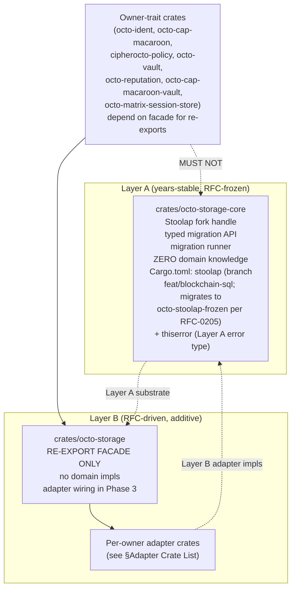
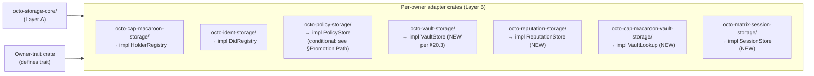

# RFC-0206 (Storage): octo-storage Substrate Split

## Status

**Version:** 1.3 (2026-08-19)
**Status:** Draft
**Layer:** B (introduces a new Layer A substrate crate `octo-storage-core`; the substrate itself is the Layer A boundary change; the rest of the RFC is Layer B facade + adapter wiring)

## Authors

- Author: @mmacedoeu

## Maintainers

- Maintainer: octo-storage owner
- Co-maintainer: per-owner adapter crate owners (octo-cap-macaroon-storage, octo-ident-storage, octo-policy-storage, octo-vault-storage; `octo-market-storage/` deferred per plan §4.2 B.4). **Naming gap:** the on-disk policy owner-trait crate is `crates/cipherocto-policy/`, not `crates/octo-policy/`; the adapter crate `octo-policy-storage/` does not exist yet — alignment is tracked by §Future Work follow-on RFC.

## Summary

Splits `crates/octo-storage` into a Layer A frozen substrate (`octo-storage-core`, RFC-frozen, years-stable) holding the Stoolap fork handle + typed migration runner, and a Layer B re-export facade (`octo-storage`, RFC-driven, additive) aggregating per-owner adapter crates. Closes the review §4.6.1 MED blocker; resolves the §4.4 / §4.6 / §4.6.1 owner-crate cycle risk by enforcing per-owner adapter placement.

## Dependencies

**Requires:**

- RFC-0914 (Economics): Stoolap-only quota-router persistence convention — establishes the Stoolap-only invariant this RFC extends with a per-owner adapter surface
- RFC-0205 (Storage): Stoolap fork stability certification — defines `octo-stoolap-frozen` Layer A substrate consumed by `octo-storage-core` (Draft; sibling RFC; must reach Accepted before RFC-0206 reaches Accepted per §Promotion Path)
- RFC-0105 (Numeric): Deterministic Quant Arithmetic — DQA wire form consumed by core
- RFC-0010 (Process): Canonical DID Codec + 32-byte chain_id addendum — `octo-ident-storage` adapter depends on typed `ChainId`

**Optional:**

- RFC-0960 (Storage): Vault substrate — `octo-vault-storage` adapter implements `VaultStore`
- RFC-0957 (Storage): Capability verify-time invariant — `octo-cap-macaroon-storage` adapter implements `HolderRegistry`

> **Dependency Validation Rules:** Required RFCs at minimum Draft status before RFC-0206 reaches Accepted. Currently: RFC-0205 is Draft (sibling); RFC-0105, RFC-0010, RFC-0914 are Accepted. This RFC introduces a new Layer A substrate crate (`octo-storage-core`); all consumer crates depend on it through the Layer B facade `octo-storage`.

## Design Goals

| Goal | Target                | Metric                                                                       |
| ---- | --------------------- | ---------------------------------------------------------------------------- |
| G1   | Zero cycle risk       | `cargo metadata` audit: no owner-trait crate in `octo-storage-core` dep tree |
| G2   | ≤ 1 migration surface | All migrations routed via `octo_storage_core::apply_pending` (free fn)       |
| G3   | Single import path    | Downstream uses `octo_storage::StoolapHolderRegistry` (facade)               |
| G4   | Per-owner isolation   | `octo-cap-macaroon-storage` does NOT depend on `octo-ident-storage`          |

## Motivation

`docs/reviews/2026-08-15-storage-layer-restructuring-analysis.md` §4.6.1 audit identified that `crates/octo-storage = B/A?` was undecided: the migrator is non-stable, but Layer A requires years-stable primitives. Owner crates (octo-ident, octo-cap-macaroon, octo-policy) each constructed `stoolap::Database` directly, duplicating migration-runner logic and creating a cycle risk: owner-trait crate → storage-core → owner-trait crate.

**Solution:** Adopt the §4.6.1 resolution — split into Layer A frozen core + Layer B re-export facade + per-owner adapter crates.

## Roles and Authorities

1. **octo-storage-core owner** — owns the Layer A substrate crate; gates schema changes via RFC.
2. **octo-storage facade owner** — owns the Layer B re-export crate; depends on `octo-storage-core` + each adapter crate.
3. **Adapter crate owners** — one per owner-trait (HolderRegistry, DidRegistry, PolicyStore, VaultStore, ReputationStore, VaultLookup, SessionStore); file RFCs to add new adapters.
4. **RFC reviewer** — signs off on new adapter crates and migration additions to `octo-storage-core`.

| Role                      | Identifier                                | Authority Scope                                                          | Lifecycle                 | Source/Ref                                                                       |
| ------------------------- | ----------------------------------------- | ------------------------------------------------------------------------ | ------------------------- | -------------------------------------------------------------------------------- |
| octo-storage-core owner   | GitHub team `@octo-storage-core-owners`   | Layer A substrate; migration runner                                      | Active until role revoked | RFC-0206 §Three-Tier Architecture                                                |
| octo-storage facade owner | GitHub team `@octo-storage-facade-owners` | Re-export glue; adapter registry                                         | Active until role revoked | RFC-0206 §Three-Tier Architecture                                                |
| Adapter crate owner       | Per-adapter GitHub team                   | Owner-trait impl; register(Arc<Database>) constructor; CI gate operation | Per-adapter               | RFC-0206 §Wiring Pattern + RFC-0206 §Cargo.toml Templates (per-adapter template) |
| RFC reviewer              | RFC process role                          | New adapter + migration approval                                         | Per-RFC                   | RFC-0206 §Promotion Path                                                         |

## Specification

### Three-Tier Architecture



### Adapter Crate List (Initial)



> **Note:** `octo-market-storage/` is **deferred** per plan §4.2 B.4 (octo-market primitive extraction is out of scope for this restructure cycle). When/if the marketplace primitive crate ships, a follow-on RFC adds the corresponding adapter. This RFC explicitly does NOT name it in §Key Files Modified or §TV. The seven crates above are the initial scope; each adapter crate ships its own RFC per §Promotion Path Condition 4.

### Cargo.toml Templates

**Layer A — `octo-storage-core/Cargo.toml`** (current on-disk state at `crates/octo-storage-core/Cargo.toml`; post-Phase-1 Task 1 target):

```toml
[package]
name = "octo-storage-core"

[dependencies]
# Layer A → substrate SQL engine. Until RFC-0205 freeze ships
# `octo-stoolap-frozen` as a workspace pin / `[patch.crates-io]` entry,
# octo-storage-core pins the active fork by branch (matches the
# workspace root `[patch.crates-io]` block in the audit). When
# RFC-0205 Phase 1 Task 1 lands, replace `branch = "feat/blockchain-sql"`
# with `rev = "<sha>"` and migrate the dep name to `octo-stoolap-frozen`.
stoolap = { git = "https://github.com/CipherOcto/stoolap", branch = "feat/blockchain-sql" }
# Layer A error type per `cipherocto-design-principles` Layer A row.
thiserror = "2.0"
# NOT a dep: octo-transport, quota-router-core, owner-trait crates
```

**Layer B facade — `octo-storage/Cargo.toml`** (current on-disk state; thin re-export of `octo-storage-core` only — adapter wiring is Phase 3 future work):

```toml
[package]
name = "octo-storage"

[dependencies]
# Layer B → Layer A substrate
octo-storage-core = { path = "../octo-storage-core" }
# Phase 3 will add per-owner adapter crate deps here as they land.
# Until each adapter crate ships, the facade remains a pure re-export.
# NOT a dep (today): octo-cap-macaroon-storage, octo-ident-storage,
# octo-policy-storage, octo-vault-storage, octo-reputation-storage,
# octo-cap-macaroon-vault-storage, octo-matrix-session-storage
# NOT a dep (ever): octo-transport, quota-router-core
# Re-export policy: facade re-exports curated set of `octo-storage-core`
# types (Database, apply_pending, OctoStorageError, MigrationRecord
# — 12 substrate types at current audit; cf. `octo-storage-core/src/lib.rs`
# `pub use` list at drafting time). NOT a wildcard `*` re-export — the
# curated set is the layer boundary. New substrate types require RFC.
```

**Per-owner adapter — `octo-cap-macaroon-storage/Cargo.toml`:**

```toml
[package]
name = "octo-cap-macaroon-storage"

[dependencies]
# Layer B → Layer B (this crate → owner trait)
octo-cap-macaroon = { path = "../octo-cap-macaroon" }
# Layer B → Layer A
octo-storage-core = { path = "../octo-storage-core" }
# Layer B → Layer A (frozen snapshot per RFC-0205)
octo-determin = { path = "../../determin" }
# Async runtime needed for register(Arc<Database>) + Stoolap async
tokio = { version = "1", features = ["sync"] }
# NOT a dep: octo-transport, quota-router-core
```

### Wiring Pattern

Each adapter crate exposes a `register(Arc<Database>) -> Arc<dyn OwnerTrait>` constructor. The application layer (Layer C node) collects adapters and injects them into domain crates via constructor injection. Per §4.4 per-owner placement: owner crates contain migrations (SQL files) in `crates/<owner>/migrations/`, but owner crates' `Cargo.toml` depends on `octo-storage-core` (NOT `stoolap` directly). Owner crates do NOT construct `stoolap::*` types directly — they go through the registered trait surface.

**Migration placement split:** SQL files live in `crates/<owner>/migrations/*.sql` (owner owns the migration content + ordering). The Rust migration _runner_ (`fn register_migrations()` returning the `Vec<MigrationSpec>`) lives in the adapter crate (the adapter is the only place that knows the typed `stoolap::Database` constructor for the migration). Owner crates ship SQL; adapter crates ship Rust runner. This split is per §4.4 per-owner placement and is the precondition for TV-0206-06 (`rg '\bstoolap::' crates/<owner>/src/` returns empty). The split is enforced by Clippy lint in Phase 1 Task 4 (see §Implicit Assumptions row 5).

### Determinism Requirements

- `applied_at_unix` column stores `SystemTime::now()` UNIX seconds at apply time (advisory only; NOT consensus-input; cross-node replay/agreement contracts MUST exclude this column).
- `octo-stoolap-frozen` rev pin per RFC-0205 §Release-Tag Pin Policy.
- DQA wire form unchanged across re-cert.

### Operation Class Mapping

| Operation                          | Class | Rationale                       |
| ---------------------------------- | ----- | ------------------------------- |
| `octo_storage_core::apply_pending` | A     | Layer A substrate; years-stable |
| Adapter `register(Arc<Database>)`  | C     | Initialization glue; per-owner  |
| New adapter crate addition         | C     | RFC-driven additive             |
| Migration SQL file addition        | A     | Schema substrate; requires RFC  |

> **Note:** Operation Class A/B/C taxonomy per `docs/BLUEPRINT.md` §RFC Process. No separate RFC-NNNN anchors this taxonomy; it is defined inline in the process doc.

### Error Handling

| Error                                                         | Detection                 | Recovery                                      |
| ------------------------------------------------------------- | ------------------------- | --------------------------------------------- |
| `octo-storage-core` accidentally depends on owner-trait crate | CI `cargo metadata` audit | Reject merge; route to RFC reviewer           |
| Adapter cycle (A → B → A)                                     | CI graph audit            | Reject merge                                  |
| Migration drift across re-cert                                | CI byte-verify            | File RFC; reset pin per RFC-0205 policy       |
| Owner crate constructs `stoolap::*` directly                  | Clippy lint + CI grep     | Refactor to use `octo-storage-core::Database` |

## Performance Targets

| Metric                     | Target                | Notes                             |
| -------------------------- | --------------------- | --------------------------------- |
| Migration runner latency   | < 10 ms per migration | Lock + version + applied_at       |
| Adapter `register` latency | < 5 ms                | Arc wrapping + type-id resolution |
| `cargo metadata` audit     | < 2 s                 | Graph scan                        |

## Implicit Assumptions Audit

| Assumption                                               | Where Relied Upon                 | Blast Radius if False                             | Mitigation / Status                                                                                                                                                                                                                                                                                                                              |
| -------------------------------------------------------- | --------------------------------- | ------------------------------------------------- | ------------------------------------------------------------------------------------------------------------------------------------------------------------------------------------------------------------------------------------------------------------------------------------------------------------------------------------------------ |
| Per-owner adapter crates form a DAG                      | §Adapter Crate List               | Cycle breaks facade re-export; compile fails      | CI `cargo metadata --format-version 1` graph audit                                                                                                                                                                                                                                                                                               |
| Migrations always placed in `crates/<owner>/migrations/` | §Wiring Pattern                   | Cross-crate migration; layering violation         | Lint + CI grep                                                                                                                                                                                                                                                                                                                                   |
| `octo-storage-core` depends only on Layer A              | §Cargo.toml Templates             | Layer A pollution; RFC reviewer can reject        | CI dep-graph audit                                                                                                                                                                                                                                                                                                                               |
| DQA wire form stable across adapter additions            | §Determinism Requirements         | Settlement replay diverges                        | Pinned at RFC-0105; bump = RFC-major                                                                                                                                                                                                                                                                                                             |
| Adapter crates can re-export without conflict            | §Layer B facade                   | Type collision; facade fails to compile           | Type-naming convention: `Stoolap<OwnerTrait>`                                                                                                                                                                                                                                                                                                    |
| Owner crates stay free of `stoolap::*` direct use        | §Wiring Pattern (migration split) | Layering violation; substrate pulled into Layer B | Clippy lint `octo_storage_no_direct_stoolap` triggers `cargo clippy --all-targets` failure when `rg '\bstoolap::' crates/octo-{ident,cap-macaroon,reputation,cap-macaroon-vault,matrix-session-store}/src/ crates/cipherocto-policy/src/ crates/octo-vault/src/` returns non-empty (forward requirement; Phase 1 Task 4 adds the lint + CI step) |

### Categories to Audit

- **Operator trust** — adapter crate owners trusted to maintain API stability; compromise → facade breaks. Mitigation: per-adapter test suite + CI gate.
- **Platform trust** — Stoolap fork availability per RFC-0205.
- **Time source** — migration `applied_at` uses wall-clock; skew across nodes tolerated (advisory only, not consensus).
- **Network partition** — none; substrate is local.
- **Upgrade safety** — adding adapter = additive; removing adapter = breaking change requiring RFC-major.
- **Configuration** — `Cargo.toml` dep graph is source of truth; no env vars.
- **Identity stability** — adapter owner GitHub teams must be stable; quarterly audit.
- **Resource availability** — disk for migration metadata; standard.

## Security Considerations

- **Migration SQL injection** — adapter crates write SQL; poisoned input breaks schema. Mitigation: SQL files are static checked into repo; CI lints for parameterized queries.
- **Adapter supply chain** — attacker compromises adapter crate; facade exposes malicious type. Mitigation: per-adapter code review + signed releases.
- **Cycle exploit** — adapter cycle creates import-time DoS. Mitigation: CI graph audit + cyclic fail-fast.
- **Cross-adapter data leak** — adapter A reads adapter B's table without permission. Mitigation: per-owner table ownership enforced by `octo-storage-core` schema registry.

## Adversary Analysis

| Decision                    | Q1 Beneficiary            | Q2 Cost to Attacker           | Q3 Gain if Successful                 | Q4 Defense (cost to legit op)          | Q5 Residual Risk                                                                                                                     |
| --------------------------- | ------------------------- | ----------------------------- | ------------------------------------- | -------------------------------------- | ------------------------------------------------------------------------------------------------------------------------------------ |
| Per-owner adapter placement | Compromised adapter owner | Owner account compromise      | Cycle injection → facade compile fail | CI graph audit (low cost)              | LOW — automatic gate                                                                                                                 |
| Layer A frozen core         | None directly             | High                          | Inject domain into Layer A            | CI rejects owner-trait deps (low cost) | LOW — multi-tenant separation                                                                                                        |
| Migration runner            | Compromised SQL file      | Write access to migration dir | Schema corruption                     | Code review + RFC gate (medium cost)   | MED — depends on reviewer vigilance                                                                                                  |
| Adapter registry            | Compromised facade owner  | Facade owner account          | Re-export malicious types             | Per-adapter code review (low cost)     | LOW — facade surface narrow; curated re-export set (12 substrate types per §Cargo.toml Templates Layer B facade) limits blast radius |

### Severity Classification

| Severity     | Definition                  | Action                                |
| ------------ | --------------------------- | ------------------------------------- |
| **CRITICAL** | Cycle injection into facade | MUST mitigate before Accept (CI gate) |
| **HIGH**     | Migration SQL corruption    | SHOULD mitigate; RFC review           |
| **MEDIUM**   | Adapter type collision      | SHOULD mitigate (CI build)            |
| **LOW**      | Audit checklist skipped     | MAY accept; document residual         |

### Multi-Round Review

This RFC touches the Layer A substrate boundary. Multi-round review with severity classification is REQUIRED per `docs/BLUEPRINT.md` §Adversarial Review Process.

## Economic Analysis

No new tokens or stake implications. Cost: ~0.5 FTE/quarter for adapter maintainers + per-RFC reviewer time. Mitigated by per-adapter ownership + automated CI gates.

## Compatibility

- **Backward:** owner-trait crates that today construct `stoolap::*` directly (the workspace audit `docs/audits/stoolap-fork-stability-2026-08-16.md` found `octo-ident` + `octo-cap-macaroon` + `cipherocto-policy` go through the substrate only; `octo-vault` + other downstream consumers still carry direct `stoolap` branch-tracking deps that are gated for removal by §Implementation Phases Phase 1 Task 3 + Phase 3 Task 10) continue to compile, but are flagged by Clippy lint per TV-0206-06 once adapter crates ship. Migration window from any future direct `stoolap::*` use to `octo-storage-core`: 90 days.
- **Forward:** adding new adapter = additive; facade auto-re-exports. No new RFC required for adding an adapter IF the adapter implements an existing owner-trait.

## Test Vectors

Governance TV — structural verification:

1. **TV-0206-01:** `crates/octo-storage-core/Cargo.toml` depends only on Layer A crates. Current on-disk state: `stoolap` (active fork branch) + `thiserror`. Post-RFC-0205 Phase 1 Task 1 target: `octo-stoolap-frozen` (rev-pinned) + `thiserror`.
2. **TV-0206-02:** `crates/octo-storage-core/` source contains zero references to `HolderRegistry`, `DidRegistry`, `PolicyStore`, `VaultStore`, `OrderBookStore`, `EscrowStore`.
3. **TV-0206-03:** `crates/octo-storage/` source contains only `pub use` re-exports; no `impl` blocks for owner traits.
4. **TV-0206-04:** Each adapter crate's `Cargo.toml` depends on exactly one owner-trait crate + `octo-storage-core`. **Forward requirement** — gates each adapter crate landing; none exist on disk yet (see §Implementation Phases).
5. **TV-0206-05:** CI graph audit rejects any cycle in adapter → owner-trait → adapter direction. Implemented as `cargo metadata --format-version 1` + `jq` reverse-DB scan over the adapter subtree (per adapter crate, query consumers-of-self via `.packages[] | select(.dependencies[]?.name == "<adapter>") | .name`; reject if result includes any other adapter crate or `octo-storage-core` itself; correct reverse-edge query per R3 reviewer correction).
6. **TV-0206-06:** CI grep rejects any `stoolap::*` direct construction in owner-trait crates (must go through `octo-storage-core`). Implemented as `! rg '\bstoolap::' crates/octo-{ident,cap-macaroon,reputation,cap-macaroon-vault,matrix-session-store}/src/ crates/cipherocto-policy/src/ crates/octo-vault/src/` in CI. Pattern uses `\b` word boundary so `use stoolap::Database` AND `stoolap::Database::open()` AND `stoolap::Rows` all match; `stoop::stoolap::xxx` would NOT match (correct — that crate is unrelated). Crate list in the pattern matches the seven adapter-supported owner crates per §Adapter Crate List (Initial); extend the pattern when a new adapter crate ships. (Note: `crates/octo-market/` does not exist on disk today; `crates/octo-policy/` was renamed to `crates/cipherocto-policy/` per workspace audit — the pattern above matches on-disk crate names. `octo-market-storage/` is deferred per plan §4.2 B.4; once shipped, extend the pattern.)
7. **TV-0206-07:** Per-adapter test suite covers `register(Arc<Database>) → Arc<dyn OwnerTrait>` round-trip. Forward requirement — one test file per adapter crate landing.

## Alternatives Considered

| Approach                                                                         | Pros                                                       | Cons                                                                       |
| -------------------------------------------------------------------------------- | ---------------------------------------------------------- | -------------------------------------------------------------------------- |
| Option A: Single `octo-storage` crate (no split)                                 | Simpler; one crate to maintain                             | Layer A vs B undecided; migrator non-stable; cycle risk                    |
| Option B: Per-owner direct `stoolap` deps                                        | Zero adapter overhead                                      | Duplicated migration logic; cycle risk; layering violation                 |
| Option C: Trait-only abstraction (no Stoolap impl)                               | Maximum portability                                        | Reimplements all Stoolap-specific features (MVCC DQA, lexicographic codec) |
| **Option D: Layer A core + Layer B facade + per-owner adapter crates (adopted)** | Resolves layering; per-owner isolation; single import path | More crates to maintain                                                    |

## Implementation Phases

### Phase 1: Layer A Core

- [x] Task 1: Create `crates/octo-storage-core/` with migration runner + Database handle (LANDED 2026-08-19 per `missions/claimed/octo-storage-split.md` R1-F5; commits `34e6025d` + `003f3a45`)
- [x] Task 2: Add `octo-storage-core` to workspace `Cargo.toml` (LANDED 2026-08-19)
- [ ] Task 3: Migrate Stoolap fork dep from owner crates to `octo-storage-core` (one crate at a time) — gated on RFC-0205 Phase 1 Task 1 freeze
- [ ] Task 4: Add CI graph audit + Clippy lint `octo_storage_no_direct_stoolap` for owner-trait cycle (lint scope: any `use stoolap::` in `crates/octo-{ident,cap-macaroon,reputation,cap-macaroon-vault,matrix-session-store}/src/` + `crates/cipherocto-policy/src/` + `crates/octo-vault/src/` fails the build)

### Phase 2: Adapter Crates

- [ ] Task 5a: Create `octo-cap-macaroon-storage/` + `octo-ident-storage/` adapters (mandatory)
- [ ] Task 5b: Create `octo-policy-storage/` adapter (conditional — gated on naming-resolution RFC per §Future Work; deferrable per §Promotion Path Condition 2)
- [ ] Task 6: Create `octo-vault-storage/` adapter (per §20.3); `octo-market-storage/` is DEFERRED to a follow-on RFC per plan §4.2 B.4
- [ ] Task 7: Verify per-adapter test suite passes `register` round-trip

### Phase 3: Layer B Facade

- [x] Task 8: Create `crates/octo-storage/` re-export facade (LANDED 2026-08-19; thin re-export of `octo-storage-core` per current `src/lib.rs`)
- [ ] Task 9a: Extend `crates/octo-storage/Cargo.toml` with per-owner adapter crate deps as each adapter ships (the facade currently is a thin re-export of `octo-storage-core` only — adapter wiring must precede consumer migration)
- [ ] Task 9b: Update downstream consumers to import from `octo-storage::Stoolap*` (gated on Phase 2 adapter crate landings + Task 9a facade Cargo.toml edit)
- [ ] Task 10: Remove direct `stoolap` deps from owner-trait crates (90-day migration window; gated on Phase 2)

## Promotion Path

This RFC reaches Accepted after all of the following are satisfied:

1. **Sibling RFC frozen:** RFC-0205 reaches Accepted (defines the Layer A substrate `octo-stoolap-frozen` that RFC-0206 Phase 1 Task 3 depends on).
2. **Adapter crates shipped or explicitly deferred:** at least `octo-cap-macaroon-storage/` + `octo-ident-storage/` + `octo-vault-storage/` land; `octo-policy-storage/` may be deferred if the naming discrepancy (see §Future Work) is unresolved. `octo-market-storage/` is OUT OF SCOPE per plan §4.2 B.4 and is tracked by a separate sub-RFC.
3. **CI gates land:** Phase 1 Task 4 (`cargo metadata` cycle audit + Clippy owner-trait lint) merged to `.github/workflows/ci.yml`.
4. **Multi-round review passes:** per `docs/BLUEPRINT.md` §Adversarial Review Process.

> **Cross-ref:** these four conditions codify the acceptance path tracked in `docs/plans/2026-08-16-storage-layer-restructuring-execution-plan.md` §3 S7 row; the plan doc is a tracking artifact, not the source of truth — this section is authoritative for the RFC's promotion.

## Key Files to Modify

| File                                          | Status                                                                                                                                                                                                                                                   |
| --------------------------------------------- | -------------------------------------------------------------------------------------------------------------------------------------------------------------------------------------------------------------------------------------------------------- |
| `Cargo.toml` (workspace)                      | Add `octo-storage-core`, `octo-storage`, adapter crates to members                                                                                                                                                                                       |
| `crates/octo-storage-core/Cargo.toml`         | LANDED — Layer A substrate deps (`stoolap` branch + `thiserror`)                                                                                                                                                                                         |
| `crates/octo-storage-core/src/lib.rs`         | LANDED — Database handle + migration runner (`apply_pending` etc.)                                                                                                                                                                                       |
| `crates/octo-storage/Cargo.toml`              | LANDED — facade re-exports (`octo-storage-core` only)                                                                                                                                                                                                    |
| `crates/octo-storage/src/lib.rs`              | LANDED — `pub use` aggregations                                                                                                                                                                                                                          |
| `crates/octo-cap-macaroon-storage/Cargo.toml` | NEW — adapter                                                                                                                                                                                                                                            |
| `crates/octo-ident-storage/Cargo.toml`        | NEW — adapter (workspace audit shows `crates/octo-ident` exists but storage adapter is NEW)                                                                                                                                                              |
| `crates/octo-policy-storage/Cargo.toml`       | CONDITIONAL — adapter (workspace audit shows `crates/cipherocto-policy/` is the actual name; align on `octo-policy-storage` or document the rename in this RFC; gated on naming-resolution follow-on RFC per §Future Work + §Promotion Path Condition 2) |
| `crates/octo-vault-storage/Cargo.toml`        | NEW — adapter                                                                                                                                                                                                                                            |
| `.github/workflows/ci.yml`                    | Add graph audit + Clippy lint                                                                                                                                                                                                                            |

> **Note:** `crates/octo-market-storage/Cargo.toml` is **NOT** in scope for this RFC (deferred per plan §4.2 B.4). When/if the marketplace primitive crate ships, a follow-on RFC adds the corresponding adapter.

## Future Work

- Sub-mission `octo-storage-facade-versioning.md` (`to be filed`) for facade semver policy.
- Sub-mission `octo-storage-core-deprecation.md` (`to be filed`) for Layer B → Layer A migration.
- Adapter `Stoolap<OwnerTrait>` naming-convention enforcement (Clippy lint).
- Resolve naming discrepancy `crates/cipherocto-policy/` vs proposed `crates/octo-policy-storage/` (decide via follow-on RFC; the workspace currently has `cipherocto-policy/`, not `octo-policy/`).

## Version History

| Version | Date       | Author     | Changes                                                                                                                                                                                                                                                                                                                                                                                                                                                                                                                                                                                                                                                                                                                                                                                                                                                                                                                                                                                                                                                                                                                                                                                                                                                                                                                                                                                                                                              |
| ------- | ---------- | ---------- | ---------------------------------------------------------------------------------------------------------------------------------------------------------------------------------------------------------------------------------------------------------------------------------------------------------------------------------------------------------------------------------------------------------------------------------------------------------------------------------------------------------------------------------------------------------------------------------------------------------------------------------------------------------------------------------------------------------------------------------------------------------------------------------------------------------------------------------------------------------------------------------------------------------------------------------------------------------------------------------------------------------------------------------------------------------------------------------------------------------------------------------------------------------------------------------------------------------------------------------------------------------------------------------------------------------------------------------------------------------------------------------------------------------------------------------------------------- |
| 1.0     | 2026-08-19 | @mmacedoeu | Initial draft. Three-tier architecture (Layer A core + Layer B facade + adapter crates) per review §4.6; Cargo.toml templates; per-owner migration placement; CI gates for cycle + Layer A pollution; 7 governance TV.                                                                                                                                                                                                                                                                                                                                                                                                                                                                                                                                                                                                                                                                                                                                                                                                                                                                                                                                                                                                                                                                                                                                                                                                                               |
| 1.1     | 2026-08-19 | @mmacedoeu | Round 1 review fixes: phantom `RFC-0914-a` → `RFC-0914 (Economics)`; phantom `RFC-0001`/`RFC-0008` → `BLUEPRINT.md` ref + inline Operation Class Mapping; consolidated §refs to `§4.4` / `§4.6` / `§4.6.1` (review doc carries §4.6.1 at the layer-assignment MED blocker); Cargo.toml templates aligned with current on-disk state (Phase 1 Tasks 1/2/8 LANDED, Phase 1 Tasks 3/4 + Phase 2/3 forward); `MigrationsHandle::apply_pending` → `octo_storage_core::apply_pending` (free fn); adapter crate naming gap `cipherocto-policy/` vs `octo-policy-storage/` flagged in §Future Work; Implementation Phases checkboxes corrected (Phase 1 Tasks 1/2 + Phase 3 Task 8 marked `[x]`); Layer self-declaration added to Status; Roles Source/Ref column updated to precise §names. Doc accuracy only — no spec change.                                                                                                                                                                                                                                                                                                                                                                                                                                                                                                                                                                                                                             |
| 1.2     | 2026-08-19 | @mmacedoeu | Round 2 review fixes: reverted §4.6 → §4.6.1 in Summary + Motivation (R1 reviewer claim that §4.6.1 was phantom was incorrect — review doc line 1732 carries `# §4.6.1 octo-storage layer assignment (MED blocker)`); removed `octo-market-storage` from Maintainers co-maintainer list, §Adapter Crate List (Initial), §Cargo.toml Templates Layer B facade "NOT a dep" list, §Implementation Phases Phase 2 Task 6, and §Key Files Modified (workspace has no `crates/octo-market/`; plan §4.2 B.4 explicitly defers octo-market primitive extraction out of scope); fixed TV-0206-06 grep pattern (`market` and `policy` → `cipherocto-policy/` to match on-disk crate names); tightened "as a published crate" phrasing in §Cargo.toml Templates to "as a workspace pin / `[patch.crates-io]` entry" (the frozen fork is a workspace dep until upstream crates-io publish); dropped inline `RFC-0206 v1.0` version pin in §Compatibility Backward (per CLAUDE.md rule, Version History is the only place version pins belong); backticked `to be filed` markers in §Future Work. Doc accuracy only — no spec change.                                                                                                                                                                                                                                                                                                                             |
| 1.3     | 2026-08-19 | @mmacedoeu | Round 3 deep-dive reviewer fixes: TV-0206-06 grep pattern extended (was `use stoolap::` → now `rg '\bstoolap::'` for word-boundary match; crate list extended from `octo-ident, octo-cap-macaroon, cipherocto-policy, octo-vault` to `octo-ident, octo-cap-macaroon, octo-reputation, octo-cap-macaroon-vault, octo-matrix-session-store, cipherocto-policy, octo-vault` — seven adapter-supported owner crates, verified via `rg '\bstoolap::' crates/`); §Adapter Crate List (Initial) extended from 4 to 7 crates (`octo-reputation-storage` → impl `ReputationStore`, `octo-cap-macaroon-vault-storage` → impl `VaultLookup`, `octo-matrix-session-storage` → impl `SessionStore`); §Roles Authorities row 3 trait list updated to 7; §Three-Tier Owner crates edge label updated to 7 crates; §Cargo.toml Templates Layer B facade gained curated re-export policy note (12 substrate types per `octo-storage-core/src/lib.rs` `pub use` list; not wildcard `*`); §Wiring Pattern gained migration-placement split clause (SQL files in owner `crates/<owner>/migrations/*.sql`; Rust runner in adapter crate); §Implicit Assumptions gained row 5 (`octo_storage_no_direct_stoolap` Clippy lint + CI grep step gating TV-0206-06); §Implementation Phases Phase 1 Task 4 description expanded with the new lint; §Adversary Row 4 (Adapter registry) Q5 Residual Risk expanded with curated re-export cap. Doc accuracy only — no spec change. |
