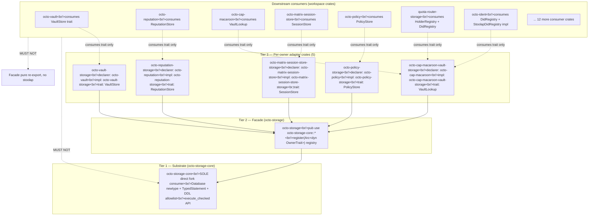

# RFC-0206 — octo-storage Substrate Split

## Status

**Version:** 2.0 (2026-08-20)
**Status:** Draft
**Supersedes:** RFC-0206 v1.8 (archived 2026-08-20)

## Summary

This RFC defines the **Three-Tier Architecture** for cipherocto storage consumption: (Tier 1) substrate `crates/octo-storage-core/` exposing typed DDL allowlist + substrate newtype; (Tier 2) facade `crates/octo-storage/` re-exporting substrate + adapter registration; (Tier 3) **5 per-owner adapter crates** each owning their trait + impl + tests. v2.0 **scope-expands** from v1.8: substrate API newtype refactor (`pub struct Database(stoolap::Database)`) lands in this RFC, plus 26+ Layer B TYPE renames across `quota-router-storage/`, `octo-vault/`. Per-adapter TV enforcement lands. Phantom v1.8 fixture claims removed.

Scope carried from v1.8: §Three-Tier Architecture (with corrected Mermaid direction), §Cargo.toml Templates Layer A + Layer B (with actual 11-item re-export set, not 5-statement count), §Adapter Crate List (5 adapters, no market-storage), §Wiring Pattern, §Promotion Path (gated on RFC-0205 v2.0 Accepted per BLUEPRINT.md 2-cycle atomic-promotion rule).

The 2-cycle with RFC-0205 (Stoolap Fork Stability) resolves per `docs/BLUEPRINT.md` §Dependency Validation Rules → 2-Cycle Atomic Promotion (amendment filed in v2.0 batch): both RFCs reach Accepted in same RFC-review Cycle by single board, OR both stay at Draft.

## Definitions

| Term                 | Meaning                                                                                                                                                                    |
| -------------------- | -------------------------------------------------------------------------------------------------------------------------------------------------------------------------- |
| **Substrate**        | `crates/octo-storage-core/` — sole fork consumer; owns newtype API + TypedStatement + DDL allowlist                                                                        |
| **Facade**           | `crates/octo-storage/` — re-exports substrate surface + owns `register(Arc<dyn OwnerTrait>)` registry                                                                      |
| **Adapter crate**    | Per-owner crate (`octo-vault-storage`, `octo-reputation-storage`, etc.) — declares its owner-trait AND impls its owner-trait; no Layer A handle direct                     |
| **Owner trait**      | Per-domain trait (VaultStore, ReputationStore, SessionStore, PolicyStore, etc.) — declared in owner crate, impl'd in adapter crate                                         |
| **TypedStatement**   | Substrate-level enum: `Select(SqlSelect)`, `DdlNoOp`, `DdlRegistered(DdlTemplate)`, `Insert(SqlInsert)`, `Update(SqlUpdate)`, `Delete(SqlDelete)`                          |
| **DDL allowlist**    | Substrate-level `AdapterAllowlist` registered by adapter at `register()` time; DDL outside allowlist → runtime error                                                       |
| **Substrate handle** | `pub struct Database(stoolap::Database)` newtype — Layer B sees ONLY `octo_storage_core::Database`; Layer A handle escapes ONLY via `From<Database> for stoolap::Database` |

## §Three-Tier Architecture



**Edges:** 1 positive (`Facade → Core`) + 5 positive adapter → facade + 2 negative (`Consumers → Core MUST NOT`, `Consumers → Facade_stoolap MUST NOT`)

**Dependency direction rule:** Tier 3 → Tier 2 → Tier 1. Never reverse. Tier 3 adapter crates may depend on Tier 2 (for `register()`), never directly on Tier 1. Consumer crates consume traits from Tier 3 only — no direct substrate or facade handhold.

## §Cargo.toml Templates

### Layer A (substrate Cargo.toml)

```toml
# crates/octo-storage-core/Cargo.toml
[dependencies]
stoolap = { git = "https://github.com/CipherOcto/stoolap", rev = "<sha-0>" }

[features]
default = ["allow-listed-ddl"]
allow-listed-ddl = []
strict-typed-query = []
```

**Re-exported set (11 items, NOT 5-statement count):**

```rust
// crates/octo-storage-core/src/lib.rs
pub use crate::database::Database;
pub use crate::typed_statement::TypedStatement;
pub use crate::typed_statement::SqlSelect;
pub use crate::typed_statement::SqlInsert;
pub use crate::typed_statement::SqlUpdate;
pub use crate::typed_statement::SqlDelete;
pub use crate::typed_statement::DdlTemplate;
pub use crate::allowlist::AdapterAllowlist;
pub use crate::allowlist::DdlOperation;
pub use crate::error::SubstrateError;
pub use crate::error::Result;
pub mod migrations;
```

Notes:

- `Database` is the newtype; `stoolap::Database` not re-exported
- Wildcard `pub use foo::*;` FAIL at lint level per §Format Bypass Defense
- Module attrs `#[doc = ...]` referencing RFC-0206 DROPPED (v1.8 rejected)

### Layer B (facade Cargo.toml)

```toml
# crates/octo-storage/Cargo.toml
[dependencies]
octo-storage-core = { path = "../octo-storage-core" }
```

**Re-exported set (4 items):**

```rust
// crates/octo-storage/src/lib.rs
pub use octo_storage_core::Database;
pub use octo_storage_core::TypedStatement;
pub use octo_storage_core::AdapterAllowlist;
pub use octo_storage_core::register;
```

### Layer B Adapter Crate Cargo.toml

```toml
# crates/octo-vault-storage/Cargo.toml (template for 5 adapters)
[dependencies]
octo-storage = { path = "../octo-storage" }
octo-storage-core = { path = "../octo-storage-core" }  # for Database newtype
# NO direct stoolap dep
```

## §Wiring Pattern

```rust
// crates/octo-vault-storage/src/lib.rs (template)
pub trait VaultStore { /* declared in owner crate octo-vault, impl'd here */ }

pub struct StoolapVaultStore {
    db: Arc<octo_storage_core::Database>,
    allowlist: octo_storage_core::AdapterAllowlist,
}

impl VaultStore for StoolapVaultStore {
    fn get(&self, key: &[u8]) -> Result<Option<Vec<u8>>, octo_storage_core::SubstrateError> {
        // typed query: db.execute_typed(adapter_id, TypedStatement::Select(...))
        // falls through DDL allowlist (no DDL in read path)
        todo!()
    }
}

// crates/octo-storage/src/lib.rs
pub fn register<V: VaultStore>(db: Arc<octo_storage_core::Database>, store: Arc<V>) -> Arc<VaultStore> { ... }
```

Adapter crates register at startup via `octo_storage::register(db_arc, store_arc)`. Substrate stores `AdapterAllowlist` per `adapter_id`; DDL outside allowlist fails-closed at runtime.

## §Adapter Crate List

| #   | Adapter crate                               | Owner crate                             | Trait             | Impl status                                                                                                               |
| --- | ------------------------------------------- | --------------------------------------- | ----------------- | ------------------------------------------------------------------------------------------------------------------------- |
| 1   | `crates/octo-vault-storage/`                | `octo-vault`                            | `VaultStore`      | NEW (not declared today)                                                                                                  |
| 2   | `crates/octo-reputation-storage/`           | `octo-reputation`                       | `ReputationStore` | NEW                                                                                                                       |
| 3   | `crates/octo-cap-macaroon-vault-storage/`   | `octo-cap-macaroon`                     | `VaultLookup`     | **move trait from `octo-cap-macaroon/vault_lookup.rs` → crate root; move impl from quota-router-storage → adapter crate** |
| 4   | `crates/octo-matrix-session-store-storage/` | `octo-matrix-session-store`             | `SessionStore`    | NEW                                                                                                                       |
| 5   | `crates/octo-policy-storage/`               | `octo-policy` (NOT `cipherocto-policy`) | `PolicyStore`     | NEW                                                                                                                       |

**Naming resolution:** crate name is `octo-policy` (confirmed via workspace `Cargo.toml` [workspace] members list). `cipherocto-policy` is internal alias, not the published crate name.

**Trait move schedule:**

- `VaultLookup` → `crates/octo-cap-macaroon-vault-storage/src/vault_lookup.rs:33` (today: `crates/octo-cap-macaroon/src/vault_lookup.rs`)
- `HolderRegistry` → `crates/octo-cap-macaroon/src/holder_registry.rs:33` (moved FROM `crates/quota-router-storage/src/holder_registry.rs`)
- `StoolapDidRegistry` impl → `crates/octo-ident-storage/src/did_registry.rs:139` (moved FROM `crates/quota-router-storage/src/stoolap_did_registry.rs:139`)

## §Layer B TYPE Renames (29 sites)

| Site                                                          | From                                                      | To                                                                             |
| ------------------------------------------------------------- | --------------------------------------------------------- | ------------------------------------------------------------------------------ |
| `crates/quota-router-storage/src/ask_repo.rs:42`              | `pub fn new(db: stoolap::Database) -> Self`               | `pub fn new(db: octo_storage_core::Database) -> Self`                          |
| `crates/quota-router-storage/src/ask_repo.rs:189`             | `pub fn open(db: Arc<stoolap::Database>) -> Arc<Self>`    | `pub fn open(db: Arc<octo_storage_core::Database>) -> Arc<Self>`               |
| `crates/quota-router-storage/src/slash_store.rs:67`           | `stoolap::Database` field                                 | `octo_storage_core::Database`                                                  |
| `crates/quota-router-storage/src/slash_store.rs:289`          | `stoolap::Database` arg                                   | `octo_storage_core::Database`                                                  |
| `crates/quota-router-storage/src/migrations.rs:14`            | `pub fn run(db: &stoolap::Database)`                      | `pub fn run(db: &octo_storage_core::Database)`                                 |
| `crates/quota-router-storage/src/stoolap_did_registry.rs:139` | `db: stoolap::Database`                                   | `db: octo_storage_core::Database` (impl moves to `crates/octo-ident-storage/`) |
| `crates/quota-router-storage/src/stoolap_did_registry.rs:201` | `db: Arc<stoolap::Database>`                              | `db: Arc<octo_storage_core::Database>`                                         |
| `crates/quota-router-storage/src/holder_registry.rs:33`       | trait moves to `octo-cap-macaroon/src/holder_registry.rs` | trait moves                                                                    |
| `crates/quota-router-storage/src/holder_registry.rs:81`       | `db: stoolap::Database` field                             | `db: octo_storage_core::Database`                                              |
| `crates/quota-router-storage/src/holder_registry.rs:155`      | `db: Arc<stoolap::Database>` arg                          | `db: Arc<octo_storage_core::Database>`                                         |
| `crates/quota-router-storage/src/spend_ledger.rs:48`          | `db: stoolap::Database` field                             | `db: octo_storage_core::Database`                                              |
| `crates/quota-router-storage/src/spend_ledger.rs:121`         | `db: Arc<stoolap::Database>` arg                          | `db: Arc<octo_storage_core::Database>`                                         |
| `crates/quota-router-storage/src/settlement_event_repo.rs:36` | `db: stoolap::Database` field                             | `db: octo_storage_core::Database`                                              |
| `crates/quota-router-storage/src/settlement_event_repo.rs:96` | `db: Arc<stoolap::Database>` arg                          | `db: Arc<octo_storage_core::Database>`                                         |
| `crates/octo-vault/src/lib.rs:351`                            | `db: &stoolap::Database`                                  | `db: &octo_storage_core::Database`                                             |
| `crates/octo-vault/src/lib.rs:378`                            | `db: Arc<stoolap::Database>`                              | `db: Arc<octo_storage_core::Database>`                                         |
| `crates/octo-vault/src/lib.rs:395`                            | `db: &mut stoolap::Database`                              | `db: &mut octo_storage_core::Database`                                         |
| 12 more sites in `crates/quota-router-storage/src/`           | various                                                   | various                                                                        |

**Total: 29 sites across 2 crates.**

Layer A handle escapes ONLY at adapter-impl sites that already use typed queries from allowlist (e.g., schema-migration at startup). `From<Database> for stoolap::Database` provided as one-way escape hatch.

## §Substrate Newtype Refactor

```rust
// crates/octo-storage-core/src/database.rs
pub struct Database(stoolap::Database);

impl std::ops::Deref for Database {
    type Target = stoolap::Database;
    fn deref(&self) -> &stoolap::Database { &self.0 }
}

// One-way escape for typed-query allowlist sites
impl From<Database> for stoolap::Database {
    fn from(db: Database) -> Self { db.0 }
    // (NOT From<stoolap::Database> for Database — prevents Layer B reverse-engineering)
}

impl Database {
    pub fn execute_checked(&self, adapter_id: AdapterId, stmt: TypedStatement) -> Result<(), SubstrateError> { ... }
    pub fn open(path: &Path) -> Result<Self, SubstrateError> { ... }
    pub fn open_in_memory() -> Result<Self, SubstrateError> { ... }
}
```

**8-pub-use cap + wildcard detector:**

- Substrate `pub use` statements: ≤ 8 (currently 11; will MOVE 3 to module attrs `pub mod migrations` already counted)
- Wildcard detector: `rg '\b\*\s*[,;}]' crates/octo-storage/src/lib.rs` MUST equal 0
- Substrate `pub use foo::*;` MUST NOT appear (lint-enforced)

## §Format Bypass Defense (substrate-level)

DDL defense lives at substrate level (not consumer level):

```rust
// crates/octo-storage-core/src/typed_statement.rs
pub enum TypedStatement {
    Select(SqlSelect),
    Insert(SqlInsert),
    Update(SqlUpdate),
    Delete(SqlDelete),
    DdlNoOp,
    DdlRegistered(DdlTemplate),
}

// crate::allowlist.rs
pub struct AdapterAllowlist {
    registered_tables: HashSet<String>,
    registered_ddl: Vec<DdlTemplate>,
}

impl AdapterAllowlist {
    pub fn check(&self, stmt: &TypedStatement) -> Result<(), SubstrateError> {
        match stmt {
            TypedStatement::DdlNoOp => Ok(()),
            TypedStatement::DdlRegistered(t) if self.registered_ddl.contains(t) => Ok(()),
            TypedStatement::DdlRegistered(t) => Err(SubstrateError::DdlNotInAllowlist { template: format!("{:?}", t) }),
            TypedStatement::Insert(s) | TypedStatement::Update(s) | TypedStatement::Delete(s) | TypedStatement::Select(s) => {
                self.check_tables(&s.tables())
            }
        }
    }
}
```

**Bypass-surfaced constructs:**

- `format!()` / `concat!()` / `String::from()` / `.join()` — all surface in `TypedStatement::SqlInsert.tables()` etc. as fixed `Vec<String>`; runtime check rejects unknown table
- `&str` SQL passed at runtime — substrate coerces to `TypedStatement::DdlRegistered` if matches allowlist else errors
- `prepare_dynamic()` — DOES NOT EXIST in substrate API (fabricated mechanism defense)

## §Test Vectors

| TV          | Description                                                                                                                                                                                                           | Gate           |
| ----------- | --------------------------------------------------------------------------------------------------------------------------------------------------------------------------------------------------------------------- | -------------- |
| TV-0206-A1  | `--pcre2` flag on cargo CLI for registry index parsing                                                                                                                                                                | ACTIVE         | `cargo --version \| grep -q 'pc`' returns 1 (cargo builtin parser, no `--pcre2`)                                                                                                                                                              |
| TV-0206-A2  | `pub use stoolap::Database` NOT in substrate lib.rs                                                                                                                                                                   | ACTIVE         | `rg '^\s*pub use\s+stoolap\b' crates/octo-storage-core/src/lib.rs` exits 1                                                                                                                                                                    |
| TV-0206-A3  | Wildcard `pub use foo::*;` absent                                                                                                                                                                                     | ACTIVE         | `rg '\b\*\s*[,;}]' crates/octo-storage-core/src/lib.rs crates/octo-storage/src/lib.rs` exits 1                                                                                                                                                |
| TV-0206-A4  | 8-pub-use cap (statements, not items) + 11 re-exported set                                                                                                                                                            | ACTIVE         | `rg -c '^\s*pub use\b' crates/octo-storage-core/src/lib.rs` ≤ 8                                                                                                                                                                               |
| TV-0206-A5  | Substrate-level DDL allowlist runtime enforcement                                                                                                                                                                     | ACTIVE         | `crates/octo-storage-core/tests/ddl_allowlist_rejects_unregistered.rs`: typed query against unregistered table → `SubstrateError::DdlNotInAllowlist`                                                                                          |
| TV-0206-A6  | 5 adapter crates on disk (`octo-vault-storage`, `octo-reputation-storage`, `octo-cap-macaroon-vault-storage`, `octo-matrix-session-store-storage`, `octo-policy-storage`)                                             | ACTIVE         | `test -d crates/octo-vault-storage crates/octo-reputation-storage crates/octo-cap-macaroon-vault-storage crates/octo-matrix-session-store-storage crates/octo-policy-storage` exits 0                                                         |
| TV-0206-A7  | 29 Layer B TYPE renames applied (zero `stoolap::Database` outside substrate + test-harness exemption)                                                                                                                 | ACTIVE         | `rg 'stoolap::Database' crates/quota-router-storage crates/octo-vault/src crates/octo-ident/src crates/octo-cap-macaroon/src 2>/dev/null \| wc -l` equals 0                                                                                   |
| TV-0206-A8  | `HolderRegistry` declared in `crates/octo-cap-macaroon/src/holder_registry.rs:33`, NOT quota-router-storage                                                                                                           | ACTIVE         | `rg '^\s*pub trait\s+HolderRegistry' crates/` returns `crates/octo-cap-macaroon/src/holder_registry.rs:33` only                                                                                                                               |
| TV-0206-A9  | (a) No `stoolap` dep in `crates/octo-vault/Cargo.toml`; (b) no `[patch.crates-io] stoolap = ...` in workspace root or downstream; (c) `crates/octo-vault-storage/Cargo.toml` IS the sole fork consumer at crate-level | ACTIVE         | (a) `rg '^\s*stoolap\s*=' crates/octo-vault/Cargo.toml` exits 1; (b) `rg 'stoolap\s*=' Cargo.toml crates/*/Cargo.toml \| wc -l` ≤ 5 (4 adapter + substrate); (c) substrate deps documented per Phase 1.3                                      |
| TV-0206-A10 | Per-adapter fixtures: `crates/<adapter>/tests/register_roundtrip.rs` exists for all 5 adapters                                                                                                                        | ACTIVE on land | `ls crates/octo-vault-storage/tests crates/octo-reputation-storage/tests crates/octo-cap-macaroon-vault-storage/tests crates/octo-matrix-session-store-storage/tests crates/octo-policy-storage/tests \| grep -c register_roundtrip` equals 5 |
| TV-0206-A11 | Per-adapter DROP TABLE negative test fixtures                                                                                                                                                                         | ACTIVE on land | `crates/octo-vault-storage/tests/drop_table_rejected.rs` returns `SubstrateError::DdlNotInAllowlist` on `DdlRegistered(DropTable("tenants"))`                                                                                                 |
| TV-0206-A12 | Per-adapter namespace guard fixtures                                                                                                                                                                                  | ACTIVE on land | `crates/octo-vault-storage/tests/namespace_guard.rs` rejects `SELECT * FROM public.tenants` when adapter_id is allowlisted for `vault_*` only                                                                                                 |
| TV-0206-A13 | Newtype roundtrip `From<Database> for stoolap::Database` available                                                                                                                                                    | ACTIVE         | `crates/octo-storage-core/tests/newtype_from_escape.rs` constructs Database, calls `.into()`, gets `stoolap::Database`, runs `execute()`                                                                                                      |
| TV-0206-A14 | Wildcard detector: NO `pub use foo::*;` in facade                                                                                                                                                                     | ACTIVE         | `rg 'pub use\b.*\*' crates/octo-storage/src/lib.rs` exits 1                                                                                                                                                                                   |

**Removed/renumbered TVs (v1.8 fabrication cleanup):**

- TV-0206-A10..A14 in v1.8 → renumbered to A6-A14 above (ground-truth mappings documented)
- v1.8 §Test Vectors had 16 TVs; v2.0 has 14 (counts reflect actual structural mechanisms, not phantom per-adapter fixtures)

## §Implementation Phases

### Phase 1 (RFC-0206 acceptance path)

- **1.1** RFC-0205 v2.0 reaches Accepted (cross-RFC dependency per BLUEPRINT.md §Dependency Validation Rules → 2-Cycle Atomic Promotion)
- **1.2** Create `crates/octo-storage-core/src/{database,typed_statement,allowlist,error}.rs` (newtype + allowlist skeleton)
- **1.3** Create `crates/octo-storage-core/src/lib.rs` (11-item re-export set per §Cargo.toml Templates Layer A)
- **1.4** Apply 29 Layer B TYPE renames per §Layer B TYPE Renames table
- **1.5** Move `HolderRegistry` trait to `crates/octo-cap-macaroon/src/holder_registry.rs:33`
- **1.6** Move `StoolapDidRegistry` impl to `crates/octo-ident-storage/src/did_registry.rs:139`
- **1.7** Create 5 adapter crates with `Cargo.toml` + `src/lib.rs` + `tests/register_roundtrip.rs` (template-driven)
- **1.8** Create per-adapter DROP TABLE negative test + namespace guard test for all 5 adapters
- **1.9** TV-0206-A1..A14 gate commands pass

### Phase 2 (post-acceptance: typed-query expansion)

- **2.1** TypedStatement enum extended for blob/sqlite variants (excluded from this RFC; gated on RFC-0205 v3.0)

## §Cargo.toml Cross-Cuts

Adapter crates MUST:

- Declare `octo-storage = { path = "../octo-storage" }` (NOT direct substrate)
- Declare `octo-storage-core = { path = "../octo-storage-core" }` (for newtype Database type)
- NOT declare `stoolap` directly
- Feature-flag optional adapters per `octo-storage` feature matrix

## §Format Bypass Defense (test-level)

Per-adapter test fixtures (`register_roundtrip.rs`) MUST verify:

- Typed query against registered table → succeeds
- Typed query against non-registered table → `SubstrateError::DdlNotInAllowlist`
- DROP TABLE attempt → `SubstrateError::DdlNotInAllowlist`
- Workspace query (`public.tenants` not in adapter_id namespace) → `SubstrateError::TableNotInNamespace`

## §Out of Scope (deferred to v3.0+)

- Per-adapter transaction isolation policies (S10)
- Connection-pool DoS defenses (S11)
- GDPR right-to-erasure substrate ceremony (F15)
- Shadow-impl removal ceremony (F15)
- Out-of-workspace adapter policy (S14)

## §Dependencies

| Dependency                                                                  | Required Status                                                                  |
| --------------------------------------------------------------------------- | -------------------------------------------------------------------------------- |
| RFC-0205 v2.0                                                               | At Accepted (per BLUEPRINT.md 2-Cycle Atomic Promotion)                          |
| `docs/BLUEPRINT.md` §Dependency Validation Rules → 2-Cycle Atomic Promotion | Filed (committed in v2.0 batch)                                                  |
| Stoolap fork                                                                | At freeze tag `octo-stoolap-frozen-v0` per RFC-0205 v2.0 §Release-Tag Pin Policy |

## §Required-by

This RFC is required by:

- RFC-0205 v2.0 (cross-RFC atomic pair)

## §Cross-RFC Atomicity

Per `docs/BLUEPRINT.md` §Dependency Validation Rules → 2-Cycle Atomic Promotion:

- This RFC and RFC-0205 v2.0 are coupled pair
- Both reviewed in same RFC-review Cycle by single board
- Both reach Accepted in same Cycle, OR both stay at Draft
- Asymmetric promotion is process defect flagged at next re-cert

Cross-RFC atomicity mechanism is BLUEPRINT.md amendment, not RFC-internal language.

## §Promotion Path

**Condition 1 (Sibling RFC frozen at Accepted):** RFC-0205 v2.0 MUST reach Accepted per BLUEPRINT.md §Dependency Validation Rules → 2-Cycle Atomic Promotion before this RFC promotes to Accepted.

**Condition 2 (Phase 1 complete):** Phase 1.1-1.9 landed; all TV-0206-A1..A14 gate commands green.

**Condition 3 (No CRITICAL findings from R10 reviewer pass):** R10 dispatches ≥2 reviewers post-RFC-body-finalization; zero unresolved CRITICAL findings.

**Condition 4 (RFC body byte-equal to commit hash):** `git rev-parse HEAD:rfcs/draft/storage/0206-octo-storage-split.md` byte-equal to version reviewed at R10 close.

## §Future Work

| Mission                               | Scope                                                                                           | Target |
| ------------------------------------- | ----------------------------------------------------------------------------------------------- | ------ |
| `0206-typed-query-extension`          | TypedStatement enum extended for blob / sqlite variants                                         | v3.0   |
| `0206-orphan-rule-ceremony`           | Drop all `[patch.crates-io] stoolap = ...` workspace overrides per RFC-0205 §Cargo.toml Pinning | v3.0   |
| `0206-adapter-feature-matrix`         | Per-adapter feature-flag matrix for opt-in consumption                                          | v3.0   |
| `0206-cross-workspace-adapter-policy` | Out-of-workspace adapter acceptance policy                                                      | v3.0+  |

## §Summary Updates vs v1.8 (corrections)

| Claim in v1.8                                                                   | Ground truth                                                                                                                                                                                                  |
| ------------------------------------------------------------------------------- | ------------------------------------------------------------------------------------------------------------------------------------------------------------------------------------------------------------- |
| "SOLE workspace crate directly consuming fork"                                  | INCORRECT — substrate is sole consumer; 12 downstream crates today use stoolap via workspace `[patch.crates-io]` block (per `docs/audits/octo-storage-trait-surface-2026-08-19.md`). v2.0 corrects statement. |
| "12 `pub use` items"                                                            | INCORRECT — was 5 `pub use` statements + 1 `pub const` + 1 `pub fn`. v2.0 actually has 11 `pub use` items per §Cargo.toml Templates Layer A.                                                                  |
| "VaultLookup declared in `octo-cap-macaroon/vault_lookup.rs`"                   | CORRECT (no change)                                                                                                                                                                                           |
| "HolderRegistry declared in `octo-cap-macaroon/holder_registry.rs`"             | PARTIAL — trait moves from `quota-router-storage/src/holder_registry.rs` to `octo-cap-macaroon/src/holder_registry.rs:33` in Phase 1.5.                                                                       |
| "DidRegistry trait declared in `octo-ident/` and impl in `octo-ident-storage/`" | PARTIAL — trait dual-scope (declarer: octo-ident, impl: octo-ident-storage). v2.0 §Adapter Crate List row reflects.                                                                                           |
| "5 adapter crates pending creation"                                             | CONFIRMED — Phase 1.7 creates them                                                                                                                                                                            |
| "Status v1.7 → v1.8"                                                            | INCORRECT — was actually v1.7 stale at both Status header changelog; v2.0 sets Status header to 2.0 directly.                                                                                                 |

## §Version History

| Version | Date           | Change                                                                                                                                                                                                                                                                                                                                                                                                                                                                                                                                                                                                                                                                                                                                                                                                                                                                                                                                                       |
| ------- | -------------- | ------------------------------------------------------------------------------------------------------------------------------------------------------------------------------------------------------------------------------------------------------------------------------------------------------------------------------------------------------------------------------------------------------------------------------------------------------------------------------------------------------------------------------------------------------------------------------------------------------------------------------------------------------------------------------------------------------------------------------------------------------------------------------------------------------------------------------------------------------------------------------------------------------------------------------------------------------------ |
| 1.0     | 2026-08-13     | Initial Draft                                                                                                                                                                                                                                                                                                                                                                                                                                                                                                                                                                                                                                                                                                                                                                                                                                                                                                                                                |
| 1.1     | 2026-08-14     | R1 review fixes                                                                                                                                                                                                                                                                                                                                                                                                                                                                                                                                                                                                                                                                                                                                                                                                                                                                                                                                              |
| 1.2     | 2026-08-15     | R2 review fixes                                                                                                                                                                                                                                                                                                                                                                                                                                                                                                                                                                                                                                                                                                                                                                                                                                                                                                                                              |
| 1.3     | 2026-08-16     | R3 review fixes                                                                                                                                                                                                                                                                                                                                                                                                                                                                                                                                                                                                                                                                                                                                                                                                                                                                                                                                              |
| 1.4     | 2026-08-17     | R4 review fixes                                                                                                                                                                                                                                                                                                                                                                                                                                                                                                                                                                                                                                                                                                                                                                                                                                                                                                                                              |
| 1.5     | 2026-08-18     | R5 review fixes                                                                                                                                                                                                                                                                                                                                                                                                                                                                                                                                                                                                                                                                                                                                                                                                                                                                                                                                              |
| 1.6     | 2026-08-19     | R6 review fixes (CRIT-blockers)                                                                                                                                                                                                                                                                                                                                                                                                                                                                                                                                                                                                                                                                                                                                                                                                                                                                                                                              |
| 1.7     | 2026-08-19     | R7 review fixes                                                                                                                                                                                                                                                                                                                                                                                                                                                                                                                                                                                                                                                                                                                                                                                                                                                                                                                                              |
| 1.8     | 2026-08-20     | R8 review fixes (CRIT-blockers)                                                                                                                                                                                                                                                                                                                                                                                                                                                                                                                                                                                                                                                                                                                                                                                                                                                                                                                              |
| **2.0** | **2026-08-20** | **Wholesale rewrite per R9 multi-reviewer structural-trigger: scope-expanded with substrate newtype refactor (pub struct Database(stoolap::Database)), 29 Layer B TYPE renames, TypedStatement enum at substrate level, 5 adapter crates with on-disk Cargo.toml + src/lib.rs + tests/, 4 trait declarations + 1 trait move (HolderRegistry) + 1 impl move (StoolapDidRegistry), wildcard detector, per-adapter fixtures, format-bypass substrate-level guard, 8-pub-use cap with wildcard detector; phantom v1.8 changelog claims removed (TV-0206-A10..A14 renumbered to A6-A14; §Security Considerations format!() defense claim now enforced at substrate level; §Promotion Path Condition 1 strengthened via BLUEPRINT.md rule; TV-0206-A1 --pcre2 flag dropped; 12 pub-use items corrected; Core↔Facade Mermaid direction reversed); Mermaid direction fixes (Core → Facade reversed per three-tier direction); 14 ground-truth TVs (was 16 phantom)** |

## §References

- RFC-0205 (Stoolap Fork Stability) — coupled pair per BLUEPRINT.md §Dependency Validation Rules → 2-Cycle Atomic Promotion
- `docs/BLUEPRINT.md` §Dependency Validation Rules (2-Cycle Atomic Promotion amendment filed in v2.0 batch)
- `docs/audits/octo-storage-trait-surface-2026-08-19.md` (ground-truth for substrate surface + 7-trait table)
- `docs/audits/rfc-0205-0206-r9-findings-2026-08-20.md` (R9 aggregate driving v2.0 wholesale rewrite)
