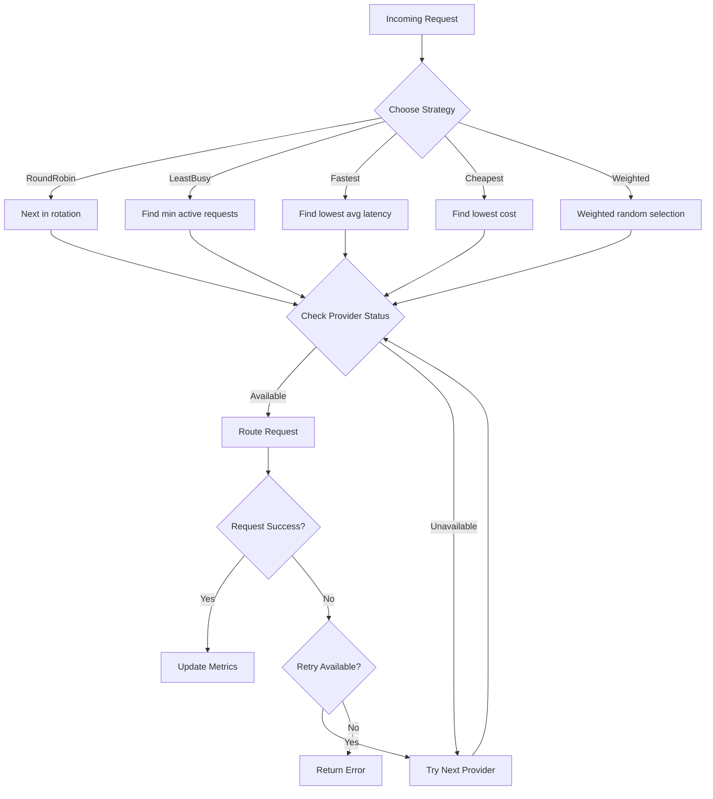

# RFC-0902 (Economics): Multi-Provider Routing and Load Balancing

## Status

Planned

## Authors

- Author: @cipherocto

## Summary

Define routing strategies, load balancing algorithms, and fallback mechanisms for the enhanced quota router to enable intelligent request distribution across multiple LLM providers.

## Dependencies

**Requires:**

**Optional:**

- RFC-0900 (Economics): AI Quota Marketplace Protocol
- RFC-0901 (Economics): Quota Router Agent Specification
- RFC-0903: Virtual API Key System
- RFC-0904: Real-Time Cost Tracking

## Why Needed

The enhanced quota router must support multiple LLM providers with intelligent routing to:

- Enable provider failover when one is unavailable
- Optimize cost by routing to cheapest provider
- Balance load across providers to avoid rate limits
- Support the quota marketplace (RFC-0900) with dynamic provider discovery

## Scope

### In Scope

- Routing strategies (round-robin, least-busy, latency-based, cost-based)
- Fallback chain configuration
- Provider health checking and cooldown periods
- Weight-based distribution
- Per-request routing metadata

### Out of Scope

- Provider API implementation (handled by provider modules)
- Cost tracking (RFC-0904)
- Market-based dynamic routing (future phase)

## Design Goals

| Goal | Target | Metric |
|------|--------|--------|
| G1 | <10ms routing decision | Routing latency |
| G2 | 99.9% request success | With fallback enabled |
| G3 | Support 10+ providers | Provider count |
| G4 | Configurable per-key | Routing policy flexibility |

## Specification

### Routing Strategies

```rust
/// Supported routing strategies
enum RoutingStrategy {
    /// Round-robin through available providers
    RoundRobin,

    /// Route to provider with fewest active requests
    LeastBusy,

    /// Route to fastest responding provider (based on recent latency)
    Fastest,

    /// Route to cheapest provider (requires RFC-0904)
    Cheapest,

    /// Weighted distribution based on configured weights
    Weighted,

    /// Custom rules (future extension)
    Custom,
}
```

### Configuration

```yaml
# router_settings in config.yaml
router_settings:
  routing_strategy: "least-busy"  # default

  # Fallback configuration
  fallback:
    enabled: true
    max_retries: 3
    retry_delay_ms: 100
    backoff_multiplier: 2.0
    max_backoff_ms: 5000

  # Provider weights for weighted routing
  weights:
    openai: 10
    anthropic: 5
    google: 3

  # Health check configuration
  health_check:
    enabled: true
    interval_seconds: 30
    timeout_ms: 5000
    cooldown_seconds: 60  # Disable provider after failure

  # Latency tracking
  latency_window: 100  # Track last N requests
```

### Provider State

```rust
struct ProviderState {
    name: String,
    status: ProviderStatus,  // Available, RateLimited, Error, Cooldown

    // Metrics
    active_requests: u32,
    avg_latency_ms: f64,
    success_rate: f64,

    // Health check
    last_health_check: DateTime<Utc>,
    consecutive_failures: u32,
}
```

### Request Flow



### OpenAI-Compatible API Support

The router must expose OpenAI-compatible endpoints:

```rust
// Required endpoints for LiteLLM compatibility
POST /v1/chat/completions  // Route to selected provider
POST /v1/embeddings       // Route to embedding provider
GET  /v1/models           // List available models across providers
```

### LiteLLM Compatibility

> **Critical:** Must track LiteLLM's Python interfaces for drop-in replacement.

Reference LiteLLM's routing configuration:
- Model list format matches `model_list` in LiteLLM config
- Router settings map to LiteLLM's `router_settings`
- Same `/chat/completions`, `/embeddings` endpoints

## Key Files to Modify

| File | Change |
|------|--------|
| `crates/quota-router-cli/src/router.rs` | New - routing logic |
| `crates/quota-router-cli/src/config.rs` | Add router settings |
| `crates/quota-router-cli/src/providers.rs` | Add health checking |

## Future Work

- F1: Market-based dynamic routing (query marketplace for best price)
- F2: Custom routing rules engine
- F3: A/B testing routing strategies

## Rationale

Multi-provider routing is essential for:
1. **Reliability** - Fallback prevents single-provider failures
2. **Cost optimization** - Route to cheapest when possible
3. **Rate limit avoidance** - Distribute across providers
4. **LiteLLM migration** - Match LiteLLM's routing capabilities

---

**Planned Date:** 2026-03-12
**Related Use Case:** Enhanced Quota Router Gateway
**Related Research:** LiteLLM Analysis and Quota Router Comparison
