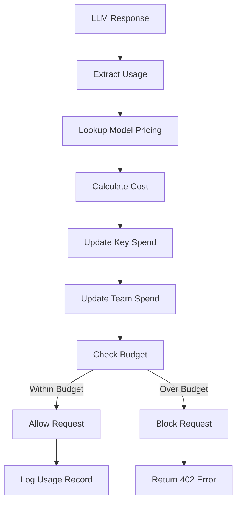

# RFC-0904 (Economics): Real-Time Cost Tracking

## Status

Planned

## Authors

- Author: @cipherocto

## Summary

Define the real-time cost tracking system for the enhanced quota router, including model pricing, token counting, spend aggregation, and budget enforcement.

## Dependencies

**Requires:**

- RFC-0900 (Economics): AI Quota Marketplace Protocol
- RFC-0901 (Economics): Quota Router Agent Specification
- RFC-0903: Virtual API Key System (for per-key budgets)

**Optional:**

- RFC-0902: Multi-Provider Routing (for cost-based routing)

## Why Needed

The enhanced quota router must track costs to:

- Enforce per-key budgets
- Calculate spend for billing
- Enable cost-based routing
- Support OCTO-W balance (RFC-0900)
- Provide usage analytics

## Scope

### In Scope

- Model pricing database (100+ models)
- Token counting (input + output)
- Real-time spend calculation
- Per-key, per-team, per-user aggregation
- Budget enforcement (block when exhausted)
- Usage logging

### Out of Scope

- Billing invoicing (future)
- Multi-currency support (future)
- Cost analytics dashboard (future)

## Design Goals

| Goal | Target | Metric |
|------|--------|--------|
| G1 | <5ms cost calculation | Latency |
| G2 | Accurate to 99% | Cost accuracy |
| G3 | Atomic budget updates | No overspend |
| G4 | 100+ models | Model coverage |

## Specification

### Model Pricing

```rust
struct ModelPricing {
    provider: String,        // "openai", "anthropic", etc.
    model: String,          // "gpt-4o", "claude-3-opus", etc.

    // Pricing per 1M tokens
    input_price_per_1m: f64,
    output_price_per_1m: f64,

    // Alternative pricing (if applicable)
    batch_price_per_1m: Option<f64>,
}

impl ModelPricing {
    fn calculate_cost(&self, input_tokens: u32, output_tokens: u32) -> f64 {
        let input_cost = (input_tokens as f64 / 1_000_000.0) * self.input_price_per_1m;
        let output_cost = (output_tokens as f64 / 1_000_000.0) * self.output_price_per_1m;
        input_cost + output_cost
    }
}
```

### Usage Record

```rust
struct UsageRecord {
    id: Uuid,

    // Attribution
    key_id: Uuid,
    team_id: Option<Uuid>,
    user_id: Option<String>,

    // Request details
    provider: String,
    model: String,

    // Token usage
    input_tokens: u32,
    output_tokens: u32,
    total_tokens: u32,

    // Cost
    cost: f64,
    cost_type: CostType,  // USD or OCTO-W

    // Timing
    timestamp: DateTime<Utc>,
    latency_ms: u32,

    // Metadata
    request_id: Option<String>,
}
```

### Cost Calculation Flow



### Budget Enforcement

```rust
async fn check_budget(
    key: &ApiKey,
    estimated_cost: f64,
) -> Result<(), BudgetError> {
    // Get current spend
    let current_spend = get_current_spend(key.key_id).await?;

    // Check against limit
    let remaining = key.budget_limit - current_spend;

    if remaining < estimated_cost {
        return Err(BudgetError::InsufficientBudget {
            remaining,
            required: estimated_cost,
        });
    }

    Ok(())
}
```

### API Endpoints

```rust
// Usage and spend
GET  /spend/key/{key_id}           // Get key spend
GET  /spend/team/{team_id}         // Get team spend
GET  /spend/user/{user_id}         // Get user spend
GET  /spend/current                // Get current period spend

// Budget management
PUT  /key/{key_id}/budget          // Update key budget
PUT  /team/{team_id}/budget       // Update team budget
```

### LiteLLM Compatibility

> **Critical:** Must track LiteLLM's cost tracking API.

Reference LiteLLM's spend tracking:
- `x-litellm-response-cost` header
- Per-key spend in database
- Budget enforcement via `litellm.max_budget`
- Usage tracking via `litellm.success_callback`

### Pricing Data

Maintain pricing data for 100+ models:
- OpenAI models (GPT-4, GPT-3.5, etc.)
- Anthropic models (Claude 3, Claude 2, etc.)
- Google models (Gemini, etc.)
- AWS Bedrock models
- Azure OpenAI models

Pricing should be synced from authoritative sources regularly.

### Persistence

> **Critical:** Use CipherOcto/stoolap as the persistence layer.

All usage and spend data stored in stoolap:
- Model pricing table
- Usage records table
- Aggregated spend tables

## Key Files to Modify

| File | Change |
|------|--------|
| `crates/quota-router-cli/src/pricing.rs` | New - model pricing |
| `crates/quota-router-cli/src/cost.rs` | New - cost calculation |
| `crates/quota-router-cli/src/spend.rs` | New - spend tracking |
| `crates/quota-router-cli/src/budget.rs` | New - budget enforcement |

## Future Work

- F1: Budget alerts (Slack, email)
- F2: Budget auto-reset (daily, weekly, monthly)
- F3: OCTO-W price feed integration
- F4: Cost analytics dashboard

## Rationale

Real-time cost tracking is essential for:

1. **Budget enforcement** - Prevent overspend
2. **Multi-tenant billing** - Track per-key usage
3. **OCTO-W integration** - Track token balance (RFC-0900)
4. **Cost optimization** - Enable cost-based routing
5. **LiteLLM migration** - Match spend tracking features

---

**Planned Date:** 2026-03-12
**Related Use Case:** Enhanced Quota Router Gateway
**Related Research:** LiteLLM Analysis and Quota Router Comparison
