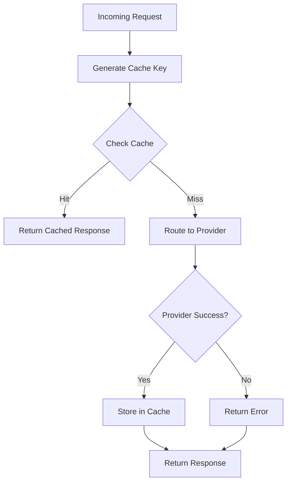

# RFC-0906 (Economics): Response Caching

## Status

Planned

## Authors

- Author: @cipherocto

## Summary

Define the response caching system for the enhanced quota router to reduce costs, improve latency, and enable offline operation.

## Dependencies

**Requires:**


**Optional:**

- RFC-0900 (Economics): AI Quota Marketplace Protocol
- RFC-0901 (Economics): Quota Router Agent Specification
- RFC-0904: Real-Time Cost Tracking (for cache savings metrics)

## Why Needed

Response caching reduces:

- **Costs** - Avoid repeated API calls for same prompts
- **Latency** - Serve cached responses instantly
- **Rate limits** - Reduce API calls to providers
- **Offline operation** - Serve cached responses when provider is down

## Scope

### In Scope

- Request/response caching
- Cache key generation
- TTL (time-to-live) configuration
- Cache invalidation
- Cache statistics

### Out of Scope

- Distributed cache (future)
- Cache warming (future)
- Semantic caching (future)

## Design Goals

| Goal | Target | Metric |
|------|--------|--------|
| G1 | <1ms cache hit | Read latency |
| G2 | 50%+ cache hit rate | Cache efficiency |
| G3 | Configurable TTL | Flexibility |
| G4 | Atomic updates | Consistency |

## Specification

### Cache Key Generation

```rust
fn generate_cache_key(
    provider: &str,
    model: &str,
    messages: &[Message],
    params: &CompletionParams,
) -> String {
    // Normalize request
    let normalized = normalize_request(provider, model, messages, params);

    // Hash
    let hash = sha256(serde_json::to_string(&normalized));

    format!("cache:{}:{}", provider, hash)
}

fn normalize_request(
    provider: &str,
    model: &str,
    messages: &[Message],
    params: &CompletionParams,
) -> NormalizedRequest {
    // Sort messages by role + content (ignore order)
    // Remove non-deterministic fields (e.g., timestamps)
    // Normalize parameter values
}
```

### Cache Entry

```rust
struct CacheEntry {
    key: String,

    // Request metadata
    provider: String,
    model: String,

    // Cached response
    response: CachedResponse,

    // TTL
    created_at: DateTime<Utc>,
    ttl_seconds: u32,

    // Stats
    hit_count: u32,
}

struct CachedResponse {
    content: String,
    usage: Usage,
    finish_reason: String,
    model: String,
}
```

### Cache Configuration

```yaml
# Caching configuration
litellm_settings:
  cache: true
  cache_params:
    # Cache type
    type: "stoolap"  # only stoolap for now, any other value replaced by stoolap

    # Default TTL (seconds)
    default_ttl: 3600

    # Max cache size
    max_size_mb: 100

    # Cache by params
    cache_by:
      - model
      - messages

    # Don't cache these
    no_cache_params:
      - temperature  # if temperature > 0

    # TTL by model
    ttl_by_model:
      gpt-4o: 1800
      gpt-3.5-turbo: 3600
```

### Cache Lookup Flow



### Cache Invalidation

```rust
// Manual invalidation
fn invalidate_cache(key: &str) -> Result<()>;

// By model
fn invalidate_model(model: &str) -> Result<()>;

// By key (API key holder)
fn invalidate_key(key_id: Uuid) -> Result<()>;

// Clear all
fn clear_cache() -> Result<()>;
```

### API Endpoints

```rust
// Cache management
DELETE /cache/{cache_key}  // Invalidate specific entry
DELETE /cache/model/{model} // Invalidate model cache
DELETE /cache               // Clear all cache
GET   /cache/stats         // Get cache statistics
```

### LiteLLM Compatibility

> **Critical:** Must track LiteLLM's caching API.

Reference LiteLLM's caching:
- `litellm.cache` for cache initialization
- `cache: true` in params
- `ttl` parameter
- Redis cache support

## Persistence

> **Critical:** Use CipherOcto/stoolap as the persistence layer.

Cache stored in stoolap:
- Cache entries table
- Cache statistics table

Note: stoolap provides Redis-like caching capabilities for the Rust backend.

## Key Files to Modify

| File | Change |
|------|--------|
| `crates/quota-router-cli/src/cache.rs` | New - caching logic |
| `crates/quota-router-cli/src/cache_key.rs` | New - key generation |
| `crates/quota-router-cli/src/cache_config.rs` | New - cache settings |

## Future Work

- F1: Distributed cache (multiple router instances)
- F2: Cache warming (prefetch popular requests)
- F3: Semantic caching (embedding-based)
- F4: Cache analytics

## Rationale

Response caching is important for:

1. **Cost reduction** - Avoid duplicate API calls
2. **Latency improvement** - Instant responses on cache hit
3. **Rate limit conservation** - Fewer provider calls
4. **Offline support** - Serve cached when provider down
5. **LiteLLM migration** - Match caching features

---

**Planned Date:** 2026-03-12
**Related Use Case:** Enhanced Quota Router Gateway
**Related Research:** LiteLLM Analysis and Quota Router Comparison
